# 2. Navigating Ambiguity 🟢

> **What you'll learn:**
> - Why ambiguity is the *defining feature* of Staff-level work — and why it's intentional
> - A repeatable framework for turning vague business signals into structured technical plans
> - How to define the "What" and the "Why" before anyone talks about the "How"
> - The psychology of organizational alignment: why people resist clarity and how to work with that

---

## The Nature of Ambiguity at Staff Level

At the Senior level, ambiguity is a failure of management. If your tickets are unclear, your sprint planning is broken. At the Staff level, **ambiguity is the raw material of your job**. You are paid to be the person who walks into a fog and builds a road.

Consider the difference:

| Level | What you receive | What you deliver |
|---|---|---|
| Junior | "Add a retry button to this modal. Here's the Figma." | A pull request |
| Mid | "Users are frustrated when uploads fail. Fix the UX." | A design + implementation |
| Senior | "Our upload reliability is poor. Improve it." | A project plan + execution |
| **Staff** | "Improve checkout conversion." | A multi-quarter roadmap across 3 teams |

Notice the progressive collapse of specificity. At Staff, you receive *business symptoms* — not technical problems, not scoped projects, sometimes not even complete sentences. Your job is to:

1. **Diagnose** what the actual problem is (it's often not what they said)
2. **Frame** the problem in a way that enables decision-making
3. **Propose** a solution space (not *the* solution — the *space*)
4. **Align** stakeholders on the direction
5. **Sequence** the work into deliverable chunks
6. **Monitor** execution without micromanaging

This chapter teaches steps 1–3. Chapters 3 and 4 cover steps 4–6.

---

## Why Ambiguity Exists (It's Not Laziness)

Before you learn to navigate ambiguity, you need to understand *why* it exists. Engineers often assume vague directives come from lazy or incompetent leadership. This is almost always wrong, and this assumption will poison your ability to operate at Staff level.

**Ambiguity exists because leaders are abstracting over more variables than you can see.**

When a VP says "Improve checkout conversion," they are compressing the following context:

- The data science team showed that a 2% improvement in checkout conversion would generate $40M/year in incremental revenue
- The company's growth strategy depends on reducing churn in the next two quarters
- Three different teams (Payments, Cart, and Recommendation) all have partial ownership of the checkout funnel
- The VP doesn't know whether the fix is technical (latency? reliability?), product (UX? pricing?), or both
- The VP is deliberately not prescribing a solution because they've learned that prescriptive VPs get worse outcomes than VPs who empower their Staff engineers to diagnose and propose

**Your first job is not to demand more clarity. It is to *create* clarity.**

```mermaid
graph LR
    A["🌫️ Vague Business Signal<br/>'Improve checkout conversion'"] --> B["🔍 Problem Diagnosis<br/>Data gathering, user research,<br/>system analysis"]
    B --> C["📐 Problem Framing<br/>Define the 'What' and 'Why'<br/>Write a 1-pager"]
    C --> D["🗺️ Solution Space<br/>3 options with trade-offs<br/>Write an RFC"]
    D --> E["🤝 Alignment<br/>Stakeholder review<br/>Decision meeting"]
    E --> F["📅 Roadmap<br/>Sequenced quarters<br/>with milestones"]
    F --> G["🚀 Execution<br/>Teams deliver<br/>against the plan"]

    style A fill:#e76f51,color:#fff
    style B fill:#e9c46a,color:#000
    style C fill:#e9c46a,color:#000
    style D fill:#2a9d8f,color:#fff
    style E fill:#2a9d8f,color:#fff
    style F fill:#264653,color:#fff
    style G fill:#2d6a4f,color:#fff
```

---

## The Problem Diagnosis Phase

You've just been told "Improve checkout conversion." Here's what you do.

### Step 1: Ask "Why Now?"

This is the most underrated question in a Staff engineer's toolkit. The answer tells you:
- **Strategic urgency:** Is this tied to a quarterly goal, a board commitment, or a competitive threat?
- **Who cares:** Which leaders are sponsoring this? That determines your political landscape.
- **What's already been tried:** "We tried X last quarter and it didn't work" is critical context.

### Step 2: Get the Data (Don't Trust the Narrative)

> // 💥 CAREER HAZARD: Taking the stated problem at face value without verifying it with data  
> // ✅ FIX: Always triangulate. Pull metrics, talk to users, and read the code — then form your own diagnosis.

The VP said "checkout conversion." But what does the data say?

- Is checkout *starting* less? (Users aren't reaching the checkout page → this is a funnel problem upstream)
- Is checkout *completing* less? (Users are abandoning → this is a UX, latency, or payment reliability problem)
- Is checkout completion stable but *revenue* dropping? (Users are buying cheaper items → this is a recommendation/pricing problem)

Each diagnosis leads to a completely different roadmap. If you skip this step and jump to "let's make checkout faster," you might spend a quarter solving a problem that doesn't exist.

### Step 3: Map the System

Before you can frame the problem, you need to understand the system — both the *technical* system (services, dependencies, data flows) and the *organizational* system (who owns what, who has incentives to help, who will block you).

| Question | Why It Matters |
|---|---|
| Which services are in the critical path? | Determines technical scope |
| Which teams own those services? | Determines organizational scope |
| What are those teams' current priorities? | Determines whether they'll cooperate voluntarily |
| Who is the VP/Director over all involved teams? | Your escalation path if alignment fails |
| What instrumentation exists? | Determines whether you can measure success |

---

## The Problem Framing Phase

You now have data. The next step is the one that separates Staff from Senior: **writing a problem framing document** (sometimes called a "1-pager" or "problem brief").

This document does *not* propose a solution. It proposes a shared understanding of the problem. This is a crucial distinction. Most engineers jump straight to the solution because solutions are more comfortable — they feel like *doing something*. But if you propose a solution before the problem is agreed upon, you'll spend weeks defending your approach against people who disagree with your *premises*, not your conclusions.

### Anatomy of a Problem Framing Document

**Title:** Checkout Conversion Has Declined 8% Quarter-Over-Quarter

**1. Observation (What we see)**
> Checkout conversion rate dropped from 12.3% to 11.3% between Q3 and Q4. This represents approximately $32M in annualized lost revenue based on our current AOV.

**2. Diagnosis (Why we think it's happening)**
> Analysis of the checkout funnel shows:
> - Cart→Checkout entry rate is unchanged (the problem is not upstream)
> - Checkout→Payment submission rate dropped 6% (users are abandoning during checkout)
> - Payment submission→Success rate dropped 2% (payment processing reliability has degraded)
> - The 6% abandonment increase correlates with a p99 latency increase from 1.2s to 3.8s in the address validation service, introduced in the Q3.2 deploy

**3. Scope (Who is affected and how big is the blast radius)**
> - 3 services are involved: Cart Service (Team Alpha), Address Validation Service (Team Bravo), Payment Gateway (Team Charlie)
> - 2 root causes: latency regression in Address Validation and reliability regression in Payment Gateway
> - Estimated revenue recovery: $24M–$32M/year if both issues are resolved

**4. What this document is NOT**
> This document does not propose a specific technical solution. It proposes a shared diagnosis. The goal is to get alignment on the problem before we invest in a roadmap.

### Why This Works

This document achieves several things simultaneously:

1. **It de-risks the conversation.** Nobody needs to commit to a solution yet. You're just asking: "Do we agree this is the problem?"
2. **It quantifies the impact.** The VP who said "improve checkout conversion" now has a document that says "$32M." That number will unlock resources.
3. **It names the teams.** By identifying Team Alpha, Bravo, and Charlie, you've made the organizational scope explicit. This prevents the classic failure mode where a Staff engineer tries to solve a cross-team problem alone.
4. **It sets the stage for an RFC.** Once the problem is agreed upon, you can write an RFC (Chapter 3) that proposes solutions with trade-offs.

---

## The "What" and "Why" Before "How"

This is the first principle that this entire book is built on:

> **First principles: *What* are we trying to achieve, and *Why* does it matter — before *How* we should do it.**

The reason this ordering matters is psychological. When engineers jump to "How," they anchor on a specific solution. Anchoring creates attachment. Attachment creates defensiveness. Defensiveness creates meetings that go in circles.

When you start with "What" and "Why," you create a shared foundation. People can disagree about the how while agreeing about the what. That's a productive disagreement. People disagreeing about the how *because they disagree about the what* — that's a dysfunctional organization.

| Phase | Key Question | Output |
|---|---|---|
| **What** | "What outcome are we trying to achieve?" | Problem framing document |
| **Why** | "Why is this the highest priority use of our time?" | Business case with data |
| **How** | "How should we technically approach this?" | RFC with multiple options |
| **When** | "In what order should we do this?" | Roadmap with milestones |
| **Who** | "Which teams need to do what?" | RACI matrix or team agreements |

---

## The Staff Mindset: Comfortable in the Fog

One of the hardest psychological shifts for new Staff engineers is learning to be *comfortable* with not knowing the answer.

At the Senior level, not knowing the answer is a temporary state — you debug, you research, you find the answer. At the Staff level, **not knowing is your steady state**. You are perpetually operating with incomplete information, partial organizational context, and shifting priorities. The skill isn't finding "the answer" — it's making *good-enough decisions with incomplete data* and *course-correcting as you learn*.

**The Junior/Senior Answer (Tactical):**
> Manager: "What should we do about the checkout conversion problem?"
> Engineer: "I looked at the code and I think we should add caching to the address validation service. I can have a PR up by Friday."

**The Staff Answer (Strategic):**
> Manager: "What should we do about the checkout conversion problem?"
> Engineer: "I've spent two days on this. I've identified two root causes — a latency regression in address validation and a reliability issue in the payment gateway. I've written a one-pager that quantifies the impact at $32M/year. I'd like to share it with the leads from Bravo and Charlie teams this week to validate my diagnosis. If they agree, I'll draft an RFC with three options ranging from a quick fix to a systemic redesign. Can you help me get 30 minutes on the arch review calendar?"

Notice the difference:
- **Senior:** Jumps to code. Solves one piece. Works alone.
- **Staff:** Diagnoses holistically. Quantifies impact. Names stakeholders. Requests alignment. Plans for options. Asks for organizational help.

---

## Common Anti-Patterns When Navigating Ambiguity

| Anti-Pattern | What It Looks Like | Why It Fails |
|---|---|---|
| **Premature Solutioning** | "Let's just rewrite it in Rust" | You haven't validated the problem. You'll build the wrong thing. |
| **Analysis Paralysis** | Spending 3 months gathering data before proposing anything | Perfect information doesn't exist. Act on 70% confidence. |
| **Lone Wolf** | Solving a cross-team problem by yourself | You'll build something nobody adopts because you didn't involve them. |
| **Kitchen Sink** | "While we're at it, let's also redesign the user profile service" | Scope creep kills quarter plans. Solve one problem at a time. |
| **Upward Delegation** | "What do you want me to do?" | You're supposed to be the one who answers that question. |

---

<strong>🏋️ Exercise: From Fog to Roadmap</strong> (click to expand)

### Situational Challenge

Your Director sends you a Slack message at 9 AM on Monday:

> "Hey — the CTO mentioned in the exec meeting that our developer platform is 'too slow.' Three different teams complained in the last town hall. Can you figure out what's going on and come back to me with a plan? No rush but I'd love to discuss by end of next week."

You have no further context. The "developer platform" is an internal tool used by ~400 engineers that includes a CI/CD pipeline, a service scaffolding tool, and a secrets management UI.

**Your task:**
1. Write out the first 5 actions you would take (in order, with rationale).
2. Draft a 4-sentence problem framing you could share by Wednesday (even if incomplete).
3. Identify the biggest risk to your credibility in this situation.

---

🔑 Solution

**1. First 5 actions:**

| # | Action | Rationale |
|---|---|---|
| 1 | Pull platform usage metrics and latency dashboards | Data before opinions. What does "slow" mean in numbers? |
| 2 | Read the town hall complaints (Slack, meeting notes, survey results) | Understand the *user* perception of "slow" — it may differ from what metrics show. |
| 3 | Talk to 3 engineers from different teams (15 min each) | Qualitative data. "Slow" might mean: CI takes 45 min, service scaffolding is confusing, or secrets UI has a terrible UX. |
| 4 | Identify the platform team's current roadmap | If they're already working on this, you should join their effort — not start a parallel one. |
| 5 | Draft a 1-pager problem framing and share with your Director + the platform team lead | Get alignment on the diagnosis before proposing solutions. |

**2. Wednesday problem framing (draft):**

> Developer platform satisfaction has become a CTO-level concern after multiple team complaints at the Q4 town hall. Preliminary analysis shows CI pipeline p50 latency increased from 8 min to 22 min over the last two quarters, correlating with a 3x increase in monorepo size. Additionally, three teams reported that the service scaffolding tool hasn't been updated for our new Kubernetes environment, forcing manual workarounds that take ~2 hours per new service. I'm working with the platform team to validate these findings and will have a scoped RFC by next Friday.

**3. Biggest risk to your credibility:**

Getting sucked into fixing one specific issue (e.g., CI speed) without first validating that it's the *right* issue to fix. If you spend two weeks optimizing CI and the CTO's real concern was service scaffolding, you've wasted time and — worse — demonstrated poor judgment on prioritization. The risk is **premature solutioning.**

// 💥 CAREER HAZARD: Diving into implementation without validating the problem with stakeholders first  
// ✅ FIX: Share a problem framing document early (even imperfect) to calibrate with leadership and avoid wasted cycles

---

> **Key Takeaways**
> - Ambiguity is not a bug — it is the defining characteristic of Staff-level work. Embrace it.
> - Always diagnose before prescribing. Pull data, talk to users, map the system.
> - Write a problem framing document *before* proposing any solution. This prevents premature anchoring and creates organizational alignment.
> - The **What → Why → How** ordering is not pedantic — it's psychologically essential for productive conversations.
> - Act on 70% confidence. Waiting for 100% is analysis paralysis. Course-correct as you learn.

> **See also:**
> - [Chapter 1: The Staff Archetypes](ch01-the-staff-archetypes.md) — Understanding which archetype you operate as informs how you approach ambiguity
> - [Chapter 3: Writing to Scale Yourself](ch03-writing-to-scale-yourself.md) — How to turn your problem framing into an RFC or PRFAQ
> - [Chapter 4: Alignment and the Art of Pushback](ch04-alignment-and-the-art-of-pushback.md) — What to do when stakeholders disagree with your framing
