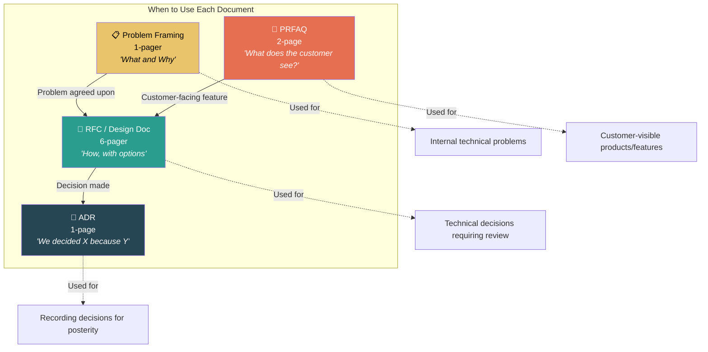

# 3. Writing to Scale Yourself — RFCs & PRFAQs 🟡

> **What you'll learn:**
> - Why written documents are the primary leverage mechanism for Staff+ engineers
> - The anatomy of an RFC, PRFAQ, and Architectural Decision Record (ADR) — and when to use each
> - How to frame technical debt in business metrics that product managers and VPs actually care about
> - The psychology of persuasive technical writing: how to make people *want* to agree with you

---

## Writing Is the Meta-Skill

If Chapter 1 established that a Staff engineer's primary deliverable is organizational clarity, then this chapter establishes the *mechanism*:

**Writing is how Staff engineers scale themselves.**

You can explain your architectural vision in a meeting. Ten people hear it. They remember 40% of what you said by Thursday. They each tell their teams a slightly different version. By next sprint, your vision has become organizational telephone.

You can write your architectural vision in an RFC. Two hundred people can read it. They can comment on it asynchronously. They can reference it six months later when a team is making a decision that needs to be consistent with the strategy. Your vision persists beyond any meeting, any Slack thread, any conversation.

| Communication Mode | Reach | Persistence | Precision | Feedback Quality |
|---|---|---|---|---|
| Slack message | Low | Weeks | Low | Emoji reactions |
| Meeting | Medium | Hours (memory) | Medium | Real-time, unstructured |
| **RFC / Design Doc** | **High** | **Permanent** | **High** | **Written, structured** |
| Code | High | Permanent | Very high | PR reviews |

This is why almost every FAANG company has formalized document-driven decision-making: Amazon's 6-pagers, Google's design docs, Meta's CRs. These aren't bureaucracy — they're *scaling mechanisms for human judgment*.

---

## The Document Landscape

Different documents serve different purposes. Using the wrong format for the situation is a common Staff engineer mistake.



| Document | Length | Audience | Key Question It Answers |
|---|---|---|---|
| **Problem Framing** | 1 page | Your leadership + affected teams | "Do we agree this is the right problem?" |
| **PRFAQ** | 2 pages | Product/business stakeholders | "What will the customer experience?" |
| **RFC / Design Doc** | 4–8 pages | Engineering org | "How should we build this? What are the trade-offs?" |
| **ADR** | 1 page | Future engineers | "We chose X over Y because Z. Here's the context." |

---

## The RFC: Your Primary Weapon

An RFC (Request for Comments) is the standard format for proposing a significant technical change and soliciting feedback from the organization. At Staff level, you'll write several of these per quarter.

### Anatomy of a Great RFC

**Title:** Short, specific, and searchable.
- ❌ "Caching Improvements"
- ✅ "RFC: Replace Redis Write-Through Cache with Read-Aside Pattern in Checkout Service"

**1. Context and Problem Statement** (1 paragraph)
Reference the problem framing document if one exists. State the problem in business terms, not just technical terms.

> The Checkout Service's Redis write-through cache is causing inconsistent reads during peak load, resulting in an estimated $2.4M/year in failed transactions. This RFC proposes replacing it with a read-aside pattern.

**2. Goals and Non-Goals**

| Goals | Non-Goals |
|---|---|
| Reduce checkout failure rate from 3.2% to <0.5% | Redesign the entire caching layer |
| Maintain p99 latency under 200ms during peak | Support multi-region cache consistency (future RFC) |
| Enable the Payments team to operate independently | Migrate off Redis entirely |

Non-goals are as important as goals. They prevent scope creep and set expectations.

**3. Proposed Solution** (2–3 pages)
Describe your recommended approach in enough detail that a Senior engineer could implement it. Include diagrams, API contracts, data flow, and migration steps.

**4. Alternatives Considered** (1 page)

This section is *the most important section for demonstrating Staff judgment*.

| Option | Pros | Cons | Why Not |
|---|---|---|---|
| **A: Read-aside cache (recommended)** | Simple, well-understood, team has experience | Slightly higher latency on cache miss | — |
| **B: Write-behind cache** | Lower latency | Complex failure modes, data loss risk | Risk doesn't justify the latency gain |
| **C: Remove cache entirely** | Simplest architecture | 10x latency increase at peak | Unacceptable for checkout |

The quality of your "Alternatives Considered" section directly reflects your technical maturity. If you only present one option, you haven't thought hard enough. If you present five options but can't clearly explain why you rejected four, you're throwing things at the wall.

**5. Trade-offs and Risks**
Every design has trade-offs. Name them honestly.

**6. Rollout Plan**
How will this be deployed? What's the rollback strategy? What metrics will you monitor to validate success?

**7. Open Questions**
List things you don't know yet. This is a *strength*, not a weakness. It signals intellectual honesty and invites valuable input.

---

## The PRFAQ: Working Backwards from the Customer

The PRFAQ (Press Release / Frequently Asked Questions) is Amazon's invention, but the pattern works everywhere. You write a *fake press release* announcing the feature as if it's already shipped, then answer the questions stakeholders would ask.

### Why It Works

The PRFAQ forces you to think about the *customer outcome* before the technical approach. Engineers who skip this step build things that are technically elegant but don't solve the user's problem.

### Structure

**Press Release (1 page):**
- Headline: What's the announcement?
- Subheading: What's the customer benefit?
- First paragraph: Who is the customer and what problem does this solve?
- Quote from a fictional customer: What does delight look like?
- How it works (customer's perspective, not technical detail)

**FAQ (1 page):**
- Customer FAQs: "Can I do X?" "How is this different from Y?"
- Internal FAQs: "How much will this cost?" "What are the dependencies?" "What's the timeline?"

---

## Architectural Decision Records (ADRs)

ADRs are the most underused tool in a Staff engineer's arsenal. They solve a specific, insidious problem: **decisions rot.**

Six months after a significant technical decision, nobody remembers *why* it was made. A new engineer joins, sees a design they don't agree with, and proposes changing it — not knowing that the original design was a deliberate trade-off to avoid a problem they've never encountered.

### ADR Template

```markdown
# ADR-042: Use Read-Aside Caching in Checkout Service

## Status: Accepted (2025-01-15)

## Context
The Checkout Service uses a Redis write-through cache that causes
inconsistent reads under peak load. See RFC-2025-007 for full analysis.

## Decision
We will replace the write-through cache with a read-aside pattern using
the existing Redis cluster.

## Consequences
- Cache misses will increase p99 latency by ~50ms (acceptable per SLA)
- The Payments team can now deploy independently (unblocked)
- We accept slightly stale reads (up to 5s) during cache population
- Future multi-region consistency work will need a separate RFC

## Alternatives Rejected
- Write-behind: Unacceptable data loss risk for payment data
- No cache: 10x latency increase under load
```

### Good ADRs vs. Bad ADRs

| Aspect | ❌ Bad ADR | ✅ Good ADR |
|---|---|---|
| **Context** | "We need caching" | "Write-through cache causes $2.4M/year in failed transactions" |
| **Decision** | "Use Redis" | "Read-aside pattern with 5s TTL on existing Redis cluster" |
| **Consequences** | "Better performance" | "50ms p99 increase on miss; stale reads up to 5s; unblocks Payments team" |
| **Alternatives** | (absent) | Two rejected options with clear rationale |
| **Status** | (absent) | "Accepted (2025-01-15), supersedes ADR-031" |

---

## Framing Technical Debt as a Business Problem

This is the single most important communication skill for a Staff engineer interacting with product managers, directors, and VPs.

**The hard truth:** Nobody outside of engineering cares about technical debt. They care about *business outcomes*. If you walk into a priorities meeting and say "we need to pay down tech debt," you will lose. Every time.

| ❌ How Engineers Frame It | ✅ How Staff Engineers Frame It |
|---|---|
| "This code is a mess and needs refactoring" | "Our deployment frequency has dropped from 5x/day to 1x/week because of coupling in the checkout module. This is adding 4 days of latency to every feature we ship." |
| "We need to upgrade to the new framework" | "We're on a framework version that loses security support in Q3. After that, every CVE is an unpatched vulnerability in our payment processing system." |
| "The test suite is flaky" | "Our CI failure rate is 34%, which means engineers retry an average of 3 times per PR. With 200 engineers, that's 600 wasted CI hours/week — roughly $180K/year in compute costs alone, not counting the productivity loss." |
| "We should migrate to microservices" | "Our monolith has a 45-minute deploy cycle, which means we can only ship 8 changes per day. The Payments team has 23 features queued that could generate an estimated $8M in annual revenue. At current velocity, that queue won't clear for 7 months." |

**The pattern:** Attach a *dollar amount*, a *time cost*, or a *risk metric* to every piece of technical debt you want to address. PMs don't speak "codebase quality." They speak "revenue impact," "time to market," and "risk."

---

## The Psychology of Persuasive Technical Writing

Great RFCs don't just present information — they *lead the reader to a conclusion*. This isn't manipulation; it's good communication design. Here are the principles:

### 1. Lead with the Pain

Start with the problem, not the solution. If the reader doesn't feel the pain, they won't care about your cure.

### 2. Acknowledge Trade-offs Before Your Critics Do

When you name the downsides of your proposal yourself, you achieve two things:
- You demonstrate honest thinking (which builds trust)
- You defuse objections before they're raised (which speeds up the decision)

### 3. Provide an Easy "No" Path

The "Alternatives Considered" section gives decision-makers permission to disagree with your recommendation. Paradoxically, this makes them *more* likely to agree — because they feel they've genuinely evaluated the options rather than being railroaded.

### 4. Use Concrete Numbers, Not Vague Adjectives

- ❌ "This will significantly improve performance"
- ✅ "This will reduce p99 latency from 3.8s to 200ms"

### 5. End with a Clear Ask

> "I'm requesting review feedback by January 31. If no blocking concerns are raised, I will consider this RFC approved and begin implementation in Sprint 2025-Q1-3."

---

<details>
<summary><strong>🏋️ Exercise: Write a Technical Debt Business Case</strong> (click to expand)</summary>

### Situational Challenge

You're a Staff engineer on the Platform team. You've identified that the company's internal API gateway is running on an unmaintained fork of an open-source project. The fork is 18 months behind upstream, missing critical security patches, and has custom patches that only one engineer (who left the company) understood.

Your Director has asked you to prioritize features for Q2. You want to prioritize migrating off the forked gateway, but you know the Director is under pressure from the CPO to deliver three new API features.

**Your task:**
1. Write a 4-sentence business case that frames this migration in terms the Director's boss (VP of Engineering) would care about.
2. Propose a compromise that addresses both the security risk and the feature pressure.

---

<details>
<summary>🔑 Solution</summary>

**1. Business case (4 sentences):**

> Our API gateway is running on an unmaintained fork that is 18 months behind upstream security patches, including 3 CVEs rated Critical (CVSS 9.0+). Because the only engineer who maintained the fork has left the company, any production incident in the gateway would have zero on-call expertise and an estimated MTTR of 4-8 hours — compared to our SLA of 30 minutes. The gateway processes 100% of our external API traffic ($340M annual GMV). I recommend we allocate 40% of Q2 platform capacity to migrating to managed upstream, which we can run in parallel with 2 of the 3 requested API features.

**2. Compromise:**

| Track | Q2 Allocation | Deliverable |
|---|---|---|
| **Gateway Migration** | 40% (2 engineers) | Phase 1: Shadow traffic on upstream gateway by end of Q2. Phase 2: Full cutover in Q3. |
| **API Features** | 60% (3 engineers) | Deliver Feature A and Feature B. Defer Feature C to Q3 (lowest revenue impact of the three). |
| **Risk mitigation** | Ongoing | Weekly security scan of the forked gateway; pre-written runbook for on-call if a CVE is exploited before migration completes. |

**Why this works:**
- You're not saying "no features." You're saying "two features and reduced existential risk."
- You've quantified the risk ($340M GMV at stake) so the VP can make an informed trade-off.
- You've proposed a phased rollout that shows you understand delivery pressure.
- You've included a mitigation plan for the transition period, which shows operational maturity.

// 💥 CAREER HAZARD: Framing tech debt as "engineering wants to clean up code" — this loses every time against revenue-generating features  
// ✅ FIX: Frame tech debt as business risk with dollar amounts, SLA violations, and customer impact

</details>
</details>

---

> **Key Takeaways**
> - Writing is your primary scaling mechanism. A great RFC reaches 200 people and persists forever. A great meeting reaches 10 people and evaporates by Friday.
> - Use the right document for the situation: Problem Framing → RFC → ADR. Each serves a different phase.
> - The "Alternatives Considered" section of an RFC is where you demonstrate Staff-level judgment.
> - ADRs prevent decision rot. Write them. Your future self and future colleagues will thank you.
> - Frame technical debt in business terms: dollar amounts, time costs, and risk metrics. Never say "the code is messy."

> **See also:**
> - [Chapter 2: Navigating Ambiguity](ch02-navigating-ambiguity.md) — How to build the problem framing that feeds your RFC
> - [Chapter 4: Alignment and the Art of Pushback](ch04-alignment-and-the-art-of-pushback.md) — What to do when your RFC gets pushback
> - [Chapter 9: Reference Card](ch09-reference-card-and-cheat-sheets.md) — A complete RFC template you can copy-paste
