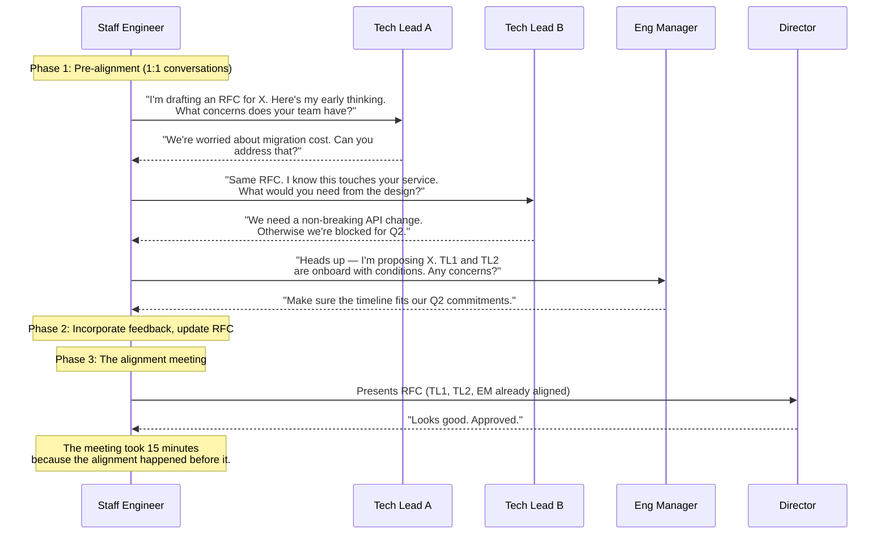

# 4. Alignment and the Art of Pushback 🟡

> **What you'll learn:**
> - How to say "No" without destroying relationships or your reputation
> - The mechanics of managing up to Directors and VPs — what they need from you and how to deliver it
> - Strategies for resolving technical stalemates between senior engineers who are both "right"
> - How to build consensus *before* the meeting — so the meeting is a formality, not a debate

---

## The Alignment Paradox

Here is a paradox that every Staff engineer must internalize:

**You must have strong opinions, loosely held — and you must convince others to hold those opinions without forcing them.**

This is "influence without authority" in its purest form. You don't have hire/fire power. You can't mandate technical decisions. You can't escalate to get your way without burning political capital. And yet, your job requires you to align dozens of engineers, several managers, and multiple product stakeholders on a technical direction.

The engineers who do this well are not the loudest, the most technically brilliant, or the most charismatic. They are the most *prepared*.

---

## Anatomy of Organizational Alignment

Alignment is not a single event — it's a process. The most common mistake Staff engineers make is trying to achieve alignment *in the meeting*. The meeting should be the moment of *ratification*, not *persuasion*.

### The Three Phases of Alignment

| Phase | What Happens | Time Investment |
|---|---|---|
| **1. Pre-alignment** | 1:1 conversations with every stakeholder. Listen to concerns. Incorporate feedback into your proposal. | 60% of your effort |
| **2. Document iteration** | Update your RFC/design doc to reflect what you learned. Send updated draft for async review. | 25% of your effort |
| **3. The meeting** | Present the proposal. Address any remaining concerns. Get a decision. | 15% of your effort |

If you're spending more time in the meeting than in pre-alignment, you're doing it backwards.

---

## The Art of Saying "No"

"No" is the most important word in a Staff engineer's vocabulary — and the most dangerous. Said too often, you become a blocker. Said too rarely, you become a pushover whose teams are buried in underprioritized work. Said the wrong way, you create enemies.

### The Framework: "Yes, And" / "No, Because"

Never say a naked "No." Always pair it with one of these:

| Pattern | When to Use | Example |
|---|---|---|
| **"Yes, and..."** | You agree with the goal but want to modify the approach | "Yes, we should improve checkout speed, *and* I'd recommend we start by profiling the address validation service rather than rewriting the cache layer." |
| **"No, because..."** | You disagree and need to explain why | "No, we shouldn't migrate to microservices this quarter, *because* our observability stack doesn't support distributed tracing yet. Without it, we'll be blind to cross-service failures." |
| **"Not now, because... but here's when"** | You agree with the idea but not the timing | "This is the right direction. I'd recommend we defer it to Q3, *because* the platform team's Q2 is fully committed to the security audit. I'll draft a placeholder RFC so we're ready to start in Q3." |
| **"Not this way, but what about..."** | You disagree with the approach but want to stay constructive | "I don't think a rewrite is the right call here. What if we strangled the legacy service instead? That gives us the same end state with lower risk." |

### The Senior-to-Staff Shift in Pushback

**The Junior/Senior Answer (Tactical):**
> Product Manager: "Can we add real-time notifications to the checkout flow by next sprint?"  
> Engineer: "That's not possible. The notification service doesn't support real-time."

// 💥 CAREER HAZARD: Saying "no" without offering an alternative or explaining trade-offs. PMs hear "this engineer is blocking me."

**The Staff Answer (Strategic):**
> Product Manager: "Can we add real-time notifications to the checkout flow by next sprint?"  
> Engineer: "I'd love to make that happen. Let me level-set on the technical reality and then propose options. The notification service is currently batch-only with a 30-second delay. We have three paths:  
> **Option A (2 sprints):** Add a WebSocket layer to the existing service. Gets us real-time with moderate effort.  
> **Option B (1 sprint):** Use polling with a 5-second interval. Not truly real-time, but perceptually instant for users.  
> **Option C (4 sprints):** Rebuild the notification service with an event-driven architecture. Future-proof but significant investment.  
> I'd recommend **Option B** for next sprint, then evaluate whether the business case justifies **Option A** based on user feedback. What do you think?"

// ✅ FIX: Reframe "No" as "Here are your options with trade-offs." You're not blocking — you're *advising*.

---

## Managing Up: What Directors and VPs Need From You

Managing up is not "telling your boss what they want to hear." It's **providing the right level of abstraction at the right time so your leadership chain can make good decisions.**

### The Key Insight: Your Boss Is Abstracting Over You

Your Director manages 5–8 teams. They cannot hold the technical detail of every project in their head. They rely on you to be their *technical sensorium* — the person who detects problems early, synthesizes information, and surfaces only what requires their attention or decision.

| What Directors Need | What They Don't Need |
|---|---|
| "The migration is on track for Q2. One risk: Team Bravo is under-staffed. I'm working with their EM to re-prioritize, but may need your help if they can't free up capacity." | A 30-minute walkthrough of your Jira board. |
| "I've identified three options for the cache redesign. My recommendation is Option A. I'd like your input on the timeline trade-off before I finalize the RFC." | Permission to proceed on every technical decision. |
| "Heads up — there's a growing disagreement between Teams Alpha and Charlie about the API contract. I'm mediating, but wanted you to know in case it escalates." | Being surprised by a conflict they should have known about a week ago. |

### The Three Things a Director Evaluates You On

1. **Do you reduce my cognitive load?** — Can I trust you to handle the technical strategy for your area without me having to think about it?
2. **Do you surface problems early?** — If something is going wrong, do I hear about it from you first, or do I find out in a leadership meeting?
3. **Do you bring me options, not problems?** — When something needs my input, do you present a structured decision with trade-offs, or do you just say "what should we do?"

---

## Resolving Technical Stalemates

This is one of the hardest situations you'll face as a Staff engineer: two competent, senior engineers who fundamentally disagree on a technical approach — and both have legitimate arguments.

### Why Stalemates Happen

Technical stalemates are rarely about *technology*. They're about one or more of these:

| Root Cause | What It Sounds Like | How to Diagnose |
|---|---|---|
| **Different mental models** | "This is obviously a caching problem" vs. "This is obviously a data modeling problem" | Ask each person: "Walk me through your reasoning from first principles." They'll reveal different assumptions. |
| **Different risk tolerances** | "We can't ship without 99.99% availability" vs. "We need to ship fast and iterate" | Ask: "What's the worst thing that happens if we're wrong?" Their answers will be wildly different. |
| **Ego / territory** | "I've been advocating for this approach for a year" vs. "That approach is outdated" | This is hard to diagnose because people don't admit it. Look for *emotional intensity* disproportionate to the stakes. |
| **Incomplete information** | Both parties are right — about different parts of the system | Bring them into the same room with the same data. Often the stalemate evaporates. |

### Resolution Strategies

**1. Make the decision framework explicit.**

Before debating solutions, agree on *how the decision will be made*. Ask: "What criteria would we use to evaluate these options?" If both parties can agree on the criteria (latency, cost, team capacity, risk), then the debate becomes an objective evaluation against those criteria instead of a subjective argument about preferences.

**2. Timebox the disagreement.**

"We're going to spend 48 hours gathering data on both approaches. Each of you will present a 1-pager to the architecture review on Thursday. We'll make a decision and move on."

The worst outcome of a technical stalemate is *no decision*. A wrong decision is almost always better than no decision, because you can course-correct a wrong decision. You can't course-correct inaction.

**3. Disagree and commit.**

When a decision is made, everyone commits — including the person who disagree. This is Amazon's famous principle, but it works everywhere. The key is that "disagree and commit" is not "shut up and do what you're told." It means:

- You voiced your concerns clearly and they were heard
- The decision-maker considered your input
- The decision went a different way
- You *enthusiastically execute* even though you would have chosen differently
- If your concerns prove valid, you surface them without saying "I told you so"

**Senior approach (tactical):**
> "Fine, we'll do it your way. Don't blame me when it breaks."

// 💥 CAREER HAZARD: Passive-aggressive commitment poisons team trust

**Staff approach (strategic):**
> "I've shared my concerns about the migration timeline and they're on record in the RFC comments. The team has decided to proceed with the aggressive timeline. I'm fully committed to making this succeed — here's what I'll do to de-risk the areas I'm worried about."

// ✅ FIX: Document your dissent professionally, then execute with full commitment

---

## Pre-Wiring: Building Consensus Before the Meeting

"Pre-wiring" is the practice of having 1:1 conversations with key stakeholders before a group decision meeting. This is not backroom dealing — it's *responsible facilitation*.

### Why Pre-Wiring Is Essential

| Without Pre-Wiring | With Pre-Wiring |
|---|---|
| Stakeholders hear your proposal for the first time in the meeting | Stakeholders have already processed the proposal privately |
| Emotional, unstructured reactions ("Wait, this changes our API?!") | Considered, specific feedback ("I had concerns about the API but the v2 draft addresses them") |
| The meeting devolves into debate | The meeting ratifies a decision |
| Takes 60 minutes, ends with "let's schedule a follow-up" | Takes 20 minutes, ends with a decision |
| Hidden objections surface weeks later | Objections surface early and are incorporated |

### The Pre-Wiring Script

When you approach each stakeholder:

1. **Context:** "I'm working on an RFC for X. I want to make sure your team's perspective is reflected."
2. **Listen:** "What would you need from this design to be comfortable with it?" (Not "here's my plan, do you agree?")
3. **Adapt:** If their concern is legitimate, *change your proposal*. If not, prepare a clear response for the meeting.
4. **Preview:** "Here's where I landed after talking to everyone. You'll see your feedback in Section 4. Any remaining concerns?"

The goal is that by the time you walk into the meeting, every key stakeholder has already said "I can live with this" in a 1:1 setting. The meeting becomes a formality.

---

## Mentorship vs. Sponsorship

A Staff engineer who only mentors is doing half the job. You need to understand the difference and do both.

| Dimension | Mentorship | Sponsorship |
|---|---|---|
| **What you do** | Give advice when asked | Advocate for someone when they're not in the room |
| **Typical interaction** | "Here's how I'd approach that design review" | "I think Priya should lead the migration project — she's ready for senior-level scope" |
| **Who benefits** | The mentee learns skills | The sponsee gets *opportunities* |
| **Risk to you** | Low — if your advice is bad, it's on them | High — you're putting your reputation behind someone |
| **Impact** | Individual growth | Organizational talent development |

**Staff engineers must sponsor, not just mentor.** Sponsorship means using your organizational capital to create opportunities for others. It's how you scale your impact beyond what you can personally accomplish.

---

<strong>🏋️ Exercise: The Impossible Meeting</strong> (click to expand)

### Situational Challenge

You're the Staff engineer responsible for the Platform team's technical direction. You've written an RFC to migrate the internal developer portal from a legacy Django application to a modern Rust/Axum service. The RFC has been circulated for two weeks.

The situation:
- **Team Alpha's Tech Lead** strongly supports the migration. They've been blocked by Django's performance limitations for months.
- **Team Bravo's Tech Lead** is strongly opposed. Their team has deep Django expertise and limited Rust experience. They believe the migration will cost them two quarters of productivity.
- **Your Engineering Manager** is neutral but worried about the timeline.
- **The VP** has asked you to "figure it out and come to me with a recommendation."

You have a meeting in 48 hours where all parties will be present.

**Your task:**
1. Write out your pre-wiring plan: Which 1:1s do you have? In what order? What do you say in each?
2. What compromise could satisfy both Tech Leads?
3. Draft the opening statement for the meeting (3 sentences).

---

🔑 Solution

**1. Pre-wiring plan (in order):**

| # | Who | When | What You Say |
|---|---|---|---|
| 1 | **Team Bravo's Tech Lead** | 36 hours before meeting | "I hear your concern about the productivity hit. Help me understand: is it the Rust learning curve specifically, or the migration disruption in general? If I could propose a phased approach where your team stays on Django for Q2 and Q3, with a gradual migration path that includes pairing sessions and Rust training, would that change your position?" |
| 2 | **Your EM** | 30 hours before meeting | "I've talked to both leads. I'm going to propose a phased migration with a 6-month bridge period where both stacks run in parallel. This addresses Bravo's concern about productivity loss without blocking Alpha. Does this fit within the timeline constraints you're worried about?" |
| 3 | **Team Alpha's Tech Lead** | 24 hours before meeting | "I want to set expectations: the RFC is going to be modified to a phased approach. Bravo gets a transition period. I know this isn't as fast as you want, but it ensures we get genuine buy-in rather than forced compliance. Are you okay with Phase 1 being API-layer migration while Django remains for Bravo's backend?" |
| 4 | **The VP** | (only if needed) | "I have alignment from both leads on a phased approach. I'll present it in Thursday's meeting. You shouldn't need to attend." |

**2. Compromise:**

Phase the migration with an explicit contract:

| Phase | Timeline | What Happens | Bravo's Commitment |
|---|---|---|---|
| Phase 1 | Q2 | Migrate API gateway to Axum. Django backend unchanged. | Bravo team does a Rust workshop + one small Rust service |
| Phase 2 | Q3 | Bravo's 2 highest-traffic Django services get Rust rewrites | Bravo assigns 2 engineers full-time to Rust migration |
| Phase 3 | Q4 | Remaining Django services migrate. Legacy stack decommissioned. | Full team on Rust |

**Why this works:** Alpha gets the API layer migrated immediately (their biggest pain point). Bravo gets 6 months to ramp up on Rust (their biggest concern). Both feel heard.

**3. Opening statement for the meeting:**

> "Thank you all for your feedback on the migration RFC. After 1:1 conversations with both team leads, I've revised the proposal to a three-phase approach that delivers Alpha's API-layer migration in Q2 while providing Bravo with a structured Rust ramp-up period. I'd like to walk through the revised plan, confirm that it addresses the concerns we discussed, and leave with an approved timeline."

// 💥 CAREER HAZARD: Walking into a contentious meeting without pre-wiring — you'll get blindsided by objections  
// ✅ FIX: 60% of alignment work happens in 1:1 conversations before the group meeting

---

> **Key Takeaways**
> - Alignment happens *before* the meeting. If you're debating in the room, you didn't pre-wire enough.
> - Never say a naked "No." Always pair it with an alternative, a timeline, or a rationale.
> - Managing up means reducing your Director's cognitive load. Bring options, not problems. Surface risks early, not late.
> - Technical stalemates are rarely about technology. Diagnose the underlying root cause (mental models, risk tolerance, ego, incomplete data).
> - "Disagree and commit" means documenting your dissent professionally and then executing with full energy.
> - Sponsor people, don't just mentor them. Use your organizational capital to create opportunities.

> **See also:**
> - [Chapter 3: Writing to Scale Yourself](ch03-writing-to-scale-yourself.md) — The documents you'll pre-wire around
> - [Chapter 5: Managing Cross-Team Dependencies](ch05-managing-cross-team-dependencies.md) — When alignment fails and you need escalation strategies
> - [Chapter 7: Mastering the Behavioral Loop](ch07-mastering-the-behavioral-loop.md) — How to tell an alignment story in an interview
