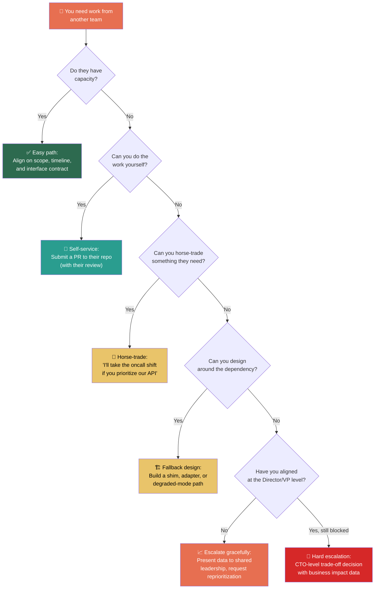

# 5. Managing Cross-Team Dependencies 🔴

> **What you'll learn:**
> - Why cross-team dependencies are the #1 killer of ambitious engineering projects — and the structural reasons behind it
> - A toolkit of strategies: horse-trading, escalation ladders, interface contracts, and fallback mechanisms
> - How to get work done from a team that has zero incentive to help you
> - The art of designing systems that *minimize* cross-team coupling in the first place

---

## The Structural Problem

At the Senior level, your dependencies are mostly *within* your team: another engineer needs to finish the database schema before you can build the API. These dependencies are managed through sprint planning, standups, and direct conversation.

At the Staff level, your dependencies are *between* teams — and this changes everything:

| Dimension | Intra-Team Dependency | Cross-Team Dependency |
|---|---|---|
| **Shared manager** | Yes | Usually no |
| **Shared sprint** | Yes | No |
| **Shared incentives** | Usually | Rarely |
| **Communication overhead** | Low (same Slack channel) | High (different channels, meetings, timezones) |
| **Resolution speed** | Hours to days | Weeks to quarters |
| **Escalation path** | Your mutual team lead | Multiple hops up the management chain |

**The fundamental problem:** Team Bravo has their own roadmap, their own OKRs, their own VP breathing down their neck about Q2 deliverables. Your project — however important to *your* VP — is not on *their* VP's radar. You need 3 sprints of their time. They have zero sprints to spare.

This is not a people problem. It is a *structural incentive* problem. And understanding that distinction is the difference between a Staff engineer who gets blocked and a Staff engineer who gets unblocked.

---

## The Dependency Resolution Toolkit



### Strategy 1: The Interface Contract

Before asking for *work*, ask for an *agreement*.

Define the interface between your system and theirs: the API contract, the data format, the SLA. If both teams agree on the interface, you can build against it independently. This is the single most effective dependency reduction technique.

**The Senior approach:**
> "Hey Team Bravo, we need you to build an endpoint that returns user payment methods. Can you add that to your sprint?"

**The Staff approach:**
> "Team Bravo, here's a proposed interface contract for the payment methods query we need. I've written it as an OpenAPI spec. If you agree to this contract, my team will build a mock implementation to unblock ourselves while you implement the real version on your timeline. I've also included the contract tests your team can use to validate the implementation. Would you review the spec by Thursday?"

The Staff approach:
- Doesn't require Bravo to drop everything
- Gives Bravo a clear, specified deliverable (not a vague request)
- Unblocks your team immediately via mocking
- Provides Bravo with ready-made tests (you're making their job easier)

### Strategy 2: Horse-Trading

Horse-trading is the exchange of favors between teams. It's the informal economy of engineering organizations, and Staff engineers who master it can move mountains.

| What You Need | What You Can Offer |
|---|---|
| 2 sprints of backend work from Team Bravo | Your team takes over Bravo's on-call rotation for 2 months |
| Team Charlie's data pipeline expertise | You write the ADR and runbook for Charlie's new service |
| Priority access to the Platform team's sprint | You contribute a PR to the platform that addresses a long-standing bug they haven't had time to fix |
| QA resources from Team Delta | Your team mentors Delta's two new hires on the testing framework |

**The key insight:** Horse-trading works because it converts a *zero-sum* game (limited engineering capacity) into a *positive-sum* game (both teams get something they value). The Staff engineer's job is to identify creative trades that nobody else sees.

### Strategy 3: Self-Service (The "Guest PR" Model)

If Team Bravo can't do the work, ask if you can do it yourself — in their codebase, with their review.

This requires:
- *Humility:* You're writing code in someone else's house. Follow their conventions, their style, their testing patterns.
- *Trust:* Bravo needs to believe you won't break their system. Show them your track record. Start with a small PR to establish credibility.
- *Process:* Agree on a review SLA. A Guest PR that sits in review for 3 weeks doesn't solve your problem.

### Strategy 4: Design Around It (Fallback Mechanisms)

Sometimes the best way to handle a cross-team dependency is to eliminate it.

| Dependency | Fallback Design |
|---|---|
| "We need Team Bravo's Real-Time Event Bus" | Build a polling adapter that checks their database every 5 seconds. Swap to the event bus later when it's ready. |
| "We need Team Charlie's new Auth Service" | Build against the existing auth system with an interface layer. When the new service launches, swap the implementation — no business logic changes. |
| "We need the Data team's ML model" | Launch with a rules-based heuristic. Replace with the ML model in Phase 2. |

The pattern: **Build an adapter, shim, or degraded-mode path that lets you ship without the dependency, while designing for easy integration later.**

This is an architectural decision, and it comes with trade-offs (the fallback adds complexity, the shim may need to be maintained, the degraded mode may not fully achieve the business goal). A Staff engineer names these trade-offs explicitly in the RFC.

### Strategy 5: Graceful Escalation

Sometimes you've tried everything and you're still blocked. It's time to escalate.

**Graceful escalation is not "tattling." It is *providing decision-makers with the information they need to make a trade-off*.**

The wrong way to escalate:
> "Team Bravo refuses to help us. They're blocking our project."

// 💥 CAREER HAZARD: Framing escalation as blame. This makes Bravo defensive and makes you look like you can't resolve conflicts.

The right way to escalate:
> "Our checkout conversion project requires a payment methods API from Team Bravo. Bravo's Q2 is fully committed to their compliance audit (which I understand is VP-mandated). I've explored four alternatives: self-service PR (Bravo's codebase is too complex for a guest contribution), horse-trading (we don't have anything Bravo needs this quarter), building a fallback (would delay the project by one quarter and reduce expected revenue recovery by 40%). I'd like to request a Director-level discussion to evaluate whether reprioritizing 2 sprints of Bravo's capacity has a higher ROI than the compliance audit's original timeline."

This escalation:
- Names the business impact
- Shows you've already tried multiple resolution paths
- Frames it as a *resource allocation decision*, not a blame game
- Gives the Director the data they need to make a call

---

## The Dependency Map: Your Early Warning System

Staff engineers who consistently deliver on cross-team projects all do one thing that others don't: **they map dependencies before work begins**.

### How to Build a Dependency Map

For every project that involves more than one team:

| Question | Answer Format |
|---|---|
| Which teams must do work for us to succeed? | List of teams + estimated effort |
| Which teams must *not break things* for us to succeed? | List of teams + specific interfaces |
| What is each team's current priority? | Their Q-level goal or VP directive |
| Who is the decision-maker for each team's capacity? | Name + level |
| What is our fallback if each dependency fails? | Design alternative or timeline impact |

Build this map in Week 1 of the project. Share it with your leadership. Update it monthly. This single artifact will save you more pain than any other planning tool.

---

## Designing Systems to Minimize Cross-Team Coupling

The best way to manage cross-team dependencies is to have fewer of them.

| Coupling Pattern | Problem | Decoupled Alternative |
|---|---|---|
| **Synchronous API calls between teams** | Team A can't deploy without Team B's service being up | Async messaging (events, queues) |
| **Shared database** | Schema changes break multiple teams | Each team owns its data; share via APIs or events |
| **Shared library maintained by one team** | Library upgrades become coordination nightmares | Interface-based contracts; each team can choose their implementation |
| **Monorepo without clear ownership** | "Who broke the build?" becomes a daily question | Monorepo with CODEOWNERS and team-scoped build targets |

**First principles:** Every time two teams must coordinate to ship, you've introduced a *communication bottleneck* proportional to the number of people involved (see: Brooks's Law). The Staff architect's job is to push coupling down to the *interface* level — agreed contracts that allow independent deployment and independent evolution.

---

<details>
<summary><strong>🏋️ Exercise: The Reluctant Dependency</strong> (click to expand)</summary>

### Situational Challenge

You're leading a project to add a "Buy Now, Pay Later" (BNPL) option to the checkout flow. This is a VP-sponsored initiative projected to generate $15M in incremental annual revenue.

The project requires:
- **Your team (Checkout):** Build the BNPL UI and orchestration logic (6 sprints)
- **Team Payments:** Integrate with the BNPL provider's API (4 sprints)
- **Team Risk:** Add BNPL-specific fraud detection rules (3 sprints)

Status after 2 weeks of project kickoff:
- Your team is on track.
- Team Payments agreed to start in Sprint 3 but has now pushed to Sprint 7 because their VP mandated a P0 PCI compliance remediation.
- Team Risk says they can start on time but only if they get the fraud rule schema from Team Payments first — which is now delayed.

You're now looking at a 4-sprint delay that pushes the project past the Q3 revenue target.

**Your task:**
1. Map out the full dependency chain and identify the critical path.
2. Propose two different resolution strategies.
3. Draft a 3-sentence escalation message to your Director.

---

<details>
<summary>🔑 Solution</summary>

**1. Dependency chain and critical path:**

```
Your team (Checkout): [Sprint 1 ====== Sprint 6] ← Can start immediately
Team Payments:        [Sprint 7 ========== Sprint 10] ← Blocked by PCI until Sprint 7
Team Risk:            [Sprint ? ... waiting on Payments schema] ← Blocked by Payments

Critical path: Payments (Sprint 7-10) → Risk (Sprint 11-13) → Integration (Sprint 14)
Original critical path: Payments (Sprint 3-6) → Risk (Sprint 7-9) → Integration (Sprint 10)
Delay: 4 sprints (≈ 2 months)
```

**2. Two resolution strategies:**

**Strategy A: Parallel unblocking via interface contract**
- Work with Team Payments to define the BNPL API contract and fraud rule schema *now*, even though implementation is delayed.
- Team Risk begins building against the schema mock immediately (starts Sprint 3, not Sprint 11).
- Your team builds against the Payments API mock.
- When Payments finishes their implementation in Sprint 10, both Risk and Checkout are ready for integration.
- **New critical path:** Payments Sprint 7-10 → Integration Sprint 11 (saves 3 sprints)
- **Trade-off:** If Payments changes the schema during implementation, Risk and Checkout may need rework.

**Strategy B: Fallback BNPL with reduced scope**
- Launch BNPL with a simplified integration: direct API call to the BNPL provider from your Checkout service, bypassing the Team Payments orchestration layer.
- Use a rules-based fraud check (hardcoded thresholds) instead of Team Risk's ML-based detection.
- Ship v1 by Q3. Migrate to the proper Payments/Risk integration in Q4.
- **Trade-off:** Higher fraud exposure ($200K-$500K estimated), technical debt of the temporary integration, and potential issues if the BNPL provider changes their API.

**Recommendation:** Strategy A first (lower risk, preserves architecture). If Payments can't commit to a stable schema by Sprint 3, fall back to Strategy B.

**3. Escalation message:**

> The BNPL project ($15M annual revenue target) is at risk of a 4-sprint delay because Team Payments' PCI compliance remediation has pushed their start date from Sprint 3 to Sprint 7. I've developed a parallel-path strategy that reduces the delay to 1 sprint by having Payments define the API contract now while continuing PCI work, but I need your help getting Payments' EM to commit their tech lead to 2 days of schema design this sprint. If we can't get the schema locked down by Sprint 3, I have a fallback plan that ships a simplified v1 on the original timeline with some additional fraud exposure that I'd want to discuss with the Risk VP.

// 💥 CAREER HAZARD: Waiting passively for the blocked team to clear their plate. By the time they do, your project has missed the quarter.  
// ✅ FIX: Identify the minimum unblocking action (schema definition, not full implementation) and push for that immediately.

</details>
</details>

---

> **Key Takeaways**
> - Cross-team dependencies fail because of *structural incentive misalignment*, not bad people. Diagnose the structure, not the character.
> - Use the resolution toolkit in order: interface contracts → horse-trading → self-service PRs → fallback design → graceful escalation.
> - Map dependencies in Week 1 of every project. This is your early warning system.
> - Escalation is not blame. It's providing decision-makers with trade-off data they can act on.
> - Design systems to minimize cross-team coupling. Push coordination to the interface level.

> **See also:**
> - [Chapter 4: Alignment and the Art of Pushback](ch04-alignment-and-the-art-of-pushback.md) — The alignment skills you need before dependencies become problems
> - [Chapter 6: Incident Command and Blameless Culture](ch06-incident-command-and-blameless-culture.md) — What happens when a cross-team dependency fails in production
> - [Chapter 3: Writing to Scale Yourself](ch03-writing-to-scale-yourself.md) — How to write the interface contracts and RFCs that manage dependencies
