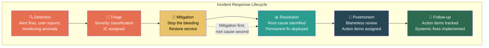

# 6. Incident Command and Blameless Culture 🔴

> **What you'll learn:**
> - How to lead during a Sev-1 outage: the Incident Commander role, communication cadence, and decision-making under fire
> - The psychology of blameless postmortems — and why "blameless" doesn't mean "accountabilityless"
> - How to shift an organization from "Who caused this?" to "What systemic guardrails failed?"
> - Writing Correction of Errors (COEs) and postmortems that actually prevent recurrence

---

## Why Incident Leadership Is a Staff-Level Competency

Most engineers encounter incidents as *participants* — they get paged, they debug, they fix the problem, they go back to sleep. The Staff engineer's role in an incident is fundamentally different. You are the **Incident Commander (IC)**: the person responsible for coordinating the response, making triage decisions, communicating with stakeholders, and ensuring that the incident results in lasting organizational improvement.

Incident command is where every Staff competency in this book converges:

| Competency | How It Shows Up During an Incident |
|---|---|
| Navigating ambiguity (Ch 2) | The scope of the outage is unclear. You must make decisions with partial information. |
| Writing to scale (Ch 3) | You draft real-time status updates that reach hundreds of people. You write the postmortem. |
| Alignment and pushback (Ch 4) | You must align 15 engineers on a mitigation strategy in real time. You must push back on VPs who want a premature "all clear." |
| Cross-team dependencies (Ch 5) | The fix requires coordination across 3 teams who don't normally work together. |

---

## The Incident Command Framework

### Severity Classification

Before you can lead an incident, you need a shared language for severity.

| Severity | Impact | Response Expectation | Communication Cadence |
|---|---|---|---|
| **Sev-1 (Critical)** | Revenue-impacting outage. Multiple customers affected. Data loss risk. | All-hands response. IC assigned immediately. VP notified. | Every 15 min to stakeholders |
| **Sev-2 (Major)** | Significant degradation. Subset of customers affected. No data loss. | On-call + relevant team leads. IC assigned. Director notified. | Every 30 min |
| **Sev-3 (Minor)** | Limited impact. Workarounds available. Single customer or internal tooling. | On-call handles. Manager notified if unresolved in 2 hours. | Async updates |
| **Sev-4 (Low)** | Cosmetic, non-urgent. | Ticketed for next sprint. | None |

### The Incident Commander's Responsibilities

The IC does *not* debug the issue. The IC's job is to ensure the right people are debugging the issue, that communication is flowing, and that decisions are being made.

| IC Responsibility | What It Looks Like |
|---|---|
| **Assign roles** | "Alice, you're on database investigation. Bob, you're on the network side. Carol, you're communications lead." |
| **Triage scope** | "This is not a full outage — only us-east-1 is affected. Let's focus there." |
| **Make triage decisions** | "We don't have root cause yet, but the mitigation (rolling back the last deploy) has a 70% chance of resolving this. Let's roll back now and continue investigating in parallel." |
| **Communicate externally** | Stakeholder updates every 15 minutes. Customer status page updates. VP bridge calls. |
| **Protect the responders** | "VP wants to know root cause. I'll handle that conversation. Team stays focused on mitigation." |
| **Call the all-clear** | "Service has been stable for 30 minutes. I'm downgrading to Sev-3 monitoring. Team can stand down." |

### Making Decisions Under Uncertainty

The hardest part of incident command is making decisions without complete information. Here's the framework:

**Mitigation first, root cause second.**

During a Sev-1, your first job is to *stop the bleeding*. You don't need to understand *why* the patient is bleeding before you apply pressure to the wound.

| Scenario | Senior Response | Staff IC Response |
|---|---|---|
| Latency spike after deploy | "Let me read through the diff to see what changed" | "Roll back the deploy now. We'll analyze the diff after service is restored." |
| Database CPU at 100% | "Let me query the slow query log" | "Kill the long-running queries. Redirect read traffic to the replica. Then investigate the slow query log." |
| Memory leak in production | "Let me reproduce this locally" | "Restart the affected pods with a staggered rollout. Set up heap profiling captures on the canary. Let the restart stabilize service while we investigate." |

**The principle:** Every minute of outage has a cost. A rollback that might be unnecessary costs you a redeploy. A minute of Sev-1 outage costs you revenue, customer trust, and team morale. The math almost always favors fast mitigation.

---

## From "Who?" to "What?": The Blameless Postmortem

This is where incident leadership transcends operational competence and becomes *cultural leadership*.

### Why Blame Fails

Human beings are wired to find a person to blame when something goes wrong. This instinct is *actively harmful* in complex systems. Here's why:

1. **Complex systems fail systemically, not individually.** In any Sev-1 outage, there are typically 3–5 contributing factors. Blaming one engineer for one mistake ignores the 4 other systemic failures that allowed the mistake to become an outage.

2. **Blame creates hiding behavior.** If engineers are punished for mistakes, they stop reporting near-misses, stop writing honest postmortems, and start covering their tracks. You lose your early warning system.

3. **Blame prevents systemic fixes.** If the outcome of a postmortem is "train Alice not to make that mistake again," you've addressed one person. If the outcome is "add a deployment gate that prevents this class of change from going to production without a canary," you've addressed the entire organization.

### The Blameless Mindset

Blameless doesn't mean "nobody is accountable." It means the accountability shifts from *the person who made the error* to *the system that allowed the error to become an incident*.

| Blame-Based Thinking | Blameless Thinking |
|---|---|
| "Alice pushed a bad config change" | "A config change was pushed without the canary deployment catching the regression" |
| "Bob should have caught this in code review" | "Our code review process doesn't have a checklist for config changes that affect production routing" |
| "The on-call engineer was too slow to respond" | "Our alerting rules didn't fire until 20 minutes after the anomaly began, reducing the response window" |

// 💥 CAREER HAZARD: Writing a postmortem that names individuals as root causes — this destroys psychological safety  
// ✅ FIX: Name *systems, processes, and gaps* — never name individuals as the cause of failure

---

## Writing Postmortems (COEs) That Actually Prevent Recurrence

The majority of postmortems are useless. They describe what happened, identify a vague root cause, list some action items, and are never read again. The action items rot in a backlog. Six months later, the same class of incident happens again.

A *great* postmortem is a document that changes the system. Here's the structure:

### Postmortem Template

**Title:** [Sev-X] Brief summary — date  
**Author:** Incident Commander name  
**Status:** Draft → Reviewed → Action Items Assigned → Closed

**1. Summary (3–5 sentences)**
> On January 15, 2025, the Checkout Service experienced a 47-minute Sev-1 outage affecting all payment processing in the us-east-1 region. Approximately 12,000 transactions failed, representing an estimated $840K in lost revenue. The root cause was a configuration change to the address validation service that increased p99 latency from 200ms to 15s, triggering cascading timeouts. The outage was mitigated by rolling back the config change. Service was fully restored at 14:47 UTC.

**2. Timeline**

| Time (UTC) | Event |
|---|---|
| 14:00 | Config change deployed to address validation service |
| 14:03 | p99 latency begins increasing |
| 14:12 | First alert fires (latency threshold breach) |
| 14:15 | On-call engineer acknowledges alert |
| 14:18 | IC declared, Sev-1 bridge opened |
| 14:25 | Root cause identified (config change) |
| 14:28 | Config rollback initiated |
| 14:35 | Rollback complete, latency returning to normal |
| 14:47 | Service stable, Sev-1 downgraded to Sev-3 monitoring |

**3. Root Cause Analysis**

> The address validation service's config change increased the timeout for downstream geocoding API calls from 200ms to 15,000ms. Under normal traffic, this had no effect. Under peak traffic (14:00–15:00 UTC daily), the extended timeout caused thread pool exhaustion, which cascaded to the Checkout Service via synchronous HTTP calls.

**4. Contributing Factors (This is the critical section)**

| Factor | Category | Systemic Gap |
|---|---|---|
| Config change was not canary-deployed | Process gap | No canary deployment requirement for config changes |
| Alert fired 12 minutes after anomaly started | Observability gap | Latency anomaly detection threshold too high |
| No circuit breaker between Checkout and Address Validation | Architecture gap | Synchronous coupling with no fallback path |
| Config change was approved by a single reviewer | Review process gap | Config changes require same review rigor as code changes |

**5. Action Items**

| # | Action | Owner | Priority | Due Date |
|---|---|---|---|---|
| 1 | Add config changes to the canary deployment pipeline | Platform Team | P0 | 2025-02-01 |
| 2 | Reduce latency anomaly detection threshold to 2x baseline | SRE Team | P0 | 2025-01-25 |
| 3 | Add circuit breaker with fallback to cached address data | Checkout Team | P1 | 2025-02-15 |
| 4 | Require 2-person review for production config changes | Engineering Ops | P1 | 2025-02-01 |
| 5 | Conduct chaos engineering test: address validation failure mode | SRE Team | P2 | 2025-03-01 |

**6. Lessons Learned**

> - **What went well:** The IC made the rollback decision within 10 minutes of the bridge opening. Communication to stakeholders was timely.
> - **What could be improved:** The 12-minute alerting gap was too long. If anomaly detection had fired at 14:05, the outage would have been ~25 minutes shorter ($440K less impact).
> - **Where we got lucky:** The config change was easily reversible. If it had been a schema migration, rollback would have taken hours.

### Good Postmortems vs. Bad Postmortems

| Aspect | ❌ Bad Postmortem | ✅ Good Postmortem |
|---|---|---|
| **Root cause** | "Alice pushed a bad config" | "Config changes bypass canary deployment" |
| **Action items** | "Be more careful with config changes" | "Add config changes to canary pipeline (Owner: Platform, Due: Feb 1)" |
| **Contributing factors** | Not listed | 4+ factors across process, architecture, and observability |
| **Timeline** | "Around 2 PM stuff broke" | Minute-by-minute with actions and decisions |
| **Follow-through** | Action items never tracked | Weekly review until all items are closed or explicitly deprioritized |

---

## Building Blameless Culture (It's Not a Document — It's a Practice)

You can't create blameless culture by writing a policy. You create it by *modeling the behavior* every time an incident happens.

### What the IC Says Matters

| Situation | ❌ Blame Response | ✅ Blameless Response |
|---|---|---|
| During the incident | "Who pushed that change?!" | "What changed in the last hour? Let's check the deploy log." |
| In the postmortem meeting | "Alice, why didn't you test this?" | "The config change went out without canary deployment. What process change would have caught this?" |
| When leadership asks for answers | "It was a human error" | "It was a combination of four factors: missing canary gates, slow alerting, synchronous coupling, and single-reviewer approval. Here are five action items." |

### The "Five Whys" in Practice

The Five Whys technique is a root cause analysis method that drills past the surface symptom to the systemic cause:

1. **Why did checkout fail?** → Address validation calls timed out.
2. **Why did address validation time out?** → A config change increased the downstream timeout from 200ms to 15s.
3. **Why was this config change deployed to production without testing?** → Config changes aren't covered by our canary deployment pipeline.
4. **Why aren't config changes covered by canary deployment?** → The canary pipeline was built for code deploys; config was added to a separate deploy path that bypasses it.
5. **Why does a separate config deploy path exist?** → Historical: config was originally static files, and the deploy path was never updated when we moved to dynamic config.

The root cause isn't "Alice pushed a bad config." It's "our config deployment infrastructure diverged from our code deployment infrastructure and lost safety guarantees along the way." *That* is the fix.

---

<strong>🏋️ Exercise: Lead the Sev-1</strong> (click to expand)

### Situational Challenge

It's 2:30 PM on a Tuesday. You're a Staff engineer on the Payments team. Your phone buzzes:

> **PagerDuty Alert:** [SEV-1] Payment processing failure rate > 50% in all regions. 0 successful transactions in last 5 minutes.

You open the incident bridge. On the call:
- 2 engineers from Payments (your team)
- 1 engineer from Infrastructure
- Your Engineering Manager is in a flight and unreachable
- The VP of Engineering has joined and is asking "What's going on? The CEO is asking."

The following data is available:
- Payment success rate dropped from 99.7% to 0% at exactly 14:25 UTC
- No code deployments in the last 2 hours
- A certificate rotation was performed by the Infrastructure team at 14:20 UTC
- The payment processor's status page shows "All Systems Operational"

**Your task:**
1. As Incident Commander, write your first 3 directives (who does what).
2. Write the first stakeholder update (sent at 14:35, 5 minutes after you joined).
3. After the incident is resolved (cert rotation broke the mTLS connection to the payment processor), list the top 3 contributing factors and their corresponding action items.

---

🔑 Solution

**1. First 3 directives:**

> **Directive 1:** "Sarah [Payments engineer], verify the payment processor connection. Can we reach their API? Check mTLS handshake logs. Focus on what changed at 14:25."
>
> **Directive 2:** "Mark [Infrastructure engineer], the cert rotation at 14:20 is our prime suspect. Pull up the rotation logs. Was the Payments service's mTLS certificate in the rotation scope? Can we roll back the cert rotation immediately?"
>
> **Directive 3:** "James [Payments engineer], you're on communications. Open a status page incident: 'Payment processing is currently experiencing service disruption. We are actively investigating and will provide updates every 15 minutes.' Route all inbound questions to this status page."
>
> **To the VP:** "We're investigating. Prime suspect is the 14:20 cert rotation. I'll have an update for you in 10 minutes. I'll make sure the CEO gets updates via the status page."

**2. First stakeholder update (14:35 UTC):**

> **[SEV-1 UPDATE — 14:35 UTC] Payment Processing Outage**
>
> **Status:** Actively investigating. Probable root cause identified.
>
> **Impact:** Payment processing has been unavailable since 14:25 UTC. All regions affected. Estimated 0 successful transactions for 10 minutes (~$X revenue impact based on normal transaction volume).
>
> **Current theory:** A scheduled certificate rotation at 14:20 UTC may have invalidated the mTLS certificate used by the Payments service to communicate with our payment processor. The Infrastructure team is preparing a certificate rollback.
>
> **ETA to mitigation:** If the cert rollback resolves the issue, we estimate service restoration within 15 minutes. If not, we will explore alternative mitigation paths.
>
> **Next update:** 14:50 UTC or sooner if status changes.

**3. Contributing factors and action items:**

| # | Contributing Factor | Category | Action Item | Owner |
|---|---|---|---|---|
| 1 | Certificate rotation scope included payment-critical mTLS certificates without explicit verification | **Process gap** | Create a "critical certificate registry" — cert rotations that touch services in the payment critical path require a separate approval and a staged rollout | Infrastructure + Payments |
| 2 | No automated test validates external payment processor connectivity after cert rotation | **Testing gap** | Add a post-rotation smoke test that verifies mTLS handshake to all external API providers within 60 seconds of rotation completion | Infrastructure |
| 3 | The cert rotation had no rollback automation — manual rollback took 12 minutes | **Tooling gap** | Build one-command cert rollback with pre-staged previous certificates. Target rollback time: <2 minutes | Infrastructure |

**Bonus — Lesson learned:**
> The cert rotation was a routine, scheduled operation. It wasn't considered a "deployment" and therefore wasn't subject to canary procedures, change management review, or automated rollback. **Operational changes that touch the data path must be treated with the same rigor as code deployments.**

// 💥 CAREER HAZARD: Skipping the postmortem because "we know what happened." Six months later, the same class of issue recurs.  
// ✅ FIX: Every Sev-1 gets a written postmortem with tracked action items. No exceptions.

---

> **Key Takeaways**
> - The Incident Commander's job is *coordination and communication*, not debugging. Protect the responders. Shield them from VP questions. Make triage decisions.
> - **Mitigation first, root cause second.** Every minute of Sev-1 outage has a measurable cost. Roll back fast.
> - Blameless doesn't mean unaccountable. Accountability shifts from individuals to systems, processes, and architectural gaps.
> - Use the Five Whys to drill past "human error" to systemic root causes.
> - Postmortems without tracked, time-bound action items are theater. The postmortem is only as good as the follow-through.
> - Model blameless behavior in your *language* during the incident. "What changed?" not "Who did this?"

> **See also:**
> - [Chapter 5: Managing Cross-Team Dependencies](ch05-managing-cross-team-dependencies.md) — Incidents often expose cross-team coupling failures
> - [Chapter 7: Mastering the Behavioral Loop](ch07-mastering-the-behavioral-loop.md) — Incident stories are powerful in behavioral interviews when framed correctly
> - [Chapter 4: Alignment and the Art of Pushback](ch04-alignment-and-the-art-of-pushback.md) — How to push back on VPs who want premature "all clear" during an incident
