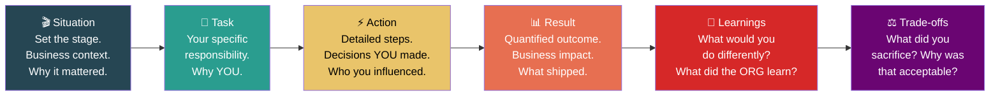

# 7. Mastering the Behavioral Loop 🔴

> **What you'll learn:**
> - The STAR+ method: Situation, Task, Action, Result, *Learnings, Trade-offs* — the format that separates L6/L7 answers from L5 answers
> - How to talk about failure without sounding incompetent — and why interviewers *want* you to talk about failure
> - Demonstrating "Disagree and Commit," "Earn Trust," and "Think Big" through concrete behavioral narratives
> - The interviewer's scoring rubric: what they're actually evaluating and how to hit every dimension

---

## Why Behavioral Interviews Exist

A common misconception among engineers: "Behavioral interviews are the soft part. The real test is the system design round."

This is incorrect, especially at Staff+ levels. Here's why:

At L5 (Senior), the technical bar is the primary filter. You need to prove you can design systems and write code. Behavioral questions are a sanity check: "Is this person not a jerk?"

At L6/L7 (Staff/Principal), **the behavioral bar is often the deciding factor**. The committee assumes you're technically competent — you wouldn't be in the loop otherwise. What they're evaluating is: *Can this person operate at an organizational level? Can they navigate ambiguity, influence without authority, handle failure, and make hard trade-offs?*

Every chapter of this book has prepared you for this moment.

| Interview Round | What L5 Candidates Prove | What L6/L7 Candidates Prove |
|---|---|---|
| Coding | Can solve algorithmic problems | Can solve algorithmic problems (table stakes) |
| System Design | Can design a single system | Can design systems that span organizations and anticipate evolution |
| **Behavioral** | Can work on a team without conflict | **Can lead through ambiguity, align organizations, recover from failure, and make trade-offs with imperfect data** |

---

## The STAR+ Framework

Everyone knows STAR (Situation, Task, Action, Result). For Staff+ interviews, you need **STAR+**: the same structure with two critical additions that demonstrate senior judgment.

### Breaking Down Each Element

**S — Situation (30 seconds)**

Set the stage. The interviewer needs enough context to understand why the problem was hard and why it mattered. Include:
- The business context (revenue at risk, users affected, strategic importance)
- The organizational context (how many teams, what was broken, what was the urgency)
- Keep it brief — this is setup, not the story

**T — Task (15 seconds)**

What was YOUR specific responsibility? At L6/L7, the interviewer needs to distinguish *your* contribution from the team's. Clearly state:
- Your role (IC? Tech Lead? Incident Commander?)
- Why you were the one doing this (Were you assigned? Did you volunteer? Did you *identify* the problem?)
- What was expected of you

**A — Action (2–3 minutes)**

This is the meat of your answer. The interviewer is evaluating your *approach*, not just the outcome. Include:
- Specific decisions you made and why
- Who you influenced, aligned, or convinced
- What alternatives you considered and why you rejected them
- How you handled setbacks during execution

**R — Result (30 seconds)**

Quantify the outcome. Use numbers wherever possible:
- Revenue impact: "recovered $2.4M in annual revenue"
- Reliability: "reduced Sev-1 incidents from 3/quarter to 0 over 6 months"
- Velocity: "reduced deploy cycle from 45 minutes to 8 minutes"
- Scale: "migrated 14 services with zero downtime"

**L — Learnings (30 seconds)**

This is what separates L6 answers from L5 answers. The interviewer is looking for *reflective capacity*:
- "In retrospect, I would have started the stakeholder alignment two weeks earlier."
- "The org learned that config changes need the same deployment rigor as code changes."
- "I now have a personal checklist for cross-team projects that I didn't have before this experience."

**TR — Trade-offs (30 seconds)**

This is what separates L7 answers from L6 answers. Principal-level thinking requires naming what you *gave up*:
- "We cut the recommendation feature to hit the deadline. This reduced projected revenue by 15% but ensured platform stability."
- "I chose Option B knowing it would create 6 months of tech debt, because the business couldn't afford to miss the Q3 launch."
- "We accepted stale reads for 5 seconds rather than building a globally consistent cache, because the consistency requirement didn't justify the latency cost."

---

## How to Talk About Failure

This is the question that terrifies most candidates:

> *"Tell me about a time you failed."*

Here's what the interviewer is actually evaluating:

| What They're NOT Looking For | What They ARE Looking For |
|---|---|
| A fake failure ("I cared too much") | A genuine failure with real consequences |
| A failure that someone else caused | A failure where your actions or decisions contributed to the outcome |
| A perfect recovery with no lasting damage | A messy situation where you learned something valuable |
| A polished, rehearsed story that makes you look good | Intellectual honesty and reflective capacity |

### The Senior vs. Staff Answer to "Tell Me About a Failure"

**The Junior/Senior Answer (Tactical):**

> "We had a project that was behind schedule. I worked extra hours to catch up and we eventually shipped it two weeks late. I learned that I need to flag delays earlier."

// 💥 CAREER HAZARD: This is a story about being a hard worker, not a story about failure. The interviewer will mentally note: "Avoids real failure stories. Possible lack of self-awareness."

**The Staff Answer (Strategic):**

> "I led a cross-team platform migration that failed to meet its Q2 deadline by a full quarter. The root cause was my failure to identify and manage a critical dependency on the Authentication team early enough. I assumed their API changes would be straightforward — they weren't. By the time I realized the scope, we'd burned 6 weeks of runway.
>
> What I did wrong: I didn't do a dependency map in Week 1. I didn't have regular check-ins with the Auth team's tech lead. I relied on Slack messages instead of face-to-face alignment.
>
> What I did to recover: I restructured the project into two phases. Phase 1 shipped without the Auth dependency using a shim layer. Phase 2 completed the proper integration the following quarter. We still delivered the business value, just later than promised.
>
> What I changed: I now create a formal dependency map for every cross-team project in the first week. I require weekly sync meetings with every dependent team's tech lead. And I've written an internal playbook that other Staff engineers now use for cross-team project planning. That playbook has been used in 8 projects since, and none of them have had the same dependency management failure."

// ✅ FIX: Name the failure honestly. Show what YOU did wrong (not what someone else did). Demonstrate that you fixed not just the situation, but the system.

---

## Behavioral Question Categories and How to Prepare

Every behavioral question maps to one of these categories. Prepare 2–3 stories for each.

| Category | What They're Evaluating | Example Questions |
|---|---|---|
| **Navigate Ambiguity** | Can you make progress without clear direction? | "Tell me about a time you had to define a project's direction without clear requirements." |
| **Influence Without Authority** | Can you get things done through people you don't manage? | "Tell me about a time you had to convince a team to change their approach." |
| **Handle Conflict** | Can you resolve disagreements constructively? | "Tell me about a time you disagreed with a more senior engineer. What happened?" |
| **Deliver Results** | Can you ship at scale? | "Tell me about the most impactful project you've driven." |
| **Earn Trust** | Do people trust your judgment? | "Tell me about a time you gave constructive feedback that was hard to deliver." |
| **Fail and Learn** | Do you have reflective capacity? | "Tell me about your biggest professional failure." |
| **Think Big** | Can you see the forest, not just the trees? | "Tell me about a time you identified a problem nobody else saw." |
| **Disagree and Commit** | Can you execute against a decision you disagree with? | "Tell me about a time you committed to a direction you didn't agree with." |

### Preparing Your Story Bank

Create a spreadsheet with 10–12 stories from your career. For each story, note which categories it covers. Most stories can be angled to cover 2–3 categories.

| Story | Primary Category | Secondary Categories | Business Impact |
|---|---|---|---|
| Checkout migration | Deliver Results | Navigate Ambiguity, Influence | $32M revenue recovery |
| Auth service dependency failure | Fail and Learn | Navigate Ambiguity | Shipped 1 quarter late; created planning playbook |
| Disagree with VP on microservices timing | Disagree and Commit | Influence, Earn Trust | Committed fully; VP's approach worked |
| Mentored engineer through performance issues | Earn Trust | Handle Conflict | Engineer retained, promoted within 1 year |

---

## "Disagree and Commit" — The Hardest Story to Tell

This question is a trap for engineers who confuse "I was right" with "I showed good judgment."

**What the interviewer is looking for:**
1. You can articulate a strong technical or strategic opinion with evidence
2. When the decision goes contrary to your recommendation, you commit *genuinely* (not passive-aggressively)
3. You can reflect on whether the decision turned out to be right or wrong — and either way, you learned something

**The Senior Answer:**
> "My manager wanted to use Kubernetes and I thought it was overkill. But they insisted so we did it."

// 💥 CAREER HAZARD: Passive, victimized framing. Shows no agency, no genuine commitment, no learning.

**The Staff Answer:**
> "During the platform redesign, I strongly advocated for a service mesh based on our scaling projections and operational complexity. The VP chose a simpler load-balanced approach, reasoning that our current scale didn't justify the operational overhead of a mesh. I disagreed — I believed we'd grow into the need within 18 months.
>
> Here's what I did: I documented my concerns and the data behind them in the RFC comments, then committed fully to the VP's approach. I personally led the implementation of the load-balanced architecture. I also proposed a set of observability metrics that would tell us *when* we needed to revisit the service mesh decision — essentially building a tripwire for my own prediction.
>
> It turned out the VP was right for the short term. Our scale didn't justify the mesh overhead for 24 months — longer than I predicted. The observability metrics I proposed became our standard scaling indicators. I learned to weight 'current operational cost' more heavily against 'future-proofing' in my architectural decisions."

---

## The Interviewer's Rubric: What They Score

Most FAANG behavioral rubrics evaluate these dimensions:

| Dimension | What Strong Looks Like | What Weak Looks Like |
|---|---|---|
| **Scope of impact** | Multi-team, multi-quarter, org-level | Single team, single project |
| **Ownership** | Drove the initiative; took accountability for failures | Participated; deflected blame |
| **Ambiguity tolerance** | Operated effectively without clear direction | Needed direction to proceed; asked for clarity repeatedly |
| **Influence** | Convinced skeptics, aligned organizations | Had authority or was following orders |
| **Business acumen** | Connected technical work to business outcomes | Described technical work in a vacuum |
| **Reflective capacity** | Named mistakes, explained learnings, described systemic changes | Presented a polished narrative with no rough edges |
| **Trade-off articulation** | Named what was sacrificed and why it was acceptable | Described everything as a win with no downsides |

---

<strong>🏋️ Exercise: STAR+ Story Construction</strong> (click to expand)

### Situational Challenge

Construct a STAR+ response to this behavioral question:

> *"Tell me about a time you identified a critical technical problem that nobody else was working on, and drove the solution."*

Use a scenario from your career (or invent one based on the patterns in this book). Your response must include:
- Business context and quantified impact
- At least one moment where you had to influence someone without authority
- A clearly named trade-off
- A genuine learning

Time yourself: your full response should take 3–4 minutes when spoken aloud.

---

🔑 Solution

Here's an example STAR+ response. Use this as a template for your own stories.

**Situation (30 sec):**
> "At my previous company, we were a mid-size fintech processing about $200M in annual transactions. I noticed a pattern in our Sev-2 incident reports: about once a month, a specific class of database connection timeout would cascade through our payment processing pipeline, causing 5-10 minutes of failed transactions. Each incident cost roughly $30K-$50K in lost transactions and engineer-hours. Nobody owned this problem because it sat at the boundary between three services owned by three different teams."

**Task (15 sec):**
> "I was a Staff engineer on the Platform team. Nobody asked me to investigate this. I identified the pattern by reading postmortem reports over a 6-month period and realized no one was seeing the systemic issue because each team only saw their slice of the failure. I took ownership of diagnosing and proposing a fix."

**Action (2.5 min):**
> "First, I spent a week collecting data. I pulled 6 months of incident reports and correlated them with database connection pool metrics, deploy logs, and traffic patterns. I found that the root cause was a connection pool exhaustion issue triggered by a specific combination of peak traffic and long-running analytics queries — queries that the Data team ran on the production replica.
>
> Next, I had to build alignment. I wrote a 1-pager showing the $400K+ annual cost of this issue and shared it individually with the three team leads before the architecture review meeting. One team lead pushed back — they said the analytics queries couldn't be moved because the Data team's SLA with the business required real-time access. Instead of escalating, I proposed a compromise: read replica traffic would be routed through a dedicated connection pool with a separate max-connection limit, isolated from production workloads. The Data team could keep their access, but they couldn't starve production.
>
> I wrote an RFC, got it approved in one architecture review cycle (because I'd pre-wired every stakeholder), and then personally implemented the connection pool isolation. The implementation was a 2-week project. I also added an alert that would fire if any connection pool exceeded 80% utilization — a leading indicator we'd never had."

**Result (30 sec):**
> "In the 8 months since the fix went live, we've had zero incidents of this class — down from roughly 8 in the prior 8 months. The estimated annual savings are over $400K in lost transactions and incident response costs. The connection pool isolation pattern has since been adopted as a standard across all database-backed services."

**Learnings (30 sec):**
> "I learned that some of the highest-leverage problems live at the boundaries between teams and only become visible when you look at incident data *across* workflows rather than within a single team's metrics. I now spend 2 hours a month reading cross-team incident reports, and I've found two additional systemic patterns using this approach."

**Trade-offs (30 sec):**
> "The trade-off I made was dedicating two weeks of my time — time that was supposed to go toward a platform feature — to a problem that wasn't on any roadmap. My manager was initially skeptical about the ROI. I made the case that $400K in annual savings justified 2 engineer-weeks of investment, but I also acknowledged that I deferred the platform feature by 2 weeks. If the fix hadn't worked, I would have been behind on my committed deliverables with nothing to show for it."

// 💥 CAREER HAZARD: Telling a behavioral story where everything went perfectly and you have no trade-offs or learnings. The interviewer will think you're either hiding something or lack self-awareness.  
// ✅ FIX: Name the real trade-offs and real learnings. Intellectual honesty is the highest signal of senior judgment.

---

> **Key Takeaways**
> - At L6/L7, the behavioral round is often the deciding factor, not the system design or coding rounds.
> - Use STAR+ (Situation, Task, Action, Result, Learnings, Trade-offs) — the last two elements separate Staff answers from Senior answers.
> - Failure stories are *expected* and *valued*. The interviewer evaluates how you *processed* the failure, not whether you avoided it.
> - "Disagree and Commit" stories must show genuine commitment (not passive compliance) and reflective capacity about the outcome.
> - Build a story bank of 10–12 career stories, mapped to behavioral categories. Most stories can be angled to cover 2–3 categories.
> - Quantify everything. "Improved checkout" is L5. "$32M annual revenue recovery" is L7.

> **See also:**
> - [Chapter 8: Capstone Project](ch08-capstone-the-l7-behavioral-mock.md) — A complete L7 behavioral mock interview simulation
> - [Chapter 2: Navigating Ambiguity](ch02-navigating-ambiguity.md) — The underlying skill tested by "navigate ambiguity" behavioral questions
> - [Chapter 9: Reference Card](ch09-reference-card-and-cheat-sheets.md) — A cheat sheet of behavioral questions by category
