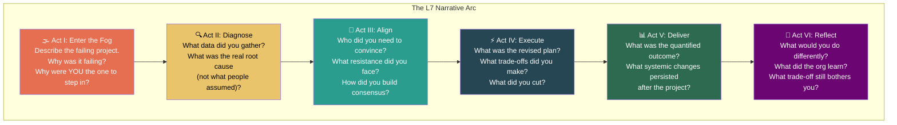

# 8. Capstone Project — The L7 Behavioral Mock 🔴

> **What you'll learn:**
> - How to construct a complete, interview-ready response to the most complex behavioral prompt: multi-team project rescue
> - How to structure a narrative that demonstrates *every* Staff+ competency in a single story
> - What an L7 interviewer's debrief looks like — how your answer is scored
> - How to practice and iterate on your behavioral responses

---

## The Prompt

This is a real behavioral question asked in L7 (Principal) loops at multiple FAANG companies:

> **"Tell me about a time a multi-team project was failing, and you had to step in to save it."**

This single question is designed to evaluate *every* competency discussed in this book:

| Competency Tested | What Interviewer Listens For |
|---|---|
| Navigate ambiguity (Ch 2) | Did you enter a disorganized, unclear situation and create structure? |
| Writing to scale (Ch 3) | Did you use documents (RFCs, status reports, postmortems) to align people? |
| Alignment and pushback (Ch 4) | Did you get disagreeing parties aligned? Did you push back on anyone? |
| Cross-team dependencies (Ch 5) | Were there dependency or coordination failures? How did you resolve them? |
| Incident management (Ch 6) | Was there a crisis component? How did you lead under pressure? |
| STAR+ format (Ch 7) | Is the narrative structured, quantified, and reflective? |

---

## Anatomy of an L7 Answer

An L7-level answer to this question takes 5–7 minutes and follows a precise narrative arc. Let's build one step by step.

---

## The Full Mock: A Model L7 Response

Read this as if a candidate is speaking in an interview. Then we'll break down *why* each section works.

---

### Act I: Enter the Fog (Situation + Task — 60 seconds)

> "Two years ago, I was a Staff engineer at [Company], which processes about $2B in annual e-commerce transactions. Our VP of Engineering had greenlit a major initiative called Project Atlas — a re-platforming of our order management system from a monolithic Python service to an event-driven microservices architecture. The project involved four engineering teams: Order Processing, Inventory, Payments, and the Platform team.
>
> Atlas had been running for two quarters when I got involved. It was supposed to ship by end of Q4 with a projected $18M annual savings in operational costs and a 3x improvement in order throughput. But by the middle of Q3, the project was in trouble: two of the four teams were behind schedule, the third had de-prioritized their Atlas work because of an unrelated compliance deadline, and the fourth — Payments — had a fundamental architectural disagreement with the Platform team about the event schema.
>
> Nobody asked me to step in. I'd been watching the weekly Atlas updates in the architecture review and noticed the trend — four consecutive weeks of 'yellow' status that should have been 'red.' I went to the VP and said: 'Atlas is failing. I'd like to step in as the technical lead across all four teams and restructure the project. Here's my assessment of the three root causes.' She agreed and gave me the authority to coordinate."

**Why this works:**
- Business context is established ($2B company, $18M savings at stake)
- The situation is genuinely ambiguous and multi-team
- The candidate *identified* the problem proactively (not assigned)
- The candidate demonstrated initiative by going to the VP with an assessment

---

### Act II: Diagnose (Data-Driven Analysis — 60 seconds)

> "My first week was entirely about diagnosis. I had 1:1s with each team's tech lead and EM. I reviewed 8 weeks of sprint reports. I mapped the dependency graph and discovered three root causes that nobody had connected:
>
> **Root cause 1: Architectural misalignment.** The Payments and Platform teams had fundamentally different mental models for the event schema. Payments wanted a rich, domain-specific schema; Platform wanted a thin, generic schema. They'd been arguing for 6 weeks in RFC comments without resolution.
>
> **Root cause 2: Hidden dependency chain.** Inventory couldn't start their core migration work until Payments published their event schema — which was blocked by the disagreement. And Order Processing couldn't complete integration testing until both Inventory and Payments had migrated. The critical path was serial, not parallel as originally planned.
>
> **Root cause 3: Incentive misalignment.** The Compliance team had pulled two engineers from the Payments team, which reduced their capacity by 40%. Payments' EM had flagged this but their Director chose to absorb the hit rather than escalate, hoping to make it up later."

**Why this works:**
- Data-driven, not opinion-based (1:1s, sprint reports, dependency mapping)
- Three connected root causes (shows systemic thinking)
- Identifies the *human* and *structural* causes, not just technical ones
- Demonstrates understanding of organizational dynamics (incentive misalignment)

---

### Act III: Align (Influence Without Authority — 90 seconds)

> "Now I had to get four team leads, three EMs, and two directors aligned on a new plan. Here's what I did:
>
> **For the schema disagreement:** I didn't try to pick a winner. I proposed a versioned schema approach — a thin base event with domain-specific extensions. This gave Platform their generic layer and gave Payments their rich domain model. I wrote a 2-page RFC and pre-wired it with both tech leads individually before the architecture review. When we presented it, there was no debate — both leads had already signed off.
>
> **For the incentive misalignment:** I went to the Director who had absorbed the Payments capacity hit and presented the math: the 2-engineer loss had created a 3-sprint delay on the critical path, which cascaded to a full-quarter delay across the project. The cost of that delay was approximately $4.5M in deferred operational savings. I asked for those 2 engineers back. She agreed to return one full-time and one at 50%.
>
> **For the dependency chain:** I restructured the project into two phases. Phase 1 would deliver the event bus infrastructure and migrate Order Processing and Inventory — the two teams that were ready. Phase 2 would add Payments once their capacity was restored. To make this work, I designed a bridge adapter that allowed the existing Payments monolith to emit events in the new schema format, so Phase 1 could proceed without waiting for Payments' full migration.
>
> I presented this restructured plan at a cross-team meeting with all four team leads. Because I'd pre-wired every person individually, the meeting was 25 minutes of confirmation, not debate."

**Why this works:**
- Three distinct influence actions, each tailored to the specific root cause
- Pre-wiring technique from Chapter 4
- Proposing a *compromise* rather than picking a winner in the schema fight
- Quantifying the cost to the Director ($4.5M) — Chapter 3's framing technique
- Designing a technical fallback (bridge adapter) — Chapter 5's strategy

---

### Act IV: Execute (Trade-offs and Decisions — 60 seconds)

> "Execution required hard trade-offs. The original plan had four teams migrating in parallel with a Q4 ship date. My restructured plan had Phase 1 shipping end of Q4 with three teams, and Phase 2 shipping mid-Q1 with Payments.
>
> The biggest trade-off: I cut the real-time analytics dashboard that was supposed to launch with Atlas. The data pipeline for real-time analytics depended on the Payments event stream, which wouldn't exist until Phase 2. I could have built a temporary polling solution, but that would have added 3 weeks of work to the critical path.
>
> I went to the VP with the trade-off: 'We can ship Atlas Phase 1 by Q4 and capture $14M of the $18M in operational savings. Or we can try to ship everything by Q4, which based on current velocity, we won't make — and we'll capture $0 in Q4 because nothing ships until everything ships.' She approved the phased approach.
>
> I also made a controversial call: I embedded myself on the Payments team for two weeks to personally help build the bridge adapter. Some people felt this was 'below' a Staff engineer. I disagreed — the adapter was the critical technical enabler of the phased strategy, and I was the only person who understood both the old and new architectures well enough to build it safely."

**Why this works:**
- Clearly named trade-offs (cut analytics dashboard, delayed full scope)
- Business quantification of the trade-off ($14M vs. $0)
- Demonstrates managing up — presenting options to the VP with data
- Shows willingness to do hands-on work when it's the highest-leverage use of time
- Acknowledges the controversial nature of a decision (self-awareness)

---

### Act V: Deliver (Quantified Results — 30 seconds)

> "Phase 1 shipped on the last week of Q4. Order Processing and Inventory migrated to the event-driven architecture with zero downtime. We realized $14.2M of the projected $18M in operational savings in Q4. Phase 2 — Payments migration — shipped 6 weeks into Q1, completing the full $18M realization.
>
> The order throughput improvement was actually 3.7x, exceeding the original 3x projection, because the event-driven architecture eliminated a synchronous bottleneck we hadn't originally accounted for."

---

### Act VI: Reflect (Learnings and Systemic Changes — 60 seconds)

> "Three things I'd do differently and three things that persisted:
>
> **What I'd change:**
> First, I should have gotten involved 4 weeks earlier. The signs of project failure were visible from the architecture review updates, and I waited too long to act because I didn't feel it was 'my project.' I've since adopted a rule: if I see three consecutive yellow status reports in any cross-team project, I investigate.
>
> Second, I should have anticipated the capacity issue. The compliance deadline that pulled engineers from Payments was on the org's calendar. A dependency map in Week 1 would have flagged this as a risk.
>
> **What the org learned:**
> First, we formalized the phased delivery model. Every major cross-team project now has explicit phase gates rather than a single 'done' milestone.
>
> Second, I published the dependency mapping template I created during Atlas. It's now part of our project kickoff playbook and has been used in 12 subsequent projects.
>
> Third, the schema versioning pattern we developed became the standard for all event-driven services at the company. We have 23 services using it today.
>
> **The trade-off that still bothers me:** The real-time analytics dashboard was never built. After Phase 2 shipped, the business priority had shifted and the dashboard was deprioritized. The data team was disappointed. If I'd found a way to staff it as a parallel workstream, I could have preserved both the timeline and the dashboard. But with the information and resources I had at the time, I believe I made the right call."

**Why this works:**
- Genuine self-criticism (not false modesty)
- Systemic changes that outlasted the project
- Quantified organizational adoption (12 projects, 23 services)
- Acknowledges a trade-off that still bothers them (intellectual honesty)
- Closes with a reflection, not a victory lap

---

## How an L7 Interviewer Scores This Answer

The interviewer writes a debrief after the loop. Here's what a strong debrief looks like for the answer above:

| Dimension | Signal | Rating |
|---|---|---|
| **Scope** | Multi-team (4 teams), multi-quarter, $18M business impact | Strong L7 |
| **Ownership** | Self-identified the problem, volunteered to lead, took accountability for the delay | Strong L7 |
| **Ambiguity** | Entered a failing project with no clear plan. Created structure. | Strong L7 |
| **Influence** | Aligned 4 tech leads, 3 EMs, 2 directors. Pre-wired decisions. Resolved schema stalemate. | Strong L7 |
| **Trade-offs** | Cut analytics dashboard. Phased the project. Named the cost clearly. | Strong L7 |
| **Technical depth** | Designed bridge adapter. Schema versioning. Event-driven architecture. | L6+ |
| **Reflective capacity** | Named three things they'd change. Acknowledged a trade-off that still bothers them. | Strong L7 |
| **Systemic impact** | Dependency template used in 12 projects. Schema pattern adopted in 23 services. | L7 |

---

## Practice Protocol

### Phase 1: Write Your Stories (Week 1–2)

Write 5 complete STAR+ stories from your career. Cover these categories:
1. A multi-team project you led or rescued
2. A time you failed and recovered
3. A time you navigated ambiguity
4. A time you influenced without authority
5. A time you disagreed and committed

### Phase 2: Time Yourself (Week 2–3)

Record yourself telling each story aloud. Each should be 4–6 minutes. If it's under 3 minutes, you're not giving enough detail. If it's over 7 minutes, you're rambling.

### Phase 3: Mock Interviews (Week 3–4)

Practice with a peer, a mentor, or a professional mock interview service. Ask for specific feedback on:
- Did my story clearly demonstrate the competency?
- Did I quantify the impact?
- Did I name trade-offs and learnings?
- Was my "Action" section about *my* decisions, or did I describe what the team did?

### Phase 4: Adapt in Real-Time (Ongoing)

In a real interview, you'll get follow-up questions that probe specific dimensions. Practice pivoting:
- "Tell me more about how you convinced the Director to give back the engineers."
- "What would you have done if the VP hadn't approved the phased approach?"
- "How did you handle the tech lead who lost the schema debate?"

---

<strong>🏋️ Exercise: Build Your Own L7 Narrative</strong> (click to expand)

### Situational Challenge

Respond to this prompt using STAR+:

> **"Tell me about a time a multi-team project was failing, and you had to step in to save it."**

Use a real experience from your career. If you don't have one at this scale, use a smaller experience and *scale it* — identify what you *would* have done if the scope were larger.

**Requirements for your response:**
1. Name the business context with a dollar amount or user count
2. Identify at least 2 root causes (at least one must be organizational, not just technical)
3. Describe at least 1 moment where you influenced without authority
4. Name at least 1 trade-off you made
5. Include at least 1 systemic change that outlasted the project
6. Include 1 thing you'd do differently

Time yourself speaking it aloud. Target: 5–6 minutes.

---

🔑 Solution

There's no single correct answer — the solution is *your* story. But here's a checklist to evaluate your response:

**Structure Check:**

| Element | ✅ Present? | Notes |
|---|---|---|
| Business context with numbers | | "$X revenue," or "Y million users," or "$Z cost savings" |
| Clear explanation of why the project was failing | | Not just "it was behind" — specific root causes |
| Your specific role and why YOU stepped in | | Don't just describe team actions. What did YOU decide? |
| Organizational root cause (not just technical) | | Incentive misalignment, dependency failure, communication breakdown |
| Moment of influence without authority | | Convincing a peer, a tech lead, or a Director |
| Clearly named trade-off | | What did you cut, defer, or accept risk on? |
| Quantified result | | Compare before and after with specific numbers |
| Systemic change | | Template, playbook, process, or architectural pattern that persisted |
| Something you'd do differently | | Genuine, not false modesty |

**Red Flags in Your Story:**

| Red Flag | Why It's a Problem |
|---|---|
| "We" instead of "I" throughout | Interviewer can't assess YOUR contribution |
| No numbers | Impact is unsubstantiated |
| No trade-offs | Either you don't remember, or the project was too easy |
| "Everything worked out perfectly" | Interviewer suspects you're hiding the mess |
| The story is under 3 minutes | You're not giving enough detail on the Action section |
| The story is over 8 minutes | You need to edit ruthlessly — practice more |

**Practice tip:** After you've written your story, read the model L7 response in this chapter again. Identify 2-3 techniques from the model that you could adopt in your own story. Then revise and practice again.

// 💥 CAREER HAZARD: Over-rehearsing to the point that your story sounds scripted. Interviewers notice.  
// ✅ FIX: Memorize the *structure and key numbers*, but tell the story in your natural voice. You should sound like you're remembering, not reciting.

---

> **Key Takeaways**
> - The "failing multi-team project" prompt evaluates every Staff+ competency simultaneously: ambiguity, influence, execution, trade-offs, and reflection.
> - Structure your narrative in six acts: Enter → Diagnose → Align → Execute → Deliver → Reflect.
> - Quantify *everything*: business impact, team size, timeline, savings, adoption.
> - The "Reflect" act is what separates L7 from L6. Show genuine self-criticism and systemic organizational learning.
> - Practice aloud. 5–6 minutes. Not under 3, not over 7. Record yourself.

> **See also:**
> - [Chapter 7: Mastering the Behavioral Loop](ch07-mastering-the-behavioral-loop.md) — The STAR+ framework this capstone builds upon
> - [Chapter 9: Reference Card](ch09-reference-card-and-cheat-sheets.md) — A complete list of behavioral questions to practice with
> - [Chapter 1: The Staff Archetypes](ch01-the-staff-archetypes.md) — Know which archetype your story demonstrates
