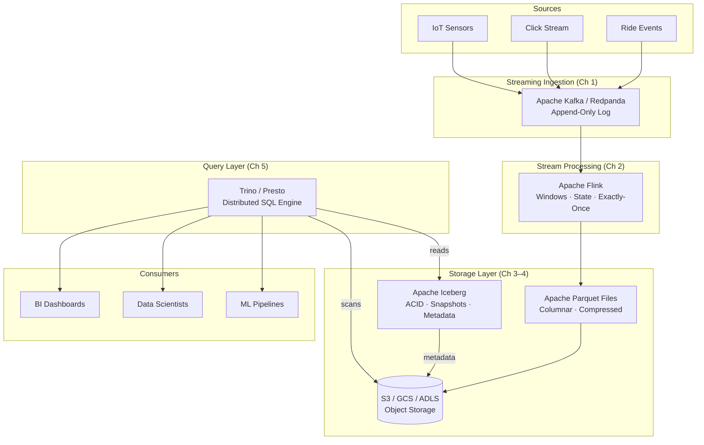

# System Design: The Streaming Data Lakehouse

## Speaker Intro

This handbook is written from the perspective of a **Principal Data Architect** who has designed, operated, and scaled streaming data platforms processing billions of events per day across petabyte-scale data lakes. The content draws from first-hand experience building real-time analytics pipelines at the intersection of distributed stream processing, columnar storage, and open table formats—the modern "lakehouse" stack that is replacing traditional data warehouses.

## Who This Is For

- **Data engineers** who maintain fragile ETL pipelines and want to understand the architecture that eliminates the batch/streaming divide.
- **Backend engineers** building event-driven microservices who need to understand what happens to their events *after* they hit Kafka.
- **Analytics engineers and data scientists** who query Hive/Spark tables daily but have never looked beneath the abstraction to understand why some queries scan terabytes and others finish in seconds.
- **Architects evaluating lakehouse platforms** (Databricks, Snowflake, Apache Iceberg + Trino) and who need the systems-level understanding to make informed buy-vs-build decisions.
- **Anyone who has stared at an AWS S3 bill** for their data lake and wondered why it costs more than the compute.

## Prerequisites

| Concept | Where to Learn |
|---|---|
| Distributed systems fundamentals (replication, consensus) | [Distributed Systems](../distributed-systems-book/src/SUMMARY.md) |
| Basic SQL and analytics concepts | [SQL Rosetta Stone](../sql-rosetta-book/src/SUMMARY.md) |
| Familiarity with Apache Kafka or a similar message broker | [System Design: Message Broker](../system-design-book/src/SUMMARY.md) |
| Cloud object storage concepts (S3, GCS, Azure Blob) | AWS / GCP / Azure documentation |

## How to Use This Book

| Emoji | Meaning |
|---|---|
| 🟢 | **Architecture** — foundational design decisions and high-level system topology |
| 🟡 | **Stream Processing** — runtime semantics, windowing, state management, query execution |
| 🔴 | **Storage Formats** — on-disk layouts, encoding, compression, metadata structures |

Each chapter solves **one layer of the lakehouse stack** in sequence. Read them in order—later chapters assume the architecture and storage layers from earlier chapters exist.

## The Problem We Are Solving

> Design a **streaming data lakehouse** capable of ingesting millions of events per second from real-time sources (ride-sharing trips, click streams, IoT sensors), storing them cost-effectively on object storage (S3), and serving sub-second analytical queries over petabytes of historical data—all with ACID transaction guarantees and without maintaining separate batch and streaming pipelines.

The system we will build has these non-negotiable requirements:

| Requirement | Target |
|---|---|
| Ingestion throughput | ≥ 2 M events/sec sustained |
| End-to-end latency (event → queryable) | < 60 seconds |
| Storage cost (1 PB raw data) | < $5,000/month on S3 |
| Query latency (1 TB scan, filtered) | < 10 seconds |
| Data correctness | Exactly-once processing, ACID transactions |
| Schema evolution | Add/rename/drop columns without rewriting data |

## Pacing Guide

| Chapter | Topic | Time | Checkpoint |
|---|---|---|---|
| Ch 0 | Introduction & Problem Statement | 30 min | Understand the lakehouse design canvas |
| Ch 1 | Lambda vs. Kappa Architecture | 4–6 hours | Can articulate why a unified Kappa pipeline wins |
| Ch 2 | Real-Time Stream Processing (Flink) | 6–8 hours | Understand windowing, state, exactly-once semantics |
| Ch 3 | Columnar Storage (Parquet) | 5–7 hours | Understand encoding, compression, predicate pushdown |
| Ch 4 | Open Table Format (Iceberg) | 6–8 hours | Understand snapshot isolation, manifest files, time travel |
| Ch 5 | Query Engine (Trino) | 5–7 hours | Understand distributed query planning and predicate pushdown |

**Total: ~27–36 hours** of focused study.

## Table of Contents

### Part I: Architecture
- **Chapter 1 — Lambda vs. Kappa Architecture 🟢** — The evolution of big data architectures. Why maintaining separate batch and streaming pipelines is an operational nightmare. Architecting a unified Kappa architecture where an append-only log serves as the single source of truth.

### Part II: Stream Processing
- **Chapter 2 — Real-Time Stream Processing with Apache Flink 🟡** — Calculating state over infinite data streams. Implementing tumbling, sliding, and session windows. How Flink manages distributed state and guarantees exactly-once processing using the Chandy-Lamport algorithm for distributed snapshots.

### Part III: Storage Formats
- **Chapter 3 — The Columnar Storage Format: Apache Parquet 🔴** — Why row-oriented formats are financially ruinous for analytics. Deep dive into Parquet's columnar memory layouts, dictionary encoding, and run-length encoding to compress petabytes by 90% while accelerating queries.
- **Chapter 4 — The Open Table Format: Apache Iceberg 🔴** — Bringing ACID transactions to object storage. How to perform `UPDATE` and `DELETE` on massive S3 buckets without rewriting terabyte files. Understanding metadata files, manifest lists, and snapshot isolation.

### Part IV: Query Layer
- **Chapter 5 — The Query Engine: Presto/Trino 🟡** — Serving data to humans. Architecting a distributed, in-memory SQL engine that pushes predicates to the storage layer, allowing analysts to query petabytes in seconds.

## Architecture Overview

## Companion Guides

| Guide | Relevance |
|---|---|
| [Distributed Systems](../distributed-systems-book/src/SUMMARY.md) | Consensus, replication, and failure models that underpin Kafka and Flink |
| [System Design: Message Broker](../system-design-book/src/SUMMARY.md) | The append-only log and partitioning concepts that Chapter 1 builds on |
| [Database Internals](../database-internals-book/src/SUMMARY.md) | B-Trees, buffer pools, and query optimizers—contrast with lakehouse storage |
| [Hardware Sympathy](../hardware-sympathy-book/src/SUMMARY.md) | CPU caches, memory layout, and I/O patterns that explain columnar performance |
| [SQL Rosetta Stone](../sql-rosetta-book/src/SUMMARY.md) | The SQL dialect knowledge needed for Chapter 5's Trino queries |
