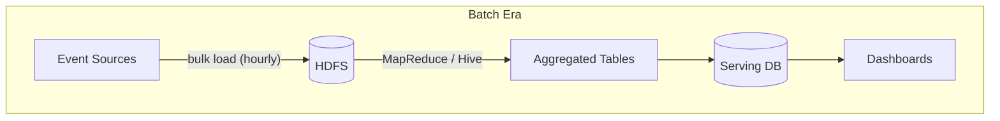
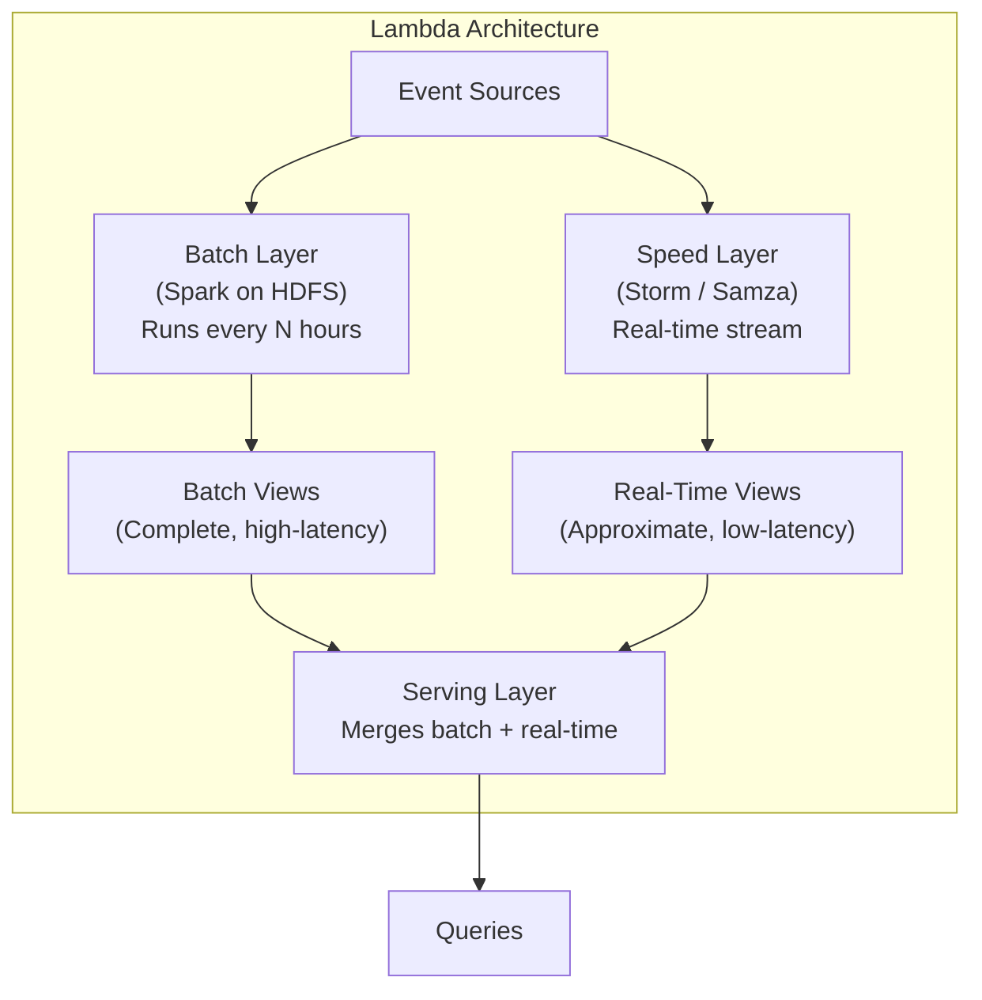
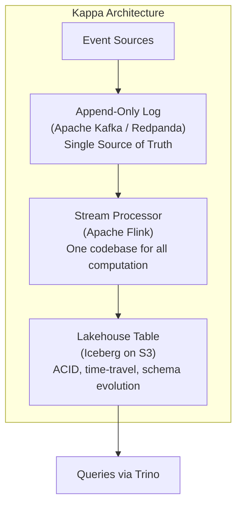
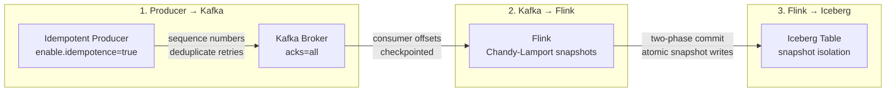
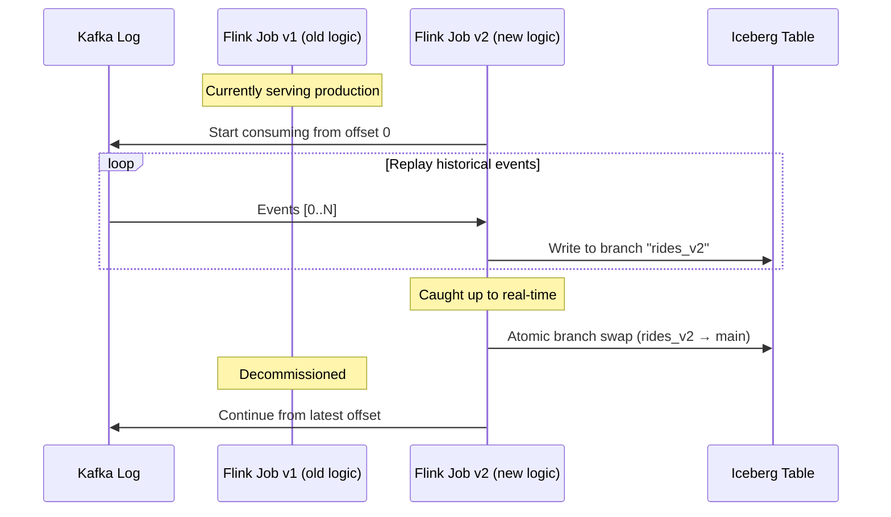

# 1. Lambda vs. Kappa Architecture 🟢

> **The Problem:** Your company ingests 500 million events per day from ride-sharing trips, click streams, and IoT sensors. The data team maintains a Spark batch pipeline that runs nightly to compute aggregations, *and* a separate Storm/Flink streaming pipeline for real-time dashboards. Every schema change requires updating both pipelines. Every bug requires debugging both codepaths. Every discrepancy between the batch and real-time numbers triggers a week-long investigation. You are maintaining **two pipelines that should be one.**

---

## The Evolution of Big Data Architectures

### The Batch Era (2004–2012)

The story begins with MapReduce. Google published the seminal paper in 2004, and Hadoop brought it to the masses. The architecture was simple:

1. Collect raw events into HDFS (Hadoop Distributed File System).
2. Run MapReduce jobs (later Hive/Pig/Spark) on a schedule (hourly/daily).
3. Write results to a serving database (MySQL, HBase).



**Strengths:** Simple mental model. Reprocessing is just "re-run the job."

**Fatal flaw:** Data is hours old by the time it reaches the dashboard. For fraud detection, surge pricing, or anomaly alerting, this is unacceptable.

### The Real-Time Addendum (2012–2015)

To patch the latency gap, teams bolted a streaming layer alongside the batch layer. Nathan Marz formalized this as the **Lambda Architecture** in 2012.

---

## The Lambda Architecture

The Lambda Architecture runs **two parallel pipelines** over the same data:

| Layer | Technology | Latency | Accuracy |
|---|---|---|---|
| **Batch layer** | Hadoop / Spark | Hours | High (full recomputation) |
| **Speed layer** | Storm / Samza | Seconds | Approximate (incremental) |
| **Serving layer** | HBase / Druid | — | Merges batch + speed results |



### How the Merge Works

The serving layer exposes a logical view that combines:

- **Batch view:** The authoritative, fully-recomputed result from the last batch run.
- **Real-time view:** The incremental delta computed from events that arrived *after* the last batch run.

```
result(t) = batch_view(last_batch_time) + realtime_view(last_batch_time → now)
```

When the next batch run completes, the real-time view is discarded and rebuilt from the new batch cutoff point.

### The Operational Nightmare

In theory, Lambda is elegant. In practice, it is a maintenance disaster:

| Problem | Impact |
|---|---|
| **Dual codebases** | The batch pipeline (Spark/Scala) and speed pipeline (Storm/Java) implement the *same* business logic in two different frameworks. |
| **Semantic drift** | Subtle differences in windowing, null handling, or join semantics between batch and streaming cause numbers to diverge. |
| **Schema evolution** | Adding a new field requires modifying both pipelines, their serialization formats, and the serving layer merge logic. |
| **Operational burden** | Two sets of monitoring, alerting, capacity planning, and on-call runbooks. |
| **Debugging complexity** | When batch and real-time numbers disagree, you must diff the logic across two completely different systems. |

### The Lambda Tax: A Real-World Example

Consider computing "average trip fare per geohash per hour" for a ride-sharing platform:

**Batch Pipeline (Spark):**

```python
# Runs nightly at 02:00 UTC over yesterday's data
from pyspark.sql import functions as F

trips_df = spark.read.parquet("s3://lake/trips/dt=2025-03-31/")

avg_fare = (
    trips_df
    .withColumn("hour", F.hour("pickup_time"))
    .withColumn("geohash", F.expr("geohash_encode(lat, lon, 6)"))
    .groupBy("geohash", "hour")
    .agg(F.avg("fare").alias("avg_fare"))
)

avg_fare.write.mode("overwrite").parquet("s3://lake/batch_views/avg_fare/")
```

**Speed Pipeline (Flink SQL):**

```sql
-- Runs continuously, emitting results every minute
SELECT
    geohash_encode(lat, lon, 6) AS geohash,
    TUMBLE_START(pickup_time, INTERVAL '1' HOUR) AS hour_start,
    AVG(fare) AS avg_fare
FROM trip_events
GROUP BY
    geohash_encode(lat, lon, 6),
    TUMBLE(pickup_time, INTERVAL '1' HOUR);
```

**The divergence:** Spark's `avg()` uses `float64` accumulation. The Flink version uses internal `DECIMAL` precision. Over millions of rows, the results differ by fractions of a cent—enough to trigger alerts and erode trust in the data platform.

---

## The Kappa Architecture

Jay Kreps (co-creator of Apache Kafka) proposed the **Kappa Architecture** in 2014 as a radical simplification: **delete the batch layer entirely.**

### The Core Insight

> If you can reprocess your data by replaying the log, you don't need a separate batch system. The stream processor *is* the batch processor—you just point it at a different offset.

### The Single Pipeline



| Principle | Implementation |
|---|---|
| **Single source of truth** | All raw events live in Kafka with a retention period of 30–90 days (or infinite with tiered storage). |
| **Single processing pipeline** | One Flink job computes all transformations. Batch = replay from offset 0. Real-time = consume from latest. |
| **Immutable output** | Results are written as Iceberg snapshots on S3. Previous versions are preserved via snapshot isolation. |
| **Reprocessing** | Deploy new Flink job version → replay from the beginning of Kafka → write to a new Iceberg branch → atomic swap. |

### Why Kappa Works Now (But Didn't in 2012)

The Kappa Architecture was theoretically appealing in 2014 but practically impossible until three technologies matured:

| Blocker (2012) | Enabler (2024+) |
|---|---|
| Kafka couldn't retain data for months | Kafka tiered storage (KIP-405) + Redpanda shadow indexing |
| Stream processors couldn't do complex aggregations | Flink's managed state (RocksDB backend) + exactly-once guarantees |
| No ACID on object storage | Apache Iceberg / Delta Lake / Apache Hudi |
| No fast SQL over S3 | Trino, Spark 3.x, DuckDB |

---

## The Append-Only Log as Single Source of Truth

The centerpiece of the Kappa Architecture is the **append-only log**—a totally-ordered, immutable sequence of events.

### Why Kafka / Redpanda?

| Feature | Kafka | Redpanda | Why It Matters |
|---|---|---|---|
| Append-only semantics | ✅ | ✅ | Events are never mutated after write |
| Partitioned parallelism | ✅ | ✅ | Scale consumers horizontally |
| Consumer offsets | ✅ | ✅ | Each consumer tracks its own position |
| Retention (time-based) | Days → months | Days → months | Reprocess by replaying from offset 0 |
| Tiered storage | KIP-405 (S3) | Shadow indexing | Infinite retention at object-storage cost |
| Exactly-once (idempotent producer) | ✅ | ✅ | No duplicate events in the log |

### The Log is the Database

A key mental model shift: the Kafka log is not just a "message queue." It is a **database** of facts ordered by time.

```
Log: [e₀, e₁, e₂, e₃, ..., eₙ]
      ↑                        ↑
   offset 0                  latest

Any materialized view (table, index, cache) is a FUNCTION of the log:
   table = f(log[0..n])
```

If the function `f` is deterministic, you can always recreate the table by replaying the log. This is the foundation of **event sourcing** and the Kappa Architecture.

### Topic Design for the Lakehouse

```
rides.raw          — Raw ride events (JSON/Avro, immutable)
rides.enriched     — Enriched with geohash, weather, surge (Flink output)
rides.aggregated   — Per-minute/per-geohash aggregations (Flink output)
```

**Partitioning strategy:** Partition `rides.raw` by `city_id` to ensure all rides for a given city are processed by the same Flink subtask, enabling local state for city-level aggregations without shuffles.

---

## Lambda vs. Kappa: A Head-to-Head Comparison

| Dimension | Lambda | Kappa |
|---|---|---|
| Codebases to maintain | 2 (batch + streaming) | 1 (streaming only) |
| Reprocessing mechanism | Re-run batch job on HDFS | Replay Kafka log through same Flink job |
| Latency | Minutes (speed) + hours (batch) | Seconds (single pipeline) |
| Correctness guarantee | Eventual (merge batch + speed) | Exactly-once (Flink checkpointing) |
| Schema evolution | Modify both pipelines | Modify one pipeline |
| Storage cost | HDFS + streaming state + serving DB | Kafka (hot) + S3/Iceberg (warm/cold) |
| Complexity | High (three layers) | Low (one layer + output table) |
| When to choose | Truly unbounded reprocessing windows (years of history pre-Kafka) | Kafka retention covers your reprocessing needs |

---

## Designing the Lakehouse Ingestion Layer

### Event Schema (Avro)

We use Apache Avro for the Kafka wire format because it supports schema evolution (add/remove fields) and is compact:

```json
{
  "type": "record",
  "name": "RideEvent",
  "namespace": "com.lakehouse.rides",
  "fields": [
    {"name": "ride_id",      "type": "string"},
    {"name": "driver_id",    "type": "string"},
    {"name": "rider_id",     "type": "string"},
    {"name": "pickup_lat",   "type": "double"},
    {"name": "pickup_lon",   "type": "double"},
    {"name": "dropoff_lat",  "type": "double"},
    {"name": "dropoff_lon",  "type": "double"},
    {"name": "fare_cents",   "type": "int"},
    {"name": "pickup_time",  "type": {"type": "long", "logicalType": "timestamp-millis"}},
    {"name": "dropoff_time", "type": ["null", {"type": "long", "logicalType": "timestamp-millis"}], "default": null},
    {"name": "city_id",      "type": "int"},
    {"name": "surge_mult",   "type": ["null", "float"], "default": null}
  ]
}
```

### Producer: Writing to the Log

**Naive producer (fire-and-forget):**

```python
# 💥 DANGER: No delivery guarantees. Messages can be lost or duplicated.
from kafka import KafkaProducer
import json

producer = KafkaProducer(
    bootstrap_servers='kafka:9092',
    value_serializer=lambda v: json.dumps(v).encode('utf-8')
    # No acks, no retries, no idempotence
)

producer.send('rides.raw', value=ride_event)
# What if the broker crashes before replicating? Data loss.
# What if the producer retries on timeout? Duplicate events.
```

**Production producer (exactly-once, Avro):**

```python
# ✅ Idempotent producer + Avro serialization + acks=all
from confluent_kafka import SerializingProducer
from confluent_kafka.serialization import SerializationContext, MessageField
from confluent_kafka.schema_registry import SchemaRegistryClient
from confluent_kafka.schema_registry.avro import AvroSerializer

schema_registry = SchemaRegistryClient({'url': 'http://schema-registry:8081'})
avro_serializer = AvroSerializer(schema_registry, schema_str, to_dict=lambda obj, ctx: obj)

producer = SerializingProducer({
    'bootstrap.servers': 'kafka:9092',
    'key.serializer': lambda k, ctx: k.encode('utf-8') if k else None,
    'value.serializer': avro_serializer,
    # ✅ Exactly-once delivery guarantees:
    'enable.idempotence': True,    # Deduplicate retries via sequence numbers
    'acks': 'all',                 # Wait for all ISR replicas to acknowledge
    'retries': 2147483647,         # Infinite retries (bounded by delivery.timeout)
    'delivery.timeout.ms': 120000, # 2-minute deadline
})

producer.produce(
    topic='rides.raw',
    key=ride_event['city_id'],     # Partition by city
    value=ride_event,
)
producer.flush()
```

### The Exactly-Once Guarantee Chain

The lakehouse achieves end-to-end exactly-once via a chain of guarantees:



Each link in this chain will be explained in detail in the following chapters.

---

## Reprocessing: The Kappa Superpower

The killer feature of Kappa is **reprocessing without a second system.** When business logic changes (e.g., a new surge pricing algorithm), you:

1. Deploy a **new version** of the Flink job reading from the same Kafka topic.
2. Set its consumer group to start from **offset 0** (or a specific timestamp).
3. The new job replays all historical events through the updated logic.
4. Output goes to a **new Iceberg branch** (e.g., `rides_v2`).
5. Once the new branch catches up to real-time, **atomically swap** it with the production branch.
6. Decommission the old Flink job.



**Zero downtime. Zero data loss. One codebase.**

---

## Capacity Planning: Sizing the Log

For a ride-sharing platform with 2M events/sec:

| Parameter | Value | Rationale |
|---|---|---|
| Event size (Avro) | ~200 bytes | Compact binary, no field names on wire |
| Throughput | 2M × 200B = **400 MB/s** | Sustained ingest rate |
| Kafka partitions (rides.raw) | 128 | ~16K msgs/sec per partition, well within limits |
| Replication factor | 3 | Survive 2 broker failures |
| Hot retention | 7 days | Covers most reprocessing needs |
| Tiered storage | 90 days on S3 | Deep reprocessing / compliance |
| Broker count | 12 (3 racks × 4 brokers) | ~33 MB/s write per broker (comfortable) |
| Disk per broker | 4 TB NVMe | 7 days × 400 MB/s / 12 brokers × 3 replicas ≈ 2 TB |

### Cost Comparison: Lambda vs. Kappa

| Component | Lambda (Monthly) | Kappa (Monthly) |
|---|---|---|
| HDFS cluster (batch) | $15,000 | $0 (eliminated) |
| Spark EMR (nightly jobs) | $8,000 | $0 (eliminated) |
| Kafka cluster (streaming) | $12,000 | $12,000 |
| Storm/Flink cluster (speed layer) | $6,000 | $8,000 (handles all compute) |
| Serving database (merge layer) | $4,000 | $0 (Iceberg on S3) |
| S3 storage (Iceberg) | $0 | $2,500 |
| **Total** | **$45,000** | **$22,500** |

The Kappa Architecture cuts infrastructure cost by **50%** while eliminating the operational complexity of dual pipelines.

---

## Anti-Patterns and Pitfalls

### ❌ Anti-Pattern 1: Treating Kafka as a Database of Record

Kafka is the *transport*, not the long-term store. Even with tiered storage, Kafka topics have limited query capabilities. The **Iceberg table** is the database of record; Kafka is the replayable log that feeds it.

### ❌ Anti-Pattern 2: Unbounded State in the Stream Processor

If your Flink job accumulates state forever (e.g., a global count-distinct across all time), the state backend will grow without bound. Use **windowed aggregations** (Chapter 2) to bound state size, and push long-range analytics to the query engine (Chapter 5).

### ❌ Anti-Pattern 3: Schema-on-Read Without a Registry

Writing raw JSON to Kafka without a schema registry means:
- No schema evolution guarantees (adding a field breaks old consumers).
- No compression (field names repeated in every message).
- No type safety (misspelled field names silently produce nulls).

**Always use Avro or Protobuf with a schema registry.** The registry enforces backward/forward compatibility rules at produce time, not at query time when it's too late.

---

> **Key Takeaways**
>
> 1. **The Lambda Architecture was a necessary evil.** It solved the latency problem of pure batch, but at the cost of maintaining two codebases, two skill sets, and a brittle merge layer.
> 2. **The Kappa Architecture eliminates the batch layer.** By treating the append-only log as the single source of truth and the stream processor as the universal compute engine, you maintain one pipeline that handles both real-time and historical reprocessing.
> 3. **Reprocessing is replay.** Deploy a new Flink job version, replay from offset 0, write to a new Iceberg branch, and atomically swap. No separate batch system required.
> 4. **The exactly-once chain has three links:** idempotent producer → Flink checkpointing → Iceberg atomic commits. Break any link, and you get duplicates or data loss.
> 5. **Kafka is the transport, Iceberg is the database.** Don't confuse the log (replayable event stream) with the table (queryable, ACID-compliant, schema-evolving analytical store).
