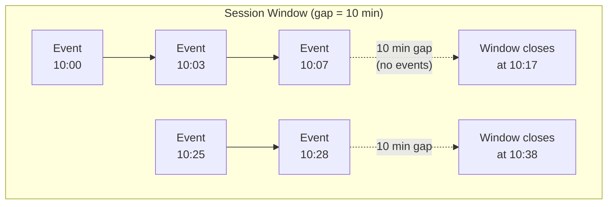
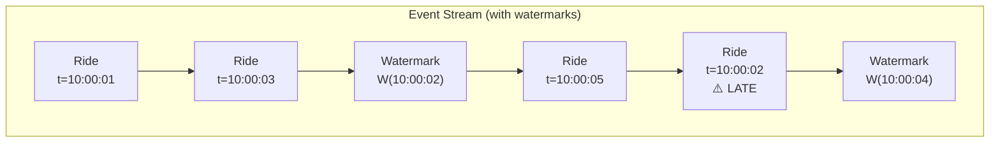
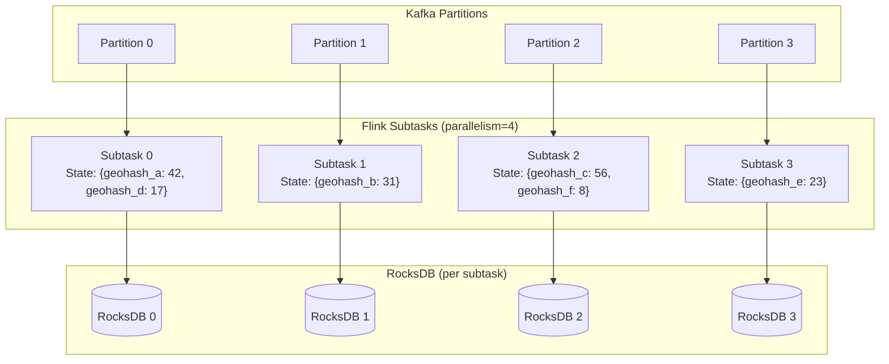
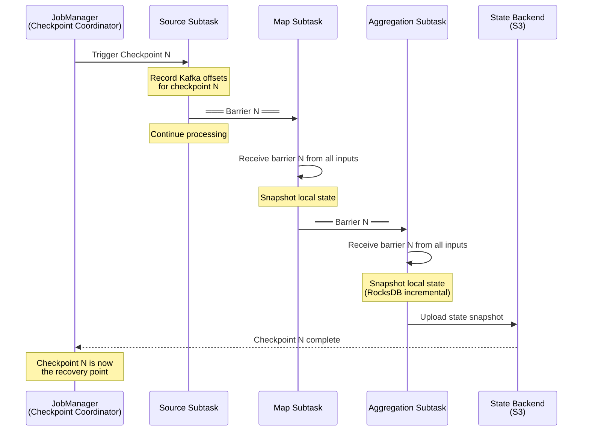
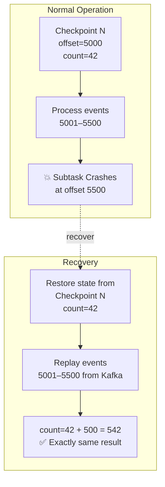
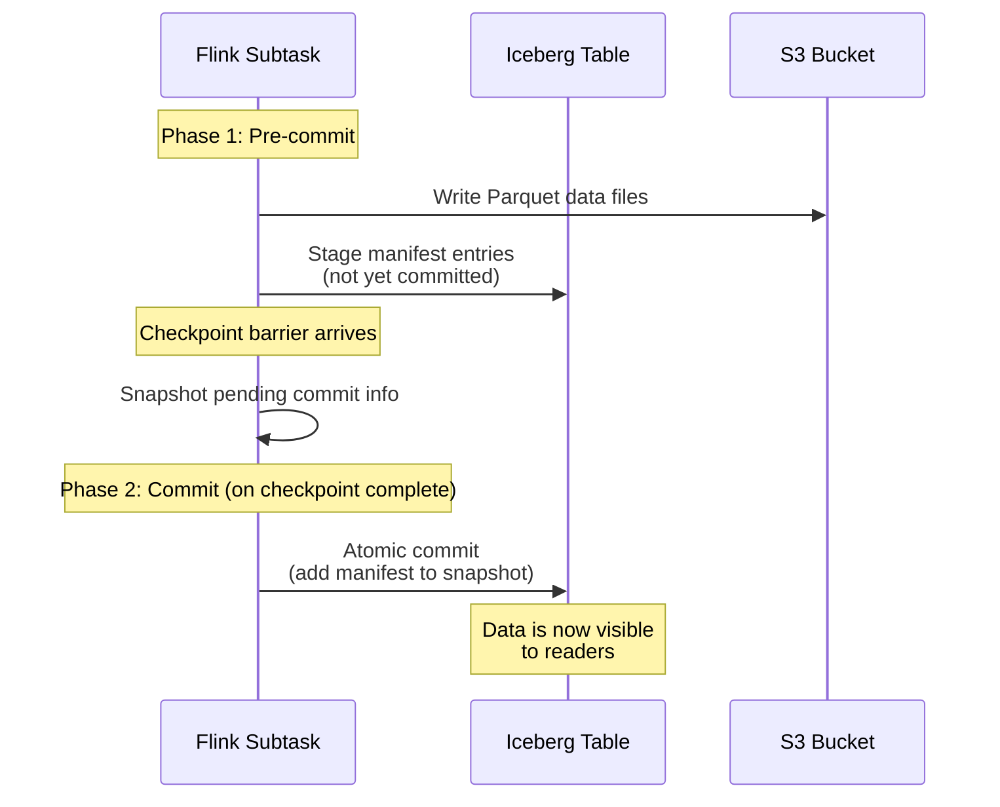

# 2. Real-Time Stream Processing with Apache Flink 🟡

> **The Problem:** Your Kafka topic `rides.raw` receives 2 million ride events per second. You need to compute "average fare per geohash per minute," detect surge-pricing conditions within 30-second windows, and identify sessions of driver activity with gaps of more than 10 minutes—all with **exactly-once** guarantees, meaning every ride is counted exactly once even if a Flink node crashes mid-computation. How do you calculate state over an infinite, never-ending stream of data?

---

## Batch vs. Stream: The Fundamental Shift

In batch processing, your data is **bounded**—a finite set of files on disk. You read all the data, compute, and write the result. In stream processing, your data is **unbounded**—an infinite sequence of events that never ends.

| Property | Batch (Spark) | Stream (Flink) |
|---|---|---|
| Data | Bounded (files) | Unbounded (events) |
| Computation | Runs, completes, exits | Runs forever |
| Time semantics | Processing time only | Event time + watermarks |
| State | Rebuilt from scratch each run | Maintained incrementally |
| Latency | Minutes to hours | Milliseconds to seconds |
| Failure recovery | Re-run entire job | Resume from checkpoint |

The key challenge of stream processing is: **How do you aggregate over an infinite dataset?** You can't wait for "all the data" because it never finishes arriving. The answer is **windows.**

---

## Windows: Slicing Infinity into Finite Chunks

A **window** defines a finite slice of the stream over which to compute an aggregation. Flink supports three fundamental window types:

### Tumbling Windows

A tumbling window has a **fixed size** and **no overlap.** Every event belongs to exactly one window.

```mermaid
gantt
    title Tumbling Windows (1-minute)
    dateFormat HH:mm
    axisFormat %H:%M
    section Events
        Window 1 [10:00–10:01) : 10:00, 1m
        Window 2 [10:01–10:02) : 10:01, 1m
        Window 3 [10:02–10:03) : 10:02, 1m
        Window 4 [10:03–10:04) : 10:03, 1m
```

**Use case:** "Count rides per minute in geohash `9q8yyk`."

**Flink SQL:**

```sql
SELECT
    geohash_encode(pickup_lat, pickup_lon, 6) AS geohash,
    TUMBLE_START(pickup_time, INTERVAL '1' MINUTE) AS window_start,
    COUNT(*) AS ride_count,
    AVG(fare_cents) AS avg_fare
FROM rides_raw
GROUP BY
    geohash_encode(pickup_lat, pickup_lon, 6),
    TUMBLE(pickup_time, INTERVAL '1' MINUTE);
```

**Flink DataStream API (Java):**

```java
DataStream<RideEvent> rides = env
    .addSource(new FlinkKafkaConsumer<>("rides.raw", new RideEventSchema(), kafkaProps));

rides
    .keyBy(ride -> geohashEncode(ride.pickupLat, ride.pickupLon, 6))
    .window(TumblingEventTimeWindows.of(Time.minutes(1)))
    .aggregate(new RideCountAggregate())
    .addSink(new IcebergSink(tableLoader));
```

### Sliding Windows

A sliding window has a **fixed size** and a **slide interval** smaller than the size, creating **overlapping** windows. An event may belong to multiple windows.

```mermaid
gantt
    title Sliding Windows (5-min size, 1-min slide)
    dateFormat HH:mm
    axisFormat %H:%M
    section Overlapping Windows
        Window A [10:00–10:05) : 10:00, 5m
        Window B [10:01–10:06) : 10:01, 5m
        Window C [10:02–10:07) : 10:02, 5m
```

**Use case:** "Compute a 5-minute moving average of fare, updated every minute." This smooths out spikes better than tumbling windows.

```sql
SELECT
    geohash_encode(pickup_lat, pickup_lon, 6) AS geohash,
    HOP_START(pickup_time, INTERVAL '1' MINUTE, INTERVAL '5' MINUTE) AS window_start,
    AVG(fare_cents) AS moving_avg_fare
FROM rides_raw
GROUP BY
    geohash_encode(pickup_lat, pickup_lon, 6),
    HOP(pickup_time, INTERVAL '1' MINUTE, INTERVAL '5' MINUTE);
```

### Session Windows

A session window groups events by **activity.** A new window starts with the first event and extends as long as events keep arriving within a **gap duration.** If no event arrives within the gap, the window closes.



**Use case:** "Calculate total earnings per driver session, where a session is a continuous period of activity with no gap longer than 10 minutes."

```sql
SELECT
    driver_id,
    SESSION_START(pickup_time, INTERVAL '10' MINUTE) AS session_start,
    SESSION_END(pickup_time, INTERVAL '10' MINUTE) AS session_end,
    SUM(fare_cents) AS session_earnings,
    COUNT(*) AS trip_count
FROM rides_raw
GROUP BY
    driver_id,
    SESSION(pickup_time, INTERVAL '10' MINUTE);
```

### Window Comparison

| Window Type | Overlap | State Size | Use Case |
|---|---|---|---|
| Tumbling | None | Bounded (1 window per key) | Periodic aggregations (rides/minute) |
| Sliding | Yes | size/slide windows per key | Moving averages, trend detection |
| Session | Dynamic | Unbounded (depends on activity) | User sessions, driver shifts |

---

## Event Time vs. Processing Time

### The Problem with Processing Time

If you window by **processing time** (when Flink receives the event), a network delay of 5 seconds can assign a 10:00:00 event to the 10:00:05 window. Late events silently corrupt your aggregations.

### Event Time and Watermarks

**Event time** is the timestamp embedded in the event itself (when the ride actually started). Flink uses **watermarks** to track the progress of event time across the stream.

A watermark `W(t)` is a declaration: *"I believe all events with timestamp ≤ t have arrived."*



**How watermarks are generated:**

```java
WatermarkStrategy<RideEvent> strategy = WatermarkStrategy
    .<RideEvent>forBoundedOutOfOrderness(Duration.ofSeconds(5))
    .withTimestampAssigner((ride, ts) -> ride.getPickupTime());

DataStream<RideEvent> rides = env
    .addSource(kafkaSource)
    .assignTimestampsAndWatermarks(strategy);
```

`forBoundedOutOfOrderness(5 seconds)` means: "Events may arrive up to 5 seconds out of order. Set the watermark to `max_event_time_seen - 5 seconds`."

### What Happens to Late Events?

Events that arrive after the watermark has passed their window can be:

1. **Dropped** (default) — simplest, acceptable when small percentage.
2. **Sent to a side output** — for logging, alerting, or separate processing.
3. **Used to update a previously-fired window** (allowed lateness).

```java
rides
    .keyBy(ride -> ride.getGeohash())
    .window(TumblingEventTimeWindows.of(Time.minutes(1)))
    .allowedLateness(Time.minutes(5))  // Accept late events for 5 more minutes
    .sideOutputLateData(lateOutputTag)  // Events beyond 5 minutes go here
    .aggregate(new RideCountAggregate());
```

---

## Distributed State Management

### Why State Matters

Aggregation requires **state.** To compute `COUNT(*)` per geohash per minute, Flink must maintain a counter for each active (geohash, window) combination. At 2M events/sec across thousands of geohashes, this state can grow to gigabytes.

### State Backends

| Backend | Storage | Capacity | Performance | Use Case |
|---|---|---|---|---|
| `HashMapStateBackend` | JVM heap | Limited by RAM | Fastest (ns) | Small state, low-latency |
| `EmbeddedRocksDBStateBackend` | On-disk (RocksDB) + RAM cache | Terabytes | Fast (µs) | Large state, production |

For our lakehouse, we use RocksDB:

```java
env.setStateBackend(new EmbeddedRocksDBStateBackend());

// Configure RocksDB for large state
Configuration config = new Configuration();
config.set(RocksDBConfigurableOptions.MAX_WRITE_BUFFER_NUMBER, 4);
config.set(RocksDBConfigurableOptions.WRITE_BUFFER_SIZE, MemorySize.ofMebiBytes(128));
```

### State Partitioning

Flink automatically **partitions state by key.** When you call `.keyBy(ride -> ride.getGeohash())`, Flink:

1. Hashes the geohash to determine a **key group.**
2. Assigns the key group to a specific **subtask** (parallel instance).
3. All events for that geohash go to the same subtask, which maintains local state.



---

## Exactly-Once Processing: The Chandy-Lamport Algorithm

### The Problem

If a Flink subtask crashes after processing 1000 events but before writing the aggregation result, what happens? Without checkpointing, those 1000 events are either:
- **Lost** (at-most-once): The new subtask starts from where Kafka says, missing the events.
- **Reprocessed** (at-least-once): The new subtask re-reads from Kafka, counting those events twice.

Neither is acceptable. We need **exactly-once**: every event affects the final result exactly once.

### The Chandy-Lamport Algorithm for Distributed Snapshots

Flink's checkpointing mechanism is based on the **Chandy-Lamport algorithm** (1985), adapted for stream processing. The key idea: inject **barrier markers** into the data stream that flow alongside regular events.



### Step-by-Step Checkpoint Process

1. **JobManager triggers checkpoint N.** Sends a trigger RPC to all source subtasks.

2. **Source subtasks record their Kafka offsets.** Source records: "At checkpoint N, I was at offset 5,847,231 on partition 3." Then it injects a **barrier N** into its output stream.

3. **Barriers flow through the DAG.** Each operator processes events normally until it receives barrier N from **all** its input channels.

4. **Barrier alignment.** If an operator has multiple inputs, it must wait for barrier N from every input before snapshotting. Events arriving on already-barriered channels are buffered (not processed) until alignment is complete.

5. **State snapshot.** Once aligned, the operator snapshots its state to durable storage (S3). With RocksDB, this is an **incremental snapshot**—only SST files changed since the last checkpoint are uploaded.

6. **Acknowledge to JobManager.** Once all operators have reported successful snapshots, checkpoint N is complete.

### Recovery After Failure

When a subtask crashes, Flink:

1. Retrieves the **last completed checkpoint** (e.g., checkpoint N).
2. Restores each subtask's state from the snapshot.
3. Resets Kafka consumer offsets to the positions recorded in checkpoint N.
4. Resumes processing from those offsets.

Events between checkpoint N and the crash are re-read from Kafka. But because the state is also restored to checkpoint N, the re-processing produces **identical results**—exactly-once semantics.



### Checkpoint Tuning

| Parameter | Default | Recommended | Why |
|---|---|---|---|
| `checkpointing.interval` | Disabled | 30s–60s | Balance between recovery time and overhead |
| `checkpointing.min-pause` | 0 | 10s | Prevent checkpoint storms under backpressure |
| `state.backend.incremental` | false | **true** | Only upload changed RocksDB SST files |
| `checkpointing.timeout` | 10 min | 5 min | Fail fast on stuck checkpoints |
| `execution.checkpointing.unaligned` | false | true (for high-throughput) | Avoid buffering during barrier alignment |

```java
env.enableCheckpointing(30_000); // 30 seconds
env.getCheckpointConfig().setCheckpointingMode(CheckpointingMode.EXACTLY_ONCE);
env.getCheckpointConfig().setMinPauseBetweenCheckpoints(10_000);
env.getCheckpointConfig().enableUnalignedCheckpoints();
```

---

## Unaligned Checkpoints: Solving the Backpressure Problem

### The Problem with Aligned Checkpoints

During barrier alignment, a subtask with 4 input channels must wait for barrier N to arrive on **all** channels before snapshotting. If one channel is slow (backpressured), the other three channels' events pile up in buffers, **amplifying** backpressure upstream.

### Unaligned Checkpoints (Flink 1.11+)

Instead of waiting for barrier alignment, each operator snapshots **immediately** when it receives the first barrier. Events that arrived on channels where the barrier hasn't passed yet are included in the snapshot as **in-flight data.**

| Checkpoint Type | Barrier Wait | Snapshot Size | Backpressure Impact |
|---|---|---|---|
| Aligned | Wait for all inputs | State only | Can amplify backpressure |
| Unaligned | Immediate | State + in-flight buffers | No amplification |

Trade-off: Unaligned checkpoints produce larger snapshots (because they include buffered events), but they don't stall the pipeline.

---

## End-to-End Exactly-Once with Iceberg

Checkpointing alone only guarantees **internal consistency**—the Flink state is consistent. To achieve **end-to-end exactly-once** (from Kafka to Iceberg), we need a **two-phase commit** protocol for the sink.

### The Two-Phase Commit Sink



1. **Pre-commit:** During normal processing, the Flink subtask writes Parquet files to S3 and prepares Iceberg manifest entries—but does **not** commit them.

2. **Checkpoint:** When the checkpoint barrier arrives, the subtask snapshots the list of pending files as part of its Flink state.

3. **Commit:** When the JobManager confirms the checkpoint is complete, the subtask atomically commits the pending files to the Iceberg table. If the subtask crashes before commit, the recovery process restores the pending list from the checkpoint and re-commits.

4. **Abort:** If the checkpoint fails, the pending files are discarded (orphan files cleaned up by Iceberg's `expire_snapshots`).

---

## Naive vs. Production: Computing Rides per Geohash

### Naive Batch Approach (Spark)

```python
# 💥 PROBLEM: Runs hourly. Data is stale. Separate codebase from streaming.
from pyspark.sql import SparkSession, functions as F

spark = SparkSession.builder.appName("rides_agg").getOrCreate()

# Read last hour's data (already on S3 from a separate ingestion job)
rides = spark.read.parquet(f"s3://lake/rides/dt={last_hour}/")

result = (
    rides
    .withColumn("geohash", F.expr("geohash_encode(pickup_lat, pickup_lon, 6)"))
    .withColumn("minute", F.date_trunc("minute", "pickup_time"))
    .groupBy("geohash", "minute")
    .agg(
        F.count("*").alias("ride_count"),
        F.avg("fare_cents").alias("avg_fare")
    )
)

# 💥 Overwrites previous results. No incremental update.
result.write.mode("overwrite").parquet("s3://lake/agg/rides_per_geohash/")
```

### Production Streaming Approach (Flink)

```java
// ✅ Runs continuously. Sub-second latency. Exactly-once. Same codebase for reprocessing.
StreamExecutionEnvironment env = StreamExecutionEnvironment.getExecutionEnvironment();
env.enableCheckpointing(30_000);
env.setStateBackend(new EmbeddedRocksDBStateBackend(true)); // incremental checkpoints

// 1. Source: Kafka with exactly-once consumer
KafkaSource<RideEvent> source = KafkaSource.<RideEvent>builder()
    .setBootstrapServers("kafka:9092")
    .setTopics("rides.raw")
    .setGroupId("lakehouse-agg-v1")
    .setStartingOffsets(OffsetsInitializer.committedOffsets(OffsetResetStrategy.EARLIEST))
    .setDeserializer(new RideEventDeserializer())
    .build();

DataStream<RideEvent> rides = env
    .fromSource(source, WatermarkStrategy
        .<RideEvent>forBoundedOutOfOrderness(Duration.ofSeconds(5))
        .withTimestampAssigner((ride, ts) -> ride.getPickupTime()),
        "Kafka Source");

// 2. Keyed tumbling window aggregation
DataStream<RideAggregation> aggregated = rides
    .keyBy(ride -> geohashEncode(ride.getPickupLat(), ride.getPickupLon(), 6))
    .window(TumblingEventTimeWindows.of(Time.minutes(1)))
    .allowedLateness(Time.minutes(5))
    .aggregate(new AggregateFunction<RideEvent, RideAccumulator, RideAggregation>() {
        @Override
        public RideAccumulator createAccumulator() {
            return new RideAccumulator();
        }

        @Override
        public RideAccumulator add(RideEvent event, RideAccumulator acc) {
            acc.count += 1;
            acc.fareSum += event.getFareCents();
            return acc;
        }

        @Override
        public RideAggregation getResult(RideAccumulator acc) {
            return new RideAggregation(acc.count, acc.fareSum / acc.count);
        }

        @Override
        public RideAccumulator merge(RideAccumulator a, RideAccumulator b) {
            a.count += b.count;
            a.fareSum += b.fareSum;
            return a;
        }
    });

// 3. Sink: Iceberg with exactly-once commits
FlinkSink.forRowData(aggregated)
    .tableLoader(TableLoader.fromHadoopTable("s3://lake/iceberg/rides_agg"))
    .overwrite(false)   // Append, don't overwrite
    .equalityFieldColumns(Arrays.asList("geohash", "window_start"))
    .upsert(true)       // Upsert on late-arriving updates
    .build();

env.execute("Rides Per Geohash Aggregation");
```

### The Difference

| Aspect | Naive Batch | Production Streaming |
|---|---|---|
| Latency | 1 hour | < 30 seconds |
| Correctness | Approximate (no late events) | Exactly-once + late event handling |
| Reprocessing | Re-run Spark job | Replay Kafka through same Flink job |
| State management | None (full recomputation) | Incremental (RocksDB + checkpoints) |
| Cost | $8K/month Spark cluster | Same Flink cluster as real-time |

---

## Scaling Flink for Lakehouse Workloads

### Parallelism and Slot Sharing

| Parameter | Recommendation | Rationale |
|---|---|---|
| TaskManager slots | 4 per TM | Match CPU cores |
| Source parallelism | = Kafka partitions (128) | 1:1 mapping for zero shuffle |
| Aggregation parallelism | 64–128 | Depends on key cardinality |
| Sink parallelism | 16–32 | Avoid too many small Parquet files |

### Memory Configuration

```yaml
# flink-conf.yaml for lakehouse workloads
taskmanager.memory.process.size: 16g
taskmanager.memory.managed.fraction: 0.4   # RocksDB uses managed memory
state.backend.rocksdb.memory.managed: true  # Let Flink manage RocksDB cache
taskmanager.memory.network.fraction: 0.15   # Buffer for shuffles
```

### Monitoring Key Metrics

| Metric | Healthy | Alarm |
|---|---|---|
| `checkpoint_duration` | < 30s | > 120s (checkpoint is timing out) |
| `checkpoint_size` | Stable | Growing unbounded (state leak) |
| `records_lag` (Kafka) | < 10,000 | > 1,000,000 (falling behind) |
| `backpressure` | < 0.5 | > 0.8 sustained (pipeline bottleneck) |
| `numRecordsOutPerSecond` | Matches input rate | Dropping (processing bottleneck) |

---

> **Key Takeaways**
>
> 1. **Windows slice infinity into finite chunks.** Tumbling windows for periodic aggregations, sliding windows for moving averages, session windows for activity-based grouping.
> 2. **Event time + watermarks solve out-of-order delivery.** Never window by processing time for analytical workloads. Watermarks with bounded out-of-orderness handle the 99.9% case; side outputs catch the rest.
> 3. **Flink's Chandy-Lamport checkpointing enables exactly-once processing.** Barriers flow through the DAG, triggering coordinated state snapshots. Recovery restores state and replays from Kafka—producing identical results.
> 4. **End-to-end exactly-once requires a two-phase commit sink.** Flink's internal consistency is necessary but not sufficient. The Iceberg sink must stage writes during processing and atomically commit them only when the checkpoint succeeds.
> 5. **RocksDB is the production state backend.** It spills to disk when state outgrows memory, supports incremental checkpoints (only changed SST files are uploaded), and scales to terabytes of state per subtask.
