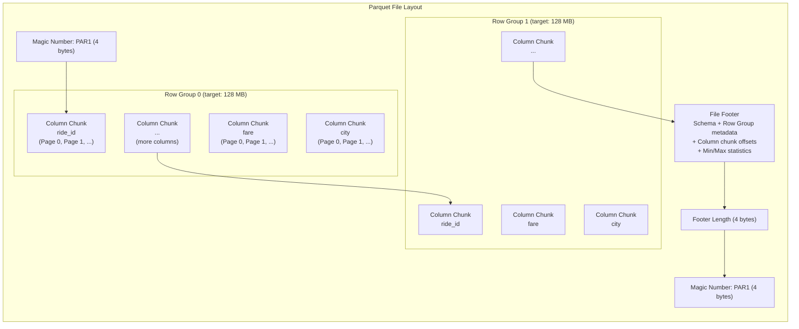
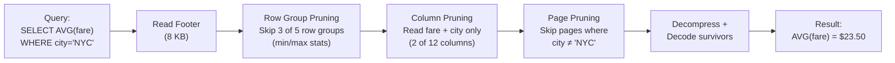
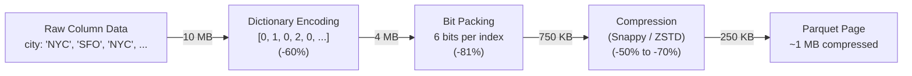

# 3. The Columnar Storage Format: Apache Parquet 🔴

> **The Problem:** Your Flink pipeline writes ride aggregations to S3. If you store them as JSON, a single day's data (172 billion events × ~500 bytes/event) consumes **86 TB** of raw storage. Your monthly S3 bill is $1.9 million (at $0.023/GB). Worse, every analytical query (`SELECT AVG(fare) WHERE city='NYC'`) must read and decompress the **entire file** to find the `fare` column—even though it only needs 2 of 12 columns. You are paying to store and scan data you don't need. Apache Parquet solves both problems simultaneously: **90% compression** through columnar encoding and **column pruning** that lets queries read only the columns they need.

---

## Row vs. Column: The Storage Layout Decision

### Row-Oriented Storage (JSON, CSV, Avro)

In row-oriented formats, each record's fields are stored contiguously:

```
Row 0: { ride_id: "R001", driver_id: "D42", fare: 2350, city: "NYC", ... }
Row 1: { ride_id: "R002", driver_id: "D17", fare: 1875, city: "SFO", ... }
Row 2: { ride_id: "R003", driver_id: "D42", fare: 3100, city: "NYC", ... }
```

On disk, the bytes are interleaved:

```
┌────────────────────────────────────────────────────────┐
│ R001 │ D42 │ 2350 │ NYC │ R002 │ D17 │ 1875 │ SFO │ …│
└────────────────────────────────────────────────────────┘
  Row 0 fields together    Row 1 fields together
```

### Column-Oriented Storage (Parquet, ORC)

In columnar formats, all values of a single column are stored contiguously:

```
┌──────────────────────────────────┐
│ Column: ride_id                  │
│ R001 │ R002 │ R003 │ R004 │ …   │
├──────────────────────────────────┤
│ Column: fare                     │
│ 2350 │ 1875 │ 3100 │ 2200 │ …   │
├──────────────────────────────────┤
│ Column: city                     │
│ NYC │ SFO │ NYC │ CHI │ …       │
└──────────────────────────────────┘
```

### Why Columnar Wins for Analytics

| Operation | Row (JSON/CSV) | Column (Parquet) |
|---|---|---|
| `SELECT fare WHERE city='NYC'` | Must read **all columns** to find `fare` and `city` | Reads **only** `fare` and `city` columns (2 of 12) |
| Data scanned (12 columns) | 100% of file | ~17% of file |
| Compression ratio | 2–3× (mixed data types) | 10–20× (homogeneous data compresses better) |
| Write pattern | Append a full row (fast) | Buffer rows, then write column-by-column (slower) |
| Read pattern (analytics) | Full scan | Column pruning + predicate pushdown |
| Read pattern (OLTP) | Read one row (fast) | Must reconstruct row from separate columns |

**The economic argument:** If your data lake holds 1 PB of raw JSON and you convert it to Parquet:

| Metric | JSON | Parquet | Savings |
|---|---|---|---|
| Storage size | 1 PB | ~100 TB | **90%** |
| S3 cost/month | $23,000 | $2,300 | **$20,700/month** |
| Scan cost (full) | $5,000/query | $500/query | **90%** |
| Scan cost (2 of 12 cols) | $5,000/query | $83/query | **98%** |

---

## Parquet File Structure: A Deep Dive

A Parquet file has a clear hierarchical structure designed for efficient partial reads:



### Hierarchy of Structures

| Level | What It Contains | Size Target | Purpose |
|---|---|---|---|
| **File** | Multiple row groups + footer | GBs | Unit of I/O from object storage |
| **Row Group** | One column chunk per column | ~128 MB | Unit of parallelism for readers |
| **Column Chunk** | Multiple pages of one column | Varies | All data for one column in one row group |
| **Page** | Encoded + compressed values | ~1 MB | Unit of decompression |
| **Footer** | Schema + statistics + offsets | KBs | Metadata for query planning |

### Reading a Parquet File (The Query Path)

When Trino executes `SELECT AVG(fare) FROM rides WHERE city = 'NYC'`:

1. **Read footer** (last few KB): Get schema, row group locations, column statistics.
2. **Row group pruning**: Check each row group's `city` column min/max stats. Skip row groups where `min > 'NYC'` or `max < 'NYC'`.
3. **Column pruning**: Only read `fare` and `city` column chunks (ignore 10 other columns).
4. **Page-level filtering**: Within each column chunk, use page-level stats to skip pages.
5. **Decompress and decode**: Only the surviving pages are decompressed.



**Data amplification avoided:** From a 1 GB Parquet file, this query might read only 15 MB.

---

## Encoding Techniques: How Parquet Achieves 90% Compression

Parquet applies encoding at the **page level** before general-purpose compression. Encoding exploits data patterns; compression handles the rest.

### 1. Dictionary Encoding

For columns with low cardinality (few distinct values), Parquet replaces repeated values with integer indices into a dictionary.

**Example: `city` column with 50 distinct cities across 1 million rows**

```
Without dictionary:
  "New York" "San Francisco" "New York" "Chicago" "New York" "San Francisco" ...
  (avg 10 bytes × 1M = 10 MB)

With dictionary:
  Dictionary: {0: "New York", 1: "San Francisco", 2: "Chicago", ...}
  Encoded:    [0, 1, 0, 2, 0, 1, ...]
  (4 bytes per int × 1M = 4 MB + 500 bytes dictionary = ~4 MB)

Savings: 60% before any compression
```

Dictionary encoding is **automatic** in Parquet. It falls back to plain encoding when the dictionary exceeds a threshold (default: 1 MB page size).

### 2. Run-Length Encoding (RLE)

For columns with consecutive repeated values, RLE replaces runs with (value, count) pairs.

**Example: `surge_active` boolean column (sorted by time, surge lasts ~30 minutes)**

```
Without RLE:
  [false, false, false, ...(50,000 times), true, true, ...(5,000 times), false, ...]
  (1 byte × 55,000 = 55 KB)

With RLE:
  [(false, 50000), (true, 5000), (false, ...)]
  (5 bytes × 3 pairs = 15 bytes)

Savings: 99.97%
```

### 3. Delta Encoding

For monotonically increasing columns (timestamps, offsets), store the difference between consecutive values.

**Example: `pickup_time` column (millisecond timestamps)**

```
Without delta:
  [1711929600000, 1711929600050, 1711929600120, 1711929600185, ...]
  (8 bytes × N)

With delta:
  Base: 1711929600000
  Deltas: [0, 50, 70, 65, ...]
  (8 bytes base + ~1 byte per delta due to small values)

Savings: ~87%
```

### 4. Bit Packing

After dictionary encoding, the integer indices often have small values. Bit packing uses exactly the number of bits needed.

**Example: Dictionary with 50 entries → 6 bits per index (2⁶ = 64 > 50)**

```
Without bit packing: 32 bits per index × 1M = 4 MB
With bit packing:     6 bits per index × 1M = 750 KB

Savings: 81%
```

### Combined Effect: The Encoding Pipeline



**Net compression: 10 MB → 250 KB = 97.5% reduction.**

---

## Compression Codecs: Choosing the Right One

After encoding, Parquet applies a general-purpose compression codec to each page:

| Codec | Compression Ratio | Compress Speed | Decompress Speed | Use Case |
|---|---|---|---|---|
| **Uncompressed** | 1× | ∞ | ∞ | Debugging, already-compressed data |
| **Snappy** | 2–4× | ~500 MB/s | ~1,500 MB/s | Default. Fast decompression for interactive queries |
| **ZSTD** | 4–8× | ~200 MB/s | ~800 MB/s | Best ratio-to-speed balance. Recommended for lakehouse |
| **GZIP** | 3–6× | ~50 MB/s | ~300 MB/s | Legacy. Avoid for new workloads |
| **LZ4** | 2–3× | ~700 MB/s | ~2,000 MB/s | Ultra-low latency reads. Lowest ratio |

### The ZSTD Sweet Spot

For lakehouse workloads, we recommend **ZSTD (level 3)**:
- 2× better compression than Snappy → halves storage cost.
- Decompression is fast enough for interactive Trino queries (~800 MB/s).
- Supports dictionary mode for even better compression on repetitive data.

```python
# Writing Parquet with ZSTD in PyArrow
import pyarrow as pa
import pyarrow.parquet as pq

table = pa.Table.from_pandas(df)
pq.write_table(
    table,
    "rides.parquet",
    compression="ZSTD",
    compression_level=3,
    row_group_size=128 * 1024 * 1024,  # 128 MB row groups
    use_dictionary=True,
    write_statistics=True,  # Enable min/max stats for predicate pushdown
)
```

---

## Row Group Sizing: The Critical Trade-off

Row group size is the single most important Parquet tuning parameter:

| Row Group Size | Pros | Cons |
|---|---|---|
| Small (8–16 MB) | Fine-grained row group pruning, less memory for writers | More S3 GET requests, worse compression, larger footer |
| Medium (128 MB) | Good balance of pruning and I/O efficiency | Standard for most workloads |
| Large (256–512 MB) | Fewer S3 requests, better compression | Coarse pruning, high memory for writers |

### Why 128 MB is the Default

S3 has a **per-request latency** of ~50–100 ms. Reading a 128 MB row group in a single GET request amortizes this overhead. With 8 MB row groups, you'd need 16× more requests for the same data.

```
128 MB row group, 10 row groups per file:
  S3 cost = 10 GET requests × $0.0004 = $0.004

8 MB row group, 160 row groups per file:
  S3 cost = 160 GET requests × $0.0004 = $0.064

16× more expensive for the same data.
```

### The Small File Problem

Flink checkpoints every 30 seconds. If each checkpoint produces a Parquet file, you get:

```
86,400 seconds/day ÷ 30 seconds = 2,880 files/day per partition
× 128 Kafka partitions = 368,640 files/day
× 365 days = 134 million files/year
```

Each file might be only 1–5 MB—far below the 128 MB row group target. This is the **small file problem,** and it destroys query performance (thousands of S3 LIST + GET calls).

**Solution:** Iceberg's **compaction** (Chapter 4) periodically merges small files into optimally-sized ones.

---

## Predicate Pushdown and Statistics

### Column Statistics in the Footer

Parquet stores **min/max statistics** for each column chunk (per row group) and optionally per page:

```
Footer metadata for row group 0:
  column: city
    min: "CHI"
    max: "SFO"
    null_count: 0
    num_values: 1,000,000

  column: fare_cents
    min: 350
    max: 15200
    null_count: 1,247
    num_values: 998,753
```

### How Predicate Pushdown Works

When a query engine (Trino, Spark) receives `WHERE city = 'NYC'`:

1. **Read the footer** (one S3 GET for the last few KB).
2. **Check each row group's `city` min/max:**
   - Row group 0: min="CHI", max="SFO" → "NYC" is in range → **must read**.
   - Row group 1: min="ATL", max="DEN" → "NYC" > max → **skip entirely**.
   - Row group 2: min="LAX", max="SEA" → "NYC" is in range → **must read**.

3. **For surviving row groups, read only the needed column chunks.**

### Bloom Filters (Parquet 2.0+)

Min/max stats fail for high-cardinality columns (e.g., `ride_id`). The min might be `R000001` and max `R999999`, so every row group "might" contain any given ride ID.

**Bloom filters** are probabilistic data structures written per column chunk that answer "Is value X definitely NOT in this chunk?" with zero false negatives:

```python
pq.write_table(
    table,
    "rides.parquet",
    compression="ZSTD",
    write_statistics=True,
    # Enable bloom filters for high-cardinality lookup columns
    column_encoding={"ride_id": "PLAIN"},  # Bloom filters work with PLAIN encoding
)
```

| Filter Type | False Positives | False Negatives | Best For |
|---|---|---|---|
| Min/Max stats | Yes (range overlap) | No | Low-cardinality, sorted columns |
| Bloom filter | Yes (configurable) | No | High-cardinality point lookups |

---

## Naive vs. Production: Writing Parquet from Flink

### Naive Approach: JSON to S3

```python
# 💥 DISASTER: Writing JSON directly to S3 from a streaming pipeline.
import json
import boto3

s3 = boto3.client('s3')

def write_batch(events):
    # 💥 JSON: No compression, no column pruning, no statistics.
    json_bytes = "\n".join(json.dumps(e) for e in events).encode("utf-8")

    # 💥 One tiny file per batch. Small file problem.
    key = f"rides/dt={today}/batch_{uuid4()}.json"
    s3.put_object(Bucket="lake", Key=key, Body=json_bytes)

    # Cost for 1 PB/year:
    # Storage: $23,000/month (no compression)
    # Queries: Full scan every time (no column pruning)
```

### Production Approach: Parquet with Optimal Settings

```python
# ✅ Write Parquet with columnar encoding, compression, and statistics.
import pyarrow as pa
import pyarrow.parquet as pq

# Define schema with appropriate types for best encoding
schema = pa.schema([
    pa.field("ride_id",     pa.string()),
    pa.field("driver_id",   pa.string()),
    pa.field("rider_id",    pa.string()),
    pa.field("pickup_lat",  pa.float64()),
    pa.field("pickup_lon",  pa.float64()),
    pa.field("dropoff_lat", pa.float64()),
    pa.field("dropoff_lon", pa.float64()),
    pa.field("fare_cents",  pa.int32()),       # ✅ int32 not int64—saves 50% on this column
    pa.field("pickup_time", pa.timestamp("ms")),
    pa.field("dropoff_time",pa.timestamp("ms")),
    pa.field("city_id",     pa.int16()),       # ✅ int16 for 50 cities—dictionary encodes perfectly
    pa.field("surge_mult",  pa.float32()),
])

def write_parquet_batch(records, output_path):
    table = pa.Table.from_pydict(records, schema=schema)

    pq.write_table(
        table,
        output_path,
        compression="ZSTD",
        compression_level=3,
        row_group_size=128 * 1024 * 1024,
        use_dictionary=["ride_id", "driver_id", "rider_id", "city_id"],
        write_statistics=True,
        # ✅ Sort by city_id for optimal row group pruning on city filters
        # (done before calling write_table)
    )

# Cost for 1 PB raw → ~100 TB Parquet:
# Storage: $2,300/month (90% compression)
# Queries: Column pruning + predicate pushdown
```

---

## The Parquet Memory Layout: Why Columnar Is CPU-Friendly

Beyond I/O savings, columnar storage is dramatically more **CPU-friendly** due to how modern processors work:

### SIMD Vectorization

When all values in a column are the same type and stored contiguously, the CPU can process them using **SIMD (Single Instruction, Multiple Data)** instructions:

```
Row-oriented (fare values scattered among other fields):
  CPU processes: [R001, D42, 2350, NYC, 10:30, R002, D17, 1875, SFO, ...]
  Cache line loads: Mostly irrelevant data. Branch-heavy extraction logic.

Column-oriented (fare values contiguous):
  CPU processes: [2350, 1875, 3100, 2200, 1950, 2800, ...]
  SIMD AVX-256: Process 8 int32 fares simultaneously per instruction.
```

### Cache Efficiency

A CPU cache line is 64 bytes. In columnar layout:
- One cache line holds **16 int32 fare values** → all useful for `SUM(fare)`.
- In row layout, one cache line might hold **one complete row** → only 4 bytes (the fare) are useful.

```
Cache utilization for SUM(fare):
  Row format:    4 / 64 = 6.25% useful data per cache line
  Column format: 64 / 64 = 100% useful data per cache line

16× better cache utilization.
```

---

## Parquet for the Lakehouse: Best Practices

### File Sizing Guidelines

| Scenario | Target File Size | Row Group Size | Rationale |
|---|---|---|---|
| Streaming ingestion (Flink) | 64–256 MB | 64 MB | Frequent writes, compacted later by Iceberg |
| Batch compaction (Iceberg) | 256 MB–1 GB | 128 MB | Optimal for Trino scan performance |
| Archive / cold tier | 1–2 GB | 256 MB | Minimize S3 request overhead |

### Sort Order Matters

Sorting data before writing to Parquet dramatically improves:
1. **Run-length encoding** — sorted columns have longer runs of identical values.
2. **Min/max statistics** — tighter bounds mean more row groups can be skipped.
3. **Dictionary encoding** — better locality means dictionaries stay small.

```
Unsorted city column (random order):
  Row group 0: min=ATL, max=SEA → almost every city query must read this
  Row group 1: min=BOS, max=SFO → same problem

Sorted by city:
  Row group 0: min=ATL, max=DEN → skip for city='NYC'
  Row group 1: min=HOU, max=NYC → read for city='NYC'
  Row group 2: min=PHI, max=SEA → skip for city='NYC'
```

Iceberg (Chapter 4) manages sort order automatically through its **sort order specification** in table metadata.

---

> **Key Takeaways**
>
> 1. **Columnar storage is not optional for analytics.** Storing analytical data in JSON or CSV is burning money—10× more storage, 10× more scan cost, and no predicate pushdown. Parquet pays for itself on day one.
> 2. **Encoding happens before compression.** Dictionary encoding, RLE, delta encoding, and bit packing exploit data patterns first. General-purpose compression (ZSTD) handles the rest. Combined, they achieve 90–97% reduction.
> 3. **Row group size controls the I/O trade-off.** 128 MB is the sweet spot: large enough to amortize S3 request latency, small enough for meaningful row group pruning.
> 4. **Statistics enable predicate pushdown.** Min/max stats per row group (and per page) let query engines skip irrelevant data without reading it. Always write statistics. Always sort your data.
> 5. **Columnar layout is CPU-friendly.** Contiguous same-type values enable SIMD vectorization and maximize cache line utilization—up to 16× better than row-oriented formats for analytical aggregations.
