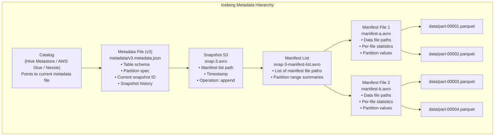
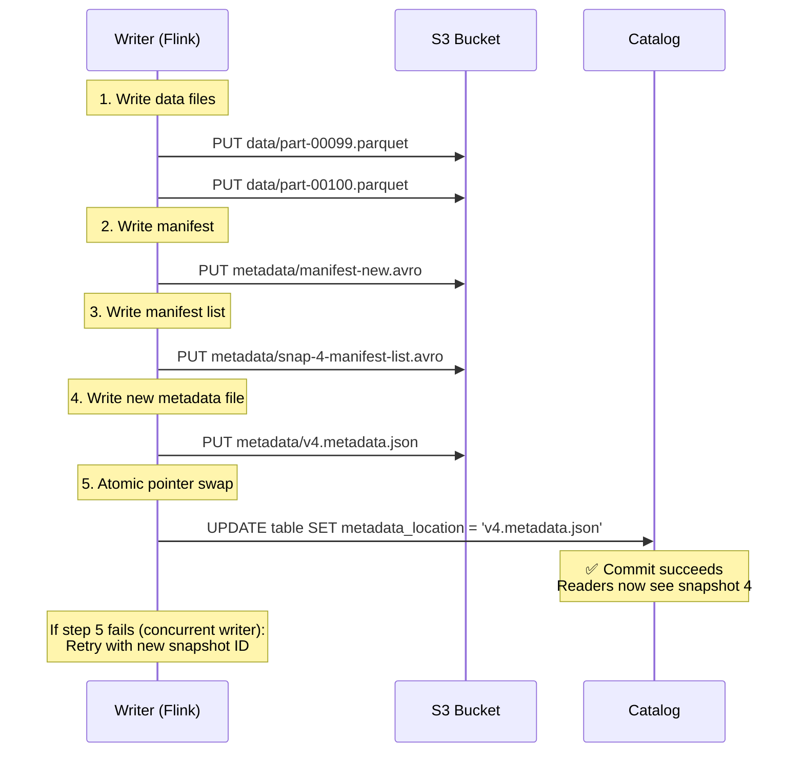
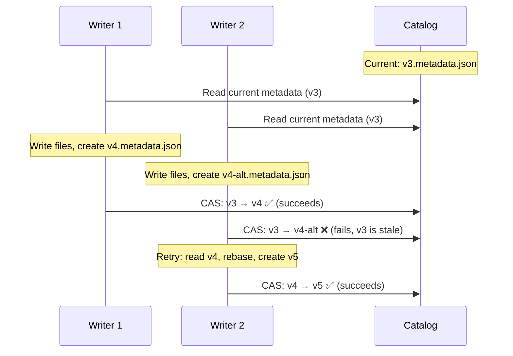
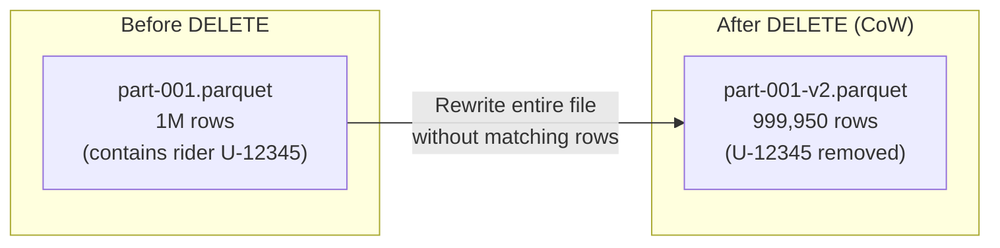
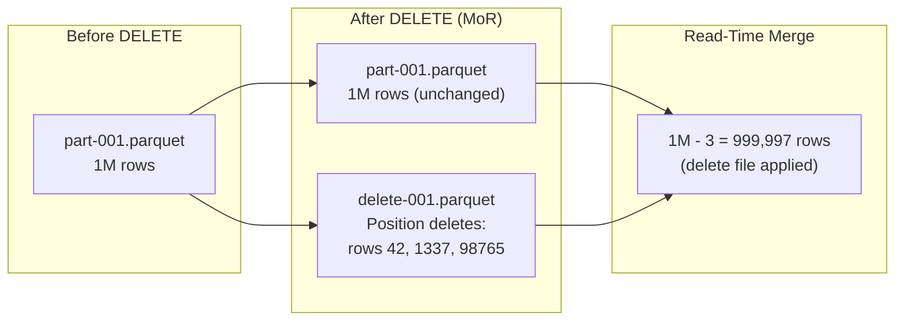
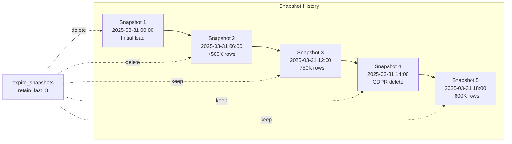
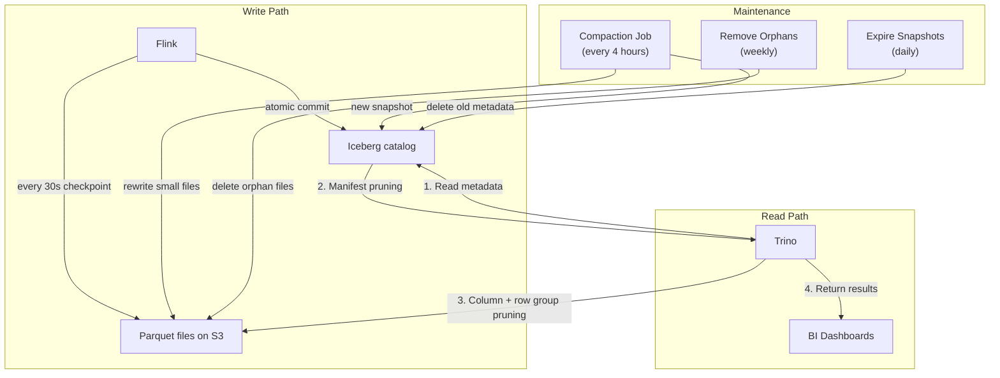

# 4. The Open Table Format: Apache Iceberg 🔴

> **The Problem:** You have 50 TB of Parquet files on S3 organized as `s3://lake/rides/city=NYC/dt=2025-03-31/part-00001.parquet`. A GDPR deletion request arrives: "Delete all rides for user U-12345." In a traditional data lake, you must: (1) scan every Parquet file to find rows matching that user, (2) read entire files into memory, (3) filter out the rows, (4) rewrite the entire files, (5) hope no concurrent reader sees a half-written state. For a 50 TB table, this takes hours and risks data corruption. Apache Iceberg gives you `DELETE FROM rides WHERE rider_id = 'U-12345'`—executed atomically in minutes, with snapshot isolation guaranteeing readers never see intermediate states.

---

## The Data Lake Problem: Files Without a Table

A traditional "data lake" is a lie. It's not a lake—it's a **swamp.** You have:

- **Files on S3** organized by partition directories (Hive-style: `city=NYC/dt=2025-03-31/`).
- **No transaction log.** Two writers can create conflicting files simultaneously.
- **No schema enforcement.** A typo in a column name goes undetected until query time.
- **No atomic operations.** A multi-file write that fails halfway leaves the table in an inconsistent state.
- **No time travel.** Once you overwrite a partition, the old data is gone forever.

| Operation | Traditional Data Lake (Hive) | Iceberg |
|---|---|---|
| `INSERT` | Write new files to partition directory | Atomic snapshot commit |
| `UPDATE` / `DELETE` | Read-filter-rewrite entire partition | Copy-on-write or merge-on-read |
| Schema evolution | Break all downstream consumers | Add/rename/drop columns safely |
| Concurrent writers | Last writer wins (data loss) | Optimistic concurrency (retry) |
| Time travel | Not possible | `SELECT * FROM rides VERSION AS OF <snapshot_id>` |
| Partition evolution | Rewrite entire table | Change partitioning without rewriting data |

---

## How Iceberg Works: The Metadata Tree

Iceberg's key innovation is a **metadata tree** that separates logical table state from physical file locations. This tree has three levels:



### Level 1: Metadata File

The metadata file is the **root of the table's state.** It contains:

```json
{
  "format-version": 2,
  "table-uuid": "a1b2c3d4-...",
  "schema": {
    "fields": [
      {"id": 1, "name": "ride_id", "type": "string", "required": true},
      {"id": 2, "name": "fare_cents", "type": "int", "required": true},
      {"id": 3, "name": "city", "type": "string", "required": true},
      {"id": 4, "name": "pickup_time", "type": "timestamptz", "required": true}
    ]
  },
  "partition-spec": [
    {"source-id": 3, "field-id": 1000, "name": "city", "transform": "identity"},
    {"source-id": 4, "field-id": 1001, "name": "pickup_day", "transform": "day"}
  ],
  "current-snapshot-id": 3,
  "snapshots": [
    {"snapshot-id": 1, "timestamp-ms": 1711929600000, "manifest-list": "s3://lake/metadata/snap-1-manifest-list.avro"},
    {"snapshot-id": 2, "timestamp-ms": 1711933200000, "manifest-list": "s3://lake/metadata/snap-2-manifest-list.avro"},
    {"snapshot-id": 3, "timestamp-ms": 1711936800000, "manifest-list": "s3://lake/metadata/snap-3-manifest-list.avro"}
  ]
}
```

### Level 2: Manifest List

The manifest list is an Avro file that lists all manifest files belonging to a snapshot, along with **partition range summaries** for quick filtering:

```
Manifest List for Snapshot 3:
┌──────────────────────┬────────────────────────┬──────────────┐
│ manifest_path        │ partition_summary       │ added_files  │
├──────────────────────┼────────────────────────┼──────────────┤
│ manifest-a.avro      │ city: [ATL, DEN]       │ 50           │
│ manifest-b.avro      │ city: [HOU, NYC]       │ 75           │
│ manifest-c.avro      │ city: [PHI, SEA]       │ 60           │
└──────────────────────┴────────────────────────┴──────────────┘
```

A query for `city = 'NYC'` reads only `manifest-b.avro`—skipping 2 of 3 manifests.

### Level 3: Manifest File

Each manifest file lists individual data files with **per-file statistics:**

```
Manifest File manifest-b.avro:
┌─────────────────────────┬───────────┬─────────────────┬──────────────────┐
│ file_path               │ file_size │ city            │ fare_cents       │
│                         │           │ (partition val) │ min / max        │
├─────────────────────────┼───────────┼─────────────────┼──────────────────┤
│ data/part-00042.parquet │ 128 MB    │ NYC             │ 350 / 15200      │
│ data/part-00043.parquet │ 128 MB    │ NYC             │ 425 / 12800      │
│ data/part-00044.parquet │ 96 MB     │ LAX             │ 275 / 9800       │
└─────────────────────────┴───────────┴─────────────────┴──────────────────┘
```

For `WHERE city = 'NYC' AND fare_cents > 10000`, Iceberg reads manifest-b, sees that `part-00044.parquet` is `city=LAX` (skip), and only passes `part-00042` and `part-00043` to the query engine.

---

## Snapshot Isolation: ACID on Object Storage

### The Commit Protocol

Every write operation in Iceberg creates a new **snapshot.** The commit is an atomic metadata file swap:



### Why This Is ACID

| Property | How Iceberg Achieves It |
|---|---|
| **Atomicity** | The catalog pointer swap is a single atomic operation. Either all new files are visible (new snapshot) or none are. |
| **Consistency** | Schema validation happens at write time. Partition specs are enforced by the writer. |
| **Isolation** | Snapshot isolation: readers see a consistent snapshot. Concurrent readers and writers don't interfere. |
| **Durability** | Data files are on S3 (11 nines durability). Metadata files are immutable and versioned. |

### Optimistic Concurrency Control

What happens when two Flink jobs commit simultaneously?



The catalog swap uses **compare-and-swap (CAS):** "Set the pointer to v4 only if the current value is v3." If another writer already moved it to v4, the swap fails, and the writer retries by rebasing its changes on top of the new state.

---

## Copy-on-Write vs. Merge-on-Read

Iceberg supports two strategies for `UPDATE` and `DELETE` operations:

### Copy-on-Write (CoW)

Rewrite affected data files with the rows removed or modified. Slower writes, faster reads.



### Merge-on-Read (MoR)

Write a small **delete file** (or **equality delete file**) that marks rows for deletion. Readers merge data files with delete files at query time.



### Which Strategy to Choose?

| Dimension | Copy-on-Write | Merge-on-Read |
|---|---|---|
| Write cost | High (rewrite entire file) | Low (write small delete file) |
| Read cost | Low (no merge needed) | Higher (apply deletes at read time) |
| Storage overhead | Temporary (new file replaces old) | Accumulates until compaction |
| Best for | Infrequent updates, read-heavy tables | Frequent updates (CDC), streaming ingestion |
| Lakehouse recommendation | Periodic GDPR deletes | Streaming upserts from Flink |

---

## Schema Evolution Without Rewriting Data

Traditional Hive tables encode the schema in the partition directory structure. Changing the schema means rewriting all data. Iceberg solves this with **column IDs.**

### How It Works

Every column has a persistent **integer ID** assigned at creation. Column names are just labels that can change freely:

```
Schema v1:                       Schema v2 (after evolution):
  id=1 "ride_id"    STRING         id=1 "ride_id"       STRING
  id=2 "fare"       INT            id=2 "fare_cents"    INT      ← renamed
  id=3 "city"       STRING         id=3 "city"          STRING
                                   id=4 "tip_cents"     INT      ← added
```

- **Rename column:** Change the label for id=2 from `fare` to `fare_cents`. Old Parquet files still have column id=2; Iceberg maps it to the new name.
- **Add column:** Assign id=4 to `tip_cents`. Old files don't have this column; reads return `NULL` for it.
- **Drop column:** Remove id=3 from the schema. Old files still contain the data, but it's invisible to readers.
- **Reorder columns:** Change the display order. Physical file layout is unchanged.

```sql
-- Schema evolution DDL (all non-destructive, no data rewrite)
ALTER TABLE rides RENAME COLUMN fare TO fare_cents;
ALTER TABLE rides ADD COLUMN tip_cents INT AFTER fare_cents;
ALTER TABLE rides DROP COLUMN legacy_field;
```

---

## Partition Evolution

In Hive, changing the partition scheme (e.g., from `daily` to `hourly`) requires rewriting the entire table. Iceberg supports **partition evolution** without rewriting:

```sql
-- Original: partitioned by day
CREATE TABLE rides (
    ride_id STRING,
    pickup_time TIMESTAMP,
    city STRING,
    fare_cents INT
) PARTITIONED BY (days(pickup_time), city);

-- Later: switch to hourly partitioning for newer data
ALTER TABLE rides SET PARTITION SPEC (hours(pickup_time), city);
```

After this change:
- **Old data** remains partitioned by day—not rewritten.
- **New data** is partitioned by hour.
- **Queries** that span both eras work transparently. Iceberg's query planning handles the mixed partition specs.

---

## Time Travel and Rollback

Every snapshot is preserved (until expiration), enabling powerful time-travel queries:

```sql
-- Query the table as it was at a specific snapshot
SELECT * FROM rides VERSION AS OF 3;

-- Query the table as of a timestamp
SELECT * FROM rides TIMESTAMP AS OF '2025-03-31 12:00:00';

-- Compare two snapshots (audit changes)
SELECT * FROM rides VERSION AS OF 4
EXCEPT
SELECT * FROM rides VERSION AS OF 3;

-- Rollback to a previous snapshot (undo a bad write)
CALL system.rollback_to_snapshot('rides', 3);
```

### Snapshot Lifecycle



---

## Table Maintenance: Compaction and Cleanup

### The Compaction Problem

Streaming ingestion creates many small files (one per Flink checkpoint, every 30 seconds). Without compaction, a table accumulates millions of tiny files, each requiring a separate S3 GET:

```
Before compaction:
  data/part-00001.parquet  (2 MB)
  data/part-00002.parquet  (3 MB)
  data/part-00003.parquet  (1 MB)
  ... (10,000 files averaging 2 MB each)

  Query: 10,000 S3 GET requests × 50ms = 500 seconds just for I/O overhead

After compaction:
  data/compacted-00001.parquet  (256 MB)
  data/compacted-00002.parquet  (256 MB)
  ... (78 files)

  Query: 78 S3 GET requests × 50ms = 4 seconds
```

### Running Compaction

```sql
-- Rewrite small files into optimally-sized ones
CALL system.rewrite_data_files(
    table => 'rides',
    strategy => 'binpack',
    options => map(
        'target-file-size-bytes', '268435456',  -- 256 MB
        'min-file-size-bytes',    '67108864',   -- 64 MB (don't rewrite files already >64 MB)
        'max-file-size-bytes',    '536870912'   -- 512 MB
    )
);

-- Sort-order compaction (rewrite files sorted by city, pickup_time)
CALL system.rewrite_data_files(
    table => 'rides',
    strategy => 'sort',
    sort_order => 'city ASC NULLS LAST, pickup_time ASC'
);
```

### Cleanup Operations

```sql
-- Remove old snapshots (keep last 3 days)
CALL system.expire_snapshots('rides', TIMESTAMP '2025-03-28 00:00:00');

-- Delete orphan files (from failed writes)
CALL system.remove_orphan_files(
    table => 'rides',
    older_than => TIMESTAMP '2025-03-30 00:00:00'
);

-- Rewrite manifest files (merge small manifests)
CALL system.rewrite_manifests('rides');
```

---

## Naive vs. Production: Handling a GDPR Delete

### Naive Approach: Partition Overwrite

```python
# 💥 DISASTER: Read-filter-rewrite entire partition for one user's data.
from pyspark.sql import SparkSession

spark = SparkSession.builder.getOrCreate()

# Must scan EVERY partition because we don't know where user U-12345 has rides
for partition_path in list_all_partitions("s3://lake/rides/"):
    df = spark.read.parquet(partition_path)

    # 💥 Read entire partition into memory
    filtered = df.filter(df.rider_id != "U-12345")

    if filtered.count() != df.count():
        # 💥 Rewrite entire partition (even if only 1 row deleted)
        filtered.write.mode("overwrite").parquet(partition_path)

        # 💥 No atomicity: readers during rewrite see partial data
        # 💥 No audit trail: old data is permanently gone
        # 💥 No concurrency control: another writer may be writing here too

# Time: 6+ hours for 50 TB. Risk: data corruption from concurrent access.
```

### Production Approach: Iceberg Merge-on-Read Delete

```sql
-- ✅ Atomic, auditable, concurrent-safe GDPR delete.
-- Uses merge-on-read: writes small delete files instead of rewriting data.

-- 1. Execute the delete (takes seconds to minutes)
DELETE FROM rides WHERE rider_id = 'U-12345';

-- What actually happens:
-- • Iceberg scans manifest file statistics to find files that MIGHT contain U-12345
-- • For matching files, writes positional delete files (small Parquet files listing row positions)
-- • Creates new snapshot (S4) with delete files added to manifests
-- • Atomic commit: readers before commit see S3 (no delete), readers after see S4 (delete applied)

-- 2. Verify the delete
SELECT COUNT(*) FROM rides WHERE rider_id = 'U-12345';
-- Result: 0

-- 3. Audit trail via time travel
SELECT COUNT(*) FROM rides VERSION AS OF 3 WHERE rider_id = 'U-12345';
-- Result: 47 (the rows that were deleted)

-- 4. Eventually compact to physically remove the data
CALL system.rewrite_data_files(table => 'rides', strategy => 'binpack');
CALL system.expire_snapshots('rides', TIMESTAMP '2025-03-30 00:00:00');
-- Now the old data files (before delete) are physically removed from S3.
```

| Aspect | Naive Partition Overwrite | Iceberg Delete |
|---|---|---|
| Time | 6+ hours | Seconds to minutes |
| Atomicity | None (partial writes visible) | Full (snapshot isolation) |
| Audit trail | None (old data destroyed) | Time travel to pre-delete snapshot |
| Concurrent reads | Broken during rewrite | Unaffected (snapshot isolation) |
| Storage overhead | 2× during rewrite | Small delete files until compaction |

---

## Iceberg in the Lakehouse: End-to-End Flow



---

## Iceberg vs. Delta Lake vs. Hudi

| Feature | Iceberg | Delta Lake | Hudi |
|---|---|---|---|
| **Governance** | Apache (vendor-neutral) | Linux Foundation (Databricks origin) | Apache |
| **Hidden partitioning** | ✅ | ❌ (requires explicit partition columns) | Partial |
| **Partition evolution** | ✅ (no rewrite) | ❌ (requires rewrite) | ❌ |
| **Schema evolution** | Full (add, rename, drop, reorder) | Add, rename | Add |
| **Time travel** | ✅ | ✅ | ✅ |
| **Row-level deletes** | CoW + MoR | CoW + MoR (DV) | MoR primary |
| **Merge-on-read** | Position + equality deletes | Deletion Vectors | Log-based |
| **Catalog** | Pluggable (Hive, Glue, Nessie, REST) | Unity Catalog | Hive Metastore |
| **Engine support** | Spark, Flink, Trino, Dremio, Snowflake | Spark (native), others via UniForm | Spark, Flink |
| **Best for** | Multi-engine lakehouse | Databricks ecosystem | CDC-heavy workloads |

---

> **Key Takeaways**
>
> 1. **Iceberg turns a file swamp into a proper database.** By adding a metadata tree (metadata file → manifest list → manifest → data files), Iceberg provides ACID transactions, schema evolution, time travel, and partition evolution on top of dumb object storage.
> 2. **Snapshot isolation is the foundation.** Every write creates a new immutable snapshot. Readers always see a consistent state. Concurrent writers use optimistic concurrency control with compare-and-swap on the catalog pointer.
> 3. **Merge-on-read makes streaming deletes practical.** Instead of rewriting entire Parquet files for every delete, write a small delete file. Compact periodically to reclaim space and maintain read performance.
> 4. **The metadata tree enables planning-time pruning.** Manifest-level partition summaries, file-level column statistics, and Parquet row-group statistics form a three-layer filter—most data never leaves S3.
> 5. **Table maintenance is not optional.** Without compaction, streaming ingestion creates millions of small files that destroy query performance. Schedule `rewrite_data_files`, `expire_snapshots`, and `remove_orphan_files` as regular maintenance jobs.
