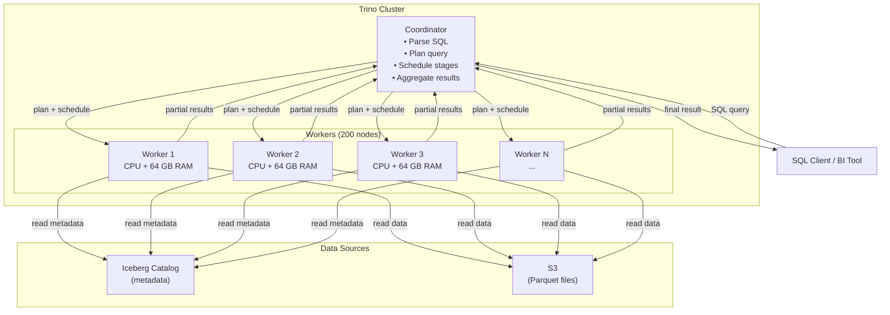
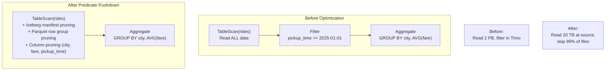
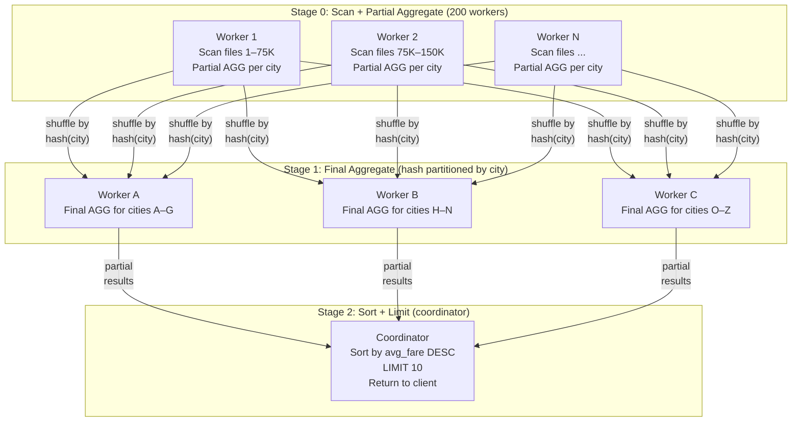
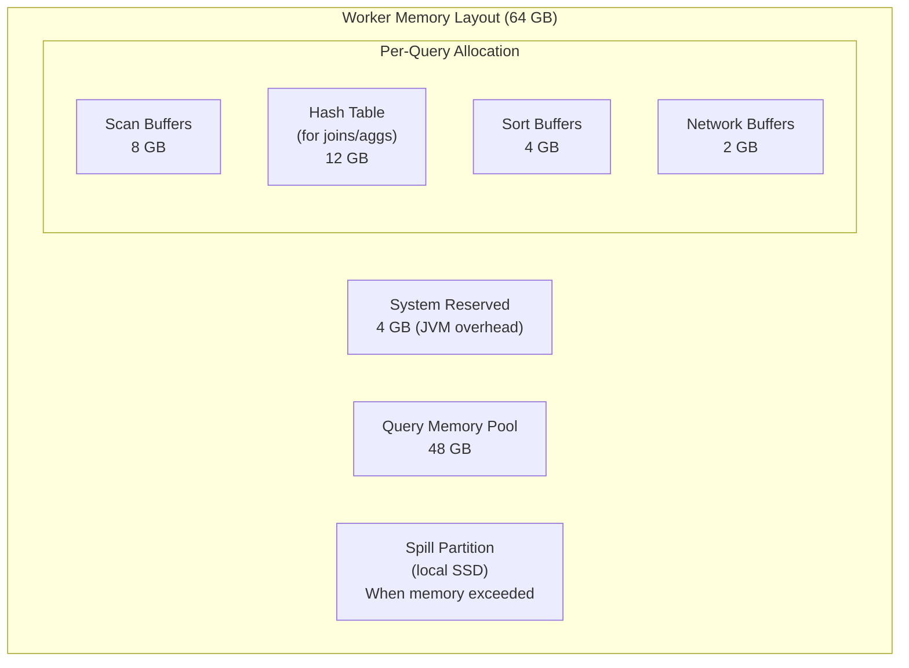
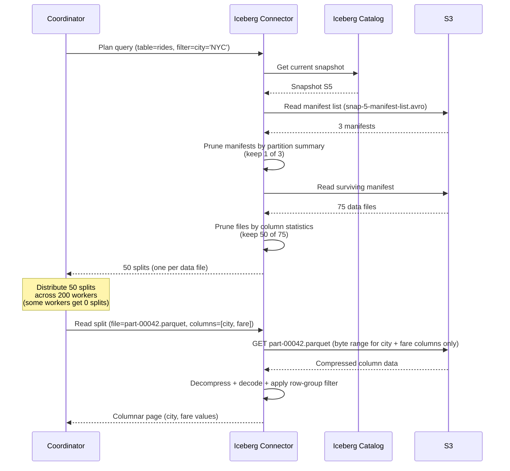

# 5. The Query Engine: Presto/Trino 🟡

> **The Problem:** Your Iceberg table on S3 contains 2 petabytes of ride data across 15 million Parquet files. An analyst runs `SELECT city, AVG(fare_cents) FROM rides WHERE pickup_time >= '2025-01-01' GROUP BY city`. In a naive implementation, this query would download 2 PB from S3, decompress it in a single process, and run the aggregation—taking days and costing thousands of dollars. Trino executes this query in **8 seconds** by distributing the work across 200 worker nodes, pushing filters down to skip 99% of files, reading only the 2 needed columns, and aggregating partial results in memory. This chapter explains how.

---

## Why a Specialized Query Engine?

You might ask: "I already have Flink for processing and Iceberg for storage. Can't I just query S3 with Spark or even a Python script?"

You can. But the experience will be miserable:

| Approach | Query Latency | Cost per Query | Concurrency | Interactive? |
|---|---|---|---|---|
| Python + boto3 + pandas | Hours | High (read all data) | 1 user | No |
| Spark SQL (batch) | Minutes | Medium (cluster startup) | 10s of queries | Barely |
| **Trino (MPP engine)** | **Seconds** | **Low (predicate pushdown)** | **100s of queries** | **Yes** |

Trino (formerly PrestoSQL, originally Presto at Facebook) is a **Massively Parallel Processing (MPP)** SQL query engine. It was designed from the ground up for one thing: **interactive analytics over distributed data.**

---

## Trino Architecture



### Key Components

| Component | Role | Scaling |
|---|---|---|
| **Coordinator** | Parses SQL, creates logical plan, optimizes, creates physical plan, schedules tasks | Single node (HA via standby) |
| **Workers** | Execute tasks: scan, filter, aggregate, join, sort | Horizontal (10–500+ nodes) |
| **Connectors** | Adapter layer for data sources (Iceberg, Hive, MySQL, Kafka, etc.) | One per data source |
| **Discovery Service** | Workers register with coordinator on startup | Built-in |

### Trino is Not a Database

Trino stores **no data.** It is a pure **compute engine** that reads from external sources (S3/Iceberg) and computes results in memory. When the query finishes, all intermediate state is discarded.

This separation of compute and storage is what makes the lakehouse economics work:
- **Storage** scales independently (add more S3 capacity—essentially infinite).
- **Compute** scales independently (add more Trino workers for faster queries).
- **You pay for compute only when queries are running** (shut down workers at night).

---

## Query Execution: From SQL to Results

### Stage 1: Parsing and Logical Plan

The SQL string is parsed into an Abstract Syntax Tree (AST), then converted to a **logical plan**—a tree of relational algebra operators:

```sql
SELECT city, AVG(fare_cents) AS avg_fare
FROM rides
WHERE pickup_time >= TIMESTAMP '2025-01-01'
GROUP BY city
ORDER BY avg_fare DESC
LIMIT 10;
```

```
Logical Plan:
  Limit(10)
    └── Sort(avg_fare DESC)
         └── Aggregate(GROUP BY city, AVG(fare_cents))
              └── Filter(pickup_time >= '2025-01-01')
                   └── TableScan(rides)
```

### Stage 2: Optimization (Predicate Pushdown)

The optimizer rewrites the logical plan to minimize data movement. The most important optimization is **predicate pushdown**—pushing `WHERE` filters as close to the data source as possible.



### The Predicate Pushdown Chain

Predicate pushdown operates at **three levels,** each eliminating more data:

| Level | Mechanism | Data Eliminated | Where It Happens |
|---|---|---|---|
| **1. Iceberg manifest pruning** | Partition specs + manifest summaries | Skip partitions (e.g., all dates < 2025) | Trino Iceberg connector |
| **2. Iceberg file pruning** | Per-file column statistics in manifests | Skip files where `max(pickup_time) < 2025-01-01` | Trino Iceberg connector |
| **3. Parquet row group pruning** | Per-row-group min/max stats in Parquet footer | Skip row groups within surviving files | Trino Parquet reader |
| **4. Parquet column pruning** | Read only `city`, `fare_cents`, `pickup_time` | Skip 9 of 12 columns | Trino Parquet reader |

**Concrete example for our query:**

```
Total data:           2 PB (15 million files)
After manifest prune: 400 TB (3 million files — only 2025 partitions)
After file prune:     200 TB (1.5 million files — stats-based filter)
After row group prune:150 TB (skip row groups within files)
After column prune:    25 TB (3 of 12 columns: city, fare, time)
After decompression:   12 TB (ZSTD compressed)

Data actually read from S3: 12 TB (0.6% of total)
```

### Stage 3: Physical Plan and Distributed Execution

The optimizer converts the logical plan into a **physical plan** with concrete operators, then partitions it into **stages** that can run in parallel across workers:



### How Partial Aggregation Works

For `AVG(fare_cents)`, each worker computes a **partial aggregate:** `(sum, count)` per city.

```
Worker 1 scans 75,000 files:
  NYC: sum=1,234,567,890  count=523,456
  SFO: sum=987,654,321    count=412,789

Worker 2 scans 75,000 files:
  NYC: sum=1,345,678,901  count=567,890
  SFO: sum=876,543,210    count=398,765
```

In Stage 1, partials for the same city are merged:

```
NYC: sum = 1,234,567,890 + 1,345,678,901 = 2,580,246,791
     count = 523,456 + 567,890 = 1,091,346
     AVG = 2,580,246,791 / 1,091,346 = 2,364 cents = $23.64
```

This **two-phase aggregation** avoids shuffling raw rows across the network—only compact (sum, count) pairs are exchanged.

---

## Memory Management: Spilling and Resource Groups

### The Memory Hierarchy

Trino processes everything in memory. But memory is finite, and a single bad query can OOM the entire cluster.



### Resource Groups: Query Governance

Resource groups prevent one team's query from monopolizing the cluster:

```json
{
  "rootGroups": [
    {
      "name": "analytics",
      "maxQueued": 100,
      "hardConcurrencyLimit": 20,
      "softMemoryLimit": "60%",
      "subGroups": [
        {
          "name": "interactive",
          "maxQueued": 50,
          "hardConcurrencyLimit": 10,
          "softMemoryLimit": "30%",
          "schedulingWeight": 3
        },
        {
          "name": "etl",
          "maxQueued": 20,
          "hardConcurrencyLimit": 5,
          "softMemoryLimit": "30%",
          "schedulingWeight": 1
        }
      ]
    },
    {
      "name": "admin",
      "maxQueued": 10,
      "hardConcurrencyLimit": 5,
      "softMemoryLimit": "20%"
    }
  ]
}
```

| Group | Concurrency | Memory | Weight | Use Case |
|---|---|---|---|---|
| `analytics.interactive` | 10 queries | 30% cluster | 3× priority | Dashboards, ad-hoc queries |
| `analytics.etl` | 5 queries | 30% cluster | 1× priority | Scheduled reports |
| `admin` | 5 queries | 20% cluster | — | DBA maintenance queries |

---

## The Connector Architecture

Trino's power comes from its **connector** abstraction. Each connector implements a standard interface for:

1. **Metadata:** List schemas, tables, columns.
2. **Splits:** Break a table scan into parallelizable units of work.
3. **Pages:** Read data and return it as columnar in-memory pages.
4. **Pushdown:** Accept filters, projections, and aggregations to reduce data at the source.

### The Iceberg Connector: End-to-End



---

## Naive vs. Production: Querying the Lakehouse

### Naive: Full Scan with Python

```python
# 💥 DISASTER: Download all data to a single machine and process in pandas.
import boto3
import pyarrow.parquet as pq
import pandas as pd

s3 = boto3.client('s3')

# 💥 List ALL files in the table (millions of S3 LIST calls)
all_files = list_all_parquet_files("s3://lake/rides/")  # Returns 15M files

results = []
for f in all_files:
    # 💥 Download ENTIRE file (all 12 columns) to local disk
    local_path = download_from_s3(f)

    # 💥 No predicate pushdown: read all rows, then filter
    df = pq.read_table(local_path).to_pandas()
    filtered = df[df["pickup_time"] >= "2025-01-01"]
    results.append(filtered)

# 💥 Concatenate all results in memory (OOM on a single machine)
combined = pd.concat(results)
print(combined.groupby("city")["fare_cents"].mean().sort_values(ascending=False).head(10))

# Time: 3 days. Cost: $5,000+ in S3 GET requests. Reliability: will OOM.
```

### Production: Trino with Full Pushdown

```sql
-- ✅ 8 seconds. $0.12 in S3 costs. Distributed across 200 workers.
SELECT
    city,
    AVG(fare_cents) / 100.0 AS avg_fare_dollars,
    COUNT(*) AS total_rides,
    APPROX_PERCENTILE(fare_cents, 0.95) / 100.0 AS p95_fare
FROM rides
WHERE pickup_time >= TIMESTAMP '2025-01-01'
GROUP BY city
ORDER BY avg_fare_dollars DESC
LIMIT 10;
```

**What Trino does behind the scenes:**

| Step | Action | Data Volume |
|---|---|---|
| 1 | Parse SQL, create logical plan | 0 bytes |
| 2 | Iceberg manifest pruning (discard pre-2025 partitions) | Read 50 KB metadata |
| 3 | Iceberg file pruning (column statistics) | Read 2 MB manifests |
| 4 | Generate 1.5M splits for surviving files | 0 bytes |
| 5 | Distribute splits across 200 workers | 0 bytes |
| 6 | Workers read only `city`, `fare_cents`, `pickup_time` columns | 12 TB from S3 |
| 7 | Workers apply Parquet row-group filters | Skip 40% of row groups |
| 8 | Workers compute partial `(sum, count)` per city | 200 workers × ~60 GB each |
| 9 | Shuffle partials by `city` hash | ~1 KB per (city, sum, count) |
| 10 | Final aggregation + sort + limit | 50 cities × 24 bytes = 1.2 KB |

**Total S3 reads: 12 TB. Time: 8 seconds. Cost: ~$0.12 (S3 GET request charges).**

---

## Advanced Query Patterns

### Materialized Views via CTAS

For frequently-run expensive queries, create materialized views using **CREATE TABLE AS SELECT**:

```sql
-- Pre-compute daily city aggregations (refresh on schedule)
CREATE TABLE rides_daily_city
WITH (
    format = 'PARQUET',
    partitioning = ARRAY['date(pickup_day)']
) AS
SELECT
    city,
    DATE_TRUNC('day', pickup_time) AS pickup_day,
    COUNT(*) AS ride_count,
    AVG(fare_cents) AS avg_fare,
    SUM(fare_cents) AS total_revenue
FROM rides
WHERE pickup_time >= CURRENT_DATE - INTERVAL '90' DAY
GROUP BY city, DATE_TRUNC('day', pickup_time);

-- Now dashboard queries hit this pre-aggregated table (sub-second)
SELECT city, pickup_day, ride_count
FROM rides_daily_city
WHERE pickup_day >= CURRENT_DATE - INTERVAL '7' DAY
ORDER BY ride_count DESC;
```

### Federated Queries Across Data Sources

Trino can join data from different systems in a single query:

```sql
-- Join Iceberg rides table with a MySQL driver profile database
SELECT
    r.city,
    d.driver_rating,
    AVG(r.fare_cents) AS avg_fare
FROM iceberg.lakehouse.rides r
JOIN mysql.app.drivers d ON r.driver_id = d.id
WHERE r.pickup_time >= TIMESTAMP '2025-03-01'
GROUP BY r.city, d.driver_rating
ORDER BY r.city, d.driver_rating;
```

### Time Travel Queries via Iceberg

```sql
-- Compare this week's ride counts with last week's snapshot
WITH current_counts AS (
    SELECT city, COUNT(*) AS rides
    FROM rides
    WHERE pickup_time >= CURRENT_DATE - INTERVAL '7' DAY
    GROUP BY city
),
previous_counts AS (
    SELECT city, COUNT(*) AS rides
    FROM rides VERSION AS OF 12345  -- Snapshot from last week
    WHERE pickup_time >= DATE '2025-03-17' AND pickup_time < DATE '2025-03-24'
    GROUP BY city
)
SELECT
    c.city,
    c.rides AS this_week,
    p.rides AS last_week,
    ROUND(100.0 * (c.rides - p.rides) / p.rides, 1) AS pct_change
FROM current_counts c
JOIN previous_counts p ON c.city = p.city
ORDER BY pct_change DESC;
```

---

## Performance Tuning

### Query-Level Optimizations

| Optimization | Setting | Impact |
|---|---|---|
| Dynamic filtering | `enable-dynamic-filtering = true` | Automatically push join keys as filters to probe side |
| Join reordering | `optimizer.join-reordering-strategy = AUTOMATIC` | Choose optimal join order based on table statistics |
| Partial aggregation | Enabled by default | Reduce shuffle volume with two-phase aggregation |
| Approximate functions | `APPROX_DISTINCT()`, `APPROX_PERCENTILE()` | 100× faster for dashboards that tolerate ~2% error |

### Cluster Sizing for the Lakehouse

| Metric | Sizing Rule | Example (2 PB table) |
|---|---|---|
| Workers | 1 worker per 10 TB of hot data | 200 workers |
| Worker RAM | 64 GB per worker | 200 × 64 GB = 12.8 TB aggregate |
| Coordinator RAM | 128 GB (query planning is memory-intensive) | 1 × 128 GB |
| Network | 25 Gbps per worker (shuffle-heavy queries) | 200 × 25 Gbps |
| Storage (spill) | 500 GB NVMe per worker (for hash table spill) | 200 × 500 GB = 100 TB spill |

### Monitoring Key Metrics

| Metric | Healthy | Investigate |
|---|---|---|
| Query wall time | < 30s for interactive | > 60s (check predicate pushdown) |
| Splits processed | Correlates with data touched | >> expected (pushdown not working) |
| CPU time / wall time | Close to `parallelism` | Low ratio = I/O bound or skewed |
| Peak memory per query | < 50% of worker pool | > 80% (risk of OOM or spill) |
| Shuffle data volume | < 1% of scan volume | > 10% (missing partial aggregation) |
| S3 GET requests | Correlates with splits | >> expected (small file problem) |

---

## The Complete Lakehouse Query Path

Putting all five chapters together, here is the end-to-end journey of a query through the streaming data lakehouse:

```mermaid
flowchart TB
    subgraph "1. Ingestion (Ch 1)"
        EV[Ride Event] --> KAFKA[Kafka Topic<br/>rides.raw]
    end

    subgraph "2. Processing (Ch 2)"
        KAFKA --> FLINK[Flink Job<br/>Windowed Aggregation<br/>Exactly-Once Checkpointing]
    end

    subgraph "3. Storage (Ch 3)"
        FLINK --> PQ[Parquet Files on S3<br/>Columnar + ZSTD<br/>Dictionary + RLE encoded]
    end

    subgraph "4. Table Format (Ch 4)"
        PQ --> ICE[Iceberg Table<br/>Metadata → Manifest List → Manifest<br/>Snapshot Isolation + ACID]
    end

    subgraph "5. Query (Ch 5)"
        ANALYST[Analyst: SELECT AVG\(fare\)...] --> TRINO[Trino Coordinator]
        TRINO --> ICE
        ICE -->|"manifest pruning<br/>file pruning"| SPLITS[1.5M splits → 200 workers]
        SPLITS --> PQ
        PQ -->|"column + row group pruning"| RESULT["Result: $23.64<br/>in 8 seconds"]
    end
```

**From event to query result:** Ride event → Kafka (< 10 ms) → Flink window (1 minute) → Parquet on S3 (30s checkpoint) → Queryable via Trino (8 seconds).

**Total end-to-end latency:** Under 2 minutes from real-world ride to dashboard update.

---

> **Key Takeaways**
>
> 1. **Trino is a pure compute engine—it stores nothing.** It reads from S3/Iceberg, computes in memory, and returns results. This separation of compute and storage is the economic foundation of the lakehouse.
> 2. **Predicate pushdown is the single most important optimization.** The chain from Iceberg manifest pruning → file pruning → Parquet row-group pruning → column pruning can reduce data read by 99%. Without it, every query is a full scan.
> 3. **Two-phase aggregation minimizes network shuffle.** Workers compute partial (sum, count) locally, then exchange only compact partials—not raw rows. This is why `GROUP BY` queries on petabytes return in seconds.
> 4. **Resource groups prevent noisy neighbors.** Without governance, a single bad query can OOM the cluster. Resource groups partition memory and concurrency by team/priority.
> 5. **The lakehouse stack is fully composable.** Kafka for ingestion, Flink for processing, Parquet for encoding, Iceberg for transactions, Trino for queries—each layer is independently scalable and replaceable.
