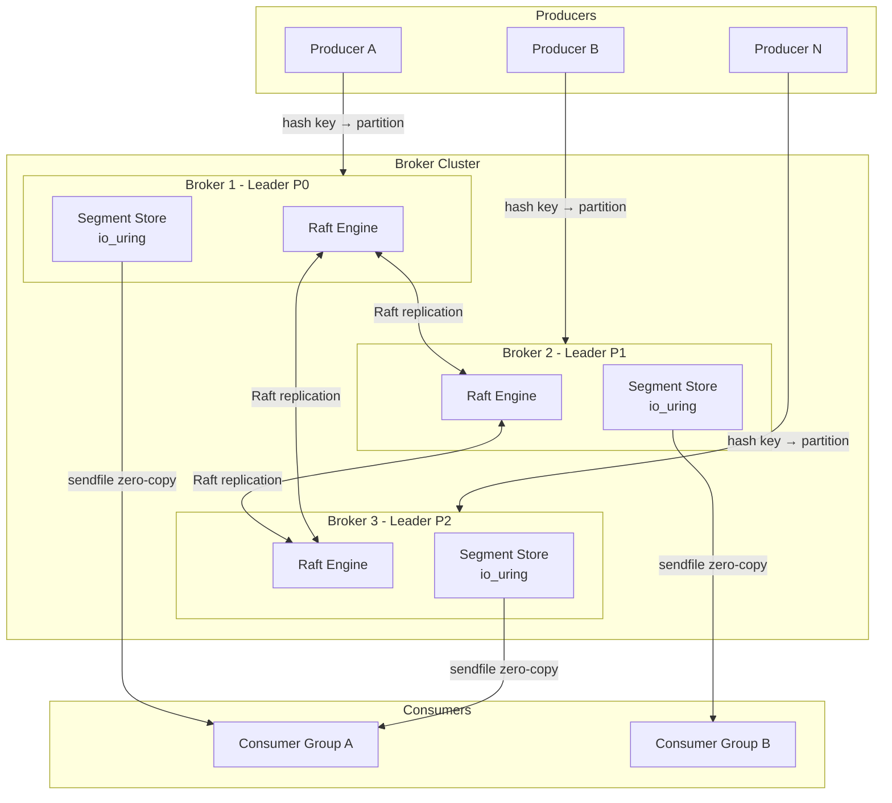

# System Design: Building a Distributed Message Broker in Rust

## Speaker Intro

This handbook is written from the perspective of a **Principal Infrastructure Architect** who has designed, operated, and debugged distributed messaging systems handling millions of events per second in production. The content draws from first-hand experience building event-streaming platforms at the intersection of systems programming, kernel-level I/O, and distributed consensus.

## Who This Is For

- **Backend engineers** ready to move beyond REST APIs and understand the infrastructure layer beneath the application.
- **Systems programmers** who want a concrete, end-to-end project (a distributed log) instead of isolated toy examples.
- **Architects evaluating Rust** for latency-critical infrastructure and who need proof that the language can replace C++ or Java in the data plane.
- **Anyone who has *used* Kafka** and been mystified by its log compaction, ISR (In-Sync Replica) semantics, or partition reassignment—and wants to understand why those mechanisms exist by building one.

## Prerequisites

| Concept | Where to Learn |
|---|---|
| Intermediate Rust (ownership, traits, `async`) | [Async Rust](../async-book/src/SUMMARY.md) |
| Basic networking (TCP, sockets) | [Tokio Internals](../tokio-internals-book/src/SUMMARY.md) |
| What a message broker does (Kafka, RabbitMQ, etc.) | Apache Kafka documentation |
| Familiarity with Linux syscalls (`read`, `write`, `mmap`) | [Hardware Sympathy](../hardware-sympathy-book/src/SUMMARY.md) |

## How to Use This Book

| Emoji | Meaning |
|---|---|
| 🟢 | **Architecture** — foundational design decisions and data structures |
| 🟡 | **Implementation** — production-grade Rust code with kernel syscall integration |
| 🔴 | **Advanced Optimization** — distributed protocols, failure injection, backpressure |

Each chapter solves **one specific bottleneck or failure mode** in sequence. Read them in order—later chapters assume the storage engine and network layer from earlier chapters exist.

## The Problem We Are Solving

> Design a **distributed, persistent message log** (like Apache Kafka or Redpanda) capable of ingesting and delivering **1 million messages per second** on commodity hardware with **strong durability guarantees** and **automatic failover**.

The system we will build has these non-negotiable requirements:

| Requirement | Target |
|---|---|
| Throughput (producer) | ≥ 1 M msgs/sec (1 KB each) |
| Durability | `fsync` per batch, no data loss on power failure |
| Replication | 3-node Raft groups per partition |
| Tail latency (p99 consumer) | < 5 ms for in-cache reads |
| Recovery time (leader crash) | < 2 seconds to new leader election |

## Pacing Guide

| Chapter | Topic | Time | Checkpoint |
|---|---|---|---|
| Ch 0 | Introduction & Problem Statement | 30 min | Understand the design canvas |
| Ch 1 | Append-Only Log & Disk I/O | 6–8 hours | Working segment writer with `io_uring` |
| Ch 2 | Zero-Copy Network Reads | 4–6 hours | `sendfile`-based consumer path benchmarked |
| Ch 3 | Partitioning and Routing | 4–5 hours | Consistent hashing with virtual nodes |
| Ch 4 | Distributed Consensus (Raft) | 8–10 hours | 3-node cluster electing leaders and replicating |
| Ch 5 | Memory Management & Backpressure | 5–7 hours | Token-bucket limiter and TCP backpressure integrated |

**Total: ~28–36 hours** of focused study.

## Table of Contents

### Part I: Storage Engine
- **Chapter 1 — The Append-Only Log & Disk I/O 🟢** — Why append-only logs beat B-Trees for write-heavy workloads. Designing immutable segments and sparse index files. Saturating NVMe SSD bandwidth with `io_uring`.

### Part II: Network & Data Path
- **Chapter 2 — Zero-Copy Network Reads 🟡** — Serving consumers without copying data through user-space. Leveraging Linux `sendfile` / `splice` from Rust to stream directly from the page cache to the socket.
- **Chapter 3 — Partitioning and Routing 🟡** — Distributing topics across brokers. Deterministic partition assignment with consistent hashing. Rebalancing when brokers join or leave.

### Part III: Distributed Coordination
- **Chapter 4 — Distributed Consensus with Raft 🔴** — Leader election, log replication, and safety proofs. Handling split-brain scenarios. Snapshotting compacted log state.

### Part IV: Production Hardening
- **Chapter 5 — Memory Management and Backpressure 🔴** — Preventing OOM kills during consumer lag. Token-bucket rate limiting, TCP window backpressure, and graceful degradation under load.

## Architecture Overview

## Companion Guides

This handbook builds on concepts from several other books in the Rust Training curriculum:

- [Zero-Copy Architecture](../zero-copy-book/src/SUMMARY.md) — `io_uring`, Glommio, rkyv serialization
- [Distributed Systems](../distributed-systems-book/src/SUMMARY.md) — Consensus, clocks, replication theory
- [Hardware Sympathy](../hardware-sympathy-book/src/SUMMARY.md) — CPU caches, MESI, TLB, `io_uring`
- [Tokio Internals](../tokio-internals-book/src/SUMMARY.md) — Reactor, wakers, work-stealing scheduler
- [Algorithms & Concurrency](../algorithms-concurrency-book/src/SUMMARY.md) — Lock-free structures, CAS, ring buffers
