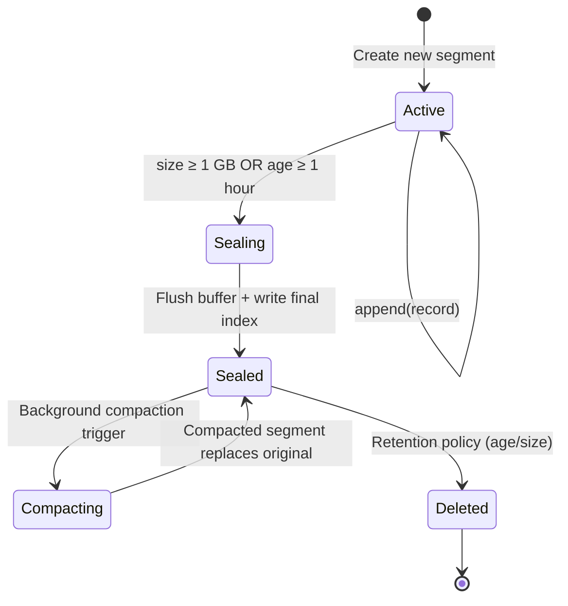

# 1. The Append-Only Log & Disk I/O 🟢

> **The Problem:** Traditional databases use B-Tree indexes that require random writes—each `INSERT` triggers page splits, rebalancing, and scattered I/O across the disk. For a message broker ingesting 1 million messages per second, random writes are a death sentence. A single NVMe SSD can deliver ~3 GB/s sequential write throughput but only ~100 MB/s under random 4 KB writes. We need a storage engine that converts all writes into sequential appends.

---

## Why B-Trees Fail for Write-Heavy Workloads

A B-Tree optimizes for **read latency** at the expense of **write amplification**. Every write must:

1. Traverse from root to leaf (3–4 random reads).
2. Potentially split a node (random write + parent update).
3. Update the WAL *and* the B-Tree pages (double write).

| Property | B-Tree (e.g., InnoDB) | Append-Only Log |
|---|---|---|
| Write pattern | Random | Sequential |
| Write amplification | 10–30× | 1× |
| Throughput (NVMe) | ~100–400 MB/s | ~2–3 GB/s |
| Read pattern | O(log N) point lookups | Sequential scan + sparse index |
| Space reclamation | In-place update | Background compaction |

For a message broker, the access pattern is:
- **Producers** append to the tail (100% sequential writes).
- **Consumers** read from a known offset (100% sequential reads).

This is the *ideal* workload for an append-only log.

---

## The Segment Architecture

We never write to a single, infinitely-growing file. Instead, we split the log into **fixed-size segments**:

```mermaid
flowchart LR
    subgraph Partition 0
        direction LR
        S0["Segment 0<br/>offsets 0–999,999<br/>(SEALED)"]
        S1["Segment 1<br/>offsets 1,000,000–1,999,999<br/>(SEALED)"]
        S2["Segment 2<br/>offsets 2,000,000–2,347,812<br/>(ACTIVE)"]
        S0 --> S1 --> S2
    end

    subgraph Files per Segment
        direction TB
        LOG[".log file<br/>Raw message bytes"]
        IDX[".index file<br/>Sparse offset → position"]
        TS[".timeindex file<br/>Timestamp → offset"]
    end

    S2 --- Files per Segment
```

### Segment Rules

1. **Only the active segment is writable.** All sealed segments are immutable.
2. **A segment is sealed** when it reaches a configurable size (e.g., 1 GB) or age (e.g., 1 hour).
3. **Each segment has three files:**
   - `.log` — The raw message bytes, concatenated.
   - `.index` — A sparse mapping from logical offset to byte position in the `.log` file.
   - `.timeindex` — A sparse mapping from timestamp to logical offset (for time-based seeks).

### The Sparse Index

We do **not** index every single offset. Instead, we write an index entry every N messages (e.g., every 4096). To find offset `1,042,567`:

1. Binary search the `.index` to find the floor entry: `offset 1,040,000 → byte position 847,200`.
2. Sequential scan from byte `847,200` in the `.log` until we reach the target offset.

This keeps the index small enough to fit entirely in RAM while still providing O(log N + scan) lookups.

---

## On-Disk Record Format

Each record in the `.log` file has a fixed header followed by variable-length payload:

```
┌──────────────────────────────────────────────────┐
│  offset: u64       (8 bytes)  — Monotonic ID     │
│  timestamp: i64    (8 bytes)  — Unix millis       │
│  key_len: u32      (4 bytes)                      │
│  value_len: u32    (4 bytes)                      │
│  crc32: u32        (4 bytes)  — Integrity check   │
│  key: [u8]         (key_len bytes)                │
│  value: [u8]       (value_len bytes)              │
└──────────────────────────────────────────────────┘
Total header: 28 bytes fixed + variable key + value
```

### Naive Approach: `Write` trait per message

```rust,ignore
use std::fs::OpenOptions;
use std::io::Write;

fn append_message_naive(path: &str, key: &[u8], value: &[u8]) -> std::io::Result<()> {
    // 💥 PERFORMANCE HAZARD: Opens file, seeks to end, writes, and closes.
    // Each call is a separate syscall — at 1M msgs/sec this is 1M open/close pairs.
    let mut file = OpenOptions::new().append(true).open(path)?;

    // 💥 SMALL WRITE HAZARD: Each write() is a separate syscall.
    // The kernel must context-switch for every message.
    file.write_all(&(key.len() as u32).to_le_bytes())?;
    file.write_all(&(value.len() as u32).to_le_bytes())?;
    file.write_all(key)?;
    file.write_all(value)?;

    // 💥 DURABILITY HAZARD: No fsync! Data sits in the page cache.
    // A power loss here loses all "acknowledged" messages.
    Ok(())
}
```

**Problems:**
- One `open()` + `close()` per message = 2M syscalls/sec just for file handles.
- Tiny writes never coalesce into full 4 KB disk blocks.
- No CRC — silent bit-rot goes undetected.
- No `fsync` — the OS can lose the page cache on crash.

---

## Production Rust Approach: Batched Writes with `io_uring`

The production design has three key ideas:

1. **Batch messages into a `BytesMut` buffer** in user-space, flushing when the buffer reaches a threshold (e.g., 64 KB) or a time deadline (e.g., 5 ms).
2. **Use `io_uring`** to submit the write and `fsync` as a single submission queue entry, avoiding blocking the async runtime.
3. **Keep the file descriptor open** for the lifetime of the active segment.

### The Record and Segment Types

```rust,ignore
use bytes::{BufMut, BytesMut};
use std::path::PathBuf;

const HEADER_SIZE: usize = 28; // offset(8) + timestamp(8) + key_len(4) + value_len(4) + crc32(4)
const BATCH_FLUSH_BYTES: usize = 64 * 1024; // 64 KB

/// A single record in the log.
struct Record<'a> {
    offset: u64,
    timestamp: i64,
    key: &'a [u8],
    value: &'a [u8],
}

impl<'a> Record<'a> {
    fn encoded_size(&self) -> usize {
        HEADER_SIZE + self.key.len() + self.value.len()
    }

    fn encode_into(&self, buf: &mut BytesMut) {
        buf.put_u64_le(self.offset);
        buf.put_i64_le(self.timestamp);
        buf.put_u32_le(self.key.len() as u32);
        buf.put_u32_le(self.value.len() as u32);

        // CRC covers key + value; calculate before writing.
        let crc = crc32fast::hash(&[self.key, self.value].concat());
        buf.put_u32_le(crc);

        buf.put_slice(self.key);
        buf.put_slice(self.value);
    }
}

/// The active segment writer.
struct SegmentWriter {
    base_offset: u64,
    next_offset: u64,
    file_position: u64,
    path: PathBuf,
    buffer: BytesMut,
    // In production, this holds the io_uring file descriptor
    // fd: OwnedFd,
}
```

### Batched Append

```rust,ignore
impl SegmentWriter {
    /// Append a record to the in-memory buffer.
    /// Returns the assigned offset.
    fn append(&mut self, key: &[u8], value: &[u8]) -> u64 {
        let offset = self.next_offset;
        self.next_offset += 1;

        let record = Record {
            offset,
            timestamp: chrono::Utc::now().timestamp_millis(),
            key,
            value,
        };

        // ✅ FIX: Encode into a contiguous buffer — no per-message syscall.
        record.encode_into(&mut self.buffer);

        offset
    }

    /// Check if the buffer should be flushed.
    fn should_flush(&self) -> bool {
        self.buffer.len() >= BATCH_FLUSH_BYTES
    }
}
```

### Submitting to `io_uring`

```rust,ignore
use io_uring::{opcode, types, IoUring};
use std::os::unix::io::AsRawFd;

/// Flush the write buffer to disk using io_uring.
///
/// This submits a WRITE followed by an FSYNC as a linked pair,
/// meaning the kernel guarantees FSYNC runs only after WRITE completes.
fn flush_with_io_uring(
    ring: &mut IoUring,
    fd: std::os::unix::io::RawFd,
    buf: &[u8],
    file_offset: u64,
) -> std::io::Result<()> {
    // ✅ FIX: Single submission for write + fsync — no blocking the runtime.
    let write_op = opcode::Write::new(types::Fd(fd), buf.as_ptr(), buf.len() as u32)
        .offset(file_offset)
        .build()
        .flags(io_uring::squeue::Flags::IO_LINK) // Link: fsync waits for write
        .user_data(0x01);

    let fsync_op = opcode::Fsync::new(types::Fd(fd))
        .build()
        .user_data(0x02);

    // Submit both operations in one syscall.
    unsafe {
        let sq = ring.submission();
        sq.push(&write_op).map_err(|_| {
            std::io::Error::new(std::io::ErrorKind::Other, "SQ full")
        })?;
        sq.push(&fsync_op).map_err(|_| {
            std::io::Error::new(std::io::ErrorKind::Other, "SQ full")
        })?;
    }

    ring.submit_and_wait(2)?;

    // ✅ Verify completions.
    let cq = ring.completion();
    for cqe in cq {
        if cqe.result() < 0 {
            return Err(std::io::Error::from_raw_os_error(-cqe.result()));
        }
    }

    Ok(())
}
```

### The Flush Pipeline

```rust,ignore
impl SegmentWriter {
    /// Drain the buffer and write to disk via io_uring.
    fn flush(&mut self, ring: &mut IoUring) -> std::io::Result<()> {
        if self.buffer.is_empty() {
            return Ok(());
        }

        let data = self.buffer.split().freeze();

        // ✅ FIX: Write + fsync in one io_uring submission.
        flush_with_io_uring(
            ring,
            // self.fd.as_raw_fd(),
            0, // placeholder
            &data,
            self.file_position,
        )?;

        self.file_position += data.len() as u64;
        Ok(())
    }
}
```

---

## The Sparse Index Writer

Every `INDEX_INTERVAL` records, we append an entry to the `.index` file:

```rust,ignore
const INDEX_INTERVAL: u64 = 4096;
const INDEX_ENTRY_SIZE: usize = 16; // offset(8) + position(8)

struct IndexWriter {
    entries: Vec<(u64, u64)>, // (logical_offset, byte_position)
    last_indexed_offset: u64,
}

impl IndexWriter {
    fn maybe_add(&mut self, offset: u64, byte_position: u64) {
        if offset - self.last_indexed_offset >= INDEX_INTERVAL || self.entries.is_empty() {
            self.entries.push((offset, byte_position));
            self.last_indexed_offset = offset;
        }
    }

    /// Binary search for the floor entry at or before `target_offset`.
    fn lookup(&self, target_offset: u64) -> Option<(u64, u64)> {
        let idx = self.entries.partition_point(|(off, _)| *off <= target_offset);
        if idx == 0 {
            None
        } else {
            Some(self.entries[idx - 1])
        }
    }
}
```

---

## `io_uring` vs `epoll` + `pwrite`: A Comparison

| Dimension | `epoll` + `pwrite` | `io_uring` |
|---|---|---|
| Syscalls per write+sync | 2 (`pwrite` + `fdatasync`) | 1 (submit batch) |
| Kernel transitions | 2 context switches | 0 (shared ring buffer) |
| Blocking? | `fdatasync` blocks the thread | Fully async completion |
| Throughput (NVMe) | ~800K IOPS | ~1.5M IOPS |
| Rust ecosystem | `tokio::fs` (threadpool hack) | `io-uring` crate, `glommio` |

### Why `io_uring` Matters for Us

At 1M msgs/sec with 64 KB batch flushes, we issue approximately:

```
1,000,000 msgs × 1 KB avg = 1 GB/s raw data
1 GB / 64 KB per flush = ~15,600 flush operations/sec
Each flush = 1 write + 1 fsync = 2 ops
Total: ~31,200 io_uring ops/sec
```

With `epoll` + `pwrite`, each `fdatasync` blocks a thread for ~50 µs on NVMe. At 15,600 syncs/sec, that consumes `15,600 × 50 µs = 780 ms` of thread time per second—nearly saturating one core just for sync. `io_uring` eliminates this blocking entirely.

---

## Segment Lifecycle



### Segment Rotation

```rust,ignore
const MAX_SEGMENT_BYTES: u64 = 1_073_741_824; // 1 GB

impl SegmentWriter {
    fn should_roll(&self) -> bool {
        self.file_position >= MAX_SEGMENT_BYTES
    }

    fn seal_and_rotate(&mut self, ring: &mut IoUring) -> std::io::Result<SegmentWriter> {
        // Flush any remaining buffered data.
        self.flush(ring)?;

        // The current segment is now immutable.
        let new_base = self.next_offset;
        let new_path = self.path
            .parent()
            .unwrap()
            .join(format!("{:020}.log", new_base));

        Ok(SegmentWriter {
            base_offset: new_base,
            next_offset: new_base,
            file_position: 0,
            path: new_path,
            buffer: BytesMut::with_capacity(BATCH_FLUSH_BYTES * 2),
        })
    }
}
```

---

## Putting It Together: The Partition Writer

```rust,ignore
struct PartitionWriter {
    partition_id: u32,
    active_segment: SegmentWriter,
    sealed_segments: Vec<PathBuf>,
    index: IndexWriter,
    ring: IoUring,
}

impl PartitionWriter {
    fn produce(&mut self, key: &[u8], value: &[u8]) -> std::io::Result<u64> {
        let byte_pos = self.active_segment.file_position + self.active_segment.buffer.len() as u64;
        let offset = self.active_segment.append(key, value);

        // Sparse index bookkeeping.
        self.index.maybe_add(offset, byte_pos);

        // Batch flush when buffer is full.
        if self.active_segment.should_flush() {
            self.active_segment.flush(&mut self.ring)?;
        }

        // Roll to a new segment if the file is too large.
        if self.active_segment.should_roll() {
            let new_segment = self.active_segment.seal_and_rotate(&mut self.ring)?;
            let old_path = self.active_segment.path.clone();
            self.sealed_segments.push(old_path);
            self.active_segment = new_segment;
        }

        Ok(offset)
    }
}
```

---

## Performance Characteristics

| Metric | Value |
|---|---|
| Record encoding | ~50 ns (no allocation, `BytesMut` in-place) |
| Batch accumulation | ~1 ms for 64 KB at 1M msgs/sec |
| `io_uring` write + fsync | ~60 µs on NVMe |
| Index lookup | O(log N) binary search, N ≈ 250 entries per segment |
| Segment rotation | ~100 µs (just file creation + metadata) |

At 1 KB per message:
- **Throughput:** 1,000,000 × 1 KB = **~1 GB/s sustained sequential writes**.
- **Disk ops:** ~15,600 batched writes/sec (not 1M individual writes).
- **CPU cost:** ~50 µs per batch encode + submit = **< 1 core** for the entire write path.

---

> **Key Takeaways**
>
> 1. **Append-only logs eliminate write amplification.** By converting all writes to sequential appends, we exploit the full bandwidth of NVMe SSDs (2–3 GB/s) instead of the random-write ceiling (~100 MB/s).
> 2. **Batch before you flush.** Accumulating messages into 64 KB buffers reduces syscalls from 1M/sec to ~15K/sec—a 65× reduction.
> 3. **`io_uring` is the only non-blocking path to `fsync`.** All other approaches either block a thread (`pwrite` + `fdatasync`) or lie about durability (no sync at all). Linked write+fsync ops in `io_uring` give us both correctness and performance.
> 4. **Sparse indexes trade O(1) lookups for massive memory savings.** Indexing every 4096th offset keeps the index at ~4 KB per million messages while adding only a short sequential scan at read time.
> 5. **Immutable sealed segments simplify everything downstream.** Compaction, replication, and consumer reads can all operate on sealed segments without coordination with the writer.
