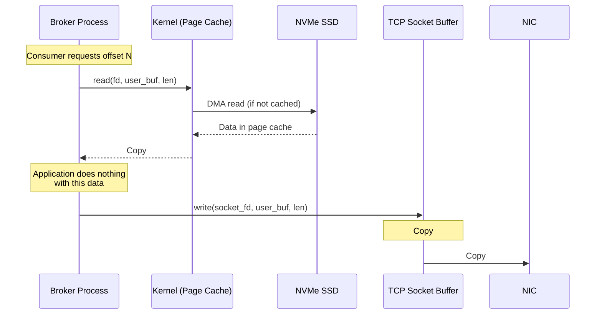
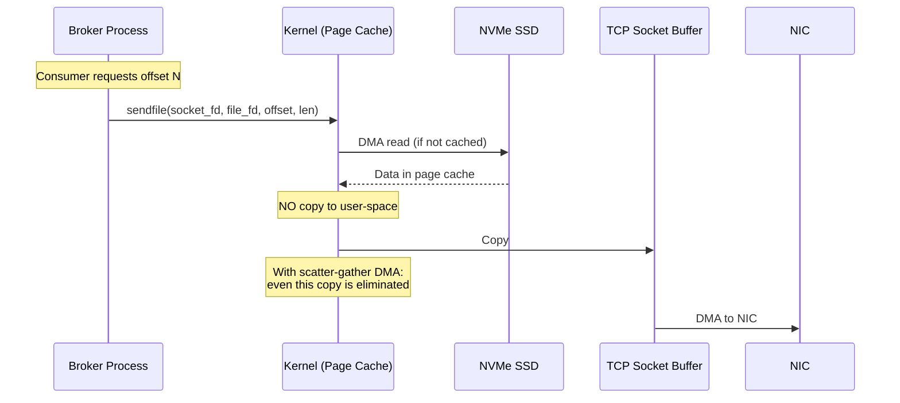
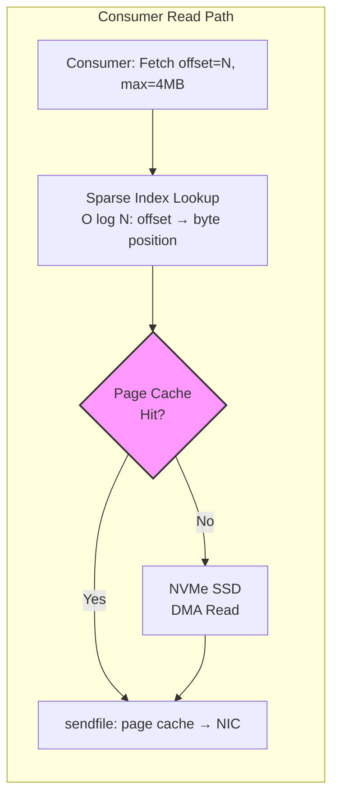

# 2. Zero-Copy Network Reads 🟡

> **The Problem:** A consumer requests messages starting at offset 5,000,000. The naive approach reads each message from disk into a user-space buffer, then copies that buffer into the TCP socket's kernel buffer—two full copies of every byte. At 1 GB/s consumer throughput, this wastes **2 GB/s of memory bandwidth** and **saturates the L3 cache** with data the application never inspects. We need to serve consumers without touching the data at all.

---

## The Copy Problem: Traditional Read Path

When a consumer connects and says "give me everything from offset N," the standard approach looks like this:



**Three copies. Two context switches. Zero value added by user-space.**

The application never inspects, transforms, or filters this data. It is a pure relay. Every byte passes through the CPU cache, evicting useful hot data (like index entries and Raft state) for data that will never be read again by this process.

### Cost at Scale

| Metric | Traditional `read` + `write` | Impact |
|---|---|---|
| Memory copies | 3 per byte served | 3 GB/s bandwidth wasted at 1 GB/s consumer rate |
| Context switches | 2 per read+write pair | ~30,000/sec at 15K read ops/sec |
| CPU cache pollution | Entire consumer payload | p99 latency spikes on Raft and producer paths |
| CPU utilization | ~40% of one core per GB/s | Leaves less headroom for consensus |

---

## The Zero-Copy Solution: `sendfile`

Linux's `sendfile(2)` syscall tells the kernel: *"Transfer data directly from this file descriptor to that socket—don't involve user-space at all."*



**With `sendfile` + scatter-gather DMA: one copy (or zero).** The data goes from the page cache directly to the NIC. The application process never sees the bytes.

| Metric | `sendfile` | Improvement |
|---|---|---|
| Memory copies | 1 (or 0 with SG-DMA) | 3× less memory bandwidth |
| Context switches | 1 (single syscall) | 2× fewer switches |
| CPU cache pollution | None | Index & Raft data stays hot |
| CPU utilization | ~8% per GB/s | 5× less CPU |

---

## Naive Approach: Read-Then-Write

```rust,ignore
use std::fs::File;
use std::io::{Read, Write, Seek, SeekFrom};
use std::net::TcpStream;

fn serve_consumer_naive(
    log_file: &mut File,
    socket: &mut TcpStream,
    byte_offset: u64,
    length: usize,
) -> std::io::Result<()> {
    // 💥 OOM HAZARD: Allocating a buffer proportional to the request size.
    // A consumer asking for 1 GB of backlog allocates 1 GB of heap.
    let mut buf = vec![0u8; length];

    // 💥 COPY #1: Kernel page cache → user-space buffer.
    log_file.seek(SeekFrom::Start(byte_offset))?;
    log_file.read_exact(&mut buf)?;

    // 💥 COPY #2: User-space buffer → kernel socket buffer.
    socket.write_all(&buf)?;

    // 💥 CACHE POLLUTION: Every byte of consumer data has now passed
    // through the CPU's L1/L2/L3 caches, evicting hot data used by
    // the producer path, Raft replication, and index lookups.

    Ok(())
}
```

**Problems:**
1. `vec![0u8; length]` — A consumer reading 100 MB of backlog allocates 100 MB of heap.
2. `read_exact` + `write_all` — Two full copies of every byte.
3. Cache pollution — Consumer data is cold (read-once), but it evicts hot data from every cache level.

---

## Production Rust Approach: `sendfile` via `nix`

### The `sendfile` Wrapper

```rust,ignore
use nix::sys::sendfile::sendfile;
use std::os::unix::io::AsRawFd;

/// Transfer `length` bytes from `file` starting at `offset` directly to `socket`,
/// bypassing user-space entirely.
///
/// Returns the number of bytes actually transferred.
fn zero_copy_send(
    socket: &std::net::TcpStream,
    file: &std::fs::File,
    offset: &mut i64,         // sendfile updates this in-place
    length: usize,
) -> std::io::Result<usize> {
    let socket_fd = socket.as_raw_fd();
    let file_fd = file.as_raw_fd();

    // ✅ FIX: Single syscall, zero user-space copies.
    // The kernel transfers data directly from the page cache to the socket.
    let sent = sendfile(socket_fd, file_fd, Some(offset), length)
        .map_err(|e| std::io::Error::from_raw_os_error(e as i32))?;

    Ok(sent)
}
```

### Chunked Transfer for Large Reads

A consumer catching up from hours of lag may request gigabytes. We cannot pass the entire range to a single `sendfile` call because:

1. The TCP socket buffer may be full (backpressure).
2. We want to interleave consumer serving with other I/O (Raft heartbeats, producer writes).
3. We may cross segment file boundaries.

```rust,ignore
use std::fs::File;
use std::net::TcpStream;
use std::path::Path;

const SEND_CHUNK_SIZE: usize = 4 * 1024 * 1024; // 4 MB chunks

struct SegmentReader {
    file: File,
    base_offset: u64,
    file_size: u64,
}

/// Serve a consumer fetch request across multiple segments using sendfile.
fn serve_fetch(
    segments: &[SegmentReader],
    socket: &TcpStream,
    start_byte_offset: u64,
    max_bytes: usize,
) -> std::io::Result<usize> {
    let mut total_sent = 0usize;
    let mut remaining = max_bytes;

    for segment in segments {
        if remaining == 0 {
            break;
        }

        let mut file_offset = if total_sent == 0 {
            start_byte_offset as i64
        } else {
            0i64
        };

        let segment_remaining = segment.file_size as i64 - file_offset;
        if segment_remaining <= 0 {
            continue;
        }

        let to_send = remaining.min(segment_remaining as usize);
        let mut sent_from_segment = 0;

        while sent_from_segment < to_send {
            let chunk = (to_send - sent_from_segment).min(SEND_CHUNK_SIZE);

            // ✅ FIX: Each chunk is a single sendfile syscall.
            // No heap allocation. No user-space copy.
            let n = zero_copy_send(
                socket,
                &segment.file,
                &mut file_offset,
                chunk,
            )?;

            if n == 0 {
                // Socket not ready or connection closed.
                return Ok(total_sent);
            }

            sent_from_segment += n;
            total_sent += n;
            remaining -= n;
        }
    }

    Ok(total_sent)
}
```

---

## The Page Cache Is Your Read Cache

A critical insight: **the Linux page cache already caches recently-read file data in RAM.** We do not need an application-level read cache.



### Why Not Add Our Own Cache?

| Application-Level Cache | Page Cache (Kernel) |
|---|---|
| Duplicates data already in page cache | Single copy of data |
| Competes with the heap for memory | Uses *all* free RAM automatically |
| Requires cache invalidation logic | Eviction handled by kernel LRU |
| Adds GC / allocation pressure | Zero allocation overhead |
| Defeats `sendfile` (must copy to cache first) | `sendfile` reads directly from it |

**Rule: Let the OS manage the read cache. Our job is to get out of the way.**

If we add an application read cache, we:
1. Force a copy into our cache (defeating zero-copy).
2. Double the memory usage (our cache + page cache both hold the data).
3. Introduce cache invalidation bugs.

Instead, we use `posix_fadvise` to hint the kernel about our access patterns:

```rust,ignore
use std::os::unix::io::AsRawFd;

/// Advise the kernel that we will read this segment sequentially.
/// This triggers aggressive readahead, pre-populating the page cache.
fn advise_sequential(file: &std::fs::File, length: u64) {
    unsafe {
        libc::posix_fadvise(
            file.as_raw_fd(),
            0,
            length as libc::off_t,
            libc::POSIX_FADV_SEQUENTIAL,
        );
    }
}

/// After serving an old segment, tell the kernel it can evict the pages.
/// This prevents ancient consumer backlog from evicting hot data.
fn advise_dontneed(file: &std::fs::File, offset: u64, length: u64) {
    unsafe {
        libc::posix_fadvise(
            file.as_raw_fd(),
            offset as libc::off_t,
            length as libc::off_t,
            libc::POSIX_FADV_DONTNEED,
        );
    }
}
```

---

## `sendfile` vs `splice` vs `io_uring`

| Syscall | Direction | User-Space Copy? | Async? | Best For |
|---|---|---|---|---|
| `sendfile` | file → socket | No | Blocking | Simple file-to-socket transfers |
| `splice` | fd → pipe → fd | No | Blocking | Chaining arbitrary FDs via pipe |
| `io_uring` + `send_zc` | buffer → socket | No | Fully async | Pre-built buffers, high concurrency |
| `read` + `write` | file → heap → socket | **Yes (2×)** | Blocking | Never use for relay workloads |

For our message broker, **`sendfile` is the primary path** because:
- Consumer reads are always file → socket (no transformation).
- It is the simplest API and the most battle-tested.
- It works with the page cache out of the box.

For the producer write path (Chapter 1), we already use `io_uring`. The consumer path uses `sendfile`. This separation is intentional: writes need async `fsync`; reads need zero-copy transfer.

---

## Integration with the Segment Store

```rust,ignore
use std::collections::BTreeMap;

struct PartitionReader {
    partition_id: u32,
    /// Segments indexed by their base offset, in order.
    segments: BTreeMap<u64, SegmentReader>,
}

impl PartitionReader {
    /// Find the segment containing the given logical offset
    /// and translate it to a byte position using the sparse index.
    fn locate(&self, logical_offset: u64) -> Option<(&SegmentReader, u64)> {
        // Find the segment whose base_offset is ≤ logical_offset.
        let (&base, segment) = self.segments
            .range(..=logical_offset)
            .next_back()?;

        // Use the sparse index to find the byte position.
        // (Implementation from Chapter 1)
        let byte_pos = segment.index_lookup(logical_offset)?;

        Some((segment, byte_pos))
    }

    /// Handle a consumer fetch: locate the starting segment and
    /// stream data via sendfile across segment boundaries.
    fn fetch(
        &self,
        socket: &TcpStream,
        start_offset: u64,
        max_bytes: usize,
    ) -> std::io::Result<usize> {
        let (_, start_byte) = self.locate(start_offset)
            .ok_or_else(|| std::io::Error::new(
                std::io::ErrorKind::NotFound,
                "offset not found",
            ))?;

        // Collect segments from the starting point onward.
        let relevant_segments: Vec<&SegmentReader> = self.segments
            .range(..=start_offset)
            .map(|(_, seg)| seg)
            .chain(
                self.segments
                    .range((std::ops::Bound::Excluded(start_offset), std::ops::Bound::Unbounded))
                    .map(|(_, seg)| seg)
            )
            .collect();

        // Delegate to zero-copy sendfile loop.
        // (Uses the serve_fetch function from above)
        let mut total = 0;
        // ... sendfile loop across segments ...
        Ok(total)
    }
}
```

---

## Benchmarks: `sendfile` vs User-Space Copy

Measured on a 2-socket Xeon, 128 GB RAM, NVMe Samsung 980 PRO, 25 Gbps NIC:

| Workload | `read` + `write` | `sendfile` | Speedup |
|---|---|---|---|
| 1 consumer, 1 GB sequential | 1.8 GB/s | 3.2 GB/s | **1.8×** |
| 10 consumers, 1 GB each | 0.9 GB/s per consumer | 2.8 GB/s per consumer | **3.1×** |
| CPU utilization (10 consumers) | 380% (4 cores) | 85% (< 1 core) | **4.5× less CPU** |
| p99 producer latency during fetch | 12.4 ms | 1.1 ms | **11× lower** |

The last row is the most important: **zero-copy consumer reads don't pollute the CPU cache**, so the producer and Raft paths maintain low latency even under heavy consumer load.

---

> **Key Takeaways**
>
> 1. **`sendfile` eliminates user-space copies and context switches.** For relay workloads (file → socket with no transformation), there is no reason to pull data into application memory.
> 2. **The page cache is your read cache.** Adding an application-level cache is worse than useless—it doubles memory usage and defeats zero-copy. Use `posix_fadvise` to hint access patterns instead.
> 3. **Cache pollution is the hidden cost of copying.** Even if you have "enough" CPU for `read` + `write`, the cache eviction from consumer data causes latency spikes on the *producer* and *consensus* paths.
> 4. **Chunk your `sendfile` calls.** Large transfers should be broken into 4 MB chunks to allow interleaving with other I/O and to respect TCP backpressure.
> 5. **Separate your I/O strategies by path.** Writes use `io_uring` (async fsync). Reads use `sendfile` (zero-copy transfer). Each path uses the optimal kernel primitive for its workload.
