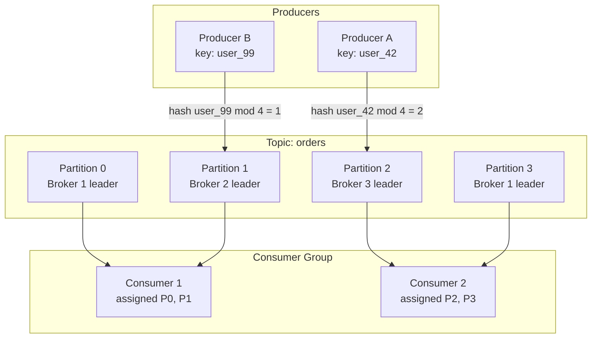
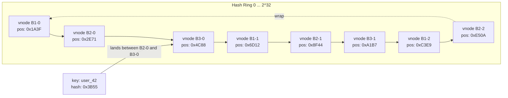
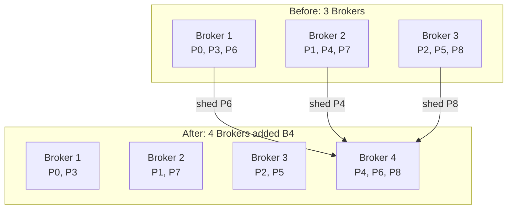

# 3. Partitioning and Routing 🟡

> **The Problem:** A single broker node with one NVMe SSD can write at ~2 GB/s. Our target is 1 million messages/sec at 1 KB each ≈ 1 GB/s—so a single node can *barely* handle the write load, leaving zero headroom for replication, consumer reads, or traffic spikes. We need to **split the data across multiple brokers** so that each broker handles a fraction of the total throughput, and we need a **deterministic routing algorithm** so that producers and consumers always agree on which broker owns which data—without a centralized lookup service on every request.

---

## Topics and Partitions: The Mental Model

A **topic** is a named stream of messages (e.g., `orders`, `clickstream`, `payments`). A **partition** is the unit of parallelism, storage, and replication within a topic.



### Why Partitions Exist

| Concern | Without Partitions | With Partitions |
|---|---|---|
| Write throughput | Capped by one disk | Scales linearly with broker count |
| Consumer parallelism | One consumer per topic | One consumer per partition |
| Ordering guarantee | Total order (overkill) | Per-partition order (sufficient) |
| Replication unit | Entire topic | Per-partition Raft group |
| Rebalancing granularity | Move entire topic | Move individual partitions |

**Design rule:** The number of partitions determines the maximum parallelism of both producers and consumers. Choose it carefully—increasing partitions later requires data migration.

---

## The Partition Assignment Problem

Given a message with key `K` and a topic with `N` partitions, which partition does it go to?

### Naive Approach: Modulo Hashing

```rust,ignore
fn partition_naive(key: &[u8], num_partitions: u32) -> u32 {
    // 💥 REBALANCE HAZARD: When num_partitions changes (e.g., 4 → 5),
    // almost ALL keys get reassigned to different partitions.
    //
    // hash("user_42") % 4 = 2
    // hash("user_42") % 5 = 3  ← Different partition!
    //
    // This breaks per-key ordering guarantees and forces
    // massive data migration across brokers.
    let hash = crc32fast::hash(key);
    hash % num_partitions
}
```

**The problem:** When we add or remove a broker and change `num_partitions`, modulo hashing reassigns `(N-1)/N` of all keys. For 1M msgs/sec, this means migrating terabytes of data and temporarily breaking ordering guarantees.

---

## Production Approach: Consistent Hashing with Virtual Nodes

Consistent hashing maps both **partition IDs** and **message keys** onto a circular hash ring. Adding or removing a broker only reassigns `~1/N` of the keys (where N is the number of brokers).

### The Hash Ring



Each physical broker gets M **virtual nodes** (vnodes) spread across the ring. A message key is hashed; the first vnode encountered clockwise on the ring determines the owning broker.

### Implementation

```rust,ignore
use std::collections::BTreeMap;
use std::hash::{Hash, Hasher};

/// Number of virtual nodes per physical broker.
const VNODES_PER_BROKER: u32 = 128;

/// A point on the hash ring.
type RingPosition = u32;

/// Identifies a physical broker.
#[derive(Debug, Clone, PartialEq, Eq, Hash)]
struct BrokerId(u32);

/// The consistent hash ring.
struct HashRing {
    ring: BTreeMap<RingPosition, BrokerId>,
    brokers: Vec<BrokerId>,
}

impl HashRing {
    fn new() -> Self {
        Self {
            ring: BTreeMap::new(),
            brokers: Vec::new(),
        }
    }

    /// Hash a byte slice to a position on the ring.
    /// Uses a fast, well-distributed hash (not cryptographic).
    fn hash_position(data: &[u8]) -> RingPosition {
        // ✅ FIX: Use a consistent, deterministic hash function.
        // murmur3 gives excellent distribution for hash rings.
        murmur3::murmur3_32(&mut std::io::Cursor::new(data), 0)
            .unwrap_or(0)
    }

    /// Add a broker to the ring with `VNODES_PER_BROKER` virtual nodes.
    fn add_broker(&mut self, broker: BrokerId) {
        for i in 0..VNODES_PER_BROKER {
            let vnode_key = format!("{}-vnode-{}", broker.0, i);
            let position = Self::hash_position(vnode_key.as_bytes());
            self.ring.insert(position, broker.clone());
        }
        self.brokers.push(broker);
    }

    /// Remove a broker and all its virtual nodes.
    fn remove_broker(&mut self, broker: &BrokerId) {
        for i in 0..VNODES_PER_BROKER {
            let vnode_key = format!("{}-vnode-{}", broker.0, i);
            let position = Self::hash_position(vnode_key.as_bytes());
            self.ring.remove(&position);
        }
        self.brokers.retain(|b| b != broker);
    }

    /// Given a message key, find the owning broker.
    /// Walks clockwise from the key's hash position to the first vnode.
    fn get_broker(&self, key: &[u8]) -> Option<&BrokerId> {
        if self.ring.is_empty() {
            return None;
        }

        let position = Self::hash_position(key);

        // ✅ FIX: clockwise walk using BTreeMap::range.
        // First, check positions >= our hash.
        self.ring
            .range(position..)
            .next()
            .or_else(|| self.ring.iter().next()) // Wrap around to the start.
            .map(|(_, broker)| broker)
    }
}
```

### Virtual Nodes: Why 128?

| Vnodes per Broker | Std Dev of Load Distribution | Max/Min Load Ratio |
|---|---|---|
| 1 | 58% | 3.2× |
| 10 | 18% | 1.7× |
| 50 | 8% | 1.3× |
| 128 | 4% | 1.1× |
| 256 | 3% | 1.08× |

At 128 vnodes, the load imbalance between the most-loaded and least-loaded broker is within **10%**. Going to 256 gives diminishing returns while doubling the ring's memory footprint.

---

## Partition-to-Broker Assignment

The hash ring routes **message keys to brokers**, but we also need a static assignment of **partitions to brokers** for leader election and replication. This is the **partition assignment table**.

```rust,ignore
/// Maps each partition to its assigned broker (leader) and replica set.
struct PartitionAssignment {
    partition_id: u32,
    leader: BrokerId,
    replicas: Vec<BrokerId>, // Includes leader. Typically 3 brokers.
    epoch: u64,              // Incremented on reassignment.
}

/// The cluster-wide partition map.
struct PartitionTable {
    topic: String,
    num_partitions: u32,
    assignments: Vec<PartitionAssignment>,
}

impl PartitionTable {
    /// Generate a balanced initial assignment using round-robin with rack awareness.
    fn create(
        topic: &str,
        num_partitions: u32,
        brokers: &[BrokerId],
        replication_factor: u32,
    ) -> Self {
        let n = brokers.len();
        let mut assignments = Vec::with_capacity(num_partitions as usize);

        for p in 0..num_partitions {
            let leader_idx = p as usize % n;
            let mut replicas = Vec::with_capacity(replication_factor as usize);

            for r in 0..replication_factor {
                let replica_idx = (leader_idx + r as usize) % n;
                replicas.push(brokers[replica_idx].clone());
            }

            assignments.push(PartitionAssignment {
                partition_id: p,
                leader: brokers[leader_idx].clone(),
                replicas,
                epoch: 1,
            });
        }

        PartitionTable {
            topic: topic.to_string(),
            num_partitions,
            assignments,
        }
    }
}
```

---

## The Producer Routing Layer

A producer client needs to:
1. Resolve the partition for a given key.
2. Look up the leader broker for that partition.
3. Send the message to the correct broker.

```rust,ignore
struct ProducerRouter {
    partition_table: PartitionTable,
    // Connection pool to each broker.
    connections: std::collections::HashMap<BrokerId, TcpStream>,
}

impl ProducerRouter {
    /// Route a message to the correct partition leader.
    fn route(&self, key: &[u8], value: &[u8]) -> std::io::Result<u64> {
        // Step 1: Deterministic partition assignment.
        let partition_id = self.compute_partition(key);

        // Step 2: Find the leader for this partition.
        let assignment = &self.partition_table.assignments[partition_id as usize];
        let leader = &assignment.leader;

        // Step 3: Send to leader.
        let conn = self.connections.get(leader)
            .ok_or_else(|| std::io::Error::new(
                std::io::ErrorKind::NotConnected,
                format!("no connection to broker {:?}", leader),
            ))?;

        // ... serialize and send the produce request ...
        Ok(0) // placeholder offset
    }

    fn compute_partition(&self, key: &[u8]) -> u32 {
        // ✅ Deterministic: same key always maps to same partition
        // as long as num_partitions doesn't change.
        let hash = murmur3::murmur3_32(&mut std::io::Cursor::new(key), 0)
            .unwrap_or(0);
        hash % self.partition_table.num_partitions
    }
}
```

### Why Murmur3 and Not SipHash?

| Hash Function | Speed (1 KB key) | Distribution Quality | Use Case |
|---|---|---|---|
| `SipHash` (Rust default) | ~1.2 GB/s | Excellent | HashDoS-resistant `HashMap` |
| `Murmur3` | ~5.5 GB/s | Excellent | Non-adversarial hashing (partition routing) |
| `xxHash` | ~8.0 GB/s | Excellent | Non-adversarial, fastest option |
| `CRC32` | ~3.0 GB/s | Fair | Checksums, not distribution |

We use Murmur3 because:
1. **No adversarial input:** Partition keys are application-controlled, not user-facing URLs.
2. **Speed matters:** At 1M msgs/sec, hash computation runs 1M times per second.
3. **Cross-language determinism:** Murmur3 produces identical output across Rust, Java, Go—critical for heterogeneous client ecosystems.

---

## Handling Broker Joins and Departures

When a broker joins or leaves, we must **reassign partitions** while minimizing data movement.



### The Rebalancing Algorithm

```rust,ignore
impl PartitionTable {
    /// Rebalance partitions across a new set of brokers.
    /// Minimizes the number of partition moves.
    fn rebalance(&mut self, new_brokers: &[BrokerId], replication_factor: u32) {
        let n = new_brokers.len();
        let target_per_broker = self.num_partitions as usize / n;
        let extra = self.num_partitions as usize % n;

        // Count current assignment per broker.
        let mut broker_load: std::collections::HashMap<&BrokerId, Vec<u32>> =
            std::collections::HashMap::new();

        for b in new_brokers {
            broker_load.entry(b).or_default();
        }

        for assign in &self.assignments {
            if let Some(parts) = broker_load.get_mut(&assign.leader) {
                parts.push(assign.partition_id);
            }
            // If the leader is no longer in the cluster, it will be unassigned.
        }

        // Collect over-assigned and orphaned partitions.
        let mut excess: Vec<u32> = Vec::new();

        // Find orphaned partitions (leader not in new broker set).
        for assign in &self.assignments {
            if !new_brokers.contains(&assign.leader) {
                excess.push(assign.partition_id);
            }
        }

        // Shed excess from overloaded brokers.
        for (broker, parts) in &mut broker_load {
            let limit = target_per_broker + if broker.0 < extra as u32 { 1 } else { 0 };
            while parts.len() > limit {
                if let Some(p) = parts.pop() {
                    excess.push(p);
                }
            }
        }

        // Assign excess partitions to underloaded brokers.
        let mut excess_iter = excess.into_iter();
        for (broker, parts) in &mut broker_load {
            let limit = target_per_broker + if broker.0 < extra as u32 { 1 } else { 0 };
            while parts.len() < limit {
                if let Some(p) = excess_iter.next() {
                    // Update the assignment.
                    self.assignments[p as usize].leader = (*broker).clone();
                    self.assignments[p as usize].epoch += 1;
                    parts.push(p);
                } else {
                    break;
                }
            }
        }

        // Rebuild replica sets for moved partitions.
        for assign in &mut self.assignments {
            let leader_idx = new_brokers.iter()
                .position(|b| b == &assign.leader)
                .unwrap_or(0);

            assign.replicas.clear();
            for r in 0..replication_factor {
                let idx = (leader_idx + r as usize) % n;
                assign.replicas.push(new_brokers[idx].clone());
            }
        }
    }
}
```

### Partition Movement Budget

| Cluster Change | Partitions Moved (Ideal) | Modulo Hash Moved |
|---|---|---|
| 3 → 4 brokers (add) | ~25% (N/4 partitions) | ~75% |
| 4 → 3 brokers (remove) | ~25% | ~75% |
| 3 → 6 brokers (double) | ~50% | ~83% |

With our balanced rebalancing, we move the theoretical minimum number of partitions: `total / new_count` per added broker.

---

## Metadata Propagation

Every broker and client must agree on the partition table. We propagate it via a **metadata protocol**:

```rust,ignore
/// Metadata response sent to clients and replicated across brokers.
#[derive(Clone, Debug)]
struct ClusterMetadata {
    cluster_id: String,
    controller_id: BrokerId,
    brokers: Vec<BrokerInfo>,
    topics: Vec<TopicMetadata>,
    version: u64, // Monotonically increasing. Clients reject stale metadata.
}

#[derive(Clone, Debug)]
struct BrokerInfo {
    id: BrokerId,
    host: String,
    port: u16,
}

#[derive(Clone, Debug)]
struct TopicMetadata {
    name: String,
    partitions: Vec<PartitionMetadata>,
}

#[derive(Clone, Debug)]
struct PartitionMetadata {
    partition_id: u32,
    leader: BrokerId,
    replicas: Vec<BrokerId>,
    in_sync_replicas: Vec<BrokerId>,
    epoch: u64,
}
```

Clients cache the metadata and refresh it:
1. **On startup** — full metadata fetch.
2. **On `NOT_LEADER` error** — the partition moved; re-fetch.
3. **Periodically** — every 5 minutes, to catch missed updates.

The metadata version is monotonically increasing. If a client holds version 17 and receives a response with version 15, it discards it (stale controller).

---

## Consumer Group Protocol

Consumer groups ensure that each partition is consumed by exactly one consumer in the group, providing both parallelism and mutual exclusion.

```rust,ignore
/// A consumer group with partition assignment.
struct ConsumerGroup {
    group_id: String,
    generation: u64,
    members: Vec<ConsumerId>,
    assignments: std::collections::HashMap<ConsumerId, Vec<u32>>,
}

#[derive(Debug, Clone, PartialEq, Eq, Hash)]
struct ConsumerId(String);

impl ConsumerGroup {
    /// Range-based assignment: divide partitions evenly across consumers.
    fn assign_range(&mut self, num_partitions: u32) {
        let n = self.members.len();
        if n == 0 { return; }

        self.assignments.clear();
        let base = num_partitions as usize / n;
        let extra = num_partitions as usize % n;

        let mut cursor = 0u32;
        for (i, member) in self.members.iter().enumerate() {
            let count = base + if i < extra { 1 } else { 0 };
            let partitions: Vec<u32> = (cursor..cursor + count as u32).collect();
            self.assignments.insert(member.clone(), partitions);
            cursor += count as u32;
        }

        self.generation += 1;
    }
}
```

---

> **Key Takeaways**
>
> 1. **Partitions are the unit of everything:** parallelism, ordering, replication, and rebalancing. Choose the partition count at topic creation time and treat it as a long-lived design decision.
> 2. **Consistent hashing with virtual nodes** minimizes data movement when brokers join or leave. With 128 vnodes per broker, load imbalance stays within 10%.
> 3. **Use Murmur3 (not SipHash) for partition routing.** It is 4× faster, produces excellent distribution, and is deterministic across languages—critical for polyglot client ecosystems.
> 4. **Metadata is versioned and cached.** Clients do not query the controller on every produce/fetch. They cache the partition table and re-fetch only on errors or periodic intervals.
> 5. **Rebalancing is the hardest operational problem.** Moving partitions requires copying segment files, updating Raft group membership, and re-routing producers—all without dropping messages. Minimize moves by using balanced reassignment algorithms.
