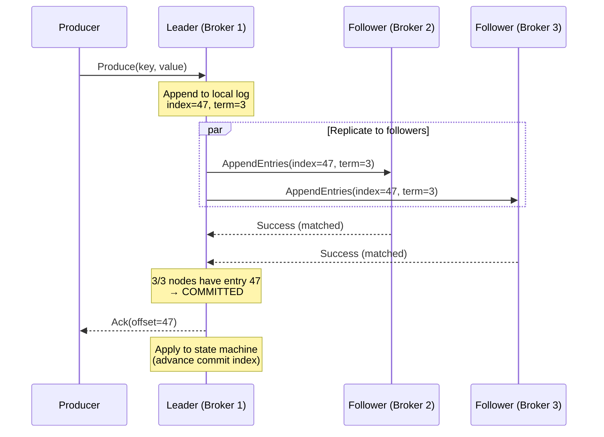
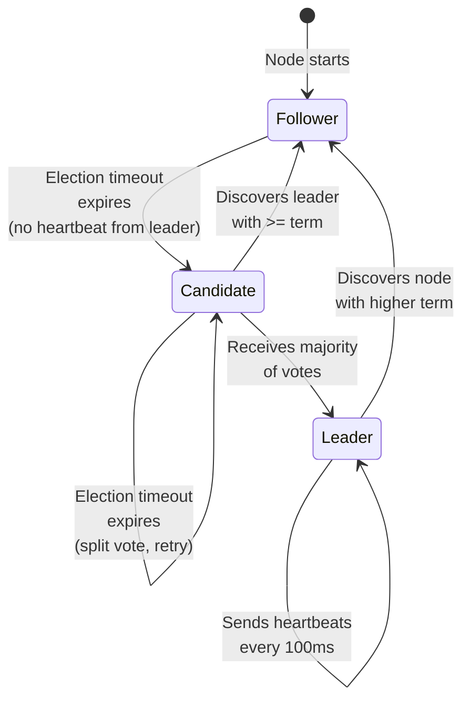
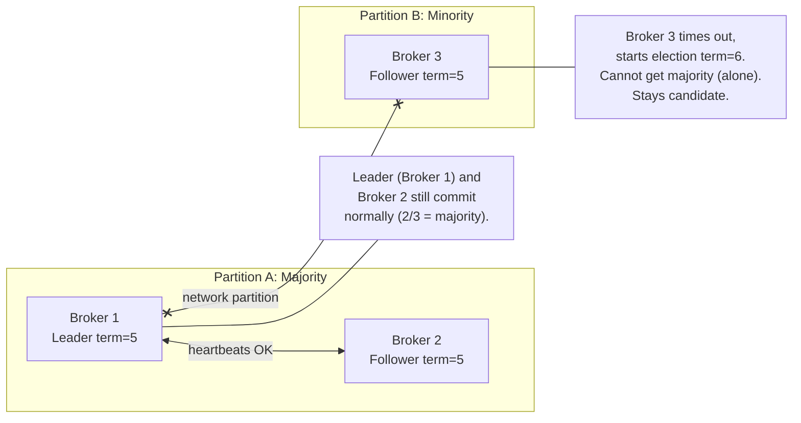

# 4. Distributed Consensus with Raft 🔴

> **The Problem:** Our broker accepts a write, appends it to the local log, and acknowledges the producer. Then the machine loses power. The data is gone—permanently. A single node cannot provide durability *and* availability simultaneously. We need to **replicate every write to multiple nodes** before acknowledging it, and we need an algorithm to **elect a new leader** when the current one fails—all without losing or duplicating a single message. This is the hardest problem in distributed systems, and we solve it with Raft.

---

## Why We Need Consensus

Without replication:
- **Durability = one disk.** A single SSD failure loses all data.
- **Availability = one process.** A broker crash means the partition is offline.

With replication but *without* consensus:
- **Split-brain.** Two nodes both believe they are the leader and accept conflicting writes.
- **Data divergence.** Followers have different data depending on which "leader" they heard from last.

**Raft guarantees:** At most one leader at any time. All committed entries are present on a majority of nodes. A new leader's log contains every committed entry.

---

## Raft Overview

Raft is a consensus algorithm that decomposes the problem into three sub-problems:

1. **Leader Election** — Choose exactly one leader per term.
2. **Log Replication** — The leader appends entries to its log and replicates them to followers.
3. **Safety** — Only entries replicated to a majority are considered committed.



---

## Core Data Structures

### The Raft Log Entry

```rust,ignore
/// A single entry in the Raft replicated log.
#[derive(Clone, Debug)]
struct LogEntry {
    /// The Raft term in which this entry was created.
    term: u64,
    /// The index in the Raft log (1-based, monotonically increasing).
    index: u64,
    /// The actual payload — in our case, a batch of messages to append to a partition.
    command: Command,
}

#[derive(Clone, Debug)]
enum Command {
    /// Append a batch of records to the partition log.
    AppendBatch {
        records: Vec<u8>, // Serialized batch (same format as Chapter 1).
        record_count: u32,
    },
    /// A no-op entry used by newly elected leaders to commit pending entries.
    Noop,
    /// Cluster membership change (add/remove broker from Raft group).
    ConfigChange {
        change: ConfigChangeType,
    },
}

#[derive(Clone, Debug)]
enum ConfigChangeType {
    AddNode(NodeId),
    RemoveNode(NodeId),
}

type NodeId = u32;
```

### The Raft Node State

```rust,ignore
use std::collections::HashMap;
use std::time::{Duration, Instant};

#[derive(Debug, Clone, PartialEq)]
enum Role {
    Follower,
    Candidate,
    Leader,
}

struct RaftNode {
    // --- Persistent state (survives restart) ---
    /// The latest term this node has seen.
    current_term: u64,
    /// The candidate this node voted for in the current term (if any).
    voted_for: Option<NodeId>,
    /// The replicated log.
    log: Vec<LogEntry>,

    // --- Volatile state ---
    /// Index of the highest log entry known to be committed.
    commit_index: u64,
    /// Index of the highest log entry applied to the state machine.
    last_applied: u64,

    // --- Leader-only volatile state ---
    /// For each follower: index of the next log entry to send.
    next_index: HashMap<NodeId, u64>,
    /// For each follower: index of the highest log entry known to be replicated.
    match_index: HashMap<NodeId, u64>,

    // --- Node identity ---
    id: NodeId,
    peers: Vec<NodeId>,
    role: Role,
    leader_id: Option<NodeId>,

    // --- Timing ---
    election_timeout: Duration,
    last_heartbeat: Instant,
}
```

---

## Leader Election

### Election Flow



### Implementation

```rust,ignore
impl RaftNode {
    /// Called when the election timeout expires.
    fn start_election(&mut self) -> Vec<RaftMessage> {
        // Transition to candidate.
        self.role = Role::Candidate;
        self.current_term += 1;
        self.voted_for = Some(self.id);

        let last_log_index = self.log.last().map(|e| e.index).unwrap_or(0);
        let last_log_term = self.log.last().map(|e| e.term).unwrap_or(0);

        // Request votes from all peers.
        self.peers
            .iter()
            .map(|&peer| RaftMessage::RequestVote {
                to: peer,
                from: self.id,
                term: self.current_term,
                last_log_index,
                last_log_term,
            })
            .collect()
    }

    /// Handle an incoming RequestVote.
    fn handle_request_vote(
        &mut self,
        from: NodeId,
        term: u64,
        last_log_index: u64,
        last_log_term: u64,
    ) -> RaftMessage {
        // Rule: If the candidate's term is stale, reject.
        if term < self.current_term {
            return RaftMessage::VoteResponse {
                to: from,
                from: self.id,
                term: self.current_term,
                granted: false,
            };
        }

        // Rule: Step down if we see a higher term.
        if term > self.current_term {
            self.step_down(term);
        }

        // Grant vote if:
        // 1. We haven't voted for anyone else in this term.
        // 2. The candidate's log is at least as up-to-date as ours.
        let can_vote = self.voted_for.is_none() || self.voted_for == Some(from);
        let log_ok = self.is_log_up_to_date(last_log_term, last_log_index);

        let granted = can_vote && log_ok;
        if granted {
            self.voted_for = Some(from);
            self.reset_election_timer();
        }

        RaftMessage::VoteResponse {
            to: from,
            from: self.id,
            term: self.current_term,
            granted,
        }
    }

    /// Raft's "up-to-date" check: compare last log term first, then index.
    fn is_log_up_to_date(&self, candidate_term: u64, candidate_index: u64) -> bool {
        let my_last_term = self.log.last().map(|e| e.term).unwrap_or(0);
        let my_last_index = self.log.last().map(|e| e.index).unwrap_or(0);

        // ✅ SAFETY: This check ensures the leader always has the most complete log.
        // A candidate with a higher last term wins.
        // If terms are equal, the longer log wins.
        (candidate_term, candidate_index) >= (my_last_term, my_last_index)
    }

    fn step_down(&mut self, new_term: u64) {
        self.current_term = new_term;
        self.role = Role::Follower;
        self.voted_for = None;
        self.leader_id = None;
        self.reset_election_timer();
    }

    fn reset_election_timer(&mut self) {
        self.last_heartbeat = Instant::now();
        // Randomize timeout to prevent synchronized elections.
        // Range: 150ms – 300ms.
        self.election_timeout = Duration::from_millis(
            150 + (rand::random::<u64>() % 150)
        );
    }
}
```

### The Election Timeout: Why Randomization Matters

```
Without randomization:
  Node A timeout: 200ms ─────┐
  Node B timeout: 200ms ─────┤── All start election simultaneously
  Node C timeout: 200ms ─────┘   → Split vote → Retry → Split vote → ...

With randomization (150–300ms range):
  Node A timeout: 167ms ──── Starts election first, wins quickly
  Node B timeout: 243ms ──── Receives leader's heartbeat before timeout
  Node C timeout: 289ms ──── Receives leader's heartbeat before timeout
```

| Parameter | Value | Why |
|---|---|---|
| Heartbeat interval | 100 ms | Must be << election timeout |
| Election timeout min | 150 ms | Must be > heartbeat + network RTT |
| Election timeout max | 300 ms | Must be > 2× min for sufficient randomization |
| Typical election time | ~200 ms | Fast enough for sub-second failover |

---

## Log Replication

### The `AppendEntries` RPC

```rust,ignore
#[derive(Debug, Clone)]
enum RaftMessage {
    RequestVote {
        to: NodeId,
        from: NodeId,
        term: u64,
        last_log_index: u64,
        last_log_term: u64,
    },
    VoteResponse {
        to: NodeId,
        from: NodeId,
        term: u64,
        granted: bool,
    },
    AppendEntries {
        to: NodeId,
        from: NodeId,
        term: u64,
        /// Index of the log entry immediately preceding the new entries.
        prev_log_index: u64,
        /// Term of the entry at prev_log_index.
        prev_log_term: u64,
        /// New entries to append (empty for heartbeats).
        entries: Vec<LogEntry>,
        /// Leader's commit index — followers advance their commit to match.
        leader_commit: u64,
    },
    AppendResponse {
        to: NodeId,
        from: NodeId,
        term: u64,
        success: bool,
        /// The follower's last log index after applying entries.
        match_index: u64,
    },
}
```

### Leader: Sending Entries

```rust,ignore
impl RaftNode {
    /// Called by the leader to replicate new entries to a specific follower.
    fn replicate_to(&self, peer: NodeId) -> RaftMessage {
        let next = self.next_index[&peer];
        let prev_index = next - 1;
        let prev_term = if prev_index == 0 {
            0
        } else {
            self.log.get(prev_index as usize - 1)
                .map(|e| e.term)
                .unwrap_or(0)
        };

        // Send all entries from next_index onward.
        let entries: Vec<LogEntry> = self.log
            .iter()
            .filter(|e| e.index >= next)
            .cloned()
            .collect();

        RaftMessage::AppendEntries {
            to: peer,
            from: self.id,
            term: self.current_term,
            prev_log_index: prev_index,
            prev_log_term: prev_term,
            entries,
            leader_commit: self.commit_index,
        }
    }

    /// Handle AppendResponse from a follower.
    fn handle_append_response(
        &mut self,
        from: NodeId,
        term: u64,
        success: bool,
        match_index: u64,
    ) -> Vec<RaftMessage> {
        if term > self.current_term {
            self.step_down(term);
            return vec![];
        }

        if success {
            // ✅ Advance the follower's known position.
            self.next_index.insert(from, match_index + 1);
            self.match_index.insert(from, match_index);

            // Check if we can advance the commit index.
            self.maybe_advance_commit();
        } else {
            // ✅ BACKTRACK: Decrement next_index and retry.
            // The follower's log diverges — we need to find the common prefix.
            let next = self.next_index.get(&from).copied().unwrap_or(1);
            if next > 1 {
                self.next_index.insert(from, next - 1);
            }
            // Retry with the decremented index.
            return vec![self.replicate_to(from)];
        }

        vec![]
    }

    /// Advance commit_index to the highest index replicated on a majority.
    fn maybe_advance_commit(&mut self) {
        let majority = (self.peers.len() + 1) / 2 + 1; // +1 for self

        // Check each uncommitted index starting from the highest.
        for idx in (self.commit_index + 1..=self.log.last().map(|e| e.index).unwrap_or(0)).rev() {
            let term_at_idx = self.log.get(idx as usize - 1)
                .map(|e| e.term)
                .unwrap_or(0);

            // ✅ SAFETY: Only commit entries from the current term.
            // This is critical for Raft correctness — see the "commitment rules" below.
            if term_at_idx != self.current_term {
                continue;
            }

            let replication_count = 1 + self.match_index.values()
                .filter(|&&mi| mi >= idx)
                .count();

            if replication_count >= majority {
                self.commit_index = idx;
                break;
            }
        }
    }
}
```

### Follower: Handling AppendEntries

```rust,ignore
impl RaftNode {
    fn handle_append_entries(
        &mut self,
        from: NodeId,
        term: u64,
        prev_log_index: u64,
        prev_log_term: u64,
        entries: Vec<LogEntry>,
        leader_commit: u64,
    ) -> RaftMessage {
        // Step down if we see a higher (or equal) term from a leader.
        if term >= self.current_term {
            self.current_term = term;
            self.role = Role::Follower;
            self.leader_id = Some(from);
            self.reset_election_timer();
        }

        // Reject if the term is stale.
        if term < self.current_term {
            return RaftMessage::AppendResponse {
                to: from,
                from: self.id,
                term: self.current_term,
                success: false,
                match_index: 0,
            };
        }

        // Consistency check: does our log match at prev_log_index?
        let log_ok = if prev_log_index == 0 {
            true
        } else {
            self.log.get(prev_log_index as usize - 1)
                .map(|e| e.term == prev_log_term)
                .unwrap_or(false)
        };

        if !log_ok {
            // Our log diverges — reject and let the leader backtrack.
            return RaftMessage::AppendResponse {
                to: from,
                from: self.id,
                term: self.current_term,
                success: false,
                match_index: 0,
            };
        }

        // Append new entries, truncating any conflicting suffix.
        for entry in &entries {
            let idx = entry.index as usize - 1;
            if idx < self.log.len() {
                if self.log[idx].term != entry.term {
                    // ✅ SAFETY: Truncate conflicting entries.
                    // This is safe because uncommitted entries may be overwritten.
                    self.log.truncate(idx);
                    self.log.push(entry.clone());
                }
                // If terms match, skip (already have this entry).
            } else {
                self.log.push(entry.clone());
            }
        }

        // Advance commit index to min(leader_commit, our last index).
        if leader_commit > self.commit_index {
            let last_index = self.log.last().map(|e| e.index).unwrap_or(0);
            self.commit_index = leader_commit.min(last_index);
        }

        let match_index = self.log.last().map(|e| e.index).unwrap_or(0);

        RaftMessage::AppendResponse {
            to: from,
            from: self.id,
            term: self.current_term,
            success: true,
            match_index,
        }
    }
}
```

---

## Handling Split-Brain

A **network partition** can split the cluster into two groups, each potentially electing its own leader. Raft's term mechanism prevents this from causing data corruption.



### Scenario: Partition Heals

1. **Broker 3** (term 6, candidate) reconnects.
2. **Broker 1** (term 5, leader) sends `AppendEntries` with term=5.
3. **Broker 3** replies with term=6 → Broker 1 **steps down** (sees higher term).
4. **New election** with all 3 nodes participating. The node with the most complete log wins.
5. Since Broker 1 and 2 had the committed entries, one of them becomes leader.
6. **Broker 3** catches up by receiving the missing entries.

### The Critical Safety Property

> **Raft Safety Guarantee:** If a log entry is committed in a given term, that entry will be present in the logs of all leaders for all higher-numbered terms.

This is enforced by two mechanisms:
1. **Voting restriction:** A candidate must have a log at least as up-to-date as the voter's.
2. **Commitment rule:** A leader only commits entries from its own term (which implicitly commits all prior entries via the Log Matching Property).

---

## Integrating Raft with the Storage Engine

The key architectural insight: **the Raft log *is* the write-ahead log for our storage engine.**

```rust,ignore
/// The state machine that applies committed Raft entries
/// to the partition's segment store.
struct PartitionStateMachine {
    partition_id: u32,
    writer: PartitionWriter, // From Chapter 1
    last_applied_index: u64,
}

impl PartitionStateMachine {
    /// Apply all committed but unapplied entries.
    fn apply_committed(&mut self, commit_index: u64) -> std::io::Result<()> {
        // This is called whenever the commit index advances.
        while self.last_applied_index < commit_index {
            self.last_applied_index += 1;

            // Get the committed entry from the Raft log.
            // (In production, this reads from the Raft WAL on disk.)
            let entry = self.get_entry(self.last_applied_index);

            match entry.command {
                Command::AppendBatch { ref records, record_count } => {
                    // ✅ Apply the batch to the partition's segment store.
                    // This writes to the .log file via io_uring (Chapter 1).
                    self.writer.write_raw_batch(records)?;
                }
                Command::Noop => {
                    // No-ops are committed to establish the new leader's authority.
                    // Nothing to apply.
                }
                Command::ConfigChange { ref change } => {
                    // Handle membership changes.
                    self.apply_config_change(change);
                }
            }
        }

        Ok(())
    }

    fn get_entry(&self, index: u64) -> LogEntry {
        // Placeholder: read from the Raft WAL.
        todo!("Read entry {} from persistent Raft log", index)
    }

    fn apply_config_change(&mut self, _change: &ConfigChangeType) {
        // Update the Raft group membership.
        todo!("Apply config change to Raft group")
    }
}
```

### Write Path (End-to-End)

| Step | Component | Action |
|---|---|---|
| 1 | Producer | Sends `Produce(key, value)` to partition leader |
| 2 | Leader Raft | Appends `AppendBatch` entry to Raft log |
| 3 | Leader Raft | Replicates entry to followers via `AppendEntries` |
| 4 | Followers | Append entry to their Raft log, respond `Success` |
| 5 | Leader Raft | Majority acknowledged → advance commit index |
| 6 | State Machine | Apply batch to segment store via `io_uring` |
| 7 | Leader | Respond to producer with assigned offset |

---

## Snapshotting for Log Compaction

The Raft log grows unboundedly. We periodically **snapshot** the state machine and truncate old entries.

```rust,ignore
struct Snapshot {
    /// The Raft index at which this snapshot was taken.
    last_included_index: u64,
    /// The Raft term of the last included entry.
    last_included_term: u64,
    /// For our message broker, the "snapshot" is a pointer to the sealed
    /// segment files — we don't need to copy data, just record the offset.
    partition_state: PartitionSnapshotState,
}

struct PartitionSnapshotState {
    /// The highest offset applied to the partition log.
    last_offset: u64,
    /// Paths to sealed segment files (already durable on disk).
    sealed_segments: Vec<std::path::PathBuf>,
    /// The active segment's file position.
    active_segment_position: u64,
}
```

Because our state machine writes to immutable segment files, the "snapshot" is essentially a list of file paths. We do not need to serialize the entire state — just record which segments exist and the position in the active segment. This makes snapshotting O(1) rather than O(data size).

---

## Raft Performance at Scale

| Metric | Value |
|---|---|
| Leader election (healthy) | ~200 ms |
| Log replication latency (3-node, same DC) | ~0.5 ms (network RTT dominant) |
| Commit throughput (batched) | ~200K batches/sec per Raft group |
| With 1K msgs per batch | **~200M msgs/sec per Raft group** (batch amortizes consensus cost) |
| Snapshot creation | ~1 µs (just recording file pointers) |

The key optimization: **batch multiple producer messages into a single Raft entry.** Instead of running one round of Raft consensus per message, we batch 1,000 messages and run consensus once. The consensus overhead is amortized across the batch.

---

> **Key Takeaways**
>
> 1. **Raft provides exactly-once leader election and linearizable log replication.** At most one leader per term, and committed entries are never lost—even through crashes and network partitions.
> 2. **The Raft log *is* the WAL.** Don't maintain a separate write-ahead log. The Raft replicated log serves as both the replication protocol and the durability mechanism.
> 3. **Batch aggressively.** Consensus is expensive per round-trip. Batching 1,000 messages into one Raft entry amortizes the cost to ~0.5 µs per message.
> 4. **Randomized election timeouts prevent livelock.** Without randomization, all nodes start elections simultaneously, split the vote, retry, split again—indefinitely.
> 5. **Only commit entries from the current term.** This subtle rule (Raft Figure 8) prevents a re-elected leader from accidentally committing entries that a *future* leader might overwrite. It's the most common implementation bug in Raft.
> 6. **Snapshots are cheap for log-structured storage.** Because our state machine writes immutable segment files, a "snapshot" is just a list of file pointers—O(1) regardless of data volume.
