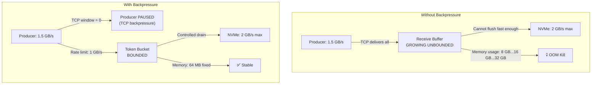
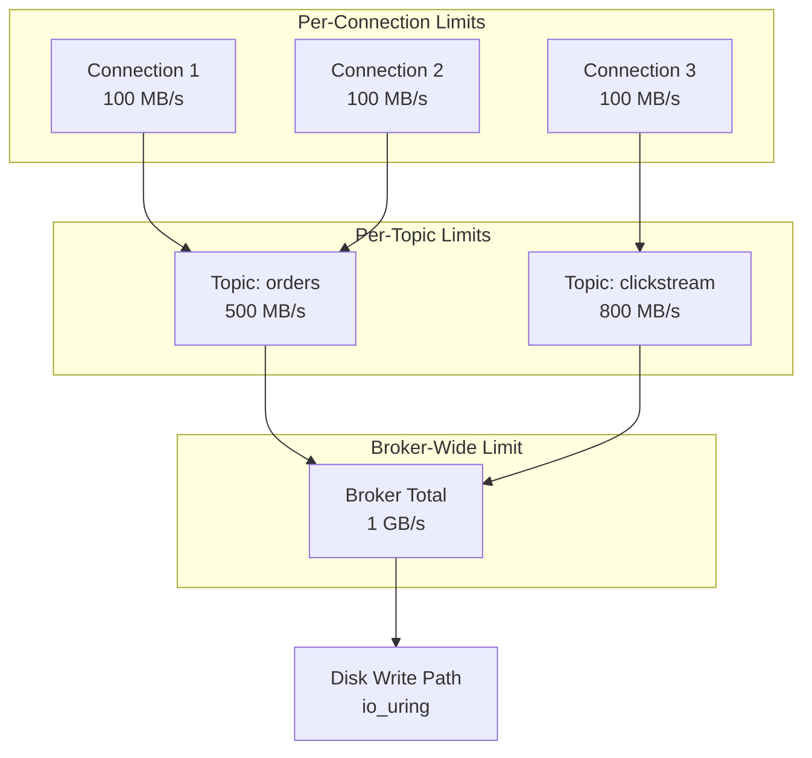
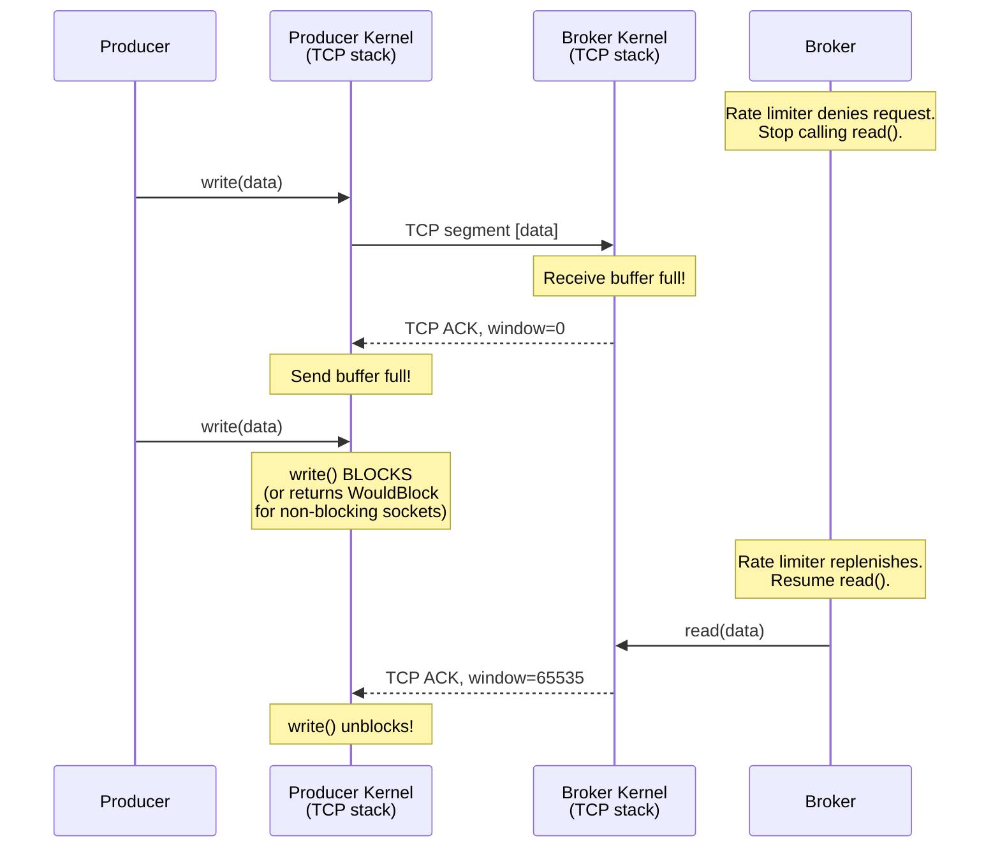
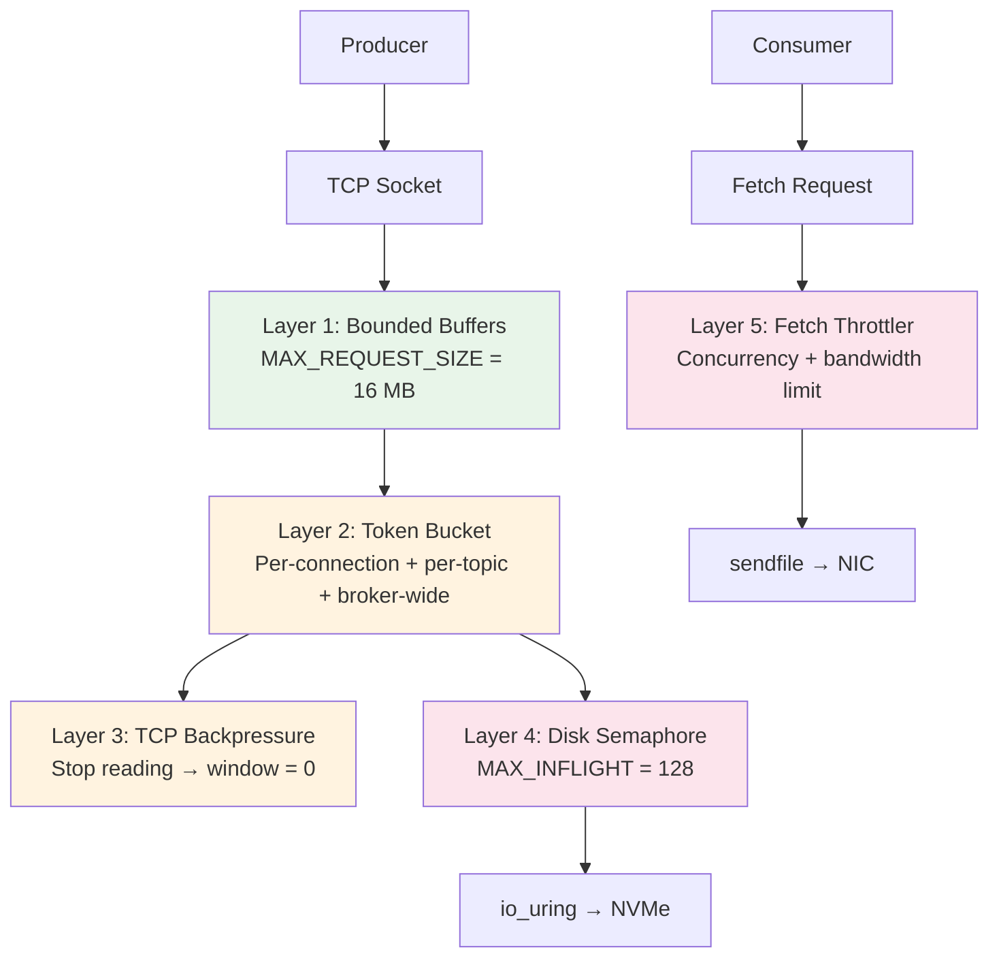

# 5. Memory Management and Backpressure 🔴

> **The Problem:** A consumer goes down for 6 hours. When it reconnects, it asks for 6 hours of backlog — hundreds of gigabytes. Meanwhile, producers continue writing at 1 GB/s. The broker must simultaneously serve the backlog consumer (disk-bound), keep up with live producers (CPU-bound), and run Raft replication (latency-sensitive). Without explicit memory and flow control, the broker allocates unbounded buffers, the Linux OOM killer fires, and the process is terminated — taking out an entire broker node. We need to make the system **degrade gracefully** instead of **fail catastrophically**.

---

## The Three Failure Modes We Must Prevent

| Failure Mode | Trigger | Consequence |
|---|---|---|
| **OOM Kill** | Unbounded receive buffers from fast producers | Broker process killed by kernel, all partitions offline |
| **Disk Saturation** | Write rate exceeds NVMe throughput | `io_uring` completions back up, latency spikes to seconds |
| **Raft Timeout** | CPU stolen by consumer backlog serving | Leader misses heartbeat deadline, unnecessary re-election |

All three failures share a root cause: **no mechanism to push back against the source of load.**



---

## Layer 1: Bounded Receive Buffers

The first line of defense is ensuring we never allocate memory proportional to the incoming data rate.

### Naive Approach: `Vec::extend` from the socket

```rust,ignore
use std::io::Read;
use std::net::TcpStream;

fn read_produce_request_naive(socket: &mut TcpStream) -> std::io::Result<Vec<u8>> {
    // 💥 OOM HAZARD: Read the "length" header from the producer.
    let mut len_buf = [0u8; 4];
    socket.read_exact(&mut len_buf)?;
    let length = u32::from_le_bytes(len_buf) as usize;

    // 💥 A malicious or buggy producer can send length = 4 GB.
    // This single allocation crashes the process.
    let mut buf = vec![0u8; length];
    socket.read_exact(&mut buf)?;

    Ok(buf)
}
```

**Problems:**
1. No upper bound on `length` — a single request can OOM the process.
2. Allocates per-request — at 1M msgs/sec, this is 1M allocations/sec.
3. No way to slow down the producer — we greedily read everything TCP delivers.

### Production Approach: Pre-allocated Ring Buffer with Limits

```rust,ignore
use bytes::BytesMut;

const MAX_REQUEST_SIZE: usize = 16 * 1024 * 1024; // 16 MB max per request
const RECEIVE_BUFFER_SIZE: usize = 4 * 1024 * 1024; // 4 MB pre-allocated

struct ConnectionHandler {
    /// Pre-allocated receive buffer — never grows beyond RECEIVE_BUFFER_SIZE.
    recv_buf: BytesMut,
    /// Per-connection byte quota remaining (replenished by the rate limiter).
    byte_quota: usize,
}

impl ConnectionHandler {
    fn new() -> Self {
        Self {
            recv_buf: BytesMut::with_capacity(RECEIVE_BUFFER_SIZE),
            byte_quota: RECEIVE_BUFFER_SIZE,
        }
    }

    /// Read a produce request with bounded allocation and rate limiting.
    fn read_produce_request(
        &mut self,
        socket: &mut std::net::TcpStream,
    ) -> std::io::Result<Option<BytesMut>> {
        use std::io::Read;

        // Read the length prefix.
        let mut len_buf = [0u8; 4];
        socket.read_exact(&mut len_buf)?;
        let length = u32::from_le_bytes(len_buf) as usize;

        // ✅ FIX: Reject oversized requests immediately.
        if length > MAX_REQUEST_SIZE {
            return Err(std::io::Error::new(
                std::io::ErrorKind::InvalidData,
                format!("request size {} exceeds maximum {}", length, MAX_REQUEST_SIZE),
            ));
        }

        // ✅ FIX: Check the rate limiter quota.
        if length > self.byte_quota {
            // Don't read the payload — leave it in the TCP buffer.
            // The TCP window will shrink, applying backpressure to the producer.
            return Ok(None); // Signal: "try again later"
        }

        // Read into the pre-allocated buffer.
        self.recv_buf.resize(length, 0);
        socket.read_exact(&mut self.recv_buf[..length])?;

        self.byte_quota -= length;

        Ok(Some(self.recv_buf.split_to(length)))
    }
}
```

---

## Layer 2: Token-Bucket Rate Limiter

The rate limiter controls **how many bytes per second** a producer connection (or the entire broker) is allowed to ingest.

### How Token Buckets Work

```
Time 0ms:   bucket = 1,000,000 tokens (1 MB)
Time 0ms:   Producer sends 500 KB → bucket = 500,000
Time 1ms:   Refill: +1,000 tokens/ms → bucket = 501,000
Time 1ms:   Producer sends 600 KB → NOT ENOUGH → producer must wait
            (TCP backpressure kicks in)
Time 2ms:   Refill: +1,000 tokens/ms → bucket = 502,000
...
Time 100ms: Refill: +100,000 tokens → bucket = 601,000
Time 100ms: Producer retries 600 KB → bucket = 1,000 → accepted
```

### Implementation

```rust,ignore
use std::time::Instant;

/// A token-bucket rate limiter.
///
/// - `rate`: tokens added per second (bytes/sec).
/// - `burst`: maximum bucket size (bytes). Allows short bursts above the rate.
struct TokenBucket {
    rate: f64,           // tokens per second
    burst: usize,        // max tokens
    tokens: f64,         // current tokens (can be fractional during refill)
    last_refill: Instant,
}

impl TokenBucket {
    fn new(rate_bytes_per_sec: usize, burst_bytes: usize) -> Self {
        Self {
            rate: rate_bytes_per_sec as f64,
            burst: burst_bytes,
            tokens: burst_bytes as f64,
            last_refill: Instant::now(),
        }
    }

    /// Refill tokens based on elapsed time.
    fn refill(&mut self) {
        let now = Instant::now();
        let elapsed = now.duration_since(self.last_refill).as_secs_f64();
        self.tokens = (self.tokens + elapsed * self.rate).min(self.burst as f64);
        self.last_refill = now;
    }

    /// Try to consume `amount` tokens.
    /// Returns `true` if the request is allowed, `false` if it should be delayed.
    fn try_acquire(&mut self, amount: usize) -> bool {
        self.refill();

        if self.tokens >= amount as f64 {
            self.tokens -= amount as f64;
            true
        } else {
            false
        }
    }

    /// How long to wait before `amount` tokens are available.
    fn wait_duration(&mut self, amount: usize) -> std::time::Duration {
        self.refill();

        if self.tokens >= amount as f64 {
            return std::time::Duration::ZERO;
        }

        let deficit = amount as f64 - self.tokens;
        std::time::Duration::from_secs_f64(deficit / self.rate)
    }
}
```

### Rate Limiter Hierarchy

We apply rate limiting at multiple levels:



```rust,ignore
/// Multi-level rate limiter hierarchy.
struct RateLimiterStack {
    /// Per-connection limiter.
    connection: TokenBucket,
    /// Per-topic limiter (shared across connections to the same topic).
    topic: std::sync::Arc<std::sync::Mutex<TokenBucket>>,
    /// Broker-wide limiter (shared across all topics).
    broker: std::sync::Arc<std::sync::Mutex<TokenBucket>>,
}

impl RateLimiterStack {
    /// Check all levels of the hierarchy.
    /// Returns false if ANY level is over quota.
    fn try_acquire(&mut self, bytes: usize) -> bool {
        // ✅ Check from most specific to least specific.
        // All three must allow the request.
        if !self.connection.try_acquire(bytes) {
            return false;
        }
        if !self.topic.lock().unwrap().try_acquire(bytes) {
            // Roll back the connection tokens (request denied at topic level).
            self.connection.tokens += bytes as f64;
            return false;
        }
        if !self.broker.lock().unwrap().try_acquire(bytes) {
            // Roll back both connection and topic tokens.
            self.connection.tokens += bytes as f64;
            self.topic.lock().unwrap().tokens += bytes as f64;
            return false;
        }

        true
    }
}
```

---

## Layer 3: TCP Backpressure

The most elegant form of backpressure: **stop reading from the socket.** When we stop calling `read()`, the kernel's receive buffer fills up. When the receive buffer is full, the kernel advertises a TCP window of 0 to the sender. The sender's `write()` call blocks. The producer is now rate-limited *by the kernel itself*, with zero application-level protocol changes.

### How TCP Backpressure Propagates



### Implementation: Async Read Pausing

```rust,ignore
use tokio::net::TcpStream;
use tokio::io::AsyncReadExt;

/// A connection handler that pauses reads when the rate limiter is exhausted.
struct AsyncConnectionHandler {
    socket: TcpStream,
    recv_buf: bytes::BytesMut,
    rate_limiter: RateLimiterStack,
}

impl AsyncConnectionHandler {
    async fn run(&mut self) -> std::io::Result<()> {
        loop {
            // Read the length prefix.
            let length = self.socket.read_u32_le().await? as usize;

            if length > MAX_REQUEST_SIZE {
                return Err(std::io::Error::new(
                    std::io::ErrorKind::InvalidData,
                    "request too large",
                ));
            }

            // ✅ FIX: If the rate limiter denies the request,
            // SLEEP instead of reading. This lets the TCP receive
            // buffer fill up, propagating backpressure to the producer.
            while !self.rate_limiter.try_acquire(length) {
                let wait = self.rate_limiter.connection.wait_duration(length);
                tokio::time::sleep(wait).await;
            }

            // Now read the payload (quota reserved).
            self.recv_buf.resize(length, 0);
            self.socket.read_exact(&mut self.recv_buf[..length]).await?;

            // Process the batch...
            self.process_batch(&self.recv_buf[..length]).await?;
        }
    }

    async fn process_batch(&self, _data: &[u8]) -> std::io::Result<()> {
        // Append to Raft log → replicate → commit → apply to segment store.
        Ok(())
    }
}
```

---

## Layer 4: Disk Write Admission Control

Even with rate limiting, bursts can cause the `io_uring` submission queue to back up. We add a **semaphore** that limits the number of in-flight disk operations.

```rust,ignore
use tokio::sync::Semaphore;
use std::sync::Arc;

/// Controls the number of concurrent io_uring operations.
const MAX_INFLIGHT_DISK_OPS: usize = 128;

struct DiskWriteController {
    semaphore: Arc<Semaphore>,
}

impl DiskWriteController {
    fn new() -> Self {
        Self {
            semaphore: Arc::new(Semaphore::new(MAX_INFLIGHT_DISK_OPS)),
        }
    }

    /// Submit a write batch to disk, blocking if too many ops are in-flight.
    async fn submit_write(
        &self,
        data: bytes::Bytes,
        file_offset: u64,
    ) -> std::io::Result<()> {
        // ✅ FIX: Acquire a permit before submitting to io_uring.
        // If all 128 permits are taken, this future is parked until
        // a completion frees a permit — naturally rate-limiting disk writes.
        let _permit = self.semaphore
            .acquire()
            .await
            .map_err(|_| std::io::Error::new(
                std::io::ErrorKind::Other,
                "semaphore closed",
            ))?;

        // Submit to io_uring (from Chapter 1).
        // The permit is held until the completion fires.
        // ...

        Ok(())
    }
}
```

---

## Layer 5: Consumer Fetch Throttling

Consumers catching up on backlog can starve the producer and Raft paths of I/O bandwidth. We prioritize:

1. **Raft heartbeats** — highest priority (100ms deadline).
2. **Producer writes** — high priority (latency-sensitive).
3. **Consumer fetches** — best-effort (throughput-sensitive, not latency-sensitive).

```rust,ignore
use std::sync::Arc;
use tokio::sync::Semaphore;

/// Limits concurrent consumer fetch I/O to prevent starving producers and Raft.
struct FetchThrottler {
    /// Max concurrent sendfile operations across all consumers.
    concurrency: Arc<Semaphore>,
    /// Max bytes/sec for all consumer fetches combined.
    bandwidth: Arc<std::sync::Mutex<TokenBucket>>,
}

impl FetchThrottler {
    fn new(max_concurrent: usize, max_bandwidth_bytes_sec: usize) -> Self {
        Self {
            concurrency: Arc::new(Semaphore::new(max_concurrent)),
            bandwidth: Arc::new(std::sync::Mutex::new(
                TokenBucket::new(max_bandwidth_bytes_sec, max_bandwidth_bytes_sec),
            )),
        }
    }

    /// Gate a consumer fetch operation.
    async fn acquire(&self, bytes: usize) -> std::io::Result<tokio::sync::SemaphorePermit<'_>> {
        // Limit concurrency.
        let permit = self.concurrency
            .acquire()
            .await
            .map_err(|_| std::io::Error::new(
                std::io::ErrorKind::Other,
                "throttler closed",
            ))?;

        // Limit bandwidth.
        loop {
            let wait = {
                let mut bw = self.bandwidth.lock().unwrap();
                if bw.try_acquire(bytes) {
                    break;
                }
                bw.wait_duration(bytes)
            };
            tokio::time::sleep(wait).await;
        }

        Ok(permit)
    }
}
```

---

## Putting It All Together: The Backpressure Stack



### Configuration Summary

| Parameter | Default | Purpose |
|---|---|---|
| `MAX_REQUEST_SIZE` | 16 MB | Reject malformed/oversized requests |
| `RECEIVE_BUFFER_SIZE` | 4 MB | Pre-allocated per-connection buffer |
| Connection rate limit | 100 MB/s | Prevent one producer from monopolizing |
| Topic rate limit | 500 MB/s | Prevent one topic from starving others |
| Broker rate limit | 1 GB/s | Keep total ingestion within disk capacity |
| `MAX_INFLIGHT_DISK_OPS` | 128 | Prevent io_uring SQ overflow |
| Consumer fetch concurrency | 16 | Prevent consumer I/O from starving writes |
| Consumer fetch bandwidth | 2 GB/s | Leave headroom for producers |

---

## Monitoring and Observability

Backpressure is invisible if you don't measure it. Every layer emits metrics:

```rust,ignore
use std::sync::atomic::{AtomicU64, Ordering};

/// Metrics for the backpressure system.
struct BackpressureMetrics {
    /// Number of requests rejected by the rate limiter.
    throttled_requests: AtomicU64,
    /// Total bytes delayed by rate limiting.
    throttled_bytes: AtomicU64,
    /// Number of TCP backpressure events (window = 0).
    tcp_backpressure_events: AtomicU64,
    /// Number of times the disk semaphore was contended.
    disk_queue_full_events: AtomicU64,
    /// Number of consumer fetches delayed by the throttler.
    fetch_throttle_events: AtomicU64,
    /// Current memory usage of all receive buffers.
    recv_buffer_bytes: AtomicU64,
}

impl BackpressureMetrics {
    fn record_throttle(&self, bytes: usize) {
        self.throttled_requests.fetch_add(1, Ordering::Relaxed);
        self.throttled_bytes.fetch_add(bytes as u64, Ordering::Relaxed);
    }

    fn record_tcp_backpressure(&self) {
        self.tcp_backpressure_events.fetch_add(1, Ordering::Relaxed);
    }

    /// Returns true if any backpressure layer is active — a leading indicator
    /// that the broker is approaching capacity.
    fn is_under_pressure(&self) -> bool {
        self.throttled_requests.load(Ordering::Relaxed) > 0
            || self.disk_queue_full_events.load(Ordering::Relaxed) > 0
    }
}
```

### Dashboard Alerts

| Metric | Warning Threshold | Critical Threshold | Action |
|---|---|---|---|
| `throttled_requests/sec` | > 100 | > 1000 | Add brokers or increase quotas |
| `tcp_backpressure_events/sec` | > 10 | > 100 | Producers are sending too fast |
| `disk_queue_full_events/sec` | > 50 | > 200 | NVMe is saturated — scale out |
| `recv_buffer_bytes` | > 1 GB | > 4 GB | Memory leak or stuck consumers |
| `fetch_throttle_events/sec` | > 50 | > 200 | Too many lagging consumers |

---

## Graceful Degradation Under Overload

When the broker is overwhelmed, it sheds load in a predictable priority order:

```rust,ignore
#[derive(Debug, Clone, Copy, PartialEq, Eq, PartialOrd, Ord)]
enum Priority {
    /// Raft heartbeats and leader election — never shed.
    RaftControl = 3,
    /// Producer writes to committed partitions.
    ProducerWrite = 2,
    /// Consumer fetch requests (can be retried).
    ConsumerFetch = 1,
    /// Metadata requests, admin operations.
    Admin = 0,
}

struct LoadShedder {
    /// Current load level (0.0 = idle, 1.0 = fully saturated).
    load_factor: f64,
    /// Minimum priority level we're currently accepting.
    min_accepted_priority: Priority,
}

impl LoadShedder {
    fn update(&mut self, load_factor: f64) {
        self.load_factor = load_factor;

        self.min_accepted_priority = match load_factor {
            f if f < 0.7 => Priority::Admin,           // Accept everything
            f if f < 0.85 => Priority::ConsumerFetch,   // Shed admin ops
            f if f < 0.95 => Priority::ProducerWrite,   // Shed consumer fetches
            _ => Priority::RaftControl,                  // Only Raft traffic
        };
    }

    fn should_accept(&self, priority: Priority) -> bool {
        priority >= self.min_accepted_priority
    }
}
```

### Load Shedding Priority Table

| Load Factor | Accepted Traffic | Shed Traffic |
|---|---|---|
| 0.0 – 0.7 | Everything | Nothing |
| 0.7 – 0.85 | Raft + Producers + Consumers | Admin/metadata |
| 0.85 – 0.95 | Raft + Producers | Consumer fetches |
| 0.95 – 1.0 | Raft only | Everything else |

This ensures that even under catastrophic load, the Raft protocol continues to function. A broker that falls out of the Raft group is far worse than a broker that temporarily rejects producer writes—rejected writes can be retried, but a lost Raft member triggers expensive leader re-election and log reconciliation.

---

> **Key Takeaways**
>
> 1. **Backpressure must be layered.** No single mechanism is sufficient. Bounded buffers prevent OOM. Rate limiters control throughput. TCP backpressure propagates limits to producers. Disk semaphores prevent I/O queue overflow. Each layer catches what the previous one misses.
> 2. **TCP backpressure is free.** By simply *not reading* from the socket, the kernel automatically slows the sender. This requires zero application-level protocol changes and works with any TCP client.
> 3. **Token buckets are the right abstraction for rate limiting.** They allow controlled bursts (the `burst` parameter) while enforcing a long-term average rate. The hierarchy (connection → topic → broker) prevents a single producer from starving others.
> 4. **Prioritize Raft over everything.** A broker that cannot run leader election or replicate entries is worse than a broker that drops produce requests. Load shedding must protect the consensus layer first.
> 5. **Measure every backpressure event.** Throttling is an operational signal, not a bug. If `throttled_requests/sec` is consistently high, the cluster needs more brokers. If `disk_queue_full_events` spikes, the NVMe is saturated. Invisible backpressure leads to debugging black holes.
> 6. **Pre-allocate, don't grow.** Every buffer in the data path should have a fixed, pre-allocated size. Dynamic allocation proportional to input is an OOM vulnerability.
