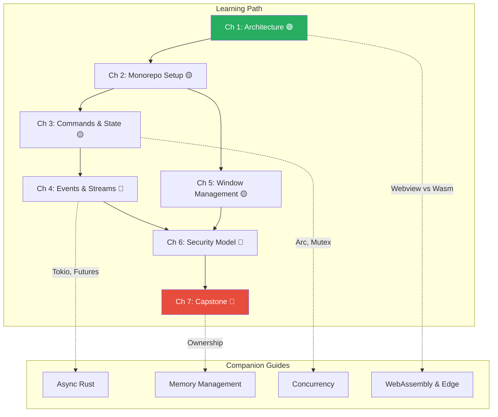

# Rust GUIs: Building Native Apps with Tauri

## Speaker Intro

- Principal Desktop Architect and Systems Engineer with 20+ years building cross-platform desktop applications — from MFC/Win32 to Qt/GTK, from WPF/UWP to Electron, and now to Tauri
- Led the migration of a 2M-line Electron application (800MB installer, 600MB RAM at idle) to a Tauri-based architecture that shipped at 8MB with 45MB idle RAM — a **100x binary size reduction** and **13x memory reduction**
- Contributor to the Tauri ecosystem, specializing in multi-window IPC architectures, OS-native system tray integrations, and security sandboxing for enterprise desktop deployments
- Background in Win32 message loops, macOS Cocoa run loops, GTK main loops, and the browser event loop — with an obsessive focus on *understanding how the OS actually draws pixels to screen before writing a single line of framework code*

---

This is not a book about web development. It is a book about **replacing web development's most bloated artifact — the bundled browser — with the operating system's own rendering engine**.

Every Electron app you ship contains a full copy of Chromium (~120MB) and a full Node.js runtime (~30MB). Your users download 150MB of infrastructure before a single byte of your application code runs. That Chromium process spawns a GPU process, a network process, a utility process, and a renderer process — each consuming 50–150MB of RAM. A "Hello World" Electron app idles at 300MB.

Tauri eliminates all of this. It uses the **OS-native webview** — Edge WebView2 on Windows (already installed on every Windows 10/11 machine), WebKit on macOS (part of the OS since 2003), and WebKitGTK on Linux. Your Rust backend compiles to a single static binary. Your frontend ships as embedded HTML/CSS/JS assets. The total binary size for a production desktop app: **3–12MB**. The idle RAM footprint: **30–60MB**.

This book teaches you how to build those apps. We start with how the OS webview renders UI at the platform level, move through the Tauri IPC bridge that connects your Rust backend to your JavaScript frontend, dive into OS-level window management and security sandboxing, and finish by building a real-time system monitor desktop widget that would be impossible to ship at acceptable size using Electron.

This is a companion to the [Async Rust](../async-book/src/SUMMARY.md), [Rust Memory Management](../memory-management-book/src/SUMMARY.md), and [WebAssembly & The Edge](../wasm-edge-book/src/SUMMARY.md) guides, focusing entirely on **native desktop GUI development with a Rust backend**.

## Who This Is For

- **Web developers** who are tired of shipping 500MB "Hello World" desktop apps via Electron and want to learn how to build native-feeling applications without abandoning their frontend skills
- **Rust engineers** who have built powerful CLI tools and backend services but need to put a UI on their work without learning an entirely new GUI framework from scratch
- **Desktop architects** evaluating Tauri vs Electron vs Flutter vs native (Qt/GTK/WinUI) and need a first-principles understanding of the tradeoffs
- **Product teams** under pressure to reduce download sizes, memory footprints, and startup times for cross-platform desktop applications
- **Anyone who has opened Task Manager**, seen Electron consuming 800MB for a chat app, and thought *"there has to be a better way"*

## Prerequisites

This book assumes you are comfortable with Rust fundamentals and have at least basic familiarity with web frontend concepts:

| Concept | Where to Learn |
|---------|---------------|
| Ownership, borrowing, lifetimes | [Rust Memory Management](../memory-management-book/src/SUMMARY.md) |
| `async`/`await`, `Future`, Tokio basics | [Async Rust](../async-book/src/SUMMARY.md) |
| `Arc`, `Mutex`, shared state | [Concurrency in Rust](../concurrency-book/src/SUMMARY.md) |
| Traits, generics, `serde` serialization | [Rust's Type System & Traits](../type-system-traits-book/src/SUMMARY.md) |
| HTML, CSS, basic JavaScript | Any modern web fundamentals resource |
| A frontend framework (React, Svelte, Vue, or Vanilla JS) | Framework documentation (Svelte recommended for Tauri) |
| npm/pnpm package management basics | npm documentation |

If terms like "IPC bridge", "webview process", "system tray", or "frameless window" are unfamiliar, this book will define them — but you must already understand why `Arc<Mutex<T>>` is the correct way to share state across threads, and be comfortable writing async Rust functions with Tokio.

## How to Use This Book

**Read linearly the first time.** Parts I–IV build on each other. Each chapter has:

| Symbol | Meaning |
|--------|---------|
| 🟢 | Beginner — foundational concepts, architectural overview |
| 🟡 | Intermediate — hands-on development, IPC patterns, OS integration |
| 🔴 | Advanced — async streaming, security internals, production capstone |

Each chapter includes:
- A **"What you'll learn"** block at the top
- **Mermaid diagrams** visualizing the Tauri multi-process architecture, IPC message flow, and security models
- **Side-by-side code comparisons**: "The Electron Way (Bloated/Insecure)" vs "The Tauri Way (Native/Secure)"
- **Anti-patterns** marked with `// 💥 UI FREEZE:` showing code that compiles but blocks the GUI
- **Fixes** marked with `// ✅ FIX:` showing the correct async or IPC alternative
- An **inline exercise** with a hidden solution
- **Key Takeaways** summarizing the core insights
- **Cross-references** to companion guides

## Pacing Guide

| Chapters | Topic | Suggested Time | Checkpoint |
|----------|-------|----------------|------------|
| 1 | Tauri Architecture | 4–6 hours | You can explain how Tauri uses OS webviews instead of bundling Chromium, and quantify the binary/RAM savings |
| 2 | Dual-Language Monorepo | 3–5 hours | You can scaffold a Tauri project with a Vite frontend, understand the `src-tauri` structure, and run `cargo tauri dev` |
| 3 | Commands & Managed State | 5–7 hours | You can write `#[tauri::command]` functions, pass complex data across the IPC boundary, and manage shared backend state |
| 4 | Bi-Directional Events | 6–8 hours | You can emit events from Rust to JS and back, handle long-running background tasks, and stream data without freezing the UI |
| 5 | Window Management | 4–6 hours | You can spawn multiple windows, create frameless custom titlebars, and integrate system trays and global shortcuts |
| 6 | Security & Capabilities | 5–7 hours | You can configure the Tauri capabilities model, apply context isolation, and prevent RCE via allowlist configuration |
| 7 | Capstone: System Monitor | 8–12 hours | You've built a sub-10MB desktop widget with real-time metrics, transparent frameless windows, and a system tray |

**Total estimated time: 35–51 hours**

## Table of Contents

### Part I: The Native GUI Paradigm

1. **Tauri Architecture (Goodbye Electron) 🟢** — Why bundling Chromium is an anti-pattern. How OS-native webviews work at the platform level. Binary size and RAM comparisons that will make you angry at every Electron app you've ever shipped.

2. **The Dual-Language Monorepo 🟡** — Setting up the `src-tauri` Rust backend alongside a Vite-powered frontend. Bridging `cargo` and `npm`/`pnpm`. The development workflow that makes Tauri feel seamless.

### Part II: The IPC Bridge (Rust meets JavaScript)

3. **Commands and Managed State 🟡** — Writing `#[tauri::command]` functions that JavaScript can invoke. Serializing complex data across the IPC boundary. Managing global backend state with `tauri::State` and `Arc<Mutex<T>>`.

4. **Bi-Directional Events and Async Streams 🔴** — Emitting events from Rust to the webview. Listening to UI events in Rust. Handling long-running backend tasks (file downloads, system monitoring) without freezing the UI thread.

### Part III: OS Integration and Security

5. **Window Management and System Integration 🟡** — Multi-window architectures from Rust. Custom frameless titlebars. Native system trays, desktop notifications, and global keyboard shortcuts.

6. **Security and the Capabilities Model 🔴** — Why the webview is inherently untrusted. Context isolation. Configuring the Tauri allowlist to prevent Remote Code Execution by strictly limiting which Rust APIs the frontend can invoke.

### Part IV: Production Capstone

7. **Capstone: The Native System Monitor 🔴** — Build a sub-10MB desktop widget that streams real-time CPU, RAM, and network metrics from a Rust background thread to a live-rendered frontend chart, complete with a frameless transparent window and system tray controls.

### Appendices

8. **Summary and Reference Card** — Cheat sheet for Tauri IPC data types, capability configuration, and cross-compilation deployment commands.



## Companion Guides

| Guide | Relevance |
|-------|-----------|
| [Async Rust](../async-book/src/SUMMARY.md) | Tokio runtime, async commands, event streams |
| [Rust Memory Management](../memory-management-book/src/SUMMARY.md) | Ownership semantics when passing data across IPC |
| [Concurrency in Rust](../concurrency-book/src/SUMMARY.md) | `Arc<Mutex<T>>` patterns used in Tauri managed state |
| [Rust's Type System & Traits](../type-system-traits-book/src/SUMMARY.md) | Serde serialization for IPC data types |
| [WebAssembly & The Edge](../wasm-edge-book/src/SUMMARY.md) | Alternative frontend approach: Wasm in the webview |
| [Rust Engineering Practices](../engineering-book/src/SUMMARY.md) | CI/CD, cross-compilation, and release packaging |

## Tooling You'll Need

Install these before starting:

```bash
# Core Rust toolchain
rustup update stable

# Tauri CLI (v2)
cargo install tauri-cli

# Node.js (LTS) and pnpm (recommended over npm for Tauri)
# Install Node.js from https://nodejs.org/ or via nvm
npm install -g pnpm

# Platform-specific dependencies:

# macOS — Xcode Command Line Tools (includes WebKit)
xcode-select --install

# Ubuntu/Debian — WebKitGTK and build essentials
# sudo apt install libwebkit2gtk-4.1-dev build-essential curl wget file \
#   libxdo-dev libssl-dev libayatana-appindicator3-dev librsvg2-dev

# Windows — WebView2 is pre-installed on Windows 10/11
# Visual Studio Build Tools: https://visualstudio.microsoft.com/visual-cpp-build-tools/

# Frontend framework (we use Svelte throughout, but React/Vue work identically)
# Scaffolded automatically by `cargo tauri init`
```
