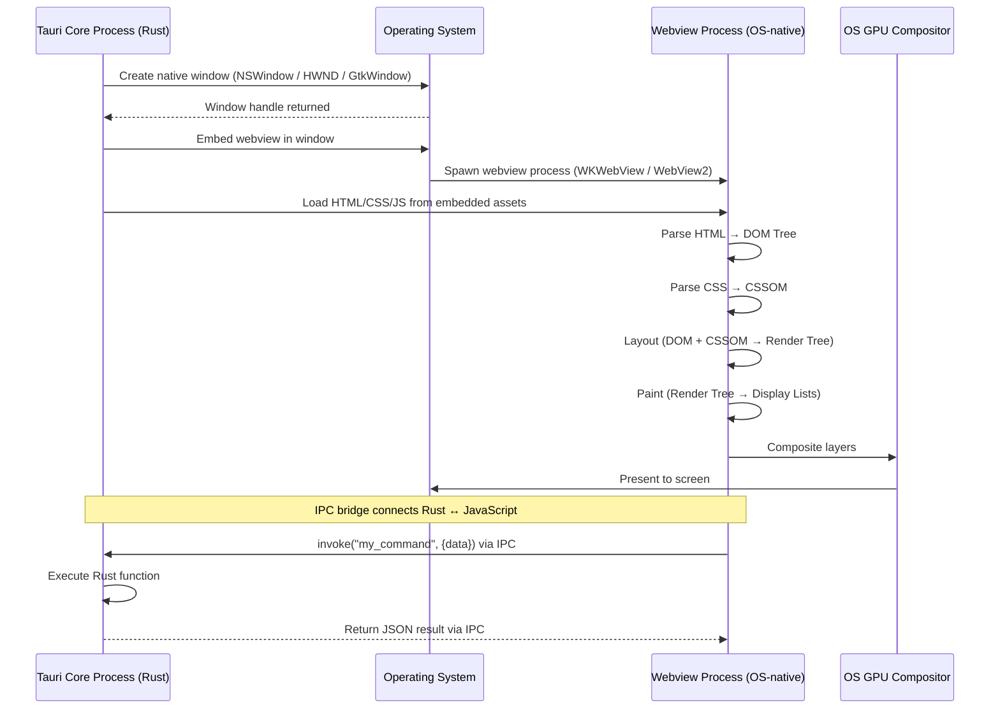
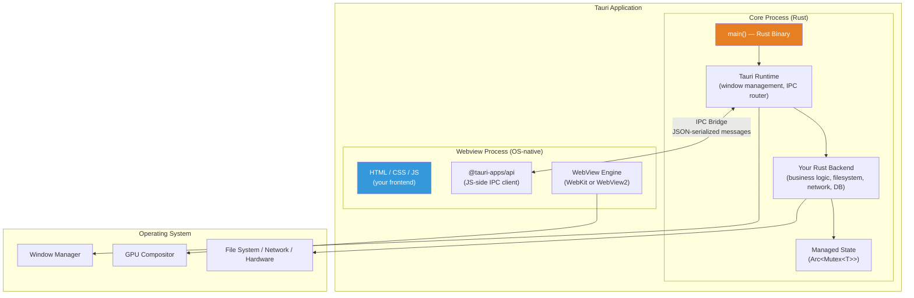
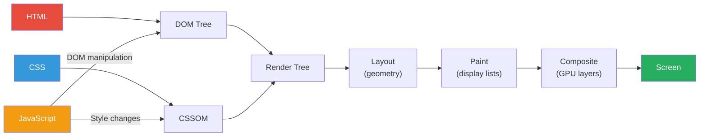

# 1. Tauri Architecture (Goodbye Electron) 🟢

> **What you'll learn:**
> - Why bundling Chromium and Node.js is an architectural anti-pattern that wastes 150MB+ of disk and 300MB+ of RAM before your app code runs
> - How Tauri uses OS-native webviews (Edge WebView2, WebKit, WebKitGTK) to render UI at zero additional binary cost
> - The Tauri multi-process model: Core Process (Rust) vs Webview Process (OS-native) and how IPC connects them
> - Quantified binary size and RAM footprint comparisons that explain why Electron will not survive the next decade

---

## The Electron Problem: First Principles

To understand why Tauri exists, you must understand what Electron actually *is* at the operating system level.

When you ship an Electron app, you ship **three entire software platforms**:

1. **Chromium** (~120MB) — a full web browser, including a V8 JavaScript engine, a Blink rendering engine, a Skia graphics layer, a networking stack, a GPU compositing pipeline, and a multi-process sandboxing model
2. **Node.js** (~30MB) — a server-side JavaScript runtime with libuv, OpenSSL, and the full V8 engine *again* (separate from Chromium's copy)
3. **Your application code** (~1–50MB) — the HTML, CSS, JavaScript, and assets that are your *actual product*

The result is a "Hello World" app that:

| Metric | Electron | Tauri | Ratio |
|--------|----------|-------|-------|
| Installer size | 150–250 MB | 3–12 MB | **15–80x smaller** |
| Idle RAM usage | 300–500 MB | 30–60 MB | **5–10x less** |
| Startup time (cold) | 2–5 sec | 0.3–0.8 sec | **3–7x faster** |
| Processes spawned | 5–8 | 2 | **3–4x fewer** |
| Bundled runtime | Chromium + Node.js | None (OS webview) | **0 vs 150MB** |

These are not theoretical numbers. Measure any Electron app on your system right now: open Activity Monitor (macOS), Task Manager (Windows), or `htop` (Linux) and count the processes. A single Slack window spawns 8–12 processes totaling 500MB–1.2GB.

### Why Bundling a Browser Is an Anti-Pattern

The browser was designed to render *untrusted* content from *arbitrary* origins. It needs process isolation, site isolation, a multi-process GPU compositor, and a full networking stack because it must protect users from malicious websites.

Your desktop app is not a malicious website. It is *your own code* rendering *your own UI*. You don't need:
- Cross-origin isolation (you have one origin)
- A separate GPU process (the OS compositor handles this)
- A bundled networking stack (your Rust backend does networking)
- A bundled JavaScript runtime (the webview has one built in)

Electron bundles all of this because it was designed as a *"put a website in a window"* tool. Tauri was designed as a *"use the OS's own rendering engine"* tool. The difference is architectural, not incremental.

## How OS Webviews Actually Work

Before we touch any Tauri code, you need to understand what an "OS-native webview" is at the platform level. This is the foundational knowledge that separates a Tauri developer from a Tauri *user*.

### The Platform Webview Map

| Platform | Webview Engine | Backing Technology | Ships With OS? | Size on Disk |
|----------|---------------|-------------------|----------------|-------------|
| Windows 10/11 | Edge WebView2 | Chromium-based (Blink/V8) | Yes (Windows 10 1803+) | 0 MB (pre-installed) |
| macOS | WKWebView | WebKit (JavaScriptCore) | Yes (always) | 0 MB (part of macOS) |
| Linux | WebKitGTK | WebKit (JavaScriptCore) | Install via package manager | ~30 MB (system library) |
| iOS | WKWebView | WebKit | Yes (always) | 0 MB |
| Android | Android WebView | Chromium-based | Yes (auto-updated via Play Store) | 0 MB |

The critical insight: **every modern desktop OS already has a browser rendering engine installed**. Electron ignores this and bundles its own. Tauri uses what's already there.

### What Happens When a Webview Renders

When your Tauri app opens a window, here's what happens at the OS level:



This is essentially the same rendering pipeline that Chrome, Safari, or Firefox use internally — but managed by the OS rather than your application. Your app's binary doesn't contain any of this rendering infrastructure. It's already on the user's machine.

### Platform-Specific Details

**Windows (WebView2):** Microsoft ships the WebView2 runtime as part of Windows 10 (version 1803 and later) and Windows 11. It uses the same Chromium-based engine as Microsoft Edge, but runs as a shared system component — not bundled per-application. WebView2 is updated automatically by Windows Update, meaning your app gets security patches and performance improvements for free.

**macOS (WKWebView):** Apple's WebKit engine has been part of macOS since 2003. `WKWebView` runs in a separate process managed by the OS, with its own security sandbox. It uses JavaScriptCore (not V8) for JavaScript execution. Performance is excellent, and the webview process is shared across all apps using it.

**Linux (WebKitGTK):** The only platform where the webview is not guaranteed pre-installed. Users install `libwebkit2gtk-4.1` via their package manager. Once installed, it's a shared system library used by GNOME Web and other GTK applications. Tauri v2 requires WebKitGTK 4.1+.

## The Tauri Multi-Process Architecture

Tauri applications run as **two processes** (compared to Electron's 5–8):



### Core Process (Rust)

The Core Process is your compiled Rust binary. It:

- Owns the application lifecycle (`main()` function)
- Creates and manages native OS windows
- Runs the Tauri runtime (event loop, IPC router)
- Executes your backend business logic (file I/O, network requests, database queries, cryptographic operations)
- Manages shared application state (`tauri::State`)
- Has **full access** to the operating system (filesystem, processes, hardware)

This process is the *trusted* side of the application. It runs native machine code with the full power of the Rust standard library and any crates you depend on.

### Webview Process (OS-native)

The Webview Process is managed by the operating system's webview engine. It:

- Renders your HTML, CSS, and JavaScript
- Runs in a sandboxed environment (no direct filesystem, network, or process access)
- Communicates with the Core Process exclusively through the **IPC bridge**
- Uses `@tauri-apps/api` to invoke Rust commands and listen for events

This process is the *untrusted* side of the application. Even though you wrote the frontend code, the security model treats it as potentially compromised — because XSS vulnerabilities, malicious dependencies, or injected scripts could execute arbitrary JavaScript in this context.

### The IPC Bridge

The IPC (Inter-Process Communication) bridge is the heart of Tauri's architecture. It is how JavaScript talks to Rust and vice versa:

| Direction | Mechanism | Serialization |
|-----------|-----------|---------------|
| JS → Rust | `invoke("command_name", { args })` | JSON (via `serde`) |
| Rust → JS | `app.emit("event_name", payload)` | JSON (via `serde`) |
| Rust → JS (targeted) | `window.emit("event_name", payload)` | JSON (via `serde`) |

All data crossing the IPC boundary is serialized to JSON using `serde_json`. This means:
- Every argument and return value must implement `serde::Serialize` and/or `serde::Deserialize`
- Binary data should be base64-encoded or sent via the Tauri asset protocol
- IPC is **asynchronous** by design — both `invoke` (JS side) and event emission (Rust side) are non-blocking

## Electron vs Tauri: The Architecture Comparison

Let's compare what each framework does when you create a "Hello World" app:

### The Electron Way (Bloated/Insecure)

```javascript
// main.js — Electron's "main process" (runs in Node.js)
const { app, BrowserWindow } = require('electron');

// 💥 BLOAT: This single import pulls in ALL of Chromium + Node.js
// Your "Hello World" is now 150MB before you write a single line of logic

app.whenReady().then(() => {
  const win = new BrowserWindow({
    width: 800,
    height: 600,
    webPreferences: {
      // 💥 SECURITY RISK: nodeIntegration gives JS full system access
      nodeIntegration: true,
      // 💥 SECURITY RISK: Disabling context isolation is common in tutorials
      contextIsolation: false,
    },
  });

  win.loadFile('index.html');
});
```

```
Process tree after launch:
├─ Electron Main Process (Node.js)        ~80 MB
├─ Electron GPU Process                    ~60 MB
├─ Electron Utility Process                ~30 MB
├─ Electron Renderer Process (your app)    ~90 MB
├─ Electron Network Service                ~25 MB
└─ Electron Crashpad Handler               ~15 MB
                                    Total: ~300 MB
```

### The Tauri Way (Native/Secure)

```rust
// src-tauri/src/main.rs
#![cfg_attr(not(debug_assertions), windows_subsystem = "windows")]

fn main() {
    // ✅ EFFICIENT: No bundled browser. Uses OS webview.
    // ✅ SECURE: Webview is sandboxed by default. No node integration.
    tauri::Builder::default()
        .run(tauri::generate_context!())
        .expect("error while running tauri application");
}
```

```
Process tree after launch:
├─ Tauri Core Process (Rust binary)        ~15 MB
└─ OS Webview Process (WKWebView/WebView2) ~25 MB
                                    Total: ~40 MB
```

### Side-by-Side Metrics

| Aspect | Electron | Tauri | Winner |
|--------|----------|-------|--------|
| Runtime bundled | Chromium (120MB) + Node.js (30MB) | None (OS webview) | **Tauri** |
| Process count | 5–8+ | 2 | **Tauri** |
| Hello World binary | ~150 MB | ~3 MB | **Tauri (50x)** |
| Hello World RAM | ~300 MB | ~40 MB | **Tauri (7.5x)** |
| Startup time | 2–5 sec | 0.3–0.8 sec | **Tauri (4x)** |
| Backend language | JavaScript (Node.js) | Rust | **Tauri** |
| Security model | Opt-in sandboxing | Default sandboxing | **Tauri** |
| Auto-updates | electron-updater | Built-in plugin | Comparable |
| Cross-platform | Win/Mac/Linux | Win/Mac/Linux/iOS/Android | **Tauri** |

## Why Rust for the Backend?

Tauri chose Rust for the Core Process for the same reasons you'd choose Rust for any systems-level work:

1. **Zero-cost abstractions**: The IPC command handler compiles to the same machine code as hand-written C, but with memory safety guarantees
2. **No garbage collector**: The Core Process has deterministic memory usage — no GC pauses that could delay IPC responses
3. **Fearless concurrency**: Background tasks (file downloads, system monitoring, database queries) run on separate threads using `tokio::spawn` with compile-time data race prevention
4. **Small binaries**: A release build with `strip` and `opt-level = "z"` produces a 2–5MB binary for non-trivial applications
5. **Native FFI**: Direct access to Win32, Cocoa, or GTK APIs when the Tauri abstractions aren't enough

Compare this to Electron's Node.js backend, which:
- Runs in a garbage-collected V8 interpreter
- Cannot safely share state between threads without worker_threads and SharedArrayBuffer
- Requires shipping the entire Node.js runtime (~30MB)
- Has no compile-time guarantees about memory safety or thread safety

## The Rendering Pipeline: How Pixels Get to Screen

Understanding how the webview actually renders UI is essential for debugging performance issues and making architectural decisions. Here is the complete pipeline:



**Key insight**: This pipeline runs *inside the OS webview process*, not in your Rust code. Your Rust backend never touches pixels, DOM nodes, or CSS styles directly. It communicates with the UI exclusively through IPC messages.

This separation is a feature, not a limitation:
- Your Rust backend can never cause a rendering bug
- Your frontend can never corrupt backend state
- The webview process can crash without killing the Core Process (and vice versa)
- Security vulnerabilities in the frontend JavaScript cannot directly execute system commands

---

<details>
<summary><strong>🏋️ Exercise: Measure the Difference</strong> (click to expand)</summary>

**Challenge:** Quantify the real-world difference between Electron and Tauri on your own machine.

1. Install Electron and create a bare "Hello World" app
2. Install Tauri CLI and create a bare "Hello World" app
3. Build both for release
4. Measure and compare:
   - Binary/installer size
   - Number of OS processes after launch
   - Total RAM consumption (use Activity Monitor, Task Manager, or `htop`)
   - Time from double-click to first rendered frame

Record your findings in a comparison table.

**Bonus:** Run both apps through your OS's energy profiler (macOS: `powermetrics`, Windows: `powercfg /energy`, Linux: `turbostat`) and compare CPU wake-ups per second at idle.

<details>
<summary>🔑 Solution</summary>

```bash
# --- Electron Hello World ---
mkdir electron-hello && cd electron-hello
npm init -y
npm install electron

# Create main.js
cat > main.js << 'EOF'
const { app, BrowserWindow } = require('electron');
app.whenReady().then(() => {
    const win = new BrowserWindow({ width: 800, height: 600 });
    win.loadURL('data:text/html,<h1>Hello from Electron</h1>');
});
EOF

# Create package.json main entry
# Add "main": "main.js" and "start": "electron ." to scripts

# Run and measure:
npx electron .
# In another terminal:
ps aux | grep -i electron | awk '{sum += $6} END {print sum/1024 " MB"}'
# Typical result: 250-400 MB across 5-8 processes

# --- Tauri Hello World ---
cd ..
cargo tauri init
# Follow prompts, select vanilla JS template

cd src-tauri
cargo tauri build --release
# Check binary size:
ls -lh target/release/bundle/
# Typical result: 3-8 MB .dmg / .msi / .AppImage

# Run and measure:
./target/release/your-app-name
ps aux | grep your-app-name | awk '{sum += $6} END {print sum/1024 " MB"}'
# Typical result: 30-60 MB across 2 processes
```

**Expected comparison table:**

| Metric | Electron | Tauri | Your Measured Ratio |
|--------|----------|-------|-------------------|
| Binary size | ~150 MB | ~5 MB | ~30x |
| Process count | 5–8 | 2 | 3x |
| Idle RAM | ~300 MB | ~40 MB | ~7x |
| Startup time | ~3 sec | ~0.5 sec | ~6x |
| CPU wake-ups/sec (idle) | 50–200 | 5–15 | ~10x |

The energy profiler results are particularly striking: Electron keeps the CPU awake 10–20x more often than Tauri at idle, which is why Electron apps drain laptop batteries.

</details>
</details>

---

> **Key Takeaways:**
> - Electron bundles a full Chromium browser and Node.js runtime, adding ~150MB to every application. Tauri uses the OS-native webview at zero additional cost.
> - Tauri apps run as 2 processes (Core + Webview) vs Electron's 5–8, using 5–10x less RAM.
> - The Tauri architecture separates the trusted Core Process (Rust, full OS access) from the untrusted Webview Process (sandboxed JavaScript), connected by a JSON-serialized IPC bridge.
> - The OS webview renders HTML/CSS/JS using the exact same engine the OS uses for its own browser — your app gets security patches and performance improvements automatically.
> - Rust provides zero-cost abstractions, deterministic memory, fearless concurrency, and tiny binaries — making it the ideal backend language for a desktop app framework.

> **See also:**
> - [Chapter 2: The Dual-Language Monorepo](ch02-dual-language-monorepo.md) — setting up the project structure
> - [Async Rust](../async-book/src/SUMMARY.md) — the Tokio runtime that powers Tauri's async backend
> - [WebAssembly & The Edge](../wasm-edge-book/src/SUMMARY.md) — an alternative approach: running Rust in the webview via Wasm
