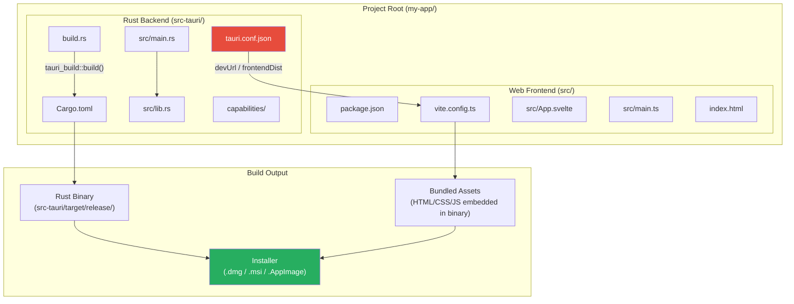
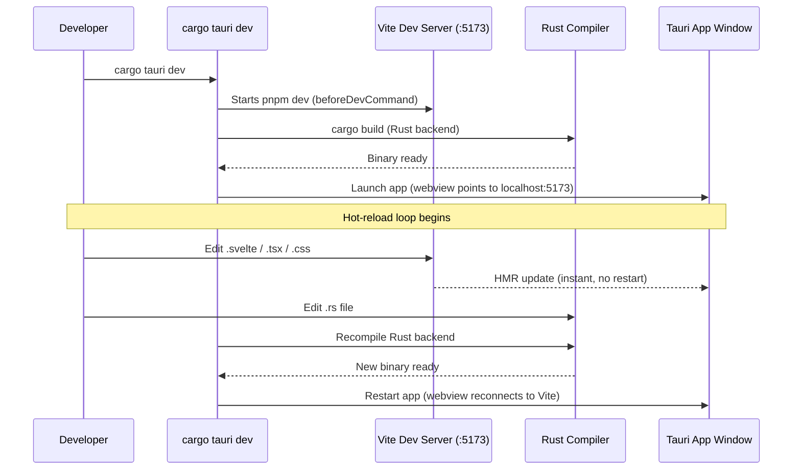

# 2. The Dual-Language Monorepo 🟡

> **What you'll learn:**
> - How a Tauri project is structured as a dual-language monorepo with a Rust backend (`src-tauri/`) and a web frontend (Vite/React/Svelte/Vue)
> - The role of `tauri.conf.json` as the bridge between `cargo` and your JS bundler
> - The development workflow: `cargo tauri dev` (hot-reload for both languages) and `cargo tauri build` (production bundles)
> - How to configure `Cargo.toml` dependencies and frontend build pipelines to work in harmony

---

## The Anatomy of a Tauri Project

A Tauri project is not a Rust project that happens to have some HTML. It is not a web project that happens to call some Rust. It is a **monorepo containing two distinct software projects** — a Rust backend and a web frontend — connected by a configuration file that tells Tauri how to orchestrate both.

Here is the complete directory structure of a production Tauri v2 application:

```
my-app/
├── src-tauri/                    # ← Rust backend (a standard Cargo project)
│   ├── Cargo.toml                #    Rust dependencies
│   ├── build.rs                  #    Tauri build script (code generation)
│   ├── tauri.conf.json           #    Tauri configuration (THE bridge file)
│   ├── capabilities/             #    Security permissions (v2)
│   │   └── default.json          #    Default capability set
│   ├── icons/                    #    App icons (all sizes, all platforms)
│   └── src/
│       ├── main.rs               #    Application entry point
│       └── lib.rs                #    Command handlers, state, plugins
│
├── src/                          # ← Web frontend (standard web project)
│   ├── App.svelte                #    Root component (or App.tsx, App.vue)
│   ├── main.ts                   #    Frontend entry point
│   ├── styles.css                #    Styles
│   └── lib/
│       └── api.ts                #    Typed wrappers around Tauri IPC
│
├── package.json                  #    Frontend dependencies (npm/pnpm)
├── pnpm-lock.yaml                #    Lock file
├── vite.config.ts                #    Vite bundler configuration
├── tsconfig.json                 #    TypeScript configuration
└── index.html                    #    HTML entry point (loaded by webview)
```



## Scaffolding a New Project

The fastest way to create a Tauri project is the `create-tauri-app` scaffolder:

```bash
# Using pnpm (recommended)
pnpm create tauri-app my-app

# You'll be prompted:
# ✔ Choose your package manager: pnpm
# ✔ Choose your UI template: Svelte
# ✔ Choose your UI flavor: TypeScript

cd my-app
pnpm install
```

This generates the entire dual-language structure. Let's examine the key files.

## The Bridge File: `tauri.conf.json`

This is the single most important file in a Tauri project. It tells the Tauri build system:
- Where to find your frontend build output
- What dev server URL to connect to during development
- What your app is called, what icons to use, what windows to create
- What security permissions to grant the webview

```json
{
  "$schema": "https://raw.githubusercontent.com/tauri-apps/tauri/dev/crates/tauri-cli/schema.json",
  "productName": "my-app",
  "version": "0.1.0",
  "identifier": "com.example.my-app",
  "build": {
    "beforeDevCommand": "pnpm dev",
    "devUrl": "http://localhost:5173",
    "beforeBuildCommand": "pnpm build",
    "frontendDist": "../dist"
  },
  "app": {
    "withGlobalTauri": false,
    "windows": [
      {
        "title": "My App",
        "width": 1024,
        "height": 768,
        "resizable": true,
        "fullscreen": false
      }
    ],
    "security": {
      "csp": "default-src 'self'; style-src 'self' 'unsafe-inline'"
    }
  },
  "bundle": {
    "active": true,
    "targets": "all",
    "icon": [
      "icons/32x32.png",
      "icons/128x128.png",
      "icons/128x128@2x.png",
      "icons/icon.icns",
      "icons/icon.ico"
    ]
  }
}
```

### The Critical Fields

| Field | Purpose | Dev vs Prod |
|-------|---------|-------------|
| `build.beforeDevCommand` | Starts your frontend dev server (`pnpm dev`) | Dev only |
| `build.devUrl` | URL of the frontend dev server (Vite default: `localhost:5173`) | Dev only |
| `build.beforeBuildCommand` | Builds your frontend for production (`pnpm build`) | Prod only |
| `build.frontendDist` | Path to built frontend assets (Vite default: `../dist`) | Prod only |
| `app.windows` | Initial window configuration (size, title, decorations) | Both |
| `app.security.csp` | Content Security Policy for the webview | Both |
| `bundle.targets` | Which platform installers to generate | Prod only |

**The key insight**: during development, the webview loads your UI from Vite's hot-reload dev server (`http://localhost:5173`). During production, the frontend is compiled to static assets, **embedded directly into the Rust binary**, and served from memory. There is no web server in production — the webview loads assets using Tauri's custom `tauri://` protocol.

## The Rust Backend: `src-tauri/`

### `Cargo.toml`

```toml
[package]
name = "my-app"
version = "0.1.0"
edition = "2021"

[build-dependencies]
tauri-build = { version = "2", features = [] }

[dependencies]
tauri = { version = "2", features = [] }
tauri-plugin-shell = "2"          # For opening URLs in browser
serde = { version = "1", features = ["derive"] }
serde_json = "1"
tokio = { version = "1", features = ["full"] }

[profile.release]
# ✅ Binary size optimization for desktop apps
strip = true          # Strip debug symbols
lto = true            # Link-Time Optimization
codegen-units = 1     # Single codegen unit for maximum optimization
opt-level = "s"       # Optimize for size (use "z" for aggressive)
panic = "abort"       # Remove unwinding machinery
```

### `build.rs`

```rust
fn main() {
    // This generates the Tauri runtime bindings at compile time.
    // It reads tauri.conf.json and generates code that embeds
    // your frontend assets into the binary.
    tauri_build::build();
}
```

### `src/main.rs`

```rust
// Prevents a console window from appearing on Windows in release mode.
// In debug mode, the console is useful for println! debugging.
#![cfg_attr(not(debug_assertions), windows_subsystem = "windows")]

fn main() {
    // ✅ The entry point. Tauri::Builder configures and launches the app.
    // generate_context!() reads tauri.conf.json at compile time.
    tauri::Builder::default()
        .plugin(tauri_plugin_shell::init())
        .run(tauri::generate_context!())
        .expect("error while running tauri application");
}
```

### `src/lib.rs` (optional but recommended)

```rust
use tauri::Manager;

/// All Tauri commands go here.
/// Separating them from main.rs keeps the code organized
/// and makes unit testing easier.

#[tauri::command]
fn greet(name: &str) -> String {
    format!("Hello, {}! Welcome to Tauri.", name)
}

/// Called from main.rs to register all commands and plugins.
pub fn run() {
    tauri::Builder::default()
        .plugin(tauri_plugin_shell::init())
        .invoke_handler(tauri::generate_handler![greet])
        .run(tauri::generate_context!())
        .expect("error while running tauri application");
}
```

## The Web Frontend

### `index.html`

```html
<!doctype html>
<html lang="en">
  <head>
    <meta charset="UTF-8" />
    <meta name="viewport" content="width=device-width, initial-scale=1.0" />
    <title>My App</title>
    <!-- ✅ CSP prevents loading external scripts in production -->
  </head>
  <body>
    <div id="app"></div>
    <script type="module" src="/src/main.ts"></script>
  </body>
</html>
```

### `src/main.ts` (Svelte example)

```typescript
import App from './App.svelte';

const app = new App({
  target: document.getElementById('app')!,
});

export default app;
```

### `src/App.svelte`

```svelte
<script lang="ts">
  import { invoke } from '@tauri-apps/api/core';

  let name = '';
  let greeting = '';

  async function greet() {
    // ✅ invoke() sends an IPC message to the Rust backend
    // and returns the result as a Promise
    greeting = await invoke('greet', { name });
  }
</script>

<main>
  <input bind:value={name} placeholder="Enter your name" />
  <button on:click={greet}>Greet</button>
  {#if greeting}
    <p>{greeting}</p>
  {/if}
</main>
```

## The Development Workflow

### `cargo tauri dev` — Hot-Reload Development



**What happens under the hood:**

1. Tauri CLI runs your `beforeDevCommand` (e.g., `pnpm dev`), which starts Vite on port 5173
2. Tauri CLI compiles the Rust backend with `cargo build`
3. The app launches: the webview loads `http://localhost:5173` (the Vite dev server)
4. **Frontend changes**: Vite's Hot Module Replacement (HMR) pushes updates to the webview *instantly* — no restart needed
5. **Backend changes**: Tauri CLI detects `.rs` file changes, recompiles, and restarts the app

### `cargo tauri build` — Production Build

```bash
cargo tauri build
```

This runs:
1. `beforeBuildCommand` (e.g., `pnpm build`) — compiles your frontend to `dist/`
2. `cargo build --release` — compiles the Rust backend in release mode
3. The Tauri bundler **embeds** the `dist/` assets into the Rust binary
4. Platform-specific installers are generated:
   - macOS: `.dmg` and `.app` bundle
   - Windows: `.msi` and `.exe` (NSIS)
   - Linux: `.AppImage`, `.deb`, `.rpm`

### Binary Size Optimization

The default release build is already small, but you can go further:

| Technique | `Cargo.toml` Setting | Size Impact |
|-----------|---------------------|-------------|
| Strip symbols | `strip = true` | −30–50% |
| Link-Time Optimization | `lto = true` | −10–20% |
| Single codegen unit | `codegen-units = 1` | −5–10% |
| Optimize for size | `opt-level = "s"` or `"z"` | −10–30% |
| Abort on panic | `panic = "abort"` | −5–10% |
| UPX compression (optional) | Post-build on binary | −50–60% |

With all optimizations, a non-trivial Tauri app compiles to **3–8 MB** (vs Electron's 150–250 MB).

## Bridging `cargo` and `pnpm`

The biggest challenge in a dual-language monorepo is managing two dependency ecosystems. Here are the key practices:

### Workspace Root `package.json`

```json
{
  "name": "my-app",
  "private": true,
  "scripts": {
    "dev": "vite",
    "build": "tsc && vite build",
    "preview": "vite preview",
    "tauri": "tauri"
  },
  "dependencies": {
    "@tauri-apps/api": "^2.0.0",
    "@tauri-apps/plugin-shell": "^2.0.0"
  },
  "devDependencies": {
    "@sveltejs/vite-plugin-svelte": "^4.0.0",
    "@tauri-apps/cli": "^2.0.0",
    "svelte": "^5.0.0",
    "typescript": "^5.6.0",
    "vite": "^6.0.0"
  }
}
```

### `vite.config.ts`

```typescript
import { defineConfig } from 'vite';
import { svelte } from '@sveltejs/vite-plugin-svelte';

export default defineConfig({
  plugins: [svelte()],
  
  // ✅ Prevent Vite from obscuring Rust error messages
  clearScreen: false,
  
  server: {
    // ✅ Must match devUrl in tauri.conf.json
    port: 5173,
    strictPort: true,
    
    // ✅ Watch for file changes in src-tauri for auto-reload
    watch: {
      ignored: ['**/src-tauri/**'],
    },
  },
  
  // ✅ Use relative paths for Tauri asset protocol in production
  base: './',
});
```

### Version Synchronization

Keep Tauri crate versions and `@tauri-apps/api` versions in sync:

| Rust Crate | npm Package | Must Match? |
|-----------|-------------|-------------|
| `tauri = "2.x"` | `@tauri-apps/api = "^2.x"` | Major version must match |
| `tauri-build = "2.x"` | `@tauri-apps/cli = "^2.x"` | Major version must match |
| `tauri-plugin-shell = "2.x"` | `@tauri-apps/plugin-shell = "^2.x"` | Major version must match |

**Rule of thumb:** If you upgrade `tauri` in `Cargo.toml`, upgrade `@tauri-apps/api` in `package.json` to the same major version.

---

<details>
<summary><strong>🏋️ Exercise: Scaffold and Explore</strong> (click to expand)</summary>

**Challenge:** Create a new Tauri v2 project from scratch and verify the complete build pipeline works on your machine.

1. Scaffold a new project with `pnpm create tauri-app exercise-app` (choose Svelte + TypeScript)
2. Run `cargo tauri dev` and verify hot-reload works for both frontend and backend changes
3. Add a `#[tauri::command]` called `add` that takes two `i32` parameters and returns their sum
4. Call this command from the Svelte frontend and display the result
5. Build for production with `cargo tauri build` and measure the final binary size
6. Compare the binary size to the Electron Hello World from Chapter 1's exercise

<details>
<summary>🔑 Solution</summary>

```bash
# Step 1: Scaffold the project
pnpm create tauri-app exercise-app
# Select: pnpm, Svelte, TypeScript
cd exercise-app
pnpm install
```

**Step 3: Add the Rust command** — edit `src-tauri/src/lib.rs`:

```rust
// ✅ A simple command that adds two numbers.
// The #[tauri::command] macro generates the IPC glue code.
// Parameters are automatically deserialized from the JS invoke() call.
#[tauri::command]
fn add(a: i32, b: i32) -> i32 {
    a + b
}

pub fn run() {
    tauri::Builder::default()
        .plugin(tauri_plugin_shell::init())
        // ✅ Register the command so JS can invoke it
        .invoke_handler(tauri::generate_handler![add])
        .run(tauri::generate_context!())
        .expect("error while running tauri application");
}
```

**Step 4: Call from Svelte** — edit `src/App.svelte`:

```svelte
<script lang="ts">
  import { invoke } from '@tauri-apps/api/core';

  let a = 0;
  let b = 0;
  let result: number | null = null;

  async function calculate() {
    // ✅ invoke() sends { a, b } to the Rust "add" command
    // and returns the i32 result as a JavaScript number
    result = await invoke<number>('add', { a, b });
  }
</script>

<main>
  <h1>Tauri Calculator</h1>
  <input type="number" bind:value={a} />
  <span> + </span>
  <input type="number" bind:value={b} />
  <button on:click={calculate}>Calculate</button>
  {#if result !== null}
    <p>Result: {result}</p>
  {/if}
</main>
```

**Step 5–6: Build and measure:**

```bash
cargo tauri build

# macOS:
ls -lh src-tauri/target/release/bundle/dmg/
# Expected: ~5-8 MB .dmg

# Compare line:
echo "Electron: ~150MB vs Tauri: ~6MB = 25x smaller"
```

</details>
</details>

---

> **Key Takeaways:**
> - A Tauri project is a dual-language monorepo: `src-tauri/` (Rust) + project root (web frontend), bridged by `tauri.conf.json`.
> - During development, the webview loads from a Vite dev server with hot-reload. In production, frontend assets are embedded directly into the Rust binary.
> - `cargo tauri dev` orchestrates both `pnpm dev` and `cargo build`, watching for changes in both languages.
> - Tauri Rust and JS packages must stay on matching major versions (`tauri = "2"` ↔ `@tauri-apps/api = "^2"`).
> - Release builds with proper `Cargo.toml` optimization flags produce 3–8 MB binaries — 20–50x smaller than Electron.

> **See also:**
> - [Chapter 3: Commands and Managed State](ch03-commands-and-managed-state.md) — writing Rust functions that the frontend can invoke
> - [Rust Engineering Practices](../engineering-book/src/SUMMARY.md) — CI/CD pipelines for cross-platform Tauri builds
> - [Chapter 1: Tauri Architecture](ch01-tauri-architecture.md) — the multi-process model this monorepo builds on
