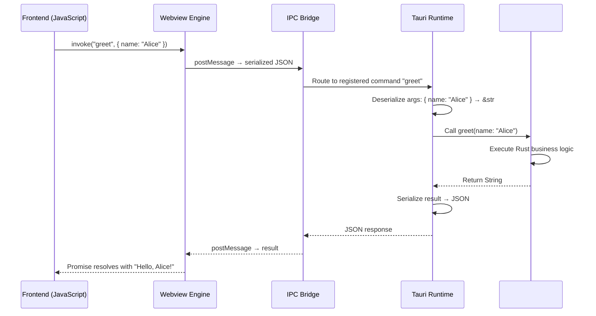
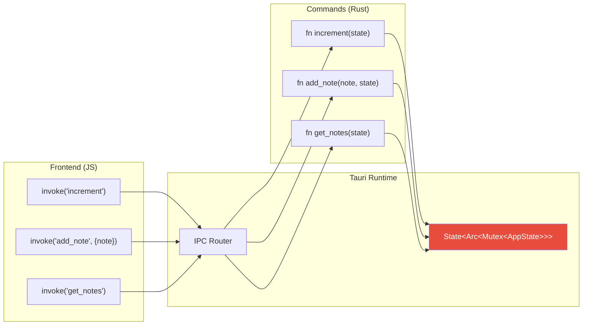

# 3. Commands and Managed State 🟡

> **What you'll learn:**
> - How `#[tauri::command]` generates IPC handler code and what happens under the hood when JavaScript calls `invoke()`
> - The complete type mapping between Rust return types and JavaScript values across the IPC boundary
> - How to manage shared backend state using `tauri::State<T>` and `Arc<Mutex<T>>` without data races
> - Common anti-patterns: blocking the main thread, unsynchronized state, and leaking interior mutability

---

## The IPC Lifecycle: What Happens When JS Calls Rust

When your frontend calls `invoke("my_command", { key: "value" })`, here is the exact sequence of operations:



**Key facts:**
1. All IPC is **asynchronous** — `invoke()` returns a `Promise` on the JS side
2. Arguments are serialized to JSON by the frontend, deserialized by `serde` on the Rust side
3. Return values are serialized to JSON by `serde` on the Rust side, deserialized by the frontend
4. Commands run on the **Tauri runtime thread pool**, not the main/UI thread (unless you explicitly block)

## Writing Commands

### Basic Command

```rust
// ✅ The #[tauri::command] attribute macro generates:
// 1. A wrapper function that deserializes JSON arguments
// 2. Serialization of the return value to JSON
// 3. Registration metadata for the IPC router

#[tauri::command]
fn greet(name: &str) -> String {
    format!("Hello, {}! Welcome to Tauri.", name)
}
```

```typescript
// Frontend: invoke returns Promise<string>
const message: string = await invoke<string>('greet', { name: 'Alice' });
// message === "Hello, Alice! Welcome to Tauri."
```

### Command Registration

Commands must be registered in the Tauri builder:

```rust
fn main() {
    tauri::Builder::default()
        // ✅ generate_handler! creates a vector of command handlers
        // Every command you write MUST be listed here, or JS invoke() will fail
        .invoke_handler(tauri::generate_handler![
            greet,
            add_numbers,
            get_system_info,
            save_file,
        ])
        .run(tauri::generate_context!())
        .expect("error while running tauri application");
}
```

**Forgetting to register a command is the #1 Tauri beginner mistake.** If `invoke()` returns an error like `"command not found"`, check this list first.

## Type Mapping Across the IPC Boundary

Every argument and return value must cross the JSON serialization boundary. Here is the complete type mapping:

### Rust → JavaScript (Return Types)

| Rust Type | JSON Serialization | JavaScript Type | Notes |
|-----------|-------------------|-----------------|-------|
| `String` / `&str` | `"string"` | `string` | Most common |
| `i32`, `i64`, `u32`, `u64` | `42` | `number` | JS loses precision above 2^53 |
| `f32`, `f64` | `3.14` | `number` | |
| `bool` | `true` / `false` | `boolean` | |
| `Vec<T>` | `[...]` | `Array<T>` | Elements must also be serializable |
| `HashMap<String, T>` | `{...}` | `Record<string, T>` | Keys must be strings |
| `Option<T>` | `value` or `null` | `T \| null` | |
| `()` (unit) | `null` | `null` | For side-effect commands |
| `Result<T, E>` | Success: `T`, Error: `E.to_string()` | Promise resolves/rejects | **Recommended** |
| Custom `struct` | `{field: value}` | `object` | Must derive `Serialize` |

### JavaScript → Rust (Argument Types)

| JavaScript Value | JSON | Rust Type | Notes |
|-----------------|------|-----------|-------|
| `"string"` | `"string"` | `String` or `&str` | Use `String` for owned, `&str` for borrowed |
| `42` | `42` | `i32`, `u32`, `i64`, `f64` | |
| `true` | `true` | `bool` | |
| `[1, 2, 3]` | `[1,2,3]` | `Vec<i32>` | |
| `{ key: "val" }` | `{"key":"val"}` | `HashMap<String, String>` or custom struct | |
| `null` | `null` | `Option<T>` | |

### Custom Structs Across IPC

```rust
use serde::{Deserialize, Serialize};

// ✅ Derive both Serialize (for return values) and Deserialize (for arguments)
#[derive(Serialize, Deserialize, Clone)]
pub struct UserProfile {
    pub name: String,
    pub email: String,
    pub age: u32,
    pub preferences: Vec<String>,
}

// ✅ Command that accepts and returns a complex struct
#[tauri::command]
fn update_profile(profile: UserProfile) -> UserProfile {
    // Business logic: validate, transform, persist
    UserProfile {
        name: profile.name.trim().to_string(),
        email: profile.email.to_lowercase(),
        age: profile.age,
        preferences: profile.preferences,
    }
}
```

```typescript
// Frontend: TypeScript interface mirrors the Rust struct
interface UserProfile {
  name: string;
  email: string;
  age: number;
  preferences: string[];
}

const updated = await invoke<UserProfile>('update_profile', {
  profile: {
    name: '  Alice  ',
    email: 'ALICE@EXAMPLE.COM',
    age: 30,
    preferences: ['dark-mode', 'vim-keys'],
  },
});
// updated.name === "Alice"
// updated.email === "alice@example.com"
```

## Error Handling Across IPC

Commands can return `Result<T, E>` to propagate errors to the frontend gracefully:

```rust
use serde::Serialize;

// ✅ Custom error type — must implement Serialize for IPC
#[derive(Debug, Serialize)]
pub enum AppError {
    NotFound(String),
    PermissionDenied(String),
    Internal(String),
}

// ✅ Required: impl Display so Tauri can convert to string for JS
impl std::fmt::Display for AppError {
    fn fmt(&self, f: &mut std::fmt::Formatter<'_>) -> std::fmt::Result {
        match self {
            AppError::NotFound(msg) => write!(f, "Not found: {msg}"),
            AppError::PermissionDenied(msg) => write!(f, "Permission denied: {msg}"),
            AppError::Internal(msg) => write!(f, "Internal error: {msg}"),
        }
    }
}

// ✅ Commands returning Result: Ok → Promise resolves, Err → Promise rejects
#[tauri::command]
fn read_config(path: String) -> Result<String, AppError> {
    std::fs::read_to_string(&path)
        .map_err(|e| AppError::NotFound(format!("{path}: {e}")))
}
```

```typescript
// Frontend: catch the error from the rejected Promise
try {
  const config = await invoke<string>('read_config', { path: '/etc/myapp.conf' });
  console.log('Config:', config);
} catch (error) {
  // error is the serialized AppError string
  console.error('Failed to read config:', error);
}
```

## Managed State: Sharing Data Across Commands

Most applications need shared state — a database connection pool, a configuration object, user session data, or an in-memory cache. Tauri provides `tauri::State<T>` for dependency-injected access to shared state.

### The Pattern

```rust
use std::sync::{Arc, Mutex};
use tauri::State;
use serde::{Deserialize, Serialize};

// ✅ Application state: wrapped in Arc<Mutex<T>> for thread-safe access
#[derive(Default, Serialize, Deserialize)]
pub struct AppState {
    pub counter: i64,
    pub notes: Vec<String>,
}

// ✅ Commands receive State<T> as a parameter — Tauri injects it automatically
#[tauri::command]
fn increment(state: State<'_, Arc<Mutex<AppState>>>) -> i64 {
    // ✅ Lock the mutex, modify state, return the new value
    let mut app_state = state.lock().expect("mutex poisoned");
    app_state.counter += 1;
    app_state.counter
}

#[tauri::command]
fn add_note(note: String, state: State<'_, Arc<Mutex<AppState>>>) -> Vec<String> {
    let mut app_state = state.lock().expect("mutex poisoned");
    app_state.notes.push(note);
    app_state.notes.clone()
}

#[tauri::command]
fn get_notes(state: State<'_, Arc<Mutex<AppState>>>) -> Vec<String> {
    let app_state = state.lock().expect("mutex poisoned");
    app_state.notes.clone()
}

fn main() {
    tauri::Builder::default()
        // ✅ Register the state — Tauri stores it and injects into commands
        .manage(Arc::new(Mutex::new(AppState::default())))
        .invoke_handler(tauri::generate_handler![increment, add_note, get_notes])
        .run(tauri::generate_context!())
        .expect("error while running tauri application");
}
```



### Why `Arc<Mutex<T>>`?

Commands may execute **concurrently** on different threads in the Tauri thread pool. Without synchronization, two concurrent commands could read/write the same state simultaneously, causing data races.

| Wrapper | Thread-safe? | Use Case |
|---------|-------------|----------|
| `T` (bare) | No | Read-only configuration set once at startup |
| `Mutex<T>` | Yes | Mutable state accessed by commands (single-threaded-only if not `Arc`) |
| `Arc<Mutex<T>>` | Yes | Mutable state shared across commands AND background tasks |
| `RwLock<T>` | Yes | Many-reader, single-writer state (e.g., config that rarely changes) |
| `tokio::sync::Mutex<T>` | Yes | State accessed in async commands that hold the lock across `.await` |

**The rule**: If your state is mutable and accessed by more than one command, use `Arc<Mutex<T>>` or `Arc<RwLock<T>>`. If you need to hold a lock across an `.await` point, use `tokio::sync::Mutex` instead of `std::sync::Mutex`.

## Anti-Pattern: Blocking the Main Thread

The most dangerous mistake in Tauri development is running blocking I/O inside a command without async:

```rust
// 💥 UI FREEZE: This command blocks the command thread for 5+ seconds
// while reading a large file. If all command threads are blocked,
// the IPC pipeline stalls and the UI becomes unresponsive.
#[tauri::command]
fn read_huge_file(path: String) -> Result<String, String> {
    // 💥 UI FREEZE: std::fs::read_to_string is a BLOCKING call
    // On a 500MB file, this blocks for seconds
    std::fs::read_to_string(&path).map_err(|e| e.to_string())
}
```

```rust
// ✅ FIX: Async Command & Tokio Spawn
// Mark the command as async so it runs on the Tokio runtime
// and uses non-blocking I/O
#[tauri::command]
async fn read_huge_file(path: String) -> Result<String, String> {
    // ✅ FIX: tokio::fs::read_to_string is non-blocking
    // It yields the thread while the OS performs the I/O
    tokio::fs::read_to_string(&path)
        .await
        .map_err(|e| e.to_string())
}
```

### Sync vs Async Commands

| Command Type | Runs On | Blocks Thread? | Use When |
|-------------|---------|---------------|----------|
| `fn command()` (sync) | Tauri thread pool | Yes (until return) | Fast, CPU-bound logic (<1ms) |
| `async fn command()` (async) | Tokio runtime | No (yields at `.await`) | Any I/O, network, or long computation |

**Rule of thumb**: If the command does *any* I/O (file, network, database, subprocess), make it `async`.

## Anti-Pattern: Forgetting `Serialize` on Error Types

```rust
// 💥 COMPILE ERROR: String implements Serialize, but this custom error
// type does not, so Tauri cannot send it back to JS
#[derive(Debug)]
pub struct MyError(String);

#[tauri::command]
fn failing_command() -> Result<String, MyError> {
    // 💥 This won't compile: MyError doesn't implement Serialize
    Err(MyError("something went wrong".to_string()))
}
```

```rust
// ✅ FIX: Either derive Serialize or convert to String
use serde::Serialize;

#[derive(Debug, Serialize)]
pub struct MyError(String);

impl std::fmt::Display for MyError {
    fn fmt(&self, f: &mut std::fmt::Formatter<'_>) -> std::fmt::Result {
        write!(f, "{}", self.0)
    }
}

#[tauri::command]
fn failing_command() -> Result<String, MyError> {
    // ✅ Now Tauri can serialize the error and send it to JS
    Err(MyError("something went wrong".to_string()))
}
```

## Advanced: Accessing the Tauri `AppHandle`

Some commands need access to the application itself — to emit events, manage windows, or access the Tauri plugin system. You can inject the `AppHandle`:

```rust
use tauri::{AppHandle, Manager};

#[tauri::command]
async fn set_title(app: AppHandle, title: String) -> Result<(), String> {
    // ✅ AppHandle gives access to all Tauri APIs
    let window = app.get_webview_window("main")
        .ok_or("Main window not found")?;
    
    window.set_title(&title).map_err(|e| e.to_string())?;
    Ok(())
}
```

The `AppHandle` is injected automatically — you don't pass it from JavaScript. Tauri recognizes the type signature and provides it.

### Injected Parameters (not from JS)

| Parameter Type | Injected By | Use Case |
|---------------|------------|----------|
| `State<'_, T>` | Tauri state manager | Access managed state |
| `AppHandle` | Tauri runtime | Emit events, manage windows, access plugins |
| `tauri::Window` | Tauri runtime | Access the calling window specifically |
| `tauri::Webview` | Tauri runtime | Access the calling webview |

These parameters are **invisible to JavaScript** — they are removed from the IPC signature. JS only sees the "regular" parameters.

---

<details>
<summary><strong>🏋️ Exercise: Build a Todo Backend</strong> (click to expand)</summary>

**Challenge:** Build a complete Todo backend with managed state that supports:

1. Adding a todo item (with title and completed status)
2. Listing all todos
3. Toggling a todo's completed status by ID
4. Deleting a todo by ID

Requirements:
- Use `Arc<Mutex<Vec<Todo>>>` as managed state
- Each todo has a `u64` ID (auto-increment), a `String` title, and a `bool` completed
- All commands return the current list of todos
- Use proper `Result` error handling

<details>
<summary>🔑 Solution</summary>

```rust
use serde::{Deserialize, Serialize};
use std::sync::{Arc, Mutex};
use tauri::State;

// ✅ Todo item — Serialize for returning to JS, Clone for state management
#[derive(Serialize, Deserialize, Clone)]
pub struct Todo {
    pub id: u64,
    pub title: String,
    pub completed: bool,
}

// ✅ App state: a list of todos and a counter for auto-incrementing IDs
#[derive(Default)]
pub struct TodoState {
    pub todos: Vec<Todo>,
    pub next_id: u64,
}

// ✅ Type alias for the managed state — keeps command signatures clean
type ManagedTodoState = Arc<Mutex<TodoState>>;

#[tauri::command]
fn add_todo(
    title: String,
    state: State<'_, ManagedTodoState>,
) -> Result<Vec<Todo>, String> {
    let mut s = state.lock().map_err(|e| e.to_string())?;
    let todo = Todo {
        id: s.next_id,
        title,
        completed: false,
    };
    s.next_id += 1;
    s.todos.push(todo);
    // ✅ Return the full list so the frontend can refresh
    Ok(s.todos.clone())
}

#[tauri::command]
fn list_todos(state: State<'_, ManagedTodoState>) -> Result<Vec<Todo>, String> {
    let s = state.lock().map_err(|e| e.to_string())?;
    Ok(s.todos.clone())
}

#[tauri::command]
fn toggle_todo(
    id: u64,
    state: State<'_, ManagedTodoState>,
) -> Result<Vec<Todo>, String> {
    let mut s = state.lock().map_err(|e| e.to_string())?;
    // ✅ Find the todo by ID and flip its completed status
    let todo = s.todos.iter_mut()
        .find(|t| t.id == id)
        .ok_or_else(|| format!("Todo with id {id} not found"))?;
    todo.completed = !todo.completed;
    Ok(s.todos.clone())
}

#[tauri::command]
fn delete_todo(
    id: u64,
    state: State<'_, ManagedTodoState>,
) -> Result<Vec<Todo>, String> {
    let mut s = state.lock().map_err(|e| e.to_string())?;
    let len_before = s.todos.len();
    // ✅ Retain all todos except the one with the given ID
    s.todos.retain(|t| t.id != id);
    if s.todos.len() == len_before {
        return Err(format!("Todo with id {id} not found"));
    }
    Ok(s.todos.clone())
}

fn main() {
    tauri::Builder::default()
        .manage(Arc::new(Mutex::new(TodoState::default())) as ManagedTodoState)
        .invoke_handler(tauri::generate_handler![
            add_todo,
            list_todos,
            toggle_todo,
            delete_todo,
        ])
        .run(tauri::generate_context!())
        .expect("error while running tauri application");
}
```

**Frontend (TypeScript):**

```typescript
import { invoke } from '@tauri-apps/api/core';

interface Todo {
  id: number;
  title: string;
  completed: boolean;
}

// ✅ Each command returns the full updated list
async function addTodo(title: string): Promise<Todo[]> {
  return invoke<Todo[]>('add_todo', { title });
}

async function listTodos(): Promise<Todo[]> {
  return invoke<Todo[]>('list_todos');
}

async function toggleTodo(id: number): Promise<Todo[]> {
  return invoke<Todo[]>('toggle_todo', { id });
}

async function deleteTodo(id: number): Promise<Todo[]> {
  return invoke<Todo[]>('delete_todo', { id });
}
```

</details>
</details>

---

> **Key Takeaways:**
> - `#[tauri::command]` generates IPC glue code that deserializes JSON arguments, calls your Rust function, and serializes the return value back to JSON.
> - All IPC data must implement `serde::Serialize` (return types) and/or `serde::Deserialize` (arguments). Custom error types must implement both `Serialize` and `Display`.
> - Use `tauri::State<Arc<Mutex<T>>>` for shared mutable state. Tauri injects it automatically into command parameters.
> - **Always use `async` commands** for any I/O operation. Blocking sync commands can freeze the IPC pipeline and make the UI unresponsive.
> - `AppHandle`, `State`, `Window`, and `Webview` are injected parameters — they don't appear in the JavaScript `invoke()` call.

> **See also:**
> - [Chapter 4: Bi-Directional Events and Async Streams](ch04-bidirectional-events.md) — sending data from Rust to JS without waiting for `invoke()`
> - [Concurrency in Rust](../concurrency-book/src/SUMMARY.md) — deep dive on `Arc`, `Mutex`, `RwLock` patterns
> - [Async Rust](../async-book/src/SUMMARY.md) — understanding the Tokio runtime that powers async commands
