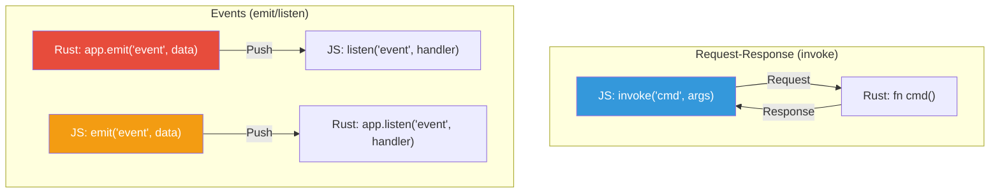
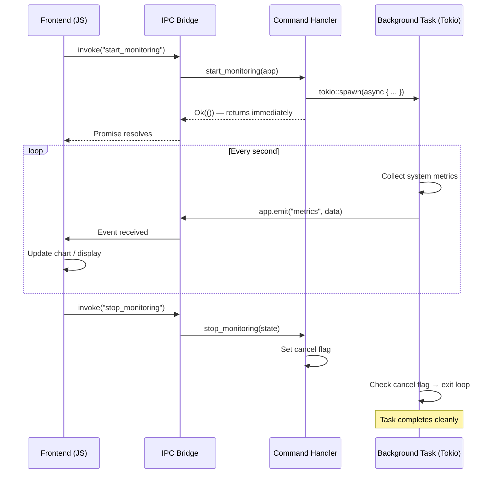

# 4. Bi-Directional Events and Async Streams 🔴

> **What you'll learn:**
> - How to emit events from Rust to JavaScript using `app.emit()` and targeted `window.emit()`, and why this is fundamentally different from the request-response `invoke()` pattern
> - How to listen for frontend events in Rust using `app.listen()` and bidirectional event channels
> - How to run long-running background tasks (file downloads, system monitoring, data processing) on Tokio threads while streaming progress updates to the UI without freezing
> - The ownership and lifetime challenges of moving `AppHandle` into spawned tasks, and how to solve them

---

## Two IPC Patterns: Request-Response vs Event-Driven

Chapter 3 covered the **request-response** pattern: JavaScript calls `invoke()`, Rust processes the request, and returns a result. This is perfect for one-shot operations: "read this file", "query this database", "compute this value."

But many desktop applications need the opposite direction: Rust needs to **push** data to JavaScript without being asked. Examples:

- A file download reporting progress (0%... 25%... 50%... 100%)
- A system monitor streaming CPU/RAM metrics every second
- A log viewer tailing a file and pushing new lines as they appear
- A background task completing and notifying the UI

For these, Tauri provides an **event system** — a publish-subscribe mechanism where either side can emit events and the other side can listen.



| Pattern | Direction | Initiator | Use Case |
|---------|-----------|-----------|----------|
| `invoke()` | JS → Rust → JS | JavaScript | One-shot commands with a return value |
| `app.emit()` | Rust → JS | Rust | Pushing data to the frontend (progress, metrics, notifications) |
| `listen()` (JS) | Receives from Rust | JavaScript | Reacting to backend events |
| `emit()` (JS) | JS → Rust | JavaScript | Sending UI events to the backend |
| `app.listen()` | Receives from JS | Rust | Reacting to frontend events |

## Emitting Events from Rust to JavaScript

### Global Events (All Windows)

```rust
use tauri::{AppHandle, Emitter, Manager};
use serde::Serialize;

#[derive(Clone, Serialize)]
struct DownloadProgress {
    url: String,
    bytes_downloaded: u64,
    total_bytes: u64,
    percent: f64,
}

#[tauri::command]
async fn start_download(app: AppHandle, url: String) -> Result<(), String> {
    // ✅ Spawn the download on a background Tokio task
    // so this command returns immediately and doesn't block IPC
    tokio::spawn(async move {
        let total = 100_000_000u64; // Example: 100MB file
        let mut downloaded = 0u64;
        let chunk_size = 1_000_000u64; // 1MB chunks

        while downloaded < total {
            // Simulate downloading a chunk
            tokio::time::sleep(std::time::Duration::from_millis(50)).await;
            downloaded += chunk_size;
            let downloaded = downloaded.min(total);

            // ✅ Emit progress event to ALL windows
            let _ = app.emit("download-progress", DownloadProgress {
                url: url.clone(),
                bytes_downloaded: downloaded,
                total_bytes: total,
                percent: (downloaded as f64 / total as f64) * 100.0,
            });
        }

        // ✅ Emit completion event
        let _ = app.emit("download-complete", url);
    });

    // ✅ Return immediately — the download runs in the background
    Ok(())
}
```

### Targeted Events (Specific Window)

```rust
use tauri::{Emitter, Manager, WebviewWindow};

#[tauri::command]
async fn notify_window(app: AppHandle, window_label: String, message: String) -> Result<(), String> {
    // ✅ Get a specific window by its label
    let window: WebviewWindow = app
        .get_webview_window(&window_label)
        .ok_or_else(|| format!("Window '{window_label}' not found"))?;
    
    // ✅ Emit only to this window — other windows won't receive it
    window.emit("notification", message)
        .map_err(|e| e.to_string())
}
```

### Listening in JavaScript

```typescript
import { listen } from '@tauri-apps/api/event';

interface DownloadProgress {
  url: string;
  bytes_downloaded: number;
  total_bytes: number;
  percent: number;
}

// ✅ listen() returns an unlisten function — call it to stop listening
const unlisten = await listen<DownloadProgress>('download-progress', (event) => {
  console.log(`Download: ${event.payload.percent.toFixed(1)}%`);
  updateProgressBar(event.payload.percent);
});

// ✅ Also listen for completion
const unlistenComplete = await listen<string>('download-complete', (event) => {
  console.log(`Download complete: ${event.payload}`);
  // Clean up listeners when done
  unlisten();
  unlistenComplete();
});

// ✅ Start the download (returns immediately)
await invoke('start_download', { url: 'https://example.com/big-file.zip' });
```

## Listening for Frontend Events in Rust

The event system is bidirectional. Rust can listen for events emitted by JavaScript:

```typescript
// Frontend: emit an event to Rust
import { emit } from '@tauri-apps/api/event';

// ✅ Emit a "user-action" event from JS to Rust
await emit('user-action', { action: 'pause', timestamp: Date.now() });
```

```rust
use tauri::{Listener, Manager};

fn main() {
    tauri::Builder::default()
        .setup(|app| {
            let app_handle = app.handle().clone();
            
            // ✅ Listen for events from the frontend
            app.listen("user-action", move |event| {
                // event.payload() is a JSON string
                println!("Received user action: {:?}", event.payload());
                
                // You can parse the payload and act on it
                if let Ok(action) = serde_json::from_str::<serde_json::Value>(event.payload()) {
                    if action["action"] == "pause" {
                        println!("User requested pause");
                        // Emit acknowledgment back
                        let _ = app_handle.emit("action-ack", "paused");
                    }
                }
            });

            Ok(())
        })
        .run(tauri::generate_context!())
        .expect("error while running tauri application");
}
```

## Long-Running Background Tasks

The most important pattern in Tauri development is running background work on Tokio threads while streaming results to the UI. Here's the complete lifecycle:



### The Pattern: Cancellable Background Task

```rust
use std::sync::atomic::{AtomicBool, Ordering};
use std::sync::Arc;
use tauri::{AppHandle, Emitter, Manager, State};
use serde::Serialize;

// ✅ A shared cancel flag — AtomicBool is lock-free and thread-safe
pub struct MonitorHandle {
    cancel: Arc<AtomicBool>,
}

#[derive(Clone, Serialize)]
struct SystemMetrics {
    cpu_percent: f64,
    memory_used_mb: u64,
    memory_total_mb: u64,
    timestamp: u64,
}

#[tauri::command]
async fn start_monitoring(
    app: AppHandle,
    state: State<'_, Arc<std::sync::Mutex<Option<MonitorHandle>>>>,
) -> Result<(), String> {
    let cancel = Arc::new(AtomicBool::new(false));
    
    // ✅ Store the cancel flag so stop_monitoring can access it
    {
        let mut handle = state.lock().map_err(|e| e.to_string())?;
        *handle = Some(MonitorHandle { cancel: cancel.clone() });
    }

    // ✅ Spawn the monitoring loop on a background Tokio task
    tokio::spawn(async move {
        let mut interval = tokio::time::interval(
            std::time::Duration::from_secs(1),
        );

        loop {
            interval.tick().await;

            // ✅ Check cancel flag — exit cleanly if requested
            if cancel.load(Ordering::Relaxed) {
                println!("Monitoring cancelled");
                break;
            }

            // Collect metrics (simplified — real implementation in Ch 7)
            let metrics = SystemMetrics {
                cpu_percent: 42.5,     // placeholder
                memory_used_mb: 8192,  // placeholder
                memory_total_mb: 16384,
                timestamp: std::time::SystemTime::now()
                    .duration_since(std::time::UNIX_EPOCH)
                    .unwrap_or_default()
                    .as_secs(),
            };

            // ✅ Push metrics to the frontend
            if app.emit("system-metrics", metrics).is_err() {
                // Window was closed — stop monitoring
                break;
            }
        }
    });

    Ok(())
}

#[tauri::command]
fn stop_monitoring(
    state: State<'_, Arc<std::sync::Mutex<Option<MonitorHandle>>>>,
) -> Result<(), String> {
    let handle = state.lock().map_err(|e| e.to_string())?;
    if let Some(ref h) = *handle {
        // ✅ Set the cancel flag — the background task will exit on next iteration
        h.cancel.store(true, Ordering::Relaxed);
    }
    Ok(())
}
```

### Ownership Challenge: Moving `AppHandle` into Spawned Tasks

A common error when trying to emit events from background tasks:

```rust
// 💥 COMPILE ERROR: `app` is moved into the first closure,
// so it can't be used in the second closure
#[tauri::command]
async fn broken_example(app: AppHandle) -> Result<(), String> {
    let app1 = app; // moved here
    
    tokio::spawn(async move {
        app1.emit("event1", "data1").ok();
    });

    // 💥 app is already moved!
    tokio::spawn(async move {
        app.emit("event2", "data2").ok();
    });

    Ok(())
}
```

```rust
// ✅ FIX: Clone the AppHandle before moving into spawned tasks
// AppHandle is cheap to clone (it's an Arc internally)
#[tauri::command]
async fn fixed_example(app: AppHandle) -> Result<(), String> {
    let app1 = app.clone(); // ✅ Clone for the first task
    let app2 = app;         // ✅ Move the original into the second task

    tokio::spawn(async move {
        app1.emit("event1", "data1").ok();
    });

    tokio::spawn(async move {
        app2.emit("event2", "data2").ok();
    });

    Ok(())
}
```

**Why cloning `AppHandle` is fine**: `AppHandle` is internally an `Arc<AppInner>` — cloning it increments a reference count. It does *not* duplicate any resources. This is the same pattern used throughout the Rust ecosystem for sharing runtime handles across tasks.

## Anti-Pattern: Emitting Too Fast

```rust
// 💥 UI FREEZE: Emitting thousands of events per second overwhelms
// the IPC bridge and the JavaScript event loop
async fn emit_too_fast(app: AppHandle) {
    loop {
        // 💥 No delay — sends events as fast as Rust can serialize them
        // The JS side can't keep up, events queue up, memory grows, UI freezes
        let _ = app.emit("data", generate_data());
    }
}
```

```rust
// ✅ FIX: Throttle emissions to a rate the frontend can handle
// 60 fps = 16ms between frames. Emitting faster than this is wasteful.
async fn emit_throttled(app: AppHandle) {
    // ✅ 60 updates per second — matches typical display refresh rate
    let mut interval = tokio::time::interval(
        std::time::Duration::from_millis(16),
    );

    loop {
        interval.tick().await;
        
        // ✅ Collect ALL data since last tick, emit as one batch
        let data = collect_recent_data();
        if app.emit("data-batch", data).is_err() {
            break; // Window closed
        }
    }
}
```

| Emission Rate | IPC Overhead | JS Processing | Result |
|--------------|-------------|---------------|--------|
| 1/sec | Negligible | Easy | Smooth but slow updates |
| 10/sec | Low | Easy | Good for dashboards |
| 60/sec | Moderate | Manageable | Smooth animations, ~16ms budget |
| 1000/sec | High | Struggling | Dropped frames, increasing latency |
| Unbounded | Overwhelming | Impossible | UI freeze, memory leak |

## Channels: High-Performance Streaming

For the highest throughput with backpressure, Tauri v2 provides **channels** — a dedicated streaming primitive:

```rust
use tauri::ipc::Channel;
use serde::Serialize;

#[derive(Clone, Serialize)]
#[serde(rename_all = "camelCase", tag = "event", content = "data")]
enum ProgressEvent {
    #[serde(rename_all = "camelCase")]
    Started { total_size: u64 },
    #[serde(rename_all = "camelCase")]
    Progress { bytes_read: u64, total_size: u64 },
    Finished,
}

// ✅ Channel<T> provides a typed, high-performance streaming pipe
// It's more efficient than app.emit() for high-frequency data
#[tauri::command]
async fn download_with_progress(
    url: String,
    on_progress: Channel<ProgressEvent>,
) -> Result<(), String> {
    let total_size = 100_000_000u64;
    
    // ✅ Send the "started" event
    on_progress.send(ProgressEvent::Started { total_size })
        .map_err(|e| e.to_string())?;

    let mut bytes_read = 0u64;
    let chunk = 1_000_000u64;

    while bytes_read < total_size {
        tokio::time::sleep(std::time::Duration::from_millis(10)).await;
        bytes_read = (bytes_read + chunk).min(total_size);
        
        // ✅ Stream progress updates through the channel
        on_progress.send(ProgressEvent::Progress {
            bytes_read,
            total_size,
        }).map_err(|e| e.to_string())?;
    }

    on_progress.send(ProgressEvent::Finished)
        .map_err(|e| e.to_string())?;

    Ok(())
}
```

```typescript
import { invoke, Channel } from '@tauri-apps/api/core';

interface ProgressStarted {
  event: 'Started';
  data: { totalSize: number };
}

interface ProgressUpdate {
  event: 'Progress';
  data: { bytesRead: number; totalSize: number };
}

interface ProgressFinished {
  event: 'Finished';
}

type ProgressEvent = ProgressStarted | ProgressUpdate | ProgressFinished;

// ✅ Create a typed channel that receives progress events
const onProgress = new Channel<ProgressEvent>();

onProgress.onmessage = (event) => {
  switch (event.event) {
    case 'Started':
      console.log(`Download started: ${event.data.totalSize} bytes`);
      break;
    case 'Progress':
      const pct = (event.data.bytesRead / event.data.totalSize * 100).toFixed(1);
      console.log(`Progress: ${pct}%`);
      break;
    case 'Finished':
      console.log('Download complete!');
      break;
  }
};

// ✅ Pass the channel as a command argument
await invoke('download_with_progress', {
  url: 'https://example.com/file.zip',
  onProgress,
});
```

---

<details>
<summary><strong>🏋️ Exercise: Build a File Watcher</strong> (click to expand)</summary>

**Challenge:** Build a Tauri command that watches a directory for file changes and streams notifications to the frontend in real-time.

Requirements:
1. A `start_watching` command that accepts a directory path and starts monitoring it
2. A `stop_watching` command that cancels the watcher
3. Emit `"file-changed"` events with the file path, change type (created/modified/deleted), and timestamp
4. The frontend displays a live-updating list of recent file changes
5. Use the `notify` crate for filesystem watching

Bonus: Debounce rapid changes (e.g., an IDE saving a file generates multiple events within milliseconds).

<details>
<summary>🔑 Solution</summary>

**`Cargo.toml` additions:**

```toml
[dependencies]
notify = "7"
```

**Rust backend:**

```rust
use notify::{Config, Event, RecommendedWatcher, RecursiveMode, Watcher};
use serde::Serialize;
use std::path::PathBuf;
use std::sync::{Arc, Mutex};
use tauri::{AppHandle, Emitter, State};

#[derive(Clone, Serialize)]
pub struct FileChange {
    pub path: String,
    pub kind: String,       // "created", "modified", "deleted", "other"
    pub timestamp: u64,
}

// ✅ Store the watcher in managed state so we can drop it to stop watching
pub struct WatcherState {
    watcher: Option<RecommendedWatcher>,
}

impl Default for WatcherState {
    fn default() -> Self {
        Self { watcher: None }
    }
}

fn event_kind_to_string(kind: &notify::EventKind) -> &'static str {
    use notify::EventKind;
    match kind {
        EventKind::Create(_) => "created",
        EventKind::Modify(_) => "modified",
        EventKind::Remove(_) => "deleted",
        _ => "other",
    }
}

#[tauri::command]
fn start_watching(
    path: String,
    app: AppHandle,
    state: State<'_, Arc<Mutex<WatcherState>>>,
) -> Result<(), String> {
    let watch_path = PathBuf::from(&path);
    if !watch_path.is_dir() {
        return Err(format!("{path} is not a directory"));
    }

    // ✅ Create a filesystem watcher that emits Tauri events on changes
    let app_clone = app.clone();
    let mut watcher = RecommendedWatcher::new(
        move |res: Result<Event, notify::Error>| {
            if let Ok(event) = res {
                let kind = event_kind_to_string(&event.kind);
                for path in &event.paths {
                    let change = FileChange {
                        path: path.display().to_string(),
                        kind: kind.to_string(),
                        timestamp: std::time::SystemTime::now()
                            .duration_since(std::time::UNIX_EPOCH)
                            .unwrap_or_default()
                            .as_secs(),
                    };
                    // ✅ Emit to all windows
                    let _ = app_clone.emit("file-changed", change);
                }
            }
        },
        Config::default(),
    ).map_err(|e| e.to_string())?;

    // ✅ Start watching the directory recursively
    watcher.watch(&watch_path, RecursiveMode::Recursive)
        .map_err(|e| e.to_string())?;

    // ✅ Store the watcher so it stays alive (and we can stop it later)
    let mut ws = state.lock().map_err(|e| e.to_string())?;
    ws.watcher = Some(watcher);

    Ok(())
}

#[tauri::command]
fn stop_watching(
    state: State<'_, Arc<Mutex<WatcherState>>>,
) -> Result<(), String> {
    let mut ws = state.lock().map_err(|e| e.to_string())?;
    // ✅ Dropping the watcher stops all filesystem monitoring
    ws.watcher = None;
    Ok(())
}
```

**Frontend (TypeScript):**

```typescript
import { invoke } from '@tauri-apps/api/core';
import { listen, type UnlistenFn } from '@tauri-apps/api/event';

interface FileChange {
  path: string;
  kind: string;
  timestamp: number;
}

let unlisten: UnlistenFn | null = null;
const changes: FileChange[] = [];

async function startWatching(directory: string) {
  // ✅ First set up the listener, then start watching
  unlisten = await listen<FileChange>('file-changed', (event) => {
    changes.unshift(event.payload); // newest first
    // Keep only the last 100 changes to avoid memory growth
    if (changes.length > 100) changes.pop();
    renderChanges(changes);
  });

  await invoke('start_watching', { path: directory });
}

async function stopWatching() {
  await invoke('stop_watching');
  if (unlisten) {
    unlisten();
    unlisten = null;
  }
}

function renderChanges(changes: FileChange[]) {
  const list = document.getElementById('changes-list')!;
  list.innerHTML = changes
    .map(c => `<li>[${c.kind}] ${c.path} at ${new Date(c.timestamp * 1000).toLocaleTimeString()}</li>`)
    .join('');
}
```

</details>
</details>

---

> **Key Takeaways:**
> - Tauri has two IPC patterns: **request-response** (`invoke()`) for one-shot commands, and **events** (`emit()`/`listen()`) for push-based streaming from Rust to JavaScript.
> - Use `tokio::spawn` to run long background tasks, passing a cloned `AppHandle` to emit events from the spawned future. `AppHandle` is cheap to clone (it's an `Arc`).
> - Always throttle event emissions to a rate the frontend can handle — 60 events/sec (16ms interval) is the practical maximum for smooth UI updates.
> - Use `AtomicBool` cancel flags to cleanly stop background tasks. Use `Channel<T>` for typed, high-performance streaming with backpressure.
> - The event system is bidirectional: JS can emit events that Rust listens for via `app.listen()`, enabling full duplex communication.

> **See also:**
> - [Chapter 3: Commands and Managed State](ch03-commands-and-managed-state.md) — the request-response IPC pattern
> - [Chapter 7: Capstone System Monitor](ch07-capstone-system-monitor.md) — applying these patterns to stream real-time system metrics
> - [Async Rust](../async-book/src/SUMMARY.md) — Tokio task spawning, cancellation, and backpressure
