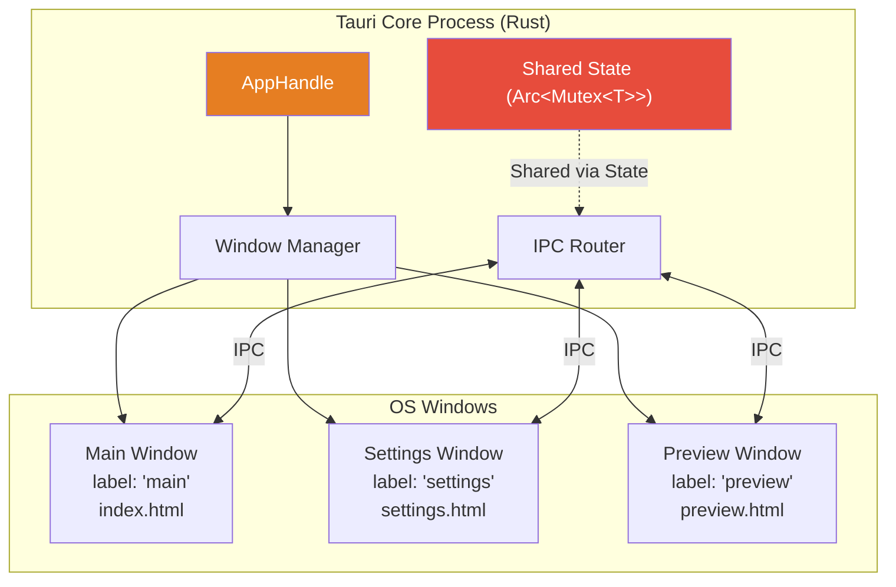
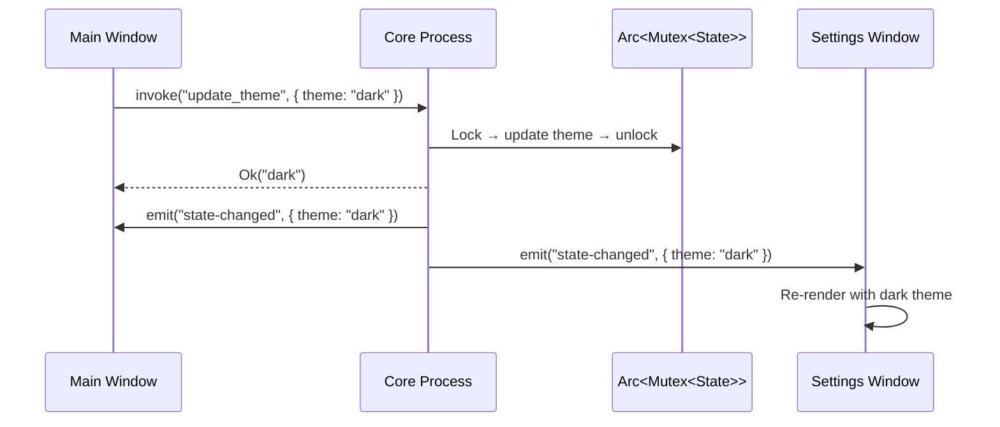

# 5. Window Management and System Integration 🟡

> **What you'll learn:**
> - How to create, manage, and destroy multiple windows from Rust — each with independent webview content and state
> - How to build frameless windows with custom titlebars, including drag regions and platform-specific styling
> - How to integrate with OS-level features: system tray icons, desktop notifications, and global keyboard shortcuts
> - The multi-window state synchronization challenge and how to solve it with Tauri's event system

---

## Multi-Window Architecture

Unlike web apps (which live in browser tabs), desktop apps frequently need multiple windows: a main editor, a preferences panel, a detached preview, a floating palette. Tauri gives you fine-grained control over window creation and destruction from Rust.



### Creating Windows from Rust

```rust
use tauri::{AppHandle, Manager, WebviewUrl, WebviewWindowBuilder};

#[tauri::command]
async fn open_settings(app: AppHandle) -> Result<(), String> {
    // ✅ Check if the window already exists (prevent duplicates)
    if app.get_webview_window("settings").is_some() {
        // Focus the existing window instead of creating a new one
        let win = app.get_webview_window("settings").unwrap();
        win.set_focus().map_err(|e| e.to_string())?;
        return Ok(());
    }

    // ✅ Create a new window with a unique label
    WebviewWindowBuilder::new(
        &app,
        "settings",                           // Unique label for this window
        WebviewUrl::App("/settings".into()),  // Loads settings route
    )
    .title("Settings")
    .inner_size(600.0, 400.0)
    .resizable(false)
    .center()
    .build()
    .map_err(|e| e.to_string())?;

    Ok(())
}

#[tauri::command]
async fn open_preview(app: AppHandle, content: String) -> Result<(), String> {
    let preview_window = WebviewWindowBuilder::new(
        &app,
        "preview",
        WebviewUrl::App("/preview".into()),
    )
    .title("Preview")
    .inner_size(800.0, 600.0)
    .build()
    .map_err(|e| e.to_string())?;

    // ✅ Send initial data to the new window via events
    // The window listens for this event on load
    preview_window.emit("preview-content", content)
        .map_err(|e| e.to_string())?;

    Ok(())
}
```

### Window Configuration Options

| Option | Method | Default | Description |
|--------|--------|---------|-------------|
| Title | `.title("My Window")` | App name | Window title bar text |
| Size | `.inner_size(800.0, 600.0)` | 800×600 | Initial width × height in logical pixels |
| Min size | `.min_inner_size(400.0, 300.0)` | None | Minimum resize dimensions |
| Position | `.position(100.0, 100.0)` | OS default | Initial x, y position |
| Center | `.center()` | No | Center on screen |
| Resizable | `.resizable(false)` | `true` | Allow user resizing |
| Decorations | `.decorations(false)` | `true` | Show OS title bar and borders |
| Transparent | `.transparent(true)` | `false` | Transparent window background |
| Always on top | `.always_on_top(true)` | `false` | Float above other windows |
| Skip taskbar | `.skip_taskbar(true)` | `false` | Hide from taskbar/dock |
| Visible | `.visible(false)` | `true` | Start hidden (show later) |

### Closing and Destroying Windows

```rust
#[tauri::command]
async fn close_settings(app: AppHandle) -> Result<(), String> {
    if let Some(window) = app.get_webview_window("settings") {
        // ✅ close() destroys the window and its webview
        window.close().map_err(|e| e.to_string())?;
    }
    Ok(())
}
```

## Frameless Windows with Custom Titlebars

Frameless (undecorated) windows remove the OS title bar and window controls, letting you draw a completely custom UI. This is how apps like Spotify, VS Code, and 1Password achieve their distinctive look.

### Creating a Frameless Window

```rust
WebviewWindowBuilder::new(&app, "main", WebviewUrl::App("/".into()))
    .title("My Custom App")
    .decorations(false)       // ✅ Remove OS title bar
    .transparent(true)         // ✅ Allow transparent background
    .inner_size(1024.0, 768.0)
    .build()
    .map_err(|e| e.to_string())?;
```

### Custom Titlebar HTML/CSS

When you remove decorations, you must implement your own title bar — including drag-to-move, minimize, maximize, and close buttons:

```html
<!-- Custom titlebar that replaces the OS title bar -->
<div class="titlebar" data-tauri-drag-region>
  <!-- data-tauri-drag-region makes this area draggable like a real title bar -->
  <div class="titlebar-title">My Custom App</div>
  <div class="titlebar-buttons">
    <button class="titlebar-btn" id="minimize">─</button>
    <button class="titlebar-btn" id="maximize">□</button>
    <button class="titlebar-btn close" id="close">✕</button>
  </div>
</div>

<style>
  .titlebar {
    height: 32px;
    display: flex;
    align-items: center;
    justify-content: space-between;
    padding: 0 8px;
    background: #1e1e1e;
    color: #cccccc;
    /* ✅ data-tauri-drag-region handles drag — cursor indicates it */
    cursor: default;
    user-select: none;
    -webkit-app-region: drag; /* Backup for some webview versions */
  }

  .titlebar-buttons {
    display: flex;
    -webkit-app-region: no-drag; /* Buttons must be clickable, not draggable */
  }

  .titlebar-btn {
    width: 46px;
    height: 32px;
    border: none;
    background: transparent;
    color: #cccccc;
    font-size: 12px;
    cursor: pointer;
  }

  .titlebar-btn:hover { background: #333; }
  .titlebar-btn.close:hover { background: #e81123; color: white; }
</style>
```

```typescript
import { getCurrentWindow } from '@tauri-apps/api/window';

const appWindow = getCurrentWindow();

// ✅ Wire up the window control buttons
document.getElementById('minimize')!.addEventListener('click', () => {
  appWindow.minimize();
});

document.getElementById('maximize')!.addEventListener('click', async () => {
  const isMaximized = await appWindow.isMaximized();
  if (isMaximized) {
    appWindow.unmaximize();
  } else {
    appWindow.maximize();
  }
});

document.getElementById('close')!.addEventListener('click', () => {
  appWindow.close();
});
```

### Platform-Specific Considerations

| Feature | macOS | Windows | Linux |
|---------|-------|---------|-------|
| Traffic lights (close/min/max) | Top-left by default | Top-right by default | Top-right by default |
| `data-tauri-drag-region` | ✅ Works | ✅ Works | ✅ Works |
| Rounded corners | Native (Ventura+) | Native (Windows 11) | Depends on compositor |
| Transparent windows | Full support | Full support | Requires compositor |
| Native shadows on frameless | Requires `decorations: true` with hidden titlebar | Works with `decorations: false` | Varies |

**macOS tip:** On macOS, you can keep the native traffic light buttons while hiding the rest of the titlebar:

```rust
// macOS-only: hide titlebar but keep traffic lights
WebviewWindowBuilder::new(&app, "main", WebviewUrl::App("/".into()))
    .title_bar_style(tauri::TitleBarStyle::Overlay)  
    .hidden_title(true)
    .build()
    .map_err(|e| e.to_string())?;
```

## System Tray

System tray icons (menu bar on macOS, system tray on Windows/Linux) let your app run in the background and provide quick-access actions.

```rust
use tauri::{
    menu::{Menu, MenuItem},
    tray::TrayIconBuilder,
    AppHandle, Emitter, Manager,
};

fn setup_tray(app: &AppHandle) -> Result<(), Box<dyn std::error::Error>> {
    let show = MenuItem::with_id(app, "show", "Show Window", true, None::<&str>)?;
    let pause = MenuItem::with_id(app, "pause", "Pause Monitoring", true, None::<&str>)?;
    let quit = MenuItem::with_id(app, "quit", "Quit", true, None::<&str>)?;

    let menu = Menu::with_items(app, &[&show, &pause, &quit])?;

    TrayIconBuilder::new()
        .icon(app.default_window_icon().cloned().expect("no icon"))
        .menu(&menu)
        .tooltip("System Monitor")
        .on_menu_event(move |app, event| {
            match event.id.as_ref() {
                "show" => {
                    // ✅ Show and focus the main window
                    if let Some(win) = app.get_webview_window("main") {
                        let _ = win.show();
                        let _ = win.set_focus();
                    }
                }
                "pause" => {
                    // ✅ Emit an event so the monitoring system can pause
                    let _ = app.emit("tray-action", "pause");
                }
                "quit" => {
                    // ✅ Clean exit
                    app.exit(0);
                }
                _ => {}
            }
        })
        .build(app)?;

    Ok(())
}

fn main() {
    tauri::Builder::default()
        .setup(|app| {
            // ✅ Set up the tray icon during app initialization
            setup_tray(app.handle())?;
            Ok(())
        })
        .run(tauri::generate_context!())
        .expect("error while running tauri application");
}
```

### Hiding to Tray Instead of Quitting

Desktop apps commonly "close to tray" — hiding the window instead of quitting when the user clicks the close button:

```rust
use tauri::Manager;

fn main() {
    tauri::Builder::default()
        .setup(|app| {
            setup_tray(app.handle())?;
            
            // ✅ Intercept window close: hide instead of quit
            let main_window = app.get_webview_window("main")
                .expect("main window not found");
            
            main_window.on_window_event(move |event| {
                if let tauri::WindowEvent::CloseRequested { api, .. } = event {
                    // ✅ Prevent the window from actually closing
                    api.prevent_close();
                    // Instead, hide it (tray "Show" will bring it back)
                    let _ = main_window.hide();
                }
            });

            Ok(())
        })
        .run(tauri::generate_context!())
        .expect("error while running tauri application");
}
```

## Desktop Notifications

```rust
use tauri_plugin_notification::NotificationExt;

#[tauri::command]
async fn send_notification(
    app: AppHandle,
    title: String,
    body: String,
) -> Result<(), String> {
    app.notification()
        .builder()
        .title(&title)
        .body(&body)
        .show()
        .map_err(|e| e.to_string())?;
    Ok(())
}
```

Add the plugin to `Cargo.toml`:
```toml
[dependencies]
tauri-plugin-notification = "2"
```

And register it:
```rust
tauri::Builder::default()
    .plugin(tauri_plugin_notification::init())
    // ...
```

## Global Keyboard Shortcuts

Global shortcuts work even when your app is not focused — useful for media controls, screenshot tools, or quick-launch functionality:

```rust
use tauri_plugin_global_shortcut::{
    GlobalShortcutExt, Shortcut, ShortcutState,
};
use tauri::{AppHandle, Emitter, Manager};

fn setup_shortcuts(app: &AppHandle) -> Result<(), Box<dyn std::error::Error>> {
    // ✅ Register a global shortcut: Cmd+Shift+M (macOS) / Ctrl+Shift+M (Win/Linux)
    let shortcut: Shortcut = "CmdOrCtrl+Shift+M".parse()?;
    
    app.global_shortcut().on_shortcut(
        shortcut,
        move |app, _shortcut, event| {
            if event.state == ShortcutState::Pressed {
                // ✅ Toggle main window visibility
                if let Some(win) = app.get_webview_window("main") {
                    if win.is_visible().unwrap_or(false) {
                        let _ = win.hide();
                    } else {
                        let _ = win.show();
                        let _ = win.set_focus();
                    }
                }
            }
        },
    )?;

    Ok(())
}
```

Add the plugin:
```toml
[dependencies]
tauri-plugin-global-shortcut = "2"
```

## Multi-Window State Synchronization

When multiple windows share the same backend state, changes in one window must be reflected in others. The pattern: **update state, then emit an event to all windows**.



```rust
use tauri::{AppHandle, Emitter, Manager, State};
use std::sync::{Arc, Mutex};
use serde::{Deserialize, Serialize};

#[derive(Default, Clone, Serialize, Deserialize)]
struct AppConfig {
    theme: String,
    font_size: u32,
    sidebar_visible: bool,
}

#[tauri::command]
fn update_config(
    key: String,
    value: serde_json::Value,
    state: State<'_, Arc<Mutex<AppConfig>>>,
    app: AppHandle,
) -> Result<AppConfig, String> {
    let mut config = state.lock().map_err(|e| e.to_string())?;

    // ✅ Update the specific field
    match key.as_str() {
        "theme" => config.theme = value.as_str().unwrap_or("light").to_string(),
        "font_size" => config.font_size = value.as_u64().unwrap_or(14) as u32,
        "sidebar_visible" => config.sidebar_visible = value.as_bool().unwrap_or(true),
        _ => return Err(format!("Unknown config key: {key}")),
    }

    let updated = config.clone();

    // ✅ Notify ALL windows about the state change
    let _ = app.emit("config-changed", &updated);

    Ok(updated)
}
```

---

<details>
<summary><strong>🏋️ Exercise: Multi-Window Notes App</strong> (click to expand)</summary>

**Challenge:** Build a multi-window notes application:

1. The main window shows a list of note titles
2. Double-clicking a note title opens it in a **new window** for editing
3. Changes saved in the editor window are reflected immediately in the main list
4. Each editor window has a custom frameless titlebar showing the note title
5. A system tray icon provides "New Note" and "Quit" menu items

<details>
<summary>🔑 Solution</summary>

```rust
use serde::{Deserialize, Serialize};
use std::sync::{Arc, Mutex};
use tauri::{
    menu::{Menu, MenuItem},
    tray::TrayIconBuilder,
    AppHandle, Emitter, Manager, State,
    WebviewUrl, WebviewWindowBuilder,
};

#[derive(Clone, Serialize, Deserialize)]
struct Note {
    id: u64,
    title: String,
    content: String,
}

#[derive(Default)]
struct NotesState {
    notes: Vec<Note>,
    next_id: u64,
}

type ManagedNotes = Arc<Mutex<NotesState>>;

// ✅ Create a new note and notify all windows
#[tauri::command]
fn create_note(
    title: String,
    state: State<'_, ManagedNotes>,
    app: AppHandle,
) -> Result<Vec<Note>, String> {
    let mut s = state.lock().map_err(|e| e.to_string())?;
    let note = Note {
        id: s.next_id,
        title,
        content: String::new(),
    };
    s.next_id += 1;
    s.notes.push(note);
    let notes = s.notes.clone();

    // ✅ Emit to all windows so the main list refreshes
    let _ = app.emit("notes-updated", &notes);
    Ok(notes)
}

// ✅ Open a note in a new editor window
#[tauri::command]
async fn open_note_editor(
    id: u64,
    state: State<'_, ManagedNotes>,
    app: AppHandle,
) -> Result<(), String> {
    let label = format!("editor-{id}");

    // ✅ If editor already open, just focus it
    if let Some(win) = app.get_webview_window(&label) {
        win.set_focus().map_err(|e| e.to_string())?;
        return Ok(());
    }

    let note = {
        let s = state.lock().map_err(|e| e.to_string())?;
        s.notes.iter().find(|n| n.id == id).cloned()
            .ok_or_else(|| format!("Note {id} not found"))?
    };

    // ✅ Create a frameless editor window
    let editor = WebviewWindowBuilder::new(
        &app,
        &label,
        WebviewUrl::App(format!("/editor/{id}").into()),
    )
    .title(&note.title)
    .decorations(false)
    .inner_size(600.0, 500.0)
    .center()
    .build()
    .map_err(|e| e.to_string())?;

    // ✅ Send the note content to the new window
    editor.emit("load-note", &note).map_err(|e| e.to_string())?;

    Ok(())
}

// ✅ Save note content and sync across all windows
#[tauri::command]
fn save_note(
    id: u64,
    content: String,
    state: State<'_, ManagedNotes>,
    app: AppHandle,
) -> Result<(), String> {
    let mut s = state.lock().map_err(|e| e.to_string())?;
    let note = s.notes.iter_mut()
        .find(|n| n.id == id)
        .ok_or_else(|| format!("Note {id} not found"))?;
    note.content = content;

    let notes = s.notes.clone();
    // ✅ All windows (including main list) receive the update
    let _ = app.emit("notes-updated", &notes);
    Ok(())
}

fn main() {
    tauri::Builder::default()
        .manage(Arc::new(Mutex::new(NotesState::default())) as ManagedNotes)
        .setup(|app| {
            // ✅ System tray setup
            let new_note = MenuItem::with_id(
                app, "new_note", "New Note", true, None::<&str>,
            )?;
            let quit = MenuItem::with_id(
                app, "quit", "Quit", true, None::<&str>,
            )?;
            let menu = Menu::with_items(app, &[&new_note, &quit])?;

            TrayIconBuilder::new()
                .icon(app.default_window_icon().cloned().expect("icon"))
                .menu(&menu)
                .on_menu_event(|app, event| {
                    match event.id.as_ref() {
                        "new_note" => {
                            let _ = app.emit("tray-new-note", ());
                        }
                        "quit" => app.exit(0),
                        _ => {}
                    }
                })
                .build(app)?;

            Ok(())
        })
        .invoke_handler(tauri::generate_handler![
            create_note,
            open_note_editor,
            save_note,
        ])
        .run(tauri::generate_context!())
        .expect("error while running tauri application");
}
```

</details>
</details>

---

> **Key Takeaways:**
> - Tauri windows are created from Rust using `WebviewWindowBuilder` with unique labels. Always check for existing windows before creating duplicates.
> - Frameless windows (`decorations: false`) require custom titlebars with `data-tauri-drag-region` for dragging and manual minimize/maximize/close buttons.
> - System trays, notifications, and global shortcuts are provided via Tauri plugins and enable background-running, always-available desktop experiences.
> - Multi-window state synchronization follows the pattern: update shared state → emit event to all windows → each window re-renders.
> - Platform differences exist (macOS traffic lights, Linux compositor requirements), but Tauri abstracts most of them.

> **See also:**
> - [Chapter 6: Security and the Capabilities Model](ch06-security-capabilities.md) — restricting what each window can do
> - [Chapter 7: Capstone System Monitor](ch07-capstone-system-monitor.md) — frameless transparent window as desktop widget
> - [Chapter 4: Bi-Directional Events](ch04-bidirectional-events.md) — the event system used for multi-window sync
