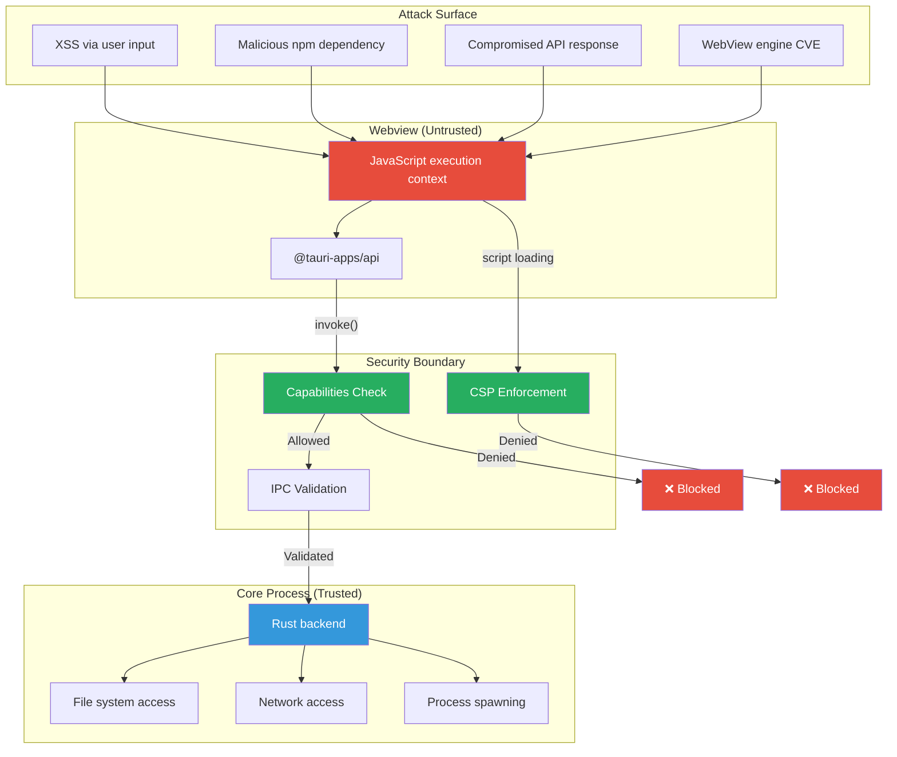
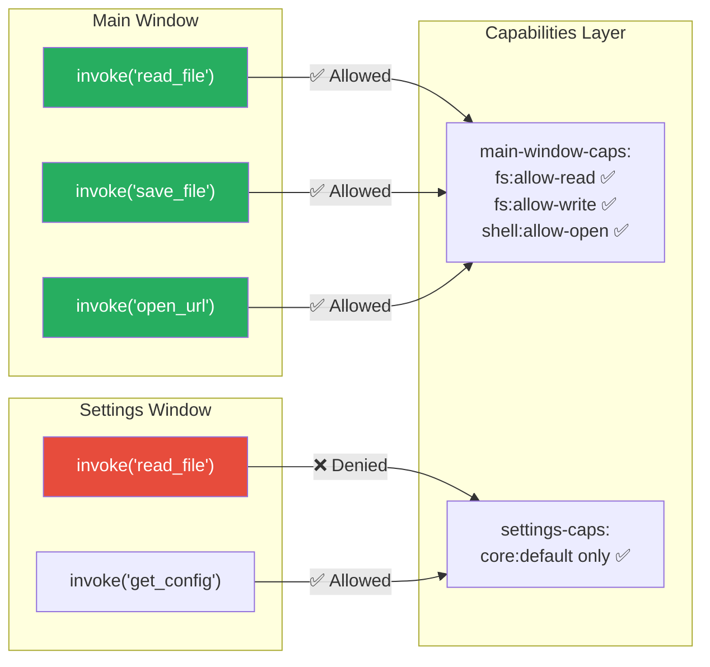

# 6. Security and the Capabilities Model 🔴

> **What you'll learn:**
> - Why the webview must be treated as an untrusted execution context — even though you wrote the frontend code
> - How Tauri v2's Capabilities system replaces the v1 allowlist, providing fine-grained, per-window permission control
> - How to configure Content Security Policy (CSP) to prevent XSS, and why `unsafe-inline` and `unsafe-eval` are existential threats
> - The attack surface of a desktop app: supply chain attacks, IPC abuse, protocol handler hijacking, and how Tauri mitigates each

---

## The Threat Model: Why Your Frontend Is Untrusted

This is the single most important concept in Tauri security: **the webview is an untrusted execution context**.

Even though *you* wrote the JavaScript, the webview process can be compromised by:

1. **XSS (Cross-Site Scripting):** A malicious payload injected via user input, a compromised API response, or a third-party library
2. **Supply chain attacks:** A npm dependency you import contains malicious code (this happens regularly — see `event-stream`, `ua-parser-js`, `colors.js`)
3. **Rendering engine vulnerabilities:** A bug in WebKit or WebView2 allows arbitrary code execution from crafted HTML/CSS/JS
4. **Protocol handler abuse:** A malicious website triggers your app's custom URL scheme

If any of these succeed, the attacker has full control of the JavaScript running in your webview. The *only* thing standing between that compromised JavaScript and your user's filesystem, network, and processes is **Tauri's IPC security layer**.



### Electron's Security Problem

Electron was born with a fundamentally broken security model. Early Electron apps commonly used:

```javascript
// 💥 SECURITY DISASTER: This was the DEFAULT in early Electron
const win = new BrowserWindow({
  webPreferences: {
    nodeIntegration: true,      // 💥 JS can require('fs'), require('child_process')
    contextIsolation: false,    // 💥 No separation between app code and preload
  },
});

// With these settings, any XSS vulnerability gives the attacker
// full access to the user's filesystem, network, and processes:
// require('child_process').exec('rm -rf /')  ← runs with user privileges
```

**Tauri's approach is the opposite**: the webview has **zero** system access by default. Every capability must be explicitly granted. There is no `nodeIntegration` equivalent — JavaScript in the webview *cannot* access the filesystem, spawn processes, or make network requests outside the browser sandbox unless you explicitly create a Tauri command for it and grant the capability.

## The Capabilities System (Tauri v2)

Tauri v2 introduced a fine-grained **capabilities** system that replaces v1's all-or-nothing allowlist. Capabilities are defined in JSON files under `src-tauri/capabilities/`.

### Capability Structure

```
src-tauri/
├── capabilities/
│   ├── default.json           # Default capability set
│   ├── main-window.json       # Capabilities for the main window
│   └── settings-window.json   # Restricted capabilities for settings
```

### Default Capability

```json
{
  "$schema": "../gen/schemas/desktop-schema.json",
  "identifier": "default",
  "description": "Default capabilities for the main window",
  "windows": ["main"],
  "permissions": [
    "core:default",
    "shell:allow-open"
  ]
}
```

### Anatomy of a Capability File

| Field | Purpose | Example |
|-------|---------|---------|
| `identifier` | Unique name for this capability set | `"main-window-caps"` |
| `description` | Human-readable purpose | `"Permissions for main window"` |
| `windows` | Which windows this applies to (by label) | `["main", "editor"]` |
| `webviews` | Which webviews this applies to | `["main-webview"]` |
| `permissions` | List of allowed operations | `["core:default", "fs:allow-read"]` |
| `platforms` | Restrict to specific OS | `["linux", "macOS", "windows"]` |

### Permission Granularity

Tauri v2 permissions are hierarchical and fine-grained:

```json
{
  "identifier": "main-capabilities",
  "windows": ["main"],
  "permissions": [
    "core:default",
    
    "fs:allow-read",
    "fs:deny-read-home",
    
    "dialog:allow-open",
    "dialog:allow-save",
    
    "notification:default",
    
    "shell:allow-open",
    
    {
      "identifier": "fs:scope",
      "allow": [
        { "path": "$APPDATA/**" },
        { "path": "$DOWNLOAD/**" }
      ],
      "deny": [
        { "path": "$HOME/.ssh/**" },
        { "path": "$HOME/.gnupg/**" }
      ]
    }
  ]
}
```

### Permission Categories

| Category | Permission Prefix | Controls |
|----------|------------------|----------|
| Core | `core:` | Default IPC, events, app lifecycle |
| Filesystem | `fs:` | Read, write, stat, create, delete files |
| Dialog | `dialog:` | Open/save file dialogs |
| Shell | `shell:` | Opening URLs, spawning processes |
| Notification | `notification:` | Desktop notifications |
| HTTP | `http:` | Making HTTP requests from the backend |
| Clipboard | `clipboard:` | Read/write system clipboard |
| Global Shortcut | `global-shortcut:` | Register global keyboard shortcuts |
| Process | `process:` | Get PID, exit, restart |
| Window | `window:` | Create, close, resize windows |

### Per-Window Capabilities

The most powerful feature of Tauri v2's security model: **different windows can have different permissions**.

```json
// capabilities/main-window.json
{
  "identifier": "main-window-caps",
  "windows": ["main"],
  "permissions": [
    "core:default",
    "fs:allow-read",
    "fs:allow-write",
    "dialog:default",
    "shell:allow-open",
    "notification:default"
  ]
}
```

```json
// capabilities/settings-window.json — MORE RESTRICTED
{
  "identifier": "settings-caps",
  "windows": ["settings"],
  "permissions": [
    "core:default"
  ]
}
```

In this configuration, the settings window **cannot** read/write files, open dialogs, or spawn processes — even if compromised JavaScript tries to invoke those commands. Only the main window has those capabilities.



## Content Security Policy (CSP)

CSP is the browser-level defense that prevents the webview from loading unauthorized scripts, styles, or resources. Configure it in `tauri.conf.json`:

```json
{
  "app": {
    "security": {
      "csp": "default-src 'self'; script-src 'self'; style-src 'self' 'unsafe-inline'; img-src 'self' asset: https://asset.localhost; connect-src ipc: http://ipc.localhost"
    }
  }
}
```

### CSP Directives Explained

| Directive | Controls | Recommended Value | Risk of `*` |
|-----------|----------|------------------|-------------|
| `default-src` | Fallback for all resource types | `'self'` | Loads anything from anywhere |
| `script-src` | JavaScript loading | `'self'` (NEVER `'unsafe-eval'`) | XSS via eval(), Function() |
| `style-src` | CSS loading | `'self' 'unsafe-inline'` | CSS injection (lower risk) |
| `img-src` | Image sources | `'self' asset:` | Tracking pixels, SSRF |
| `connect-src` | XHR, WebSocket, fetch() | `ipc: http://ipc.localhost` | Data exfiltration |
| `font-src` | Font loading | `'self'` | Usually safe |
| `frame-src` | iframe embedding | `'none'` | Clickjacking |

### The Three Rules of CSP for Tauri

1. **NEVER use `'unsafe-eval'`** in `script-src`. This allows `eval()`, `Function()`, and template literals with string injection — the primary XSS vector.

2. **NEVER use `*`** in `connect-src`. This allows the webview to send data to any server, enabling data exfiltration from a compromised frontend.

3. **Minimize `'unsafe-inline'`** in `style-src`. It's commonly needed for framework SSR and CSS-in-JS, but each `unsafe-` directive weakens the CSP.

### CSP Comparison

```json
// 💥 INSECURE: This CSP allows essentially everything
{
  "csp": "default-src * 'unsafe-inline' 'unsafe-eval'"
}
// An XSS vulnerability can: eval() arbitrary code, fetch() to any server,
// load scripts from any CDN, and exfiltrate data silently
```

```json
// ✅ SECURE: Locked down to only local resources and Tauri IPC
{
  "csp": "default-src 'self'; script-src 'self'; style-src 'self' 'unsafe-inline'; img-src 'self' asset: https://asset.localhost; connect-src ipc: http://ipc.localhost"
}
// An XSS vulnerability can only call invoke() for capabilities that are granted.
// It cannot load external scripts, fetch to external servers, or eval() code.
```

## Filesystem Scoping

Even when you grant `fs:allow-read` or `fs:allow-write`, you should restrict *where* the frontend can read/write using scopes:

```json
{
  "identifier": "fs-scoped",
  "windows": ["main"],
  "permissions": [
    {
      "identifier": "fs:scope",
      "allow": [
        { "path": "$APPDATA/**" },
        { "path": "$DOCUMENT/**" },
        { "path": "$DOWNLOAD/**" }
      ],
      "deny": [
        { "path": "$HOME/.ssh/**" },
        { "path": "$HOME/.gnupg/**" },
        { "path": "$HOME/.config/gcloud/**" },
        { "path": "/etc/**" },
        { "path": "/usr/**" }
      ]
    },
    "fs:allow-read",
    "fs:allow-write"
  ]
}
```

### Scope Variables

| Variable | Resolves To | Example (macOS) |
|----------|------------|-----------------|
| `$APPDATA` | App-specific data directory | `~/Library/Application Support/com.example.my-app` |
| `$APPCONFIG` | App-specific config directory | `~/Library/Application Support/com.example.my-app` |
| `$DESKTOP` | User desktop | `~/Desktop` |
| `$DOCUMENT` | User documents | `~/Documents` |
| `$DOWNLOAD` | User downloads | `~/Downloads` |
| `$HOME` | User home directory | `/Users/username` |
| `$TEMP` | Temporary directory | `/var/folders/.../T/` |

## Custom Command Security

Beyond plugins and scopes, your own `#[tauri::command]` functions are part of the attack surface. Every command you write is an API endpoint that compromised JavaScript can call.

### Principle of Least Privilege

```rust
// 💥 INSECURE: This command reads ANY file on the system
// A compromised frontend can read /etc/passwd, ~/.ssh/id_rsa, etc.
#[tauri::command]
fn read_any_file(path: String) -> Result<String, String> {
    std::fs::read_to_string(&path).map_err(|e| e.to_string())
}
```

```rust
use std::path::{Path, PathBuf};

// ✅ SECURE: Validate and restrict to allowed directories
#[tauri::command]
fn read_app_file(
    app: tauri::AppHandle,
    filename: String,
) -> Result<String, String> {
    // ✅ Resolve the app data directory
    let app_dir = app.path()
        .app_data_dir()
        .map_err(|e| e.to_string())?;

    // ✅ Construct the full path within the app directory
    let file_path = app_dir.join(&filename);

    // ✅ CRITICAL: Verify the resolved path is still within app_dir
    // This prevents path traversal attacks like ../../etc/passwd
    let canonical = file_path.canonicalize()
        .map_err(|e| format!("File not found: {e}"))?;
    let canonical_base = app_dir.canonicalize()
        .map_err(|e| format!("App dir error: {e}"))?;

    if !canonical.starts_with(&canonical_base) {
        return Err("Access denied: path traversal detected".to_string());
    }

    std::fs::read_to_string(&canonical).map_err(|e| e.to_string())
}
```

### Input Validation Checklist

Every `#[tauri::command]` that accepts user-provided data should validate:

| Check | Why | Example |
|-------|-----|---------|
| Path traversal | Prevent `../../etc/passwd` | Canonicalize and verify prefix |
| String length limits | Prevent memory exhaustion | Reject strings > reasonable max |
| Type bounds | Prevent overflow | Validate numeric ranges |
| Allowed values | Prevent injection | Whitelist enum-like strings |
| Null bytes | Prevent C-string truncation | Reject strings containing `\0` |

## The Complete Security Checklist

Before shipping a Tauri app:

- [ ] **CSP locked down**: No `'unsafe-eval'`, no `*` wildcards in `connect-src`
- [ ] **Capabilities minimized**: Each window has only the permissions it needs
- [ ] **Filesystem scoped**: `fs:scope` restricts read/write to specific directories with deny rules for sensitive paths
- [ ] **Commands validated**: Every command parameter is validated; paths are canonicalized and prefix-checked
- [ ] **Dependencies audited**: `cargo audit` and `npm audit` run in CI
- [ ] **No remote content**: The webview loads only embedded assets (no `http://` URLs in production)
- [ ] **Auto-updater signed**: Updates are verified with a public key before installation
- [ ] **Custom protocols restricted**: URL scheme handlers validate input before processing

---

<details>
<summary><strong>🏋️ Exercise: Security Audit</strong> (click to expand)</summary>

**Challenge:** You've inherited a Tauri app with the following configuration. Identify all security vulnerabilities and fix them.

**`tauri.conf.json` (INSECURE):**
```json
{
  "app": {
    "withGlobalTauri": true,
    "security": {
      "csp": "default-src * 'unsafe-inline' 'unsafe-eval'"
    }
  }
}
```

**`capabilities/default.json` (INSECURE):**
```json
{
  "identifier": "default",
  "windows": ["*"],
  "permissions": [
    "core:default",
    "fs:default",
    "shell:default",
    "http:default",
    "process:default"
  ]
}
```

**`src/lib.rs` (INSECURE):**
```rust
#[tauri::command]
fn execute(cmd: String) -> Result<String, String> {
    let output = std::process::Command::new("sh")
        .arg("-c")
        .arg(&cmd)
        .output()
        .map_err(|e| e.to_string())?;
    Ok(String::from_utf8_lossy(&output.stdout).to_string())
}

#[tauri::command]
fn read_file(path: String) -> Result<String, String> {
    std::fs::read_to_string(&path).map_err(|e| e.to_string())
}
```

Find all vulnerabilities and provide the fixed versions of each file.

<details>
<summary>🔑 Solution</summary>

**Vulnerabilities found:**

1. **`withGlobalTauri: true`** — Exposes Tauri IPC API to every script in the webview, including injected ones
2. **CSP `default-src *`** — Allows loading resources from any origin
3. **CSP `'unsafe-eval'`** — Allows `eval()`, enabling arbitrary code execution from XSS
4. **CSP `'unsafe-inline'`** in default-src — Allows inline scripts (XSS vector)
5. **`windows: ["*"]`** — All capabilities apply to every window
6. **`shell:default`** — Unrestricted shell access from any window
7. **`process:default`** — Full process control from any window
8. **`execute()` command** — **Remote Code Execution**: runs arbitrary shell commands
9. **`read_file()` command** — Reads any file on the system (no path validation)

**Fixed `tauri.conf.json`:**

```json
{
  "app": {
    "withGlobalTauri": false,
    "security": {
      "csp": "default-src 'self'; script-src 'self'; style-src 'self' 'unsafe-inline'; img-src 'self' asset: https://asset.localhost; connect-src ipc: http://ipc.localhost"
    }
  }
}
```

**Fixed `capabilities/default.json`:**

```json
{
  "identifier": "main-window-only",
  "windows": ["main"],
  "permissions": [
    "core:default",
    {
      "identifier": "fs:scope",
      "allow": [{ "path": "$APPDATA/**" }],
      "deny": [{ "path": "$HOME/.ssh/**" }]
    },
    "fs:allow-read",
    "shell:allow-open"
  ]
}
```

**Fixed `src/lib.rs`:**

```rust
// ✅ REMOVED: The execute() command was RCE — it should never exist.
// If you need to run specific commands, create dedicated commands
// for each operation and validate all inputs.

// ✅ FIXED: read_file now validates the path is within the app directory
#[tauri::command]
fn read_app_file(
    app: tauri::AppHandle,
    filename: String,
) -> Result<String, String> {
    // ✅ Reject filenames with path separators or null bytes
    if filename.contains('/') || filename.contains('\\') || filename.contains('\0') {
        return Err("Invalid filename".to_string());
    }

    let app_dir = app.path()
        .app_data_dir()
        .map_err(|e| e.to_string())?;

    let file_path = app_dir.join(&filename);

    // ✅ Canonicalize and verify the path stays within app_dir
    let canonical = file_path.canonicalize()
        .map_err(|e| format!("File not found: {e}"))?;
    let canonical_base = app_dir.canonicalize()
        .map_err(|e| format!("App dir error: {e}"))?;

    if !canonical.starts_with(&canonical_base) {
        return Err("Access denied".to_string());
    }

    std::fs::read_to_string(&canonical)
        .map_err(|e| e.to_string())
}
```

**Key lesson:** The original code gave a compromised webview the ability to execute `rm -rf /` and read `~/.ssh/id_rsa`. The fixed version restricts to app-specific data with path traversal protection.

</details>
</details>

---

> **Key Takeaways:**
> - The webview is **always** an untrusted context. XSS, supply chain attacks, and rendering engine CVEs can compromise it. Tauri's security model is the only barrier between compromised JavaScript and system access.
> - Tauri v2 Capabilities provide **per-window, fine-grained permissions**. Grant each window only the minimum permissions it needs. Never use `"windows": ["*"]` with broad permissions.
> - Lock down CSP: never allow `'unsafe-eval'` in `script-src`, never use `*` in `connect-src`, and audit every `'unsafe-inline'` usage.
> - Every `#[tauri::command]` is an attack surface. Validate all inputs, canonicalize paths, and never expose generic shell execution or unrestricted file access.
> - Use `fs:scope` with explicit `allow` and `deny` rules to restrict filesystem access to application-specific directories.

> **See also:**
> - [Chapter 3: Commands and Managed State](ch03-commands-and-managed-state.md) — writing commands that are both functional and secure
> - [Enterprise Rust: OpenTelemetry, Security, and Supply Chain Hygiene](../enterprise-rust-book/src/SUMMARY.md) — supply chain auditing, SBOM, and security monitoring
> - [Unsafe Rust & FFI](../unsafe-ffi-book/src/SUMMARY.md) — ensuring Rust-side safety when interfacing with untrusted data
