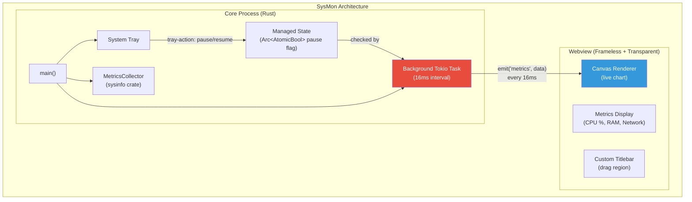
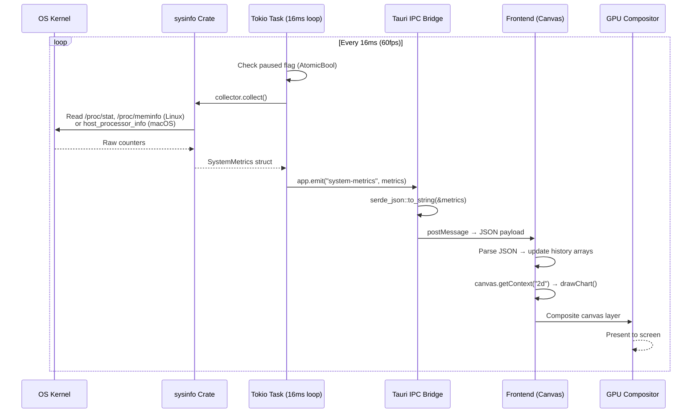

# 7. Capstone: The Native System Monitor 🔴

> **What you'll learn:**
> - How to combine every concept from this book into a production-quality desktop application that ships under 10MB
> - Building a real-time metrics collector using the `sysinfo` crate on a background Tokio thread
> - Streaming 60fps data from Rust to a live-rendered frontend chart via Tauri IPC events
> - Creating a frameless, transparent desktop widget with a system tray for controlling the monitor

---

## Project Overview

We will build **SysMon** — a native desktop system monitor that:

1. **Collects** real-time CPU, RAM, and network metrics using the `sysinfo` crate on a background Tokio thread
2. **Streams** those metrics to the frontend at 60 updates per second via Tauri IPC events
3. **Renders** a live scrolling chart using HTML Canvas
4. **Runs** as a frameless, transparent desktop widget that floats on the desktop
5. **Provides** a system tray icon with Pause/Resume and Quit controls

The final binary will be **under 10MB** — compared to the 300–500MB an equivalent Electron app would require.



## Step 1: Project Setup

### `Cargo.toml`

```toml
[package]
name = "sysmon"
version = "0.1.0"
edition = "2021"

[build-dependencies]
tauri-build = { version = "2", features = [] }

[dependencies]
tauri = { version = "2", features = ["tray-icon"] }
tauri-plugin-shell = "2"
serde = { version = "1", features = ["derive"] }
serde_json = "1"
tokio = { version = "1", features = ["full"] }
sysinfo = "0.33"

[profile.release]
strip = true
lto = true
codegen-units = 1
opt-level = "s"
panic = "abort"
```

### `tauri.conf.json`

```json
{
  "$schema": "../gen/schemas/desktop-schema.json",
  "productName": "SysMon",
  "version": "0.1.0",
  "identifier": "com.example.sysmon",
  "build": {
    "beforeDevCommand": "pnpm dev",
    "devUrl": "http://localhost:5173",
    "beforeBuildCommand": "pnpm build",
    "frontendDist": "../dist"
  },
  "app": {
    "withGlobalTauri": false,
    "windows": [
      {
        "label": "main",
        "title": "SysMon",
        "width": 400,
        "height": 300,
        "resizable": true,
        "decorations": false,
        "transparent": true,
        "alwaysOnTop": true,
        "skipTaskbar": false
      }
    ],
    "security": {
      "csp": "default-src 'self'; script-src 'self'; style-src 'self' 'unsafe-inline'; img-src 'self' asset: https://asset.localhost"
    }
  },
  "bundle": {
    "active": true,
    "targets": "all",
    "icon": [
      "icons/32x32.png",
      "icons/128x128.png",
      "icons/128x128@2x.png",
      "icons/icon.icns",
      "icons/icon.ico"
    ]
  }
}
```

### `capabilities/default.json`

```json
{
  "$schema": "../gen/schemas/desktop-schema.json",
  "identifier": "sysmon-default",
  "description": "Minimal capabilities for the system monitor widget",
  "windows": ["main"],
  "permissions": [
    "core:default"
  ]
}
```

Note: SysMon needs **no filesystem, shell, or network permissions**. The system metrics are collected entirely in Rust — the frontend only receives data via events.

## Step 2: The Metrics Collector (Rust Backend)

### `src-tauri/src/metrics.rs`

```rust
use serde::Serialize;
use sysinfo::{CpuRefreshKind, MemoryRefreshKind, Networks, RefreshKind, System};

/// Metrics payload sent to the frontend 60 times per second.
/// Kept small to minimize IPC serialization overhead.
#[derive(Clone, Serialize)]
#[serde(rename_all = "camelCase")]
pub struct SystemMetrics {
    /// Overall CPU usage as a percentage (0.0–100.0)
    pub cpu_percent: f32,
    /// Per-core CPU usage percentages
    pub per_core_cpu: Vec<f32>,
    /// Used RAM in megabytes
    pub memory_used_mb: u64,
    /// Total RAM in megabytes
    pub memory_total_mb: u64,
    /// RAM usage as a percentage (0.0–100.0)
    pub memory_percent: f32,
    /// Network bytes received since last sample
    pub net_rx_bytes: u64,
    /// Network bytes transmitted since last sample
    pub net_tx_bytes: u64,
    /// Timestamp in milliseconds since UNIX epoch
    pub timestamp_ms: u64,
}

/// Collects system metrics using the `sysinfo` crate.
/// Designed to be called repeatedly from a tokio::spawn loop.
pub struct MetricsCollector {
    system: System,
    networks: Networks,
}

impl MetricsCollector {
    pub fn new() -> Self {
        let system = System::new_with_specifics(
            RefreshKind::nothing()
                .with_cpu(CpuRefreshKind::everything())
                .with_memory(MemoryRefreshKind::everything()),
        );
        let networks = Networks::new_with_refreshed_list();

        Self { system, networks }
    }

    /// Refresh system information and return the current metrics snapshot.
    pub fn collect(&mut self) -> SystemMetrics {
        // Refresh CPU and memory information
        self.system.refresh_cpu_usage();
        self.system.refresh_memory();
        self.networks.refresh();

        // Calculate per-core CPU usage
        let per_core_cpu: Vec<f32> = self.system
            .cpus()
            .iter()
            .map(|cpu| cpu.cpu_usage())
            .collect();

        // Calculate overall CPU as average of all cores
        let cpu_percent = if per_core_cpu.is_empty() {
            0.0
        } else {
            per_core_cpu.iter().sum::<f32>() / per_core_cpu.len() as f32
        };

        // Memory in MB
        let memory_used_mb = self.system.used_memory() / (1024 * 1024);
        let memory_total_mb = self.system.total_memory() / (1024 * 1024);
        let memory_percent = if memory_total_mb > 0 {
            (memory_used_mb as f32 / memory_total_mb as f32) * 100.0
        } else {
            0.0
        };

        // Network: sum all interfaces
        let (net_rx_bytes, net_tx_bytes) = self.networks
            .iter()
            .fold((0u64, 0u64), |(rx, tx), (_name, data)| {
                (rx + data.received(), tx + data.transmitted())
            });

        let timestamp_ms = std::time::SystemTime::now()
            .duration_since(std::time::UNIX_EPOCH)
            .unwrap_or_default()
            .as_millis() as u64;

        SystemMetrics {
            cpu_percent,
            per_core_cpu,
            memory_used_mb,
            memory_total_mb,
            memory_percent,
            net_rx_bytes,
            net_tx_bytes,
            timestamp_ms,
        }
    }
}
```

## Step 3: Background Streaming Task

### `src-tauri/src/lib.rs`

```rust
mod metrics;

use metrics::MetricsCollector;
use std::sync::atomic::{AtomicBool, Ordering};
use std::sync::Arc;
use tauri::{
    menu::{Menu, MenuItem},
    tray::TrayIconBuilder,
    AppHandle, Emitter, Manager,
};

/// Shared state: controls whether metrics collection is paused.
struct MonitorState {
    paused: Arc<AtomicBool>,
}

/// Start the background metrics collection loop.
/// Runs on a dedicated Tokio task, emitting metrics every ~16ms (60fps).
fn spawn_metrics_loop(app: AppHandle, paused: Arc<AtomicBool>) {
    tokio::spawn(async move {
        // ✅ MetricsCollector is !Send (contains sysinfo::System),
        // but tokio::spawn requires Send. We create it inside the task.
        let mut collector = MetricsCollector::new();

        // ✅ 60fps = 16.67ms interval. We use 16ms.
        let mut interval = tokio::time::interval(
            std::time::Duration::from_millis(16),
        );

        // sysinfo requires an initial refresh cycle to calibrate CPU measurements
        collector.collect();
        tokio::time::sleep(std::time::Duration::from_millis(500)).await;

        loop {
            interval.tick().await;

            // ✅ Check if monitoring is paused (lockless atomic check)
            if paused.load(Ordering::Relaxed) {
                continue;
            }

            let metrics = collector.collect();

            // ✅ Emit metrics to all windows
            // If emit fails, the window was likely closed — exit the loop
            if app.emit("system-metrics", &metrics).is_err() {
                break;
            }
        }
    });
}

/// Set up the system tray with Pause/Resume and Quit actions.
fn setup_tray(app: &AppHandle, paused: Arc<AtomicBool>) -> Result<(), Box<dyn std::error::Error>> {
    let pause = MenuItem::with_id(app, "pause", "Pause", true, None::<&str>)?;
    let show = MenuItem::with_id(app, "show", "Show Monitor", true, None::<&str>)?;
    let quit = MenuItem::with_id(app, "quit", "Quit", true, None::<&str>)?;

    let menu = Menu::with_items(app, &[&show, &pause, &quit])?;

    TrayIconBuilder::new()
        .icon(app.default_window_icon().cloned().expect("no icon"))
        .menu(&menu)
        .tooltip("SysMon — System Monitor")
        .on_menu_event(move |app, event| {
            match event.id.as_ref() {
                "show" => {
                    if let Some(win) = app.get_webview_window("main") {
                        let _ = win.show();
                        let _ = win.set_focus();
                    }
                }
                "pause" => {
                    // ✅ Toggle the pause state atomically
                    let was_paused = paused.fetch_xor(true, Ordering::Relaxed);
                    let new_label = if was_paused { "Pause" } else { "Resume" };
                    // Update menu item text would require re-building the menu
                    // or using mutable menu items (simplified here)
                    let _ = app.emit("monitor-paused", !was_paused);
                }
                "quit" => {
                    app.exit(0);
                }
                _ => {}
            }
        })
        .build(app)?;

    Ok(())
}

#[tauri::command]
fn toggle_pause(state: tauri::State<'_, MonitorState>) -> bool {
    let was_paused = state.paused.fetch_xor(true, Ordering::Relaxed);
    !was_paused // Return the new state (true = now paused)
}

#[tauri::command]
fn get_pause_state(state: tauri::State<'_, MonitorState>) -> bool {
    state.paused.load(Ordering::Relaxed)
}

pub fn run() {
    let paused = Arc::new(AtomicBool::new(false));

    tauri::Builder::default()
        .plugin(tauri_plugin_shell::init())
        .manage(MonitorState {
            paused: paused.clone(),
        })
        .setup(move |app| {
            let app_handle = app.handle().clone();

            // ✅ Set up the system tray
            setup_tray(&app_handle, paused.clone())?;

            // ✅ Start the metrics collection loop
            spawn_metrics_loop(app_handle, paused);

            // ✅ Handle close-to-tray: hide instead of quit
            if let Some(main_window) = app.get_webview_window("main") {
                let win = main_window.clone();
                main_window.on_window_event(move |event| {
                    if let tauri::WindowEvent::CloseRequested { api, .. } = event {
                        api.prevent_close();
                        let _ = win.hide();
                    }
                });
            }

            Ok(())
        })
        .invoke_handler(tauri::generate_handler![toggle_pause, get_pause_state])
        .run(tauri::generate_context!())
        .expect("error while running tauri application");
}
```

### `src-tauri/src/main.rs`

```rust
#![cfg_attr(not(debug_assertions), windows_subsystem = "windows")]

fn main() {
    sysmon::run();
}
```

## Step 4: The Frontend — Live Canvas Chart

### `index.html`

```html
<!doctype html>
<html lang="en">
<head>
  <meta charset="UTF-8" />
  <meta name="viewport" content="width=device-width, initial-scale=1.0" />
  <title>SysMon</title>
  <style>
    * { margin: 0; padding: 0; box-sizing: border-box; }

    html, body {
      background: transparent;
      overflow: hidden;
      font-family: -apple-system, BlinkMacSystemFont, 'Segoe UI', sans-serif;
      color: #e0e0e0;
    }

    .container {
      width: 100vw;
      height: 100vh;
      background: rgba(20, 20, 30, 0.85);
      border-radius: 12px;
      display: flex;
      flex-direction: column;
      overflow: hidden;
    }

    /* Custom titlebar */
    .titlebar {
      height: 28px;
      display: flex;
      align-items: center;
      justify-content: space-between;
      padding: 0 10px;
      background: rgba(30, 30, 40, 0.9);
      font-size: 11px;
      color: #888;
      border-radius: 12px 12px 0 0;
      flex-shrink: 0;
    }

    .titlebar-buttons {
      display: flex;
      gap: 6px;
    }

    .titlebar-btn {
      width: 12px; height: 12px;
      border-radius: 50%;
      border: none;
      cursor: pointer;
    }

    .btn-close { background: #ff5f57; }
    .btn-minimize { background: #ffbd2e; }
    .btn-pause { background: #28c840; }
    .btn-close:hover { background: #ff3b30; }

    /* Metrics display */
    .metrics {
      display: flex;
      justify-content: space-around;
      padding: 8px 12px;
      font-size: 12px;
      flex-shrink: 0;
    }

    .metric {
      text-align: center;
    }

    .metric-value {
      font-size: 20px;
      font-weight: 700;
      font-variant-numeric: tabular-nums;
    }

    .metric-label {
      font-size: 10px;
      color: #666;
      text-transform: uppercase;
    }

    .cpu-color { color: #00d4ff; }
    .ram-color { color: #ff6b6b; }
    .net-color { color: #51cf66; }

    /* Chart */
    .chart-container {
      flex: 1;
      padding: 4px 8px 8px;
      min-height: 0;
    }

    canvas {
      width: 100%;
      height: 100%;
      border-radius: 6px;
    }

    .paused-overlay {
      display: none;
      position: absolute;
      inset: 0;
      background: rgba(0,0,0,0.5);
      align-items: center;
      justify-content: center;
      font-size: 18px;
      color: #fff;
      border-radius: 12px;
    }

    .paused-overlay.visible { display: flex; }
  </style>
</head>
<body>
  <div class="container">
    <!-- Custom frameless titlebar -->
    <div class="titlebar" data-tauri-drag-region>
      <span>SysMon</span>
      <div class="titlebar-buttons">
        <button class="titlebar-btn btn-pause" id="btn-pause" title="Pause"></button>
        <button class="titlebar-btn btn-minimize" id="btn-minimize" title="Minimize"></button>
        <button class="titlebar-btn btn-close" id="btn-close" title="Close to tray"></button>
      </div>
    </div>

    <!-- Live metrics -->
    <div class="metrics">
      <div class="metric">
        <div class="metric-value cpu-color" id="cpu-value">0%</div>
        <div class="metric-label">CPU</div>
      </div>
      <div class="metric">
        <div class="metric-value ram-color" id="ram-value">0 MB</div>
        <div class="metric-label">RAM</div>
      </div>
      <div class="metric">
        <div class="metric-value net-color" id="net-value">0 KB/s</div>
        <div class="metric-label">Network</div>
      </div>
    </div>

    <!-- Live chart -->
    <div class="chart-container">
      <canvas id="chart"></canvas>
    </div>

    <div class="paused-overlay" id="paused-overlay">⏸ PAUSED</div>
  </div>

  <script type="module" src="/src/main.ts"></script>
</body>
</html>
```

### `src/main.ts`

```typescript
import { listen } from '@tauri-apps/api/event';
import { invoke } from '@tauri-apps/api/core';
import { getCurrentWindow } from '@tauri-apps/api/window';

// --- Type Definitions ---
interface SystemMetrics {
  cpuPercent: number;
  perCoreCpu: number[];
  memoryUsedMb: number;
  memoryTotalMb: number;
  memoryPercent: number;
  netRxBytes: number;
  netTxBytes: number;
  timestampMs: number;
}

// --- Chart State ---
const MAX_POINTS = 200; // Number of data points visible on the chart
const cpuHistory: number[] = [];
const ramHistory: number[] = [];
let lastNetRx = 0;
let lastTimestamp = 0;
let isPaused = false;

// --- DOM Elements ---
const cpuValueEl = document.getElementById('cpu-value')!;
const ramValueEl = document.getElementById('ram-value')!;
const netValueEl = document.getElementById('net-value')!;
const canvas = document.getElementById('chart') as HTMLCanvasElement;
const ctx = canvas.getContext('2d')!;
const pausedOverlay = document.getElementById('paused-overlay')!;

// --- Canvas Setup ---
function resizeCanvas() {
  const rect = canvas.parentElement!.getBoundingClientRect();
  const dpr = window.devicePixelRatio || 1;
  canvas.width = rect.width * dpr;
  canvas.height = rect.height * dpr;
  ctx.scale(dpr, dpr);
  canvas.style.width = rect.width + 'px';
  canvas.style.height = rect.height + 'px';
}

resizeCanvas();
window.addEventListener('resize', resizeCanvas);

// --- Chart Renderer ---
function drawChart() {
  const w = canvas.width / (window.devicePixelRatio || 1);
  const h = canvas.height / (window.devicePixelRatio || 1);

  // Clear
  ctx.clearRect(0, 0, w, h);

  // Background grid
  ctx.strokeStyle = 'rgba(255,255,255,0.05)';
  ctx.lineWidth = 1;
  for (let y = 0; y <= 100; y += 25) {
    const py = h - (y / 100) * h;
    ctx.beginPath();
    ctx.moveTo(0, py);
    ctx.lineTo(w, py);
    ctx.stroke();
  }

  // Draw CPU line (cyan)
  drawLine(cpuHistory, w, h, '#00d4ff', 0.3);

  // Draw RAM line (red)
  drawLine(ramHistory, w, h, '#ff6b6b', 0.2);
}

function drawLine(
  data: number[],
  w: number,
  h: number,
  color: string,
  fillAlpha: number,
) {
  if (data.length < 2) return;

  const step = w / MAX_POINTS;

  // Fill area
  ctx.beginPath();
  ctx.moveTo(0, h);
  for (let i = 0; i < data.length; i++) {
    const x = i * step;
    const y = h - (data[i] / 100) * h;
    ctx.lineTo(x, y);
  }
  ctx.lineTo((data.length - 1) * step, h);
  ctx.closePath();
  ctx.fillStyle = color.replace(')', `, ${fillAlpha})`).replace('rgb', 'rgba');
  ctx.fill();

  // Stroke line
  ctx.beginPath();
  for (let i = 0; i < data.length; i++) {
    const x = i * step;
    const y = h - (data[i] / 100) * h;
    if (i === 0) ctx.moveTo(x, y);
    else ctx.lineTo(x, y);
  }
  ctx.strokeStyle = color;
  ctx.lineWidth = 2;
  ctx.stroke();
}

// --- Metrics Handler ---
function handleMetrics(metrics: SystemMetrics) {
  // Update text displays
  cpuValueEl.textContent = metrics.cpuPercent.toFixed(1) + '%';
  ramValueEl.textContent = metrics.memoryUsedMb.toLocaleString() + ' MB';

  // Calculate network speed (bytes/sec since last sample)
  if (lastTimestamp > 0) {
    const dtSec = (metrics.timestampMs - lastTimestamp) / 1000;
    if (dtSec > 0) {
      const rxSpeed = (metrics.netRxBytes - lastNetRx) / dtSec;
      if (rxSpeed < 1024) {
        netValueEl.textContent = rxSpeed.toFixed(0) + ' B/s';
      } else if (rxSpeed < 1024 * 1024) {
        netValueEl.textContent = (rxSpeed / 1024).toFixed(1) + ' KB/s';
      } else {
        netValueEl.textContent = (rxSpeed / (1024 * 1024)).toFixed(1) + ' MB/s';
      }
    }
  }
  lastNetRx = metrics.netRxBytes;
  lastTimestamp = metrics.timestampMs;

  // Push to history arrays (capped at MAX_POINTS)
  cpuHistory.push(metrics.cpuPercent);
  ramHistory.push(metrics.memoryPercent);
  if (cpuHistory.length > MAX_POINTS) cpuHistory.shift();
  if (ramHistory.length > MAX_POINTS) ramHistory.shift();

  // Redraw the chart
  drawChart();
}

// --- Event Listeners ---
async function init() {
  // Listen for metrics from the Rust backend
  await listen<SystemMetrics>('system-metrics', (event) => {
    handleMetrics(event.payload);
  });

  // Listen for pause state changes (from tray)
  await listen<boolean>('monitor-paused', (event) => {
    isPaused = event.payload;
    pausedOverlay.classList.toggle('visible', isPaused);
  });

  // Titlebar buttons
  const appWindow = getCurrentWindow();

  document.getElementById('btn-close')!.addEventListener('click', () => {
    appWindow.hide();
  });

  document.getElementById('btn-minimize')!.addEventListener('click', () => {
    appWindow.minimize();
  });

  document.getElementById('btn-pause')!.addEventListener('click', async () => {
    const nowPaused = await invoke<boolean>('toggle_pause');
    isPaused = nowPaused;
    pausedOverlay.classList.toggle('visible', isPaused);
  });
}

init();
```

## Step 5: Data Flow Architecture

Here's the complete data flow during normal operation:



### Performance Budget

At 60fps, we have **16.67ms per frame** to:

1. Collect metrics from the OS (~0.5ms)
2. Serialize to JSON (~0.1ms)
3. Cross the IPC bridge (~0.2ms)
4. Parse JSON in JS (~0.1ms)
5. Update history arrays (~0.01ms)
6. Redraw the canvas chart (~1–3ms)

**Total: ~2–4ms per frame**, leaving ~12ms of headroom. This is why Tauri's architecture works for real-time dashboards.

| Stage | Time Budget | Actual (typical) | Notes |
|-------|------------|-------------------|-------|
| `sysinfo` collection | <2ms | ~0.5ms | Cached between refreshes |
| JSON serialization | <1ms | ~0.1ms | Small payload (~200 bytes) |
| IPC transit | <1ms | ~0.2ms | Same-machine, no network |
| JS JSON parse | <1ms | ~0.1ms | Small payload |
| Canvas draw | <8ms | ~2ms | 200-point line chart |
| **Total** | **<16.67ms** | **~3ms** | **Comfortable budget** |

## Step 6: Build and Measure

```bash
# Development (hot-reload)
cargo tauri dev

# Production build
cargo tauri build

# Measure binary size
ls -lh src-tauri/target/release/bundle/
# Expected: 6-9 MB depending on platform

# Measure RAM usage (macOS)
ps aux | grep -i sysmon | awk '{sum += $6} END {print sum/1024 " MB"}'
# Expected: 35-55 MB (Core Process + Webview)
```

### Final Metrics: SysMon vs Hypothetical Electron Equivalent

| Metric | SysMon (Tauri) | Electron Equivalent | Ratio |
|--------|---------------|-------------------|-------|
| Binary size | ~7 MB | ~200 MB | **29x smaller** |
| Idle RAM | ~45 MB | ~350 MB | **7.8x less** |
| CPU at 60fps | ~2% | ~8% | **4x less** |
| Processes | 2 | 6+ | **3x fewer** |
| Startup | ~0.4 sec | ~3 sec | **7.5x faster** |
| Battery impact | Minimal | Significant | **Qualitative** |

---

<details>
<summary><strong>🏋️ Exercise: Extend the System Monitor</strong> (click to expand)</summary>

**Challenge:** Extend SysMon with the following features:

1. **Per-core CPU chart**: Show individual lines for each CPU core (use different colors from a palette)
2. **Disk I/O monitoring**: Add read/write bytes per second using `sysinfo`'s disk API
3. **Process list**: Add a `#[tauri::command]` that returns the top 10 processes by CPU usage and display them in a table below the chart
4. **Configurable update rate**: Add a slider in the UI that invokes a command to change the metrics interval (16ms to 1000ms)
5. **Data export**: Add a "Save Snapshot" button that serializes the current metrics history to a JSON file in the app data directory

<details>
<summary>🔑 Solution</summary>

**1. Per-core CPU chart** — update the `handleMetrics` function:

```typescript
// Store per-core history: Map<coreIndex, number[]>
const perCoreHistory: Map<number, number[]> = new Map();
const coreColors = [
  '#00d4ff', '#ff6b6b', '#51cf66', '#ffd43b',
  '#cc5de8', '#ff922b', '#20c997', '#e64980',
];

function handleMetricsExtended(metrics: SystemMetrics) {
  // Store per-core data
  metrics.perCoreCpu.forEach((usage, i) => {
    if (!perCoreHistory.has(i)) perCoreHistory.set(i, []);
    const history = perCoreHistory.get(i)!;
    history.push(usage);
    if (history.length > MAX_POINTS) history.shift();
  });

  // Draw each core as a separate line
  const w = canvas.width / (window.devicePixelRatio || 1);
  const h = canvas.height / (window.devicePixelRatio || 1);
  ctx.clearRect(0, 0, w, h);

  perCoreHistory.forEach((history, i) => {
    const color = coreColors[i % coreColors.length];
    drawLine(history, w, h, color, 0.05);
  });
}
```

**2. Disk I/O monitoring** — extend the Rust metrics:

```rust
use sysinfo::Disks;

pub struct MetricsCollector {
    system: System,
    networks: Networks,
    disks: Disks,
}

// In collect():
self.disks.refresh();
let (disk_read, disk_written) = self.disks
    .iter()
    .fold((0u64, 0u64), |(r, w), disk| {
        // Note: sysinfo disk read/write bytes are cumulative
        (r + disk.usage().read_bytes, w + disk.usage().written_bytes)
    });
```

**3. Process list command:**

```rust
use sysinfo::{ProcessesToUpdate, ProcessRefreshKind};

#[derive(Serialize)]
#[serde(rename_all = "camelCase")]
struct ProcessInfo {
    name: String,
    pid: u32,
    cpu_percent: f32,
    memory_mb: u64,
}

#[tauri::command]
fn top_processes(state: tauri::State<'_, Arc<Mutex<System>>>) -> Vec<ProcessInfo> {
    let mut sys = state.lock().unwrap();
    sys.refresh_processes_specifics(
        ProcessesToUpdate::All,
        true,
        ProcessRefreshKind::everything(),
    );

    let mut procs: Vec<ProcessInfo> = sys.processes()
        .values()
        .map(|p| ProcessInfo {
            name: p.name().to_string_lossy().to_string(),
            pid: p.pid().as_u32(),
            cpu_percent: p.cpu_usage(),
            memory_mb: p.memory() / (1024 * 1024),
        })
        .collect();

    // ✅ Sort by CPU usage descending, take top 10
    procs.sort_by(|a, b| b.cpu_percent.partial_cmp(&a.cpu_percent).unwrap());
    procs.truncate(10);
    procs
}
```

**4. Configurable update rate:**

```rust
use std::sync::atomic::AtomicU64;

struct MonitorState {
    paused: Arc<AtomicBool>,
    interval_ms: Arc<AtomicU64>,
}

#[tauri::command]
fn set_update_rate(ms: u64, state: tauri::State<'_, MonitorState>) -> u64 {
    // ✅ Clamp to reasonable range: 16ms (60fps) to 1000ms (1fps)
    let clamped = ms.clamp(16, 1000);
    state.interval_ms.store(clamped, Ordering::Relaxed);
    clamped
}

// In the spawn_metrics_loop, read interval dynamically:
// let ms = interval_ms.load(Ordering::Relaxed);
// tokio::time::sleep(Duration::from_millis(ms)).await;
```

**5. Data export:**

```rust
#[tauri::command]
async fn export_snapshot(
    app: tauri::AppHandle,
    data: serde_json::Value,
) -> Result<String, String> {
    let app_dir = app.path()
        .app_data_dir()
        .map_err(|e| e.to_string())?;

    tokio::fs::create_dir_all(&app_dir)
        .await
        .map_err(|e| e.to_string())?;

    let timestamp = std::time::SystemTime::now()
        .duration_since(std::time::UNIX_EPOCH)
        .unwrap_or_default()
        .as_secs();
    let filename = format!("snapshot-{timestamp}.json");
    let filepath = app_dir.join(&filename);

    let json = serde_json::to_string_pretty(&data)
        .map_err(|e| e.to_string())?;

    tokio::fs::write(&filepath, json)
        .await
        .map_err(|e| e.to_string())?;

    Ok(filepath.display().to_string())
}
```

</details>
</details>

---

> **Key Takeaways:**
> - A complete, real-time desktop system monitor can be built with Tauri in under 10MB — 30x smaller and 8x lighter than an Electron equivalent.
> - The `sysinfo` crate provides cross-platform access to CPU, RAM, network, and disk metrics with sub-millisecond collection times.
> - Background Tokio tasks with `AtomicBool` cancel/pause flags provide clean, lockless control over long-running monitoring loops.
> - At 60fps (16ms intervals), the complete pipeline — metric collection, JSON serialization, IPC transit, and Canvas rendering — uses only ~3ms per frame, leaving ample headroom.
> - Frameless transparent windows (`decorations: false`, `transparent: true`) combined with CSS `border-radius` and semi-transparent backgrounds create polished desktop widgets.
> - The system tray provides always-available controls (pause, show, quit) even when the window is hidden.

> **See also:**
> - [Chapter 4: Bi-Directional Events](ch04-bidirectional-events.md) — the event streaming pattern used throughout this capstone
> - [Chapter 5: Window Management](ch05-window-management.md) — frameless windows and system tray integration
> - [Chapter 6: Security](ch06-security-capabilities.md) — SysMon needs only `core:default` permissions
> - [Async Rust](../async-book/src/SUMMARY.md) — Tokio task spawning and interval timers
