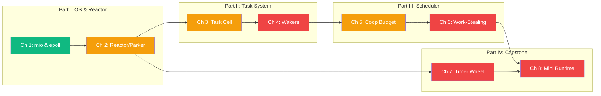

# Tokio Internals: Building a Work-Stealing Runtime from Scratch

## Speaker Intro

I'm a Runtime Engineer and Systems Hacker who has spent fifteen years building async runtimes, kernel-bypass network stacks, and high-frequency trading systems — first in C and C++, then in Rust since before the 1.0 release. I've contributed patches to the Rust compiler's async transform, helped design Tokio's work-stealing scheduler, and maintained `mio` during its migration from epoll level-triggered to edge-triggered mode. Before Rust, I wrote custom event loops on top of `io_uring`, `kqueue`, and IOCP for a distributed database that processed 4 million queries per second on 8 cores.

This guide is the material I use to onboard principal engineers into async runtime development. It's not about *using* Tokio — it's about understanding every layer beneath `tokio::spawn`, from the raw `epoll_wait` syscall up through the lock-free work-stealing dequeue that schedules your futures. If you've ever stared at a flamegraph wondering why your Tokio application has 40% idle time, or why a single blocking call starves every other task on a worker thread, this book will give you the mental model to diagnose and fix it.

| Runtime Layer | What Controls It | Where You'll Learn It |
|---|---|---|
| **OS event notification** | `epoll` / `kqueue` / IOCP via `mio` | Chapter 1 |
| **Reactor (I/O driver)** | Polls OS events, wakes tasks | Chapters 1–2 |
| **Task lifecycle** | Allocation, type-erasure, ref-counting | Chapter 3 |
| **Wake notification** | `RawWakerVTable`, atomic state machine | Chapter 4 |
| **Cooperative scheduling** | Budget ticks, yield points | Chapter 5 |
| **Work-stealing executor** | Local queues, LIFO slot, CAS steal | Chapter 6 |
| **Timer subsystem** | Hashed hierarchical timing wheel | Chapter 7 |
| **Full integration** | Capstone mini-runtime | Chapter 8 |

---

## Who This Is For

This guide is for **staff and principal engineers** who are:

- **Tokio power users** who deploy production services handling tens of thousands of concurrent connections and need to understand *why* certain patterns cause tail-latency spikes, CPU starvation, or reactor stalls — not just that they do.
- **Runtime authors** building custom async executors (e.g., for embedded, WASM, or game engines) who need a reference implementation of work-stealing, cooperative budgeting, and I/O driver integration.
- **Systems programmers** migrating from C/C++ event-loop frameworks (`libuv`, `libevent`, Boost.Asio) who want to understand Rust's zero-cost async design at the same depth they understand `epoll` and `select`.
- **Performance engineers** who profile Tokio applications for a living and want to map flamegraph frames back to specific runtime subsystems — the reactor tick, the `park()` call, the steal loop, the timer wheel advance.

You should already be comfortable with:

| Concept | Where to Learn |
|---------|---------------|
| `Future`, `Poll`, `Pin<&mut Self>` | [Async Rust](../async-book/src/SUMMARY.md) |
| `std::task::Waker`, `RawWaker`, `RawWakerVTable` | [Async Rust](../async-book/src/SUMMARY.md), Ch 4–5 |
| Atomic operations: `Ordering::Acquire`, `Release`, `AcqRel`, `SeqCst` | [Concurrency in Rust](../concurrency-book/src/SUMMARY.md) |
| `Arc`, interior mutability, `UnsafeCell` | [Rust Memory Management](../memory-management-book/src/SUMMARY.md) |
| CPU caches, cache lines, false sharing | [Compiler Optimizations](../compiler-optimizations-book/src/SUMMARY.md) |
| Basic Linux system calls (`read`, `write`, `poll`, `epoll`) | Man pages or Stevens' *UNIX Network Programming* |

**If you haven't implemented `Future` by hand**, start with the Async Rust book. This guide assumes you can write a state machine that implements `Future::poll` and wire up a `Waker` manually. We start where those guides end.

---

## How to Use This Book

| Emoji | Meaning (in this book) |
|-------|---------|
| 🟢 | **Advanced Core** — OS fundamentals and the reactor layer. Deep but foundational. |
| 🟡 | **Expert** — internal data structures and scheduling policies. Requires careful reading. |
| 🔴 | **Runtime Hacker** — lock-free algorithms, atomic orderings, and building from scratch. |

Every chapter follows a strict structure:

1. **What you'll learn** — 3–4 specific, measurable outcomes.
2. **Core content** — first-principles explanation building from hardware up. Tables compare design tradeoffs. Mermaid diagrams visualize architectures and state machines.
3. **"What Tokio does internally" vs. "The simplified mental model"** — side-by-side code blocks showing the real complexity and the abstraction layer hiding it.
4. **Hazard callouts** — code that compiles but causes runtime deadlocks, starvation, or reactor stalls, marked with `// 💥` and followed by the fix marked with `// ✅`.
5. **Exercise** — a hands-on challenge with a hidden, heavily-commented solution.
6. **Key Takeaways** — the sentences you'd write on an architecture review whiteboard.

---

## Pacing Guide

| Chapters | Topic | Time | Checkpoint |
|----------|-------|------|------------|
| Ch 1 | Event Loops and `mio` | 3–4 hours | Can you explain the difference between edge-triggered and level-triggered epoll, and why Tokio chose edge-triggered? |
| Ch 2 | The Reactor and the Parker | 3–4 hours | Can you trace the flow from a socket becoming readable to a Tokio task being woken? |
| Ch 3 | Anatomy of a Tokio Task | 4–5 hours | Can you draw the memory layout of a spawned task and explain its atomic reference counting? |
| Ch 4 | Wakers and Notification | 4–5 hours | Can you implement a `RawWakerVTable` that enqueues a task onto a run queue? |
| Ch 5 | Cooperative Scheduling | 3–4 hours | Can you explain how the cooperative budget prevents a single task from starving the reactor? |
| Ch 6 | The Work-Stealing Algorithm | 5–6 hours | Can you implement a lock-free work-stealing dequeue using atomic CAS operations? |
| Ch 7 | The Timer Wheel | 4–5 hours | Can you explain the hashed hierarchical timing wheel and why it's O(1) for insert and cancel? |
| Ch 8 | Capstone: Mini Runtime | 8–10 hours | Can you build a multi-threaded async runtime with I/O, timers, and work-stealing from scratch? |

**Total: 34–43 hours** for the full curriculum, or ~5–6 days of focused study.

---

## Table of Contents

### Part I: The OS and the Reactor

Everything in async Rust ultimately bottoms out at a system call. Before you can understand Tokio's scheduler, you must understand *what it's waiting for*. Part I takes you from raw file descriptors and `epoll_wait` up through Tokio's Reactor/Executor split architecture.

- **Chapter 1: Event Loops and `mio` 🟢** — How operating systems notify user-space programs that a file descriptor is ready. The `select`, `poll`, `epoll` (Linux), and `kqueue` (macOS/BSD) system calls compared. Edge-triggered vs. level-triggered semantics and why Tokio uses edge-triggered mode. The `mio` crate as a cross-platform abstraction over OS event queues. Building a minimal event loop from raw `mio` primitives.

- **Chapter 2: The Reactor and the Parker 🟡** — Tokio's split architecture: the I/O Driver (Reactor) that polls OS events and the Executor that runs futures. How the Reactor registers interest in file descriptors and dispatches readiness notifications. The `Park` / `Unpark` protocol: how the executor thread sleeps when there's no work and gets woken by the reactor. Thread parking via `condvar` or `eventfd`. Why the reactor runs on the same thread as the executor in Tokio's multi-thread runtime.

### Part II: The Task System

A `tokio::spawn` call looks simple. Under the hood, it allocates a type-erased, reference-counted task cell, wires up a `Waker` that knows how to re-enqueue the task, and pushes it onto the scheduler. Part II dissects every byte of that process.

- **Chapter 3: Anatomy of a Tokio Task 🟡** — What `tokio::spawn` actually allocates on the heap. The `Cell<T>` layout: `Header` (state bits, queue pointers), `Core<T>` (the Future itself), and `Trailer` (waker slot). How Tokio type-erases `T: Future` into a `RawTask` pointer for the scheduler. Intrusive linked lists vs. `VecDeque` for run queues. Atomic reference counting for shared ownership between the `JoinHandle`, the scheduler, and the `Waker`.

- **Chapter 4: Wakers and Notification 🔴** — The `RawWakerVTable` in detail: `clone`, `wake`, `wake_by_ref`, `drop`. How constructing a `Waker` increments the task's atomic refcount, and how `wake()` transitions the task's state bits and pushes it onto the appropriate run queue. The state machine: `IDLE → SCHEDULED → RUNNING → IDLE` (or `COMPLETE`). Spurious wakes and why the runtime must handle them. Building a custom `Waker` from scratch.

### Part III: The Scheduler

The scheduler is where Tokio's performance story lives. A naïve single-queue executor serializes all task dispatching through a mutex. Tokio's multi-threaded scheduler uses per-thread lock-free queues with a global overflow queue and a work-stealing algorithm that keeps all cores busy. Part III explains every detail.

- **Chapter 5: Cooperative Scheduling and Budgeting 🟡** — Why preemptive scheduling is impossible in user-space Rust. The cooperative contract: every `.await` point is a potential yield point. The cooperative budget (128 operations per task poll). How `tokio::coop` uses a thread-local counter. What happens when the budget expires: the waker is immediately re-triggered but the task yields. How this prevents a single `loop { stream.next().await }` from starving the reactor and all other tasks. `tokio::task::yield_now()` for manual cooperation.

- **Chapter 6: The Work-Stealing Algorithm 🔴** — Tokio's crown jewel. The three data structures: the **Global Inject Queue** (MPMC, mutex-protected), the **Thread-Local Run Queue** (fixed-size circular buffer, SPSC), and the **LIFO Slot** (single-task optimization for temporal locality). How `tokio::spawn` pushes to the local queue (fast path) or overflows to the global queue. How idle workers steal half the tasks from a random sibling's local queue using a lock-free CAS loop on `head` and `tail` indices. CPU cache implications: why stealing half is optimal. The LIFO slot: why running the last-spawned task first reduces cache misses by ~30%.

### Part IV: I/O, Timers, and Capstone

- **Chapter 7: The Timer Wheel 🔴** — How `tokio::time::sleep` works without spawning a thread per timer. The Hashed Hierarchical Timing Wheel: a multi-level array structure (milliseconds → seconds → minutes) where each slot holds a linked list of pending timers. O(1) insert, O(1) cancel, O(1) amortized expiration. How the reactor thread advances the wheel each tick. Interaction with the parker: the reactor computes the minimum sleep duration from the earliest pending timer.

- **Chapter 8: Capstone: Building a Mini Work-Stealing Runtime 🔴** — Build a functioning multi-threaded async runtime from scratch, integrating every concept from the book. Phase 1: single-threaded executor with a `VecDeque` run queue. Phase 2: custom `Waker` implementation. Phase 3: `mio`-backed reactor for I/O readiness. Phase 4: multi-threaded executor with per-thread local queues and a global inject queue. Phase 5: work-stealing when a thread goes idle. The complete, working runtime in ~500 lines of Rust.

### Appendices

- **Appendix A: Tokio Internals Reference Card** — Cheat sheet for Tokio configuration knobs (`worker_threads`, `max_blocking_threads`, `global_queue_interval`). Worker thread metrics and how to read `tokio-console` output. Common atomic memory orderings used in the scheduler. Quick-reference diagrams for the task state machine, work-stealing topology, and timer wheel structure.

---

---

## Companion Guides

This book builds on and connects to several other books in the Rust Training series:

| Book | Relationship |
|------|-------------|
| [Async Rust](../async-book/src/SUMMARY.md) | **Prerequisite** — covers Futures, `Pin`, `async`/`.await` from the user's perspective |
| [Concurrency in Rust](../concurrency-book/src/SUMMARY.md) | **Prerequisite** — atomics, memory orderings, `Send`/`Sync` |
| [Rust Memory Management](../memory-management-book/src/SUMMARY.md) | **Prerequisite** — ownership, `Arc`, `UnsafeCell` |
| [The Rust Architect's Toolbox](../toolbox-book/src/SUMMARY.md) | **Companion** — `bytes` crate I/O patterns used in the reactor |
| [Zero-Copy Architecture](../zero-copy-book/src/SUMMARY.md) | **Follow-up** — `io_uring`, thread-per-core runtimes |
| [Compiler Optimizations](../compiler-optimizations-book/src/SUMMARY.md) | **Reference** — CPU caches, SIMD, assembly analysis for profiling |
| [Rust Ecosystem, Tooling & Profiling](../tooling-profiling-book/src/SUMMARY.md) | **Companion** — flamegraphs, Criterion, performance analysis |
