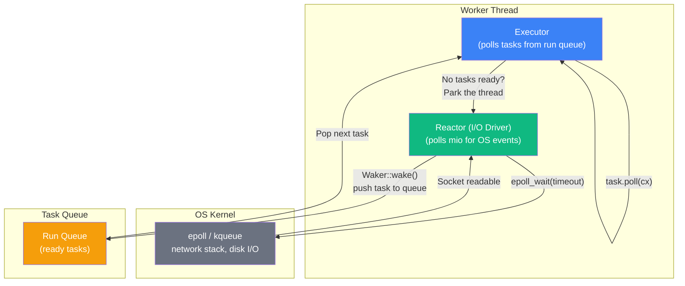
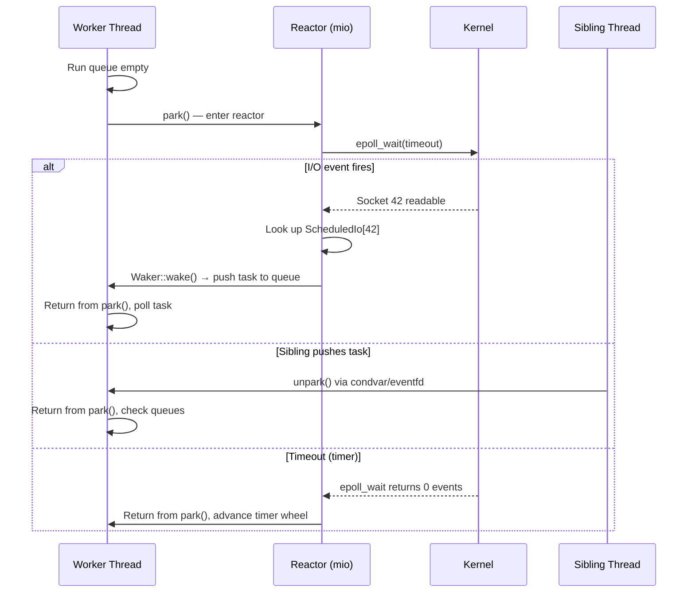

# 2. The Reactor and the Parker 🟡

> **What you'll learn:**
> - How Tokio splits into two cooperating subsystems: the **Reactor** (I/O driver) and the **Executor** (task scheduler)
> - How the Reactor registers file descriptors with `mio`, receives OS events, and translates them into `Waker::wake()` calls
> - The `Park` / `Unpark` protocol that puts executor threads to sleep and wakes them when new work arrives
> - Why the reactor and executor share the same thread in Tokio's multi-threaded runtime, and the performance implications

---

## The Split Architecture

Tokio is not a monolithic event loop. It's two cooperating subsystems running on the same thread:



**The Executor** owns the run queue and polls `Future`s. When a future returns `Poll::Pending`, the executor moves on to the next task. When the run queue is empty, the executor needs to **sleep** until something happens.

**The Reactor** (also called the **I/O Driver**) owns the `mio::Poll` instance. It knows which tasks are waiting on which file descriptors. When `epoll_wait` returns that a socket is ready, the reactor calls `Waker::wake()` on the corresponding task, pushing it back onto the executor's run queue.

The critical insight: **these two subsystems run on the same OS thread**. There is no separate "reactor thread." Each Tokio worker thread alternates between executing tasks and polling for I/O events.

---

## How the Reactor Registers I/O Sources

When you call `TcpStream::connect()` or `TcpListener::bind()` through Tokio, the underlying `mio` source gets registered with the reactor. Here's the conceptual flow:

```rust
// What you write:
let listener = TcpListener::bind("127.0.0.1:8080").await?;

// What Tokio does internally (simplified):
// 1. Create a mio::net::TcpListener (non-blocking)
let mio_listener = mio::net::TcpListener::bind(addr)?;

// 2. Register it with the reactor's mio::Poll
//    The token maps back to a "scheduled I/O" entry
let token = reactor.register(mio_listener, Interest::READABLE)?;

// 3. Store the token and a slot for the Waker
//    When mio fires this token, the reactor looks up the Waker and calls wake()
reactor.io_sources.insert(token, IoSourceState {
    waker: None,  // Set when a task polls and gets Pending
    interest: Interest::READABLE,
});
```

### The Scheduled I/O Table

Internally, the reactor maintains a **slab** (a `Vec` with reusable indices) of `ScheduledIo` entries. Each entry stores:

| Field | Purpose |
|-------|---------|
| `readiness` | Atomic bitfield tracking current readiness (readable, writable, closed) |
| `waiters` | Linked list of wakers waiting on this I/O source |
| `token` | The `mio::Token` used to register with the OS |

When a Tokio I/O type (like `TcpStream`) is polled and gets `Poll::Pending`, it stores its `Waker` in the corresponding `ScheduledIo` entry. When the reactor later receives an `mio` event for that token, it looks up the `ScheduledIo` entry and calls `wake()` on all registered wakers.

```rust
// Simplified: What happens inside TcpStream::poll_read
fn poll_read(self: Pin<&mut Self>, cx: &mut Context<'_>, buf: &mut [u8])
    -> Poll<io::Result<usize>>
{
    // Try the non-blocking read first
    match self.mio_stream.read(buf) {
        Ok(n) => Poll::Ready(Ok(n)),
        Err(ref e) if e.kind() == io::ErrorKind::WouldBlock => {
            // No data available — register our waker with the reactor
            // so we get woken when the socket becomes readable
            self.scheduled_io.register_waker(cx.waker(), Direction::Read);
            Poll::Pending
        }
        Err(e) => Poll::Ready(Err(e)),
    }
}
```

---

## The Park / Unpark Protocol

When the executor has no tasks to run, it can't spin in a busy loop — that would waste CPU. Instead, it **parks** the thread. Parking means different things depending on the runtime flavor:

| Runtime Flavor | Park Implementation | Wake Mechanism |
|---------------|-------------------|----------------|
| `current_thread` | Block on `mio::Poll::poll()` directly | mio returns an event |
| `multi_thread` | `condvar.wait()` or `eventfd` signal | Sibling thread unparks via condvar/eventfd |

### The Park Trait (Conceptual)

Tokio's internal `Park` trait (removed in recent versions but the concept persists) represents anything that can put a thread to sleep:

```rust
// Conceptual — Tokio's internal abstraction
trait Park {
    type Unpark: Unpark;

    /// Block the current thread until unparked or timeout expires.
    /// While parked, poll for I/O events.
    fn park(&mut self) -> Result<(), Error>;

    /// Park with a timeout — wake up after `duration` even if no events.
    fn park_timeout(&mut self, duration: Duration) -> Result<(), Error>;

    /// Get a handle that can unpark this thread from another thread.
    fn unpark(&self) -> Self::Unpark;
}

trait Unpark: Send + Sync {
    /// Wake the parked thread.
    fn unpark(&self);
}
```

### The Multi-Thread Parker in Detail

In Tokio's multi-threaded runtime, each worker thread has a **parker** that combines I/O polling with thread sleeping:

```rust
// Simplified: What a Tokio worker thread's main loop looks like
fn worker_thread_main(worker: &Worker) {
    loop {
        // Phase 1: Try to get a task from the local queue
        if let Some(task) = worker.local_queue.pop() {
            task.poll();
            continue;
        }

        // Phase 2: Try to steal from a sibling (Chapter 6)
        if let Some(task) = worker.steal_from_sibling() {
            task.poll();
            continue;
        }

        // Phase 3: Try the global inject queue
        if let Some(task) = worker.global_queue.pop() {
            task.poll();
            continue;
        }

        // Phase 4: No work anywhere — park the thread
        // This is where the reactor runs!
        worker.park();
        // When we wake up, the reactor may have pushed tasks onto our queue
    }
}
```

The `park()` call does the following:

1. **Transition to PARKED state** via an atomic compare-and-swap. This tells siblings "I'm sleeping; unpark me if you push work."
2. **Poll `mio`** with a timeout derived from the earliest pending timer (Chapter 7).
3. **Process any mio events**: look up the `ScheduledIo` for each event's token, call `wake()` on registered wakers.
4. **If new tasks were enqueued** during step 3 (or if another thread unparked us), return immediately.
5. **If no events fired**, block on a `condvar` (or `eventfd` read) until either:
   - Another thread calls `unpark()` (e.g., because it pushed a task to our queue)
   - A timer expires
   - An I/O event fires



---

## Why Reactor and Executor Share a Thread

A common misconception is that Tokio has a dedicated reactor thread. It doesn't — each worker thread runs both the executor *and* the reactor. This is a deliberate design choice:

| Design | Pros | Cons |
|--------|------|------|
| **Dedicated reactor thread** | Simple model; reactor always responsive | Cross-thread wake-up latency; cache misses when moving task data between threads |
| **Reactor on each worker thread** (Tokio's design) | Task data stays hot in L1/L2 cache; no cross-thread signaling for local I/O | Reactor only runs when worker is idle; heavy computation can delay I/O processing |

Tokio chose the shared-thread model because:

1. **Cache locality**: When socket 42 becomes readable, the task that was reading from it was likely last polled on *this* thread. Its stack data is still in this CPU's L1/L2 cache. A dedicated reactor thread would wake the task on a *different* core, incurring a cache miss.
2. **No cross-thread signaling for local I/O**: If a task on Worker 3 is waiting on a socket, and that socket's event fires on Worker 3's reactor, the wake + re-poll happens entirely within one thread — no `condvar` or `eventfd` signaling needed.
3. **The cooperative budget mitigates the downside**: As we'll see in Chapter 5, Tokio's cooperative scheduling ensures that no single task monopolizes a worker thread for too long, so the reactor gets polled regularly even under load.

### When This Model Breaks Down

```rust
// 💥 STARVATION HAZARD: Blocking the reactor
// This task blocks the OS thread, preventing the reactor from ever running.
// No other task on this worker thread can make progress.
tokio::spawn(async {
    // This synchronous computation takes 500ms
    // During this time, the reactor CANNOT poll mio
    // All I/O events for this thread are delayed by 500ms
    let result = expensive_cpu_computation(); // 💥 Blocks the thread!
    println!("{result}");
});
```

```rust
// ✅ FIX: Move blocking work to a dedicated thread pool
tokio::spawn(async {
    // spawn_blocking runs the closure on a separate OS thread
    // that is NOT a Tokio worker thread — the reactor is unaffected
    let result = tokio::task::spawn_blocking(|| {
        expensive_cpu_computation()
    }).await.unwrap();
    println!("{result}");
});
```

The rule is absolute: **never block a Tokio worker thread**. Every microsecond you spend in synchronous code is a microsecond the reactor can't poll for I/O events. Use `spawn_blocking` for CPU work, `block_in_place` if you're already in a multi-threaded runtime context, or restructure your code to yield cooperatively.

---

## The `eventfd` / `pipe` Wake Mechanism

When Worker Thread B pushes a task onto Worker Thread A's queue, it needs to wake A from `epoll_wait`. But `epoll_wait` only wakes for registered file descriptor events. The solution: register a **wake file descriptor** with `epoll`.

On Linux, this is an `eventfd` — a special file descriptor designed for signaling:

```rust
// Simplified: How unpark() wakes a sleeping thread
fn unpark(worker: &WorkerHandle) {
    // Atomically transition from PARKED to NOTIFIED
    let prev = worker.state.swap(NOTIFIED, Ordering::AcqRel);

    if prev == PARKED {
        // The worker is blocked in epoll_wait.
        // Write to its eventfd to wake it up.
        // eventfd is registered with epoll, so this triggers an event.
        let buf: [u8; 8] = 1u64.to_ne_bytes();
        let _ = write(worker.wake_fd, &buf);
    }
    // If prev == NOTIFIED or RUNNING, no need to signal —
    // the worker will check its queue before parking again.
}
```

On macOS/BSD, a `pipe` pair serves the same purpose: write a byte to the pipe's write end, and `kqueue` fires a readable event on the read end.

This is a critical optimization: **we only signal the wake fd when the worker is actually parked**. If it's already running, the atomic state transition is enough — the worker will check its queues before parking again.

---

<details>
<summary><strong>🏋️ Exercise: Trace the Event Flow</strong> (click to expand)</summary>

**Challenge:** Without running any code, trace the complete event flow for the following scenario:

1. Worker Thread 1 is idle (parked in `epoll_wait`)
2. A TCP client sends 100 bytes to a socket that Worker Thread 1 is monitoring
3. The Tokio task waiting on that socket was spawned with `tokio::spawn(handle_connection(stream))`

Write out every step, including:
- What happens in the kernel
- What `mio` returns
- How the reactor looks up the task
- How the task gets pushed to the run queue
- What the executor does when `park()` returns

<details>
<summary>🔑 Solution</summary>

```text
Step-by-step trace:

1. KERNEL: NIC receives packet → DMA to ring buffer → interrupt →
   kernel TCP stack reassembles segment → 100 bytes placed in
   socket's receive buffer → socket marked readable in epoll interest list

2. MIO: epoll_wait() returns with 1 event:
   - token = Token(42)  (the token assigned when TcpStream was registered)
   - readiness = READABLE

3. REACTOR: Worker 1's reactor processes the mio event:
   a. Look up ScheduledIo entry at slab index 42
   b. Atomically OR the readiness bits: readiness |= READABLE
   c. Walk the waiter list for the READ direction
   d. For each waiter, call waker.wake_by_ref()

4. WAKER: The wake_by_ref() call does the following (Chapter 4 details):
   a. Atomically transition the task's state from IDLE to SCHEDULED
      (CAS on the task header's state field)
   b. Push the task's pointer onto Worker 1's local run queue
      (This is a single atomic store to the queue's tail index)

5. REACTOR RETURNS: The reactor has processed all events.
   park() returns to the executor loop.

6. EXECUTOR: Worker 1's main loop resumes:
   a. Pop from local queue → gets the handle_connection task
   b. Call task.poll(cx) which calls handle_connection.poll()
   c. Inside the future's state machine, it reaches the
      stream.read(&mut buf).await point
   d. TcpStream::poll_read tries mio_stream.read(buf)
   e. Returns Ok(100) — the 100 bytes are now in buf
   f. The future advances to the next .await point
   g. If the next .await returns Pending, the waker is stored again
   h. If the task completes, it transitions to COMPLETE state

7. EXECUTOR CONTINUES: Check for more tasks in local queue.
   If empty → try stealing → try global queue → park again.
```

**The complete round-trip from network packet to future progress takes:**
- ~1 μs for the kernel + epoll_wait return
- ~100 ns for the reactor to process the event and wake the task  
- ~50 ns for the executor to pop the task and start polling it
- Total: ~1.2 μs from packet arrival to application code running

This is why sharing the reactor and executor on the same thread matters:
the entire path stays on one CPU core with hot caches.

</details>
</details>

---

> **Key Takeaways**
> - Tokio's architecture splits into a **Reactor** (I/O driver wrapping `mio`) and an **Executor** (task scheduler with run queues). Both run on the same OS thread per worker.
> - When a task's I/O operation returns `WouldBlock`, the task's `Waker` is registered with a `ScheduledIo` entry in the reactor. When the OS reports readiness, the reactor calls `wake()`, pushing the task back onto the run queue.
> - The **park/unpark protocol** puts worker threads to sleep via `epoll_wait` + `condvar`. The wake mechanism uses `eventfd` (Linux) or `pipe` (macOS) to interrupt `epoll_wait` from another thread.
> - **Never block a Tokio worker thread.** Blocking prevents the reactor from polling for I/O events, stalling all tasks on that worker. Use `spawn_blocking` for CPU-heavy or blocking work.

> **See also:**
> - [Chapter 1: Event Loops and mio](ch01-event-loops-and-mio.md) — the OS primitives the reactor builds on
> - [Chapter 3: Anatomy of a Tokio Task](ch03-anatomy-of-a-tokio-task.md) — what the reactor actually wakes
> - [Chapter 5: Cooperative Scheduling](ch05-cooperative-scheduling-and-budgeting.md) — how the executor ensures the reactor gets to run
