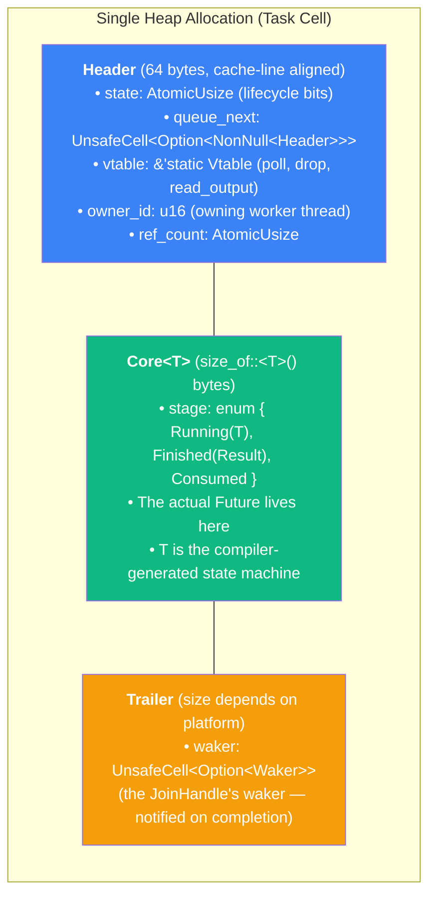

# 3. Anatomy of a Tokio Task 🟡

> **What you'll learn:**
> - What `tokio::spawn` actually allocates on the heap — the `Header`, `Core<T>`, and `Trailer` layout
> - How Tokio **type-erases** your `Future` into a raw pointer the scheduler can manipulate without knowing its concrete type
> - How intrusive linked lists allow run queues without per-element heap allocation
> - How atomic reference counting manages shared ownership between the `JoinHandle`, the scheduler, and the `Waker`

---

## What `tokio::spawn` Actually Does

When you write:

```rust
let handle = tokio::spawn(async {
    // your async code
    42
});
```

Tokio performs the following steps:

1. **Allocates** a single heap block containing the task's metadata, the future itself, and the join waker slot
2. **Type-erases** the future into a raw `NonNull<Header>` pointer that the scheduler can store without generic type parameters
3. **Pushes** the raw task pointer onto the current worker's run queue (or the global inject queue if called from outside the runtime)
4. **Returns** a `JoinHandle<i32>` that holds a reference to the same task allocation

The key design constraint: the scheduler must store tasks of *different* future types in the *same* queue. A `VecDeque<Box<dyn Future>>` would work but requires dynamic dispatch on every poll and doesn't support intrusive linking. Tokio's solution is more sophisticated.

---

## The Task Cell Memory Layout

Every spawned task is a single allocation with three contiguous regions:



### Why This Layout?

| Design Choice | Reason |
|--------------|--------|
| **Single allocation** | One `alloc::alloc` call per spawn. No separate allocations for metadata vs. future. Reduces allocator pressure and improves cache locality. |
| **Header first** | The scheduler only ever touches the `Header`. It never needs to know `T`. Casting `NonNull<Header>` to access metadata is a zero-offset pointer dereference. |
| **Cache-line aligned header** | The `state` and `queue_next` fields are accessed by multiple threads (scheduler, waker, join handle). Aligning to 64 bytes prevents false sharing with the `Core` data. |
| **Core in the middle** | The future's state machine is only accessed during `poll()` — by one thread at a time. No alignment requirements beyond `T`'s natural alignment. |
| **Trailer at the end** | The join waker is only needed when the task completes. Placing it at the end means most scheduler operations never touch this cache line. |

### The Vtable: Type Erasure

The `Header` contains a `&'static Vtable` pointer — this is how the scheduler polls, drops, and reads output from a task without knowing its type:

```rust
// Simplified from Tokio's source
struct Vtable {
    /// Poll the future. Called by the scheduler.
    poll: unsafe fn(NonNull<Header>),

    /// Drop the task and deallocate. Called when refcount hits zero.
    deallocate: unsafe fn(NonNull<Header>),

    /// Read the task's output (for JoinHandle::await).
    try_read_output: unsafe fn(NonNull<Header>, *mut (), &Waker),
}

// When spawning Task<T>, Tokio creates a static vtable:
impl<T: Future> Task<T> {
    const VTABLE: Vtable = Vtable {
        poll: Self::poll_inner,
        deallocate: Self::deallocate_inner,
        try_read_output: Self::try_read_output_inner,
    };
}

// The scheduler calls task.vtable.poll(task_ptr) — monomorphized
// at compile time for each Future type, but callable through
// a type-erased pointer at runtime.
```

This is the same pattern Rust uses for trait objects (`dyn Future`), but handcrafted. The difference: Tokio controls the vtable layout and can include operations specific to task lifecycle management (like atomic state transitions) that aren't part of the `Future` trait.

---

## The State Machine

Each task has an atomic `state` field packed into a `usize`. The bits encode the task's lifecycle:

```rust
// Simplified bit layout (actual Tokio uses more bits)
const RUNNING:   usize = 0b0001;  // Currently being polled by a worker
const SCHEDULED: usize = 0b0010;  // In a run queue, waiting to be polled
const COMPLETE:  usize = 0b0100;  // Future returned Poll::Ready
const CANCELLED: usize = 0b1000;  // JoinHandle was dropped (abort requested)

// Reference count is stored in the upper bits
const REF_COUNT_SHIFT: usize = 16;
const REF_ONE: usize = 1 << REF_COUNT_SHIFT;
```

State transitions use `compare_exchange` (CAS) to ensure correctness under concurrent access:

```rust
// Simplified: Transitioning from SCHEDULED to RUNNING
fn transition_to_running(header: &Header) -> bool {
    let mut current = header.state.load(Ordering::Acquire);
    loop {
        // Must be SCHEDULED to start running
        if current & SCHEDULED == 0 {
            return false; // Someone else already took it
        }
        let next = (current & !SCHEDULED) | RUNNING;
        match header.state.compare_exchange_weak(
            current, next,
            Ordering::AcqRel, Ordering::Acquire,
        ) {
            Ok(_) => return true,
            Err(actual) => current = actual, // Retry with updated value
        }
    }
}
```

The full lifecycle:

| Transition | When | Who | Atomic Operation |
|-----------|------|-----|-----------------|
| `→ SCHEDULED` | `tokio::spawn` called | Spawning thread | `fetch_or(SCHEDULED)` |
| `SCHEDULED → RUNNING` | Worker picks task from queue | Worker thread | CAS |
| `RUNNING → SCHEDULED` | `poll()` returns `Pending`, then `wake()` called | Waker holder | CAS |
| `RUNNING → COMPLETE` | `poll()` returns `Ready` | Worker thread | CAS |
| `* → CANCELLED` | `JoinHandle::abort()` called | Any thread | `fetch_or(CANCELLED)` |

---

## Intrusive Linked Lists

The run queue doesn't use `VecDeque<Box<Task>>`. Instead, each task's `Header` contains a `queue_next` pointer, forming an **intrusive linked list**:

```rust
// Inside Header:
queue_next: UnsafeCell<Option<NonNull<Header>>>,
```

**Intrusive** means the link pointer lives *inside* the element, not in a separate node. This has critical advantages:

| Property | `VecDeque<Box<Task>>` | Intrusive List |
|----------|----------------------|----------------|
| Allocation per enqueue | Box + possible Vec resize | **Zero** — the pointer is already in the Header |
| Cache behavior | Task and queue node in different cache lines | Task metadata and link in same cache line |
| Type requirements | Needs to own the task | Works with raw pointers — multiple queues can reference the same task |
| Remove from middle | O(n) | O(1) with back-pointer |

The tradeoff: intrusive lists are `unsafe` and a task can only be in **one** intrusive list at a time (it has only one `queue_next` pointer). Tokio avoids this limitation because a task should only ever be in one run queue at a time — enforced by the state machine.

---

## Atomic Reference Counting

A spawned task may be referenced by up to three owners simultaneously:

1. **The scheduler** (the run queue holds a pointer to the task)
2. **The `Waker`** (the waker holds a pointer to clone on `wake()`)
3. **The `JoinHandle`** (the caller can `.await` the result)

Tokio uses an atomic reference count embedded in the `state` field (upper bits) to track ownership. When the last reference is dropped, the task is deallocated.

```rust
// Simplified: Cloning a reference (e.g., when cloning a Waker)
fn ref_inc(header: &Header) {
    let prev = header.state.fetch_add(REF_ONE, Ordering::Relaxed);
    // Relaxed is sufficient because we already hold a reference —
    // the data is already "published" to us.
}

// Simplified: Dropping a reference
fn ref_dec(header: &Header) -> bool {
    let prev = header.state.fetch_sub(REF_ONE, Ordering::AcqRel);
    // AcqRel ensures:
    // - Acquire: we see all writes made before other threads dropped their refs
    // - Release: our writes are visible to the thread that deallocates

    let count = prev >> REF_COUNT_SHIFT;
    if count == 1 {
        // We were the last reference — deallocate
        // (The Acquire in fetch_sub synchronizes with all prior Releases)
        unsafe { (header.vtable.deallocate)(NonNull::from(header)) };
        return true;
    }
    false
}
```

### Why Not `Arc<Task>`?

`Arc` would work correctly but has two drawbacks:

1. **Separate allocation**: `Arc` allocates a control block separate from the data (or uses `Arc::new` which puts the refcount adjacent). Tokio needs the refcount in the `Header`, adjacent to the state bits, for atomic operations that touch both simultaneously.
2. **Custom drop behavior**: When a task completes, Tokio needs to drop the `Future` inside the `Core` *without* deallocating the task cell — the `JoinHandle` may still need to read the output. This requires decoupling "drop the future" from "deallocate the memory," which `Arc` doesn't support.

---

## The "What Tokio Does" vs. "Mental Model" Comparison

```rust
// The mental model (what you think happens):
let handle = tokio::spawn(my_future);
// "Spawns a task that runs my_future concurrently"

// What actually happens (simplified):
fn spawn<T: Future + Send + 'static>(future: T) -> JoinHandle<T::Output> {
    // 1. Allocate task cell: Header + Core<T> + Trailer
    let raw = RawTask::<T>::allocate(future);

    // 2. Initial state: SCHEDULED | (ref_count = 2)
    //    Two references: one for the scheduler, one for the JoinHandle
    raw.header().state.store(
        SCHEDULED | (2 << REF_COUNT_SHIFT),
        Ordering::Release,
    );

    // 3. Type-erase: throw away the type T, keep only NonNull<Header>
    let task_ref = TaskRef::from_raw(raw.header_ptr());

    // 4. Push to the current worker's local queue (or global if off-runtime)
    scheduler.push(task_ref);

    // 5. Return a JoinHandle that holds its own reference
    JoinHandle { raw, _marker: PhantomData }
}
```

---

<details>
<summary><strong>🏋️ Exercise: Estimate Task Allocation Size</strong> (click to expand)</summary>

**Challenge:** Given the following spawned task, calculate the approximate heap allocation size:

```rust
tokio::spawn(async {
    let mut buf = [0u8; 1024];
    let stream = TcpStream::connect("127.0.0.1:8080").await.unwrap();
    stream.readable().await.unwrap();
    let n = stream.try_read(&mut buf).unwrap();
    String::from_utf8_lossy(&buf[..n]).to_string()
});
```

Consider:
1. The `Header` size (estimate ~64 bytes for cache line alignment)
2. The `Core<T>` size — what does the compiler-generated state machine need to store?
3. The `Trailer` size (estimate ~16 bytes for the waker slot)

**Hint:** The state machine stores every variable that lives across an `.await` point.

<details>
<summary>🔑 Solution</summary>

```text
Analysis of the async state machine:

The compiler generates an enum with one variant per .await point:

enum MyFuture {
    // State 0: before first .await (TcpStream::connect)
    State0 {
        // buf lives across .await → captured
        buf: [u8; 1024],
        // connect_future: the future returned by TcpStream::connect
        connect_future: ConnectFuture,  // ~128 bytes (internal mio state)
    },
    // State 1: between connect.await and readable.await
    State1 {
        buf: [u8; 1024],
        stream: TcpStream,             // ~200 bytes (mio stream + tokio wrappers)
        readable_future: ReadyFuture,   // ~64 bytes
    },
    // State 2: after readable.await, before try_read (no more .awaits)
    State2 {
        buf: [u8; 1024],
        stream: TcpStream,
    },
    // Complete: stores the output String
    Complete(String),
}

// The enum is as large as its largest variant.
// Largest variant: State1
//   buf:              1024 bytes
//   stream:           ~200 bytes
//   readable_future:  ~64 bytes
//   discriminant:     8 bytes (alignment padding)
//   ≈ 1296 bytes

// Total allocation:
//   Header:     64 bytes  (cache-line aligned)
//   Core<T>:  ~1296 bytes (the state machine enum)
//   Trailer:   ~16 bytes  (join waker slot)
//   Padding:   ~8 bytes   (alignment)
//   ─────────────────────
//   Total:    ~1384 bytes per task

// Key insight: the 1024-byte buffer dominates the allocation.
// If you moved `buf` to a heap-allocated Vec, the state machine
// would only store a Vec (24 bytes) instead of [u8; 1024],
// reducing the task cell size to ~360 bytes.

// In practice, you can check with:
//   std::mem::size_of_val(&my_async_block)
// or use the -Zprint-type-sizes nightly flag.
```

**Rule of thumb:** Every local variable that lives across an `.await` point becomes a field in the generated state machine. Large stack arrays in async tasks are a common source of unexpectedly large task allocations. Prefer heap allocation (`Vec`, `Box<[u8]>`) for large buffers in async code.

</details>
</details>

---

> **Key Takeaways**
> - `tokio::spawn` allocates a **single** heap block containing `Header` + `Core<T>` + `Trailer`. The Header is cache-line aligned (64 bytes) and contains the atomic state, queue link, vtable pointer, and reference count.
> - **Type erasure** works via a `&'static Vtable` — a custom vtable stored in the Header that lets the scheduler `poll`, `drop`, and `read_output` without knowing the future's concrete type.
> - **Intrusive linked lists** avoid per-enqueue allocations — the `queue_next` pointer lives inside the Header, so pushing a task to a run queue is a zero-allocation operation.
> - **Atomic reference counting** in the upper bits of the state field manages shared ownership between the scheduler, waker, and JoinHandle. The task is deallocated only when the last reference is dropped.
> - Every local variable across an `.await` is captured in the state machine. Large stack arrays in async blocks cause large task allocations — prefer heap buffers.

> **See also:**
> - [Chapter 4: Wakers and Notification](ch04-wakers-and-notification.md) — how the Waker interacts with the task cell's state machine
> - [Chapter 6: The Work-Stealing Algorithm](ch06-work-stealing-algorithm.md) — how the intrusive queue_next pointer enables lock-free scheduling
> - [Async Rust](../async-book/src/SUMMARY.md) — the user-facing view of task spawning
