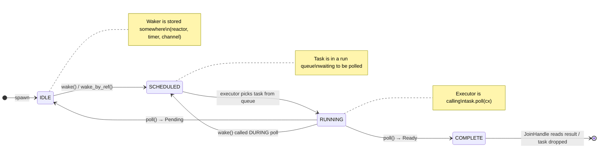

# 4. Wakers and Notification 🔴

> **What you'll learn:**
> - The four functions of `RawWakerVTable` (`clone`, `wake`, `wake_by_ref`, `drop`) and what each must do
> - How `wake()` atomically transitions a task's state and pushes it onto the executor's run queue
> - The complete task **state machine**: `IDLE → SCHEDULED → RUNNING → IDLE` (or `COMPLETE`), including edge cases like spurious wakes and concurrent wake-during-poll
> - How to build a custom `RawWakerVTable` from scratch that integrates with an executor

---

## The Waker Contract

The `std::task::Waker` is the *only* mechanism for a `Future` to communicate with its executor. When a future returns `Poll::Pending`, it is contractually obligated to have arranged for its `Waker` to be called when progress can be made. The executor, in turn, must re-poll the future after `wake()` is called.

But `Waker` is a concrete struct, not a trait — so how does it abstract over different executors? Through a **raw vtable**:

```rust
// From std::task (simplified)
pub struct Waker {
    waker: RawWaker,
}

pub struct RawWaker {
    /// A pointer to the executor-specific data (e.g., the task cell)
    data: *const (),
    /// A pointer to a static vtable with executor-specific implementations
    vtable: &'static RawWakerVTable,
}

pub struct RawWakerVTable {
    clone:       unsafe fn(*const ()) -> RawWaker,
    wake:        unsafe fn(*const ()),      // Takes ownership
    wake_by_ref: unsafe fn(*const ()),      // Borrows
    drop:        unsafe fn(*const ()),
}
```

This is essentially a hand-rolled trait object. The `data` pointer is the `self` and the `vtable` provides the methods. Rust chose this design over a `dyn Trait` because:

1. **`Waker` must be `Send + Sync`** — but `dyn Trait` objects have complex send/sync bounds
2. **`Waker` must be cloneable** — but `Clone` is not object-safe
3. **Minimal overhead** — two pointers, no heap allocation for the waker itself

---

## What Each VTable Function Does



### `clone(data) -> RawWaker`

Called when `Waker::clone()` is invoked. Must increment the task's reference count.

```rust
// Tokio's implementation (simplified)
unsafe fn clone_waker(data: *const ()) -> RawWaker {
    let header = &*(data as *const Header);

    // Increment reference count (Relaxed is fine — we already hold a ref)
    header.state.fetch_add(REF_ONE, Ordering::Relaxed);

    // Return a new RawWaker pointing to the same task
    RawWaker::new(data, &VTABLE)
}
```

**Why cloning happens:** I/O resources like `TcpStream` store a clone of the waker. If the stream is registered for both read and write readiness, each direction may need its own waker clone. Channels clone the waker when adding it to a wait list.

### `wake(data)`

Called when `Waker::wake()` is invoked. **Consumes** the waker (takes ownership). Must:
1. Transition the task from `IDLE` to `SCHEDULED`
2. Push the task onto a run queue
3. Decrement the reference count (the waker is consumed)

```rust
unsafe fn wake_waker(data: *const ()) {
    let header = &*(data as *const Header);

    // Atomically transition state: IDLE → SCHEDULED
    let prev = header.state.fetch_or(SCHEDULED, Ordering::AcqRel);

    if prev & (RUNNING | SCHEDULED | COMPLETE) == 0 {
        // Task was IDLE — push it onto the run queue
        // (If RUNNING, the executor will reschedule after poll returns)
        // (If SCHEDULED, it's already in a queue)
        // (If COMPLETE, ignore)
        scheduler_push(NonNull::from(header));
    }

    // Decrement ref count (wake consumes the Waker)
    // If this was the last ref, deallocate
    ref_dec(header);
}
```

### `wake_by_ref(data)`

Same as `wake` but **borrows** the waker. Does NOT decrement the reference count:

```rust
unsafe fn wake_by_ref_waker(data: *const ()) {
    let header = &*(data as *const Header);

    let prev = header.state.fetch_or(SCHEDULED, Ordering::AcqRel);

    if prev & (RUNNING | SCHEDULED | COMPLETE) == 0 {
        // Increment ref count FIRST — we're adding a queue reference
        // but NOT consuming the waker's reference
        header.state.fetch_add(REF_ONE, Ordering::Relaxed);
        scheduler_push(NonNull::from(header));
    }
    // Note: no ref_dec — the waker still exists
}
```

### `drop(data)`

Called when a `Waker` is dropped without being woken. Decrements the reference count:

```rust
unsafe fn drop_waker(data: *const ()) {
    let header = &*(data as *const Header);
    ref_dec(header);
}
```

---

## The Wake-During-Poll Problem

One of the trickiest cases in async runtime design: **what happens when `wake()` is called while the task is currently being polled?**

This is not hypothetical — it happens constantly. Consider:

```rust
async fn process(stream: &TcpStream) {
    // Inside poll_read, Tokio checks readiness. If data is already
    // available (common with edge-triggered I/O), the waker might
    // be triggered immediately during the same poll cycle.
    let data = stream.read(&mut buf).await;
    // ...
}
```

The race:

| Thread A (Executor) | Thread B (Reactor/Network) |
|---------------------|--------------------------|
| `task.poll(cx)` — state = RUNNING | |
| Inside poll, registers waker with reactor | |
| | Socket becomes readable |
| | Reactor calls `waker.wake()` |
| | `fetch_or(SCHEDULED)` — state = RUNNING \| SCHEDULED |
| | Does NOT push to queue (RUNNING bit is set) |
| `poll()` returns `Pending` | |
| Executor sees SCHEDULED bit: re-push to queue | |

The key insight: **when `wake()` is called on a RUNNING task, it sets the SCHEDULED bit but does NOT push to the queue**. The executor checks the SCHEDULED bit after `poll()` returns and re-enqueues the task itself. This avoids the task appearing in two queues simultaneously.

```rust
// Simplified: What the executor does after poll returns Pending
fn poll_task(worker: &Worker, task: TaskRef) {
    // Transition SCHEDULED → RUNNING
    transition_to_running(&task);

    // Poll the future
    let result = task.poll(cx);

    match result {
        Poll::Ready(output) => {
            // Store output, transition to COMPLETE, wake JoinHandle
            task.complete(output);
        }
        Poll::Pending => {
            // Clear RUNNING bit. Check if SCHEDULED was set during poll.
            let prev = task.header().state.fetch_and(!RUNNING, Ordering::AcqRel);

            if prev & SCHEDULED != 0 {
                // wake() was called during poll — re-enqueue immediately
                // No need to set SCHEDULED again, it's already set
                worker.local_queue.push(task);
            }
            // Otherwise: task is IDLE, waiting for a waker notification
        }
    }
}
```

---

## Spurious Wakes

A future **must** handle being polled even when no real progress can be made. This is called a **spurious wake** and is allowed by the `Future` contract:

```rust
// This is valid and happens in practice:
// 1. Two different I/O sources share the same waker
// 2. Source A becomes ready, wake() is called
// 3. Source B is not ready
// 4. The future is polled, checks source B first, gets WouldBlock
// 5. This is a spurious wake for source B — the future returns Pending

// Futures MUST handle this by checking readiness before doing work:
fn poll(self: Pin<&mut Self>, cx: &mut Context<'_>) -> Poll<()> {
    // Always re-check readiness — don't assume wake() means "ready"
    match self.stream.try_read(&mut self.buf) {
        Ok(n) => Poll::Ready(()),
        Err(ref e) if e.kind() == io::ErrorKind::WouldBlock => {
            // Spurious wake or partial readiness — register and wait
            self.stream.register_waker(cx.waker());
            Poll::Pending
        }
        Err(e) => Poll::Ready(()),
    }
}
```

---

## Building a Custom Waker from Scratch

Let's build a complete, working `Waker` implementation for a simple single-threaded executor. This is the foundation for Chapter 8's capstone.

```rust
use std::task::{Waker, RawWaker, RawWakerVTable, Context, Poll};
use std::collections::VecDeque;
use std::sync::{Arc, Mutex};
use std::future::Future;
use std::pin::Pin;

/// A task ID that the waker uses to re-enqueue the task.
type TaskId = usize;

/// Shared state between the executor and all wakers.
struct ExecutorState {
    /// Queue of task IDs ready to be polled.
    ready_queue: VecDeque<TaskId>,
}

/// Our executor-specific waker data.
struct WakerData {
    task_id: TaskId,
    state: Arc<Mutex<ExecutorState>>,
}

// ── The four vtable functions ───────────────────────────────────

unsafe fn clone_fn(data: *const ()) -> RawWaker {
    // Reconstruct the Arc, clone it, and leak both
    let arc = Arc::from_raw(data as *const WakerData);
    let cloned = arc.clone();
    // Don't drop the original — we're just cloning
    std::mem::forget(arc);
    RawWaker::new(Arc::into_raw(cloned) as *const (), &VTABLE)
}

unsafe fn wake_fn(data: *const ()) {
    // Takes ownership — reconstruct the Arc (will be dropped at end)
    let arc = Arc::from_raw(data as *const WakerData);
    let mut state = arc.state.lock().unwrap();
    state.ready_queue.push_back(arc.task_id);
    // arc is dropped here, decrementing the ref count
}

unsafe fn wake_by_ref_fn(data: *const ()) {
    // Borrows — reconstruct but don't drop
    let arc = Arc::from_raw(data as *const WakerData);
    {
        let mut state = arc.state.lock().unwrap();
        state.ready_queue.push_back(arc.task_id);
    }
    std::mem::forget(arc); // Don't drop — we don't own it
}

unsafe fn drop_fn(data: *const ()) {
    // Drop the Arc, decrementing the ref count
    drop(Arc::from_raw(data as *const WakerData));
}

static VTABLE: RawWakerVTable = RawWakerVTable::new(
    clone_fn,
    wake_fn,
    wake_by_ref_fn,
    drop_fn,
);

/// Create a Waker for a given task ID.
fn create_waker(task_id: TaskId, state: Arc<Mutex<ExecutorState>>) -> Waker {
    let data = Arc::new(WakerData { task_id, state });
    let raw = RawWaker::new(Arc::into_raw(data) as *const (), &VTABLE);
    // SAFETY: Our vtable functions correctly manage the Arc refcount
    unsafe { Waker::from_raw(raw) }
}
```

### Simplification with `std::task::Wake` (Rust 1.51+)

The above is educational but production code uses the `Wake` trait:

```rust
use std::task::Wake;
use std::sync::Arc;

struct MyWaker {
    task_id: TaskId,
    state: Arc<Mutex<ExecutorState>>,
}

impl Wake for MyWaker {
    fn wake(self: Arc<Self>) {
        let mut state = self.state.lock().unwrap();
        state.ready_queue.push_back(self.task_id);
    }

    fn wake_by_ref(self: &Arc<Self>) {
        let mut state = self.state.lock().unwrap();
        state.ready_queue.push_back(self.task_id);
    }
}

// Creating a Waker is now safe and ergonomic:
let waker = Arc::new(MyWaker { task_id: 0, state: exec_state.clone() });
let waker: Waker = waker.into();  // Uses the Wake trait implementation
```

**Tokio does NOT use the `Wake` trait** — it uses raw vtables because it needs the data pointer to be `NonNull<Header>` (the task cell pointer), not `Arc<dyn Wake>`. The raw vtable gives Tokio full control over allocation and reference counting.

---

## Atomic Orderings in the Waker

The choice of memory ordering in waker operations is critical for correctness. Here's a summary:

| Operation | Ordering | Why |
|-----------|----------|-----|
| `clone` → ref_inc | `Relaxed` | We already hold a reference; the data is already visible to us |
| `wake` → `fetch_or(SCHEDULED)` | `AcqRel` | **Release**: publish our "the socket is ready" knowledge. **Acquire**: see the current task state (might be RUNNING) |
| `wake` → ref_dec | `AcqRel` | Must synchronize with other threads that may deallocate |
| `drop` → ref_dec | `AcqRel` | Same reason — the last dropper must see all prior writes |
| Executor → read task output after COMPLETE | `Acquire` | Synchronizes with the `Release` in the wake that set COMPLETE |

Getting these wrong doesn't cause crashes on x86 (which has strong memory ordering by default) but **will** cause subtle bugs on ARM or RISC-V where hardware enforces weaker ordering.

---

<details>
<summary><strong>🏋️ Exercise: Build a Waker That Counts Wakes</strong> (click to expand)</summary>

**Challenge:** Build a complete, working `Waker` using the `Wake` trait that:

1. Tracks how many times `wake()` has been called for each task (store in an `AtomicUsize`)
2. Pushes the task ID onto a shared `ready_queue: Arc<Mutex<VecDeque<usize>>>`
3. Prints a warning if the same task is woken more than 100 times without being polled (potential busy-loop indicator)

Then write a test that:
- Creates a waker for task ID 7
- Clones it 3 times
- Calls `wake_by_ref()` on one clone
- Calls `wake()` on another (consuming it)
- Drops the third
- Asserts the ready_queue contains exactly `[7, 7]` (two wake calls)
- Asserts the wake count is 2

<details>
<summary>🔑 Solution</summary>

```rust
use std::collections::VecDeque;
use std::sync::atomic::{AtomicUsize, Ordering};
use std::sync::{Arc, Mutex};
use std::task::Wake;

struct DiagnosticWaker {
    task_id: usize,
    wake_count: AtomicUsize,
    ready_queue: Arc<Mutex<VecDeque<usize>>>,
}

impl DiagnosticWaker {
    fn new(task_id: usize, ready_queue: Arc<Mutex<VecDeque<usize>>>) -> Arc<Self> {
        Arc::new(Self {
            task_id,
            wake_count: AtomicUsize::new(0),
            ready_queue,
        })
    }

    fn get_wake_count(&self) -> usize {
        self.wake_count.load(Ordering::Relaxed)
    }
}

impl Wake for DiagnosticWaker {
    fn wake(self: Arc<Self>) {
        // Increment wake counter
        let count = self.wake_count.fetch_add(1, Ordering::Relaxed) + 1;

        // Warn on potential busy-loop
        if count > 100 {
            eprintln!(
                "⚠️  Task {} has been woken {} times without being polled — \
                 possible busy loop or spurious wake storm",
                self.task_id, count
            );
        }

        // Push to ready queue
        let mut queue = self.ready_queue.lock().unwrap();
        queue.push_back(self.task_id);
        // Arc<Self> is consumed here (dropped at end of fn)
    }

    fn wake_by_ref(self: &Arc<Self>) {
        let count = self.wake_count.fetch_add(1, Ordering::Relaxed) + 1;

        if count > 100 {
            eprintln!(
                "⚠️  Task {} has been woken {} times without being polled — \
                 possible busy loop or spurious wake storm",
                self.task_id, count
            );
        }

        let mut queue = self.ready_queue.lock().unwrap();
        queue.push_back(self.task_id);
        // Arc<Self> is NOT consumed — wake_by_ref borrows
    }
}

#[cfg(test)]
mod tests {
    use super::*;
    use std::task::Waker;

    #[test]
    fn test_diagnostic_waker() {
        let queue = Arc::new(Mutex::new(VecDeque::new()));
        let inner = DiagnosticWaker::new(7, queue.clone());

        // Convert to std::task::Waker
        let waker: Waker = inner.clone().into();

        // Clone it 3 times
        let clone1 = waker.clone();
        let clone2 = waker.clone();
        let clone3 = waker.clone();

        // wake_by_ref on clone1 (does not consume)
        clone1.wake_by_ref();

        // wake on clone2 (consumes clone2)
        clone2.wake();

        // Drop clone3 without waking
        drop(clone3);

        // Drop the originals
        drop(clone1);
        drop(waker);

        // Verify the ready queue
        let q = queue.lock().unwrap();
        assert_eq!(q.as_slices().0, &[7, 7]);
        assert_eq!(q.len(), 2, "Expected exactly 2 wake calls");

        // Verify the wake count
        assert_eq!(inner.get_wake_count(), 2, "Wake count should be 2");
    }
}
```

**Key observations:**
1. `wake()` takes `Arc<Self>` by value — the Arc's refcount is decremented when the function returns.
2. `wake_by_ref()` takes `&Arc<Self>` — the Arc is borrowed, not consumed.
3. The `AtomicUsize` counter uses `Relaxed` ordering because we don't need to synchronize any other data — it's just a diagnostic counter.
4. The 100-wake warning threshold is a useful production diagnostic for detecting tasks stuck in a wake loop.

</details>
</details>

---

> **Key Takeaways**
> - A `Waker` is a raw vtable pointer + data pointer. The four vtable functions (`clone`, `wake`, `wake_by_ref`, `drop`) manage reference counting and run-queue insertion.
> - `wake()` atomically sets the `SCHEDULED` bit via `fetch_or`. If the task is `RUNNING` (being polled), the bit is set but the task is NOT pushed to the queue — the executor handles re-enqueuing after `poll()` returns.
> - **Spurious wakes are legal.** Futures must always re-check readiness rather than assuming `wake()` means "your I/O is ready."
> - Tokio uses raw `RawWakerVTable` instead of the `Wake` trait for full control over the data pointer (pointing directly at the task `Header`) and reference counting (embedded in the task's atomic state field).
> - Memory ordering matters: `wake()` uses `AcqRel` to synchronize the "data is ready" knowledge with the executor thread that will poll the task.

> **See also:**
> - [Chapter 3: Anatomy of a Tokio Task](ch03-anatomy-of-a-tokio-task.md) — the task cell that the waker points to
> - [Chapter 5: Cooperative Scheduling](ch05-cooperative-scheduling-and-budgeting.md) — how the executor decides when to stop polling a task
> - [Chapter 8: Capstone](ch08-capstone-mini-runtime.md) — building a complete Waker + executor integration
