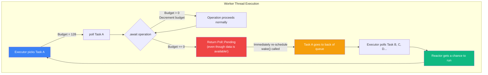

# 5. Cooperative Scheduling and Budgeting 🟡

> **What you'll learn:**
> - Why preemptive scheduling is impossible in user-space Rust async and why Tokio relies on **cooperative** scheduling
> - How the **cooperative budget** (128 operations per task poll) prevents a single task from starving the reactor and other tasks
> - How `tokio::coop` uses a thread-local counter to enforce yield points at every `.await`
> - How `tokio::task::yield_now()` and `tokio::task::consume_budget()` interact with the scheduler

---

## The Fundamental Problem

In a preemptive OS scheduler, the kernel can interrupt any thread at any time via a timer interrupt and switch to another thread. This guarantees fairness: no single thread can monopolize a CPU core indefinitely.

**Async Rust has no such mechanism.** Once the executor calls `task.poll(cx)`, it cannot interrupt the future — it must wait for `poll()` to return. A future that runs expensive computation between `.await` points will hold the executor hostage:

```rust
// 💥 STARVATION HAZARD: This task monopolizes the worker thread
tokio::spawn(async {
    loop {
        // Do 100ms of CPU work between each .await
        // During this 100ms, NO other task on this worker can run
        // and the reactor CANNOT poll for I/O events
        let batch = compute_heavy_batch(); // 💥 100ms of blocking CPU work

        sender.send(batch).await; // Only yields here
    }
});
```

But the problem is subtler than just CPU-bound work. Even "well-behaved" async code can starve other tasks:

```rust
// 💥 STARVATION HAZARD: Infinite stream without yielding
tokio::spawn(async {
    let listener = TcpListener::bind("0.0.0.0:8080").await?;
    loop {
        // If connections arrive faster than we can accept them,
        // this loop NEVER yields — accept() keeps returning Ready
        let (stream, _) = listener.accept().await?;
        tokio::spawn(handle(stream));
    }
});
```

In the second example, `accept()` returns `Poll::Ready` immediately if a connection is pending. If new connections arrive continuously, the `loop` never returns `Pending`, and the executor never gets a chance to poll other tasks or run the reactor.

---

## The Cooperative Budget

Tokio's solution: a **per-task budget** that forces yields at `.await` points. The budget is a thread-local counter that starts at **128** each time a task is polled. Every Tokio-aware `.await` operation (reads, writes, channel sends/receives, timer sleeps) **decrements the budget by 1**. When the budget hits zero, the operation returns `Poll::Pending` *even if it could make progress*, and the task's waker is immediately re-triggered.



### How It Works Internally

```rust
// Simplified from tokio::coop (the real code is in tokio/src/coop.rs)

use std::cell::Cell;

// Thread-local budget counter
thread_local! {
    static BUDGET: Cell<Option<u8>> = const { Cell::new(None) };
}

/// Called by the executor before polling a task.
/// Sets the budget to 128.
pub(crate) fn budget<R>(f: impl FnOnce() -> R) -> R {
    BUDGET.with(|cell| {
        // Save and replace the budget
        let prev = cell.get();
        cell.set(Some(128));
        let result = f();
        cell.set(prev);
        result
    })
}

/// Called by every Tokio-aware .await operation.
/// Returns Poll::Pending if the budget is exhausted.
pub(crate) fn poll_proceed(cx: &mut Context<'_>) -> Poll<()> {
    BUDGET.with(|cell| {
        match cell.get() {
            None => {
                // No budget set — we're outside the Tokio runtime
                // (e.g., in block_on or a non-Tokio executor)
                // Allow the operation to proceed without limit
                Poll::Ready(())
            }
            Some(0) => {
                // Budget exhausted! Force a yield.
                // Re-trigger the waker so we'll be polled again soon.
                cx.waker().wake_by_ref();
                Poll::Pending
            }
            Some(n) => {
                // Decrement budget and proceed
                cell.set(Some(n - 1));
                Poll::Ready(())
            }
        }
    })
}
```

Every Tokio I/O operation calls `poll_proceed` before doing real work:

```rust
// Simplified: Inside TcpStream::poll_read
fn poll_read(
    self: Pin<&mut Self>,
    cx: &mut Context<'_>,
    buf: &mut ReadBuf<'_>,
) -> Poll<io::Result<()>> {
    // ✅ Check the cooperative budget FIRST
    ready!(coop::poll_proceed(cx));

    // Now do the actual read
    match self.inner.try_read(buf) {
        Ok(()) => Poll::Ready(Ok(())),
        Err(ref e) if e.kind() == io::ErrorKind::WouldBlock => {
            self.register_waker(cx.waker());
            Poll::Pending
        }
        Err(e) => Poll::Ready(Err(e)),
    }
}
```

---

## What the Budget Prevents

### Before Cooperative Budgeting (Tokio < 0.3)

| Scenario | Behavior |
|----------|----------|
| Task reads from a socket in a tight loop | If data arrives faster than processing, the task never yields. All other tasks on this worker starve. |
| Task accepts connections in a loop | High connection rate = no yield = reactor can't process other timers or I/O |
| `tokio::sync::mpsc` receive loop | If sender is fast, receiver processes all messages without yielding |

### After Cooperative Budgeting (Tokio ≥ 0.3)

| Scenario | Behavior |
|----------|----------|
| Task reads from a socket in a tight loop | After 128 successful reads, forced yield. Other tasks run. Reactor polls. |
| Task accepts connections in a loop | After 128 accepts, forced yield. Fair scheduling across all tasks. |
| `tokio::sync::mpsc` receive loop | After 128 receives, forced yield. Producer doesn't observe backpressure but other tasks get CPU time. |

---

## `yield_now()` and `consume_budget()`

For cases where the budget system isn't sufficient, Tokio provides explicit yield APIs:

```rust
// Manual yield: unconditionally return Pending and re-schedule
tokio::task::yield_now().await;
// This always yields, regardless of remaining budget

// Budget consumption: decrement without actually yielding (unless budget = 0)
tokio::task::consume_budget().await;
// This is useful in computational loops that don't have natural .await points
```

### When to Use `yield_now()` vs. `consume_budget()`

| API | Use Case |
|-----|----------|
| `yield_now()` | You're doing CPU-heavy work and want to explicitly yield after each "chunk." Always yields, even with budget remaining. |
| `consume_budget()` | You're doing lightweight work in a tight loop and want the standard budget (128 iterations) to apply. Only yields when budget is exhausted. |

```rust
// ✅ FIX: Yielding in a computational loop
tokio::spawn(async {
    let data: Vec<Item> = get_large_dataset().await;

    for chunk in data.chunks(64) {
        // Process a chunk of 64 items (lightweight)
        for item in chunk {
            process(item);
        }
        // Let the budget system decide when to yield
        tokio::task::consume_budget().await;
    }
});
```

```rust
// ✅ FIX: Explicit yielding for heavy chunks
tokio::spawn(async {
    for i in 0..1000 {
        // Each iteration does ~1ms of CPU work
        let result = heavy_computation(i);
        save_result(result).await;

        // Yield every 10 iterations regardless of budget
        if i % 10 == 0 {
            tokio::task::yield_now().await;
        }
    }
});
```

---

## The Budget Escape Hatch: `unconstrained()`

Sometimes you need a task to run to completion without yielding — for example, when draining a channel during shutdown:

```rust
use tokio::task::unconstrained;

// ⚠️ Use with extreme caution — bypasses cooperative scheduling
tokio::spawn(async {
    // During graceful shutdown, drain all remaining messages
    // without yielding (we don't want new tasks to be scheduled)
    let remaining = unconstrained(async {
        let mut count = 0;
        while let Some(msg) = receiver.recv().await {
            process_final(msg);
            count += 1;
        }
        count
    }).await;

    println!("Drained {remaining} messages during shutdown");
});
```

`unconstrained()` removes the budget for the wrapped future. This is a sharp tool: it re-introduces the starvation risk that cooperative scheduling was designed to prevent. Use it only in well-understood, bounded contexts (like graceful shutdown).

---

## Measuring Budget in Production

Tokio's `tokio-console` tool shows per-task poll statistics, including how often tasks exhaust their budget:

```text
$ tokio-console
 ID │ polls │ busy     │ idle     │ budget exhaustions
────┼───────┼──────────┼──────────┼───────────────────
  1 │ 54382 │ 2.340s   │ 18.210s  │ 847               ← This task is hot
  2 │   127 │ 0.002s   │ 20.548s  │ 0
  3 │  3901 │ 0.450s   │ 20.100s  │ 12
```

A high "budget exhaustions" count means a task is frequently hitting the 128-operation limit. This isn't necessarily bad — it means the budget system is doing its job — but if one task has thousands of exhaustions while others have few, you may want to restructure the hot task to do less work per poll.

---

<details>
<summary><strong>🏋️ Exercise: Demonstrate Starvation and the Fix</strong> (click to expand)</summary>

**Challenge:** Write a Tokio program that demonstrates cooperative scheduling in action:

1. Spawn a "greedy" task that reads from an `mpsc` channel in a tight loop, counting messages
2. Spawn a "reporter" task that prints a timestamp every 100ms using `tokio::time::interval`
3. Spawn a "sender" task that sends 10,000 messages as fast as possible
4. Observe that the reporter task prints at roughly 100ms intervals even while the greedy task is consuming messages (because the budget forces yields)
5. Then wrap the greedy task's receive loop in `unconstrained()` and observe the reporter's timestamps — they should be irregular, proving starvation

<details>
<summary>🔑 Solution</summary>

```rust
use std::time::Instant;
use tokio::sync::mpsc;
use tokio::task::unconstrained;
use tokio::time::{interval, Duration};

#[tokio::main(flavor = "current_thread")]  // Single-threaded to make starvation visible
async fn main() {
    let (tx, mut rx) = mpsc::channel::<u64>(10_000);

    let start = Instant::now();

    // ── Reporter task: should tick every 100ms ──
    let reporter = tokio::spawn(async move {
        let mut ticker = interval(Duration::from_millis(100));
        for i in 0..10 {
            ticker.tick().await;
            let elapsed = start.elapsed().as_millis();
            println!("[reporter] tick {i} at {elapsed}ms");
        }
    });

    // ── Sender task: flood the channel ──
    let sender = tokio::spawn(async move {
        for i in 0..10_000u64 {
            // try_send to avoid blocking if channel is full
            let _ = tx.send(i).await;
        }
        println!("[sender] done sending 10,000 messages");
    });

    // ── Greedy consumer: with budget (fair) ──
    let consumer = tokio::spawn(async move {
        let mut count = 0u64;
        while let Some(_msg) = rx.recv().await {
            count += 1;
        }
        println!("[consumer] processed {count} messages");
    });

    // Wait for all tasks
    let _ = tokio::join!(reporter, sender, consumer);

    println!("\n--- Now try with unconstrained() ---\n");

    // ── Same setup but with unconstrained consumer ──
    let (tx2, mut rx2) = mpsc::channel::<u64>(10_000);
    let start2 = Instant::now();

    let reporter2 = tokio::spawn(async move {
        let mut ticker = interval(Duration::from_millis(100));
        for i in 0..10 {
            ticker.tick().await;
            let elapsed = start2.elapsed().as_millis();
            // ⚠️ Notice: timestamps will be irregular / delayed
            println!("[reporter2] tick {i} at {elapsed}ms");
        }
    });

    let sender2 = tokio::spawn(async move {
        for i in 0..10_000u64 {
            let _ = tx2.send(i).await;
        }
        println!("[sender2] done");
    });

    // 💥 STARVATION HAZARD: unconstrained removes the budget
    let consumer2 = tokio::spawn(async move {
        let mut count = 0u64;
        // This will consume ALL messages without yielding
        unconstrained(async {
            while let Some(_msg) = rx2.recv().await {
                count += 1;
            }
        }).await;
        println!("[consumer2] processed {count} messages");
    });

    let _ = tokio::join!(reporter2, sender2, consumer2);
}

// Expected output (approximately):
//
// [reporter] tick 0 at 0ms       ← Regular 100ms intervals
// [reporter] tick 1 at 100ms
// [reporter] tick 2 at 200ms     ← Budget ensures fair scheduling
// ...
// [consumer] processed 10000 messages
//
// --- Now try with unconstrained() ---
//
// [reporter2] tick 0 at 0ms
// [reporter2] tick 1 at 450ms    ← 💥 Delayed! Consumer starved the reporter
// [reporter2] tick 2 at 451ms    ← Burst of ticks after starvation ends
// ...
```

**What's happening:**
1. In the fair version, `mpsc::recv()` calls `poll_proceed()` internally. After 128 receives, the budget is exhausted, the consumer yields, and the reporter/sender get CPU time.
2. In the `unconstrained()` version, the budget is disabled. The consumer processes all available messages without yielding, delaying the reporter's interval ticks by hundreds of milliseconds.

</details>
</details>

---

> **Key Takeaways**
> - Async Rust is **cooperatively scheduled** — the executor cannot preempt a running future. Every `.await` is a potential yield point, but only if the inner future returns `Pending`.
> - Tokio's **cooperative budget** (128 operations) prevents any single task from starving others. Every Tokio I/O/channel/timer operation decrements a thread-local counter; at zero, the operation returns `Pending` and immediately re-wakes the task.
> - `yield_now()` unconditionally yields; `consume_budget()` yields only when the budget is exhausted. Use `consume_budget()` in lightweight loops and `yield_now()` between heavy computations.
> - `unconstrained()` disables the budget for a wrapped future — use it only in bounded contexts like graceful shutdown. Misuse re-introduces starvation.
> - Monitor budget exhaustions via `tokio-console`. High counts indicate a task that frequently hits the limit — consider restructuring it.

> **See also:**
> - [Chapter 2: The Reactor and the Parker](ch02-reactor-and-parker.md) — why reactor starvation matters
> - [Chapter 6: The Work-Stealing Algorithm](ch06-work-stealing-algorithm.md) — how the scheduler distributes tasks after a yield
> - [Async Rust](../async-book/src/SUMMARY.md) — the user-facing async model and .await points
