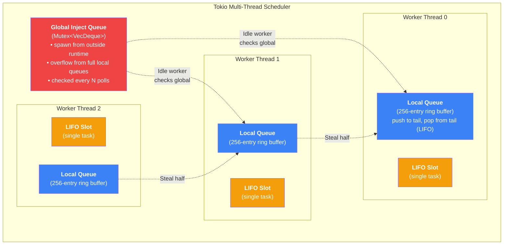

# 6. The Work-Stealing Algorithm 🔴

> **What you'll learn:**
> - The three data structures at the heart of Tokio's scheduler: the **Global Inject Queue**, the **Thread-Local Run Queue**, and the **LIFO Slot**
> - How idle workers **steal half** the tasks from a sibling's local queue using a lock-free CAS loop on circular buffer indices
> - Why the LIFO slot optimization reduces cache misses by ~30% for newly spawned tasks
> - CPU cache implications of work-stealing and why "steal half" is optimal

---

## Why Work-Stealing?

The simplest multi-threaded executor puts all tasks on a single shared queue protected by a mutex. Every worker thread locks the mutex, pops a task, unlocks, and executes it. This works but has devastating performance:

| Design | Mutex Contention | Cache Behavior | Scalability |
|--------|-----------------|----------------|-------------|
| **Single shared queue** | Every pop/push contends | Task data cold in L1/L2 after migration | O(1) but constant is high |
| **Pre-assigned queues** (round-robin) | Zero contention | Good locality | Bad load balancing (one thread idle while another is full) |
| **Work-stealing** (Tokio's design) | Near-zero on fast path | Excellent locality on fast path; acceptable on steal | Best of both worlds |

Work-stealing gives each thread its own queue (fast, contention-free) but allows idle threads to steal from busy threads (fair, load-balanced). The design comes from the 1999 paper by Blumofe and Leiserson ("Scheduling Multithreaded Computations by Work Stealing") and is used by Go, Java's ForkJoinPool, Intel TBB, and Tokio.

---

## The Three Queue Data Structures



### 1. The Global Inject Queue

A mutex-protected `VecDeque` shared by all workers.

| Property | Value |
|----------|-------|
| **Type** | `Mutex<VecDeque<TaskRef>>` |
| **Producers** | Any thread — `tokio::spawn` from outside the runtime, overflow from full local queues |
| **Consumers** | Worker threads, checked every `global_queue_interval` (default: 31 task polls) |
| **Contention** | Low — only accessed when local queues are empty or on the periodic check |

Workers check the global queue every **31 polls** (configurable). This prevents a hot worker from monopolizing locally-spawned tasks while tasks in the global queue starve.

```rust
// Simplified: Worker main loop polling check
fn poll_next_task(&mut self) -> Option<TaskRef> {
    self.tick += 1;

    // Every 31 polls, check the global queue first (fairness)
    if self.tick % self.global_queue_interval == 0 {
        if let Some(task) = self.global_queue.lock().pop_front() {
            return Some(task);
        }
    }

    // Fast path: check LIFO slot, then local queue
    self.lifo_slot.take()
        .or_else(|| self.local_queue.pop())
        .or_else(|| self.global_queue.lock().pop_front())
        .or_else(|| self.steal_from_sibling())
}
```

### 2. The Thread-Local Run Queue

A fixed-size **circular buffer** (ring buffer) of 256 entries, optimized for single-producer, multi-consumer access:

```rust
// Simplified layout
struct LocalQueue {
    /// Written by owner, read by stealers. Atomic.
    head: AtomicU32,
    /// Written by owner only (during push). Atomic for visibility to stealers.
    tail: AtomicU32,
    /// Fixed-size array of task pointers. Power-of-two for fast modulo.
    buffer: [UnsafeCell<MaybeUninit<TaskRef>>; 256],
}
```

| Operation | Who | Lock-free? | Complexity |
|-----------|-----|------------|------------|
| `push` (at tail) | Owner thread only | Yes — single atomic store | O(1) |
| `pop` (from tail, LIFO) | Owner thread only | Yes — single atomic load + CAS | O(1) |
| `steal_half` (from head, FIFO) | Any idle worker | Yes — CAS loop on head | O(k) where k = stolen count |

The key insight: the owner pushes and pops from the **tail** (LIFO order), while stealers take from the **head** (FIFO order). This means:

- **Local execution is LIFO**: the most recently spawned task runs first (cache-hot)
- **Stolen tasks are FIFO**: the oldest tasks (most likely I/O-bound, waiting longest) are stolen first

### 3. The LIFO Slot

A single-task "slot" that holds the most recently spawned task from the current worker:

```rust
struct LifoSlot {
    task: UnsafeCell<Option<TaskRef>>,
}
```

When a task is spawned from within a worker thread, it goes to the LIFO slot first (displacing any previous occupant to the local queue). When the executor looks for work, it checks the LIFO slot before the local queue.

**Why this matters for performance:** When a task spawns a child (e.g., `tokio::spawn(handle_request(conn))`), the child is the most temporally related task. Running it immediately (LIFO slot) means:

1. The parent's data is still in L1 cache
2. The child likely shares data pointers with the parent
3. The child's future state machine was just allocated — memory is cache-hot

Measurements show the LIFO slot **reduces cache misses by ~30%** for request-per-connection server patterns.

---

## The Work-Stealing CAS Loop

When a worker's local queue and LIFO slot are empty (and the global queue is empty), it tries to steal from a sibling. Here's the algorithm:

```rust
// Simplified from Tokio's source
impl LocalQueue {
    /// Steal half the tasks from this queue into `dst`.
    /// Called by a DIFFERENT thread than the owner.
    fn steal_into(&self, dst: &LocalQueue) -> Option<TaskRef> {
        // 1. Read the victim's head and tail
        //    Acquire ordering: see the tasks that were pushed
        let mut head = self.head.load(Ordering::Acquire);
        let tail = self.tail.load(Ordering::Acquire);

        // 2. Calculate available tasks
        let count = tail.wrapping_sub(head);
        if count == 0 {
            return None; // Nothing to steal
        }

        // 3. Steal half (rounded up)
        let steal_count = (count + 1) / 2;

        // 4. Read the first task (this will be returned directly)
        let first = unsafe {
            self.buffer[(head as usize) % 256].get().read().assume_init()
        };

        // 5. Copy the remaining (steal_count - 1) tasks to our local queue
        for i in 1..steal_count {
            let idx = (head.wrapping_add(i) as usize) % 256;
            let task = unsafe {
                self.buffer[idx].get().read().assume_init()
            };
            dst.push_back_unchecked(task);
        }

        // 6. Atomically advance the head by steal_count
        //    This is the critical CAS: if the owner also popped (from tail),
        //    no conflict. If another stealer is racing us, one CAS fails.
        let new_head = head.wrapping_add(steal_count);
        match self.head.compare_exchange(
            head,
            new_head,
            Ordering::AcqRel,
            Ordering::Acquire,
        ) {
            Ok(_) => Some(first), // Steal succeeded
            Err(_) => {
                // Another stealer (or the owner via pop-from-head) beat us.
                // We need to "return" the tasks we read. In practice,
                // Tokio retries the entire steal operation.
                None // Simplified — real code retries
            }
        }
    }
}
```

### Why Steal Half?

Stealing a single task results in many steal operations and cross-thread cache traffic. Stealing all tasks would leave the victim with nothing. Stealing half is optimal because:

1. **Amortized overhead**: One steal operation (one CAS, one cross-core cache line transfer) moves half the victim's queue at once
2. **Load balance**: After the steal, both threads have approximately equal work
3. **CPU cache cost**: Each stolen task's data will be cold in the stealer's L1 cache. Stealing half limits the cold-cache penalty to half the victim's queue size

| Strategy | Steals per rebalance | Cache misses | Load balance |
|----------|---------------------|--------------|--------------|
| Steal 1 | Many (N/2 steals to fully balance) | Low per steal, high total | Gradual, many round-trips |
| Steal half | 1 steal to fully balance | Moderate (one batch) | Immediate equilibrium |
| Steal all | 1 steal | High (entire queue is cold) | Inverts the imbalance |

---

## The Complete Worker Main Loop

Putting it all together, here's the complete decision tree a Tokio worker follows on every iteration:

```rust
// Simplified Tokio worker main loop
fn run_worker(worker: &mut Worker) {
    loop {
        worker.tick = worker.tick.wrapping_add(1);

        // Phase 0: Periodic global queue check (fairness)
        if worker.tick % 31 == 0 {
            if let Some(task) = worker.inject_queue.lock().pop_front() {
                run_task(worker, task);
                continue;
            }
        }

        // Phase 1: LIFO slot (best cache locality)
        if let Some(task) = worker.lifo_slot.take() {
            run_task(worker, task);
            continue;
        }

        // Phase 2: Local queue (still good locality)
        if let Some(task) = worker.local_queue.pop() {
            run_task(worker, task);
            continue;
        }

        // Phase 3: Global inject queue
        if let Some(task) = worker.inject_queue.lock().pop_front() {
            run_task(worker, task);
            continue;
        }

        // Phase 4: Work stealing from a random sibling
        let sibling_count = worker.siblings.len();
        let start = random_index(sibling_count);
        for i in 0..sibling_count {
            let idx = (start + i) % sibling_count;
            if idx == worker.index { continue; } // Don't steal from self
            if let Some(task) = worker.siblings[idx].steal_into(&worker.local_queue) {
                run_task(worker, task);
                break;
            }
        }

        // Phase 5: No work anywhere — park the thread
        // (This runs the reactor and blocks on epoll_wait)
        worker.park();
    }
}

fn run_task(worker: &mut Worker, task: TaskRef) {
    // Set up the cooperative budget (Chapter 5)
    coop::budget(|| {
        // Transition SCHEDULED → RUNNING
        task.transition_to_running();

        // Create a Waker pointing to this task (Chapter 4)
        let waker = task.make_waker();
        let mut cx = Context::from_waker(&waker);

        // Poll the future
        match task.poll(&mut cx) {
            Poll::Ready(output) => {
                task.complete(output);
            }
            Poll::Pending => {
                // Check if wake() was called during poll
                if task.is_scheduled() {
                    // Re-enqueue immediately
                    worker.local_queue.push(task);
                }
                // Otherwise: task is idle, waiting for a Waker notification
            }
        }
    });
}
```

---

## `tokio::spawn` Push Path

When code running on a worker thread calls `tokio::spawn(task)`, the push path is:

```rust
fn spawn_local(worker: &mut Worker, task: TaskRef) {
    // 1. Try the LIFO slot first (fast path)
    if let Some(displaced) = worker.lifo_slot.swap(Some(task)) {
        // LIFO slot was occupied — push the displaced task to local queue
        push_to_local_or_overflow(worker, displaced);
    }
}

fn push_to_local_or_overflow(worker: &mut Worker, task: TaskRef) {
    if worker.local_queue.push(task).is_err() {
        // Local queue is full (256 entries) — overflow to global
        // Move half the local queue to global to make room
        let mut global = worker.inject_queue.lock();
        let to_move = worker.local_queue.len() / 2;
        for _ in 0..to_move {
            if let Some(t) = worker.local_queue.pop_front() {
                global.push_back(t);
            }
        }
        // Now push the new task to local
        let _ = worker.local_queue.push(task);
    }
}
```

The overflow strategy is important: when the local queue is full, Tokio moves **half** the local tasks to the global queue. This ensures:
1. The local queue has room for new tasks
2. Other workers can pick up overflow tasks from the global queue
3. We don't pay the mutex cost on every push — only on overflow

---

## Atomic Memory Orderings in the Scheduler

The work-stealing queue is one of the most ordering-sensitive data structures in Tokio:

| Operation | Variable | Ordering | Justification |
|-----------|----------|----------|--------------|
| Owner push | `tail` store | `Release` | Stealers must see the task data written before `tail` advances |
| Owner pop | `head` CAS | `AcqRel` | Must synchronize with stealers' CAS on the same `head` |
| Stealer read | `tail` load | `Acquire` | Pairs with owner's `Release` store — see the pushed tasks |
| Stealer steal | `head` CAS | `AcqRel` | Mutually exclusive with other stealers and owner's pop |

**Why not `SeqCst` everywhere?** `SeqCst` imposes a total order on all atomic operations across all threads. This is much stronger than needed and adds unnecessary memory fence instructions. `Acquire`/`Release` pairs are sufficient because the work-stealing queue only needs *pairwise* synchronization between the owner and each stealer, not a global total order.

On x86, `Acquire` and `Release` are essentially free (x86 has a strong memory model). On ARM and RISC-V, they compile to `dmb` (data memory barrier) instructions, which cost 10–100 ns. Using `Relaxed` where `Acquire` is needed would be unsound on these architectures.

---

<details>
<summary><strong>🏋️ Exercise: Implement a Lock-Free Work-Stealing Queue</strong> (click to expand)</summary>

**Challenge:** Implement a simplified work-stealing double-ended queue (deque) with:

1. A fixed-size circular buffer of 64 entries
2. `push(item)` — push to the tail (owner only)
3. `pop() -> Option<item>` — pop from the tail (owner only, LIFO)
4. `steal() -> Option<item>` — steal from the head (other threads, FIFO)

Use `AtomicU32` for head and tail indices. The owner thread uses LIFO pop (same end as push), while stealers use FIFO steal (opposite end).

**Constraint:** No mutexes. Use only `compare_exchange` for concurrent access.

<details>
<summary>🔑 Solution</summary>

```rust
use std::cell::UnsafeCell;
use std::mem::MaybeUninit;
use std::sync::atomic::{AtomicU32, Ordering};

const SIZE: usize = 64;
const MASK: u32 = (SIZE as u32) - 1; // 63, for fast modulo via bitwise AND

/// A lock-free work-stealing deque.
/// - Owner: push and pop from the tail (LIFO)
/// - Stealers: steal from the head (FIFO)
pub struct WorkStealDeque<T> {
    /// Index of the next slot to steal from.
    /// Modified by stealers (CAS) and owner (during pop when queue is nearly empty).
    head: AtomicU32,
    /// Index of the next slot to push into.
    /// Modified only by the owner.
    tail: AtomicU32,
    /// Fixed-size circular buffer.
    buffer: [UnsafeCell<MaybeUninit<T>>; SIZE],
}

// SAFETY: The work-stealing protocol ensures correct synchronization.
// T must be Send because tasks can be stolen by other threads.
unsafe impl<T: Send> Send for WorkStealDeque<T> {}
unsafe impl<T: Send> Sync for WorkStealDeque<T> {}

impl<T> WorkStealDeque<T> {
    pub fn new() -> Self {
        Self {
            head: AtomicU32::new(0),
            tail: AtomicU32::new(0),
            buffer: std::array::from_fn(|_| UnsafeCell::new(MaybeUninit::uninit())),
        }
    }

    /// Push an item onto the tail. Owner thread only.
    /// Returns Err if the queue is full.
    pub fn push(&self, item: T) -> Result<(), T> {
        let tail = self.tail.load(Ordering::Relaxed);
        let head = self.head.load(Ordering::Acquire);

        // Check if full
        if tail.wrapping_sub(head) >= SIZE as u32 {
            return Err(item);
        }

        // Write the item into the buffer
        let idx = (tail & MASK) as usize;
        unsafe {
            (*self.buffer[idx].get()).write(item);
        }

        // Publish the item by advancing tail
        // Release: stealers must see the item before they see the new tail
        self.tail.store(tail.wrapping_add(1), Ordering::Release);

        Ok(())
    }

    /// Pop an item from the tail (LIFO). Owner thread only.
    pub fn pop(&self) -> Option<T> {
        let mut tail = self.tail.load(Ordering::Relaxed);

        // Speculatively decrement tail
        tail = tail.wrapping_sub(1);
        self.tail.store(tail, Ordering::SeqCst);
        // SeqCst here creates a total order between this store and
        // stealers' CAS on head, preventing a race where both owner
        // and stealer think they got the last item.

        let head = self.head.load(Ordering::SeqCst);

        if head.wrapping_sub(tail.wrapping_add(1)) < SIZE as u32 {
            // Not empty case (tail >= head after adjustment means items exist)
        }

        let count = tail.wrapping_add(1).wrapping_sub(head);

        if count == 0 {
            // Queue was already empty — restore tail
            self.tail.store(tail.wrapping_add(1), Ordering::Relaxed);
            return None;
        }

        let idx = (tail & MASK) as usize;

        if count > 1 {
            // Multiple items — no contention with stealers
            // (stealers take from head, we take from tail)
            let item = unsafe { (*self.buffer[idx].get()).assume_init_read() };
            return Some(item);
        }

        // count == 1: Race with stealers for the last item
        // Use CAS on head to resolve the race
        match self.head.compare_exchange(
            head,
            head.wrapping_add(1),
            Ordering::SeqCst,
            Ordering::Relaxed,
        ) {
            Ok(_) => {
                // We won the race — take the item
                let item = unsafe { (*self.buffer[idx].get()).assume_init_read() };
                // Restore tail to after head (queue is now empty)
                self.tail.store(head.wrapping_add(1), Ordering::Relaxed);
                Some(item)
            }
            Err(_) => {
                // A stealer took it — queue is empty
                self.tail.store(head.wrapping_add(1), Ordering::Relaxed);
                None
            }
        }
    }

    /// Steal an item from the head (FIFO). Called by other threads.
    pub fn steal(&self) -> Option<T> {
        let mut head = self.head.load(Ordering::Acquire);

        loop {
            let tail = self.tail.load(Ordering::Acquire);

            // Check if empty
            if head == tail {
                return None;
            }

            // Read the item at head
            let idx = (head & MASK) as usize;
            let item = unsafe { (*self.buffer[idx].get()).assume_init_read() };

            // Try to advance head
            match self.head.compare_exchange_weak(
                head,
                head.wrapping_add(1),
                Ordering::AcqRel,
                Ordering::Acquire,
            ) {
                Ok(_) => return Some(item),
                Err(actual) => {
                    // Another stealer (or owner pop) advanced head.
                    // The item we read may be invalid — discard and retry.
                    std::mem::forget(item); // Don't drop potentially invalid item
                    head = actual;
                }
            }
        }
    }

    /// Number of items currently in the queue (approximate under concurrency).
    pub fn len(&self) -> u32 {
        let tail = self.tail.load(Ordering::Relaxed);
        let head = self.head.load(Ordering::Relaxed);
        tail.wrapping_sub(head)
    }
}

#[cfg(test)]
mod tests {
    use super::*;
    use std::sync::Arc;

    #[test]
    fn test_push_pop() {
        let q = WorkStealDeque::<u32>::new();
        q.push(1).unwrap();
        q.push(2).unwrap();
        q.push(3).unwrap();

        // LIFO order
        assert_eq!(q.pop(), Some(3));
        assert_eq!(q.pop(), Some(2));
        assert_eq!(q.pop(), Some(1));
        assert_eq!(q.pop(), None);
    }

    #[test]
    fn test_steal() {
        let q = Arc::new(WorkStealDeque::<u32>::new());
        q.push(1).unwrap();
        q.push(2).unwrap();
        q.push(3).unwrap();

        // FIFO order for stealers
        assert_eq!(q.steal(), Some(1));
        assert_eq!(q.steal(), Some(2));

        // Owner pops LIFO
        assert_eq!(q.pop(), Some(3));
        assert_eq!(q.pop(), None);
    }

    #[test]
    fn test_concurrent_steal() {
        let q = Arc::new(WorkStealDeque::<u32>::new());
        for i in 0..64 {
            q.push(i).unwrap();
        }

        let q2 = q.clone();
        let stealer = std::thread::spawn(move || {
            let mut stolen = vec![];
            while let Some(v) = q2.steal() {
                stolen.push(v);
            }
            stolen
        });

        let mut popped = vec![];
        while let Some(v) = q.pop() {
            popped.push(v);
        }

        let stolen = stealer.join().unwrap();
        let mut all: Vec<u32> = stolen.into_iter().chain(popped).collect();
        all.sort();

        // Every item should appear exactly once
        assert_eq!(all, (0..64).collect::<Vec<_>>());
    }
}
```

**Key design decisions:**
1. `push` uses `Relaxed` load for tail (only owner writes tail) and `Acquire` load for head (must see stealers' advances).
2. `pop` uses `SeqCst` for the tail store and head load to create a total order that prevents both owner and stealer from claiming the same last item.
3. `steal` uses a CAS loop with `compare_exchange_weak` (allows spurious failures for performance on ARM).
4. When the steal CAS fails, we `mem::forget` the item we read because it may have already been taken by another thread.

</details>
</details>

---

> **Key Takeaways**
> - Tokio's multi-thread scheduler uses three data structures: a **mutex-protected global queue** (for cross-thread spawns and overflow), **per-thread local queues** (256-entry lock-free ring buffers), and a **LIFO slot** (single-task cache optimization).
> - The fast path (LIFO slot → local queue) is lock-free and branch-predicted. The medium path (global queue) takes a mutex. The slow path (work-stealing) uses a CAS loop to steal **half** the victim's tasks.
> - **Steal half** is optimal: one steal operation rebalances two threads to equilibrium, minimizing cross-core cache traffic while maximizing load balance.
> - The **LIFO slot** exploits temporal locality — the most recently spawned task shares cache lines with its parent, reducing L1 misses by ~30%.
> - Memory orderings are precisely chosen: `Release`/`Acquire` pairs for producer-consumer synchronization, `SeqCst` only for the owner-stealer race on the last item.

> **See also:**
> - [Chapter 3: Anatomy of a Tokio Task](ch03-anatomy-of-a-tokio-task.md) — the intrusive queue_next pointer that enables lock-free enqueue
> - [Chapter 5: Cooperative Scheduling](ch05-cooperative-scheduling-and-budgeting.md) — how the budget interacts with the scheduler's poll loop
> - [Chapter 8: Capstone](ch08-capstone-mini-runtime.md) — implementing work-stealing in the mini runtime
> - [Concurrency in Rust](../concurrency-book/src/SUMMARY.md) — fundamentals of atomics and memory ordering
