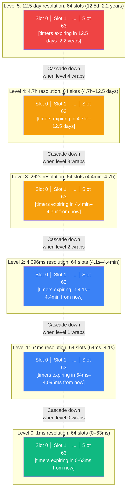

# 7. The Timer Wheel 🔴

> **What you'll learn:**
> - How `tokio::time::sleep` works without creating an OS thread per timer
> - The **Hashed Hierarchical Timing Wheel** algorithm: O(1) insert, O(1) cancel, O(1) amortized expiration
> - How the reactor thread advances the wheel and computes the minimum sleep duration for `epoll_wait`
> - The interaction between the timer system and the park/unpark protocol

---

## The Problem: Millions of Timers

Every `tokio::time::sleep()`, `tokio::time::timeout()`, and `tokio::time::interval()` creates a timer. A high-throughput server might have hundreds of thousands of active timers simultaneously (connection idle timeouts, request deadlines, retry backoffs, keepalive pings).

Naïve approaches don't scale:

| Approach | Insert | Cancel | Find expired | Problem |
|----------|--------|--------|-------------|---------|
| `BTreeMap<Instant, Task>` | O(log n) | O(log n) | O(k + log n) | Log factor on every operation; cache-hostile tree traversal |
| `BinaryHeap<(Instant, Task)>` | O(log n) | O(n)** | O(k log n) | **Cancel requires scanning to find the entry |
| Sorted `Vec` | O(n) | O(n) | O(k) | Linear insert/cancel |
| `Vec` + linear scan | O(1) | O(1)* | O(n) | *Need epoch-based GC; scan ALL timers every tick |

Tokio needs O(1) for all three operations. The solution: a **Hashed Hierarchical Timing Wheel**.

---

## The Timing Wheel Concept

A timing wheel is a circular array (like a clock face) where each slot holds a list of timers that expire at that time unit. A cursor advances through the wheel one slot per tick.

### Single-Level Wheel (Simplified)

```
Wheel with 8 slots, 1ms per slot:

  Slot 0 │  Slot 1 │  Slot 2 │  Slot 3 │  Slot 4 │  Slot 5 │  Slot 6 │  Slot 7
  ─────────────────────────────────────────────────────────────────────────────────
  [T1,T2] │  []     │  [T3]   │  []     │  [T4]   │  []     │  []     │  [T5]
                                    ↑
                                  cursor (current tick = 3)

  Next tick: advance cursor to slot 3.
  Fire all timers in slot 3 → [empty]
  Advance to slot 4: fire T4.
  ...
```

**Insert**: `slot = (deadline_ms / tick_duration) % wheel_size`. Push timer to that slot's list. **O(1)**.

**Cancel**: Remove timer from its slot's list. With intrusive doubly-linked lists, this is **O(1)**.

**Expire**: At each tick, fire all timers in the current slot. **O(k)** where k = number of expired timers. Amortized **O(1)** per timer.

### The Problem with a Single Level

An 8-slot wheel with 1ms resolution can only handle timers up to 8ms in the future. For a 24-hour timeout (86,400,000 ms), you'd need 86 million slots — absurd.

---

## Hierarchical Timing Wheels

The solution: multiple levels of wheels, like a clock with seconds, minutes, and hours hands.



Tokio uses 6 levels with 64 slots each (6 × 64 = 384 slots total). The levels represent progressively coarser time resolutions:

| Level | Resolution | Range | Use case |
|-------|-----------|-------|----------|
| 0 | 1 ms | 0 – 64 ms | TCP retransmit timers, microbenchmarks |
| 1 | 64 ms | 64 ms – 4.1 s | Request timeouts, short sleeps |
| 2 | ~4.1 s | 4.1 s – 4.4 min | Connection idle timeouts |
| 3 | ~4.4 min | 4.4 min – 4.7 hr | Session timeouts |
| 4 | ~4.7 hr | 4.7 hr – 12.5 days | Long-lived background timers |
| 5 | ~12.5 days | 12.5 days – 2.2 years | Probably a bug, but handled gracefully |

### The Cascade Operation

When the cursor on Level 0 wraps around (every 64 ms), the next slot on Level 1 is **cascaded**: its timers are moved down to the appropriate Level 0 slots.

```rust
// Simplified cascading logic
fn advance_wheel(wheel: &mut TimerWheel, now: Instant) {
    let elapsed_ms = now.duration_since(wheel.start).as_millis() as u64;

    // Advance level 0 cursor
    while wheel.level0_cursor < elapsed_ms {
        let slot = (wheel.level0_cursor % 64) as usize;

        // Fire all timers in this slot
        for timer in wheel.levels[0][slot].drain() {
            if timer.deadline <= now {
                timer.waker.wake();
            } else {
                // Timer is in the future (possible after cascade) — reinsert
                insert_timer(wheel, timer);
            }
        }

        wheel.level0_cursor += 1;

        // Check if we need to cascade from higher levels
        if wheel.level0_cursor % 64 == 0 {
            cascade_level(wheel, 1, elapsed_ms);
        }
    }
}

fn cascade_level(wheel: &mut TimerWheel, level: usize, now_ms: u64) {
    if level >= 6 { return; }

    let resolution = 64u64.pow(level as u32); // 64^level ms per slot
    let slot = ((now_ms / resolution) % 64) as usize;

    // Move all timers from this higher-level slot to the appropriate lower-level slots
    for timer in wheel.levels[level][slot].drain() {
        // Reinsert at the correct lower level
        insert_at_level(wheel, level - 1, timer);
    }

    // Recurse if this level also wrapped
    if (now_ms / resolution) % 64 == 0 {
        cascade_level(wheel, level + 1, now_ms);
    }
}
```

---

## Timer Entry: Intrusive Linked Lists

Like tasks (Chapter 3), timer entries use **intrusive linked lists** — the link pointers live inside the timer entry itself:

```rust
struct TimerEntry {
    /// When this timer should fire
    deadline: Instant,
    /// Link to next timer in the same wheel slot
    next: Option<NonNull<TimerEntry>>,
    /// Link to previous timer (for O(1) cancel)
    prev: Option<NonNull<TimerEntry>>,
    /// The waker to call when the timer fires
    waker: Option<Waker>,
    /// Which wheel slot this timer is currently in (for O(1) cancel)
    slot: u32,
    /// Which level
    level: u8,
}
```

**Cancel** is O(1): given a `&TimerEntry`, unlink it from its doubly-linked list and clear its `waker`. No scanning required.

---

## Integration with the Reactor

The timer wheel lives alongside the I/O reactor. When a worker thread parks (Chapter 2), the parking logic computes the timeout for `epoll_wait` from the timer wheel:

```rust
fn park_worker(worker: &mut Worker) {
    // 1. Ask the timer wheel: when does the next timer fire?
    let next_timer = worker.timer_wheel.next_expiration();

    // 2. Compute the epoll_wait timeout
    let timeout = match next_timer {
        Some(deadline) => {
            let now = Instant::now();
            if deadline <= now {
                // Timer already expired — don't block at all
                Duration::ZERO
            } else {
                deadline.duration_since(now)
            }
        }
        None => {
            // No pending timers — block indefinitely until I/O event
            // (or until another thread unparks us)
            Duration::from_secs(86400) // Effectively forever
        }
    };

    // 3. Poll mio with the computed timeout
    worker.mio_poll.poll(&mut worker.events, Some(timeout));

    // 4. Process any I/O events (wake tasks)
    for event in worker.events.iter() {
        process_io_event(worker, event);
    }

    // 5. Advance the timer wheel to "now"
    let now = Instant::now();
    worker.timer_wheel.advance(now);
    // This fires all expired timers, waking their associated tasks
}
```

The timer wheel and the I/O reactor are tightly coupled: when no work is available, the thread sleeps in `epoll_wait` for *exactly* as long as the soonest timer allows. This means:

- **No dedicated timer thread** — timer ticks are driven by the same worker threads that execute tasks
- **No busy-waiting** — the OS puts the thread to sleep and wakes it when either I/O events arrive or the timeout expires
- **Millisecond accuracy** — limited by OS timer resolution and scheduler jitter

---

## `tokio::time::Sleep` Internals

When you call `tokio::time::sleep(Duration::from_secs(5))`, here's what happens:

```rust
// What you write:
tokio::time::sleep(Duration::from_secs(5)).await;

// What Tokio does internally:
// 1. Create a Sleep future containing a TimerEntry
let sleep = Sleep {
    entry: TimerEntry {
        deadline: Instant::now() + Duration::from_secs(5),
        next: None,
        prev: None,
        waker: None,
        slot: 0,  // Computed during insert
        level: 0, // Computed during insert
    },
};

// 2. When the Sleep future is first polled:
impl Future for Sleep {
    fn poll(self: Pin<&mut Self>, cx: &mut Context<'_>) -> Poll<()> {
        let now = Instant::now();
        if now >= self.entry.deadline {
            return Poll::Ready(());
        }

        // Register with the timer wheel
        // Computes: level = log64(5000ms) → level 2
        //           slot = (5000 / 4096) % 64 → slot 1
        self.entry.waker = Some(cx.waker().clone());
        TIMER_WHEEL.with(|wheel| wheel.insert(&mut self.entry));

        Poll::Pending
    }
}

// 3. When the timer expires (during wheel advance):
//    wheel calls entry.waker.wake()
//    The Sleep task is re-polled
//    now >= deadline → returns Poll::Ready(())
```

---

## Common Pitfalls

```rust
// 💥 STARVATION HAZARD: Creating a timer per packet
tokio::spawn(async {
    loop {
        let packet = receive_packet().await;
        // This creates a NEW timer entry every iteration.
        // With 100K packets/sec, that's 100K timer inserts/sec.
        // The timer wheel handles this fine (O(1) insert), but
        // each timer entry is ~128 bytes — that's 12.8 MB/sec of allocations.
        tokio::time::timeout(Duration::from_secs(5), process(packet)).await;
    }
});
```

```rust
// ✅ FIX: Reuse a timer with reset
tokio::spawn(async {
    let sleep = tokio::time::sleep(Duration::from_secs(5));
    tokio::pin!(sleep);

    loop {
        tokio::select! {
            packet = receive_packet() => {
                process(packet).await;
                // Reset the existing timer instead of creating a new one
                // This is O(1) — unlink from current slot, relink in new slot
                sleep.as_mut().reset(Instant::now() + Duration::from_secs(5));
            }
            _ = &mut sleep => {
                println!("Idle timeout — closing connection");
                break;
            }
        }
    }
});
```

---

<details>
<summary><strong>🏋️ Exercise: Build a Two-Level Timer Wheel</strong> (click to expand)</summary>

**Challenge:** Implement a simplified two-level timer wheel with:

1. Level 0: 8 slots, 10ms per slot (covers 0–80ms)
2. Level 1: 8 slots, 80ms per slot (covers 80ms–640ms)
3. `insert(deadline_ms, id)` — insert a timer
4. `advance(elapsed_ms)` — advance the wheel, returning a `Vec<id>` of expired timers
5. Cascade from Level 1 to Level 0 when Level 0 wraps

Show that inserting a 500ms timer places it at Level 1, slot 6, and that it cascades to Level 0 at the correct time.

<details>
<summary>🔑 Solution</summary>

```rust
use std::collections::VecDeque;

const SLOTS_PER_LEVEL: usize = 8;
const LEVEL0_TICK_MS: u64 = 10;  // Each Level 0 slot = 10ms
const LEVEL1_TICK_MS: u64 = LEVEL0_TICK_MS * SLOTS_PER_LEVEL as u64; // 80ms

#[derive(Debug)]
struct TimerEntry {
    deadline_ms: u64,
    id: u64,
}

struct TimerWheel {
    /// Current time in milliseconds
    current_ms: u64,
    /// Level 0: 10ms resolution, 8 slots
    level0: [VecDeque<TimerEntry>; SLOTS_PER_LEVEL],
    /// Level 1: 80ms resolution, 8 slots
    level1: [VecDeque<TimerEntry>; SLOTS_PER_LEVEL],
}

impl TimerWheel {
    fn new() -> Self {
        Self {
            current_ms: 0,
            level0: std::array::from_fn(|_| VecDeque::new()),
            level1: std::array::from_fn(|_| VecDeque::new()),
        }
    }

    /// Insert a timer. O(1).
    fn insert(&mut self, deadline_ms: u64, id: u64) {
        let delta = deadline_ms.saturating_sub(self.current_ms);
        let entry = TimerEntry { deadline_ms, id };

        if delta < LEVEL0_TICK_MS * SLOTS_PER_LEVEL as u64 {
            // Fits in Level 0 (within 80ms)
            let slot = ((deadline_ms / LEVEL0_TICK_MS) % SLOTS_PER_LEVEL as u64) as usize;
            self.level0[slot].push_back(entry);
            println!("  Inserted timer {} at Level 0, slot {slot}", id);
        } else if delta < LEVEL1_TICK_MS * SLOTS_PER_LEVEL as u64 {
            // Fits in Level 1 (within 640ms)
            let slot = ((deadline_ms / LEVEL1_TICK_MS) % SLOTS_PER_LEVEL as u64) as usize;
            self.level1[slot].push_back(entry);
            println!("  Inserted timer {} at Level 1, slot {slot}", id);
        } else {
            // Beyond our wheel's range — clamp to last Level 1 slot
            let slot = SLOTS_PER_LEVEL - 1;
            self.level1[slot].push_back(entry);
            println!("  Inserted timer {} at Level 1, slot {slot} (clamped)", id);
        }
    }

    /// Advance the wheel to `new_ms`, returning expired timer IDs.
    fn advance(&mut self, new_ms: u64) -> Vec<u64> {
        let mut expired = Vec::new();

        while self.current_ms < new_ms {
            self.current_ms += LEVEL0_TICK_MS;
            let slot = ((self.current_ms / LEVEL0_TICK_MS) % SLOTS_PER_LEVEL as u64) as usize;

            // Fire expired timers in Level 0
            let slot_timers: Vec<_> = self.level0[slot].drain(..).collect();
            for entry in slot_timers {
                if entry.deadline_ms <= self.current_ms {
                    expired.push(entry.id);
                } else {
                    // Not yet expired — re-insert
                    self.level0[slot].push_back(entry);
                }
            }

            // Cascade: when Level 0 wraps (every 8 ticks), cascade from Level 1
            if self.current_ms % (LEVEL0_TICK_MS * SLOTS_PER_LEVEL as u64) == 0 {
                let l1_slot = ((self.current_ms / LEVEL1_TICK_MS)
                    % SLOTS_PER_LEVEL as u64) as usize;
                let to_cascade: Vec<_> = self.level1[l1_slot].drain(..).collect();
                println!(
                    "  [Cascade] Level 1 slot {l1_slot} → Level 0 ({} timers)",
                    to_cascade.len()
                );
                for entry in to_cascade {
                    // Reinsert at Level 0 — now within the 80ms window
                    let l0_slot = ((entry.deadline_ms / LEVEL0_TICK_MS)
                        % SLOTS_PER_LEVEL as u64) as usize;
                    self.level0[l0_slot].push_back(entry);
                }
            }
        }

        expired
    }
}

fn main() {
    let mut wheel = TimerWheel::new();

    // Insert a 500ms timer
    println!("Inserting 500ms timer (id=1):");
    wheel.insert(500, 1);
    // 500 / 80 = 6.25 → Level 1, slot 6  ✓

    // Insert a 30ms timer
    println!("Inserting 30ms timer (id=2):");
    wheel.insert(30, 2);
    // 30 / 10 = 3 → Level 0, slot 3  ✓

    // Advance to 30ms — should fire timer 2
    println!("\nAdvancing to 30ms:");
    let expired = wheel.advance(30);
    println!("  Expired: {expired:?}");
    assert!(expired.contains(&2));

    // Advance to 480ms — timer 1 should cascade at 480ms (6 * 80)
    println!("\nAdvancing to 480ms:");
    let expired = wheel.advance(480);
    println!("  Expired: {expired:?}");
    // Timer 1 (deadline 500ms) cascaded but not yet expired

    // Advance to 500ms — timer 1 should fire
    println!("\nAdvancing to 500ms:");
    let expired = wheel.advance(500);
    println!("  Expired: {expired:?}");
    assert!(expired.contains(&1));

    println!("\n✅ All timers fired correctly!");
}
```

**What the output shows:**
1. The 500ms timer is placed at Level 1, slot 6 (500 / 80 ≈ 6)
2. The 30ms timer is placed at Level 0, slot 3 (30 / 10 = 3)
3. At t=30ms, timer 2 fires from Level 0
4. At t=480ms, Level 1 slot 6 cascades to Level 0: timer 1 moves to Level 0, slot `(500/10) % 8 = 4`
5. At t=500ms, timer 1 fires from Level 0, slot 4

</details>
</details>

---

> **Key Takeaways**
> - Tokio uses a **Hashed Hierarchical Timing Wheel** with 6 levels × 64 slots, covering deadlines from 1ms to ~2.2 years. Insert, cancel, and expiration are all **O(1)** amortized.
> - Higher levels represent coarser time resolutions. When a lower level wraps, the next slot from the higher level is **cascaded** down — its timers are redistributed to the finer-grained level.
> - Timer entries use **intrusive doubly-linked lists** for O(1) cancel (unlink from slot).
> - The timer wheel is tightly integrated with the reactor: when parking a worker thread, the **minimum timer deadline** becomes the `epoll_wait` timeout, ensuring accurate wake-ups without busy-waiting.
> - **Reuse timers** (`sleep.reset()`) instead of creating new ones in hot loops. Each timer entry is a heap allocation; reusing avoids allocator churn.

> **See also:**
> - [Chapter 2: The Reactor and the Parker](ch02-reactor-and-parker.md) — how the timer wheel feeds the epoll_wait timeout
> - [Chapter 8: Capstone](ch08-capstone-mini-runtime.md) — integrating a simple timer with the mini runtime
> - [Zero-Copy Architecture](../zero-copy-book/src/SUMMARY.md) — io_uring's timer support as an alternative
