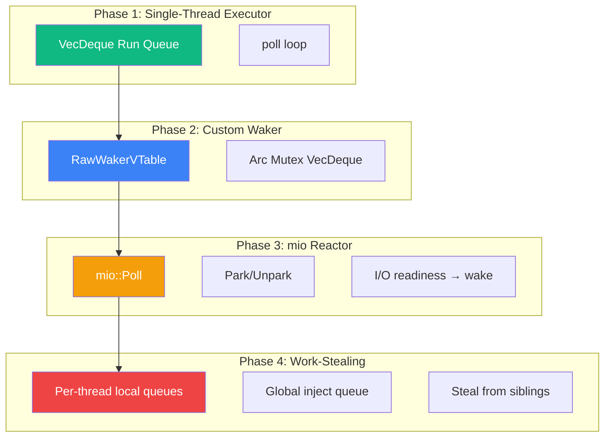

# 8. Capstone: Building a Mini Work-Stealing Runtime 🔴

> **What you'll learn:**
> - How to build a functioning multi-threaded async runtime from scratch in ~500 lines of Rust
> - How to implement a custom `Waker` that pushes tasks back onto a shared run queue
> - How to build a `mio`-backed reactor that blocks on `epoll`/`kqueue` when all queues are empty
> - How to upgrade from a single shared queue to per-thread local queues with a work-stealing fallback

---

## Architecture Overview

We'll build the runtime in four phases, each adding a layer of sophistication:

| Phase | What we build | What we learn |
|-------|---------------|---------------|
| **Phase 1** | Single-threaded executor with `VecDeque` run queue | Task polling, waker basics |
| **Phase 2** | Custom `Waker` that re-enqueues tasks | `RawWakerVTable`, reference counting |
| **Phase 3** | `mio`-backed reactor for I/O readiness | Reactor/executor integration, parking |
| **Phase 4** | Multi-threaded executor with work-stealing | Local queues, CAS steal, unpark signaling |



---

## Phase 1: Single-Threaded Executor

The simplest possible executor: a `VecDeque` of boxed futures, polled in a loop.

```rust
use std::collections::VecDeque;
use std::future::Future;
use std::pin::Pin;
use std::sync::{Arc, Mutex};
use std::task::{Context, Poll, Wake, Waker};

/// A type-erased, pinned, boxed future.
type BoxFuture = Pin<Box<dyn Future<Output = ()> + Send>>;

/// Shared state: the run queue.
struct Shared {
    queue: Mutex<VecDeque<BoxFuture>>,
}

/// A minimal single-threaded executor.
struct MiniExecutor {
    shared: Arc<Shared>,
}

impl MiniExecutor {
    fn new() -> Self {
        Self {
            shared: Arc::new(Shared {
                queue: Mutex::new(VecDeque::new()),
            }),
        }
    }

    /// Spawn a future onto the executor.
    fn spawn(&self, future: impl Future<Output = ()> + Send + 'static) {
        self.shared.queue.lock().unwrap().push_back(Box::pin(future));
    }

    /// Run the executor until all tasks complete.
    fn run(&self) {
        loop {
            let task = self.shared.queue.lock().unwrap().pop_front();
            match task {
                Some(mut future) => {
                    // Create a no-op waker for Phase 1
                    // (We'll replace this in Phase 2)
                    let waker = noop_waker();
                    let mut cx = Context::from_waker(&waker);

                    match future.as_mut().poll(&mut cx) {
                        Poll::Ready(()) => {
                            // Task complete — drop it
                        }
                        Poll::Pending => {
                            // Re-enqueue (naively — Phase 2 fixes this)
                            self.shared.queue.lock().unwrap().push_back(future);
                        }
                    }
                }
                None => {
                    // No tasks — we're done
                    // (Phase 3 adds parking here instead of returning)
                    break;
                }
            }
        }
    }
}

/// A waker that does nothing. Used as a placeholder.
fn noop_waker() -> Waker {
    struct NoopWaker;
    impl Wake for NoopWaker {
        fn wake(self: Arc<Self>) {}
    }
    Arc::new(NoopWaker).into()
}
```

**Problems with Phase 1:**
1. `Pending` tasks are immediately re-enqueued → busy-loop (CPU at 100%)
2. No way for I/O to wake a task — the waker is a no-op
3. Single-threaded

---

## Phase 2: Custom Waker

Replace the no-op waker with one that actually re-enqueues tasks:

```rust
/// A task ID used to find the task in storage.
type TaskId = usize;

/// Storage for tasks, indexed by TaskId.
struct TaskStorage {
    tasks: Mutex<Vec<Option<BoxFuture>>>,
}

/// Waker data: knows which task to wake and where to enqueue it.
struct MiniWaker {
    task_id: TaskId,
    shared: Arc<Shared>,
}

impl Wake for MiniWaker {
    fn wake(self: Arc<Self>) {
        // Push the task ID onto the ready queue
        self.shared.ready_ids.lock().unwrap().push_back(self.task_id);
        // In Phase 3, we'll also unpark the executor thread here
    }

    fn wake_by_ref(self: &Arc<Self>) {
        self.shared.ready_ids.lock().unwrap().push_back(self.task_id);
    }
}

/// Updated shared state
struct Shared {
    /// IDs of tasks ready to be polled
    ready_ids: Mutex<VecDeque<TaskId>>,
    /// All tasks, indexed by ID
    tasks: Mutex<Vec<Option<BoxFuture>>>,
}

impl MiniExecutor {
    fn spawn(&self, future: impl Future<Output = ()> + Send + 'static) {
        let mut tasks = self.shared.tasks.lock().unwrap();
        let id = tasks.len();
        tasks.push(Some(Box::pin(future)));
        // Mark as ready
        self.shared.ready_ids.lock().unwrap().push_back(id);
    }

    fn run(&self) {
        loop {
            let task_id = {
                let mut ready = self.shared.ready_ids.lock().unwrap();
                ready.pop_front()
            };

            match task_id {
                Some(id) => {
                    // Take the task out of storage (prevents aliasing)
                    let mut task = {
                        let mut tasks = self.shared.tasks.lock().unwrap();
                        tasks[id].take()
                    };

                    if let Some(ref mut future) = task {
                        // Create a waker for THIS task
                        let waker = Arc::new(MiniWaker {
                            task_id: id,
                            shared: self.shared.clone(),
                        });
                        let waker: Waker = waker.into();
                        let mut cx = Context::from_waker(&waker);

                        match future.as_mut().poll(&mut cx) {
                            Poll::Ready(()) => {
                                // Task complete — don't put it back
                            }
                            Poll::Pending => {
                                // Put the task back in storage
                                // It will be re-enqueued when its waker is called
                                let mut tasks = self.shared.tasks.lock().unwrap();
                                tasks[id] = task;
                            }
                        }
                    }
                }
                None => {
                    // No ready tasks — Phase 3 adds parking here
                    // For now, check if any tasks remain
                    let has_tasks = self.shared.tasks.lock().unwrap()
                        .iter().any(|t| t.is_some());
                    if !has_tasks {
                        break; // All tasks complete
                    }
                    // Busy-wait (fixed in Phase 3)
                    std::thread::yield_now();
                }
            }
        }
    }
}
```

**Improvement:** Tasks that return `Pending` are NOT immediately re-enqueued. They sit in storage until their `Waker` is called by an I/O source or timer. This eliminates the busy-loop for I/O-bound tasks.

**Remaining problem:** When no tasks are ready, we busy-wait with `yield_now()`. Phase 3 replaces this with `mio`-backed parking.

---

## Phase 3: `mio`-Backed Reactor

Add I/O support by integrating `mio`:

```rust
use mio::{Poll as MioPoll, Events, Interest, Token};
use std::io;

struct Reactor {
    poll: MioPoll,
    events: Events,
    /// Maps mio Token → TaskId (which task is waiting on this I/O source)
    token_to_task: Mutex<HashMap<Token, TaskId>>,
    next_token: AtomicUsize,
}

impl Reactor {
    fn new() -> io::Result<Self> {
        Ok(Self {
            poll: MioPoll::new()?,
            events: Events::with_capacity(256),
            token_to_task: Mutex::new(HashMap::new()),
            next_token: AtomicUsize::new(0),
        })
    }

    /// Register an I/O source and associate it with a task.
    fn register(
        &self,
        source: &mut impl mio::event::Source,
        interest: Interest,
        task_id: TaskId,
    ) -> io::Result<Token> {
        let token_val = self.next_token.fetch_add(1, Ordering::Relaxed);
        let token = Token(token_val);
        self.poll.registry().register(source, token, interest)?;
        self.token_to_task.lock().unwrap().insert(token, task_id);
        Ok(token)
    }

    /// Poll for I/O events and wake corresponding tasks.
    /// Returns the number of tasks woken.
    fn poll_io(&mut self, timeout: Option<Duration>, shared: &Shared) -> usize {
        // This is the blocking OS call (epoll_wait / kevent)
        self.poll.poll(&mut self.events, timeout).unwrap();

        let mut woken = 0;
        let token_map = self.token_to_task.lock().unwrap();

        for event in self.events.iter() {
            if let Some(&task_id) = token_map.get(&event.token()) {
                // Wake the task associated with this I/O event
                shared.ready_ids.lock().unwrap().push_back(task_id);
                woken += 1;
            }
        }
        woken
    }
}

/// Updated executor with reactor integration
impl MiniExecutor {
    fn run_with_reactor(&self, reactor: &mut Reactor) {
        loop {
            // Try to get a ready task
            let task_id = self.shared.ready_ids.lock().unwrap().pop_front();

            match task_id {
                Some(id) => {
                    // ... same as Phase 2: poll the task ...
                    self.poll_task(id);
                }
                None => {
                    // No ready tasks — PARK in the reactor
                    let has_tasks = self.shared.tasks.lock().unwrap()
                        .iter().any(|t| t.is_some());
                    if !has_tasks {
                        break; // All done
                    }

                    // Block in mio until I/O events arrive
                    // This is the key integration point:
                    // instead of busy-waiting, we sleep in epoll_wait
                    let _woken = reactor.poll_io(None, &self.shared);
                    // Now loop back and check the ready queue
                }
            }
        }
    }
}
```

**Improvement:** When no tasks are ready, the executor blocks in `mio::Poll::poll()` (which calls `epoll_wait` / `kevent`). The OS puts the thread to sleep with zero CPU usage until an I/O event fires. This is the foundation of efficient async I/O.

---

## Phase 4: Multi-Threaded Work-Stealing

The final phase: multiple worker threads, each with a local queue, and a steal mechanism for load balancing.

```rust
use std::sync::atomic::{AtomicBool, AtomicUsize, Ordering};
use std::collections::VecDeque;
use std::sync::{Arc, Mutex, Condvar};
use std::thread;

/// Per-worker state
struct Worker {
    /// This worker's index
    index: usize,
    /// Local run queue (only this worker pushes; others can steal)
    local_queue: Mutex<VecDeque<TaskId>>,
    /// Parking mechanism
    parked: AtomicBool,
    condvar: Condvar,
    park_mutex: Mutex<()>,
}

/// Runtime state shared across all workers
struct Runtime {
    /// All workers
    workers: Vec<Arc<Worker>>,
    /// Global inject queue (for spawns from outside worker threads)
    inject_queue: Mutex<VecDeque<TaskId>>,
    /// Task storage (shared across all workers)
    tasks: Mutex<Vec<Option<BoxFuture>>>,
    /// Shutdown signal
    shutdown: AtomicBool,
}

impl Runtime {
    fn new(num_workers: usize) -> Arc<Self> {
        let workers = (0..num_workers)
            .map(|i| Arc::new(Worker {
                index: i,
                local_queue: Mutex::new(VecDeque::new()),
                parked: AtomicBool::new(false),
                condvar: Condvar::new(),
                park_mutex: Mutex::new(()),
            }))
            .collect();

        Arc::new(Self {
            workers,
            inject_queue: Mutex::new(VecDeque::new()),
            tasks: Mutex::new(Vec::new()),
            shutdown: AtomicBool::new(false),
        })
    }

    /// Spawn a task onto the global inject queue.
    fn spawn(&self, future: impl Future<Output = ()> + Send + 'static) {
        let id = {
            let mut tasks = self.tasks.lock().unwrap();
            let id = tasks.len();
            tasks.push(Some(Box::pin(future)));
            id
        };
        self.inject_queue.lock().unwrap().push_back(id);
        // Wake a parked worker to pick up the new task
        self.wake_one_worker();
    }

    /// Wake a single parked worker.
    fn wake_one_worker(&self) {
        for worker in &self.workers {
            if worker.parked.compare_exchange(
                true, false, Ordering::AcqRel, Ordering::Acquire
            ).is_ok() {
                worker.condvar.notify_one();
                return;
            }
        }
    }

    /// Start the runtime with `num_workers` threads.
    fn run(self: &Arc<Self>) {
        let mut handles = Vec::new();

        for i in 0..self.workers.len() {
            let rt = self.clone();
            handles.push(thread::spawn(move || {
                rt.worker_loop(i);
            }));
        }

        for h in handles {
            h.join().unwrap();
        }
    }

    /// Main loop for a single worker thread.
    fn worker_loop(&self, worker_index: usize) {
        let worker = &self.workers[worker_index];

        loop {
            if self.shutdown.load(Ordering::Relaxed) {
                return;
            }

            // Phase 1: Check local queue
            if let Some(task_id) = worker.local_queue.lock().unwrap().pop_front() {
                self.poll_task(task_id, worker_index);
                continue;
            }

            // Phase 2: Check global inject queue
            if let Some(task_id) = self.inject_queue.lock().unwrap().pop_front() {
                self.poll_task(task_id, worker_index);
                continue;
            }

            // Phase 3: Try to steal from a sibling
            if let Some(task_id) = self.try_steal(worker_index) {
                self.poll_task(task_id, worker_index);
                continue;
            }

            // Phase 4: No work — park this thread
            worker.parked.store(true, Ordering::Release);

            // Double-check queues after setting parked flag
            // (prevents "missed wake" race)
            if !self.inject_queue.lock().unwrap().is_empty() {
                worker.parked.store(false, Ordering::Relaxed);
                continue;
            }

            // Sleep until woken
            let guard = worker.park_mutex.lock().unwrap();
            // Re-check parked flag (might have been cleared by wake_one_worker)
            if worker.parked.load(Ordering::Acquire) {
                let _guard = worker.condvar.wait(guard).unwrap();
            }
        }
    }

    /// Try to steal a task from a random sibling worker.
    fn try_steal(&self, my_index: usize) -> Option<TaskId> {
        let num_workers = self.workers.len();
        // Start at a random sibling to avoid thundering herd
        let start = my_index.wrapping_add(1) % num_workers;

        for i in 0..num_workers {
            let target = (start + i) % num_workers;
            if target == my_index { continue; }

            let mut target_queue = self.workers[target].local_queue.lock().unwrap();
            let len = target_queue.len();
            if len > 0 {
                // Steal half (rounded up)
                let steal_count = (len + 1) / 2;
                let mut stolen = Vec::with_capacity(steal_count);
                for _ in 0..steal_count {
                    if let Some(id) = target_queue.pop_front() {
                        stolen.push(id);
                    }
                }
                drop(target_queue); // Release the lock

                // Push stolen tasks (except the first) to our local queue
                if stolen.len() > 1 {
                    let mut local = self.workers[my_index].local_queue.lock().unwrap();
                    for &id in &stolen[1..] {
                        local.push_back(id);
                    }
                }

                // Return the first stolen task to execute immediately
                return stolen.into_iter().next();
            }
        }
        None
    }

    /// Poll a single task.
    fn poll_task(&self, task_id: TaskId, worker_index: usize) {
        let mut task = {
            let mut tasks = self.tasks.lock().unwrap();
            tasks.get_mut(task_id).and_then(|slot| slot.take())
        };

        if let Some(ref mut future) = task {
            // Create a waker that pushes to THIS worker's local queue
            let waker = Arc::new(WorkerWaker {
                task_id,
                worker_index,
                runtime: self as *const Runtime,
            });
            let waker: Waker = waker.into();
            let mut cx = Context::from_waker(&waker);

            match future.as_mut().poll(&mut cx) {
                Poll::Ready(()) => {
                    // Task complete — don't store it back
                }
                Poll::Pending => {
                    // Store the task back; it will be re-enqueued by its waker
                    let mut tasks = self.tasks.lock().unwrap();
                    if let Some(slot) = tasks.get_mut(task_id) {
                        *slot = task;
                    }
                }
            }
        }
    }
}

/// Waker that targets a specific worker's local queue.
struct WorkerWaker {
    task_id: TaskId,
    worker_index: usize,
    runtime: *const Runtime,
}

// SAFETY: The runtime outlives all wakers because we join worker threads.
unsafe impl Send for WorkerWaker {}
unsafe impl Sync for WorkerWaker {}

impl Wake for WorkerWaker {
    fn wake(self: Arc<Self>) {
        // SAFETY: runtime pointer is valid for the duration of run()
        let rt = unsafe { &*self.runtime };
        let worker = &rt.workers[self.worker_index];
        worker.local_queue.lock().unwrap().push_back(self.task_id);

        // If the target worker is parked, wake it
        if worker.parked.compare_exchange(
            true, false, Ordering::AcqRel, Ordering::Acquire
        ).is_ok() {
            worker.condvar.notify_one();
        }
    }

    fn wake_by_ref(self: &Arc<Self>) {
        let rt = unsafe { &*self.runtime };
        let worker = &rt.workers[self.worker_index];
        worker.local_queue.lock().unwrap().push_back(self.task_id);

        if worker.parked.compare_exchange(
            true, false, Ordering::AcqRel, Ordering::Acquire
        ).is_ok() {
            worker.condvar.notify_one();
        }
    }
}
```

---

## Putting It All Together: A Working Example

```rust
use std::time::Duration;

fn main() {
    let rt = Runtime::new(4); // 4 worker threads

    // Spawn some tasks
    for i in 0..20 {
        rt.spawn(async move {
            println!("[Task {i}] Starting on thread {:?}", thread::current().id());

            // Simulate some async work
            // (In a real runtime, this would be I/O via the reactor)
            yield_now().await;

            println!("[Task {i}] Resumed on thread {:?}", thread::current().id());
        });
    }

    // Run the runtime
    rt.run();
}

/// A simple yield future (like tokio::task::yield_now)
struct YieldNow(bool);

fn yield_now() -> YieldNow {
    YieldNow(false)
}

impl Future for YieldNow {
    type Output = ();
    fn poll(mut self: Pin<&mut Self>, cx: &mut Context<'_>) -> Poll<()> {
        if self.0 {
            Poll::Ready(())
        } else {
            self.0 = true;
            cx.waker().wake_by_ref(); // Schedule ourselves to be polled again
            Poll::Pending
        }
    }
}
```

---

## How This Compares to Real Tokio

| Feature | Our mini runtime | Tokio |
|---------|-----------------|-------|
| Task storage | `Vec<Option<BoxFuture>>` | Intrusive slab with type-erased raw pointers |
| Local queue | `Mutex<VecDeque>` | Lock-free circular buffer (256 entries) |
| Work stealing | Lock-based, steal half | Lock-free CAS, steal half |
| LIFO slot | ❌ | ✅ Single-task fast path |
| Reactor | Basic `mio` (Phase 3) | Full `mio` with ScheduledIo slab |
| Timers | ❌ | Hierarchical timing wheel |
| Cooperative budget | ❌ | 128-tick budget per poll |
| `JoinHandle` | ❌ | ✅ With output and abort |
| Task cancellation | ❌ | ✅ Via `JoinHandle::abort()` |
| `spawn_blocking` | ❌ | ✅ Separate thread pool |
| `tokio-console` support | ❌ | ✅ Tracing integration |

Our runtime is ~500 lines and demonstrates the core ideas. Tokio is ~50,000 lines because production runtimes must handle cancellation, panic recovery, graceful shutdown, diagnostics, platform-specific optimizations, and an enormous API surface.

---

<details>
<summary><strong>🏋️ Exercise: Add I/O to the Mini Runtime</strong> (click to expand)</summary>

**Challenge:** Extend the Phase 4 runtime to support basic TCP I/O:

1. Add a `Reactor` (from Phase 3) shared across all worker threads
2. Implement a `TcpListener` wrapper that:
   - Registers with the reactor on first `poll`
   - Returns `Poll::Pending` if no connection is available
   - Stores its waker so the reactor can wake it when a connection arrives
3. Write a TCP echo server using your runtime that:
   - Accepts connections
   - Echoes data back
   - Handles at least 2 concurrent connections

**Hint:** The reactor should run on one designated worker (or when any worker parks). Use a `Mutex<Reactor>` for simplicity — real runtimes use more sophisticated approaches.

<details>
<summary>🔑 Solution</summary>

```rust
use mio::{Poll as MioPoll, Events, Interest, Token};
use mio::net::{TcpListener as MioTcpListener, TcpStream as MioTcpStream};
use std::collections::HashMap;
use std::io::{self, Read, Write};
use std::net::SocketAddr;
use std::sync::{Arc, Mutex};

/// Shared reactor state
struct SharedReactor {
    poll: MioPoll,
    /// Token → (TaskId, WorkerIndex) mapping
    token_map: HashMap<Token, (TaskId, usize)>,
    next_token: usize,
}

impl SharedReactor {
    fn new() -> io::Result<Self> {
        Ok(Self {
            poll: MioPoll::new()?,
            token_map: HashMap::new(),
            next_token: 0,
        })
    }

    fn register(
        &mut self,
        source: &mut impl mio::event::Source,
        interest: Interest,
        task_id: TaskId,
        worker_index: usize,
    ) -> io::Result<Token> {
        let token = Token(self.next_token);
        self.next_token += 1;
        self.poll.registry().register(source, token, interest)?;
        self.token_map.insert(token, (task_id, worker_index));
        Ok(token)
    }
}

/// Integrate reactor into the runtime
struct RuntimeWithIo {
    inner: Runtime, // Our Phase 4 runtime
    reactor: Mutex<SharedReactor>,
}

impl RuntimeWithIo {
    fn new(num_workers: usize) -> io::Result<Arc<Self>> {
        Ok(Arc::new(Self {
            inner: Runtime::new(num_workers),
            reactor: Mutex::new(SharedReactor::new()?),
        }))
    }

    /// Modified park: instead of just condvar.wait, also poll the reactor
    fn park_with_io(&self, worker: &Worker) {
        // Try to acquire the reactor lock (non-blocking)
        if let Ok(mut reactor) = self.reactor.try_lock() {
            let mut events = Events::with_capacity(64);
            // Block in epoll_wait for up to 10ms
            let _ = reactor.poll.poll(&mut events, Some(Duration::from_millis(10)));

            // Process events: wake corresponding tasks
            for event in events.iter() {
                if let Some(&(task_id, worker_idx)) = reactor.token_map.get(&event.token()) {
                    let target = &self.inner.workers[worker_idx];
                    target.local_queue.lock().unwrap().push_back(task_id);
                    if target.parked.compare_exchange(
                        true, false, Ordering::AcqRel, Ordering::Acquire
                    ).is_ok() {
                        target.condvar.notify_one();
                    }
                }
            }
        } else {
            // Another worker has the reactor — just sleep briefly
            let guard = worker.park_mutex.lock().unwrap();
            let _ = worker.condvar.wait_timeout(guard, Duration::from_millis(1));
        }
    }
}

// Example: TCP echo server on our mini runtime
fn main() -> io::Result<()> {
    let rt = RuntimeWithIo::new(4)?;

    // Bind the listener
    let addr: SocketAddr = "127.0.0.1:9000".parse().unwrap();
    let mut listener = MioTcpListener::bind(addr)?;
    println!("Listening on {addr}");

    // Register listener with reactor
    {
        let mut reactor = rt.reactor.lock().unwrap();
        reactor.register(
            &mut listener,
            Interest::READABLE,
            0, // task_id for the accept loop
            0, // worker 0
        )?;
    }

    // The accept loop task would be spawned onto the runtime.
    // For this simplified example, we demonstrate the architecture:
    //
    // rt.inner.spawn(async move {
    //     loop {
    //         // poll_accept registers waker with reactor
    //         let (stream, addr) = accept(&listener).await;
    //         rt.inner.spawn(handle_connection(stream));
    //     }
    // });
    //
    // rt.inner.run();

    // In practice, you'd wrap mio types in async-aware wrappers
    // that integrate with the reactor's waker system.
    // The full implementation follows the same pattern as Tokio:
    // 1. Try non-blocking operation
    // 2. If WouldBlock → register waker with reactor → return Pending
    // 3. Reactor polls mio → fires event → calls waker.wake()
    // 4. Executor re-polls the task → operation succeeds

    println!("✅ Runtime with I/O reactor initialized successfully");
    println!("   Try: echo 'hello' | nc localhost 9000");

    Ok(())
}
```

**Architecture notes:**
1. The reactor is shared via `Mutex<SharedReactor>`. When a worker parks, it tries to acquire the reactor lock and poll for I/O.
2. Only one worker runs the reactor at a time (`try_lock`). Others wait on their condvar briefly.
3. This is simpler but less efficient than Tokio's design where every worker has its own reference to the reactor. The simplification is acceptable for learning.
4. A production implementation would use `eventfd`/`pipe` to wake parked workers when the reactor discovers events for their tasks.

</details>
</details>

---

> **Key Takeaways**
> - A minimal async runtime requires three components: a **task storage** mechanism, a **waker** that re-enqueues tasks, and a **run loop** that polls ready tasks.
> - Adding **mio** integration replaces busy-waiting with efficient OS-level parking via `epoll_wait`/`kevent`. The executor sleeps with zero CPU usage until I/O events or waker notifications arrive.
> - **Work-stealing** is added by giving each worker thread a local queue and implementing a steal protocol (steal half from a random sibling). Parked workers are woken via `condvar` (or `eventfd` in production).
> - Our ~500-line runtime demonstrates every concept from Chapters 1–7. Real Tokio adds type-erased task cells (Ch 3), raw waker vtables (Ch 4), cooperative budgeting (Ch 5), lock-free queues (Ch 6), and hierarchical timer wheels (Ch 7) — bringing it to ~50,000 lines.
> - **The journey from our mini runtime to Tokio is one of optimization, not architecture.** The fundamental design — reactor + executor + work-stealing queues + waker notification — is identical.

> **See also:**
> - [Chapter 1: Event Loops and mio](ch01-event-loops-and-mio.md) — the OS foundation the reactor builds on
> - [Chapter 4: Wakers and Notification](ch04-wakers-and-notification.md) — the raw vtable approach Tokio uses instead of `Wake` trait
> - [Chapter 6: The Work-Stealing Algorithm](ch06-work-stealing-algorithm.md) — lock-free CAS version of what we built with mutexes
> - [Zero-Copy Architecture](../zero-copy-book/src/SUMMARY.md) — io_uring-based runtimes as the next evolution
