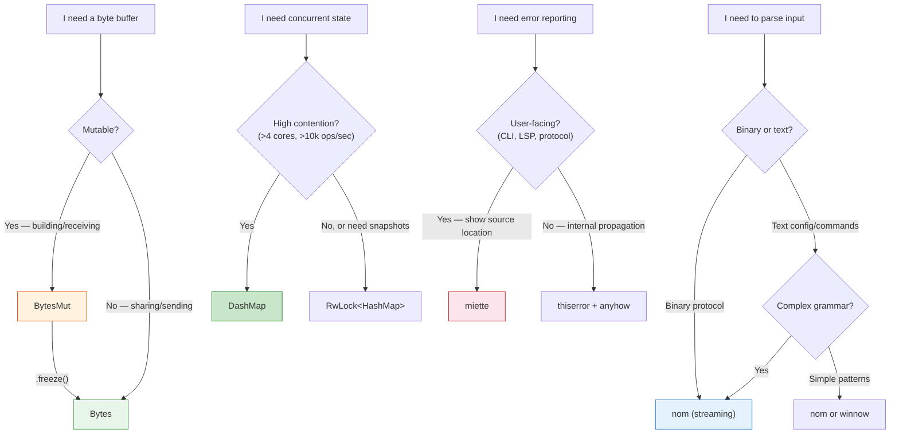

# Appendix A: Architect's Toolbox Reference Card

A compact cheat sheet for the four crate families covered in this book. Print this, pin it to your wall, or keep it in a second monitor while coding.

---

## `bytes` — Zero-Copy Buffer Management

### `BytesMut` (Mutable, Exclusively Owned)

| Method | What it does | Cost |
|--------|-------------|------|
| `BytesMut::with_capacity(n)` | Allocate buffer with `n` bytes capacity | O(1) alloc |
| `buf.put_u8(v)` / `put_u16(v)` / `put_u32(v)` | Append typed integer (big-endian by default) | O(1) |
| `buf.put_slice(&[u8])` | Append byte slice | O(n) memcpy |
| `buf.split_to(n)` | Split off first `n` bytes as new `BytesMut` | **O(1)** pointer math |
| `buf.split_off(n)` | Split off bytes after position `n` | **O(1)** pointer math |
| `buf.freeze()` | Convert to immutable `Bytes` | **O(1)** |
| `buf.advance(n)` | Discard first `n` bytes (via `Buf` trait) | **O(1)** |
| `buf.len()` / `buf.capacity()` | Current length / total capacity | O(1) |
| `buf.reserve(n)` | Ensure `n` additional bytes of capacity | O(1) or realloc |
| `buf.clear()` | Reset length to 0 (retains allocation) | O(1) |

### `Bytes` (Immutable, Reference-Counted)

| Method | What it does | Cost |
|--------|-------------|------|
| `Bytes::from_static(&[u8])` | Wrap a `&'static [u8]` — no allocation | O(1) |
| `Bytes::copy_from_slice(&[u8])` | Copy bytes into a new `Bytes` | O(n) alloc + copy |
| `bytes.clone()` | Cheaply clone via `Arc` refcount | **O(1)** |
| `bytes.slice(range)` | Create a sub-slice view | **O(1)** |
| `bytes.len()` / `bytes.is_empty()` | Length queries | O(1) |

### `Buf` Trait (Reading typed data)

| Method | Reads |
|--------|-------|
| `buf.get_u8()` | 1 byte → `u8` |
| `buf.get_u16()` | 2 bytes → `u16` (big-endian) |
| `buf.get_u16_le()` | 2 bytes → `u16` (little-endian) |
| `buf.get_u32()` | 4 bytes → `u32` (big-endian) |
| `buf.get_u64()` | 8 bytes → `u64` (big-endian) |
| `buf.get_i32()` | 4 bytes → `i32` (big-endian) |
| `buf.get_f64()` | 8 bytes → `f64` |
| `buf.copy_to_bytes(n)` | Take `n` bytes as `Bytes` |

All `get_*` methods advance the cursor automatically.

---

## `nom` — Parser Combinators

### IResult Pattern

```rust
fn parser(input: &[u8]) -> IResult<&[u8], Output> {
    // On success: Ok((remaining_input, parsed_value))
    // On failure: Err(Error(...)) or Err(Incomplete(Needed))
}
```

### Matching Combinators

| Combinator | Signature | Description |
|-----------|-----------|-------------|
| `tag(literal)` | `&[u8] → IResult<&[u8], &[u8]>` | Match exact bytes |
| `take(n)` | `&[u8] → IResult<&[u8], &[u8]>` | Take exactly `n` bytes |
| `take_while1(pred)` | `&[u8] → IResult<&[u8], &[u8]>` | Take 1+ bytes matching predicate |
| `take_until(literal)` | `&[u8] → IResult<&[u8], &[u8]>` | Take bytes until literal found |

### Number Parsers (`nom::number`)

| Parser | Reads |
|--------|-------|
| `be_u8` | 1 byte → `u8` |
| `be_u16` | 2 bytes → `u16` (big-endian) |
| `be_u32` | 4 bytes → `u32` (big-endian) |
| `be_u64` | 8 bytes → `u64` (big-endian) |
| `le_u16` / `le_u32` / `le_u64` | Little-endian variants |
| `be_f32` / `be_f64` | Floating point (big-endian) |

### Sequencing

| Combinator | Returns |
|-----------|---------|
| `tuple((p1, p2, p3))` | `(O1, O2, O3)` |
| `preceded(prefix, main)` | Output of `main` only |
| `terminated(main, suffix)` | Output of `main` only |
| `delimited(open, body, close)` | Output of `body` only |
| `separated_pair(left, sep, right)` | `(OLeft, ORight)` |

### Branching & Repetition

| Combinator | Behavior |
|-----------|----------|
| `alt((p1, p2, p3))` | First success wins (ordered choice) |
| `opt(p)` | Returns `Option<O>` — never fails |
| `many0(p)` | Zero or more → `Vec<O>` |
| `many1(p)` | One or more → `Vec<O>` |
| `count(p, n)` | Exactly `n` times → `Vec<O>` |
| `separated_list1(sep, p)` | `p sep p sep p` → `Vec<O>` |

### Transformation

| Combinator | Behavior |
|-----------|----------|
| `map(p, f)` | Transform output: `f(output)` |
| `map_res(p, f)` | Fallible transform: `f(output) -> Result` |
| `value(val, p)` | If `p` succeeds, return `val` |
| `verify(p, pred)` | Run `p`, fail if `pred(output)` is false |

### Streaming vs. Complete

| Module | On insufficient input |
|--------|----------------------|
| `nom::bytes::complete::*` | Returns `Err(Error)` — fails immediately |
| `nom::bytes::streaming::*` | Returns `Err(Incomplete(Needed))` — retry after more data |

**Rule**: Use `streaming` for network protocols, `complete` for files/strings.

---

## `dashmap` — Concurrent HashMap

### Construction

```rust
let map: DashMap<K, V> = DashMap::new();              // Default shards
let map: DashMap<K, V> = DashMap::with_capacity(1000); // Pre-allocate
let map: DashMap<K, V, S> = DashMap::with_hasher(s);   // Custom hasher
```

### Basic Operations

| Method | Returns | Lock |
|--------|---------|------|
| `map.insert(k, v)` | `Option<V>` (old value) | Shard write |
| `map.get(&k)` | `Option<Ref<K, V>>` | Shard read |
| `map.get_mut(&k)` | `Option<RefMut<K, V>>` | Shard write |
| `map.remove(&k)` | `Option<(K, V)>` | Shard write |
| `map.contains_key(&k)` | `bool` | Shard read |
| `map.len()` | `usize` | Reads all shards |
| `map.is_empty()` | `bool` | Reads all shards |

### Entry API (Atomic read-modify-write)

```rust
// Insert if absent, modify if present — atomically
map.entry(key)
   .and_modify(|v| *v += 1)
   .or_insert(initial_value);

// Insert with expensive computation only if absent
map.entry(key)
   .or_insert_with(|| expensive_init());

// Access the entry's value
let mut entry = map.entry(key).or_default();
*entry.value_mut() += 1;
```

### Iteration

| Method | Behavior | Safety |
|--------|----------|--------|
| `map.iter()` | Iterate read-locked, per-shard | Do NOT mutate map inside |
| `map.iter_mut()` | Iterate write-locked, per-shard | Do NOT call map methods inside |
| `map.retain(\|k, v\| pred)` | Remove non-matching entries | Safe — locks one shard at a time |
| `map.into_iter()` | Consume the map | No lock needed (owned) |

### ⚠️ Deadlock Rules

1. **Never** call `map.insert()`, `map.get()`, or `map.remove()` inside a `map.iter()` loop.
2. **Never** hold a `Ref` or `RefMut` and call another method on the same map.
3. Use `retain()` for bulk conditional removal.
4. Collect keys to a `Vec` first if you need to mutate after reading.

---

## `miette` — Diagnostic Error Reporting

### Derive Pattern

```rust
#[derive(Error, Diagnostic, Debug)]
#[error("human-readable message")]
#[diagnostic(
    code(my_crate::error_code),
    help("suggestion for fix"),
    url("https://docs.example.com/errors/E001"),
    severity(Error),  // or Warning, Advice
)]
struct MyError {
    #[source_code]
    src: NamedSource<String>,
    
    #[label("what's wrong here")]
    span: SourceSpan,
    
    #[label("related context")]
    other_span: SourceSpan,
    
    #[help]
    dynamic_help: String,  // For runtime-generated help text
    
    #[related]
    related: Vec<AnotherError>,  // Chain of related diagnostics
}
```

### `SourceSpan` Construction

```rust
let span: SourceSpan = (byte_offset, length).into();
let span: SourceSpan = (42, 5).into();           // Offset 42, 5 bytes long
let cursor: SourceSpan = (42, 0).into();          // Cursor at offset 42
let span: SourceSpan = (10..15).into();            // Range syntax
```

### Key Types

| Type | Purpose |
|------|---------|
| `NamedSource<String>` | Source code with a filename |
| `SourceSpan` | `(offset, length)` byte range into source |
| `LabeledSpan` | `SourceSpan` + message string |
| `Severity` | `Error`, `Warning`, or `Advice` |
| `GraphicalReportHandler` | Renders diagnostics with Unicode box drawing |
| `MietteDiagnostic` | Runtime-constructed diagnostic (no derive) |

### Installing the Global Handler

```rust
fn main() {
    miette::set_hook(Box::new(|_| {
        Box::new(miette::GraphicalReportHandler::new()
            .with_theme(miette::GraphicalTheme::unicode()))
    })).unwrap();
}
```

### Rendering to String (for TCP/HTTP responses)

```rust
use miette::GraphicalReportHandler;

fn render_to_string(err: &dyn miette::Diagnostic) -> String {
    let mut buf = String::new();
    GraphicalReportHandler::new_themed(miette::GraphicalTheme::unicode_nocolor())
        .render_report(&mut buf, err)
        .ok();
    buf
}
```

---

## Quick Decision Guide



---

## Cargo.toml Quick Start

```toml
[dependencies]
bytes = "1"
dashmap = "6"
nom = "7"
miette = { version = "7", features = ["fancy"] }
thiserror = "2"
tokio = { version = "1", features = ["full"] }
anyhow = "1"
```

---

## Further Reading

| Topic | Resource |
|-------|----------|
| `bytes` crate internals | [tokio-rs/bytes on GitHub](https://github.com/tokio-rs/bytes) |
| `dashmap` design | [dashmap crate docs](https://docs.rs/dashmap) |
| `nom` tutorial | [Nom 7 Guide](https://github.com/rust-bakery/nom/blob/main/doc/choosing_a_combinator.md) |
| `winnow` migration from nom | [winnow docs](https://docs.rs/winnow) |
| `miette` cookbook | [miette examples](https://github.com/zkat/miette/tree/main/examples) |
| [Rust Microservices](../microservices-book/src/SUMMARY.md) | Production Tokio/Axum/Tonic server patterns |
| [Zero-Copy Architecture](../zero-copy-book/src/SUMMARY.md) | io_uring, rkyv, thread-per-core design |
| [Rust API Design & Error Architecture](../api-design-book/src/SUMMARY.md) | `thiserror`/`anyhow` patterns this book extends |
