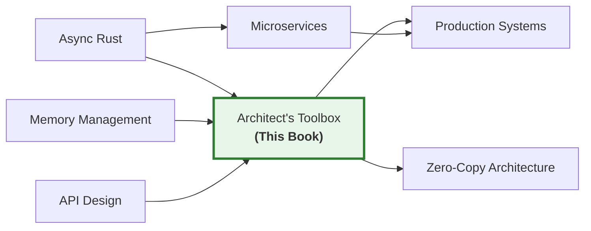

# The Rust Architect's Toolbox: Bytes, Nom, Dashmap, and Miette

## Speaker Intro

I'm a Principal Systems Architect who has spent two decades building high-throughput databases, network proxies, and developer toolchains — first in C++ and Go, and for the last seven years in Rust. I've designed wire protocols that move hundreds of gigabytes per hour, built in-memory caches serving millions of concurrent clients, and shipped parser frameworks that process untrusted input from the open internet without a single CVE. Before that, I maintained core subsystems in a top-5 cloud provider's network edge.

This guide is the internal onboarding material I hand to every senior engineer who joins my team. It covers the **four crate families** that separate a "correct Rust program" from a "correct Rust program that is also screaming fast under real-world load":

| Crate | What it replaces | Why it matters |
|-------|-----------------|----------------|
| **`bytes`** | `Vec<u8>`, `String`, manual buffer management | Reference-counted, zero-copy buffer slicing for network I/O |
| **`dashmap`** | `Arc<RwLock<HashMap<K, V>>>` | Lock-sharded concurrent map with 10–50× throughput under contention |
| **`nom` / `winnow`** | `Regex`, hand-rolled `for` loops, ad-hoc string splitting | Composable, zero-allocation parser combinators for binary and text protocols |
| **`miette`** | `thiserror`, `anyhow`, raw `Display` implementations | Compiler-grade diagnostic output with source spans and graphical annotations |

These are not "nice-to-have" crates. They are **load-bearing infrastructure** in Tokio, Hyper, Axum, Tonic, and dozens of other foundational Rust projects. Understanding them deeply — at the level of memory layouts, lock granularity, and CPU cache behavior — is what separates a competent Rust developer from a systems architect.

---

## Who This Is For

This guide is for **senior engineers and aspiring systems architects** who are:

- **Tokio/Hyper users** who see `Bytes` and `BytesMut` in their stack traces every day but have never understood *why* Tokio chose those types over `Vec<u8>`, and what performance they're leaving on the table by converting back to `String` prematurely.
- **Backend engineers** maintaining concurrent `HashMap` state behind an `Arc<RwLock<…>>` who notice tail latency spikes under high thread contention and suspect their locking strategy is the bottleneck.
- **Protocol implementors** who are tired of brittle regex-based parsers that panic on malformed input, and want to build robust, streaming-safe parsers that can handle incomplete network data gracefully.
- **Developer tool authors** who want their CLI or LSP to emit rustc-quality error messages — with colorized source spans pointing user exactly to the problematic byte — instead of opaque "parse error at line 42" output.

You should already be comfortable with:

| Concept | Where to Learn |
|---------|---------------|
| Ownership, borrowing, lifetimes, `Arc`, `Rc` | [Rust Memory Management](../memory-management-book/src/SUMMARY.md) |
| `async`/`.await`, Tokio, `Future`, `Pin` | [Async Rust](../async-book/src/SUMMARY.md) |
| Traits, generics, `Send`/`Sync` | [Rust's Type System & Traits](../type-system-traits-book/src/SUMMARY.md) |
| `thiserror`, `anyhow`, error handling patterns | [Rust API Design & Error Architecture](../api-design-book/src/SUMMARY.md) |
| Basic Tokio TCP server (`TcpListener`, `TcpStream`) | [Rust Microservices](../microservices-book/src/SUMMARY.md) |

If you haven't built a Tokio-based server that handles concurrent TCP connections, start with the Microservices book. This guide assumes you know what `tokio::spawn` does and why `Send + 'static` bounds exist.

---

## How to Use This Book

| Emoji | Meaning |
|-------|---------|
| 🟢 | **Foundational** — core concepts every Rust systems developer must internalize |
| 🟡 | **Applied** — hands-on patterns requiring judgment and performance awareness |
| 🔴 | **Advanced** — deep internals, sharding strategies, zero-copy protocol construction |

Every chapter follows the same structure:

1. **What you'll learn** — 3–4 concrete outcomes.
2. **"The Standard Library Way (Bottlenecked)" vs. "The Architect's Way (Optimized)"** — side-by-side code showing what incurs hidden runtime costs and how to eliminate them.
3. **Performance Hazard callouts** — code that compiles but burns CPU or memory, marked with `// ⚠️ PERFORMANCE HAZARD:`.
4. **Mermaid diagrams** — at least one per chapter, illustrating memory layouts, lock topologies, or parser state machines.
5. **Exercise** — a hands-on challenge with a hidden, heavily-commented solution.
6. **Key Takeaways** — the sentences you'd put on an architecture review slide.

---

## Pacing Guide

| Chapters | Topic | Time | Checkpoint |
|----------|-------|------|------------|
| Ch 1 | Zero-Copy Networking with `bytes` | 3–4 hours | Can you split a `BytesMut` buffer into owned `Bytes` slices without allocating? |
| Ch 2 | Highly Concurrent State with `dashmap` | 3–4 hours | Can you explain why `DashMap` outperforms `RwLock<HashMap>` and identify when it doesn't? |
| Ch 3 | Parser Combinators with `nom` | 4–5 hours | Can you write a streaming-safe nom parser that returns `Incomplete` on partial input? |
| Ch 4 | Designing Custom Binary Protocols | 4–5 hours | Can you parse a custom binary frame into Rust structs with zero heap allocations? |
| Ch 5 | Developer-Facing Errors with `miette` | 2–3 hours | Can you produce rustc-quality diagnostic output with highlighted source spans? |
| Ch 6 | Capstone: Zero-Copy In-Memory Cache | 6–8 hours | Can you build a concurrent TCP cache server using all four crate families together? |

**Total: 22–29 hours** for the full curriculum, or ~4 days of focused study.

---

## Table of Contents

### Part I: High-Throughput Memory & State

The standard library's `Vec<u8>` and `HashMap` are correct and ergonomic. They are also the #1 and #2 performance bottlenecks in real-world Rust network services. Part I replaces them with battle-tested alternatives that eliminate hidden allocations and lock contention.

- **Chapter 1: Zero-Copy Networking with `bytes` 🟡** — Why Tokio chose `Bytes` over `Vec<u8>`. The difference between `Bytes` (immutable, cheaply cloneable) and `BytesMut` (exclusively owned, growable). Reference-counted contiguous memory. Slicing buffers with `split_to()` and `split_off()` in O(1) time without allocating. Integration with `tokio::io::AsyncReadExt`.
- **Chapter 2: Highly Concurrent State with `dashmap` 🔴** — Why `Arc<RwLock<HashMap<K, V>>>` is fatally slow under contention. CPU cache invalidation and false sharing. How `DashMap` shards its internal locks across N buckets. The `entry()` API for atomic read-modify-write. Avoiding deadlocks during iteration. When `DashMap` is *not* the right choice.

### Part II: Parsing the Unparsable

Parsing untrusted input is the most security-critical code in any network service. Regex is too slow and too fragile. Manual `for` loops are too dangerous. Parser combinators give you the safety of a formal grammar with the performance of hand-rolled code.

- **Chapter 3: Parser Combinators with `nom` (and `winnow`) 🔴** — The `IResult<I, O, E>` type and the combinator mental model. Writing parsers that take `&[u8]` and compose via `tuple`, `alt`, `many0`. Handling incomplete network streams. The `winnow` ergonomic alternative.
- **Chapter 4: Designing Custom Binary Protocols 🔴** — Building a zero-copy parser for a proprietary binary protocol. Length-prefixed framing. Mapping byte slices directly into borrowed Rust structs. Combining `bytes` with `nom` for zero-allocation protocol decoding.

### Part III: Next-Generation Diagnostics

When your parser rejects input, the quality of your error message determines whether your user fixes the problem in 10 seconds or files a support ticket. `miette` turns error reporting from an afterthought into a competitive advantage.

- **Chapter 5: Developer-Facing Errors with `miette` 🟡** — Moving beyond `thiserror`. The `Diagnostic` trait. `NamedSource`, `SourceSpan`, and `LabeledSpan`. Drawing graphical squiggly lines pointing to exact bytes. Integrating `miette` with `nom` parse failures.

### Part IV: Production Capstone

- **Chapter 6: Capstone: The Zero-Copy In-Memory Cache 🔴** — Build a concurrent, Tokio-based TCP cache server that accepts a custom binary protocol, parses commands with `nom`, stores data in `DashMap<Bytes, Bytes>`, and returns `miette`-annotated error diagnostics for malformed input. The full architect's toolkit, under load.

### Appendices

- **Appendix A: Architect's Toolbox Reference Card** — Cheat sheets for `BytesMut` slicing methods, core `nom` combinators, `DashMap` entry APIs, and `miette` diagnostic builder patterns.

---

## Companion Guides

This book is designed to complement the following training guides:

| Guide | Relationship |
|-------|-------------|
| [Rust Microservices](../microservices-book/src/SUMMARY.md) | Uses the same Tokio/Axum stack; this book optimizes the foundational layers beneath it |
| [Zero-Copy Architecture](../zero-copy-book/src/SUMMARY.md) | Shares the zero-copy philosophy; this book provides the practical crate toolkit |
| [Rust API Design & Error Architecture](../api-design-book/src/SUMMARY.md) | Covers `thiserror`/`anyhow`; this book extends into `miette` diagnostics |
| [Rust Patterns](../rust-patterns-book/src/SUMMARY.md) | Covers `Pin`, allocators, lock-free structures; this book applies those ideas to specific crates |
| [Async Rust](../async-book/src/SUMMARY.md) | Prerequisite for understanding Tokio I/O integration with `bytes` |

