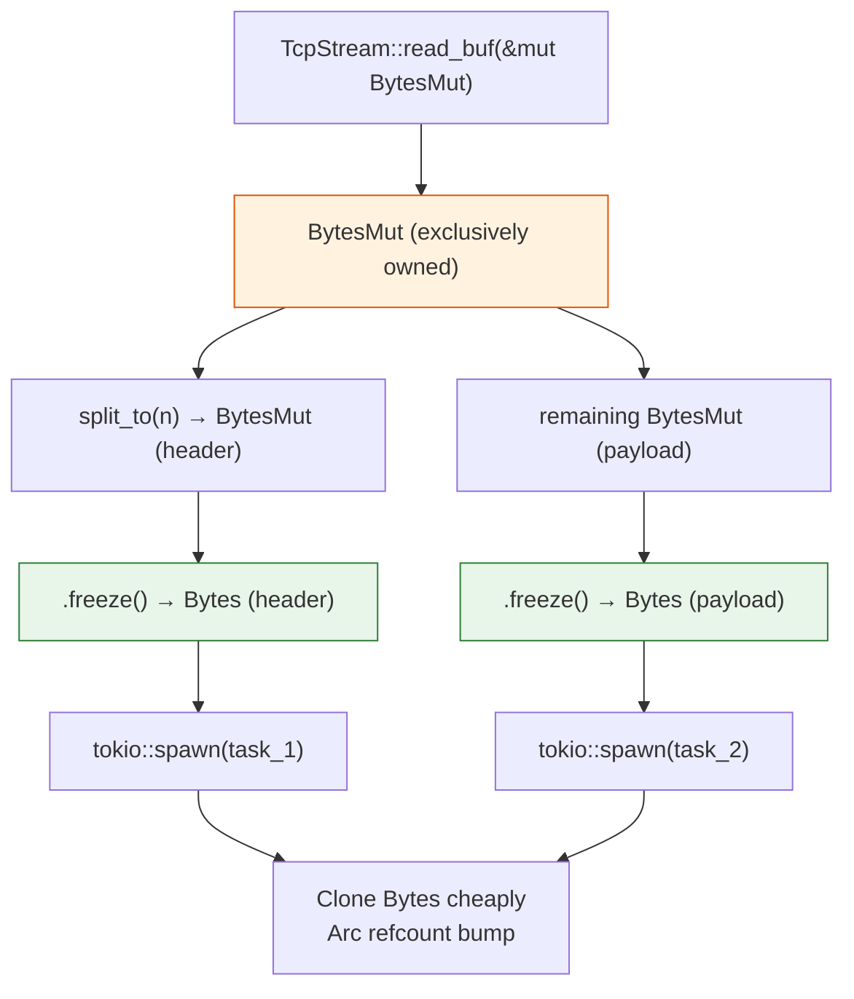

# 1. Zero-Copy Networking with `bytes` 🟡

> **What you'll learn:**
> - Why Tokio uses `Bytes` and `BytesMut` instead of `Vec<u8>` for all network I/O
> - The fundamental difference between `Bytes` (immutable, reference-counted, cheaply cloneable) and `BytesMut` (exclusively owned, growable)
> - How to slice buffers with `split_to()` and `split_off()` in O(1) time without allocating
> - How to integrate `bytes` with Tokio's `AsyncReadExt` and `AsyncWriteExt` for zero-copy network pipelines

---

## The Problem: `Vec<u8>` Is a Hidden Tax

Every Rust developer starts with `Vec<u8>` for byte buffers. It's correct, ergonomic, and familiar. It is also the single largest source of unnecessary heap allocations in Rust network services.

Consider a TCP proxy that reads a frame from one connection and forwards it to another. With `Vec<u8>`:

```rust
// ⚠️ PERFORMANCE HAZARD: Every operation allocates
async fn proxy_frame(src: &mut TcpStream, dst: &mut TcpStream) -> io::Result<()> {
    let mut buf = vec![0u8; 4096]; // ⚠️ Allocation #1: 4 KiB on the heap
    let n = src.read(&mut buf).await?;
    buf.truncate(n);

    // Parse the header (first 8 bytes) and payload separately
    let header = buf[..8].to_vec();  // ⚠️ Allocation #2: needless copy
    let payload = buf[8..n].to_vec(); // ⚠️ Allocation #3: needless copy

    // Forward the payload
    dst.write_all(&payload).await?;  // The original `buf` is still alive — wasted memory
    Ok(())
}
```

Three heap allocations for a single frame. Under 100k connections, that's 300k allocations per frame cycle. The allocator becomes the bottleneck before your business logic does.

### What `bytes` gives you

```rust
use bytes::{Bytes, BytesMut, Buf, BufMut};

// ✅ FIX: Zero-copy slicing — no allocations after the initial read
async fn proxy_frame(src: &mut TcpStream, dst: &mut TcpStream) -> io::Result<()> {
    let mut buf = BytesMut::with_capacity(4096); // One allocation, reusable
    src.read_buf(&mut buf).await?;

    let header = buf.split_to(8); // ✅ O(1) pointer adjustment, no copy
    let payload = buf.freeze();   // ✅ Convert remainder to immutable Bytes, no copy

    dst.write_all(&payload).await?;
    Ok(())
}
```

One allocation. Zero copies. The `split_to` call adjusts an internal pointer — it does not copy a single byte.

---

## Understanding the Two Types

The `bytes` crate provides exactly two buffer types. Understanding when to use each is the foundation of zero-copy networking.

| Property | `BytesMut` | `Bytes` |
|----------|-----------|---------|
| **Mutability** | Exclusively owned, read-write | Immutable, read-only |
| **Cloning** | Not cheaply cloneable (must deep-copy) | `O(1)` clone via `Arc` refcount |
| **Growing** | Yes (`put_*`, `extend_from_slice`) | No |
| **Slicing** | `split_to()`, `split_off()` — O(1) | `slice()` — O(1) |
| **Conversion** | `.freeze()` → `Bytes` | Cannot convert back to `BytesMut` |
| **Use case** | Building / receiving data | Sharing / sending data |
| **Thread safety** | `Send` (not `Clone`) | `Send + Sync + Clone` |

The mental model is simple:

1. **Receive** bytes into a `BytesMut` (it's your mutable scratch buffer).
2. **Parse** by splitting off sub-regions with `split_to()`.
3. **Freeze** when done mutating — convert to `Bytes` for cheap sharing.
4. **Send** the `Bytes` to other tasks, connections, or channels.



---

## The Memory Layout: Why It's O(1)

A `BytesMut` is not a `Vec<u8>`. Internally, it is:

```text
BytesMut {
    ptr: *mut u8,    // Points into a shared allocation
    len: usize,      // Current length of the visible window
    cap: usize,      // Capacity of the visible window
    data: *mut Shared // Arc-like refcounted control block
}
```

When you call `split_to(n)`:

```text
BEFORE split_to(8):
┌────────────────────────────────────────┐
│  ptr ──────────────────────►│ H H H H H H H H P P P P P P P P │
│  len = 16                   │          shared allocation           │
│  cap = 4096                 └──────────────────────────────────────┘

AFTER split_to(8):    (returns a NEW BytesMut pointing to the first 8 bytes)

Returned BytesMut:                   Original BytesMut (mutated in place):
┌─────────────────┐                 ┌────────────────────┐
│ ptr ──►│ H H H H H H H H │      │ ptr ──►│ P P P P P P P P │
│ len = 8│                  │      │ len = 8 │                 │
│ cap = 8│                  │      │ cap = 4088                │
└─────────────────┘                 └────────────────────┘
         │                                   │
         └───── same underlying allocation ──┘
```

No bytes are copied. The `split_to` call:
1. Creates a new `BytesMut` with `ptr` at the original start and `len = n`.
2. Advances the original's `ptr` by `n` and decrements its `len` and `cap`.
3. Bumps the shared refcount so the allocation stays alive.

This is why `bytes` is the backbone of Tokio's I/O stack: every `.read_buf()` call writes into a `BytesMut`, and every codec can split off frames in O(1).

---

## Core API: `BytesMut` Operations

### Building a buffer

```rust
use bytes::{BytesMut, BufMut};

// Pre-allocate capacity
let mut buf = BytesMut::with_capacity(1024);
assert_eq!(buf.len(), 0);
assert!(buf.capacity() >= 1024);

// Append data — these do NOT allocate if capacity suffices
buf.put_u32(0xDEADBEEF);        // 4 bytes, big-endian
buf.put_slice(b"hello");         // 5 bytes
buf.put_u8(b'\n');               // 1 byte

assert_eq!(buf.len(), 10);
assert_eq!(&buf[..4], &[0xDE, 0xAD, 0xBE, 0xEF]);
```

### Splitting and freezing

```rust
use bytes::{BytesMut, Bytes, Buf};

let mut buf = BytesMut::from(&b"HEADER__PAYLOAD_DATA"[..]);

// Split off the first 8 bytes as a separate buffer
let header: BytesMut = buf.split_to(8);
assert_eq!(&header[..], b"HEADER__");
assert_eq!(&buf[..], b"PAYLOAD_DATA");

// Freeze the payload into an immutable, cheaply cloneable Bytes
let payload: Bytes = buf.freeze();
let payload_clone = payload.clone(); // ✅ O(1) — just bumps Arc refcount

// Both point to the same memory
assert_eq!(&payload[..], &payload_clone[..]);
```

### Consuming bytes with `Buf`

The `Buf` trait lets you read typed data from a buffer, advancing the cursor automatically:

```rust
use bytes::{Buf, Bytes};

let mut data = Bytes::from_static(b"\x00\x00\x00\x2Ahello");

let length: u32 = data.get_u32(); // Reads 4 bytes, advances cursor
assert_eq!(length, 42);
assert_eq!(&data[..], b"hello");   // Cursor advanced past the u32
```

### The `BufMut` trait for writing

```rust
use bytes::{BufMut, BytesMut};

fn encode_frame(msg: &str) -> BytesMut {
    let mut buf = BytesMut::with_capacity(4 + msg.len());
    buf.put_u32(msg.len() as u32);  // Length prefix
    buf.put_slice(msg.as_bytes());   // Payload
    buf
}

let frame = encode_frame("SET key value");
assert_eq!(frame.len(), 4 + 13); // 4-byte length + 13-byte payload
```

---

## Comparison: `Vec<u8>` vs. `Bytes` vs. `BytesMut`

| Operation | `Vec<u8>` | `BytesMut` | `Bytes` |
|-----------|----------|-----------|---------|
| Allocate 4 KiB | `vec![0; 4096]` — alloc + zero-fill | `BytesMut::with_capacity(4096)` — alloc only | N/A |
| Append data | `extend_from_slice()` — may realloc | `put_slice()` — may realloc | N/A (immutable) |
| Split off first N bytes | `drain(..n).collect()` — **O(n) copy** | `split_to(n)` — **O(1) pointer math** | `slice(..n)` — **O(1)** |
| Clone | **O(n) deep copy** | **O(n) deep copy** | **O(1) Arc bump** |
| Send to another task | Must clone or move | Must move (exclusive) | Clone and send (**O(1)**) |
| Read from `TcpStream` | `stream.read(&mut buf)` | `stream.read_buf(&mut buf)` — auto-grows | N/A |

The key insight: **`Vec<u8>` forces you to choose between moving (losing access) or copying (wasting time). `Bytes` lets you clone a view in O(1).**

---

## Tokio Integration: `read_buf` and Codecs

Tokio's I/O traits are designed around `bytes`:

```rust
use tokio::net::TcpStream;
use tokio::io::AsyncReadExt;
use bytes::BytesMut;

async fn read_frame(stream: &mut TcpStream) -> anyhow::Result<BytesMut> {
    let mut buf = BytesMut::with_capacity(4096);

    // read_buf appends to BytesMut, automatically advancing the write cursor
    // It NEVER reads more than the remaining capacity.
    let n = stream.read_buf(&mut buf).await?;
    if n == 0 {
        anyhow::bail!("connection closed");
    }

    Ok(buf)
}
```

### Why `read_buf` is better than `read`

```rust
// ⚠️ PERFORMANCE HAZARD: read() requires a pre-initialized buffer
let mut buf = vec![0u8; 4096]; // Zero-fills 4096 bytes we might not use
let n = stream.read(&mut buf).await?;
buf.truncate(n);

// ✅ FIX: read_buf() writes into uninitialized capacity — no zero-fill
let mut buf = BytesMut::with_capacity(4096); // No zero-fill
let n = stream.read_buf(&mut buf).await?;
// buf.len() == n, no truncation needed
```

With `read()`, you must pre-fill `buf` with zeros (4096 wasted writes). With `read_buf()`, `BytesMut` tracks its initialized vs. uninitialized regions, so the OS writes directly into uninitialized memory. On a server handling 100k connections, eliminating those zero-fills is measurable.

---

## Pattern: Length-Prefixed Framing

The most common network protocol pattern is **length-prefixed framing**: a 4-byte big-endian length followed by that many bytes of payload.

```rust
use bytes::{Buf, BytesMut};
use tokio::io::AsyncReadExt;
use tokio::net::TcpStream;

/// Reads a complete length-prefixed frame from a TCP stream.
/// Returns the frame payload as a BytesMut (still zero-copy).
async fn read_length_prefixed_frame(
    stream: &mut TcpStream,
    buf: &mut BytesMut,
) -> anyhow::Result<BytesMut> {
    // Ensure we have at least 4 bytes for the length header
    while buf.len() < 4 {
        if stream.read_buf(buf).await? == 0 {
            anyhow::bail!("connection closed before length header");
        }
    }

    // Peek at the length without consuming it yet
    let length = u32::from_be_bytes([buf[0], buf[1], buf[2], buf[3]]) as usize;

    // Ensure we have the full frame (4-byte header + payload)
    let total = 4 + length;
    while buf.len() < total {
        if stream.read_buf(buf).await? == 0 {
            anyhow::bail!("connection closed mid-frame");
        }
    }

    // Split off the complete frame — O(1)
    let mut frame = buf.split_to(total);

    // Consume the 4-byte length header, leaving only the payload
    frame.advance(4);

    Ok(frame)
}
```

This function:
1. Reads incrementally into a **reusable** `BytesMut` buffer (no allocation per frame).
2. Splits off exactly one frame in O(1).
3. Returns a `BytesMut` containing only the payload, still pointing into the same underlying allocation.

The caller's `buf` retains any leftover bytes from the next frame — zero waste.

---

## Pattern: Broadcasting to Multiple Tasks

When a single frame must be sent to N subscribers (e.g., a pub/sub fanout), `Bytes` shines:

```rust
use bytes::Bytes;
use tokio::sync::broadcast;

async fn fanout_example() {
    let (tx, _) = broadcast::channel::<Bytes>(100);

    // Receive a frame (in practice, from a TCP stream)
    let frame = Bytes::from_static(b"important event data");

    // Sending to broadcast channel clones the Bytes — but clone is O(1)!
    tx.send(frame).unwrap();

    // Each subscriber gets its own Bytes handle pointing to the same memory.
    // When all subscribers drop their handles, the memory is freed.
}
```

With `Vec<u8>`, you'd need to `clone()` the entire payload for each subscriber — O(n × payload_size). With `Bytes`, each clone is a single atomic increment — O(n) total, regardless of payload size.

---

## Common Pitfalls

### 1. Converting `Bytes` to `String` too early

```rust
// ⚠️ PERFORMANCE HAZARD: Unnecessary allocation
let bytes: Bytes = read_from_network().await?;
let text = String::from_utf8(bytes.to_vec())?; // Allocates a new Vec<u8>, then a String
process_text(&text);

// ✅ FIX: Use std::str::from_utf8 to borrow the Bytes directly
let bytes: Bytes = read_from_network().await?;
let text = std::str::from_utf8(&bytes)?; // Borrows — zero allocation
process_text(text);
```

### 2. Using `BytesMut::new()` in a hot loop

```rust
// ⚠️ PERFORMANCE HAZARD: Allocating a new buffer per frame
loop {
    let mut buf = BytesMut::with_capacity(4096); // Allocation every iteration!
    stream.read_buf(&mut buf).await?;
    process(buf);
}

// ✅ FIX: Reuse the buffer across iterations
let mut buf = BytesMut::with_capacity(4096); // Allocate once
loop {
    stream.read_buf(&mut buf).await?;
    let frame = buf.split_to(buf.len()); // Split off what we read — O(1)
    process(frame);
    // buf is now empty but retains its allocation for the next read
}
```

### 3. Forgetting that `split_to` mutates the original

```rust
let mut buf = BytesMut::from(&b"ABCDEF"[..]);
let first_three = buf.split_to(3);
// buf is now "DEF", NOT "ABCDEF"!
assert_eq!(&buf[..], b"DEF");
assert_eq!(&first_three[..], b"ABC");
```

---

<details>
<summary><strong>🏋️ Exercise: Build a Zero-Copy Frame Splitter</strong> (click to expand)</summary>

Write a function `split_frames` that takes a `BytesMut` containing multiple length-prefixed frames (4-byte big-endian length + payload) and returns a `Vec<Bytes>` of individual frame payloads. Requirements:

1. Each frame is `[u32 length][payload of that length]`.
2. No bytes should be copied — use `split_to` and `freeze`.
3. If the buffer contains an incomplete frame at the end, leave those bytes in the original `BytesMut` for the next read cycle.
4. Handle the edge case where the buffer doesn't even have 4 bytes for the length header.

Example: A buffer containing two frames `[0,0,0,3,'f','o','o',0,0,0,2,'h','i']` should return `[Bytes("foo"), Bytes("hi")]`.

<details>
<summary>🔑 Solution</summary>

```rust
use bytes::{Buf, Bytes, BytesMut};

/// Extracts all complete length-prefixed frames from `buf`.
///
/// Returns a Vec of Bytes, each containing one frame's payload.
/// Incomplete trailing data is left in `buf` for the next read cycle.
fn split_frames(buf: &mut BytesMut) -> Vec<Bytes> {
    let mut frames = Vec::new();

    loop {
        // Do we have enough bytes for the length header?
        if buf.len() < 4 {
            break; // Incomplete — wait for more data
        }

        // Peek at the length WITHOUT consuming it.
        // We use from_be_bytes on a slice so we don't advance the cursor.
        let length = u32::from_be_bytes([buf[0], buf[1], buf[2], buf[3]]) as usize;

        // Do we have the complete frame (header + payload)?
        if buf.len() < 4 + length {
            break; // Incomplete — wait for more data
        }

        // Split off the complete frame — O(1), no copy
        let mut frame = buf.split_to(4 + length);

        // Consume the 4-byte length header, leaving only the payload
        frame.advance(4);

        // Freeze into immutable Bytes for cheap cloning/sharing
        frames.push(frame.freeze());
    }

    frames
}

#[cfg(test)]
mod tests {
    use super::*;

    #[test]
    fn test_multiple_complete_frames() {
        let mut buf = BytesMut::new();
        // Frame 1: length=3, payload="foo"
        buf.extend_from_slice(&[0, 0, 0, 3, b'f', b'o', b'o']);
        // Frame 2: length=2, payload="hi"
        buf.extend_from_slice(&[0, 0, 0, 2, b'h', b'i']);

        let frames = split_frames(&mut buf);
        assert_eq!(frames.len(), 2);
        assert_eq!(&frames[0][..], b"foo");
        assert_eq!(&frames[1][..], b"hi");
        assert_eq!(buf.len(), 0); // All consumed
    }

    #[test]
    fn test_incomplete_trailing_frame() {
        let mut buf = BytesMut::new();
        // Complete frame: length=2, payload="ok"
        buf.extend_from_slice(&[0, 0, 0, 2, b'o', b'k']);
        // Incomplete frame: length=5, but only 2 payload bytes
        buf.extend_from_slice(&[0, 0, 0, 5, b'h', b'i']);

        let frames = split_frames(&mut buf);
        assert_eq!(frames.len(), 1);
        assert_eq!(&frames[0][..], b"ok");
        // The incomplete frame (6 bytes) stays in buf
        assert_eq!(buf.len(), 6);
    }

    #[test]
    fn test_not_enough_for_header() {
        let mut buf = BytesMut::from(&b"\x00\x00"[..]);
        let frames = split_frames(&mut buf);
        assert_eq!(frames.len(), 0);
        assert_eq!(buf.len(), 2); // Untouched
    }
}
```

</details>
</details>

---

> **Key Takeaways:**
> - `Vec<u8>` forces O(n) copies when splitting or sharing buffers. `Bytes` and `BytesMut` enable O(1) slicing and O(1) cloning via reference counting.
> - Use `BytesMut` for the mutable receive buffer. Use `Bytes` for immutable data you need to share across tasks or connections.
> - `split_to()` and `freeze()` are the two most important methods in the crate — they convert a mutable scratch buffer into cheaply shareable immutable slices with zero copies.
> - Always reuse `BytesMut` buffers across read cycles; never allocate a new one per frame.
> - Prefer `read_buf()` over `read()` to avoid unnecessary zero-filling of buffers.

> **See also:**
> - [Chapter 2: Highly Concurrent State with `dashmap`](ch02-highly-concurrent-state-with-dashmap.md) — storing parsed `Bytes` in a concurrent map
> - [Chapter 4: Designing Custom Binary Protocols](ch04-designing-custom-binary-protocols.md) — combining `bytes` with `nom` for zero-allocation protocol parsing
> - [Chapter 6: Capstone](ch06-capstone-zero-copy-in-memory-cache.md) — using `bytes` as the storage layer for an in-memory cache
> - [Zero-Copy Architecture](../zero-copy-book/src/SUMMARY.md) — the broader philosophy of eliminating copies in I/O-heavy systems
