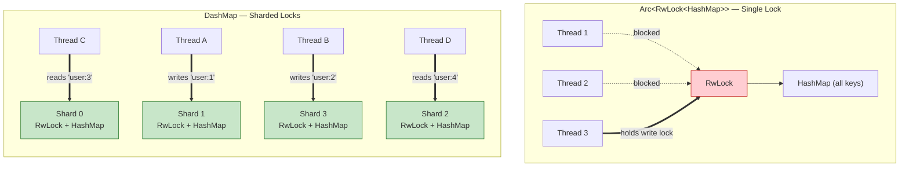

# 2. Highly Concurrent State with `dashmap` 🔴

> **What you'll learn:**
> - Why `Arc<RwLock<HashMap<K, V>>>` becomes a serial bottleneck under high thread contention — and the CPU cache mechanics that make it worse
> - How `DashMap` shards its internal locks to allow massive concurrent read/write throughput
> - The `entry()` API for atomic read-modify-write operations without races
> - When `DashMap` is *not* the right choice, and what to use instead

---

## The Problem: The Global Lock Serializes Everything

The most common concurrent map pattern in Rust looks like this:

```rust
use std::collections::HashMap;
use std::sync::{Arc, RwLock};

type SharedMap = Arc<RwLock<HashMap<String, Vec<u8>>>>;

async fn handle_request(map: SharedMap, key: String, value: Vec<u8>) {
    // ⚠️ PERFORMANCE HAZARD: Every writer blocks every reader
    let mut guard = map.write().unwrap();
    guard.insert(key, value);
    // Guard is held for the entire insert — including the hash computation,
    // possible reallocation, and drop of the old value.
}
```

This code is correct. Under low contention (a few threads, low request rate), it's fine. Under high contention (64+ cores, 100k+ requests/second), it's catastrophic.

### Why it's slow: CPU cache invalidation

When a thread acquires an `RwLock` write lock, the hardware must:

1. **Invalidate the cache line** containing the lock word on every other core.
2. Every core that was caching the `HashMap`'s internal data must **re-fetch** those cache lines from main memory or another core's cache.
3. While the write lock is held, **all readers are blocked** — even if they want to access completely unrelated keys.

On a 64-core machine, a single write lock can stall 63 cores. The throughput collapses to effectively single-threaded because the `RwLock` serializes all access through one cache line:

```text
Core 0: [WRITE LOCK] ████████████████████████████████████░░░░░░░
Core 1: [BLOCKED]    ░░░░░░░░░░░░░░░░░░████░░░░░░░░░░░░░░░░░░░
Core 2: [BLOCKED]    ░░░░░░░░░░░░░░░░░░░░░░████░░░░░░░░░░░░░░░
Core 3: [BLOCKED]    ░░░░░░░░░░░░░░░░░░░░░░░░░░████░░░░░░░░░░░
         ─────────── time ──────────────────────────────────────►
```

---

## The Solution: Lock Sharding

`DashMap` solves this by **sharding** the map into N independent segments, each with its own `RwLock`. When you access a key, only the shard containing that key is locked — all other shards remain available for concurrent access.

```rust
use dashmap::DashMap;

// ✅ FIX: Sharded locking — writers on different keys never block each other
let map: DashMap<String, Vec<u8>> = DashMap::new();

// Two threads writing to different keys proceed in parallel:
// Thread A writes "user:1" → locks shard 7
// Thread B writes "user:2" → locks shard 3
// No contention!
```



The default shard count is `(num_cpus * 4)`, rounded up to a power of two. On a 16-core machine, that's 64 shards. The probability that two random keys hash to the same shard is ~1/64 — contention drops by ~98%.

---

## `DashMap` Internals: How Sharding Works

Internally, a `DashMap<K, V>` is:

```rust
// Simplified — actual implementation details differ
struct DashMap<K, V> {
    shards: Box<[RwLock<HashMap<K, V>>]>, // N independent shards
    hasher: RandomState,                    // Hash function
}
```

When you call `map.insert(key, value)`:

1. Hash the key: `let hash = self.hasher.hash(&key);`
2. Select the shard: `let shard_idx = hash % self.shards.len();`
3. Lock **only that shard**: `let mut guard = self.shards[shard_idx].write();`
4. Insert into the shard's `HashMap`: `guard.insert(key, value);`

The shard selection is O(1) and the lock is held only for one shard. All other shards remain accessible to other threads.

---

## The Core API

### Basic CRUD

```rust
use dashmap::DashMap;

let cache: DashMap<String, u64> = DashMap::new();

// Insert
cache.insert("counter".to_string(), 0);

// Read — returns a Ref<K, V> (RAII guard that holds the shard's read lock)
if let Some(val) = cache.get("counter") {
    println!("counter = {}", *val); // Deref to &V
    // ⚠️ The shard read lock is held while `val` is alive!
}
// Lock released here when `val` is dropped

// Remove — returns Option<(K, V)>
let removed = cache.remove("counter");
```

### The `entry()` API: Atomic Read-Modify-Write

The most powerful feature of `DashMap` is its `entry()` API, which allows atomic read-modify-write without race conditions:

```rust
use dashmap::DashMap;

let counters: DashMap<String, u64> = DashMap::new();

// ⚠️ PERFORMANCE HAZARD: Race condition with get-then-insert
// Thread A reads counter = 5
// Thread B reads counter = 5
// Thread A writes counter = 6
// Thread B writes counter = 6  ← Lost update!
if let Some(mut val) = counters.get_mut("hits") {
    *val += 1;
} else {
    counters.insert("hits".to_string(), 1);
}

// ✅ FIX: entry() API — holds the shard lock for the entire operation
counters
    .entry("hits".to_string())
    .and_modify(|count| *count += 1)
    .or_insert(1);
// The shard lock is held atomically across the read + modify + write.
// No other thread can see a stale value.
```

### `entry()` for complex initialization

```rust
use dashmap::DashMap;
use std::collections::HashSet;

let subscriptions: DashMap<String, HashSet<String>> = DashMap::new();

fn subscribe(subs: &DashMap<String, HashSet<String>>, topic: &str, client_id: &str) {
    subs.entry(topic.to_string())
        .or_insert_with(HashSet::new)
        .value_mut()
        .insert(client_id.to_string());
}

// Even under concurrent access, each topic's subscriber set is
// initialized exactly once and updated atomically.
```

---

## Iteration: The Deadlock Trap

Iterating over a `DashMap` acquires read locks on shards **one at a time**. This is important for two reasons:

### 1. The snapshot isn't atomic

Unlike iterating a `HashMap` behind a single `RwLock` (where you see a consistent snapshot), iterating a `DashMap` sees each shard at a different point in time. Items can be inserted or removed between shard boundaries.

```rust
// This iteration sees a "best effort" snapshot — NOT a consistent one
for entry in &cache {
    println!("{}: {}", entry.key(), entry.value());
}
```

### 2. Don't mutate the map while iterating

```rust
// ⚠️ PERFORMANCE HAZARD: Potential deadlock!
// The iterator holds a read lock on shard N.
// Calling .insert() tries to acquire a write lock on some shard.
// If that shard happens to be shard N → DEADLOCK.
for entry in &cache {
    if *entry.value() > 100 {
        cache.insert(entry.key().clone(), 0); // 💀 May deadlock!
    }
}

// ✅ FIX: Collect keys first, then mutate
let keys_to_reset: Vec<String> = cache
    .iter()
    .filter(|entry| *entry.value() > 100)
    .map(|entry| entry.key().clone())
    .collect();

for key in keys_to_reset {
    cache.insert(key, 0); // Safe — no iterator locks held
}
```

### 3. `retain()` for bulk mutation

For bulk filtering, `DashMap` provides `retain()`, which is safe and efficient:

```rust
// Remove all entries where the value is expired
cache.retain(|_key, value| !value.is_expired());
```

`retain()` acquires each shard's write lock one at a time, runs the predicate, and removes non-matching entries. It's safe because it holds only one lock at a time and doesn't expose references that could escape.

---

## Comparison: `RwLock<HashMap>` vs. `DashMap`

| Dimension | `Arc<RwLock<HashMap>>` | `DashMap` |
|-----------|----------------------|-----------|
| **Read contention** | All readers contend on one lock | Readers on different shards are parallel |
| **Write contention** | One writer blocks all readers | Writer blocks only one shard |
| **Iteration consistency** | Atomic snapshot (while locked) | Per-shard snapshot (no global consistency) |
| **Memory overhead** | One lock + one HashMap | N locks + N HashMaps + shard metadata |
| **Predictable latency** | p99 latency spikes under contention | Stable p99 due to reduced contention |
| **Best for** | Low contention, need consistent snapshots | High contention, many independent keys |
| **Deref to HashMap?** | Yes, via the guard | No — you work through the `DashMap` API |

---

## When NOT to Use `DashMap`

`DashMap` is not universally better. Use `RwLock<HashMap>` when:

1. **You need atomic snapshots.** If your logic depends on seeing a consistent view of all keys (e.g., computing a sum of all values), `DashMap` iteration is not sufficient. You need a single lock.

2. **You have a read-heavy, low-contention workload.** `RwLock` allows unlimited concurrent readers. If writes are rare and the map is small, the sharding overhead is pure cost.

3. **You need `.into_inner()` or structural access.** `DashMap` doesn't let you access the inner `HashMap` directly. If you need to serialize/deserialize the entire map or convert it, `RwLock<HashMap>` is simpler.

4. **The map is tiny (< 100 entries).** Sharding overhead and shard metadata cost more than the potential contention savings.

### Alternative: `flurry` (Concurrent HashMap based on Java's ConcurrentHashMap)

For write-heavy workloads where even `DashMap`'s per-shard write locks are too much contention, consider `flurry` (epoch-based, lock-free reads). But `DashMap` is the right default for 95% of cases.

---

## Advanced: Using `DashMap` with `Bytes`

Combining `DashMap` with the `bytes` crate from Chapter 1 gives you a zero-copy concurrent cache:

```rust
use bytes::Bytes;
use dashmap::DashMap;

/// A concurrent key-value cache where both keys and values are
/// reference-counted byte slices. No deep copies on read.
type Cache = DashMap<Bytes, Bytes>;

fn cache_example() {
    let cache: Cache = DashMap::new();

    // Insert — keys and values are Bytes, so sharing is O(1)
    let key = Bytes::from_static(b"session:abc123");
    let value = Bytes::from(vec![0xDE, 0xAD, 0xBE, 0xEF]);
    cache.insert(key.clone(), value);

    // Read — the Ref guard holds a shard read lock.
    // Cloning the Bytes value inside is O(1) (Arc bump).
    if let Some(entry) = cache.get(&key) {
        let val: Bytes = entry.value().clone(); // ✅ O(1) clone
        // Use val after dropping the guard
        drop(entry);
        println!("value len = {}", val.len());
    }
}
```

This pattern is the foundation of the capstone project in Chapter 6. All keys and values are `Bytes` — inserts are moves, reads are cheap clones, and the concurrent map never becomes a bottleneck.

---

## Benchmarking: Empirical Evidence

Here's a schematic comparison of throughput under contention. Actual numbers depend on hardware, but the relative scaling is consistent:

```text
Throughput (ops/sec) vs. Thread Count

               4 threads    16 threads    64 threads
RwLock<HashMap>  2.1M ops     1.8M ops ↓    0.9M ops ↓↓
DashMap          2.0M ops     7.2M ops ↑   24.1M ops ↑↑

            ↓ = RwLock contention causes throughput to DROP as cores increase
            ↑ = DashMap scales linearly because shards eliminate contention
```

The critical observation: `RwLock<HashMap>` gets **slower** as you add cores (more contention, more cache invalidation). `DashMap` gets **faster** (more shards utilized, less cross-shard contention).

---

<details>
<summary><strong>🏋️ Exercise: Build a Concurrent Rate Limiter</strong> (click to expand)</summary>

Build a thread-safe rate limiter using `DashMap` that tracks request counts per client IP address. Requirements:

1. `fn check_rate(limiter: &DashMap<String, (u64, Instant)>, client_ip: &str, max_requests: u64, window: Duration) -> bool`
2. Returns `true` if the request is allowed, `false` if rate-limited.
3. Each entry stores `(request_count, window_start)`.
4. If the window has expired, reset the counter.
5. Must be safe under concurrent access from multiple Tokio tasks.
6. Use the `entry()` API to avoid race conditions.

<details>
<summary>🔑 Solution</summary>

```rust
use dashmap::DashMap;
use std::time::{Duration, Instant};

/// Checks whether a request from `client_ip` is within the rate limit.
///
/// Returns `true` if allowed, `false` if rate-limited.
///
/// Uses DashMap's entry() API to perform an atomic read-modify-write:
/// - If the client has no entry, create one with count=1.
/// - If the window has expired, reset the counter.
/// - If the counter exceeds max_requests, reject.
fn check_rate(
    limiter: &DashMap<String, (u64, Instant)>,
    client_ip: &str,
    max_requests: u64,
    window: Duration,
) -> bool {
    let now = Instant::now();

    // entry() holds the shard lock for the entire read-modify-write.
    // No other thread can see a stale value for this key.
    let mut entry = limiter
        .entry(client_ip.to_string())
        .or_insert_with(|| (0, now)); // Initialize with count=0 if new

    let (count, window_start) = entry.value_mut();

    // Check if the current window has expired
    if now.duration_since(*window_start) >= window {
        // Reset the window
        *count = 1;
        *window_start = now;
        return true; // First request in new window — always allowed
    }

    // Window still active — check the counter
    if *count >= max_requests {
        return false; // Rate limited!
    }

    // Increment and allow
    *count += 1;
    true
}

#[cfg(test)]
mod tests {
    use super::*;

    #[test]
    fn test_rate_limiter_allows_within_limit() {
        let limiter = DashMap::new();
        let window = Duration::from_secs(60);

        // First 5 requests should be allowed
        for _ in 0..5 {
            assert!(check_rate(&limiter, "192.168.1.1", 5, window));
        }

        // 6th request should be rejected
        assert!(!check_rate(&limiter, "192.168.1.1", 5, window));
    }

    #[test]
    fn test_rate_limiter_independent_clients() {
        let limiter = DashMap::new();
        let window = Duration::from_secs(60);

        // Fill up client A's quota
        for _ in 0..5 {
            check_rate(&limiter, "client_a", 5, window);
        }
        assert!(!check_rate(&limiter, "client_a", 5, window));

        // Client B is unaffected
        assert!(check_rate(&limiter, "client_b", 5, window));
    }
}
```

</details>
</details>

---

> **Key Takeaways:**
> - `Arc<RwLock<HashMap>>` serializes all access through one lock. Under high contention, throughput *decreases* as you add cores due to CPU cache invalidation and lock convoy effects.
> - `DashMap` shards the map into N independent segments, each with its own `RwLock`. Contention drops by ~N× because threads accessing different keys lock different shards.
> - Use the `entry()` API for atomic read-modify-write operations. Never do a `.get()` followed by an `.insert()` — that's a race condition.
> - Iteration over a `DashMap` is not an atomic snapshot. If you need consistency, collect to a `Vec` first or use `RwLock<HashMap>`.
> - Never mutate a `DashMap` from within its own iterator — this can deadlock. Use `retain()` for bulk mutations or collect keys first.

> **See also:**
> - [Chapter 1: Zero-Copy Networking with `bytes`](ch01-zero-copy-networking-with-bytes.md) — combining `DashMap<Bytes, Bytes>` for a zero-copy cache
> - [Chapter 6: Capstone](ch06-capstone-zero-copy-in-memory-cache.md) — building a concurrent cache server backed by `DashMap`
> - [Concurrency in Rust](../concurrency-book/src/SUMMARY.md) — deeper coverage of `RwLock`, `Mutex`, atomics, and `Send`/`Sync`
