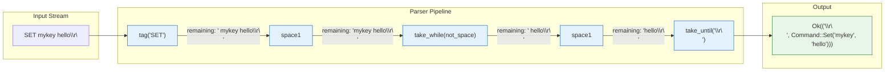

# 3. Parser Combinators with `nom` (and `winnow`) 🔴

> **What you'll learn:**
> - Why `Regex` is too slow and manual `for` loops are too dangerous for parsing binary and text protocols
> - The `IResult<I, O, E>` type and the combinator mental model: small parsers composed into complex grammars
> - How to write streaming-safe parsers that handle incomplete network data via `Err(Incomplete)`
> - How `winnow` provides a more ergonomic API over the same combinator philosophy

---

## The Problem: Why Not Regex?

When engineers need to parse structured text, they reach for `Regex`. It's familiar, it's powerful, and it's wrong for protocol parsing. Here's why:

```rust
use regex::Regex;

// ⚠️ PERFORMANCE HAZARD: Regex for structured command parsing
fn parse_command_regex(input: &str) -> Option<(&str, &str, &str)> {
    let re = Regex::new(r"^(SET|GET|DEL)\s+(\S+)\s*(.*)$").unwrap(); // ⚠️ Compiled every call!
    let caps = re.captures(input)?;
    Some((
        caps.get(1)?.as_str(),
        caps.get(2)?.as_str(),
        caps.get(3)?.as_str(),
    ))
}
```

| Problem | Regex | Parser Combinators |
|---------|-------|-------------------|
| **Performance** | NFA/DFA compilation overhead; backtracking on complex patterns | Zero-cost function calls; no backtracking overhead for LL grammars |
| **Binary data** | Operates on `&str` — cannot parse raw `&[u8]` naturally | Natively operates on `&[u8]`, `&str`, or any input type |
| **Streaming** | Cannot handle incomplete input — panics or returns no match | Returns `Err(Incomplete(Needed))` — caller reads more data and retries |
| **Error quality** | "No match" — no information about *where* or *why* | Precise byte offset: "expected `SET` at offset 0, found `SEX`" |
| **Composability** | Flat pattern string — cannot nest or reuse sub-patterns cleanly | Functions that compose: `parse_header`, `parse_body`, `parse_frame` |
| **Type safety** | Returns `&str` captures — you parse types manually | Returns typed Rust values: `(Command, Key, Value)` |

The fundamental issue: **Regex is a pattern-matching language. Parsing is a grammar problem.** Parser combinators let you write grammars as composable Rust functions.

---

## The `nom` Mental Model

`nom` is built on a single idea: **a parser is a function**.

```rust
// Every nom parser has this signature:
fn parser(input: &[u8]) -> IResult<&[u8], Output> { ... }

// IResult is:
type IResult<I, O, E = nom::error::Error<I>> = Result<(I, O), Err<E>>;

// On success: Ok((remaining_input, parsed_output))
// On failure: Err(Error(...)) or Err(Incomplete(Needed))
```

The key insight: **every parser returns the remaining input along with the parsed value**. This is what makes composition work — the remaining input from one parser becomes the input to the next.



---

## First Parser: Parsing a Simple Command

Let's build a parser for a Redis-like text protocol: `SET key value\r\n`

### The Standard Library Way (Brittle)

```rust
// ⚠️ PERFORMANCE HAZARD: Manual string splitting — no error context, panics on edge cases
fn parse_command_manual(input: &str) -> Result<(&str, &str, &str), String> {
    let parts: Vec<&str> = input.trim().splitn(3, ' ').collect();
    if parts.len() < 3 {
        return Err("not enough parts".to_string()); // ⚠️ No offset, no context
    }
    Ok((parts[0], parts[1], parts[2]))
}
// What if the value contains spaces? What if input has no newline?
// What if the command is "SET" but key is missing? All silently wrong.
```

### The Architect's Way (nom)

```rust
use nom::{
    bytes::complete::{tag, take_while1},
    character::complete::{space1, line_ending},
    combinator::map,
    sequence::{preceded, terminated, tuple},
    branch::alt,
    IResult,
};

#[derive(Debug, PartialEq)]
enum Command<'a> {
    Set { key: &'a str, value: &'a str },
    Get { key: &'a str },
    Del { key: &'a str },
}

/// Matches one or more non-whitespace characters.
fn key(input: &str) -> IResult<&str, &str> {
    take_while1(|c: char| !c.is_whitespace())(input)
}

/// Parses "SET key value\r\n"
fn parse_set(input: &str) -> IResult<&str, Command> {
    let (input, _) = tag("SET")(input)?;
    let (input, _) = space1(input)?;
    let (input, k) = key(input)?;
    let (input, _) = space1(input)?;
    let (input, v) = take_while1(|c: char| c != '\r' && c != '\n')(input)?;
    let (input, _) = line_ending(input)?;
    Ok((input, Command::Set { key: k, value: v }))
}

/// Parses "GET key\r\n"
fn parse_get(input: &str) -> IResult<&str, Command> {
    let (input, _) = tag("GET")(input)?;
    let (input, _) = space1(input)?;
    let (input, k) = key(input)?;
    let (input, _) = line_ending(input)?;
    Ok((input, Command::Get { key: k }))
}

/// Parses "DEL key\r\n"
fn parse_del(input: &str) -> IResult<&str, Command> {
    let (input, _) = tag("DEL")(input)?;
    let (input, _) = space1(input)?;
    let (input, k) = key(input)?;
    let (input, _) = line_ending(input)?;
    Ok((input, Command::Del { key: k }))
}

/// Top-level command parser — tries SET, GET, DEL in order.
fn parse_command(input: &str) -> IResult<&str, Command> {
    alt((parse_set, parse_get, parse_del))(input)
}

#[test]
fn test_parse_commands() {
    assert_eq!(
        parse_command("SET mykey hello\r\n"),
        Ok(("", Command::Set { key: "mykey", value: "hello" }))
    );
    assert_eq!(
        parse_command("GET mykey\r\n"),
        Ok(("", Command::Get { key: "mykey" }))
    );
}
```

Every `Command` variant borrows directly from the input string — **zero allocations**. The parsed `key` and `value` are `&str` slices into the original input.

---

## Core Combinators Reference

`nom` provides a rich library of composable combinators. Here are the most important:

### Matching

| Combinator | What it does | Example |
|-----------|-------------|---------|
| `tag("SET")` | Matches an exact literal | `"SET foo" → Ok((" foo", "SET"))` |
| `take(4u8)` | Takes exactly N bytes/chars | `"abcdef" → Ok(("ef", "abcd"))` |
| `take_while1(pred)` | Takes 1+ chars matching predicate | `"abc 123" → Ok((" 123", "abc"))` |
| `take_until("end")` | Takes bytes until a literal is found | `"data end" → Ok((" end", "data"))` |

### Character classes

| Combinator | What it matches |
|-----------|----------------|
| `alpha1` | `[a-zA-Z]+` |
| `digit1` | `[0-9]+` |
| `space1` | One or more whitespace chars |
| `line_ending` | `\r\n` or `\n` |
| `newline` | `\n` only |

### Sequencing

| Combinator | What it does |
|-----------|-------------|
| `tuple((p1, p2, p3))` | Run parsers in sequence, return tuple of results |
| `preceded(p1, p2)` | Run p1 then p2, return only p2's result |
| `terminated(p1, p2)` | Run p1 then p2, return only p1's result |
| `delimited(open, body, close)` | Matches `open body close`, returns `body` |
| `separated_pair(p1, sep, p2)` | Matches `p1 sep p2`, returns `(p1_out, p2_out)` |

### Branching

| Combinator | What it does |
|-----------|-------------|
| `alt((p1, p2, p3))` | Try p1, then p2, then p3 — first success wins |
| `opt(p)` | Try p — on failure, return `None` (never fails) |

### Repetition

| Combinator | What it does |
|-----------|-------------|
| `many0(p)` | Run `p` zero or more times, collect into `Vec` |
| `many1(p)` | Run `p` one or more times |
| `count(p, n)` | Run `p` exactly `n` times |
| `separated_list1(sep, p)` | Parse `p sep p sep p …`, return `Vec` |

### Transformation

| Combinator | What it does |
|-----------|-------------|
| `map(p, f)` | Apply function `f` to parser output |
| `map_res(p, f)` | Apply fallible function `f` — propagates error |
| `value(val, p)` | If `p` succeeds, return `val` instead |
| `verify(p, pred)` | Run `p`, then check predicate — fail if false |

---

## Working with `&[u8]` (Binary Parsing)

`nom` isn't just for text. It's arguably more powerful for binary data:

```rust
use nom::{
    bytes::complete::{tag, take},
    number::complete::{be_u16, be_u32},
    IResult,
};

/// Parse a simple binary header:
///   [0xCA 0xFE]  magic (2 bytes)
///   [u32]        payload_length (4 bytes, big-endian)
///   [u16]        message_type (2 bytes, big-endian)
#[derive(Debug)]
struct Header {
    payload_length: u32,
    message_type: u16,
}

fn parse_header(input: &[u8]) -> IResult<&[u8], Header> {
    let (input, _) = tag(&[0xCA, 0xFE])(input)?;   // Match magic bytes
    let (input, payload_length) = be_u32(input)?;     // Parse big-endian u32
    let (input, message_type) = be_u16(input)?;       // Parse big-endian u16
    Ok((input, Header { payload_length, message_type }))
}

#[test]
fn test_binary_header() {
    let data = [
        0xCA, 0xFE,             // magic
        0x00, 0x00, 0x00, 0x0A, // payload_length = 10
        0x00, 0x01,             // message_type = 1
        // ... payload would follow
    ];
    let (remaining, header) = parse_header(&data).unwrap();
    assert_eq!(header.payload_length, 10);
    assert_eq!(header.message_type, 1);
    assert_eq!(remaining.len(), 0);
}
```

---

## Streaming vs. Complete: Handling Network Buffers

`nom` has two module families:

- `nom::bytes::complete` — Fails immediately if input is insufficient.
- `nom::bytes::streaming` — Returns `Err(Incomplete(Needed))` if input *might* be insufficient.

For network protocols, **always use `streaming`** variants:

```rust
use nom::{
    bytes::streaming::{tag, take},
    number::streaming::be_u32,
    Err, Needed, IResult,
};

fn parse_frame_streaming(input: &[u8]) -> IResult<&[u8], &[u8]> {
    let (input, _magic) = tag(&[0xCA, 0xFE])(input)?;
    let (input, length) = be_u32(input)?;
    let (input, payload) = take(length)(input)?;
    Ok((input, payload))
}

#[test]
fn test_incomplete_input() {
    // Only 4 bytes — not enough for magic (2) + length (4)
    let partial = &[0xCA, 0xFE, 0x00, 0x00];
    match parse_frame_streaming(partial) {
        Err(Err::Incomplete(Needed::Size(n))) => {
            println!("Need {} more bytes", n);
            // The caller should read more data into the buffer and retry.
        }
        Err(Err::Incomplete(Needed::Unknown)) => {
            println!("Need more data (unknown amount)");
        }
        other => panic!("Expected Incomplete, got {:?}", other),
    }
}
```

### The streaming read loop pattern

```rust
use bytes::BytesMut;
use tokio::io::AsyncReadExt;
use tokio::net::TcpStream;

async fn read_loop(mut stream: TcpStream) -> anyhow::Result<()> {
    let mut buf = BytesMut::with_capacity(4096);

    loop {
        // Read more data from the network
        if stream.read_buf(&mut buf).await? == 0 {
            if buf.is_empty() {
                break; // Clean disconnect
            }
            anyhow::bail!("connection closed with incomplete frame");
        }

        // Try to parse as many complete frames as possible
        loop {
            match parse_frame_streaming(&buf) {
                Ok((remaining, payload)) => {
                    let consumed = buf.len() - remaining.len();
                    let frame = buf.split_to(consumed);
                    process_frame(&frame);
                    // Continue — there might be another frame in the buffer
                }
                Err(nom::Err::Incomplete(_)) => {
                    break; // Need more data — go back to reading
                }
                Err(e) => {
                    anyhow::bail!("parse error: {:?}", e);
                }
            }
        }
    }
    Ok(())
}
# fn parse_frame_streaming(_: &[u8]) -> nom::IResult<&[u8], &[u8]> { todo!() }
# fn process_frame(_: &[u8]) {}
```

This is the canonical pattern for combining `bytes::BytesMut` with `nom` streaming parsers. The `BytesMut` accumulates data across reads, and the `nom` parser incrementally consumes complete frames.

---

## `winnow`: The Ergonomic Alternative

`winnow` is a fork/evolution of `nom` that provides a more ergonomic API while maintaining the same performance. The key difference: parsers are methods on a `Stream` trait, and error handling is more composable.

```rust
use winnow::{
    ascii::{alpha1, space1, line_ending},
    combinator::{alt, preceded, terminated},
    token::take_while,
    PResult, Parser,
};

fn key<'a>(input: &mut &'a str) -> PResult<&'a str> {
    take_while(1.., |c: char| !c.is_whitespace()).parse_next(input)
}

fn parse_get_winnow<'a>(input: &mut &'a str) -> PResult<(&'a str,)> {
    let _ = "GET".parse_next(input)?;
    let _ = space1.parse_next(input)?;
    let k = key.parse_next(input)?;
    let _ = line_ending.parse_next(input)?;
    Ok((k,))
}
```

### `nom` vs. `winnow`

| Feature | `nom` | `winnow` |
|---------|-------|---------|
| **Input signature** | `fn(input) -> IResult<input, output>` | `fn(input: &mut Stream) -> PResult<output>` |
| **Remaining input** | Returned in the `Ok` tuple | Mutated in-place via `&mut` |
| **Error quality** | Good with `VerboseError` | Excellent with built-in context labels |
| **Community adoption** | Larger ecosystem, more examples | Growing, actively developed |
| **Binary parsing** | Excellent | Excellent |
| **Recommended for** | Existing projects, broad ecosystem | New projects, better ergonomics |

Both are excellent choices. This book uses `nom` for examples because of its larger ecosystem, but the patterns translate directly to `winnow`.

---

## Error Handling: Making Parse Failures Useful

By default, `nom` errors are minimal. For production use, switch to `VerboseError`:

```rust
use nom::{
    bytes::complete::tag,
    error::{VerboseError, context},
    IResult,
};

type Res<'a, O> = IResult<&'a str, O, VerboseError<&'a str>>;

fn parse_magic(input: &str) -> Res<&str> {
    context("expected magic header 'PROTO'", tag("PROTO"))(input)
}

fn parse_version(input: &str) -> Res<&str> {
    context("expected version '1.0'", tag("1.0"))(input)
}

#[test]
fn test_verbose_error() {
    let input = "PROTO 2.0";
    match parse_version(&input[6..]) {
        Err(nom::Err::Error(e)) => {
            // VerboseError gives you a stack of (input_slice, ErrorKind) pairs
            // that show exactly where parsing failed and what was expected.
            let msg = nom::error::convert_error(input, e);
            println!("{}", msg);
        }
        _ => {}
    }
}
```

Chapter 5 shows how to integrate `nom` errors with `miette` for compiler-grade diagnostic output.

---

<details>
<summary><strong>🏋️ Exercise: Parse a Key-Value Config File</strong> (click to expand)</summary>

Write a `nom` parser for a simple config file format:

```text
# This is a comment
host = 127.0.0.1
port = 8080
name = My Server
```

Requirements:
1. Lines starting with `#` are comments (skip them).
2. Key-value pairs are separated by `=` with optional whitespace around it.
3. Keys are alphanumeric + underscores.
4. Values are everything after `=` until the line ending.
5. Return a `Vec<(&str, &str)>` of parsed key-value pairs.

<details>
<summary>🔑 Solution</summary>

```rust
use nom::{
    bytes::complete::{tag, take_while1, take_while},
    character::complete::{line_ending, space0, not_line_ending},
    combinator::{opt, value},
    multi::many0,
    branch::alt,
    sequence::{separated_pair, terminated, preceded},
    IResult,
};

/// Matches a comment line: # followed by anything until end of line
fn comment(input: &str) -> IResult<&str, ()> {
    value(
        (),
        terminated(
            preceded(tag("#"), not_line_ending),
            line_ending,
        ),
    )(input)
}

/// Matches an empty line (just whitespace + newline)
fn blank_line(input: &str) -> IResult<&str, ()> {
    value((), terminated(space0, line_ending))(input)
}

/// Matches a config key: one or more alphanumeric or underscore characters
fn config_key(input: &str) -> IResult<&str, &str> {
    take_while1(|c: char| c.is_alphanumeric() || c == '_')(input)
}

/// Matches a config value: everything up to (but not including) the line ending
fn config_value(input: &str) -> IResult<&str, &str> {
    // Trim leading whitespace from the value
    let (input, raw) = not_line_ending(input)?;
    Ok((input, raw.trim()))
}

/// Parses "key = value\n" — returns (key, value) as borrowed slices
fn key_value_pair(input: &str) -> IResult<&str, (&str, &str)> {
    terminated(
        separated_pair(
            config_key,                // left: the key
            preceded(space0, preceded(tag("="), space0)), // separator: optional spaces around =
            config_value,              // right: the value
        ),
        line_ending,
    )(input)
}

/// A config line is either a comment (skip), a blank line (skip), or a key-value pair
fn config_line(input: &str) -> IResult<&str, Option<(&str, &str)>> {
    alt((
        // Comments and blank lines produce None
        value(None, comment),
        value(None, blank_line),
        // Key-value pairs produce Some((key, value))
        nom::combinator::map(key_value_pair, Some),
    ))(input)
}

/// Parse an entire config file into a list of (key, value) pairs
fn parse_config(input: &str) -> IResult<&str, Vec<(&str, &str)>> {
    let (input, lines) = many0(config_line)(input)?;
    // Filter out the None entries (comments and blank lines)
    let pairs: Vec<(&str, &str)> = lines.into_iter().flatten().collect();
    Ok((input, pairs))
}

#[cfg(test)]
mod tests {
    use super::*;

    #[test]
    fn test_parse_config() {
        let input = "# Database config\n\
                     host = 127.0.0.1\n\
                     port = 8080\n\
                     # Application\n\
                     name = My Server\n";

        let (remaining, pairs) = parse_config(input).unwrap();
        assert_eq!(remaining, "");
        assert_eq!(pairs, vec![
            ("host", "127.0.0.1"),
            ("port", "8080"),
            ("name", "My Server"),
        ]);
    }
}
```

</details>
</details>

---

> **Key Takeaways:**
> - A `nom` parser is a function `fn(Input) -> IResult<Input, Output>`. The remaining input from one parser becomes the input to the next — this is what makes composition work.
> - Use `streaming` variants for network protocols. They return `Err(Incomplete)` when the buffer doesn't have enough data, letting you read more and retry without losing state.
> - The `alt` combinator implements ordered choice (try this, then that). The `tuple` combinator sequences parsers. Together, they can express any context-free grammar.
> - `nom` parsers on `&[u8]` produce zero-copy results: the output borrows directly from the input slice. No `String` allocations.
> - `winnow` is a more ergonomic alternative with `&mut` input and built-in context labels. Choose whichever fits your team's style.

> **See also:**
> - [Chapter 4: Designing Custom Binary Protocols](ch04-designing-custom-binary-protocols.md) — applying `nom` to build a complete binary frame parser
> - [Chapter 5: Developer-Facing Errors with `miette`](ch05-developer-facing-errors-with-miette.md) — turning `nom` parse failures into beautiful diagnostic output
> - [Chapter 6: Capstone](ch06-capstone-zero-copy-in-memory-cache.md) — using `nom` to parse the cache protocol
