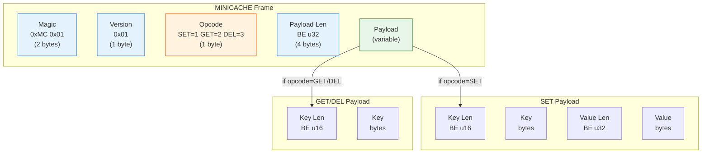

# 4. Designing Custom Binary Protocols 🔴

> **What you'll learn:**
> - How to design a length-prefixed binary wire protocol from scratch, with magic bytes, version fields, and typed command opcodes
> - How to build a zero-copy `nom` parser that maps byte slices directly into borrowed Rust structs with zero heap allocations
> - How to combine `bytes::BytesMut` with `nom` streaming parsers for production-grade frame extraction from TCP streams
> - The critical difference between "parsing" (interpreting bytes) and "deserializing" (allocating copies)

---

## Why Binary Protocols?

Text protocols (HTTP/1.1, Redis RESP, SMTP) are human-readable and easy to debug. They are also:

1. **Wasteful**: The number `4294967295` is 10 bytes as text, 4 bytes as a `u32`.
2. **Ambiguous**: Whitespace handling, encoding, escaping edge cases.
3. **Slow to parse**: Every field must be scanned character-by-character.

Binary protocols encode data directly as typed fields at fixed offsets. Parsing is pointer arithmetic, not string scanning. When throughput matters — internal microservice communication, database wire protocols, game networking — binary protocols win.

| Dimension | Text Protocol | Binary Protocol |
|-----------|--------------|----------------|
| **Parsing speed** | O(n) string scanning | O(1) offset jumps for fixed fields |
| **Bandwidth** | ~2–5× larger on wire | Compact; types have known sizes |
| **Debugging** | `curl` / `telnet` | Requires tooling (Wireshark, custom CLI) |
| **Schema evolution** | Ad hoc (headers, versioning) | Explicit (version field, TLV extensions) |
| **Zero-copy parsing** | Difficult (encoding issues) | Natural (byte slices map to structs) |

---

## The Protocol: MINICACHE

We'll design a simple binary protocol called **MINICACHE** — the wire format for our capstone cache server (Chapter 6). It supports three operations: `SET`, `GET`, and `DEL`.

### Frame Layout

```text
┌─────────┬─────────┬──────────┬────────────┬──────────────────────┐
│  Magic  │ Version │  Opcode  │ Payload Len│      Payload         │
│ 2 bytes │ 1 byte  │  1 byte  │  4 bytes   │   variable           │
│ 0xMC01  │  0x01   │ SET=1    │  BE u32    │   depends on opcode  │
│         │         │ GET=2    │            │                      │
│         │         │ DEL=3    │            │                      │
└─────────┴─────────┴──────────┴────────────┴──────────────────────┘
         8-byte fixed header              variable payload
```

### SET Payload

```text
┌──────────┬───────────┬──────────┬─────────────┐
│ Key Len  │    Key    │ Value Len│    Value     │
│ 2 bytes  │ variable  │ 4 bytes  │  variable    │
│ BE u16   │  bytes    │ BE u32   │   bytes      │
└──────────┴───────────┴──────────┴─────────────┘
```

### GET / DEL Payload

```text
┌──────────┬───────────┐
│ Key Len  │    Key    │
│ 2 bytes  │ variable  │
│ BE u16   │  bytes    │
└──────────┴───────────┘
```



---

## Defining the Rust Types

```rust
/// Protocol magic bytes: 0x4D 0x43 (ASCII "MC") followed by 0x01.
const MAGIC: &[u8; 2] = &[0x4D, 0x43];
const VERSION: u8 = 0x01;
const HEADER_SIZE: usize = 8; // 2 magic + 1 version + 1 opcode + 4 payload_len

#[derive(Debug, Clone, Copy, PartialEq, Eq)]
#[repr(u8)]
enum Opcode {
    Set = 1,
    Get = 2,
    Del = 3,
}

impl Opcode {
    fn from_u8(v: u8) -> Option<Opcode> {
        match v {
            1 => Some(Opcode::Set),
            2 => Some(Opcode::Get),
            3 => Some(Opcode::Del),
            _ => None,
        }
    }
}

/// A parsed MINICACHE command.
/// All byte slices borrow directly from the input buffer — zero allocations.
#[derive(Debug, PartialEq)]
enum Command<'a> {
    Set { key: &'a [u8], value: &'a [u8] },
    Get { key: &'a [u8] },
    Del { key: &'a [u8] },
}
```

The critical design decision: `Command<'a>` borrows from the input. No `Vec<u8>`, no `String`, no `Bytes` — just `&[u8]` slices pointing into the original network buffer. This is what "zero-copy parsing" means.

---

## Building the Parser with `nom`

### Step 1: Parse the fixed header

```rust
use nom::{
    bytes::streaming::{tag, take},
    number::streaming::{be_u8, be_u16, be_u32},
    IResult, Err as NomErr, Needed,
};

#[derive(Debug)]
struct FrameHeader {
    opcode: Opcode,
    payload_len: u32,
}

fn parse_header(input: &[u8]) -> IResult<&[u8], FrameHeader> {
    let (input, _) = tag(MAGIC.as_slice())(input)?;  // Match magic bytes
    let (input, version) = be_u8(input)?;              // Parse version
    if version != VERSION {
        return Err(NomErr::Failure(nom::error::Error::new(
            input,
            nom::error::ErrorKind::Verify,
        )));
    }
    let (input, opcode_byte) = be_u8(input)?;          // Parse opcode
    let opcode = Opcode::from_u8(opcode_byte).ok_or_else(|| {
        NomErr::Failure(nom::error::Error::new(input, nom::error::ErrorKind::Verify))
    })?;
    let (input, payload_len) = be_u32(input)?;          // Parse payload length
    Ok((input, FrameHeader { opcode, payload_len }))
}
```

### Step 2: Parse the payload based on opcode

```rust
/// Parse a length-prefixed byte slice: [u16 len][bytes]
fn parse_key(input: &[u8]) -> IResult<&[u8], &[u8]> {
    let (input, len) = be_u16(input)?;
    take(len as usize)(input)
}

/// Parse the SET payload: [u16 key_len][key][u32 value_len][value]
fn parse_set_payload(input: &[u8]) -> IResult<&[u8], Command> {
    let (input, key) = parse_key(input)?;
    let (input, value_len) = be_u32(input)?;
    let (input, value) = take(value_len as usize)(input)?;
    Ok((input, Command::Set { key, value }))
}

/// Parse the GET payload: [u16 key_len][key]
fn parse_get_payload(input: &[u8]) -> IResult<&[u8], Command> {
    let (input, key) = parse_key(input)?;
    Ok((input, Command::Get { key }))
}

/// Parse the DEL payload: [u16 key_len][key]
fn parse_del_payload(input: &[u8]) -> IResult<&[u8], Command> {
    let (input, key) = parse_key(input)?;
    Ok((input, Command::Del { key }))
}
```

### Step 3: The complete frame parser

```rust
/// Parse a complete MINICACHE frame from raw bytes.
///
/// Returns:
/// - `Ok((remaining, Command))` if a complete frame was parsed.
/// - `Err(Incomplete)` if the buffer doesn't contain a full frame.
/// - `Err(Error)` or `Err(Failure)` on protocol violations.
fn parse_frame(input: &[u8]) -> IResult<&[u8], Command> {
    let (input, header) = parse_header(input)?;

    // Ensure we have the full payload before proceeding.
    // This is critical for streaming safety — without this check,
    // the payload parsers would return Incomplete at unpredictable points.
    if input.len() < header.payload_len as usize {
        return Err(NomErr::Incomplete(Needed::new(
            header.payload_len as usize - input.len(),
        )));
    }

    // Take exactly payload_len bytes for the payload parser
    let (remaining, payload_bytes) = take(header.payload_len as usize)(input)?;

    // Parse the payload based on opcode
    let (_, command) = match header.opcode {
        Opcode::Set => parse_set_payload(payload_bytes)?,
        Opcode::Get => parse_get_payload(payload_bytes)?,
        Opcode::Del => parse_del_payload(payload_bytes)?,
    };

    Ok((remaining, command))
}
```

Note the critical pattern on line 12: we take exactly `payload_len` bytes and parse them as a sub-slice. This means:
1. The payload parser cannot accidentally consume bytes from the next frame.
2. Trailing garbage in the payload is detected (the sub-parser returns remaining bytes).
3. The streaming `take` correctly returns `Incomplete` if the buffer is short.

---

## Encoding: Building Frames

Parsing is only half the protocol. Here's the encoder using `bytes::BufMut`:

```rust
use bytes::{BytesMut, BufMut};

fn encode_frame(command: &Command, buf: &mut BytesMut) {
    // Reserve space for the header — we'll fill in payload_len after encoding the payload
    let header_start = buf.len();
    buf.put_slice(MAGIC);         // 2 bytes
    buf.put_u8(VERSION);          // 1 byte
    
    // Write opcode
    match command {
        Command::Set { .. } => buf.put_u8(Opcode::Set as u8),
        Command::Get { .. } => buf.put_u8(Opcode::Get as u8),
        Command::Del { .. } => buf.put_u8(Opcode::Del as u8),
    }
    
    // Placeholder for payload length (we'll overwrite this)
    let len_offset = buf.len();
    buf.put_u32(0); // placeholder
    
    let payload_start = buf.len();

    // Encode payload
    match command {
        Command::Set { key, value } => {
            buf.put_u16(key.len() as u16);
            buf.put_slice(key);
            buf.put_u32(value.len() as u32);
            buf.put_slice(value);
        }
        Command::Get { key } | Command::Del { key } => {
            buf.put_u16(key.len() as u16);
            buf.put_slice(key);
        }
    }

    // Patch the payload length
    let payload_len = (buf.len() - payload_start) as u32;
    let len_bytes = payload_len.to_be_bytes();
    buf[len_offset..len_offset + 4].copy_from_slice(&len_bytes);
}
```

---

## Integration: BytesMut + nom Streaming Loop

Here's the production-grade read loop that combines everything:

```rust
use bytes::BytesMut;
use tokio::io::AsyncReadExt;
use tokio::net::TcpStream;

/// Process commands from a single TCP client connection.
async fn handle_client(mut stream: TcpStream) -> anyhow::Result<()> {
    let mut buf = BytesMut::with_capacity(8192);

    loop {
        // Step 1: Read more data from the TCP stream
        let bytes_read = stream.read_buf(&mut buf).await?;
        if bytes_read == 0 {
            if buf.is_empty() {
                return Ok(()); // Clean disconnect
            }
            anyhow::bail!("client disconnected with {} unparsed bytes", buf.len());
        }

        // Step 2: Extract all complete frames from the buffer
        loop {
            match parse_frame(&buf) {
                Ok((remaining, command)) => {
                    // Calculate how many bytes this frame consumed
                    let consumed = buf.len() - remaining.len();
                    
                    // Split off the consumed bytes — O(1)
                    let _ = buf.split_to(consumed);

                    // Process the parsed command
                    match command {
                        Command::Set { key, value } => {
                            println!("SET {:?} = {:?}", 
                                std::str::from_utf8(key), 
                                std::str::from_utf8(value));
                        }
                        Command::Get { key } => {
                            println!("GET {:?}", std::str::from_utf8(key));
                        }
                        Command::Del { key } => {
                            println!("DEL {:?}", std::str::from_utf8(key));
                        }
                    }
                }
                Err(nom::Err::Incomplete(_)) => {
                    // Not enough data for a complete frame — back to reading
                    break;
                }
                Err(e) => {
                    anyhow::bail!("protocol error: {:?}", e);
                }
            }
        }
    }
}
```

The flow:

```text
TCP Read → BytesMut grows → nom parses → split_to() shrinks buffer → repeat
                ↑                              │
                └──────── Incomplete ───────────┘
```

At no point is a single byte copied. The `Command<'a>` borrows from the `BytesMut`, and `split_to` releases the consumed prefix. This is true zero-copy protocol parsing.

---

## Zero-Copy Constraint: The Lifetime Boundary

There's a critical constraint: the `Command<'a>` borrows from the `BytesMut` buffer. This means you **cannot** hold a `Command<'a>` across a `.await` point where the buffer might be modified:

```rust
// ⚠️ PERFORMANCE HAZARD: Tempting but wrong — the borrow prevents further reads
let command = parse_frame(&buf)?; // borrows buf
stream.read_buf(&mut buf).await?; // ⚠️ ERROR: buf is borrowed by command!
```

### Solution 1: Process immediately (as shown above)

Extract the command, process it (insert into `DashMap`, send response), then drop the command before reading again.

### Solution 2: Convert to owned types when you must hold across await

```rust
/// Owned version of Command for cases where you must hold the data
/// across async boundaries.
#[derive(Debug)]
enum OwnedCommand {
    Set { key: bytes::Bytes, value: bytes::Bytes },
    Get { key: bytes::Bytes },
    Del { key: bytes::Bytes },
}

impl OwnedCommand {
    fn from_borrowed(cmd: &Command, buf: &mut BytesMut) -> Self {
        // Convert borrowed slices to Bytes — still zero-copy if
        // the slices point into a BytesMut that we can freeze.
        match cmd {
            Command::Set { key, value } => OwnedCommand::Set {
                key: bytes::Bytes::copy_from_slice(key),
                value: bytes::Bytes::copy_from_slice(value),
            },
            Command::Get { key } => OwnedCommand::Get {
                key: bytes::Bytes::copy_from_slice(key),
            },
            Command::Del { key } => OwnedCommand::Del {
                key: bytes::Bytes::copy_from_slice(key),
            },
        }
    }
}
```

In the capstone project (Chapter 6), we'll see how to minimize these copies by processing commands synchronously within the read loop.

---

## Protocol Design Best Practices

| Practice | Why |
|----------|-----|
| **Always start with a magic number** | Detects protocol mismatches immediately. If byte 0 isn't `0x4D`, the connection isn't speaking MINICACHE. |
| **Include a version byte** | Enables backward-compatible evolution. Server can reject unsupported versions cleanly. |
| **Use length-prefixed framing** | The parser *always* knows how many bytes to expect. No ambiguous delimiters. |
| **Big-endian for wire format** | Network byte order is big-endian by convention. `be_u32` in `nom` matches this. |
| **Validate early** | Check magic and version in the header parser, not in business logic. Reject garbage immediately. |
| **Bound payload sizes** | A `u32` payload length means 4 GiB max. For most protocols, add a configurable max (e.g., 16 MiB) and reject frames exceeding it. |

```rust
const MAX_PAYLOAD_SIZE: u32 = 16 * 1024 * 1024; // 16 MiB

fn parse_header_bounded(input: &[u8]) -> IResult<&[u8], FrameHeader> {
    let (input, header) = parse_header(input)?;
    if header.payload_len > MAX_PAYLOAD_SIZE {
        return Err(NomErr::Failure(nom::error::Error::new(
            input,
            nom::error::ErrorKind::TooLarge,
        )));
    }
    Ok((input, header))
}
```

---

<details>
<summary><strong>🏋️ Exercise: Add a PING/PONG Opcode</strong> (click to expand)</summary>

Extend the MINICACHE protocol with a `PING` command (opcode `4`) and a `PONG` response (opcode `5`). Requirements:

1. `PING` has no payload (payload length = 0).
2. `PONG` has no payload (payload length = 0).
3. Update the `Opcode` enum, the `Command` enum, and the parser.
4. Update the encoder.
5. Write a test that round-trips: encode PING → parse → verify it's `Command::Ping`.

<details>
<summary>🔑 Solution</summary>

```rust
#[derive(Debug, Clone, Copy, PartialEq, Eq)]
#[repr(u8)]
enum Opcode {
    Set = 1,
    Get = 2,
    Del = 3,
    Ping = 4, // ← New
    Pong = 5, // ← New
}

impl Opcode {
    fn from_u8(v: u8) -> Option<Opcode> {
        match v {
            1 => Some(Opcode::Set),
            2 => Some(Opcode::Get),
            3 => Some(Opcode::Del),
            4 => Some(Opcode::Ping), // ← New
            5 => Some(Opcode::Pong), // ← New
            _ => None,
        }
    }
}

#[derive(Debug, PartialEq)]
enum Command<'a> {
    Set { key: &'a [u8], value: &'a [u8] },
    Get { key: &'a [u8] },
    Del { key: &'a [u8] },
    Ping, // ← New: no payload
    Pong, // ← New: no payload
}

fn parse_frame(input: &[u8]) -> IResult<&[u8], Command> {
    let (input, header) = parse_header(input)?;

    if input.len() < header.payload_len as usize {
        return Err(NomErr::Incomplete(Needed::new(
            header.payload_len as usize - input.len(),
        )));
    }

    let (remaining, payload_bytes) = take(header.payload_len as usize)(input)?;

    let (_, command) = match header.opcode {
        Opcode::Set => parse_set_payload(payload_bytes)?,
        Opcode::Get => parse_get_payload(payload_bytes)?,
        Opcode::Del => parse_del_payload(payload_bytes)?,
        // PING and PONG have zero-length payloads.
        // We still "parse" them to verify payload_len == 0.
        Opcode::Ping => {
            if header.payload_len != 0 {
                return Err(NomErr::Failure(nom::error::Error::new(
                    input, nom::error::ErrorKind::Verify,
                )));
            }
            (payload_bytes, Command::Ping)
        }
        Opcode::Pong => {
            if header.payload_len != 0 {
                return Err(NomErr::Failure(nom::error::Error::new(
                    input, nom::error::ErrorKind::Verify,
                )));
            }
            (payload_bytes, Command::Pong)
        }
    };

    Ok((remaining, command))
}

fn encode_frame(command: &Command, buf: &mut BytesMut) {
    buf.put_slice(MAGIC);
    buf.put_u8(VERSION);
    
    match command {
        Command::Set { .. } => buf.put_u8(Opcode::Set as u8),
        Command::Get { .. } => buf.put_u8(Opcode::Get as u8),
        Command::Del { .. } => buf.put_u8(Opcode::Del as u8),
        Command::Ping => buf.put_u8(Opcode::Ping as u8),
        Command::Pong => buf.put_u8(Opcode::Pong as u8),
    }
    
    let len_offset = buf.len();
    buf.put_u32(0); // placeholder for payload length
    
    let payload_start = buf.len();

    match command {
        Command::Set { key, value } => {
            buf.put_u16(key.len() as u16);
            buf.put_slice(key);
            buf.put_u32(value.len() as u32);
            buf.put_slice(value);
        }
        Command::Get { key } | Command::Del { key } => {
            buf.put_u16(key.len() as u16);
            buf.put_slice(key);
        }
        Command::Ping | Command::Pong => {
            // No payload
        }
    }

    // Patch the payload length
    let payload_len = (buf.len() - payload_start) as u32;
    let len_bytes = payload_len.to_be_bytes();
    buf[len_offset..len_offset + 4].copy_from_slice(&len_bytes);
}

#[test]
fn test_ping_roundtrip() {
    use bytes::BytesMut;
    
    let mut buf = BytesMut::new();
    encode_frame(&Command::Ping, &mut buf);
    
    // Should be exactly 8 bytes: 2 magic + 1 version + 1 opcode + 4 payload_len(=0)
    assert_eq!(buf.len(), 8);
    
    let (remaining, cmd) = parse_frame(&buf).unwrap();
    assert_eq!(remaining.len(), 0);
    assert_eq!(cmd, Command::Ping);
}
```

</details>
</details>

---

> **Key Takeaways:**
> - Binary protocols encode typed fields at fixed offsets. Parsing is O(1) pointer arithmetic per field, not O(n) string scanning.
> - Always use length-prefixed framing: a fixed-size header tells the parser exactly how many bytes to expect. Never rely on delimiters in binary protocols.
> - `nom` streaming parsers + `BytesMut` buffers give you a production-grade frame extraction loop: read data, parse frames, split off consumed bytes, repeat.
> - `Command<'a>` with borrowed `&[u8]` fields is true zero-copy parsing — the parsed structs are just views into the network buffer. No heap allocations.
> - Always validate early: check magic, version, and payload size limits in the header parser, not in business logic.

> **See also:**
> - [Chapter 1: Zero-Copy Networking with `bytes`](ch01-zero-copy-networking-with-bytes.md) — the `BytesMut` buffer management that makes frame extraction possible
> - [Chapter 3: Parser Combinators with `nom`](ch03-parser-combinators-with-nom.md) — the foundational combinator concepts used here
> - [Chapter 5: Developer-Facing Errors with `miette`](ch05-developer-facing-errors-with-miette.md) — producing beautiful error diagnostics when the protocol is violated
> - [Chapter 6: Capstone](ch06-capstone-zero-copy-in-memory-cache.md) — the MINICACHE protocol in a full server
> - [Zero-Copy Architecture](../zero-copy-book/src/SUMMARY.md) — broader zero-copy design strategies
