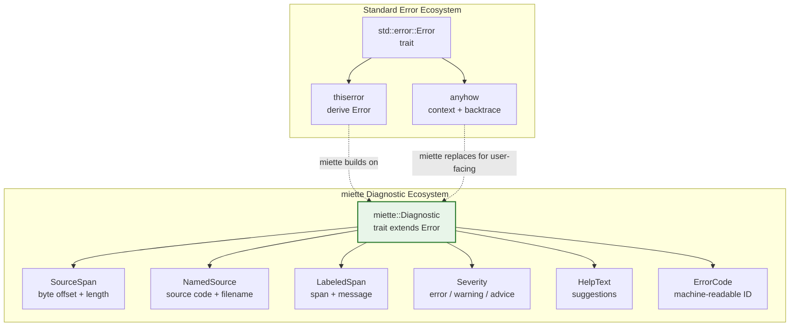

# 5. Developer-Facing Errors with `miette` 🟡

> **What you'll learn:**
> - Why `thiserror` and `anyhow` are insufficient for user-facing tools that need to point at specific source locations
> - How `miette`'s `Diagnostic` trait, `NamedSource`, and `SourceSpan` produce compiler-grade graphical error output
> - How to integrate `miette` with `nom` parse failures to show the user exactly which byte violated the protocol
> - How to build multi-label diagnostics with help text, URL links, and severity levels

---

## The Problem: Errors That Don't Help

Most Rust error handling focuses on propagation — getting the error from where it happens to where it's handled. `thiserror` defines the error type. `anyhow` adds context for backtraces. But neither tells the **user** exactly *where* the problem is in their input.

```rust
use thiserror::Error;

#[derive(Error, Debug)]
enum ParseError {
    #[error("invalid opcode: {0}")]
    InvalidOpcode(u8),
    #[error("payload too large: {0} bytes")]
    PayloadTooLarge(u32),
    #[error("unexpected end of input")]
    UnexpectedEof,
}

// What the user sees:
// Error: invalid opcode: 42
//
// That's it. No context about WHERE in the input. No visual pointer.
// Is it byte 0? Byte 47? The user has no idea.
```

Compare this to `rustc`:

```text
error[E0308]: mismatched types
  --> src/main.rs:4:5
   |
4  |     "hello"
   |     ^^^^^^^ expected `i32`, found `&str`
```

`rustc` tells you the **file**, the **line**, the **column**, and draws a **squiggly line** pointing at the exact tokens. This is what `miette` enables for *your* errors.

---

## The `miette` Mental Model

`miette` extends the standard `Error` trait with a `Diagnostic` trait that adds:

1. **Source code**: The raw input that was being parsed when the error occurred.
2. **Spans/Labels**: Byte ranges into the source, each with a message.
3. **Help text**: Suggestions for how to fix the problem.
4. **Error codes**: Machine-readable error identifiers (like rustc's `E0308`).
5. **Related diagnostics**: Chains of related errors.
6. **URL**: A link to documentation.



---

## Your First `miette` Diagnostic

```rust
use miette::{Diagnostic, NamedSource, SourceSpan};
use thiserror::Error;

#[derive(Error, Diagnostic, Debug)]
#[error("invalid opcode in MINICACHE frame")]
#[diagnostic(
    code(minicache::protocol::invalid_opcode),
    url("https://docs.example.com/minicache/opcodes"),
    help("valid opcodes are: SET (0x01), GET (0x02), DEL (0x03)")
)]
struct InvalidOpcodeError {
    // The source code (binary input rendered as hex or the raw string)
    #[source_code]
    src: NamedSource<String>,

    // The byte range where the bad opcode lives
    #[label("this opcode byte is not recognized")]
    bad_opcode: SourceSpan,
}
```

When you render this with `miette`'s `GraphicalReportHandler`:

```text
  × invalid opcode in MINICACHE frame
   ╭─[client_input.bin:1:4]
 1 │ 4D 43 01 FF 00 00 00 05 68 65 6C 6C 6F
   ·          ── this opcode byte is not recognized
   ╰────
  help: valid opcodes are: SET (0x01), GET (0x02), DEL (0x03)
  docs: https://docs.example.com/minicache/opcodes
```

The user sees **exactly** which byte is wrong, what the valid values are, and where to read more. This is the difference between a 10-second fix and a support ticket.

---

## Building Diagnostics Step by Step

### Step 1: Define the error with `#[derive(Diagnostic)]`

```rust
use miette::{Diagnostic, NamedSource, SourceSpan, LabeledSpan};
use thiserror::Error;

#[derive(Error, Diagnostic, Debug)]
#[error("malformed SET command")]
#[diagnostic(code(minicache::parse::malformed_set))]
struct MalformedSetError {
    #[source_code]
    src: NamedSource<String>,

    // Multiple labels! Each points at a different part of the input.
    #[label("key starts here")]
    key_span: SourceSpan,

    #[label("expected value after key, but found end of input")]
    missing_value: SourceSpan,

    #[help]
    help: String,
}
```

### Step 2: Construct the error at parse time

```rust
fn parse_set_with_diagnostics(
    raw_input: &[u8],
) -> Result<(&[u8], &[u8]), MalformedSetError> {
    // ... (parsing logic) ...
    
    // On failure, construct the diagnostic:
    let hex_input = hex_encode(raw_input); // Convert bytes to readable hex
    
    Err(MalformedSetError {
        src: NamedSource::new("client_input.bin", hex_input),
        key_span: (10, 5).into(),      // Byte offset 10, length 5
        missing_value: (15, 0).into(), // Byte offset 15, length 0 (cursor position)
        help: format!(
            "SET command format: SET <key> <value>. The key was parsed \
             but no value followed."
        ),
    })
}
```

### Step 3: Render with `miette`

```rust
fn main() {
    // Install miette as the global error report handler
    miette::set_hook(Box::new(|_| {
        Box::new(
            miette::GraphicalReportHandler::new()
                .with_theme(miette::GraphicalTheme::unicode())
        )
    })).unwrap();

    if let Err(e) = run() {
        eprintln!("{:?}", e); // miette's Display impl produces the graphical output
    }
}
```

---

## `SourceSpan`: The Core Primitive

A `SourceSpan` is a `(byte_offset, length)` pair. It tells `miette` which bytes in the source code to highlight.

```rust
use miette::SourceSpan;

// Point at bytes 3..7 (offset=3, length=4)
let span: SourceSpan = (3, 4).into();

// Point at a single position (cursor, length=0)
let cursor: SourceSpan = (15, 0).into();

// From a Range<usize>
let range_span: SourceSpan = (3..7).into();
```

### Calculating spans from `nom` parse offsets

When `nom` fails, the error contains the remaining input slice. The span offset is:

```rust
fn offset_in(original: &[u8], remaining: &[u8]) -> usize {
    // SAFETY: both slices point into the same allocation (they're from nom)
    let original_start = original.as_ptr() as usize;
    let remaining_start = remaining.as_ptr() as usize;
    remaining_start - original_start
}

// Example: if the original input was 50 bytes and nom failed with
// 20 bytes remaining, the error is at offset 30.
let original = b"MC\x01\xFF\x00\x00\x00\x05hello";
let remaining = &original[3..]; // nom points here when opcode fails
let error_offset = offset_in(original, remaining);
assert_eq!(error_offset, 3); // The bad opcode is at byte 3
```

---

## Integrating `miette` with `nom`

Here's the complete pattern for converting a `nom` parse failure into a `miette` diagnostic:

```rust
use bytes::Bytes;
use miette::{Diagnostic, NamedSource, SourceSpan};
use thiserror::Error;

#[derive(Error, Diagnostic, Debug)]
enum ProtocolError {
    #[error("bad magic bytes — this is not a MINICACHE frame")]
    #[diagnostic(
        code(minicache::frame::bad_magic),
        help("MINICACHE frames must start with bytes 0x4D 0x43 (ASCII 'MC')")
    )]
    BadMagic {
        #[source_code]
        src: NamedSource<String>,
        #[label("expected 0x4D 0x43, found these bytes")]
        span: SourceSpan,
    },

    #[error("unknown opcode 0x{opcode:02X}")]
    #[diagnostic(
        code(minicache::frame::unknown_opcode),
        help("valid opcodes: SET=0x01, GET=0x02, DEL=0x03")
    )]
    UnknownOpcode {
        opcode: u8,
        #[source_code]
        src: NamedSource<String>,
        #[label("this opcode is not recognized")]
        span: SourceSpan,
    },

    #[error("payload exceeds maximum size ({size} bytes > {max} bytes)")]
    #[diagnostic(
        code(minicache::frame::payload_too_large),
        help("reduce the value size or split into smaller commands")
    )]
    PayloadTooLarge {
        size: u32,
        max: u32,
        #[source_code]
        src: NamedSource<String>,
        #[label("payload length field")]
        span: SourceSpan,
    },
}

/// Convert raw bytes to a hex string for display
fn hex_display(data: &[u8]) -> String {
    data.iter()
        .map(|b| format!("{:02X}", b))
        .collect::<Vec<_>>()
        .join(" ")
}

/// Parse a MINICACHE frame, returning a miette diagnostic on failure.
fn parse_frame_miette(input: &[u8]) -> Result<Command, ProtocolError> {
    let hex = hex_display(input);
    let src = NamedSource::new("client_frame", hex.clone());

    // Check magic
    if input.len() < 2 || input[0..2] != [0x4D, 0x43] {
        return Err(ProtocolError::BadMagic {
            src,
            span: (0, std::cmp::min(input.len(), 2) * 3).into(), // hex display: each byte is "XX " (3 chars)
        });
    }

    // Check opcode (byte 3)
    if input.len() < 4 {
        return Err(ProtocolError::BadMagic {
            src,
            span: (0, input.len() * 3).into(),
        });
    }

    let opcode = input[3];
    if opcode == 0 || opcode > 3 {
        return Err(ProtocolError::UnknownOpcode {
            opcode,
            src,
            span: (3 * 3, 2).into(), // byte 3 in hex display starts at char offset 9
        });
    }

    // ... continue parsing ...
    todo!("full implementation in capstone chapter")
}
# #[derive(Debug, PartialEq)]
# enum Command { Set, Get, Del }
```

---

## Multi-Label Diagnostics

`miette` supports multiple labels per diagnostic, which is powerful for showing relationships:

```rust
#[derive(Error, Diagnostic, Debug)]
#[error("key length exceeds remaining payload")]
#[diagnostic(code(minicache::parse::key_overflow))]
struct KeyOverflowError {
    #[source_code]
    src: NamedSource<String>,

    #[label("payload length field says {payload_len} bytes total")]
    payload_len_span: SourceSpan,

    #[label("but key length field says {key_len} bytes, which exceeds the payload")]
    key_len_span: SourceSpan,

    payload_len: u32,
    key_len: u16,

    #[help]
    help: String,
}
```

Output:

```text
  × key length exceeds remaining payload
   ╭─[client_frame:1:1]
 1 │ 4D 43 01 01 00 00 00 08 00 FF 68 65 6C 6C 6F
   ·                ──────────── payload length field says 8 bytes total
   ·                            ───── but key length field says 255 bytes, which exceeds the payload
   ╰────
  help: The key length (255) plus the value fields exceed the declared payload
        length (8). This usually indicates a corrupted frame or a client bug.
```

The user sees both the payload length and the key length highlighted simultaneously, making the mismatch immediately obvious.

---

## `miette` vs. Other Error Crates

| Feature | `thiserror` | `anyhow` | `miette` |
|---------|-----------|---------|---------|
| **Purpose** | Define error types | Add context to errors | Produce graphical diagnostics |
| **Source spans** | ❌ | ❌ | ✅ Byte-level source highlighting |
| **Multiple labels** | ❌ | ❌ | ✅ Multiple spans per error |
| **Help text** | ❌ | ❌ | ✅ Suggestions for fixes |
| **Error codes** | ❌ | ❌ | ✅ Machine-readable codes |
| **URL links** | ❌ | ❌ | ✅ Documentation references |
| **Backtraces** | Manual | ✅ | ✅ |
| **Use case** | Library error types | Application error handling | User-facing tools, parsers, CLIs |
| **Complements** | `miette` builds on top of `thiserror` | Useful for internal errors | Not a replacement — an extension |

> **Rule of thumb:** Use `thiserror` for your error type definitions. Use `miette`'s `#[derive(Diagnostic)]` *on the same type* when that error needs to show the user where in their input the problem occurred.

---

## Advanced: Dynamic Diagnostics with `MietteDiagnostic`

For cases where you can't use derive macros (e.g., errors generated at runtime in a loop):

```rust
use miette::{MietteDiagnostic, LabeledSpan, Severity};

fn build_diagnostic_dynamically(
    source: &str,
    offset: usize,
    length: usize,
    message: &str,
) -> miette::Report {
    let diag = MietteDiagnostic::new(message)
        .with_code("minicache::dynamic")
        .with_severity(Severity::Error)
        .with_help("check the protocol specification")
        .with_label(
            LabeledSpan::at(offset..offset + length, "error occurs here")
        );
    
    miette::Report::new(diag)
        .with_source_code(source.to_string())
}
```

---

<details>
<summary><strong>🏋️ Exercise: Build a Config File Validator with Diagnostics</strong> (click to expand)</summary>

Using the config file parser from Chapter 3's exercise, add `miette` diagnostics so that when a key-value line is invalid, the user sees:

1. The full config file as source context.
2. A label pointing at the problematic line.
3. A help message explaining the expected format.

For example, if the input is:

```text
host = 127.0.0.1
port: 8080
name = My Server
```

The output should be something like:

```text
  × invalid config entry: expected '=' separator
   ╭─[config.toml:2:5]
 2 │ port: 8080
   ·     ^ expected '=' but found ':'
   ╰────
  help: config entries must use the format: key = value
```

<details>
<summary>🔑 Solution</summary>

```rust
use miette::{Diagnostic, NamedSource, SourceSpan};
use thiserror::Error;

#[derive(Error, Diagnostic, Debug)]
#[error("invalid config entry: expected '=' separator")]
#[diagnostic(
    code(config::parse::missing_equals),
    help("config entries must use the format: key = value")
)]
struct InvalidConfigEntry {
    #[source_code]
    src: NamedSource<String>,
    #[label("expected '=' but found this character")]
    span: SourceSpan,
}

/// Validates a config file, returning miette diagnostics on failure.
fn validate_config(filename: &str, source: &str) -> Result<Vec<(&str, &str)>, InvalidConfigEntry> {
    let mut pairs = Vec::new();
    let mut offset = 0; // Track byte offset into the source

    for line in source.lines() {
        let line_start = offset;
        offset += line.len() + 1; // +1 for the newline

        // Skip comments and blank lines
        let trimmed = line.trim();
        if trimmed.is_empty() || trimmed.starts_with('#') {
            continue;
        }

        // Find the '=' separator
        match trimmed.find('=') {
            Some(eq_pos) => {
                let key = trimmed[..eq_pos].trim();
                let value = trimmed[eq_pos + 1..].trim();
                pairs.push((key, value));
            }
            None => {
                // Find the first non-alphanumeric, non-underscore character
                // That's where the problem likely is.
                let bad_char_offset = trimmed
                    .find(|c: char| !c.is_alphanumeric() && c != '_')
                    .unwrap_or(trimmed.len());

                let absolute_offset = line_start 
                    + line.find(trimmed).unwrap_or(0) 
                    + bad_char_offset;

                return Err(InvalidConfigEntry {
                    src: NamedSource::new(filename, source.to_string()),
                    span: (absolute_offset, 1).into(),
                });
            }
        }
    }

    Ok(pairs)
}

#[test]
fn test_config_diagnostic() {
    let source = "host = 127.0.0.1\nport: 8080\nname = My Server\n";
    let result = validate_config("config.toml", source);
    
    assert!(result.is_err());
    let err = result.unwrap_err();
    
    // The error should point at the ':' character in "port: 8080"
    // Verify the error renders correctly:
    let report = miette::Report::new(err);
    let rendered = format!("{:?}", report);
    assert!(rendered.contains("expected '='"));
}
```

</details>
</details>

---

> **Key Takeaways:**
> - `miette` extends `thiserror` with source spans, labels, help text, and error codes — producing `rustc`-quality diagnostic output for your users.
> - A `SourceSpan` is a `(byte_offset, length)` pair. Calculate it from `nom`'s remaining input slice using pointer arithmetic.
> - Use `NamedSource` to associate source code with a filename. `miette` uses this to render file/line/column headers.
> - Multiple labels per diagnostic show relationships between different parts of the input (e.g., "payload says 8 bytes here, but key says 255 bytes there").
> - `miette` is not a replacement for `thiserror` — it's an extension. Use both together: `thiserror` for the `Error` impl, `miette` for the `Diagnostic` impl.

> **See also:**
> - [Chapter 3: Parser Combinators with `nom`](ch03-parser-combinators-with-nom.md) — the parsing layer that produces the errors `miette` visualizes
> - [Chapter 4: Designing Custom Binary Protocols](ch04-designing-custom-binary-protocols.md) — the MINICACHE protocol whose errors we annotate
> - [Chapter 6: Capstone](ch06-capstone-zero-copy-in-memory-cache.md) — `miette` diagnostics for malformed cache commands
> - [Rust API Design & Error Architecture](../api-design-book/src/SUMMARY.md) — broader error handling philosophy with `thiserror` and `anyhow`
