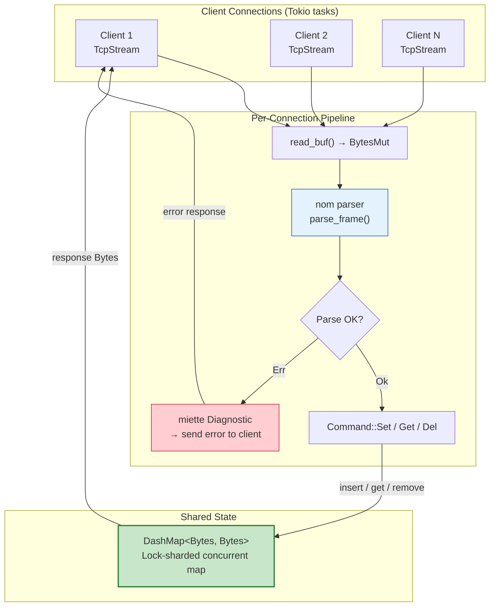

# 6. Capstone: The Zero-Copy In-Memory Cache 🔴

> **What you'll learn:**
> - How to integrate all four crate families (`bytes`, `dashmap`, `nom`, `miette`) into a single production-grade system
> - How to build a concurrent, Tokio-based TCP cache server: accept connections, parse a custom binary wire protocol, and serve concurrent read/write operations
> - How zero-copy techniques eliminate allocations in the hot path — from TCP read to DashMap store
> - How to return `miette`-annotated error diagnostics to clients when they send malformed commands

---

## Architecture Overview

The capstone project is **MINICACHE** — a concurrent in-memory key-value cache server. Think of it as a minimal Redis clone that demonstrates the entire architect's toolbox.



### Component Mapping

| Layer | Crate | Role |
|-------|-------|------|
| Network I/O | `bytes` + `tokio` | `BytesMut` receive buffer, `Bytes` for stored values |
| Protocol Parsing | `nom` | Zero-copy binary frame parser from Chapter 4 |
| State Storage | `dashmap` | `DashMap<Bytes, Bytes>` — concurrent key-value store |
| Error Reporting | `miette` | Annotated diagnostic when a client sends a bad frame |

---

## The Protocol (Recap from Chapter 4)

MINICACHE uses the binary protocol we designed in Chapter 4:

```text
Header (8 bytes):
  [0x4D 0x43]  Magic ("MC")
  [u8]         Version (0x01)
  [u8]         Opcode (SET=1, GET=2, DEL=3)
  [u32 BE]     Payload length

SET Payload: [u16 BE key_len][key bytes][u32 BE value_len][value bytes]
GET Payload: [u16 BE key_len][key bytes]
DEL Payload: [u16 BE key_len][key bytes]

Response:
  [0x4D 0x43]  Magic
  [u8]         Version
  [u8]         Status (OK=0, NOT_FOUND=1, ERROR=2)
  [u32 BE]     Body length
  [body]       For GET: the value. For ERROR: the miette diagnostic text.
```

---

## Step 1: Define the Types

```rust
use bytes::{Bytes, BytesMut, Buf, BufMut};
use dashmap::DashMap;
use std::sync::Arc;

/// The shared application state — a concurrent cache.
/// Both keys and values are `Bytes` — reference-counted, zero-copy byte slices.
type Cache = Arc<DashMap<Bytes, Bytes>>;

/// Protocol constants
const MAGIC: &[u8; 2] = &[0x4D, 0x43];
const VERSION: u8 = 0x01;
const MAX_PAYLOAD: u32 = 16 * 1024 * 1024; // 16 MiB max

#[derive(Debug, Clone, Copy)]
#[repr(u8)]
enum Opcode {
    Set = 1,
    Get = 2,
    Del = 3,
}

#[derive(Debug, Clone, Copy)]
#[repr(u8)]
enum Status {
    Ok = 0,
    NotFound = 1,
    Error = 2,
}

/// A parsed command. Borrows from the input buffer — zero allocations.
#[derive(Debug)]
enum Command<'a> {
    Set { key: &'a [u8], value: &'a [u8] },
    Get { key: &'a [u8] },
    Del { key: &'a [u8] },
}
```

---

## Step 2: The `nom` Parser (Zero-Copy)

This is the parser from Chapter 4, integrated into the server:

```rust
use nom::{
    bytes::streaming::{tag, take},
    number::streaming::{be_u8, be_u16, be_u32},
    IResult, Err as NomErr, Needed,
};

struct FrameHeader {
    opcode: Opcode,
    payload_len: u32,
}

fn parse_header(input: &[u8]) -> IResult<&[u8], FrameHeader> {
    let (input, _) = tag(MAGIC.as_slice())(input)?;
    let (input, version) = be_u8(input)?;
    if version != VERSION {
        return Err(NomErr::Failure(nom::error::Error::new(
            input, nom::error::ErrorKind::Verify,
        )));
    }
    let (input, opcode_byte) = be_u8(input)?;
    let opcode = match opcode_byte {
        1 => Opcode::Set,
        2 => Opcode::Get,
        3 => Opcode::Del,
        _ => return Err(NomErr::Failure(nom::error::Error::new(
            input, nom::error::ErrorKind::Verify,
        ))),
    };
    let (input, payload_len) = be_u32(input)?;
    if payload_len > MAX_PAYLOAD {
        return Err(NomErr::Failure(nom::error::Error::new(
            input, nom::error::ErrorKind::TooLarge,
        )));
    }
    Ok((input, FrameHeader { opcode, payload_len }))
}

fn parse_key(input: &[u8]) -> IResult<&[u8], &[u8]> {
    let (input, len) = be_u16(input)?;
    take(len as usize)(input)
}

fn parse_frame(input: &[u8]) -> IResult<&[u8], Command> {
    let (input, header) = parse_header(input)?;

    if input.len() < header.payload_len as usize {
        return Err(NomErr::Incomplete(Needed::new(
            header.payload_len as usize - input.len(),
        )));
    }

    let (remaining, payload) = take(header.payload_len as usize)(input)?;

    let (_, command) = match header.opcode {
        Opcode::Set => {
            let (p, key) = parse_key(payload)?;
            let (p, value_len) = be_u32(p)?;
            let (p, value) = take(value_len as usize)(p)?;
            (p, Command::Set { key, value })
        }
        Opcode::Get => {
            let (p, key) = parse_key(payload)?;
            (p, Command::Get { key })
        }
        Opcode::Del => {
            let (p, key) = parse_key(payload)?;
            (p, Command::Del { key })
        }
    };

    Ok((remaining, command))
}
```

---

## Step 3: Response Encoding

```rust
/// Encode a response frame into a BytesMut buffer.
fn encode_response(status: Status, body: &[u8], buf: &mut BytesMut) {
    buf.put_slice(MAGIC);           // 2 bytes
    buf.put_u8(VERSION);            // 1 byte
    buf.put_u8(status as u8);       // 1 byte (status instead of opcode)
    buf.put_u32(body.len() as u32); // 4 bytes payload length
    buf.put_slice(body);            // variable body
}
```

---

## Step 4: The `miette` Error Reporter

When a client sends a malformed frame, we produce a `miette` diagnostic and send the rendered text back as an error response:

```rust
use miette::{Diagnostic, NamedSource, SourceSpan, GraphicalReportHandler, GraphicalTheme};
use thiserror::Error;

#[derive(Error, Diagnostic, Debug)]
enum FrameError {
    #[error("bad magic bytes — not a MINICACHE frame")]
    #[diagnostic(
        code(minicache::bad_magic),
        help("frames must start with 0x4D 0x43 (ASCII 'MC')")
    )]
    BadMagic {
        #[source_code]
        src: NamedSource<String>,
        #[label("expected 0x4D 0x43 here")]
        span: SourceSpan,
    },

    #[error("unknown opcode 0x{opcode:02X}")]
    #[diagnostic(
        code(minicache::unknown_opcode),
        help("valid opcodes: SET=0x01, GET=0x02, DEL=0x03")
    )]
    UnknownOpcode {
        opcode: u8,
        #[source_code]
        src: NamedSource<String>,
        #[label("unrecognized opcode")]
        span: SourceSpan,
    },

    #[error("payload too large ({size} > {max} bytes)")]
    #[diagnostic(
        code(minicache::payload_too_large),
        help("maximum payload size is 16 MiB")
    )]
    PayloadTooLarge {
        size: u32,
        max: u32,
        #[source_code]
        src: NamedSource<String>,
        #[label("payload length field")]
        span: SourceSpan,
    },

    #[error("incomplete frame: connection closed")]
    #[diagnostic(code(minicache::incomplete))]
    Incomplete,

    #[error("parse error: {detail}")]
    #[diagnostic(code(minicache::parse_error))]
    ParseError { detail: String },
}

/// Convert raw bytes to a hex string for diagnostic display.
fn hex_display(data: &[u8]) -> String {
    data.iter().map(|b| format!("{:02X}", b)).collect::<Vec<_>>().join(" ")
}

/// Render a miette diagnostic to a plain-text string (for sending over TCP).
fn render_diagnostic(err: &dyn Diagnostic) -> String {
    let mut buf = String::new();
    let handler = GraphicalReportHandler::new_themed(GraphicalTheme::unicode_nocolor());
    handler.render_report(&mut buf, err).unwrap_or_else(|_| {
        buf = format!("{}", err);
    });
    buf
}

/// Analyze a parse failure and produce a miette diagnostic.
fn diagnose_parse_failure(raw: &[u8]) -> FrameError {
    let hex = hex_display(raw);
    let src = NamedSource::new("client_frame", hex);

    if raw.len() < 2 || raw[0..2] != *MAGIC {
        return FrameError::BadMagic {
            src,
            // In hex display, each byte takes 3 chars ("XX "), except the last
            span: (0, std::cmp::min(raw.len(), 2).saturating_sub(1) * 3 + 2).into(),
        };
    }

    if raw.len() >= 4 {
        let opcode = raw[3];
        if opcode == 0 || opcode > 3 {
            return FrameError::UnknownOpcode {
                opcode,
                src,
                span: (3 * 3, 2).into(), // byte 3 → char offset 9 in hex display
            };
        }
    }

    if raw.len() >= 8 {
        let payload_len = u32::from_be_bytes([raw[4], raw[5], raw[6], raw[7]]);
        if payload_len > MAX_PAYLOAD {
            return FrameError::PayloadTooLarge {
                size: payload_len,
                max: MAX_PAYLOAD,
                src,
                span: (4 * 3, 11).into(), // 4 bytes → 11 chars in hex
            };
        }
    }

    FrameError::ParseError {
        detail: format!("failed to parse {} bytes", raw.len()),
    }
}
```

---

## Step 5: The Server — Putting It All Together

```rust
use tokio::net::{TcpListener, TcpStream};
use tokio::io::{AsyncReadExt, AsyncWriteExt};

#[tokio::main]
async fn main() -> anyhow::Result<()> {
    // Shared concurrent cache — DashMap wrapped in Arc for cloning into tasks
    let cache: Cache = Arc::new(DashMap::new());

    let listener = TcpListener::bind("127.0.0.1:6380").await?;
    println!("MINICACHE listening on 127.0.0.1:6380");

    loop {
        let (stream, addr) = listener.accept().await?;
        let cache = Arc::clone(&cache);

        // Spawn one task per connection — each gets its own BytesMut buffer
        tokio::spawn(async move {
            if let Err(e) = handle_client(stream, cache).await {
                eprintln!("[{}] connection error: {}", addr, e);
            }
        });
    }
}

async fn handle_client(mut stream: TcpStream, cache: Cache) -> anyhow::Result<()> {
    let mut buf = BytesMut::with_capacity(8192); // Reused across all frames
    let mut response_buf = BytesMut::with_capacity(4096);

    loop {
        // ── Step 1: Read more data ──
        let n = stream.read_buf(&mut buf).await?;
        if n == 0 {
            if buf.is_empty() {
                return Ok(()); // Clean disconnect
            }
            anyhow::bail!("client disconnected with {} unparsed bytes", buf.len());
        }

        // ── Step 2: Parse and process all complete frames ──
        loop {
            match parse_frame(&buf) {
                Ok((remaining, command)) => {
                    let consumed = buf.len() - remaining.len();

                    // Process the command BEFORE splitting the buffer,
                    // because `command` borrows from `buf`.
                    response_buf.clear();
                    execute_command(&command, &cache, &mut response_buf);

                    // Now split off the consumed bytes — O(1)
                    let _ = buf.split_to(consumed);

                    // Send the response
                    stream.write_all(&response_buf).await?;
                }
                Err(nom::Err::Incomplete(_)) => {
                    break; // Need more data
                }
                Err(_) => {
                    // ── Step 3: Produce miette diagnostic for bad input ──
                    let diagnostic = diagnose_parse_failure(&buf);
                    let error_text = render_diagnostic(&diagnostic);

                    response_buf.clear();
                    encode_response(Status::Error, error_text.as_bytes(), &mut response_buf);
                    stream.write_all(&response_buf).await?;

                    // Discard the unparseable buffer and disconnect
                    return Ok(());
                }
            }
        }
    }
}
```

---

## Step 6: Command Execution Against `DashMap`

```rust
/// Execute a parsed command against the cache and write the response.
fn execute_command(command: &Command, cache: &Cache, response: &mut BytesMut) {
    match command {
        Command::Set { key, value } => {
            // Convert borrowed slices to Bytes for storage in DashMap.
            // This IS an allocation — but it's the minimum necessary.
            // The DashMap needs to own the data beyond the buffer's lifetime.
            let key = Bytes::copy_from_slice(key);
            let value = Bytes::copy_from_slice(value);
            cache.insert(key, value);

            encode_response(Status::Ok, b"OK", response);
        }
        Command::Get { key } => {
            let lookup_key = Bytes::copy_from_slice(key);
            match cache.get(&lookup_key) {
                Some(entry) => {
                    // Clone the Bytes value — O(1) refcount bump!
                    let value: Bytes = entry.value().clone();
                    drop(entry); // Release the shard read lock immediately
                    encode_response(Status::Ok, &value, response);
                }
                None => {
                    encode_response(Status::NotFound, b"NOT_FOUND", response);
                }
            }
        }
        Command::Del { key } => {
            let lookup_key = Bytes::copy_from_slice(key);
            match cache.remove(&lookup_key) {
                Some(_) => encode_response(Status::Ok, b"DELETED", response),
                None => encode_response(Status::NotFound, b"NOT_FOUND", response),
            }
        }
    }
}
```

### Where the allocations are (and aren't)

| Operation | Allocates? | Why |
|-----------|-----------|-----|
| `BytesMut::with_capacity(8192)` | Once per connection | Reused for every frame |
| `parse_frame(&buf)` | No | Returns `&[u8]` borrowing from `buf` |
| `buf.split_to(consumed)` | No | O(1) pointer adjustment |
| `Bytes::copy_from_slice(key)` | Yes (minimal) | DashMap must own the key beyond `buf`'s lifetime |
| `cache.get(&key)` | No | Returns a Ref guard, not a copy |
| `entry.value().clone()` | No | `Bytes::clone` is O(1) refcount bump |
| `encode_response(...)` | No | Writes into pre-allocated `response_buf` |

The hot path (GET) has **one small allocation** (`copy_from_slice` for the key lookup) and **zero allocations** for the value — it's cloned via refcount. In a production system, you could eliminate even the key allocation by using a hash-based lookup with the borrowed `&[u8]` directly.

---

## Testing the Server

### A simple Rust client

```rust
use bytes::{BytesMut, BufMut, Buf};
use tokio::io::{AsyncReadExt, AsyncWriteExt};
use tokio::net::TcpStream;

async fn send_set(
    stream: &mut TcpStream,
    key: &[u8],
    value: &[u8],
) -> anyhow::Result<()> {
    let mut buf = BytesMut::new();

    // Encode SET frame
    buf.put_slice(&[0x4D, 0x43]); // magic
    buf.put_u8(0x01);              // version
    buf.put_u8(0x01);              // opcode: SET

    // Calculate payload length
    let payload_len = 2 + key.len() + 4 + value.len();
    buf.put_u32(payload_len as u32);

    // Payload
    buf.put_u16(key.len() as u16);
    buf.put_slice(key);
    buf.put_u32(value.len() as u32);
    buf.put_slice(value);

    stream.write_all(&buf).await?;
    Ok(())
}

async fn read_response(stream: &mut TcpStream) -> anyhow::Result<(u8, Vec<u8>)> {
    let mut header = [0u8; 8];
    stream.read_exact(&mut header).await?;

    let status = header[3];
    let body_len = u32::from_be_bytes([header[4], header[5], header[6], header[7]]) as usize;

    let mut body = vec![0u8; body_len];
    stream.read_exact(&mut body).await?;

    Ok((status, body))
}

#[tokio::test]
async fn test_set_and_get() {
    // Assumes the server is running on 127.0.0.1:6380
    let mut stream = TcpStream::connect("127.0.0.1:6380").await.unwrap();

    // SET hello world
    send_set(&mut stream, b"hello", b"world").await.unwrap();
    let (status, body) = read_response(&mut stream).await.unwrap();
    assert_eq!(status, 0); // OK
    assert_eq!(&body, b"OK");

    // GET hello
    let mut buf = BytesMut::new();
    buf.put_slice(&[0x4D, 0x43, 0x01, 0x02]); // magic + version + GET
    buf.put_u32(2 + 5); // payload: 2-byte key_len + 5-byte key
    buf.put_u16(5);
    buf.put_slice(b"hello");
    stream.write_all(&buf).await.unwrap();

    let (status, body) = read_response(&mut stream).await.unwrap();
    assert_eq!(status, 0); // OK
    assert_eq!(&body, b"world");
}
```

---

## Performance Characteristics

### What makes this fast

1. **One `BytesMut` per connection**, reused across all frames. No per-frame allocation.
2. **Zero-copy parsing**: `nom` returns `&[u8]` slices borrowing directly from the receive buffer.
3. **O(1) buffer management**: `split_to` releases consumed bytes without copying.
4. **Lock-sharded storage**: `DashMap` ensures concurrent writes from different client connections don't contend.
5. **O(1) value cloning**: `Bytes::clone` on GET responses is a refcount bump, not a deep copy.

### What a real Redis clone would add

| Missing Feature | What you'd add |
|----------------|---------------|
| TTL expiration | Background task using `tokio::time::interval` + `DashMap::retain` |
| Persistence | Periodic `DashMap` snapshot to disk using `serde` |
| Pub/Sub | `tokio::sync::broadcast` channels per topic |
| Pipeline support | Parse multiple frames before sending responses |
| TLS | `tokio-rustls` wrapping `TcpStream` |
| Authentication | Password check in a handshake frame before allowing commands |

---

<details>
<summary><strong>🏋️ Exercise: Add TTL Support</strong> (click to expand)</summary>

Extend the MINICACHE server with time-to-live (TTL) support:

1. Add a new opcode `SETEX` (opcode `4`) with payload: `[u16 key_len][key][u32 ttl_seconds][u32 value_len][value]`
2. Change the `DashMap` value type from `Bytes` to `(Bytes, Option<Instant>)` where the `Instant` is the expiration time.
3. On `GET`, check if the entry has expired. If so, remove it and return `NOT_FOUND`.
4. Add a background Tokio task that runs every 10 seconds and calls `cache.retain()` to evict expired entries.

<details>
<summary>🔑 Solution</summary>

```rust
use bytes::Bytes;
use dashmap::DashMap;
use std::sync::Arc;
use std::time::{Duration, Instant};

/// Cache value: the data plus an optional expiration timestamp.
type CacheValue = (Bytes, Option<Instant>);
type Cache = Arc<DashMap<Bytes, CacheValue>>;

// ── Updated Command enum ──

#[derive(Debug)]
enum Command<'a> {
    Set { key: &'a [u8], value: &'a [u8] },
    SetEx { key: &'a [u8], ttl_secs: u32, value: &'a [u8] }, // ← New
    Get { key: &'a [u8] },
    Del { key: &'a [u8] },
}

// ── Updated execute_command ──

fn execute_command(command: &Command, cache: &Cache, response: &mut BytesMut) {
    match command {
        Command::Set { key, value } => {
            let key = Bytes::copy_from_slice(key);
            let value = Bytes::copy_from_slice(value);
            cache.insert(key, (value, None)); // No expiration
            encode_response(Status::Ok, b"OK", response);
        }
        Command::SetEx { key, ttl_secs, value } => {
            let key = Bytes::copy_from_slice(key);
            let value = Bytes::copy_from_slice(value);
            let expires_at = Instant::now() + Duration::from_secs(*ttl_secs as u64);
            cache.insert(key, (value, Some(expires_at)));
            encode_response(Status::Ok, b"OK", response);
        }
        Command::Get { key } => {
            let lookup_key = Bytes::copy_from_slice(key);
            match cache.get(&lookup_key) {
                Some(entry) => {
                    let (value, expires_at) = entry.value();
                    // Check TTL — is this entry expired?
                    if let Some(exp) = expires_at {
                        if Instant::now() >= *exp {
                            drop(entry); // Release read lock before write
                            cache.remove(&lookup_key); // Lazy eviction
                            encode_response(Status::NotFound, b"NOT_FOUND", response);
                            return;
                        }
                    }
                    let value = value.clone(); // O(1) refcount bump
                    drop(entry);
                    encode_response(Status::Ok, &value, response);
                }
                None => {
                    encode_response(Status::NotFound, b"NOT_FOUND", response);
                }
            }
        }
        Command::Del { key } => {
            let lookup_key = Bytes::copy_from_slice(key);
            match cache.remove(&lookup_key) {
                Some(_) => encode_response(Status::Ok, b"DELETED", response),
                None => encode_response(Status::NotFound, b"NOT_FOUND", response),
            }
        }
    }
}

// ── Background eviction task ──

/// Spawns a background task that periodically removes expired entries.
fn spawn_eviction_task(cache: Cache) {
    tokio::spawn(async move {
        let mut interval = tokio::time::interval(Duration::from_secs(10));
        loop {
            interval.tick().await;
            let now = Instant::now();
            let before = cache.len();
            // retain() acquires each shard's write lock one at a time.
            // This is safe and efficient — no global lock.
            cache.retain(|_key, (_, expires_at)| {
                match expires_at {
                    Some(exp) => now < *exp, // Keep if not expired
                    None => true,             // Keep if no TTL
                }
            });
            let evicted = before - cache.len();
            if evicted > 0 {
                println!("evicted {} expired entries", evicted);
            }
        }
    });
}

// ── Updated main ──

#[tokio::main]
async fn main() -> anyhow::Result<()> {
    let cache: Cache = Arc::new(DashMap::new());
    
    // Start the background eviction task
    spawn_eviction_task(Arc::clone(&cache));

    let listener = TcpListener::bind("127.0.0.1:6380").await?;
    println!("MINICACHE listening on 127.0.0.1:6380");

    loop {
        let (stream, addr) = listener.accept().await?;
        let cache = Arc::clone(&cache);
        tokio::spawn(async move {
            if let Err(e) = handle_client(stream, cache).await {
                eprintln!("[{}] error: {}", addr, e);
            }
        });
    }
}
```

**Design notes:**
- **Lazy + periodic eviction**: Expired entries are removed on access (lazy) AND by the background sweeper (periodic). This means stale data doesn't accumulate even for keys that are never read again.
- **`DashMap::retain`** locks one shard at a time — the server continues serving requests on all other shards during eviction.
- **`O(1)` expiration check**: Comparing `Instant::now()` against a stored `Instant` is a single subtraction. No heap allocation.

</details>
</details>

---

> **Key Takeaways:**
> - The four crate families compose naturally: `bytes` for I/O buffers, `nom` for zero-copy parsing, `dashmap` for concurrent state, and `miette` for diagnostic error reporting.
> - The hot path (read → parse → lookup → respond) performs only one small allocation per command (the key lookup). Values are served via O(1) `Bytes::clone`.
> - `BytesMut` buffers are reused across frames within a connection. `split_to` releases consumed bytes in O(1).
> - `DashMap<Bytes, Bytes>` gives lock-sharded storage that scales linearly with core count. Concurrent clients writing different keys never contend.
> - When a client sends a malformed frame, `miette` produces a richly annotated diagnostic showing exactly which byte violated the protocol, sent back over the wire.

> **See also:**
> - [Chapter 1: Zero-Copy Networking with `bytes`](ch01-zero-copy-networking-with-bytes.md) — the buffer management foundation
> - [Chapter 2: Highly Concurrent State with `dashmap`](ch02-highly-concurrent-state-with-dashmap.md) — why DashMap outscales RwLock
> - [Chapter 3: Parser Combinators with `nom`](ch03-parser-combinators-with-nom.md) — the combinator library powering the parser
> - [Chapter 4: Designing Custom Binary Protocols](ch04-designing-custom-binary-protocols.md) — the MINICACHE wire format design
> - [Chapter 5: Developer-Facing Errors with `miette`](ch05-developer-facing-errors-with-miette.md) — the diagnostic layer
> - [Rust Microservices](../microservices-book/src/SUMMARY.md) — production Tokio server patterns
> - [Zero-Copy Architecture](../zero-copy-book/src/SUMMARY.md) — broader zero-copy design strategies
