# Rust Ecosystem, Tooling & Profiling: Architecting and Tuning Production Systems

## Speaker Intro

- Principal Systems Architect with two decades of experience shipping performance-critical systems in C++, Go, and Rust
- Background spans firmware, network stacks, distributed databases, and latency-sensitive trading infrastructure
- Started contributing to Rust tooling in 2018; maintains internal profiling harnesses and CI pipelines for multi-million-line Rust monorepos
- Philosophy: **"If you didn't measure it, you don't know it."** Every architectural decision in this guide is backed by data, not folklore

---

This is the capstone companion to the rest of the Rust Training series. Where those guides teach *what* Rust does — ownership, async, concurrency, macros, unsafe — this guide teaches how to **architect, verify, and tune** the systems you build with those tools.

We start where most engineers actually spend their time: structuring multi-crate projects that compile fast and compose cleanly. We progress through statistical benchmarking and fuzz testing — the verification techniques that catch the bugs `#[test]` misses. We finish with deep-system profiling: CPU flamegraphs and heap analysis that reveal exactly where your cycles and bytes go.

Every technique is demonstrated with real code, real tool output, and real measurements. No hand-waving.

## Who This Is For

- **Senior engineers** scaling Rust codebases beyond a single `src/main.rs` and needing workspace architecture guidance
- **Performance engineers** who need to find and eliminate hot-path bottlenecks with hard evidence, not guesswork
- **Tech leads** responsible for CI pipelines that must catch regressions before they ship
- **Anyone** who has completed the companion guides (Async, Memory Management, Concurrency, etc.) and wants to know how to *profile and test* the patterns learned there

## Prerequisites

You should be comfortable with:

| Concept | Where to Learn |
|---------|---------------|
| Ownership, borrowing, lifetimes | [Rust Memory Management](../memory-management-book/src/SUMMARY.md) |
| `async/await`, Tokio basics | [Async Rust](../async-book/src/SUMMARY.md) |
| Traits, generics, dynamic dispatch | [Type System & Traits](../type-system-traits-book/src/SUMMARY.md) |
| `cargo build`, `cargo test`, `cargo run` | [The Rust Book, Ch. 1–11](https://doc.rust-lang.org/book/) |
| Basic terminal / command-line usage | — |

You do **not** need prior experience with profiling tools, Criterion, or fuzz testing. We teach those from first principles.

## How to Use This Book

| Emoji | Meaning |
|-------|---------|
| 🟢 | **Foundational** — essential concepts everyone should know |
| 🟡 | **Intermediate** — builds on earlier chapters, applied techniques |
| 🔴 | **Advanced** — deep internals, production profiling, expert workflows |
| 💥 | Code that compiles but **fails** under edge cases or production load |
| ✅ | The **fix** — the correct, hardened version |

Read sequentially for the full experience, or jump directly to the part you need:

- **"I need to structure a multi-crate project"** → Part I (Chapters 1–2)
- **"I need to benchmark properly"** → Chapter 3
- **"I need to find bugs my tests miss"** → Chapter 4
- **"My program is slow and I don't know why"** → Part III (Chapters 5–6)
- **"Show me everything end-to-end"** → Chapter 7 (Capstone)

## Pacing Guide

| Chapters | Topic | Time | Checkpoint |
|----------|-------|------|------------|
| 0 | Introduction | 15 min | Orientation complete |
| 1–2 | Cargo Workspaces & Features | 3–4 hours | You can structure a multi-crate workspace with feature gates |
| 3 | Criterion Benchmarking | 2–3 hours | You can write statistically rigorous benchmarks |
| 4 | Property Testing & Fuzzing | 3–4 hours | You can fuzz a parser and find crashes |
| 5–6 | CPU & Memory Profiling | 4–6 hours | You can generate and read flamegraphs and dhat output |
| 7 | Capstone Project | 4–6 hours | You've built, tested, fuzzed, and profiled a complete system |
| 8 | Reference Card | 15 min | Quick-reference bookmark |
| **Total** | | **17–24 hours** | |

## Table of Contents

### Part I: Architecting at Scale

| Chapter | Title | What You'll Learn |
|---------|-------|-------------------|
| 1 | Cargo Workspaces and Virtual Manifests 🟢 | Multi-crate project layout, shared dependencies, compile-time reduction |
| 2 | Feature Flags and Conditional Compilation 🟡 | `#[cfg]`, additive features, optional dependencies, platform-specific code |

### Part II: Advanced Verification

| Chapter | Title | What You'll Learn |
|---------|-------|-------------------|
| 3 | Statistical Benchmarking with Criterion 🟡 | `black_box`, statistical significance, regression detection, violin plots |
| 4 | Property-Based Testing and Fuzzing 🔴 | `proptest`, `cargo-fuzz`, coverage-guided mutation, crash triage |

### Part III: Performance Profiling

| Chapter | Title | What You'll Learn |
|---------|-------|-------------------|
| 5 | CPU Profiling and Flamegraphs 🔴 | `perf`, `DTrace`, `cargo-flamegraph`, hot-path identification |
| 6 | Memory Profiling and Heap Analysis 🔴 | `dhat`, allocation tracking, `Arc`/`Box` costs, leak detection |

### Part IV: Production Capstone

| Chapter | Title | What You'll Learn |
|---------|-------|-------------------|
| 7 | Capstone: The Hardened, Profiled Parser 🔴 | End-to-end: workspace → features → fuzz → benchmark → flamegraph |

### Appendices

| Chapter | Title | What You'll Learn |
|---------|-------|-------------------|
| 8 | Summary and Reference Card | Cheat sheets for every tool covered |

```mermaid
graph LR
    subgraph "Part I: Architecture"
        CH1["Ch 1: Workspaces 🟢"]
        CH2["Ch 2: Features 🟡"]
    end

    subgraph "Part II: Verification"
        CH3["Ch 3: Criterion 🟡"]
        CH4["Ch 4: Fuzz/Proptest 🔴"]
    end

    subgraph "Part III: Profiling"
        CH5["Ch 5: Flamegraphs 🔴"]
        CH6["Ch 6: Heap Analysis 🔴"]
    end

    subgraph "Part IV: Capstone"
        CH7["Ch 7: Hardened Parser 🔴"]
    end

    CH1 --> CH2
    CH2 --> CH3
    CH3 --> CH4
    CH4 --> CH5
    CH5 --> CH6
    CH6 --> CH7

    style CH1 fill:#c8e6c9,color:#000
    style CH2 fill:#fff9c4,color:#000
    style CH3 fill:#fff9c4,color:#000
    style CH4 fill:#ffcdd2,color:#000
    style CH5 fill:#ffcdd2,color:#000
    style CH6 fill:#ffcdd2,color:#000
    style CH7 fill:#ffcdd2,color:#000
```

## Companion Guides

This book assumes and builds upon patterns from the full training series:

| Guide | Relevant Connection |
|-------|-------------------|
| [Async Rust](../async-book/src/SUMMARY.md) | Ch 3 benchmarks async task overhead; Ch 5 profiles Tokio runtimes |
| [Memory Management](../memory-management-book/src/SUMMARY.md) | Ch 6 profiles allocation patterns; Ch 7 measures `Box`/`Arc` costs |
| [Smart Pointers](../smart-pointers-book/src/SUMMARY.md) | Ch 6 reveals hidden costs of cloning smart pointers in hot loops |
| [Concurrency](../concurrency-book/src/SUMMARY.md) | Ch 5 profiles contention in lock-based vs lock-free data structures |
| [Type System & Traits](../type-system-traits-book/src/SUMMARY.md) | Ch 3 benchmarks monomorphization vs dynamic dispatch overhead |
| [Metaprogramming](../metaprogramming-book/src/SUMMARY.md) | Ch 2 feature-gates proc-macro codegen paths |
| [Unsafe Rust & FFI](../unsafe-ffi-book/src/SUMMARY.md) | Ch 4 fuzzes FFI boundary parsers; Ch 6 tracks raw pointer allocations |
| [Engineering Practices](../engineering-book/src/SUMMARY.md) | Shares CI/CD concerns; this book goes deeper on profiling |

---

> **Let's begin.** Chapter 1 starts with the foundation every large Rust project needs: Cargo Workspaces.
