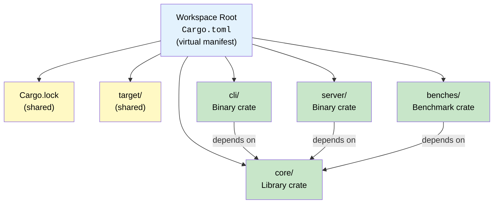

# 1. Cargo Workspaces and Virtual Manifests 🟢

> **What you'll learn:**
> - How to structure a multi-crate project with a Cargo workspace
> - The difference between a virtual manifest and a root package
> - How workspace-level dependency unification slashes compile times
> - Practical patterns for organizing `lib`, `bin`, `bench`, and `test` crates

---

## Why Workspaces?

Every non-trivial Rust project eventually outgrows a single crate. You need a core library, a CLI binary, maybe a server binary, integration test harnesses, benchmark suites, and perhaps a proc-macro crate. Without workspaces, you'd manage these as separate repositories with version-pinned dependencies — a coordination nightmare.

A **Cargo workspace** is a set of crates that share:

1. A single `Cargo.lock` — all crates resolve to the same dependency versions
2. A single `target/` directory — compiled artifacts are shared, not duplicated
3. A common root `Cargo.toml` that defines workspace membership

The result: faster builds, consistent dependencies, and atomic refactoring across crate boundaries.



## Virtual Manifest vs. Root Package

There are two ways to set up a workspace:

### Option A: Virtual Manifest (Recommended)

The root `Cargo.toml` contains **only** workspace configuration — no `[package]` section. This is the cleanest approach for multi-crate projects.

```toml
# workspace root: Cargo.toml
[workspace]
members = [
    "core",
    "cli",
    "server",
    "benches",
]
resolver = "2"    # Always use resolver 2 (default since edition 2021)

# Shared dependencies — declare once, use everywhere
[workspace.dependencies]
serde = { version = "1.0", features = ["derive"] }
tokio = { version = "1", features = ["full"] }
anyhow = "1.0"
clap = { version = "4", features = ["derive"] }
```

Each member crate references workspace dependencies with `workspace = true`:

```toml
# core/Cargo.toml
[package]
name = "myproject-core"
version = "0.1.0"
edition = "2021"

[dependencies]
serde = { workspace = true }
anyhow = { workspace = true }
```

```toml
# cli/Cargo.toml
[package]
name = "myproject-cli"
version = "0.1.0"
edition = "2021"

[dependencies]
myproject-core = { path = "../core" }
clap = { workspace = true }
anyhow = { workspace = true }
```

### Option B: Root Package

The root `Cargo.toml` has both `[workspace]` and `[package]`. This works for simpler projects where the root itself is a meaningful crate:

```toml
# Cargo.toml — root is both workspace and package
[package]
name = "myproject"
version = "0.1.0"
edition = "2021"

[workspace]
members = ["xtask", "myproject-macros"]
```

### Comparison

| Aspect | Virtual Manifest | Root Package |
|--------|-----------------|--------------|
| Root has `[package]`? | No | Yes |
| Root is publishable? | No | Yes |
| Best for | Multi-binary projects, large codebases | Single main crate with auxiliary crates |
| `cargo build` at root | Builds all members | Builds root package (use `--workspace` for all) |
| Clarity | Explicit — root is purely organizational | Can be confusing — "is root a real crate?" |

> **Recommendation:** Use a virtual manifest for any project with more than two crates. It eliminates ambiguity about what the "main" crate is.

## Workspace Dependency Unification

One of the most impactful benefits of workspaces is **dependency unification**. Without a workspace, two crates might independently resolve `serde = "1"` to different patch versions (e.g., 1.0.197 and 1.0.203). With a workspace, a single `Cargo.lock` forces them to agree.

### What You Write (workspace root)

```toml
[workspace.dependencies]
serde = { version = "1.0", features = ["derive"] }
```

### What Cargo Resolves (Cargo.lock, abbreviated)

```toml
[[package]]
name = "serde"
version = "1.0.210"
# ^^^^^ ONE version for the entire workspace
```

### Compile-Time Impact

Shared `target/` means that when `core` compiles `serde`, the `cli` crate reuses those artifacts:

```text
$ cargo build --workspace --timings
# Generates cargo-timing.html showing:
#   serde        — compiled once (14.2s)
#   myproject-core — 3.1s
#   myproject-cli  — 1.8s (serde already compiled!)
```

Without a workspace, `serde` would compile separately for each crate. For large dependency trees (think `tokio`, `aws-sdk`, `tonic`), the savings are enormous — often 40–60% of total build time.

## The `resolver` Field

Always use `resolver = "2"` (the default for edition 2021+). The v2 resolver handles feature unification per-platform and per-profile, preventing surprising feature leakage:

```toml
[workspace]
members = ["core", "cli"]
resolver = "2"
```

| Behavior | Resolver v1 | Resolver v2 |
|----------|------------|------------|
| Features from dev-dependencies | Leak into normal builds | Isolated to dev/test profiles |
| Platform-specific features | Unified across all platforms | Only activated on matching platforms |
| Proc-macro features | Unified with host and target | Separated by context |

## Workspace-Level Settings

You can share common metadata across all member crates using `[workspace.package]`:

```toml
[workspace.package]
version = "0.3.0"
edition = "2021"
license = "MIT OR Apache-2.0"
repository = "https://github.com/myorg/myproject"
rust-version = "1.75"

[workspace]
members = ["core", "cli", "server"]
```

Members inherit with:

```toml
# core/Cargo.toml
[package]
name = "myproject-core"
version.workspace = true
edition.workspace = true
license.workspace = true
```

This ensures version bumps, license changes, and MSRV updates happen in exactly one place.

## Practical Directory Layouts

### Small Project (2–3 crates)

```text
my-tool/
├── Cargo.toml          # virtual manifest
├── Cargo.lock
├── core/
│   ├── Cargo.toml
│   └── src/lib.rs
└── cli/
    ├── Cargo.toml
    └── src/main.rs
```

### Medium Project (library + multiple binaries + benchmarks)

```text
my-service/
├── Cargo.toml          # virtual manifest
├── Cargo.lock
├── myservice-core/
│   ├── Cargo.toml
│   └── src/lib.rs
├── myservice-server/
│   ├── Cargo.toml
│   └── src/main.rs
├── myservice-cli/
│   ├── Cargo.toml
│   └── src/main.rs
├── myservice-bench/
│   ├── Cargo.toml
│   └── benches/
│       └── throughput.rs
└── xtask/
    ├── Cargo.toml
    └── src/main.rs
```

### Large Project (with proc-macros and internal tools)

```text
platform/
├── Cargo.toml          # virtual manifest
├── Cargo.lock
├── crates/
│   ├── platform-core/
│   ├── platform-api/
│   ├── platform-db/
│   ├── platform-auth/
│   └── platform-macros/   # proc-macro crate
├── bins/
│   ├── server/
│   ├── worker/
│   └── migrate/
├── tools/
│   └── xtask/
└── tests/
    └── integration/
```

For large projects, use glob patterns in the workspace:

```toml
[workspace]
members = [
    "crates/*",
    "bins/*",
    "tools/*",
    "tests/*",
]
```

## Key Commands for Workspace Development

```bash
# Build everything
cargo build --workspace

# Test everything
cargo test --workspace

# Build only one member
cargo build -p myproject-core

# Run a specific binary
cargo run -p myproject-cli -- --help

# Check all crates compile without codegen (fast)
cargo check --workspace

# Show the dependency tree
cargo tree --workspace

# See build timings
cargo build --workspace --timings
```

## Common Pitfalls

### Pitfall 1: Circular Dependencies

```text
core depends on cli depends on core → ERROR
```

Cargo forbids cycles. If you need shared types, extract them into a separate `-types` or `-common` crate.

### Pitfall 2: Forgetting `workspace = true`

```toml
# ⚠️ This silently uses a DIFFERENT version of serde than the workspace:
[dependencies]
serde = "1.0"

# ✅ This uses the workspace-unified version:
[dependencies]
serde = { workspace = true }
```

### Pitfall 3: Publishing Workspace Members

When publishing to crates.io, each member needs its own complete metadata. Path dependencies must be replaced with version dependencies:

```toml
# Development (local):
myproject-core = { path = "../core" }

# Publishing (crates.io) — Cargo handles this automatically if you also specify version:
myproject-core = { path = "../core", version = "0.3.0" }
```

---

<details>
<summary><strong>🏋️ Exercise: Build a Three-Crate Workspace</strong> (click to expand)</summary>

**Challenge:** Create a workspace with three crates:
1. `mathlib` — a library crate with a function `fast_fibonacci(n: u64) -> u64`
2. `mathcli` — a binary crate that uses `clap` to accept `n` from the command line and prints the result
3. `mathbench` — a crate that will later hold Criterion benchmarks (for now, just set up the structure)

Requirements:
- Use a virtual manifest
- Declare `clap` as a `[workspace.dependencies]` entry
- `mathcli` and `mathbench` must depend on `mathlib` via path
- Running `cargo build --workspace` should succeed

<details>
<summary>🔑 Solution</summary>

**Workspace root: `Cargo.toml`**

```toml
[workspace]
members = ["mathlib", "mathcli", "mathbench"]
resolver = "2"

[workspace.dependencies]
clap = { version = "4", features = ["derive"] }
```

**`mathlib/Cargo.toml`**

```toml
[package]
name = "mathlib"
version = "0.1.0"
edition = "2021"
```

**`mathlib/src/lib.rs`**

```rust
/// Compute the nth Fibonacci number using fast doubling.
///
/// Fast doubling uses the identities:
///   F(2k)   = F(k) * [2*F(k+1) - F(k)]
///   F(2k+1) = F(k)^2 + F(k+1)^2
///
/// This runs in O(log n) time instead of O(n) for the naive approach.
pub fn fast_fibonacci(n: u64) -> u64 {
    // Base cases
    if n == 0 {
        return 0;
    }

    let mut a: u64 = 0; // F(k)
    let mut b: u64 = 1; // F(k+1)

    // Find the highest set bit position
    let bits = 64 - n.leading_zeros();

    // Process bits from most significant to least significant
    for i in (0..bits).rev() {
        // Fast doubling formulas (using wrapping arithmetic for large n):
        // F(2k)   = F(k) * [2*F(k+1) - F(k)]
        // F(2k+1) = F(k)^2 + F(k+1)^2
        let c = a * (2 * b - a); // F(2k)
        let d = a * a + b * b;   // F(2k+1)

        if (n >> i) & 1 == 0 {
            a = c; // F(2k)
            b = d; // F(2k+1)
        } else {
            a = d;     // F(2k+1)
            b = c + d; // F(2k+2)
        }
    }

    a // F(n)
}

#[cfg(test)]
mod tests {
    use super::*;

    #[test]
    fn test_base_cases() {
        assert_eq!(fast_fibonacci(0), 0);
        assert_eq!(fast_fibonacci(1), 1);
        assert_eq!(fast_fibonacci(2), 1);
    }

    #[test]
    fn test_known_values() {
        assert_eq!(fast_fibonacci(10), 55);
        assert_eq!(fast_fibonacci(20), 6765);
        assert_eq!(fast_fibonacci(30), 832040);
    }
}
```

**`mathcli/Cargo.toml`**

```toml
[package]
name = "mathcli"
version = "0.1.0"
edition = "2021"

[dependencies]
mathlib = { path = "../mathlib" }
clap = { workspace = true }
```

**`mathcli/src/main.rs`**

```rust
use clap::Parser;

#[derive(Parser)]
#[command(name = "mathcli", about = "Compute Fibonacci numbers")]
struct Args {
    /// Which Fibonacci number to compute
    n: u64,
}

fn main() {
    let args = Args::parse();
    let result = mathlib::fast_fibonacci(args.n);
    println!("F({}) = {}", args.n, result);
}
```

**`mathbench/Cargo.toml`**

```toml
[package]
name = "mathbench"
version = "0.1.0"
edition = "2021"

[dependencies]
mathlib = { path = "../mathlib" }

# We'll add Criterion in Chapter 3
```

**`mathbench/src/lib.rs`**

```rust
// Placeholder — Criterion benchmarks will be added in Chapter 3.
```

**Verify:**

```bash
cargo build --workspace
cargo test --workspace
cargo run -p mathcli -- 30
# Output: F(30) = 832040
```

</details>
</details>

---

> **Key Takeaways**
> - A **workspace** unifies `Cargo.lock` and `target/` across all member crates, dramatically reducing compile times and ensuring dependency consistency.
> - Prefer **virtual manifests** (no `[package]` at root) for multi-crate projects — they are explicit and unambiguous.
> - Use `[workspace.dependencies]` to declare shared dependency versions once, then reference them with `workspace = true` in member crates.
> - Always use `resolver = "2"` to get correct feature isolation per platform and profile.
> - Use `cargo build --timings` to measure the actual compile-time savings from shared artifacts.

> **See also:**
> - [Chapter 2: Feature Flags and Conditional Compilation](ch02-feature-flags.md) — gating workspace members behind feature flags
> - [Rust Engineering Practices](../engineering-book/src/SUMMARY.md) — CI/CD pipeline setup for workspace projects
> - [Cargo Reference: Workspaces](https://doc.rust-lang.org/cargo/reference/workspaces.html)
