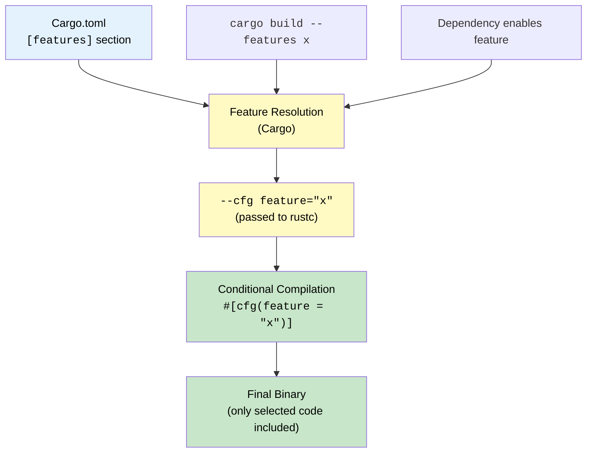
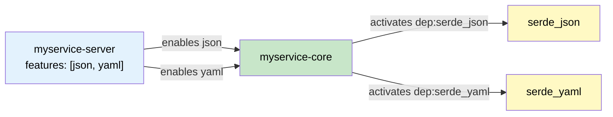

# 2. Feature Flags and Conditional Compilation 🟡

> **What you'll learn:**
> - How Cargo features and `#[cfg]` work at the compiler level
> - The **absolute rule** of additive features — why enabling more features must never break the build
> - How to manage optional dependencies and platform-specific code
> - Patterns for feature-gating costly optimizations, serialization formats, and runtime backends

---

## What Is a Feature?

A Cargo **feature** is a named boolean that controls conditional compilation. Features are resolved at compile time — they produce zero runtime overhead. When a feature is enabled, code guarded by `#[cfg(feature = "...")]` is compiled in; when disabled, it's as if that code doesn't exist.



### Declaring Features

```toml
# Cargo.toml
[package]
name = "myparser"
version = "0.1.0"
edition = "2021"

[features]
default = ["json"]       # Enabled unless --no-default-features
json = ["dep:serde_json"] # Enables serde_json dependency
yaml = ["dep:serde_yaml"] # Enables serde_yaml dependency
simd = []                 # Pure cfg flag, no extra dependencies
unstable = []             # Gate experimental APIs

[dependencies]
serde = { version = "1.0", features = ["derive"] }
serde_json = { version = "1.0", optional = true }
serde_yaml = { version = "0.9", optional = true }
```

### Using Features in Code

```rust
// Always available:
pub fn parse_bytes(input: &[u8]) -> Result<Data, ParseError> {
    // ...
#     todo!()
}

// Only compiled when the "json" feature is active:
#[cfg(feature = "json")]
pub fn parse_json(input: &str) -> Result<Data, ParseError> {
    serde_json::from_str(input).map_err(ParseError::Json)
}

// Only compiled when the "yaml" feature is active:
#[cfg(feature = "yaml")]
pub fn parse_yaml(input: &str) -> Result<Data, ParseError> {
    serde_yaml::from_str(input).map_err(ParseError::Yaml)
}
```

### What the Tooling Sees

When you run `cargo build --features json,yaml`, Cargo passes these flags to `rustc`:

```text
rustc --cfg 'feature="json"' --cfg 'feature="yaml"' --edition 2021 src/lib.rs ...
```

You can inspect the active cfgs for your target:

```bash
rustc --print cfg                           # Built-in cfgs
rustc --print cfg --target aarch64-apple-darwin  # Platform cfgs
cargo build --features json -vv 2>&1 | grep -- '--cfg'  # See exactly what Cargo passes
```

## The Absolute Rule: Features Must Be Additive

This is the most important principle of feature design:

> **Enabling a feature must never remove functionality, break compilation, or change the meaning of existing APIs.**

Features are **additive**: they can add new items (functions, impls, modules) but must never subtract them. This is because in a dependency graph, features are **unioned** — if crate A enables feature `"json"` and crate B enables feature `"yaml"`, both are active simultaneously.

### 💥 FAILS IN PRODUCTION: Mutually Exclusive Features

```rust
// 💥 FAILS IN PRODUCTION: This design is BROKEN
// If both "backend-sqlite" and "backend-postgres" are enabled,
// `Database` is defined twice → compilation error!

#[cfg(feature = "backend-sqlite")]
pub struct Database {
    conn: rusqlite::Connection,
}

#[cfg(feature = "backend-postgres")]
pub struct Database {
    client: tokio_postgres::Client,
}
```

When crate A depends on `mydb` with `backend-sqlite` and crate B depends on `mydb` with `backend-postgres`, Cargo enables **both** features. Now there are two conflicting definitions of `Database`. The build fails.

### ✅ FIX: Use Additive Design with Trait Abstraction

```rust
// ✅ FIX: Each backend adds its own type; a trait unifies them

pub trait DatabaseBackend {
    fn execute(&self, query: &str) -> Result<(), DbError>;
}

#[cfg(feature = "backend-sqlite")]
pub mod sqlite {
    use super::*;

    pub struct SqliteDb {
        // conn: rusqlite::Connection,
    }

    impl DatabaseBackend for SqliteDb {
        fn execute(&self, query: &str) -> Result<(), DbError> {
            todo!()
        }
    }
}

#[cfg(feature = "backend-postgres")]
pub mod postgres {
    use super::*;

    pub struct PostgresDb {
        // client: tokio_postgres::Client,
    }

    impl DatabaseBackend for PostgresDb {
        fn execute(&self, query: &str) -> Result<(), DbError> {
            todo!()
        }
    }
}
# pub struct DbError;
```

Now enabling both features simply makes both modules available. No conflict.

### Additive vs. Mutually Exclusive: Summary

| Pattern | Additive? | Safe? | Example |
|---------|-----------|-------|---------|
| Feature adds a new module | ✅ Yes | ✅ | `#[cfg(feature = "yaml")] mod yaml;` |
| Feature adds a trait impl | ✅ Yes | ✅ | `#[cfg(feature = "serde")] impl Serialize for Foo` |
| Feature enables an optional dep | ✅ Yes | ✅ | `json = ["dep:serde_json"]` |
| Feature changes a struct's fields | ❌ No | ❌ | Different struct layout per feature |
| Feature swaps implementations | ❌ No | ❌ | Two `impl` blocks for the same trait on the same type |
| Feature removes a public API | ❌ No | ❌ | `#[cfg(not(feature = "x"))] pub fn thing()` |

> **When you genuinely need mutually exclusive behavior** (e.g., choosing one allocator), use **runtime selection** (enum dispatch) or make it a **binary-level choice** (different `[[bin]]` targets), not a feature-level choice.

## Optional Dependencies

Since Rust 1.60, you can use the `dep:` prefix to prevent a dependency name from becoming an implicit feature:

```toml
[features]
json = ["dep:serde_json"]   # Explicit: "json" feature enables serde_json
# Without dep:, "serde_json" would automatically become a feature name too

[dependencies]
serde_json = { version = "1.0", optional = true }
```

### Before `dep:` (Rust < 1.60)

```toml
# Old style — "serde_json" is both a dependency AND an implicit feature
[features]
json = ["serde_json"]

[dependencies]
serde_json = { version = "1.0", optional = true }
```

The problem: users could write `--features serde_json` directly, coupling your public API to an internal dependency name. The `dep:` prefix cleanly separates the feature namespace from the dependency namespace.

## Platform-Specific Compilation with `#[cfg]`

Beyond features, `#[cfg]` supports many built-in conditions:

```rust
// Target OS
#[cfg(target_os = "linux")]
fn setup_io_uring() -> IoBackend { /* ... */ }

#[cfg(target_os = "macos")]
fn setup_kqueue() -> IoBackend { /* ... */ }

#[cfg(target_os = "windows")]
fn setup_iocp() -> IoBackend { /* ... */ }

// Target architecture
#[cfg(target_arch = "x86_64")]
fn use_avx2_path(data: &[u8]) -> Vec<u8> { /* ... */ }

// Combine conditions
#[cfg(all(target_os = "linux", target_arch = "x86_64"))]
fn linux_x86_fast_path() { /* ... */ }

#[cfg(any(target_os = "linux", target_os = "macos"))]
fn unix_common() { /* ... */ }

#[cfg(not(target_os = "windows"))]
fn posix_only() { /* ... */ }
# struct IoBackend;
```

### Common `#[cfg]` Predicates

| Predicate | Example Values | Use Case |
|-----------|---------------|----------|
| `target_os` | `"linux"`, `"macos"`, `"windows"` | OS-specific syscalls |
| `target_arch` | `"x86_64"`, `"aarch64"`, `"wasm32"` | SIMD, assembly |
| `target_family` | `"unix"`, `"windows"`, `"wasm"` | Broad platform groups |
| `target_env` | `"gnu"`, `"musl"`, `"msvc"` | Libc selection |
| `feature` | Any feature name | Cargo feature gates |
| `test` | — | `#[cfg(test)]` for test modules |
| `debug_assertions` | — | Debug vs. release mode |

## `cfg_if!` for Cleaner Conditional Blocks

The `cfg-if` crate provides a macro that reads like an `if/else` chain:

```rust
use cfg_if::cfg_if;

cfg_if! {
    if #[cfg(feature = "simd")] {
        mod simd_impl;
        pub use simd_impl::process;
    } else {
        mod scalar_impl;
        pub use scalar_impl::process;
    }
}
```

This is clearer than nested `#[cfg]` / `#[cfg(not(...))]` pairs, especially when you have three or more branches.

## Feature Propagation in Workspaces

In a workspace, features propagate through dependency edges. If `myservice-server` enables `myservice-core/json`, then building the server also compiles the JSON support in core:

```toml
# myservice-server/Cargo.toml
[dependencies]
myservice-core = { path = "../myservice-core", features = ["json", "yaml"] }
```

You can also define **workspace-level features** that forward to member features:

```toml
# Workspace root Cargo.toml
[workspace.dependencies]
myservice-core = { path = "myservice-core" }

# myservice-server/Cargo.toml
[features]
default = ["json"]
json = ["myservice-core/json"]     # Forwarding feature
yaml = ["myservice-core/yaml"]
full = ["json", "yaml"]
```



## Testing Feature Combinations

One of the hardest problems with features is ensuring all valid combinations compile. CI should test at minimum:

```bash
# No features (bare minimum)
cargo check --no-default-features

# Default features
cargo check

# All features
cargo check --all-features

# Individual features (to catch missing imports)
cargo check --no-default-features --features json
cargo check --no-default-features --features yaml
cargo check --no-default-features --features simd
```

For workspace projects, the `cargo-hack` tool automates this:

```bash
cargo install cargo-hack

# Test every feature individually (catches "this feature only compiles with default")
cargo hack check --each-feature --workspace

# Test the full power set (exponential, use for small feature sets)
cargo hack check --feature-powerset --workspace
```

## Pattern: Feature-Gated SIMD Optimization

A common production pattern is providing a scalar fallback with an optional SIMD fast path:

```rust
/// Parse a buffer of CSV-like data, counting line breaks.
pub fn count_lines(data: &[u8]) -> usize {
    #[cfg(feature = "simd")]
    {
        // Use SIMD intrinsics for bulk newline scanning
        count_lines_simd(data)
    }

    #[cfg(not(feature = "simd"))]
    {
        // Scalar fallback — always correct, just slower
        data.iter().filter(|&&b| b == b'\n').count()
    }
}

#[cfg(feature = "simd")]
fn count_lines_simd(data: &[u8]) -> usize {
    // On x86_64, use SWAR (SIMD Within A Register) technique:
    // Process 8 bytes at a time using u64 arithmetic
    let mut count = 0;
    let newline = 0x0A0A0A0A_0A0A0A0Au64;

    let chunks = data.chunks_exact(8);
    let remainder = chunks.remainder();

    for chunk in chunks {
        let word = u64::from_ne_bytes(chunk.try_into().unwrap());
        // XOR with newline pattern — matching bytes become 0x00
        let xored = word ^ newline;
        // Use the null-byte detection trick:
        // A byte is zero iff (byte - 0x01) & !byte & 0x80 != 0
        let mask = (xored.wrapping_sub(0x0101010101010101))
            & !xored
            & 0x8080808080808080;
        count += (mask.count_ones() / 8) as usize; // Each match sets one high bit
    }

    // Handle remaining bytes with scalar fallback
    count += remainder.iter().filter(|&&b| b == b'\n').count();
    count
}
```

The user chooses at build time:

```bash
# Safe, portable scalar version:
cargo build

# Optimized SIMD version:
cargo build --features simd
```

Chapter 3 will show how to benchmark the difference with Criterion, and Chapter 5 will show how to verify the SIMD path dominates in a flamegraph.

---

<details>
<summary><strong>🏋️ Exercise: Design an Additive Feature Set</strong> (click to expand)</summary>

**Challenge:** You're building a logging library called `fastlog`. Design the `[features]` section and corresponding code for:

1. A `json` feature that adds JSON-formatted log output (using `serde_json`)
2. A `color` feature that adds colored terminal output (using a hypothetical `termcolor` crate)
3. A `tracing-compat` feature that adds an adapter layer for the `tracing` ecosystem
4. A `default` feature set that includes `color` only

Requirements:
- All features must be additive — any combination must compile
- The base library (no features) must still provide plain-text logging
- Write a test that verifies compilation under all feature combinations

<details>
<summary>🔑 Solution</summary>

**`Cargo.toml`**

```toml
[package]
name = "fastlog"
version = "0.1.0"
edition = "2021"

[features]
default = ["color"]
json = ["dep:serde", "dep:serde_json"]
color = ["dep:termcolor"]
tracing-compat = ["dep:tracing", "dep:tracing-subscriber"]
full = ["json", "color", "tracing-compat"]

[dependencies]
serde = { version = "1.0", features = ["derive"], optional = true }
serde_json = { version = "1.0", optional = true }
termcolor = { version = "1.4", optional = true }
tracing = { version = "0.1", optional = true }
tracing-subscriber = { version = "0.3", optional = true }
```

**`src/lib.rs`**

```rust
//! `fastlog` — a lightweight logging library with optional formatters.
//!
//! Base: plain-text output to stderr.
//! Features add formatters without removing base functionality.

use std::io::Write;

/// A log record. Always available regardless of features.
pub struct Record {
    pub level: Level,
    pub message: String,
    pub timestamp: u64, // Unix epoch seconds
}

#[derive(Debug, Clone, Copy)]
pub enum Level {
    Error,
    Warn,
    Info,
    Debug,
    Trace,
}

/// Base plain-text formatter — always available.
pub fn format_plain(record: &Record) -> String {
    format!(
        "[{ts}] {level:?}: {msg}",
        ts = record.timestamp,
        level = record.level,
        msg = record.message
    )
}

/// JSON formatter — only available with the "json" feature.
#[cfg(feature = "json")]
pub mod json {
    use super::*;

    /// Format a log record as a JSON object.
    pub fn format_json(record: &Record) -> String {
        // Using serde_json (available because the feature enables it)
        serde_json::json!({
            "timestamp": record.timestamp,
            "level": format!("{:?}", record.level),
            "message": &record.message,
        })
        .to_string()
    }
}

/// Colored terminal output — only available with the "color" feature.
#[cfg(feature = "color")]
pub mod color {
    use super::*;
    use termcolor::{Color, ColorChoice, ColorSpec, StandardStream, WriteColor};

    /// Write a log record with ANSI colors to stderr.
    pub fn write_colored(record: &Record) -> std::io::Result<()> {
        let mut stderr = StandardStream::stderr(ColorChoice::Auto);
        let color = match record.level {
            Level::Error => Color::Red,
            Level::Warn  => Color::Yellow,
            Level::Info  => Color::Green,
            Level::Debug => Color::Blue,
            Level::Trace => Color::White,
        };
        stderr.set_color(ColorSpec::new().set_fg(Some(color)))?;
        writeln!(stderr, "{}", format_plain(record))?;
        stderr.reset()
    }
}

/// Tracing adapter — only available with the "tracing-compat" feature.
#[cfg(feature = "tracing-compat")]
pub mod tracing_compat {
    // Adapter that bridges fastlog records into the tracing ecosystem.
    // Implementation would convert Record → tracing::Event.
    pub fn init_tracing_bridge() {
        // Placeholder for tracing subscriber setup
        tracing_subscriber::fmt::init();
    }
}

// ---- Tests ----
// These tests verify that the base API works regardless of feature state.
#[cfg(test)]
mod tests {
    use super::*;

    #[test]
    fn plain_format_always_works() {
        let record = Record {
            level: Level::Info,
            message: "hello".to_string(),
            timestamp: 1700000000,
        };
        let output = format_plain(&record);
        assert!(output.contains("Info"));
        assert!(output.contains("hello"));
    }

    #[cfg(feature = "json")]
    #[test]
    fn json_format_works_when_enabled() {
        let record = Record {
            level: Level::Warn,
            message: "test".to_string(),
            timestamp: 1700000000,
        };
        let output = json::format_json(&record);
        assert!(output.contains("\"level\":\"Warn\""));
    }
}
```

**CI script to verify all combinations:**

```bash
#!/bin/bash
set -euo pipefail

# Verify every feature compiles individually and together
cargo hack check --each-feature --no-dev-deps
cargo hack check --feature-powerset --no-dev-deps

# Run tests under all combinations
cargo hack test --each-feature
```

**Key design points:**
- `format_plain` exists with zero features — the library always works
- Each feature adds a new `pub mod` — strictly additive
- `full` is a convenience alias, not a distinct implementation
- `dep:` prefix keeps dependency names out of the feature namespace

</details>
</details>

---

> **Key Takeaways**
> - Cargo features are **compile-time booleans** resolved before any code runs — zero runtime overhead.
> - The **golden rule**: features must be **additive**. Enabling feature A + feature B must never break compilation or change existing API semantics.
> - Use `dep:` (Rust 1.60+) to prevent optional dependency names from leaking into your feature namespace.
> - Use `cargo-hack` in CI to systematically test feature combinations — `--each-feature` for linear coverage, `--feature-powerset` for exhaustive coverage.
> - Feature-gated SIMD optimizations are a production staple — provide a scalar fallback, benchmark the difference (Chapter 3), and profile it (Chapter 5).

> **See also:**
> - [Chapter 1: Cargo Workspaces](ch01-cargo-workspaces.md) — feature propagation across workspace members
> - [Chapter 3: Statistical Benchmarking](ch03-criterion-benchmarking.md) — measuring the performance impact of feature-gated code
> - [Rust Metaprogramming](../metaprogramming-book/src/SUMMARY.md) — feature-gating proc-macro codegen paths
> - [Cargo Reference: Features](https://doc.rust-lang.org/cargo/reference/features.html)
