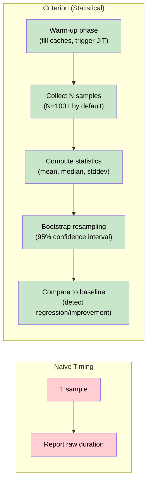

# 3. Statistical Benchmarking with Criterion 🟡

> **What you'll learn:**
> - Why `std::time::Instant` is insufficient for benchmarking and how sampling-based statistical analysis works
> - How to use `std::hint::black_box` to prevent the compiler from optimizing away your measured code
> - How to write, run, and interpret Criterion benchmarks — including violin plots, confidence intervals, and regression detection
> - How to benchmark async code and allocation-heavy patterns from the companion guides

---

## Why Naive Timing Is Wrong

The most common benchmarking mistake is this:

```rust
// 💥 FAILS IN PRODUCTION: Unreliable, misleading benchmark
use std::time::Instant;

fn main() {
    let start = Instant::now();
    let result = do_work();
    let elapsed = start.elapsed();
    println!("Took: {:?}", elapsed);
    // Problems:
    // 1. Single sample — no statistical significance
    // 2. Compiler may optimize away `do_work()` entirely
    // 3. First run includes cold caches
    // 4. OS scheduling noise dominates short measurements
    drop(result);
}
# fn do_work() -> u64 { 42 }
```

A single timing measurement tells you almost nothing. The CPU has branch predictors that warm up, caches that fill, and the OS scheduler can preempt your thread mid-measurement. You need **hundreds of samples** and **statistical analysis** to draw any conclusion.

### How Sampling Profilers and Benchmarks Differ



## Setting Up Criterion

Add Criterion to your workspace benchmark crate:

```toml
# mathbench/Cargo.toml (continuing from Chapter 1's workspace)
[package]
name = "mathbench"
version = "0.1.0"
edition = "2021"

[dev-dependencies]
criterion = { version = "0.5", features = ["html_reports"] }

[dependencies]
mathlib = { path = "../mathlib" }

[[bench]]
name = "fibonacci"
harness = false   # Disable the built-in test harness; Criterion provides its own
```

The `harness = false` line is critical — it tells Cargo to let Criterion's `main` function drive execution instead of the default `#[bench]` harness.

## The `black_box` Problem

Modern compilers are extraordinarily aggressive optimizers. If the compiler can prove that a function's return value is unused, it may eliminate the entire function call:

```rust
// 💥 FAILS IN PRODUCTION: Compiler eliminates the computation
fn bench_wrong(b: &mut criterion::Bencher) {
    b.iter(|| {
        let result = expensive_computation(42);
        // `result` is never read → compiler removes the call
    });
}
# fn expensive_computation(_: u64) -> u64 { 42 }
```

The fix is `std::hint::black_box` — a compiler intrinsic that prevents optimization across its boundary:

```rust
use std::hint::black_box;

// ✅ FIX: black_box prevents the compiler from seeing through the value
fn bench_correct(b: &mut criterion::Bencher) {
    b.iter(|| {
        let result = expensive_computation(black_box(42));
        black_box(result); // Force the compiler to "use" the result
    });
}
# fn expensive_computation(n: u64) -> u64 { n }
```

### What `black_box` Does

| Without `black_box` | With `black_box` |
|---------------------|------------------|
| Compiler sees constant input `42` | Compiler treats input as opaque |
| Compiler sees unused return value | Compiler assumes return value escapes |
| Function may be inlined and eliminated | Function must execute, result must materialize |
| Benchmark measures **nothing** | Benchmark measures **actual work** |

`black_box` is essentially an identity function with a side effect: it tells LLVM "I might read or write this memory, so you can't optimize it away." It compiles to zero instructions in most cases — the barrier is purely a compiler hint.

## Writing Your First Criterion Benchmark

```rust
// mathbench/benches/fibonacci.rs
use criterion::{criterion_group, criterion_main, BenchmarkId, Criterion};
use mathlib::fast_fibonacci;

/// Benchmark Fibonacci computation at various input sizes.
fn fibonacci_benchmark(c: &mut Criterion) {
    let mut group = c.benchmark_group("fibonacci");

    for &n in &[10, 20, 30, 40, 50, 60, 70, 80, 90] {
        group.bench_with_input(
            BenchmarkId::new("fast_doubling", n),
            &n,
            |b, &n| {
                b.iter(|| fast_fibonacci(std::hint::black_box(n)));
            },
        );
    }

    group.finish();
}

/// Compare naive recursive vs fast doubling at n=30.
fn fibonacci_comparison(c: &mut Criterion) {
    let mut group = c.benchmark_group("fib_comparison");

    group.bench_function("naive_n30", |b| {
        b.iter(|| naive_fibonacci(std::hint::black_box(30)));
    });

    group.bench_function("fast_n30", |b| {
        b.iter(|| fast_fibonacci(std::hint::black_box(30)));
    });

    group.finish();
}

/// Naive recursive Fibonacci — intentionally slow, for comparison.
fn naive_fibonacci(n: u64) -> u64 {
    if n <= 1 {
        return n;
    }
    naive_fibonacci(n - 1) + naive_fibonacci(n - 2)
}

criterion_group!(benches, fibonacci_benchmark, fibonacci_comparison);
criterion_main!(benches);
```

### Running the Benchmark

```bash
cargo bench -p mathbench
```

### Reading Criterion Output

```text
fibonacci/fast_doubling/10
                        time:   [4.2341 ns 4.2587 ns 4.2849 ns]
                        ─────────────────────┤ 95% CI ├─────────────────────

fibonacci/fast_doubling/50
                        time:   [7.1023 ns 7.1456 ns 7.1912 ns]

fib_comparison/naive_n30
                        time:   [3.8912 ms 3.9234 ms 3.9571 ms]

fib_comparison/fast_n30
                        time:   [5.8923 ns 5.9312 ns 5.9734 ns]
```

Let's decode this output:

| Field | Meaning |
|-------|---------|
| `[4.2341 ns 4.2587 ns 4.2849 ns]` | [lower bound, **point estimate**, upper bound] of the 95% confidence interval |
| Point estimate | The best single estimate of the true runtime |
| CI width | Narrower = more precise measurement; wider = more noise |
| `change: [-2.1234% -0.5432% +1.0876%]` | Performance change vs. the saved baseline (if exists) |
| `Performance has regressed` | Criterion detected a statistically significant slowdown |

### HTML Reports and Violin Plots

Criterion generates HTML reports in `target/criterion/`:

```bash
# After running benchmarks:
open target/criterion/report/index.html   # macOS
xdg-open target/criterion/report/index.html  # Linux
```

The HTML report includes:

- **Violin plots** — show the distribution of sample times (bimodal distributions indicate cache effects or scheduler interference)
- **PDF (probability density function)** — shows where most measurements cluster
- **Iteration time vs sample** — helps identify warmup effects
- **Comparison** — if a baseline exists, shows regression/improvement with confidence intervals

## Configuring Criterion

```rust
use criterion::Criterion;
use std::time::Duration;

fn custom_config() -> Criterion {
    Criterion::default()
        .sample_size(200)           // More samples = more precision (default: 100)
        .measurement_time(Duration::from_secs(10))  // Longer = more data
        .warm_up_time(Duration::from_secs(3))       // Cache warming
        .significance_level(0.01)   // Stricter than default 0.05
        .noise_threshold(0.02)      // Ignore changes < 2%
}

// Use custom config:
criterion_group! {
    name = benches;
    config = custom_config();
    targets = fibonacci_benchmark
}
criterion_main!(benches);
# fn fibonacci_benchmark(_: &mut Criterion) {}
```

### Key Configuration Options

| Option | Default | What It Controls |
|--------|---------|-----------------|
| `sample_size` | 100 | Number of measurement samples |
| `measurement_time` | 5s | Total time spent collecting samples |
| `warm_up_time` | 3s | Time to warm caches before measuring |
| `significance_level` | 0.05 | p-value threshold for detecting changes |
| `noise_threshold` | 0.01 | Ignore changes smaller than this fraction |
| `confidence_level` | 0.95 | Confidence interval width |

## Benchmarking Allocation Overhead

One of the most important things to benchmark is allocation cost. This connects directly to the [Memory Management](../memory-management-book/src/SUMMARY.md) and [Smart Pointers](../smart-pointers-book/src/SUMMARY.md) guides:

```rust
use criterion::{criterion_group, criterion_main, Criterion};
use std::hint::black_box;
use std::sync::Arc;

fn allocation_benchmarks(c: &mut Criterion) {
    let mut group = c.benchmark_group("allocation");

    // Measure the cost of Box allocation
    group.bench_function("box_alloc", |b| {
        b.iter(|| {
            let boxed: Box<[u8; 1024]> = Box::new(black_box([0u8; 1024]));
            black_box(boxed);
        });
    });

    // Measure the cost of Vec allocation + push
    group.bench_function("vec_push_1024", |b| {
        b.iter(|| {
            let mut v = Vec::with_capacity(1024);
            for i in 0..1024u32 {
                v.push(black_box(i));
            }
            black_box(v);
        });
    });

    // Measure Arc clone overhead (relevant to concurrent patterns)
    group.bench_function("arc_clone", |b| {
        let shared = Arc::new([0u8; 1024]);
        b.iter(|| {
            let cloned = Arc::clone(black_box(&shared));
            black_box(cloned);
        });
    });

    // Measure Arc clone + drop (full lifecycle)
    group.bench_function("arc_clone_drop", |b| {
        let shared = Arc::new([0u8; 1024]);
        b.iter(|| {
            let cloned = Arc::clone(&shared);
            drop(black_box(cloned));
        });
    });

    group.finish();
}

criterion_group!(benches, allocation_benchmarks);
criterion_main!(benches);
```

This reveals that `Arc::clone` is cheap (~20ns on modern hardware — just an atomic increment), but the **allocation** that creates the `Arc` in the first place is expensive (~50–100ns). In a hot loop, the lesson is: allocate outside the loop, clone the `Arc` inside. Chapter 6 will show you how to use `dhat` to count these allocations precisely.

## Benchmarking Async Code

To benchmark async functions, use Criterion with Tokio's runtime:

```rust
use criterion::{criterion_group, criterion_main, Criterion};
use tokio::runtime::Runtime;

fn async_benchmarks(c: &mut Criterion) {
    let rt = Runtime::new().unwrap();

    c.bench_function("tokio_spawn_overhead", |b| {
        b.to_async(&rt).iter(|| async {
            // Measure the overhead of spawning a trivial task
            let handle = tokio::spawn(async { 42u64 });
            std::hint::black_box(handle.await.unwrap());
        });
    });

    c.bench_function("tokio_channel_roundtrip", |b| {
        b.to_async(&rt).iter(|| async {
            let (tx, rx) = tokio::sync::oneshot::channel();
            tx.send(42u64).unwrap();
            std::hint::black_box(rx.await.unwrap());
        });
    });
}

criterion_group!(benches, async_benchmarks);
criterion_main!(benches);
```

> **Connection to Async Rust guide:** This is how you'd benchmark the patterns from *Async Rust, Chapter 8 (Tokio Deep Dive)*. Does `tokio::spawn` add measurable overhead versus calling an async function directly? The benchmark gives you the data.

## Regression Detection in CI

Criterion saves baselines in `target/criterion/`. You can use this in CI to catch performance regressions:

```bash
# Step 1: On the main branch, save a baseline
cargo bench -- --save-baseline main

# Step 2: On a PR branch, compare against it
cargo bench -- --baseline main

# Criterion exits with non-zero status if regression detected
```

For automated CI pipelines, use `criterion-compare`:

```yaml
# .github/workflows/bench.yml
- name: Run benchmarks
  run: |
    cargo bench -- --save-baseline pr
    cargo bench -- --baseline main --output-format bencher | tee bench-output.txt
```

## Common Benchmarking Mistakes

| Mistake | Why It's Wrong | Fix |
|---------|--------------|-----|
| Forgetting `black_box` | Compiler optimizes away the work | Wrap inputs and outputs in `black_box` |
| Too few samples | Noisy results, wide confidence intervals | Increase `sample_size` or `measurement_time` |
| Benchmarking in debug mode | Debug builds are 10–100× slower | Always `cargo bench` (uses release profile) |
| Including setup in the measurement | Measures allocation, not computation | Move setup outside `b.iter()` |
| Running on a loaded machine | Background processes add variance | Close browsers, stop builds, use `nice -n -20` |
| Ignoring bimodal distributions | Two peaks = external interference | Check violin plots, rerun on quiet machine |

---

<details>
<summary><strong>🏋️ Exercise: Benchmark Scalar vs SIMD Line Counter</strong> (click to expand)</summary>

**Challenge:** Using the `count_lines` function from Chapter 2 (with the `simd` feature gate):

1. Create a Criterion benchmark that compares the scalar and SIMD implementations
2. Test with input sizes: 64 bytes, 1 KB, 64 KB, 1 MB
3. Use `BenchmarkId` to parameterize the benchmarks
4. Generate the HTML report and examine the violin plots
5. Answer: At what input size does the SIMD version become meaningfully faster?

<details>
<summary>🔑 Solution</summary>

**`benches/line_counter.rs`**

```rust
use criterion::{
    criterion_group, criterion_main, BenchmarkId, Criterion, Throughput,
};
use std::hint::black_box;

/// Scalar line counter — always available
fn count_lines_scalar(data: &[u8]) -> usize {
    data.iter().filter(|&&b| b == b'\n').count()
}

/// SIMD-style line counter using SWAR (8-byte chunks)
fn count_lines_simd(data: &[u8]) -> usize {
    let mut count = 0;
    let newline = 0x0A0A0A0A_0A0A0A0Au64;

    let chunks = data.chunks_exact(8);
    let remainder = chunks.remainder();

    for chunk in chunks {
        let word = u64::from_ne_bytes(chunk.try_into().unwrap());
        let xored = word ^ newline;
        let mask = (xored.wrapping_sub(0x0101010101010101))
            & !xored
            & 0x8080808080808080;
        count += (mask.count_ones() / 8) as usize;
    }

    count += remainder.iter().filter(|&&b| b == b'\n').count();
    count
}

fn generate_test_data(size: usize) -> Vec<u8> {
    // Generate data with ~1 newline per 80 bytes (typical line length)
    (0..size)
        .map(|i| if i % 80 == 79 { b'\n' } else { b'A' })
        .collect()
}

fn line_counter_benchmark(c: &mut Criterion) {
    let sizes: Vec<(& str, usize)> = vec![
        ("64B", 64),
        ("1KB", 1024),
        ("64KB", 65536),
        ("1MB", 1048576),
    ];

    let mut group = c.benchmark_group("count_lines");

    for (name, size) in &sizes {
        let data = generate_test_data(*size);

        // Tell Criterion the throughput for bytes/sec calculation
        group.throughput(Throughput::Bytes(*size as u64));

        group.bench_with_input(
            BenchmarkId::new("scalar", name),
            &data,
            |b, data| {
                b.iter(|| count_lines_scalar(black_box(data)));
            },
        );

        group.bench_with_input(
            BenchmarkId::new("simd_swar", name),
            &data,
            |b, data| {
                b.iter(|| count_lines_simd(black_box(data)));
            },
        );
    }

    group.finish();
}

criterion_group!(benches, line_counter_benchmark);
criterion_main!(benches);
```

**Expected results (approximate, varies by CPU):**

```text
count_lines/scalar/64B    time:   [18.234 ns ...]   throughput: [3.34 GiB/s]
count_lines/simd_swar/64B time:   [12.891 ns ...]   throughput: [4.73 GiB/s]

count_lines/scalar/1KB    time:   [287.12 ns ...]   throughput: [3.32 GiB/s]
count_lines/simd_swar/1KB time:   [102.34 ns ...]   throughput: [9.30 GiB/s]

count_lines/scalar/1MB    time:   [301.23 µs ...]   throughput: [3.16 GiB/s]
count_lines/simd_swar/1MB time:   [99.45 µs ...]    throughput: [9.57 GiB/s]
```

**Key observations:**
- At 64 bytes, the SIMD version is ~30% faster — marginal
- At 1 KB+, the SIMD version is ~3× faster — the chunk processing dominates
- The crossover where SIMD becomes *clearly* worthwhile is around 256–512 bytes
- Check the violin plots: if you see bimodal distributions, cache effects are at play

</details>
</details>

---

> **Key Takeaways**
> - **Never benchmark with a single `Instant::now()` measurement.** Use Criterion's statistical analysis with warm-up, hundreds of samples, and confidence intervals.
> - **Always use `std::hint::black_box`** on benchmark inputs and outputs to prevent the compiler from optimizing away the code you're measuring.
> - Criterion's HTML reports (violin plots, PDFs) reveal distribution shapes that numbers alone hide — bimodal distributions are a red flag for external interference.
> - **Benchmarking allocation** (Box, Vec, Arc) quantifies the patterns taught in the Memory Management and Smart Pointers guides — always measure, never assume.
> - Use `--save-baseline` / `--baseline` in CI to automatically detect performance regressions in pull requests.

> **See also:**
> - [Chapter 2: Feature Flags](ch02-feature-flags.md) — benchmarking feature-gated code paths
> - [Chapter 5: CPU Profiling](ch05-cpu-profiling-flamegraphs.md) — when the benchmark says "slow," flamegraphs show you *where*
> - [Async Rust](../async-book/src/SUMMARY.md) — benchmarking async task overhead and channel throughput
> - [Memory Management](../memory-management-book/src/SUMMARY.md) — understanding allocation costs revealed by benchmarks
> - [Criterion.rs Documentation](https://bheisler.github.io/criterion.rs/book/)
