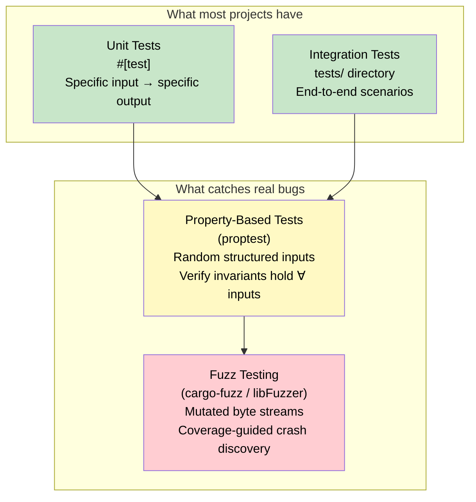
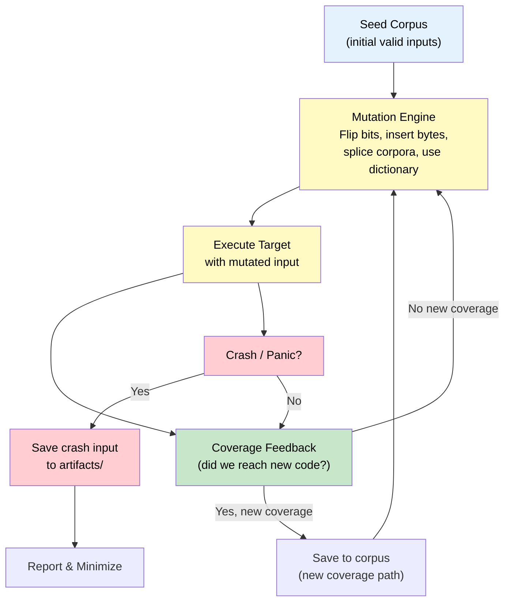
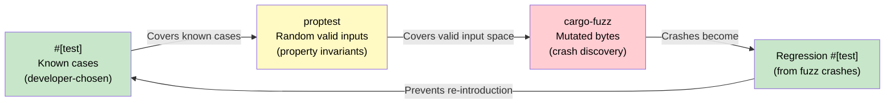

# 4. Property-Based Testing and Fuzzing 🔴

> **What you'll learn:**
> - Why example-based `#[test]` is necessary but insufficient — the **coverage gap** between your imagination and production input
> - How **property-based testing** (`proptest`) generates thousands of structured inputs to verify invariants
> - How **coverage-guided fuzzing** (`cargo-fuzz` / libFuzzer) throws mutated byte streams at your code until something crashes
> - A systematic workflow: `#[test]` → `proptest` → `cargo-fuzz` → fix → regression test

---

## The Testing Pyramid's Missing Layer

Most Rust projects have unit tests and maybe integration tests. These are **example-based**: you pick specific inputs and check specific outputs. The problem is that your imagination is finite, but the input space is not.



### Comparison of Testing Strategies

| Aspect | `#[test]` | `proptest` | `cargo-fuzz` |
|--------|-----------|-----------|--------------|
| Input source | Developer's imagination | Random generation from declared strategies | Coverage-guided byte mutation |
| Input structure | Fully controlled | Structured (valid types) | Raw bytes (you parse them) |
| Number of inputs | 1–20 per test | 256–10,000 per run | Millions over hours |
| What it finds | Expected bugs | Invariant violations, edge cases | Crashes, panics, OOB, infinite loops |
| Speed per input | N/A (single run) | ~microseconds | ~microseconds (after warmup) |
| Deterministic | Yes | Reproducible via seed | Reproducible via corpus file |
| Best for | Known edge cases | "For all valid X, property P holds" | "Can any byte sequence crash this?" |

## Property-Based Testing with `proptest`

### The Core Idea

Instead of testing `f(3) == 9`, you test: **"For all `x: u32`, `f(x)` satisfies property P."**

The framework generates random values of `x`, runs your code, and checks the property. If it finds a failing input, it **shrinks** it to the smallest possible counterexample.

### Setup

```toml
[dev-dependencies]
proptest = "1.5"
```

### Your First Property Test

```rust
use proptest::prelude::*;

/// Encode a u32 as 4 big-endian bytes, then decode it back.
fn encode(value: u32) -> [u8; 4] {
    value.to_be_bytes()
}

fn decode(bytes: &[u8; 4]) -> u32 {
    u32::from_be_bytes(*bytes)
}

proptest! {
    /// Property: encode followed by decode is the identity function.
    #[test]
    fn roundtrip_encode_decode(value: u32) {
        let encoded = encode(value);
        let decoded = decode(&encoded);
        prop_assert_eq!(decoded, value);
    }
}
```

When you run `cargo test`, proptest generates **256 random `u32` values** (by default) and checks that the round-trip holds for all of them. If any fails, it prints the failing input and the **shrunk** minimal counterexample.

### Strategies: Controlling Input Generation

Proptest's power comes from **strategies** — composable generators for complex types:

```rust
use proptest::prelude::*;
use proptest::collection::vec;

// Generate a Vec<u8> with length between 1 and 1024
fn byte_vec_strategy() -> impl Strategy<Value = Vec<u8>> {
    vec(any::<u8>(), 1..=1024)
}

// Generate a pair of (offset, length) that's valid for a given buffer size
fn valid_slice_params(buf_len: usize) -> impl Strategy<Value = (usize, usize)> {
    (0..buf_len).prop_flat_map(move |start| {
        let max_len = buf_len - start;
        (Just(start), 0..=max_len)
    })
}

// Generate a non-empty UTF-8 string up to 256 bytes
fn utf8_strategy() -> impl Strategy<Value = String> {
    "[\\x00-\\x7f]{1,256}"  // ASCII subset — you can use any regex
}
```

### Finding Real Bugs: A CSV Parser

Here's a parser that works on your test cases but breaks on edge cases:

```rust
/// Parse a line of comma-separated values.
/// 
/// 💥 FAILS IN PRODUCTION: Doesn't handle trailing comma or empty input.
fn parse_csv_line_v1(line: &str) -> Vec<&str> {
    line.split(',').collect()
}

#[cfg(test)]
mod tests {
    use super::*;

    // Example-based tests pass:
    #[test]
    fn test_simple() {
        assert_eq!(parse_csv_line_v1("a,b,c"), vec!["a", "b", "c"]);
    }

    #[test]
    fn test_single_field() {
        assert_eq!(parse_csv_line_v1("hello"), vec!["hello"]);
    }

    // But proptest reveals the problem...
}
```

Now add a property test that catches the issue:

```rust
use proptest::prelude::*;

/// A "well-formed" CSV line: N fields separated by commas, where
/// each field contains no commas.
fn csv_line_strategy() -> impl Strategy<Value = (Vec<String>, String)> {
    // Generate 0..10 fields, each 0..20 non-comma characters
    proptest::collection::vec("[^,]{0,20}", 0..10).prop_map(|fields| {
        let line = fields.join(",");
        (fields, line)
    })
}

proptest! {
    #[test]
    fn csv_roundtrip((expected_fields, line) in csv_line_strategy()) {
        let parsed = parse_csv_line_v1(&line);
        // Property: parsing should recover the original fields
        prop_assert_eq!(parsed.len(), expected_fields.len(),
            "Field count mismatch for line: {:?}", line);
    }
}
```

**What proptest finds:** When `expected_fields` is empty (`[]`), the line is `""`, but `"".split(',')` yields `[""]` (one empty string, not zero). The property test catches this mismatch that your example tests missed.

### ✅ FIX: Handle empty input

```rust
/// ✅ FIX: Correctly handle empty lines
fn parse_csv_line_v2(line: &str) -> Vec<&str> {
    if line.is_empty() {
        return Vec::new();
    }
    line.split(',').collect()
}
```

### Shrinking

When proptest finds a failure, it doesn't just report a random 47-character string. It **shrinks** the input to the simplest possible failing case. For the CSV example:

```text
thread 'csv_roundtrip' panicked at 'Test failed: Field count mismatch for line: ""'
minimal failing input: expected_fields = [], line = ""
```

Instead of a complex input, you get the minimal reproduction. This is invaluable for debugging.

## Fuzzing with `cargo-fuzz`

### How Coverage-Guided Fuzzing Works

Fuzzing is fundamentally different from property testing. Instead of generating *structured* inputs, a fuzzer throws *mutated byte streams* at your code and watches what happens. What makes `cargo-fuzz` (which wraps LLVM's libFuzzer) special is **coverage-guided mutation**:



The key insight: the fuzzer **instruments your compiled code** (via LLVM's SanitizerCoverage) to detect which branches are taken. When a mutation reaches new code, that input is saved to the corpus. Over millions of iterations, the fuzzer systematically explores your code's entire reachable state space.

### Setup

```bash
# Install cargo-fuzz (requires nightly Rust for -Zsanitizer flags)
cargo install cargo-fuzz

# Initialize fuzzing for a crate
cd myparser
cargo fuzz init

# This creates:
# fuzz/
# ├── Cargo.toml
# └── fuzz_targets/
#     └── fuzz_target_1.rs
```

### Writing a Fuzz Target

A fuzz target is a function that receives arbitrary bytes and does something with them. The goal: **your code must not panic, segfault, or loop infinitely on any input.**

```rust
// fuzz/fuzz_targets/fuzz_parse.rs
#![no_main]

use libfuzzer_sys::fuzz_target;
use myparser::parse_bytes;

fuzz_target!(|data: &[u8]| {
    // The fuzzer will call this with millions of different byte slices.
    // We don't care about the result — we only care that it doesn't crash.
    let _ = parse_bytes(data);
});
```

### Running the Fuzzer

```bash
# Run the fuzzer — it runs until you Ctrl+C or it finds a crash
cargo +nightly fuzz run fuzz_parse

# Output looks like:
# INFO: Seed: 3829401234
# INFO: Loaded 1 modules   (2847 inline 8-bit counters)
# INFO: -max_len is not provided; libFuzzer will not generate inputs larger than 4096 bytes
# #2      INITED cov: 47 ft: 48 corp: 1/1b exec/s: 0
# #1024   pulse  cov: 125 ft: 234 corp: 42/2198b exec/s: 512
# #65536  pulse  cov: 201 ft: 567 corp: 189/15Kb exec/s: 8192
# ==12345== ERROR: libFuzzer: deadly signal
# MS: 1 InsertByte; base unit: a1b2c3...
# artifact_prefix='./fuzz/artifacts/fuzz_parse/';
# Test unit written to ./fuzz/artifacts/fuzz_parse/crash-abc123def456
```

### Reading Fuzzer Output

| Field | Meaning |
|-------|---------|
| `cov: 201` | Number of code coverage edges reached |
| `ft: 567` | Number of feature targets (finer-grained coverage) |
| `corp: 189/15Kb` | Corpus size: 189 inputs totaling 15 KB |
| `exec/s: 8192` | Executions per second (higher = better) |
| `crash-abc123...` | The exact input that caused the crash |

### Reproducing and Minimizing Crashes

```bash
# Reproduce the crash
cargo +nightly fuzz run fuzz_parse fuzz/artifacts/fuzz_parse/crash-abc123def456

# Minimize the crashing input (find smallest byte sequence that still crashes)
cargo +nightly fuzz tmin fuzz_parse fuzz/artifacts/fuzz_parse/crash-abc123def456

# The minimized input is saved — add it as a regression test
```

### A Complete Example: Finding an Index-Out-of-Bounds Bug

Here's a binary message parser with a subtle bug:

```rust
/// Parse a length-prefixed message from raw bytes.
/// Format: [u16 length (big-endian)] [payload bytes]
///
/// 💥 FAILS IN PRODUCTION: No bounds check on length vs actual data
pub fn parse_message_v1(data: &[u8]) -> Option<&[u8]> {
    if data.len() < 2 {
        return None;
    }
    let length = u16::from_be_bytes([data[0], data[1]]) as usize;
    // 💥 If length > data.len() - 2, this panics with index out of bounds!
    Some(&data[2..2 + length])
}
```

A fuzz target:

```rust
#![no_main]
use libfuzzer_sys::fuzz_target;

fuzz_target!(|data: &[u8]| {
    // The fuzzer will eventually generate data where the length prefix
    // claims more bytes than are available → panic!
    let _ = parse_message_v1(data);
});

// Example crashing input (minimized by `cargo fuzz tmin`):
// [0x00, 0x05, 0x41]
// Length says 5 bytes, but only 1 byte of payload exists → panic
# fn parse_message_v1(data: &[u8]) -> Option<&[u8]> {
#     if data.len() < 2 { return None; }
#     let length = u16::from_be_bytes([data[0], data[1]]) as usize;
#     Some(&data[2..2 + length])
# }
```

### ✅ FIX: Validate length against actual available data

```rust
/// ✅ FIX: Validate that the claimed length doesn't exceed available data
pub fn parse_message_v2(data: &[u8]) -> Option<&[u8]> {
    if data.len() < 2 {
        return None;
    }
    let length = u16::from_be_bytes([data[0], data[1]]) as usize;
    let payload = data.get(2..2 + length)?;  // Returns None if out of bounds
    Some(payload)
}
```

### Turning Crashes into Regression Tests

Every crash found by the fuzzer should become a permanent `#[test]`:

```rust
#[cfg(test)]
mod tests {
    use super::*;

    /// Regression test from fuzz crash: crash-abc123def456
    /// Length prefix exceeds available payload bytes.
    #[test]
    fn fuzz_regression_length_overflow() {
        // This exact input was found by cargo-fuzz
        let crashing_input = &[0x00, 0x05, 0x41];
        // Must not panic — should return None instead
        assert_eq!(parse_message_v2(crashing_input), None);
    }

    /// Regression test: empty input
    #[test]
    fn fuzz_regression_empty() {
        assert_eq!(parse_message_v2(&[]), None);
    }

    /// Regression test: length prefix only, no payload
    #[test]
    fn fuzz_regression_header_only() {
        assert_eq!(parse_message_v2(&[0x00, 0x03]), None);
    }
}
```

## Structured Fuzzing with `Arbitrary`

For complex types, raw bytes are hard to work with. The `arbitrary` crate lets you derive structured input from raw bytes:

```rust
#![no_main]

use libfuzzer_sys::fuzz_target;
use arbitrary::Arbitrary;

#[derive(Arbitrary, Debug)]
struct FuzzInput {
    key: String,
    value: Vec<u8>,
    flags: u32,
}

fuzz_target!(|input: FuzzInput| {
    // Now the fuzzer generates structured inputs, not just raw bytes.
    // It's still coverage-guided — it'll find interesting key/value combos.
    let _ = process_record(&input.key, &input.value, input.flags);
});
# fn process_record(_: &str, _: &[u8], _: u32) {}
```

## Combining proptest and cargo-fuzz

These tools are complementary, not alternatives:



| Use | proptest | cargo-fuzz |
|-----|----------|-----------|
| Verify invariants | ✅ Primary use | Not designed for this |
| Find crashes in parsers | Possible but slow | ✅ Primary use |
| Structured inputs | ✅ Native strategies | Via `Arbitrary` derive |
| Coverage guidance | No | ✅ Yes (libFuzzer) |
| Runs in `cargo test` | ✅ Yes | No (requires nightly + separate command) |
| CI integration | Easy (just `cargo test`) | Harder (needs nightly, longer run times) |

**Recommended workflow:**
1. Write `#[test]` for known edge cases
2. Write `proptest` tests for invariants over valid input
3. Write `cargo-fuzz` targets for parsers and deserializers that accept untrusted input
4. Turn every fuzz crash into a `#[test]` regression test

---

<details>
<summary><strong>🏋️ Exercise: Fuzz and Fix a URL Parser</strong> (click to expand)</summary>

**Challenge:** Here's a minimal URL parser with bugs. Your task:

1. Write a proptest that verifies the round-trip property: `parse(url.to_string()) == url`
2. Write a cargo-fuzz target that finds a panic
3. Fix the parser and add regression tests

```rust
/// A parsed URL (simplified).
#[derive(Debug, Clone, PartialEq)]
pub struct SimpleUrl {
    pub scheme: String,   // "http" or "https"
    pub host: String,     // e.g., "example.com"
    pub path: String,     // e.g., "/api/v1"
}

impl SimpleUrl {
    /// 💥 FAILS IN PRODUCTION: Multiple bugs lurking
    pub fn parse(input: &str) -> Result<Self, &'static str> {
        let (scheme, rest) = input.split_once("://")
            .ok_or("missing ://")?;

        // Bug 1: Doesn't validate scheme
        let scheme = scheme.to_string();

        // Bug 2: split_once('/') fails on "http://host" (no path)
        let (host, path) = rest.split_once('/')
            .ok_or("missing path")?;

        Ok(SimpleUrl {
            scheme,
            host: host.to_string(),
            path: format!("/{path}"),
        })
    }

    pub fn to_string(&self) -> String {
        format!("{}://{}{}", self.scheme, self.host, self.path)
    }
}
```

<details>
<summary>🔑 Solution</summary>

**Step 1: proptest reveals the "no path" bug**

```rust
use proptest::prelude::*;

fn url_strategy() -> impl Strategy<Value = SimpleUrl> {
    (
        prop_oneof!["http", "https"],
        "[a-z]{3,20}\\.[a-z]{2,6}",  // e.g. "example.com"
        "(/[a-z0-9]{1,10}){0,4}",     // e.g. "/api/v1" or ""
    )
        .prop_map(|(scheme, host, path)| SimpleUrl {
            scheme: scheme.to_string(),
            host,
            path: if path.is_empty() { "/".to_string() } else { path },
        })
}

proptest! {
    #[test]
    fn roundtrip(url in url_strategy()) {
        let serialized = url.to_string();
        let parsed = SimpleUrl::parse(&serialized)
            .expect(&format!("failed to parse: {}", serialized));
        prop_assert_eq!(parsed, url);
    }
}
```

**proptest finds:** URLs like `"http://abc.com/"` where the path is just `"/"` — `split_once('/')` returns `("abc.com", "")`, so the path becomes `"/"` which is correct, but `"http://abc.com"` (no trailing slash) errors with "missing path".

**Step 2: cargo-fuzz target**

```rust
#![no_main]
use libfuzzer_sys::fuzz_target;

fuzz_target!(|data: &[u8]| {
    if let Ok(input) = std::str::from_utf8(data) {
        // Must not panic on any input
        let _ = SimpleUrl::parse(input);
    }
});
```

**cargo-fuzz finds:** Inputs like `"://host"` (empty scheme), `"http://"` (empty host), and `"http://host\0/"` (null bytes in host).

**Step 3: ✅ FIX — robust parser**

```rust
impl SimpleUrl {
    /// ✅ FIX: Validate scheme, handle missing path, reject empty host
    pub fn parse(input: &str) -> Result<Self, &'static str> {
        let (scheme, rest) = input.split_once("://")
            .ok_or("missing ://")?;

        // Validate scheme
        if scheme != "http" && scheme != "https" {
            return Err("unsupported scheme");
        }

        // Handle path: if no '/' after host, default to "/"
        let (host, path) = match rest.find('/') {
            Some(idx) => (&rest[..idx], &rest[idx..]),
            None => (rest, "/"),
        };

        // Validate host is non-empty and contains no control characters
        if host.is_empty() {
            return Err("empty host");
        }
        if host.bytes().any(|b| b < 0x20) {
            return Err("invalid characters in host");
        }

        Ok(SimpleUrl {
            scheme: scheme.to_string(),
            host: host.to_string(),
            path: path.to_string(),
        })
    }
}
```

**Step 4: Regression tests from fuzz crashes**

```rust
#[cfg(test)]
mod regression_tests {
    use super::*;

    #[test]
    fn fuzz_regression_no_path() {
        let url = SimpleUrl::parse("http://example.com").unwrap();
        assert_eq!(url.path, "/");
    }

    #[test]
    fn fuzz_regression_empty_scheme() {
        assert!(SimpleUrl::parse("://host/path").is_err());
    }

    #[test]
    fn fuzz_regression_empty_host() {
        assert!(SimpleUrl::parse("http:///path").is_err());
    }

    #[test]
    fn fuzz_regression_null_in_host() {
        assert!(SimpleUrl::parse("http://ho\0st/path").is_err());
    }
}
```

</details>
</details>

---

> **Key Takeaways**
> - **Example-based `#[test]` is necessary but insufficient.** It only covers the cases *you* thought of. Production inputs are far more creative than developers.
> - **Property-based testing** (`proptest`) generates thousands of structured inputs and verifies that invariants hold for all of them. The **shrinking** feature produces minimal failing examples.
> - **Coverage-guided fuzzing** (`cargo-fuzz`) is the most powerful technique for finding crashes in parsers, deserializers, and any code that processes untrusted input. It systematically explores code paths via mutation.
> - **Every fuzz crash must become a regression test.** The crash → fix → `#[test]` loop ensures bugs never re-appear.
> - Use `proptest` for invariant verification (runs in `cargo test`), and `cargo-fuzz` for crash discovery (runs separately, needs nightly).

> **See also:**
> - [Chapter 3: Criterion Benchmarking](ch03-criterion-benchmarking.md) — benchmark the fixed vs broken implementation
> - [Chapter 7: Capstone](ch07-capstone-hardened-parser.md) — end-to-end fuzzing of a production parser
> - [Unsafe Rust & FFI](../unsafe-ffi-book/src/SUMMARY.md) — fuzzing is *essential* for any code using `unsafe` or crossing FFI boundaries
> - [proptest Book](https://proptest-rs.github.io/proptest/intro.html) | [cargo-fuzz Guide](https://rust-fuzz.github.io/book/)
