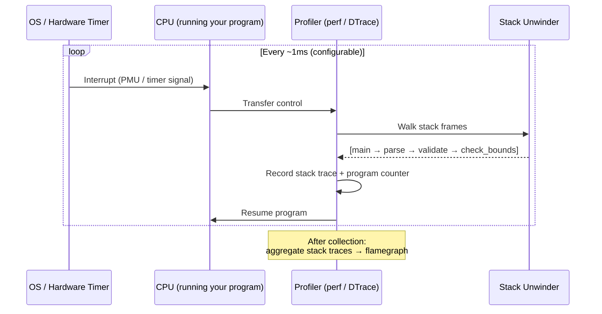

# 5. CPU Profiling and Flamegraphs 🔴

> **What you'll learn:**
> - How **sampling profilers** work at the hardware/OS level — interrupts, stack unwinding, and symbol resolution
> - How to use `perf` (Linux) and `DTrace`/`Instruments` (macOS) to collect CPU profiles
> - How to generate and **read** flamegraphs with `cargo-flamegraph` — identifying hot functions, wide stacks, and stalling patterns
> - How to enable debug symbols in release builds for accurate profiling

---

## First Principles: How Sampling Profilers Work

Before you run any tool, understand what it's doing. A sampling profiler doesn't instrument every function call (that would be prohibitively expensive). Instead, it works like this:



### The Sampling Model

| Concept | Explanation |
|---------|-------------|
| **Sample** | A single stack trace captured at an interrupt |
| **Sample rate** | How often interrupts fire (default: ~1000 Hz = every 1ms) |
| **Stack trace** | The chain of function calls active at that moment |
| **Hot function** | A function that appears in many samples (it's where CPU time is spent) |
| **On-CPU time** | Time actually executing instructions (excludes waiting for I/O) |
| **Off-CPU time** | Time blocked (I/O, locks, sleep) — **not captured** by CPU profilers |

**Key insight:** A sampling profiler is **statistical**. A function appearing in 30% of samples means it consumed approximately 30% of CPU time. More samples = more accuracy. At 1000 Hz over 10 seconds, you get 10,000 samples — enough for reliable results.

### What Sampling Cannot Tell You

| It tells you | It does NOT tell you |
|-------------|---------------------|
| Where CPU time is spent | Why the code is slow (cache misses, branch misprediction) |
| Which functions are hot | How many times a function was called |
| Call chains that are expensive | Off-CPU time (I/O, lock contention) |
| Relative cost of code paths | Exact nanosecond timing (use Criterion for that) |

## Enabling Debug Symbols in Release Builds

By default, `cargo build --release` strips debug info. Without debug info, your flamegraph shows mangled addresses instead of function names. Fix this:

```toml
# Cargo.toml or workspace root Cargo.toml
[profile.release]
debug = true    # Include debug info (DWARF symbols)
# This increases binary size but does NOT affect runtime performance.
# The debug sections are metadata, not executed code.
```

### Profile Options That Affect Profiling

| Setting | Default (release) | For Profiling | Why |
|---------|-------------------|---------------|-----|
| `debug` | `false` | `true` | Function names in stack traces |
| `opt-level` | `3` | `3` | Profile the optimized code you'll actually ship |
| `lto` | `false` | `"thin"` or `false` | LTO can inline across crates — profile what you ship |
| `strip` | `"none"` | `"none"` | Don't strip symbols! |
| `debug-assertions` | `false` | `false` | Keep release behavior |

A dedicated profiling profile:

```toml
# Profiling-specific profile: release performance + debug symbols
[profile.profiling]
inherits = "release"
debug = true
strip = "none"
```

```bash
cargo build --profile profiling
```

## Profiling on Linux with `perf`

`perf` is the standard Linux profiling tool. It uses hardware Performance Monitoring Unit (PMU) counters for zero-overhead sampling.

### Collecting a Profile

```bash
# Build with debug symbols
cargo build --release
# (or cargo build --profile profiling)

# Run under perf, sampling at 997 Hz (prime number avoids aliasing with periodic events)
perf record -F 997 --call-graph dwarf ./target/release/myparser input.dat

# This creates a perf.data file with all stack trace samples
```

### Generating a Flamegraph from perf Data

```bash
# Option A: Use cargo-flamegraph (easiest)
cargo install flamegraph
cargo flamegraph --bin myparser -- input.dat
# Creates flamegraph.svg

# Option B: Use Brendan Gregg's FlameGraph scripts
perf script | stackcollapse-perf.pl | flamegraph.pl > flamegraph.svg
```

### Key `perf` Commands

```bash
# See top functions by CPU usage (like top, but for functions)
perf report

# See annotated assembly for a specific function
perf annotate myparser::validate_record

# Count hardware events (cache misses, branch mispredictions)
perf stat ./target/release/myparser input.dat
# Output:
#   1,234,567  cache-misses   # 2.3% of all cache references
#   456,789    branch-misses  # 0.8% of all branches
#   2.345      seconds time elapsed
```

## Profiling on macOS with DTrace / Instruments

macOS doesn't have `perf`, but it has DTrace and Instruments (via Xcode).

### Using `cargo-flamegraph` on macOS

`cargo-flamegraph` automatically uses `dtrace` on macOS:

```bash
cargo install flamegraph

# On macOS, flamegraph uses dtrace under the hood
# Note: requires SIP (System Integrity Protection) considerations
cargo flamegraph --bin myparser -- input.dat

# If you get a permission error, you may need to:
# 1. Run with sudo (for dtrace)
sudo cargo flamegraph --bin myparser -- input.dat
# 2. Or use Instruments instead
```

### Using Instruments (Xcode)

For a GUI experience:

```bash
# Build the binary
cargo build --release

# Open in Instruments with the "Time Profiler" template
xcrun xctrace record --template "Time Profiler" \
    --launch ./target/release/myparser -- input.dat

# Open the resulting .trace file in Instruments.app
open *.trace
```

Instruments provides a full interactive flamegraph with hover-to-zoom, source annotation, and the ability to drill into specific time ranges.

## Reading Flamegraphs

A flamegraph is a visualization where:
- **Each horizontal bar** is a function
- **Width** = proportion of CPU time (wider = more time)
- **Stack grows upward** — bottom is `main()`, top is the leaf function where CPU was actually executing
- **Color** is typically random (not meaningful) unless using differential flamegraphs

```text
┌─────────────────────────────────────────────────────────────────┐
│                          main                                    │
├───────────────────────────────────┬─────────────────────────────┤
│         process_batch             │       write_output           │
├──────────────┬────────────────────┤                             │
│  parse_record│   validate_record  │                             │
├──────────────┤──────┬─────────────┤                             │
│              │ check│ regex_match │                             │
│              │bounds│             │                             │
└──────────────┴──────┴─────────────┴─────────────────────────────┘
              ▲                       ▲
              │                       │
         This is HOT            This is COOL
    (wide = lots of samples)   (narrow = few samples)
```

### Flamegraph Reading Checklist

| What to look for | What it means | Action |
|-----------------|---------------|--------|
| **Wide flat bars at the top** | A leaf function consuming lots of CPU | Optimize that function, or call it less often |
| **Wide bars in the middle** | A function with expensive children | Look at its children to find the real culprit |
| **Many thin spikes ("teeth")** | Many different short-lived functions | May indicate excessive dynamic dispatch or allocation |
| **`malloc` / `__rust_alloc` bars** | Heap allocation overhead | Consider pre-allocation, arenas, or stack allocation |
| **`clone` / `drop` bars** | Cloning or dropping expensive types | Reduce cloning; use `&` or `Arc` |
| **`memcpy` bars** | Data copying (often from `Vec` resizing) | Pre-allocate with `Vec::with_capacity` |
| **Unknown / hex addresses** | Missing debug symbols | Enable `debug = true` in your release profile |

### Differential Flamegraphs

Compare "before" and "after" profiles to see what changed:

```bash
# Profile the old version
cargo flamegraph --bin myparser -- input.dat -o before.svg

# Make your optimization...

# Profile the new version
cargo flamegraph --bin myparser -- input.dat -o after.svg

# Generate a differential flamegraph
# Red = regression (function got slower)
# Blue = improvement (function got faster)
flamegraph --diff before.perf after.perf -o diff.svg
```

## Practical Example: Finding a Hot Path

Consider this record-processing pipeline:

```rust
use std::collections::HashMap;

/// Process a batch of records, counting occurrences of each key.
pub fn process_batch(records: &[Record]) -> HashMap<String, usize> {
    let mut counts = HashMap::new();
    for record in records {
        // 💥 FAILS IN PRODUCTION (performance):
        // .to_string() allocates on every iteration
        let key = record.key.to_string();
        *counts.entry(key).or_insert(0) += 1;
    }
    counts
}
# pub struct Record { pub key: String }
```

After running `cargo flamegraph`, the flamegraph shows a wide bar for `alloc::string::String::to_string` — it's allocating a new `String` on every iteration just to use as a `HashMap` key.

```rust
/// ✅ FIX: Use the existing &str directly — no allocation needed
pub fn process_batch_v2(records: &[Record]) -> HashMap<&str, usize> {
    let mut counts = HashMap::new();
    for record in records {
        *counts.entry(record.key.as_str()).or_insert(0) += 1;
    }
    counts
}
# pub struct Record { pub key: String }
```

The flamegraph for v2 no longer shows `to_string` at all. The `process_batch` bar is dramatically narrower.

## Profiling Async / Tokio Applications

Profiling async code has a nuance: the Tokio runtime's task scheduler appears in every stack trace. You need to look through it:

```bash
# Profile a Tokio server under load
cargo flamegraph --bin myserver &
# ... run load generator (e.g., wrk, hey, or custom) ...
# Ctrl+C to stop

# In the flamegraph, ignore these runtime frames (they're infrastructure):
# tokio::runtime::scheduler::...
# tokio::runtime::task::...
# tokio::io::poll_evented::...
#
# The interesting frames are YOUR code above or below those entries.
```

### Tips for Async Profiling

| Challenge | Solution |
|-----------|---------|
| Runtime frames dominate | Filter them out with `--flamechart-filter` or mentally skip past `tokio::runtime` |
| Can't tell which task is hot | Use `tokio-console` for per-task diagnostics, then profile the identified task |
| Off-CPU time (await points) | CPU profilers miss this — use `tokio-console` or `tracing` spans |
| `poll` functions are wide | Good — this means your futures are actually running. Look at what's inside `poll` |

---

<details>
<summary><strong>🏋️ Exercise: Profile and Optimize a JSON Aggregator</strong> (click to expand)</summary>

**Challenge:** You have a program that reads a large JSON file of records and aggregates them by category. It's slow. Your task:

1. Build the program with `debug = true` in the release profile
2. Generate a flamegraph using `cargo flamegraph`
3. Identify the hot path from the flamegraph
4. Apply the optimization
5. Generate a second flamegraph to confirm the fix

```rust
use std::collections::HashMap;
use std::fs;

#[derive(serde::Deserialize)]
struct Record {
    category: String,
    value: f64,
}

fn main() {
    let data = fs::read_to_string("records.json").unwrap();
    let records: Vec<Record> = serde_json::from_str(&data).unwrap();

    let mut sums: HashMap<String, f64> = HashMap::new();
    for record in &records {
        // 💥 Hot path: cloning a String for every record
        let category = record.category.clone();
        *sums.entry(category).or_insert(0.0) += record.value;
    }

    for (cat, sum) in &sums {
        println!("{}: {:.2}", cat, sum);
    }
}
```

<details>
<summary>🔑 Solution</summary>

**Step 1: Enable debug symbols**

```toml
# Cargo.toml
[profile.release]
debug = true
```

**Step 2: Generate flamegraph**

```bash
# Create a large test file (100K records)
python3 -c "
import json, random
cats = ['electronics', 'books', 'clothing', 'food', 'toys']
records = [{'category': random.choice(cats), 'value': random.uniform(1, 100)} for _ in range(100000)]
json.dump(records, open('records.json', 'w'))
"

# Profile
cargo flamegraph --release --bin json-aggregator -- records.json
open flamegraph.svg
```

**Step 3: Read the flamegraph**

You'll see wide bars for:
- `serde_json::de::from_str` — deserialization (expected, hard to avoid)
- `alloc::string::String::clone` inside the aggregation loop — **this is the target**
- `hashbrown::raw::RawTable::insert` — HashMap insertion (expected)

The `String::clone` bar is unnecessarily wide because we're cloning the category string on every iteration, even for categories that are already in the map.

**Step 4: Optimize**

```rust
fn main() {
    let data = fs::read_to_string("records.json").unwrap();
    let records: Vec<Record> = serde_json::from_str(&data).unwrap();

    let mut sums: HashMap<String, f64> = HashMap::new();
    for record in records {
        // ✅ FIX: Use entry API with the owned String from the record.
        // Since we consumed `records` by value, we own the strings.
        // entry() only allocates a new key if it's not already present.
        sums.entry(record.category)
            .and_modify(|sum| *sum += record.value)
            .or_insert(record.value);
    }

    for (cat, sum) in &sums {
        println!("{}: {:.2}", cat, sum);
    }
}
```

**Step 5: Verify with second flamegraph**

```bash
cargo flamegraph --release --bin json-aggregator -- records.json -o flamegraph-after.svg
```

The `String::clone` bar should be completely gone. The aggregation loop is now dominated by `HashMap::entry` lookups (which are much cheaper than allocation).

**Key lesson:** The flamegraph told us *exactly* where the waste was. We didn't have to guess — we measured, identified, fixed, and measured again.

</details>
</details>

---

> **Key Takeaways**
> - **Sampling profilers** work by interrupting your program at regular intervals and recording stack traces. They're statistical — more samples = more accuracy.
> - **Always enable `debug = true` in your release profile** when profiling. Without it, you see hex addresses instead of function names.
> - **Flamegraph reading:** Width = CPU time. Look for wide bars at the top (leaf functions) and wide `malloc`/`clone`/`memcpy` bars (unnecessary allocations).
> - On **Linux**, use `perf` + `cargo flamegraph`. On **macOS**, use `dtrace` (via `cargo flamegraph`) or Instruments.
> - **The profiling workflow:** Profile → identify hot path → optimize → profile again → confirm improvement. Never optimize without profiling first.
> - For **async code**, look through the Tokio runtime frames to find your hot application code. Use `tokio-console` for off-CPU analysis.

> **See also:**
> - [Chapter 3: Criterion Benchmarking](ch03-criterion-benchmarking.md) — once you identify a hot function, benchmark the fix precisely
> - [Chapter 6: Memory Profiling](ch06-memory-profiling-heap-analysis.md) — when the flamegraph shows `alloc`, dhat tells you exactly what's being allocated
> - [Concurrency in Rust](../concurrency-book/src/SUMMARY.md) — profiling lock contention and thread scheduling
> - [Async Rust](../async-book/src/SUMMARY.md) — profiling Tokio runtimes and async task overhead
> - [Brendan Gregg's Flamegraph page](https://www.brendangregg.com/flamegraphs.html)
