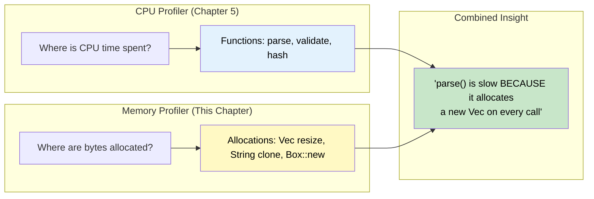
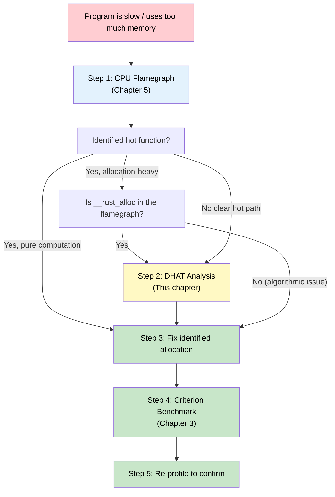

# 6. Memory Profiling and Heap Analysis 🔴

> **What you'll learn:**
> - How heap allocation works at the system level — `malloc`, `jemalloc`, and Rust's `GlobalAlloc` trait
> - How to use **DHAT** (Dynamic Heap Analysis Tool) to track every allocation, measuring where bytes are allocated, how long they live, and whether they're wasted
> - How to reveal the hidden costs of `Arc::clone`, `Box`, `Vec` resizing, and `String` conversions in hot loops
> - How to find memory leaks and bloat using allocation tracking and `Valgrind`/`heaptrack`

---

## Why Memory Profiling Matters

CPU profiling (Chapter 5) tells you *where time is spent*. Memory profiling tells you *where bytes are spent*. These are complementary:

- A flamegraph may show `__rust_alloc` is hot — but *what* is being allocated?
- Your program uses 2 GB of RAM — but *where* does that memory live?
- You're seeing GC pauses in Python or Go — in Rust, you instead see allocator contention. Which allocation is causing it?



## How Heap Allocation Works in Rust

Every `Box::new`, `Vec::push` (that triggers growth), `String::from`, and `Arc::new` eventually calls the global allocator:

```rust
// What you write:
let v = vec![1, 2, 3];

// What the compiler generates (simplified):
// 1. Calculate layout: 3 × size_of::<i32>() = 12 bytes, align = 4
// 2. Call GlobalAlloc::alloc(Layout { size: 12, align: 4 })
// 3. Write [1, 2, 3] into the allocated memory
// 4. Construct Vec { ptr, len: 3, cap: 3 }
```

The default global allocator on most platforms is the system allocator (`malloc`/`free`). You can replace it:

```rust
// Use jemalloc for better multi-threaded performance:
#[global_allocator]
static ALLOC: tikv_jemallocator::Jemalloc = tikv_jemallocator::Jemalloc;

// Or use a counting allocator for profiling:
#[global_allocator]
static ALLOC: dhat::Alloc = dhat::Alloc;
```

## DHAT: Dynamic Heap Analysis Tool

DHAT is Valgrind's heap profiler, and `dhat-rs` is a pure-Rust implementation that works everywhere (no Valgrind required). It intercepts every allocation and records:

| Metric | What It Tells You |
|--------|-------------------|
| **Total bytes allocated** | Raw allocation volume |
| **Total blocks allocated** | Number of allocation calls |
| **Max bytes live** | Peak memory usage |
| **At-exit bytes live** | Potential leaks |
| **Block lifetime** | How long each allocation lives before being freed |
| **Access count** | How many times the allocated memory was read/written |
| **Allocation site** | The exact call stack where the allocation happened |

### Setup

```toml
[dependencies]
dhat = "0.3"

# For benchmarking with dhat:
[features]
dhat-heap = []   # Feature-gate so dhat doesn't affect normal builds
```

### Basic Usage

```rust
#[cfg(feature = "dhat-heap")]
#[global_allocator]
static ALLOC: dhat::Alloc = dhat::Alloc;

fn main() {
    // Initialize dhat profiling (must be before any allocations you want to track)
    #[cfg(feature = "dhat-heap")]
    let _profiler = dhat::Profiler::new_heap();

    // ... your program logic ...
    run_program();

    // When _profiler is dropped, dhat writes its report to dhat-heap.json
}
# fn run_program() {}
```

```bash
# Build and run with dhat enabled
cargo run --features dhat-heap

# This creates dhat-heap.json — open it in the DHAT viewer:
# https://nnethercote.github.io/dh_view/dh_view.html
```

### Reading DHAT Output

The DHAT viewer shows a tree of allocation sites, sorted by total bytes:

```text
Total:     1,234,567 bytes in 45,678 blocks
At t-gmax: 234,567 bytes in 1,234 blocks   (peak live memory)
At t-end:  0 bytes in 0 blocks              (no leaks!)

PP 1/45,678 {
  Total:     800,000 bytes (64.8%) in 10,000 blocks (21.9%)
  Max:       80,000 bytes in 1,000 blocks
  At t-gmax: 80,000 bytes (34.1%) in 1,000 blocks (81.0%)
  Allocated at {
    myparser::process_record (src/parser.rs:42)
    → alloc::vec::Vec::push
    → alloc::raw_vec::RawVec::grow_amortized
    → alloc::alloc::Global::alloc
  }
}
```

This tells you: `process_record` at line 42 in `parser.rs` is responsible for **64.8% of all bytes allocated** via `Vec::push` growing the vector.

## The Hidden Costs of Smart Pointers

The [Smart Pointers](../smart-pointers-book/src/SUMMARY.md) guide teaches what `Arc`, `Box`, `Rc`, and `Cow` are. This chapter shows what they **cost**:

### `Box::new` in a Hot Loop

```rust
/// 💥 FAILS IN PRODUCTION (performance):
/// Every iteration allocates a Box on the heap.
fn process_items_v1(items: &[Item]) -> Vec<Box<Result>> {
    items.iter().map(|item| {
        Box::new(process_single(item))  // Heap allocation per item
    }).collect()
}
# struct Item; struct Result;
# fn process_single(_: &Item) -> Result { Result }
```

DHAT output for 1M items:
```text
Total: 48,000,000 bytes in 1,000,000 blocks
  ^^^^ 48 bytes/Result × 1M = 48MB of heap allocation
  At: process_items_v1 → Box::new → __rust_alloc
```

```rust
/// ✅ FIX: Return values directly — no Box needed if Result is reasonably sized
fn process_items_v2(items: &[Item]) -> Vec<Result> {
    items.iter().map(|item| {
        process_single(item)  // Stack-allocated, moved into Vec
    }).collect()
}
# struct Item; struct Result;
# fn process_single(_: &Item) -> Result { Result }
```

### `Arc::clone` Frequency

`Arc::clone` is cheap (atomic increment, ~20ns), but if you clone millions of times, it adds up:

```rust
use std::sync::Arc;

/// 💥 FAILS IN PRODUCTION (performance):
/// Cloning Arc inside a tight loop creates atomic contention.
fn distribute_config_v1(config: &Arc<Config>, tasks: &[Task]) {
    for task in tasks {
        let cfg = Arc::clone(config);  // Atomic increment per task
        process_task(task, cfg);
    }
}
# struct Config; struct Task;
# fn process_task(_: &Task, _: Arc<Config>) {}
```

DHAT won't show allocations here (Arc::clone doesn't allocate), but `perf stat` will show high atomic contention:

```bash
perf stat -e cache-misses,instructions ./target/release/myapp
# cache-misses: 2,345,678  ← Arc's atomic counter bouncing between CPU caches
```

```rust
/// ✅ FIX: Pass &Config instead of cloning Arc, if tasks are processed sequentially
fn distribute_config_v2(config: &Config, tasks: &[Task]) {
    for task in tasks {
        process_task_ref(task, config);  // No atomic operations
    }
}
# struct Config; struct Task;
# fn process_task_ref(_: &Task, _: &Config) {}
```

### `Vec` Resizing Costs

```rust
/// 💥 FAILS IN PRODUCTION (performance):
/// Vec starts with capacity 0 and doubles on each resize:
/// 0 → 4 → 8 → 16 → 32 → ... → 1,048,576
/// That's ~20 reallocations + memcpy for 1M elements.
fn collect_results_v1(n: usize) -> Vec<u64> {
    let mut results = Vec::new();  // capacity = 0
    for i in 0..n {
        results.push(compute(i));  // Triggers realloc ~20 times for n=1M
    }
    results
}
# fn compute(i: usize) -> u64 { i as u64 }
```

DHAT output:
```text
Total: 16,777,200 bytes in 21 blocks
  ^^^^ 21 allocations from Vec growing: 32, 64, 128, ... 8,388,608 bytes
  Each growth copies all existing elements.
```

```rust
/// ✅ FIX: Pre-allocate with known capacity
fn collect_results_v2(n: usize) -> Vec<u64> {
    let mut results = Vec::with_capacity(n);  // Single allocation
    for i in 0..n {
        results.push(compute(i));  // No reallocations
    }
    results
}
# fn compute(i: usize) -> u64 { i as u64 }
```

DHAT output after fix:
```text
Total: 8,000,000 bytes in 1 block
  ^^^^ Single allocation, no copies!
```

## Using DHAT in Tests

You can use DHAT assertions in tests to **enforce allocation budgets**:

```rust
#[cfg(test)]
mod tests {
    #[test]
    fn allocation_budget() {
        let _profiler = dhat::Profiler::builder().testing().build();

        // Run the code under test
        let result = super::collect_results_v2(1000);
        assert_eq!(result.len(), 1000);

        // Assert allocation behavior
        let stats = dhat::HeapStats::get();

        // We expect exactly 1 allocation (the Vec)
        assert_eq!(stats.total_blocks, 1,
            "Expected 1 allocation, got {}", stats.total_blocks);

        // We expect 8000 bytes (1000 × 8 bytes per u64)
        assert_eq!(stats.total_bytes, 8000,
            "Expected 8000 bytes, got {}", stats.total_bytes);
    }
}
```

This turns memory behavior into a testable property — if someone adds an accidental allocation, the test catches it.

## Finding Memory Leaks

In Rust, true leaks (memory never freed) are rare because of RAII. But **logical leaks** — memory that's freed eventually but grows unboundedly — are common:

```rust
use std::collections::HashMap;

/// 💥 FAILS IN PRODUCTION: Unbounded cache growth
struct LeakyCache {
    cache: HashMap<String, Vec<u8>>,
}

impl LeakyCache {
    fn insert(&mut self, key: String, value: Vec<u8>) {
        // Keys are never removed → memory grows without bound
        self.cache.insert(key, value);
    }
}
```

DHAT's "At t-gmax" metric reveals this: peak live memory keeps growing toward "At t-end" (non-zero bytes at exit = probable leak or unbounded growth).

### ✅ FIX: Bounded cache with eviction

```rust
use std::collections::HashMap;

/// ✅ FIX: LRU-style bounded cache
struct BoundedCache {
    cache: HashMap<String, Vec<u8>>,
    max_entries: usize,
    insertion_order: Vec<String>,
}

impl BoundedCache {
    fn new(max_entries: usize) -> Self {
        Self {
            cache: HashMap::with_capacity(max_entries),
            max_entries,
            insertion_order: Vec::with_capacity(max_entries),
        }
    }

    fn insert(&mut self, key: String, value: Vec<u8>) {
        if self.cache.len() >= self.max_entries {
            // Evict oldest entry
            if let Some(oldest) = self.insertion_order.first().cloned() {
                self.cache.remove(&oldest);
                self.insertion_order.remove(0);
            }
        }
        self.insertion_order.push(key.clone());
        self.cache.insert(key, value);
    }
}
```

## Alternative Tools

| Tool | Platform | How It Works | Best For |
|------|----------|-------------|----------|
| **dhat-rs** | All | Custom GlobalAlloc, pure Rust | Precise per-allocation tracking |
| **Valgrind (Massif)** | Linux | Binary instrumentation | Heap snapshots over time |
| **heaptrack** | Linux | LD_PRELOAD interception | Timeline of allocations with GUI |
| **Instruments (Allocations)** | macOS | System profiler | GUI timeline + allocation stacks |
| **jemalloc `--enable-prof`** | Linux/macOS | jemalloc built-in profiling | Production heap profiling |
| **bytehound** | Linux | LD_PRELOAD + custom format | Web-based heap analysis UI |

### Using heaptrack (Linux)

```bash
# Install
sudo apt install heaptrack heaptrack-gui  # Debian/Ubuntu

# Profile
heaptrack ./target/release/myparser input.dat

# Analyze (opens GUI)
heaptrack_gui heaptrack.myparser.*.zstd
```

heaptrack's GUI shows:
- **Allocation timeline** — when memory was allocated and freed
- **Flame graph of allocation sites** — like dhat but visual
- **Leak detection** — allocations never freed
- **Temporary allocations** — allocated and immediately freed (optimization targets)

## The Profiling Workflow: CPU + Memory Combined



---

<details>
<summary><strong>🏋️ Exercise: Profile and Eliminate Allocation Waste</strong> (click to expand)</summary>

**Challenge:** The following function processes log lines, extracting and deduplicating IP addresses. It works correctly but allocates far more than necessary. Your task:

1. Add `dhat` profiling and measure the allocation baseline
2. Identify which allocations are wasteful using the DHAT viewer
3. Optimize the function to reduce total allocations by at least 5×
4. Write a DHAT assertion test to enforce the new allocation budget

```rust
use std::collections::HashSet;

/// Extract unique IP addresses from log lines.
/// Each line has format: "TIMESTAMP IP_ADDRESS MESSAGE"
///
/// 💥 Excessive allocation: every line creates multiple Strings
fn extract_unique_ips_v1(log_data: &str) -> Vec<String> {
    let mut seen = HashSet::new();
    let mut result = Vec::new();

    for line in log_data.lines() {
        let parts: Vec<&str> = line.split_whitespace().collect(); // Allocates Vec
        if parts.len() >= 2 {
            let ip = parts[1].to_string();  // Allocates String for EVERY line
            if seen.insert(ip.clone()) {    // Clones the String again!
                result.push(ip);
            }
        }
    }
    result
}
```

<details>
<summary>🔑 Solution</summary>

**Step 1: DHAT baseline**

```rust
#[cfg(feature = "dhat-heap")]
#[global_allocator]
static ALLOC: dhat::Alloc = dhat::Alloc;

fn main() {
    #[cfg(feature = "dhat-heap")]
    let _profiler = dhat::Profiler::new_heap();

    let log_data = generate_test_logs(100_000); // 100K lines, ~1000 unique IPs
    let ips = extract_unique_ips_v1(&log_data);
    println!("Found {} unique IPs", ips.len());
}
```

DHAT baseline shows:
```text
Total: ~3,200,000 bytes in ~200,000 blocks
  - 100,000 Vec<&str> allocations (from .collect())
  - 100,000 String allocations (from .to_string())
  - ~1,000 String clones (from .insert())
```

**Step 2: Identify waste**

- `split_whitespace().collect::<Vec<_>>()` allocates a Vec *every line* just to index into it — use `.nth()` instead
- `to_string()` allocates a String for every IP — most are duplicates that are immediately discarded
- `ip.clone()` clones the String when inserting into the `HashSet` — unnecessary double allocation

**Step 3: Optimized version**

```rust
use std::collections::HashSet;

/// ✅ FIX: Minimize allocations by working with &str as long as possible
fn extract_unique_ips_v2(log_data: &str) -> Vec<String> {
    let mut seen: HashSet<&str> = HashSet::new();

    for line in log_data.lines() {
        // Use nth() instead of collect() — no Vec allocation
        if let Some(ip) = line.split_whitespace().nth(1) {
            seen.insert(ip); // &str — no allocation, borrows from log_data
        }
    }

    // Single batch of String allocations at the end — only for unique IPs
    seen.into_iter().map(String::from).collect()
}
```

DHAT after optimization:
```text
Total: ~20,000 bytes in ~1,001 blocks
  - 1 HashSet allocation
  - ~1,000 String allocations (only for unique IPs, at the end)
```

**Reduction: from ~200,000 blocks to ~1,001 — over 200× fewer allocations!**

**Step 4: DHAT assertion test**

```rust
#[cfg(test)]
mod tests {
    use super::*;

    #[test]
    fn allocation_budget() {
        let _profiler = dhat::Profiler::builder().testing().build();

        // 1000 log lines with 50 unique IPs
        let log_data = (0..1000)
            .map(|i| format!("2024-01-01T00:00:00 192.168.1.{} GET /index", i % 50))
            .collect::<Vec<_>>()
            .join("\n");

        let ips = extract_unique_ips_v2(&log_data);
        assert_eq!(ips.len(), 50);

        let stats = dhat::HeapStats::get();
        // Allow some overhead for HashSet internals, but cap total blocks
        assert!(stats.total_blocks < 200,
            "Too many allocations: {} (expected < 200)", stats.total_blocks);
    }
}
```

</details>
</details>

---

> **Key Takeaways**
> - **CPU profiling tells you where time goes; memory profiling tells you where bytes go.** You need both for a complete performance picture.
> - **DHAT** (`dhat-rs`) tracks every heap allocation with zero configuration — just swap the global allocator and read the JSON report.
> - The most common memory wastes in Rust: `Vec` without `with_capacity`, `String::clone` / `.to_string()` in loops, `Box::new` in hot paths, and unbounded caches.
> - **Turn allocation budgets into tests** using `dhat::HeapStats` — if someone introduces a regression, the test catches it.
> - Think in terms of **allocation sites**: not "my program uses 2 GB" but "this function at line 42 accounts for 800 MB because it allocates a Vec per record."

> **See also:**
> - [Chapter 5: CPU Profiling](ch05-cpu-profiling-flamegraphs.md) — when `__rust_alloc` appears in your flamegraph, come here to find out *what* is being allocated
> - [Smart Pointers](../smart-pointers-book/src/SUMMARY.md) — understanding the memory layout behind `Box`, `Arc`, `Rc`, `Cow`
> - [Memory Management](../memory-management-book/src/SUMMARY.md) — ownership model that determines when allocations are freed
> - [Chapter 7: Capstone](ch07-capstone-hardened-parser.md) — applying DHAT to a real parser project
